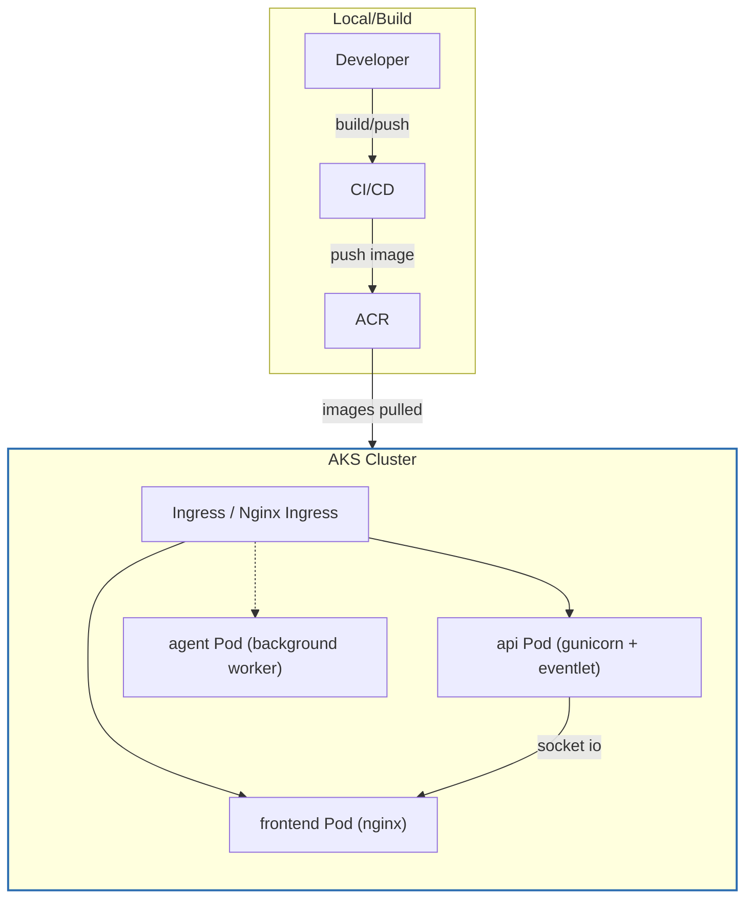
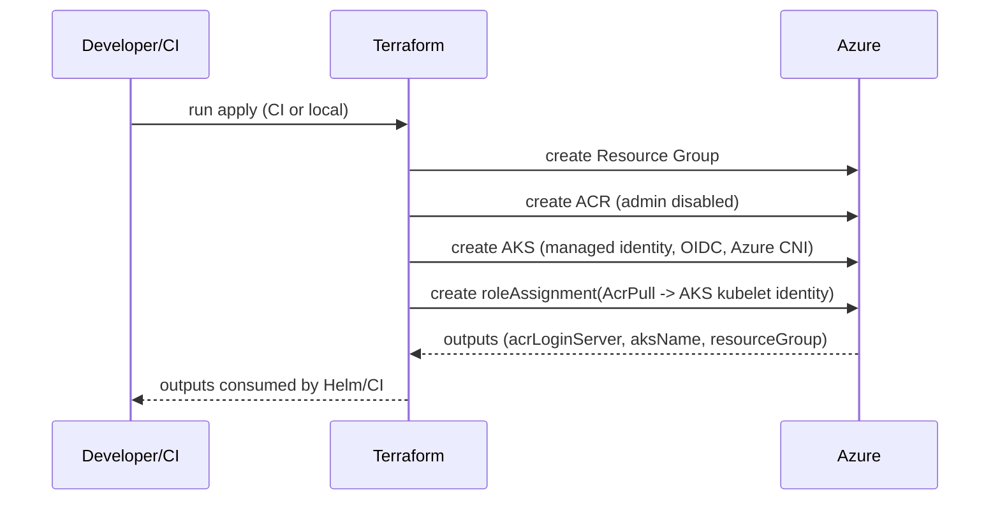
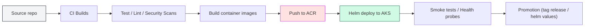

# IaC repository — concise documentation

## Purpose
- Deploy a 3-container application (api, agent, frontend) for:
    - Local development: `docker-compose`
    - Production: AKS + Helm
- Terraform provisions cloud infra (Resource Group, ACR, AKS) and grants AKS pull access to ACR.

## Architecture summary
- Containers
    - **api**: Python Flask + Socket.IO. Production runs under a WSGI server with a WebSocket-capable worker.
    - **agent**: Background worker (model warmup / async tasks) with a health endpoint.
    - **frontend**: React build served by Nginx.
- Orchestration: Helm chart (`dp-stock`) deploys Deployments, Services, and optional Ingress routing `/` → frontend and `/api` → API.
- Cloud: Terraform creates RG, ACR (admin disabled), AKS (managed identity + OIDC + Azure CNI) and assigns `AcrPull` to the AKS identity. Outputs include ACR login server, AKS name, and resource group.

### Diagrams

Architecture (runtime)



IaC provisioning flow (Terraform → Azure)


CI/CD pipeline (build → push → deploy)


<!-- Ensure your markdown renderer supports Mermaid (GitHub/GitLab/VS Code with Mermaid extension) for these diagrams to render. -->

Notes (quick)
- Ensure CI authenticates to ACR (service principal / managed identity / OIDC flow) — do not enable ACR admin user.
- Terraform outputs (ACR login server, AKS kube config / name, resource group) should be consumed by the CI pipeline to perform Helm deploys and image pushes.
- Keep probe paths and ports aligned across Dockerfiles, docker-compose, Helm values, and health checks in CI smoke tests.
- Use promotion tags and separate values files per environment (dev/staging/prod) rather than rebuilding identical images for each environment.
- Secure secrets with pipeline-secret stores or Key Vault integrations; avoid baking credentials into images or repository.
- Validate locally (docker-compose) before CI pushes images to ACR and deploying to AKS.

---

## Repository / IaC layout (high level)
- `Dockerfile.api` — builds API image. Production: run with gunicorn + eventlet/gevent using `src.wsgi:app`.
- `Dockerfile.agent` — builds agent image; exposes and probes a dedicated health endpoint.
- `helm/dp-stock` — Helm chart:
    - `values.yaml`: default image repo/tag, replicas, ports, ingress toggle.
    - `templates/`: deployments (api, agent, frontend), services, ingress, helpers.
    - Probes in deployments must match application health endpoints.
- `infra/terraform` — provider + resources for cloud infra, node sizing variables, and role assignments.
- `docker-compose.yml` — local compose to build the three images and expose API and frontend for quick validation.

---

## Dockerfiles / Container notes
- Dockerfile.api
    - Builds Flask/Socket.IO API container.
    - Expose: `5000`
    - Health endpoint: `/api/health`
    - Production CMD example:
        ```bash
        gunicorn -k eventlet -w 1 -b 0.0.0.0:5000 "src.wsgi:app"
        ```
    - Ensure `gunicorn` and a WebSocket-capable worker (`eventlet` or `gevent`) are in `requirements.txt`.
- Dockerfile.agent
    - Builds agent/background worker (LangChain/model warmup, etc.).
    - Expose: `7000`
    - Health endpoint: `/health`
- Frontend
    - Nginx serves the React build.
    - Expose: `80`
    - Health endpoint: `/healthz`

---

## Helm chart (helm/dp-stock)
- `Chart.yaml`: metadata
- `values.yaml`: image.repo, image.tag, replica counts, service ports, ingress config
- `templates/`
    - `deployment-api.yaml`: containerPort `5000`, probes on `/api/health`
    - `service-api.yaml`: ClusterIP for API
    - `deployment-agent.yaml`: containerPort `7000`, probes on `/health`
    - `deployment-frontend.yaml`: containerPort `80`, probes on `/healthz`
    - `service-frontend.yaml`: ClusterIP for frontend
    - `ingress.yaml`: optional; route `/` → frontend and `/api` → API
- Tip: override `image.repository` and `image.tag` per environment via Helm values/CI.

---

## Terraform infra (infra/terraform)
- `providers.tf`: pins `azurerm` provider, enables features
- `variables.tf`: project/location/node size/count
- `main.tf` provisions:
    - Resource Group
    - ACR (admin disabled)
    - AKS (managed identity, OIDC enabled, Azure CNI), RBAC on
    - Role assignment: `AcrPull` for AKS kubelet identity
    - Outputs: ACR login server, AKS name, resource group

---

## Root docker-compose.yml
- Builds:
    - API: `IaC/Dockerfile.api`
    - Agent: `IaC/Dockerfile.agent`
    - Frontend: `frontend/Dockerfile`
- Local bridge network, maps:
    - API: container `5000`
    - Frontend: host `3000` → container `80`
- Good for local validation before Helm/AKS deployment.

---

## Ports & health endpoints
- API: containerPort `5000`, probe `GET /api/health`
- Agent: containerPort `7000`, probe `GET /health`
- Frontend: containerPort `80`, probe `GET /healthz`
- Local compose: frontend host port `3000` → container `80`

---

## Run guidance & best practices
- Local dev
    - Use the Python entry (`main.py`) for Socket.IO dev server. Avoid unsafe Werkzeug flags.
    - Validate builds and behavior with `docker-compose` before deploying to Kubernetes.
- Production container
    - Start API with gunicorn using `src.wsgi:app` and an eventlet/gevent worker (example above).
    - Ensure runtime requirements include `gunicorn` and a WebSocket-capable worker library.
- Configuration
    - Make CORS origins configurable via environment variables (default may include `http://localhost:3000` for local dev).
    - Do not bake secrets into images — use environment variables or a secrets store (e.g., Key Vault) in production.
- Helm
    - Override `image.repository` and `image.tag` per environment.
    - Ensure probe paths/ports in `values.yaml` match container endpoints.

---

## Notes / pitfalls to avoid
- Keep probe endpoints and ports consistent across `docker-compose`, Dockerfiles, and Helm templates.
- Ensure AKS has pull access to ACR (`AcrPull` role assignment to kubelet identity).
- Use managed identities and OIDC where possible for secure auth flows.
- Validate locally before promoting images to registries and deploying to AKS.
- Do not bake secrets into images; use env vars or Key Vault for production secrets.

## Local Deployment

Prerequisites
- Docker Desktop with Kubernetes enabled, kubectl, and Helm installed.

Build local images
```powershell
docker build -t dpstock-api:local -f IaC/Dockerfile.api .
docker build -t dpstock-agent:local -f IaC/Dockerfile.agent .
docker build -t dpstock-frontend:local -f frontend/Dockerfile frontend
```

Local Helm values override (IaC/helm/dp-stock/values.local.yaml)
```yaml
api:
  image: { repository: dpstock-api, tag: local, pullPolicy: Never }
  replicaCount: 1
agent:
  image: { repository: dpstock-agent, tag: local, pullPolicy: Never }
  replicaCount: 1
frontend:
  image: { repository: dpstock-frontend, tag: local, pullPolicy: Never }
  replicaCount: 1
ingress:
  enabled: false
```

Install to local cluster
```powershell
kubectl create namespace dp-stock --dry-run=client -o yaml | kubectl apply -f -
helm upgrade -i dp-stock IaC/helm/dp-stock -n dp-stock -f IaC/helm/dp-stock/values.local.yaml
kubectl get pods,svc -n dp-stock
```

Access services (port-forward)
```powershell
kubectl -n dp-stock port-forward svc/dp-stock-frontend 3000:80
kubectl -n dp-stock port-forward svc/dp-stock-api 5000:5000
```

Smoke tests
```powershell
curl http://localhost:5000/api/health
curl http://localhost:3000/healthz
```

Optional: enable Ingress locally (requires controller)
```powershell
helm repo add ingress-nginx https://kubernetes.github.io/ingress-nginx
helm repo update
helm upgrade -i ingress-nginx ingress-nginx/ingress-nginx -n ingress-nginx --create-namespace
```
Enable in values.local.yaml:
```yaml
ingress:
  enabled: true
  className: nginx
  host: localtest.me
  tls: false
```
Browse:
- http://localtest.me/
- http://localtest.me/api/health

Validate and render chart
```powershell
helm lint IaC/helm/dp-stock
helm template dp-stock IaC/helm/dp-stock -n dp-stock -f IaC/helm/dp-stock/values.local.yaml | Out-File rendered.yaml -Encoding utf8
```

Cleanup
```powershell
helm uninstall dp-stock -n dp-stock
kubectl delete ns dp-stock
```

## Troubleshooting cmds

This section collects and summarizes key troubleshooting commands for kubectl, kind, and docker, focused on local Kubernetes deployments. Use these to diagnose and fix common issues like ErrImagePull, CrashLoopBackOff, and network problems. Validate locally before deploying to Azure AKS to avoid production issues.

### 1. Cluster and Context Setup
- Switch to Docker Desktop context: `kubectl config use-context docker-desktop`
- Check cluster info: `kubectl cluster-info`
- List nodes: `kubectl get nodes`
- Create Kind cluster: `kind create cluster --name dp-stock-local`
- Switch to Kind context: `kubectl config use-context kind-dp-stock-local`

### 2. Building and Managing Images with Docker
- Build images:
  - `docker build -f IaC\Dockerfile.api -t dp-stock/api:dev .`
  - `docker build -f IaC\Dockerfile.agent -t dp-stock/agent:dev .`
  - `docker build -f frontend\Dockerfile -t dp-stock/frontend:dev .`
- List images: `docker images | findstr dp-stock`
- Save/load images for K8s sync:
  - `docker save dp-stock/api:dev -o api.tar`
  - `docker load -i api.tar`
  - Remove tar: `Remove-Item api.tar`
- Load into Kind: `kind load docker-image dp-stock/api:dev --name dp-stock-local`

### 3. Deploying and Managing with Helm/kubectl
- Install/update Helm release: `helm upgrade --install dp-stock .\IaC\helm\dp-stock -n dp-stock -f .\IaC\helm\dp-stock\values.local.yaml`
- Check deployments, pods, services: `kubectl -n dp-stock get deploy,po,svc`
- Check rollout status: `kubectl -n dp-stock rollout status deploy/dp-stock-api --timeout=180s`
- Delete specific pod to force redeploy: `kubectl -n dp-stock delete pod <pod-name>`
- Scale deployment: `kubectl -n dp-stock scale deploy dp-stock-frontend --replicas=0` then `--replicas=1`

### 4. Inspecting Pods and Logs
- Get pod details: `kubectl -n dp-stock get pods -o wide`
- Describe pod: `kubectl -n dp-stock describe pod <pod-name>`
- View logs: `kubectl -n dp-stock logs deploy/dp-stock-api --tail=200`
- View previous crash logs: `kubectl -n dp-stock logs pod/<pod-name> --previous`
- Test pod creation: `kubectl run temp-pod --image=dp-stock/api:dev --restart=Never -- sh -c "echo 'Image loaded successfully'"`

### 5. Network and Service Inspection
- Check endpoints: `kubectl -n dp-stock get endpoints dp-stock-frontend`
- Describe service: `kubectl -n dp-stock describe svc dp-stock-frontend`
- Port-forward: `kubectl -n dp-stock port-forward svc/dp-stock-frontend 3000:80`
- Test connectivity inside cluster: `kubectl -n dp-stock run test-pod --image=busybox --rm -it -- sh` (then `wget http://dp-stock-frontend:80/healthz`)

### 6. Cleanup
- Uninstall Helm release: `helm uninstall dp-stock -n dp-stock`
- Delete namespace: `kubectl delete ns dp-stock`
- Delete Kind cluster: `kind delete cluster --name dp-stock-local`

### Quick Tips
- Always rebuild images after config changes (e.g., nginx.conf).
- Use `pullPolicy: Never` for local images to avoid registry pulls.
- For ErrImagePull, load images into the K8s node.
- For CrashLoopBackOff, check logs and rebuild if config is outdated.
- Validate with `docker-compose` before K8s deployment.
- For Azure production, ensure these local validations prevent AKS deployment failures (e.g., image pull issues or misconfigured probes)