# DP Stock Investment Assistant — Architecture Review

> **Document Purpose:** Comprehensive technical review of the current system architecture, covering the full stack (frontend, backend API, AI agent, database, infrastructure), with an assessment of design strengths, improvement opportunities, and an enhancement roadmap toward a modern, progressive web application.
>
> **Date:** March 2026  
> **Scope:** Full-stack review — Frontend (React/TypeScript), Backend API (Python/Flask), AI Agent (LangGraph), Data Layer (MongoDB/Redis), Infrastructure (Docker/Kubernetes/Azure)

---

## Table of Contents

1. [Executive Summary](#1-executive-summary)
2. [System Architecture Overview](#2-system-architecture-overview)
3. [Frontend Architecture](#3-frontend-architecture)
4. [Backend API Architecture](#4-backend-api-architecture)
5. [AI Agent & LLM Architecture](#5-ai-agent--llm-architecture)
6. [Data Layer Architecture](#6-data-layer-architecture)
7. [Infrastructure & Deployment](#7-infrastructure--deployment)
8. [Cross-Cutting Concerns](#8-cross-cutting-concerns)
9. [Strengths Summary](#9-strengths-summary)
10. [Improvement Opportunities & Recommendations](#10-improvement-opportunities--recommendations)
11. [Enhancement Roadmap](#11-enhancement-roadmap)

---

## 1. Executive Summary

**DP Stock Investment Assistant** is an AI-powered, full-stack investment analysis platform. Users interact with an LLM-driven chat interface to ask questions about stocks, receive real-time streaming responses, and manage investment workspaces. The system integrates multi-provider LLMs (OpenAI, xAI/Grok), a ReAct-pattern LangGraph agent with tool orchestration, session-aware multi-turn conversation memory, and a React 18 TypeScript frontend.

### Key Technology Decisions

| Layer | Technology | Version | Status |
|-------|-----------|---------|--------|
| Frontend Framework | React | 18.3.1 | ✅ Current |
| Frontend Build Tool | Create React App | 5.0.1 | ⚠️ Deprecated |
| Language | TypeScript | 5.x | ✅ Current |
| Backend Framework | Flask | 2.3+ | ✅ Stable |
| WebSocket | Flask-SocketIO | 5.3+ | ✅ Current |
| Agent Framework | LangGraph | 0.2.62+ | ✅ Current |
| LLM Clients | OpenAI SDK + httpx | 1.0+ | ✅ Current |
| Database | MongoDB | 5.0+ | ✅ Stable |
| Cache | Redis | 6.2+ | ✅ Stable |
| WSGI Server | Gunicorn + Eventlet | latest | ✅ Production-ready |
| Containers | Docker + Helm | latest | ✅ Current |
| Cloud IaC | Terraform (Azure) | 1.x | ✅ Current |

### Assessment at a Glance

| Domain | Rating | Key Finding |
|--------|--------|-------------|
| Frontend UI/UX | 🟡 Fair | Functional but developer-centric; lacks design system and modern tooling |
| Frontend Architecture | 🟡 Fair | Solid hooks pattern; needs state management lift and code splitting |
| Backend API | 🟢 Good | Clean blueprint pattern, DI, and service layers; solid foundation |
| AI Agent | 🟢 Good | Well-designed LangGraph ReAct agent with memory and fallback |
| Data Layer | 🟢 Good | Repository pattern, proper caching strategies |
| Infrastructure | 🟢 Good | Production-ready with Helm, Terraform, and CI/CD |
| Security | 🔴 Needs Work | No auth, hardcoded secrets, no rate limiting |
| Observability | 🟡 Fair | Logging exists; metrics and tracing need expansion |
| Testing | 🟡 Fair | Good backend coverage; frontend has zero tests |

---

## 2. System Architecture Overview

### 2.1 High-Level Architecture

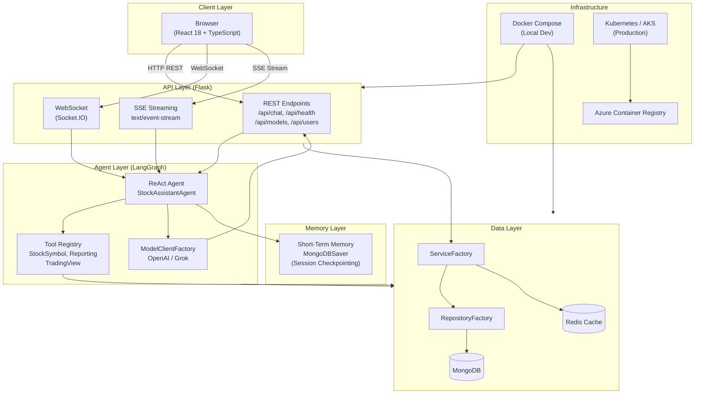

### 2.2 Request Flow Diagram

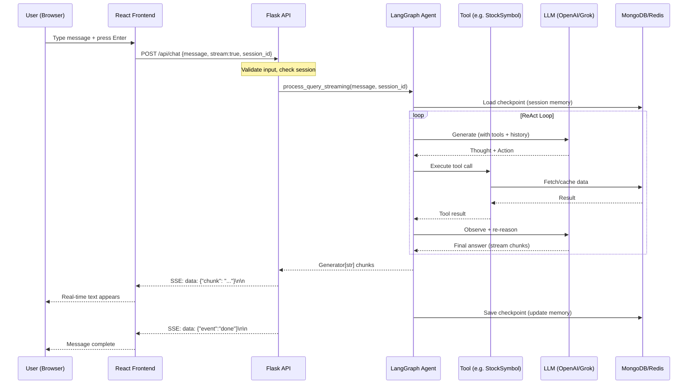

### 2.3 Data Flow Architecture

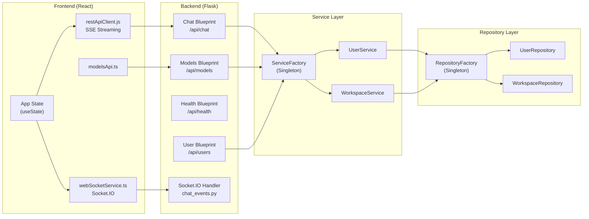

---

## 3. Frontend Architecture

### 3.1 Current Stack

| Category | Technology | Notes |
|----------|-----------|-------|
| Framework | React 18.3.1 | Functional components + hooks |
| Language | TypeScript 5.x | Strict mode enabled |
| Build Tool | Create React App 5.0.1 | **Deprecated** — no longer maintained |
| WebSocket | socket.io-client 4.8.1 | Type definitions mismatch (`@types/socket.io-client ^1.4.36`) |
| HTTP Client | Fetch API (native) | Multiple wrapper files |
| Styling | Inline styles | No design system or CSS framework |
| State Management | useState + hooks | Only local/component state |
| Routing | None | Single-page, no URL navigation |
| Testing | Jest (via CRA) | No test files written |
| Containerization | Multi-stage Docker + Nginx | Production-ready |

### 3.2 Component Structure

```
frontend/src/
├── App.tsx                          # Root component (600+ lines) — monolith
├── App.css                          # Basic styles
├── index.tsx                        # React DOM entry
├── index.css                        # Global reset
├── config.ts                        # API config constants
│
├── components/
│   ├── MessageFormatter.js          # Message rendering — plain JS, no types
│   ├── OptimizedApp.js              # Alternative app — plain JS, unused
│   ├── PerformanceProfiler.js       # Performance util — plain JS, no types
│   ├── WebSocketTest.tsx            # Debug component (TypeScript)
│   └── models/
│       └── ModelSelector.tsx        # LLM model selector dropdown
│
├── services/
│   ├── apiService.ts                # REST client (partially used)
│   ├── modelsApi.ts                 # Models API client
│   ├── restApiClient.js             # Primary REST client — plain JS, no types
│   └── webSocketService.ts          # Socket.IO wrapper
│
├── types/
│   └── models.ts                    # Model-related TypeScript interfaces
│
└── utils/
    ├── performance.js               # Performance utilities — plain JS
    └── uuid.ts                      # UUID generation
```

### 3.3 State Management Analysis

The application uses a **single-component state pattern** — all state lives in `App.tsx`:

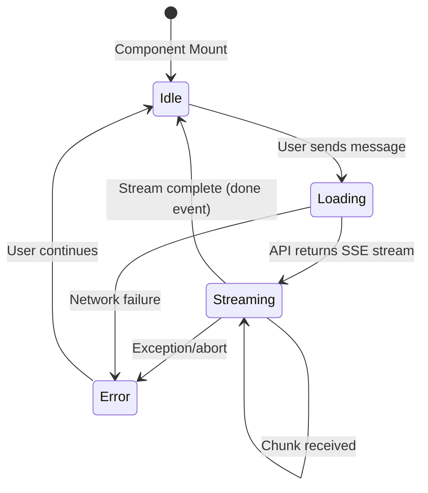

**Current State Variables in App.tsx:**
- `messages: Message[]` — conversation history
- `inputValue: string` — text input
- `isLoading: boolean` — loading indicator
- `isConnected: boolean` — connection status
- `error: string | null` — error display
- `selectedProvider: string | undefined` — LLM provider override

**Assessment:** Works for a single-conversation MVP, but will not scale to:
- Multi-workspace / multi-conversation tabs
- Persistent sessions across page refreshes
- Concurrent streaming from multiple sources
- Complex UI interactions (panels, settings, analytics)

### 3.4 Communication Architecture

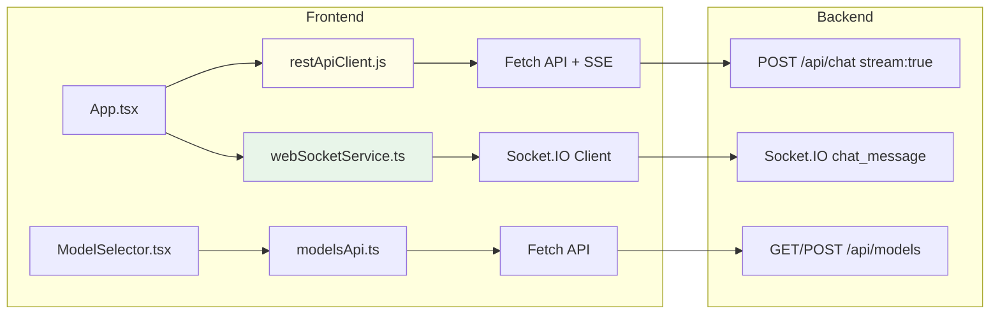

**Issue:** There are **three separate API clients** (`restApiClient.js`, `apiService.ts`, `modelsApi.ts`) with overlapping functionality but different implementations. `App.tsx` uses `restApiClient.js` (plain JS) while `apiService.ts` (TypeScript) is defined but not used by the main app. The `webSocketService.ts` is implemented but also not actively used in `App.tsx` — the app exclusively uses SSE streaming.

### 3.5 Key Frontend Strengths

✅ **React 18 + TypeScript Strict Mode** — Modern framework with type safety  
✅ **SSE Streaming Implementation** — Correctly uses `ReadableStream` + `AbortController` for cancellable streaming  
✅ **isMounted Guard in ModelSelector** — Prevents state updates on unmounted components  
✅ **Centralized Config** — `config.ts` centralizes API endpoints and theme tokens  
✅ **Session ID Support** — UUID-based session tracking for multi-turn conversations  
✅ **Multi-stage Docker Build** — Nginx-served production container with health endpoint  
✅ **AbortController Streaming Cancellation** — Users can cancel in-flight requests  

### 3.6 Frontend Issues & Improvement Areas

#### 🔴 Critical Issues

| Issue | Location | Impact |
|-------|----------|--------|
| **CRA (Create React App) is deprecated** | `package.json` | No maintenance, security exposure, slow builds |
| **Hardcoded localhost URLs** | `App.tsx:L21`, `webSocketService.ts` | Breaks non-localhost deployments |
| **Mixed JS/TS files** | `restApiClient.js`, `MessageFormatter.js`, `performance.js` | No type safety on critical paths |
| **No authentication/session management** | Entire app | Security gap |

#### 🟡 Improvement Areas

| Area | Issue | Recommendation |
|------|-------|----------------|
| **Build Tool** | CRA → deprecated | Migrate to **Vite** or **Next.js** |
| **State Management** | All state in App.tsx | Extract to custom hooks; consider **Zustand** or **React Query** |
| **UI Design System** | Pure inline styles | Adopt **Tailwind CSS** or **shadcn/ui** |
| **Routing** | No routing | Add **React Router v6** or **TanStack Router** |
| **Code Splitting** | Single bundle | Add `React.lazy()` + dynamic imports |
| **Testing** | Zero frontend tests | Add **Vitest** + **React Testing Library** |
| **API Client Consolidation** | 3 overlapping clients | Unify into single typed **TanStack Query** client |
| **TypeScript Target** | `es5` in tsconfig | Upgrade to `ES2020` target |
| **PWA Support** | Not implemented | Add `vite-plugin-pwa` with service worker |
| **Accessibility** | Missing ARIA, no keyboard nav | Implement a11y with `axe-core` testing |
| **Error Boundaries** | Not implemented | Add React Error Boundary components |
| **Type definition mismatch** | `@types/socket.io-client ^1.4.36` | Update to `^4.x` types |

---

## 4. Backend API Architecture

### 4.1 Architecture Pattern

The backend follows a clean layered architecture with strong separation of concerns:

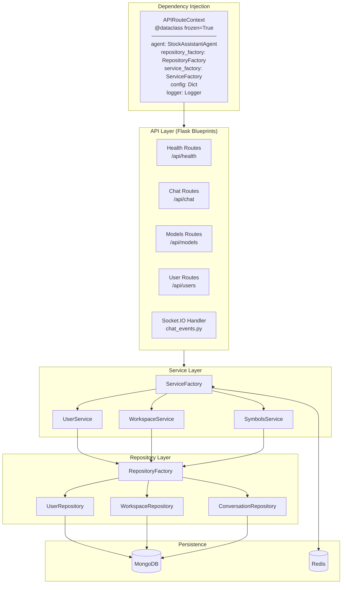

### 4.2 Blueprint Factory Pattern

```python
# All blueprints use this immutable DI pattern:
def create_chat_blueprint(context: APIRouteContext) -> Blueprint:
    blueprint = Blueprint("chat", __name__)
    
    @blueprint.route('/api/chat', methods=['POST'])
    def chat():
        # Use context.agent, context.service_factory, etc.
        ...
    
    return blueprint

# Registered in api_server.py:
for factory in http_route_factories:
    bp = factory(context)
    app.register_blueprint(bp)
```

This pattern provides:
- **Testability** — inject mock dependencies per test
- **Immutability** — `frozen=True` prevents accidental mutation
- **Composability** — routes registered via factory sequence

### 4.3 API Endpoints Reference

| Method | Endpoint | Description |
|--------|----------|-------------|
| `GET` | `/api/health` | Service health check |
| `POST` | `/api/chat` | Chat (supports `stream:true` for SSE) |
| `GET` | `/api/config` | Safe public configuration |
| `GET` | `/api/models/openai` | List available OpenAI models |
| `POST` | `/api/models/openai/refresh` | Force refresh model list |
| `GET` | `/api/models/openai/selected` | Currently active model |
| `POST` | `/api/models/openai/select` | Select a model |
| `PUT` | `/api/models/openai/default` | Set default model |
| `GET` | `/api/users/:id` | Get user profile |
| `GET` | `/api/users/:id/dashboard` | User dashboard |

### 4.4 Service Layer Architecture

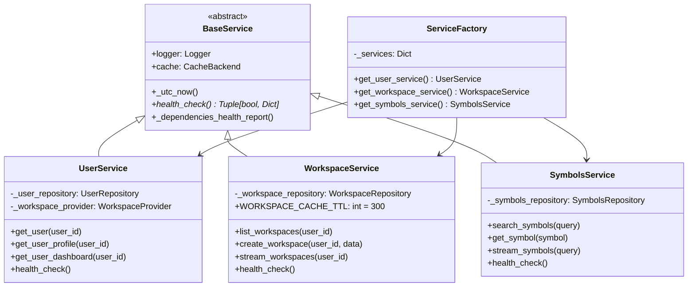

### 4.5 Backend API Strengths

✅ **Frozen dataclass DI** — `APIRouteContext` prevents accidental mutation  
✅ **Blueprint factory pattern** — Clean modular routing, easily testable  
✅ **Layered architecture** — Routes → Services → Repositories → DB  
✅ **SSE streaming** — Proper `stream_with_context` + chunked generator  
✅ **Protocol-based decoupling** — Services use `Protocol` to avoid circular imports  
✅ **Singleton factories** — `RepositoryFactory` and `ServiceFactory` prevent duplicate instances  
✅ **Health check contract** — All services implement `health_check() -> Tuple[bool, Dict]`  
✅ **Session-aware memory** — MongoDBSaver checkpointer for multi-turn conversations  
✅ **Config-driven behavior** — Environment overlays, Azure Key Vault integration  

### 4.6 Backend Issues & Improvement Areas

| Issue | Location | Severity | Recommendation |
|-------|----------|----------|----------------|
| **Hardcoded CORS origin** | `api_server.py` | 🔴 | Load from config/env |
| **Hardcoded secret key** | `api_server.py` (`__init__`) | 🔴 | `SECRET_KEY` from env var (min 32 chars, use `secrets.token_hex(32)`) |
| **No authentication** | All routes | 🔴 | Add JWT / OAuth2 |
| **No rate limiting** | All routes | 🟡 | Add `flask-limiter` |
| **No API versioning** | Routes | 🟡 | Add `/api/v1/` prefix |
| **No input length limits** | `/api/chat` | 🟡 | Validate message size |
| **No request ID tracing** | All routes | 🟡 | Add `X-Request-ID` header |
| **No OpenTelemetry** | Observability | 🟡 | Add OTEL SDK |

---

## 5. AI Agent & LLM Architecture

### 5.1 ReAct Agent Design

The core AI engine uses a **ReAct (Reason + Act)** pattern implemented with **LangGraph**, enabling structured tool orchestration and multi-turn memory:

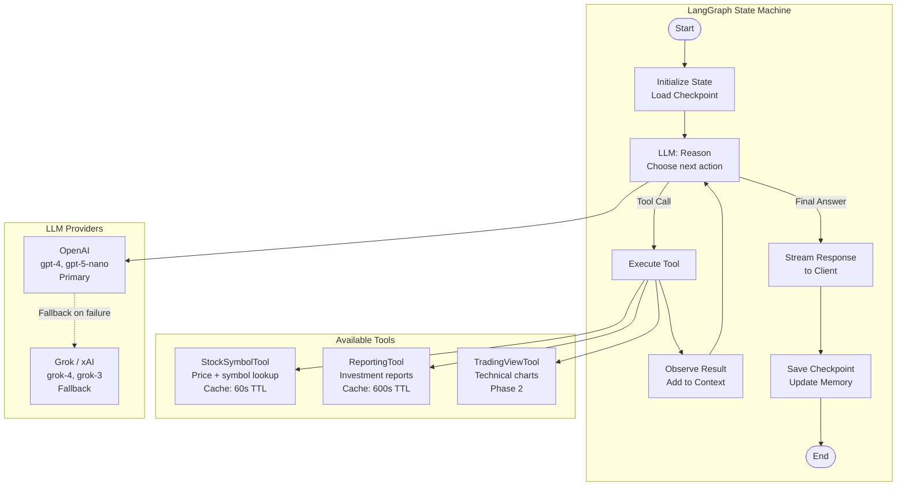

### 5.2 Model Client Architecture

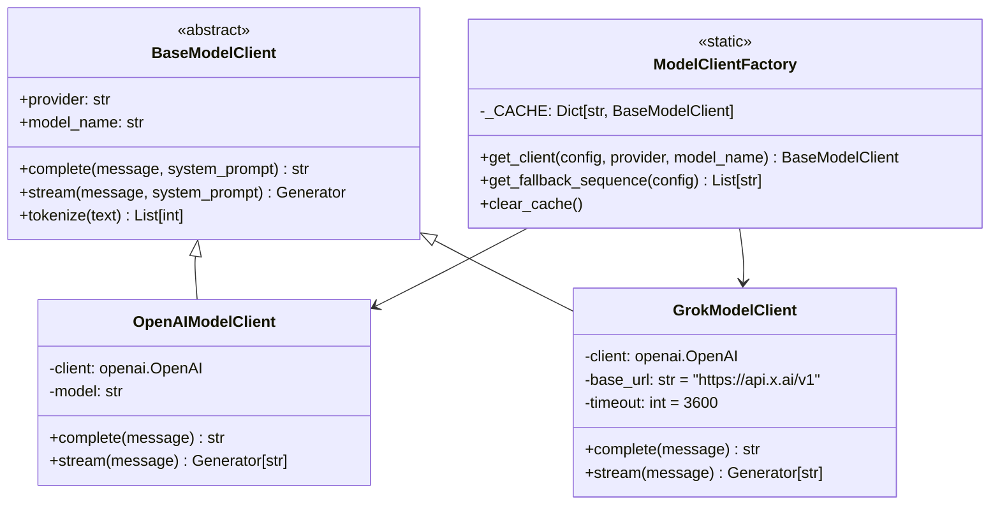

**Cache Key Format:** `{provider}:{model_name}` (e.g., `openai:gpt-4`)

### 5.3 Fallback Strategy

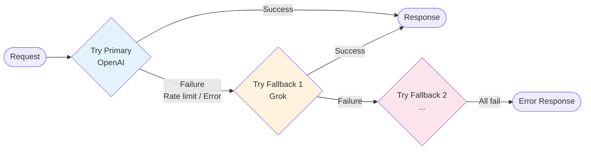

### 5.4 Session Memory Architecture

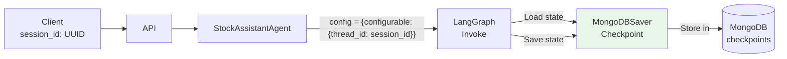

**Key Design:** Each `session_id` maps to a LangGraph `thread_id`, allowing the MongoDB checkpointer to persist and restore the full conversation state (messages, tool call history) across requests.

### 5.5 Tool System

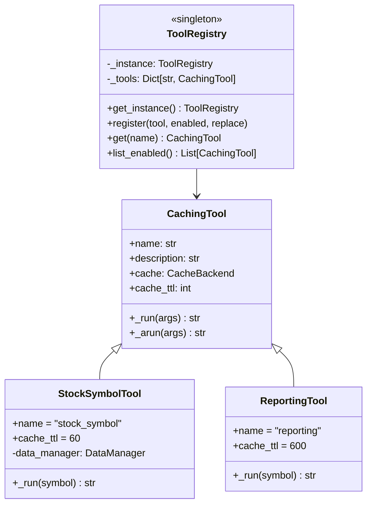

### 5.6 Agent Strengths

✅ **LangGraph ReAct Pattern** — Structured reasoning loop with tool orchestration  
✅ **Session-Aware Memory** — MongoDBSaver enables true multi-turn conversations  
✅ **Multi-Provider Fallback** — Automatic failover from primary to secondary LLM  
✅ **Tool Caching** — TTL-based caching prevents redundant API calls  
✅ **Streaming Generator** — Native Python generator pattern for SSE  
✅ **Singleton Tool Registry** — Centralized tool management  
✅ **Semantic Routing** — `semantic-router` dependency for query classification  

### 5.7 Agent Improvement Areas

| Area | Issue | Recommendation |
|------|-------|----------------|
| **Tool Coverage** | Only 2 active tools (TradingView is Phase 2) | Expand: Portfolio analysis, news feed, screener |
| **Prompt Engineering** | Static system prompt | Add dynamic context injection (user preferences, workspace) |
| **Error Visibility** | Tool errors swallowed gracefully | Surface tool execution errors to user |
| **Token Budgeting** | Not enforced | Add `max_tokens` guard to prevent runaway costs |
| **LLM Observability** | LangSmith only | Add OTEL spans per LLM call for broader APM support |
| **Agent Versioning** | Single agent version | Support agent prompt versioning and A/B testing |

---

## 6. Data Layer Architecture

### 6.1 MongoDB Schema Overview

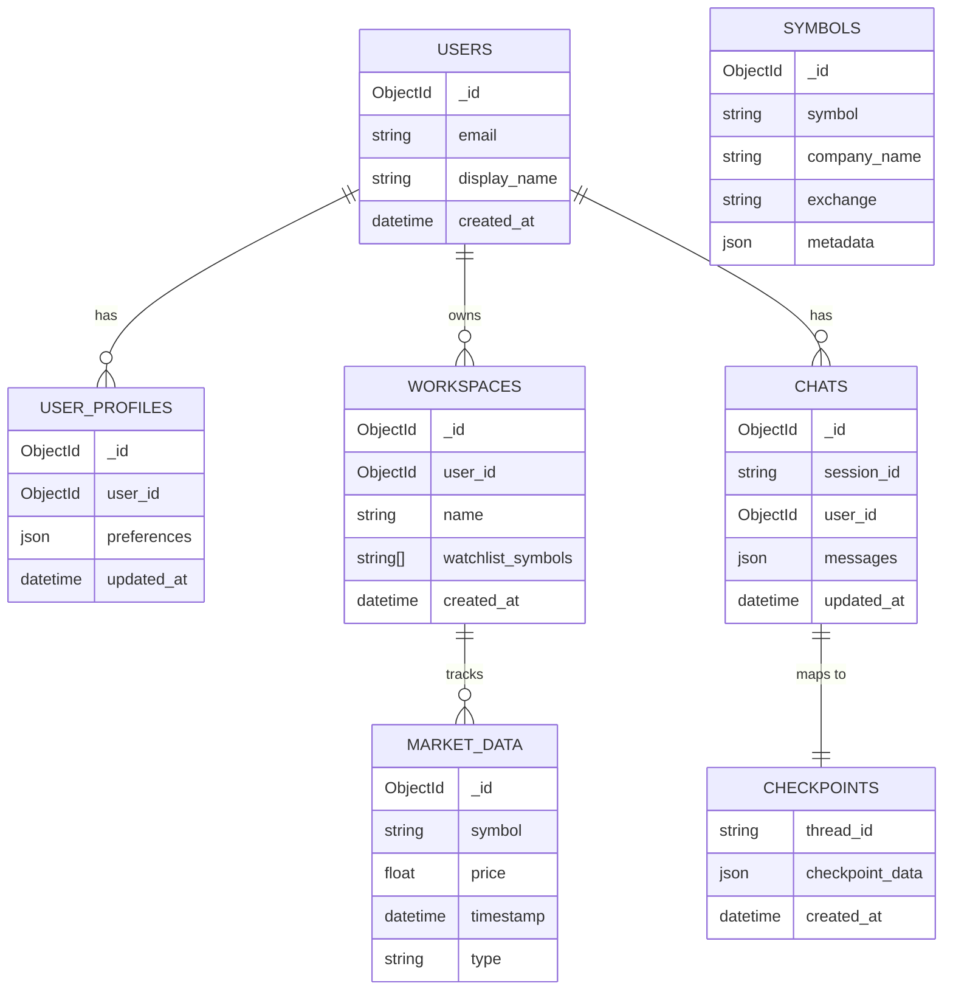

### 6.2 Repository Pattern

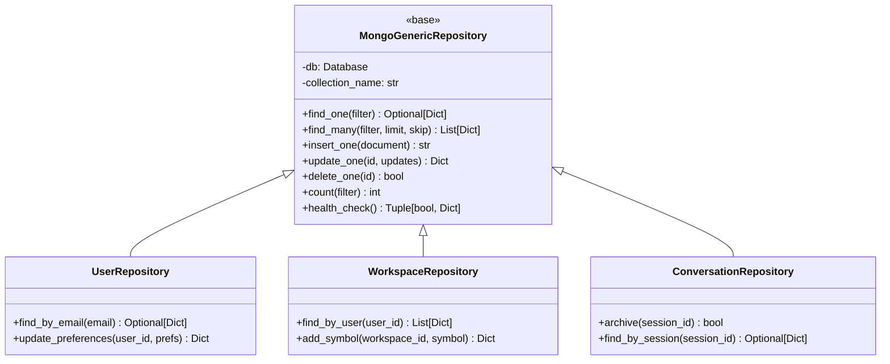

### 6.3 Caching Architecture

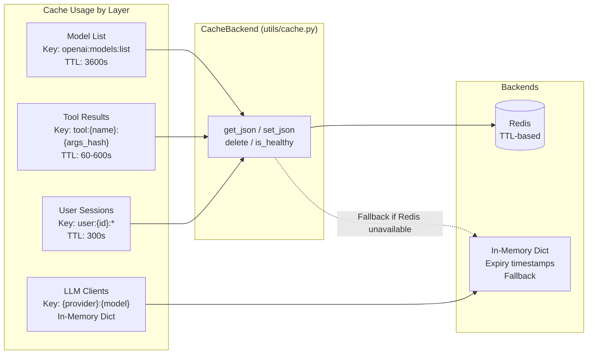

**TTL Strategy:**

| Data Type | TTL | Rationale |
|-----------|-----|-----------|
| Model list | 3600s | Infrequently changes |
| Stock prices (tool cache) | 60s | Market data freshness |
| Investment reports (tool cache) | 600s | Moderate freshness |
| Workspace data | 300s | Session-level freshness |
| LLM client instances | ∞ (in-memory) | Connection reuse |

### 6.4 Data Layer Strengths

✅ **Repository Pattern** — All DB access centralized, no ad-hoc queries  
✅ **Factory Singletons** — No duplicate repository instances  
✅ **MongoDBSaver Checkpointing** — Native LangGraph memory integration  
✅ **Cache Fallback** — Redis → in-memory fallback prevents hard failures  
✅ **Document Normalization** — `normalize_document()` handles ObjectId/datetime serialization  
✅ **JSON Schema Validation** — `schema_manager.py` validates data integrity  

### 6.5 Data Layer Improvement Areas

| Area | Issue | Recommendation |
|------|-------|----------------|
| **Collection Indexes** | May not be optimized for query patterns | Profile slow queries; add compound indexes |
| **Pagination** | Not uniformly implemented | Add cursor-based pagination on `find_many` |
| **TTL Jitter** | Not in place | Add randomized TTL jitter to prevent cache stampede |
| **Connection Pooling** | Default PyMongo settings | Tune `maxPoolSize` for production load |
| **Data Retention** | No TTL on market_data | Add MongoDB TTL indexes for stale data cleanup |
| **Backup Strategy** | Not documented | Document MongoDB Atlas backup or automated backup CronJob |

---

## 7. Infrastructure & Deployment

### 7.1 Deployment Architecture

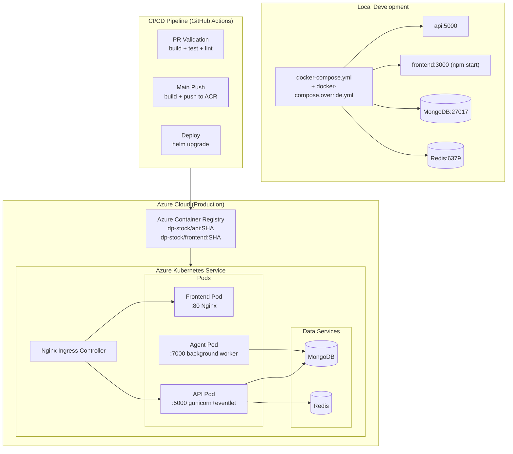

### 7.2 Container Architecture

| Container | Base Image | Port | Health Endpoint | WSGI |
|-----------|-----------|------|-----------------|------|
| `api` | Python 3.11 Slim | 5000 | `GET /api/health` | gunicorn + eventlet |
| `agent` | Python 3.11 Slim | 7000 | `GET /health` | Background worker |
| `frontend` | Node 20 Alpine → Nginx Alpine | 80 | `GET /healthz` | Nginx static |

### 7.3 Helm Chart Structure

```
IaC/helm/dp-stock/
├── Chart.yaml               # Chart metadata
├── values.yaml              # Default values (dev)
├── values.local.yaml        # Local K8s overrides
├── values.production.yaml   # Production overrides
└── templates/
    ├── _helpers.tpl
    ├── deployment-api.yaml
    ├── deployment-agent.yaml
    ├── deployment-frontend.yaml
    ├── service-api.yaml
    ├── service-frontend.yaml
    ├── ingress.yaml
    └── configmap.yaml
```

### 7.4 Terraform Resources

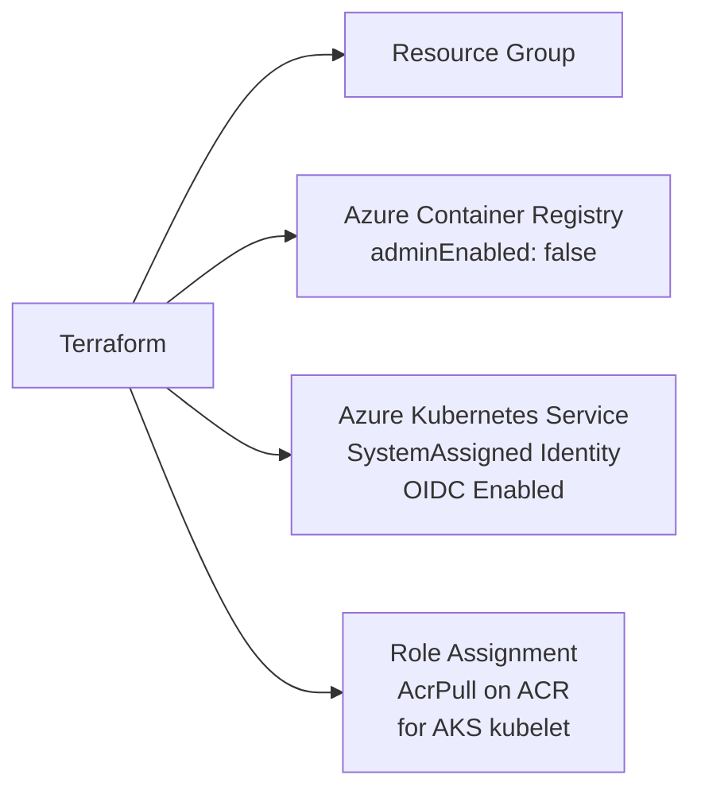

### 7.5 Infrastructure Strengths

✅ **Multi-stage Docker builds** — Minimal runtime images  
✅ **Non-root containers** — Security hardening (UID 1001/Nginx default)  
✅ **Helm chart with environment overlays** — Dev/staging/prod separation  
✅ **Terraform Azure IaC** — Reproducible infrastructure provisioning  
✅ **GitHub Actions CI/CD** — Automated build, test, push, deploy  
✅ **OIDC Authentication** — No long-lived secrets in CI/CD  
✅ **Health probes aligned** — containerPort, health path, and Helm probes consistent  

### 7.6 Infrastructure Improvement Areas

| Area | Issue | Recommendation |
|------|-------|----------------|
| **HPA** | No Horizontal Pod Autoscaler | Add HPA based on CPU/memory metrics |
| **Network Policies** | Not configured | Add Kubernetes `NetworkPolicy` to restrict traffic |
| **Secret Management** | Azure Key Vault disabled by default | Enable and enforce for production |
| **Resource Limits** | May not be set in dev values | Ensure production values have CPU/memory requests+limits |
| **PodDisruptionBudget** | Not configured | Add PDB to ensure availability during updates |
| **SBOM/Image Signing** | Not implemented | Add Cosign for image provenance |
| **Monitoring Stack** | Not included | Add Prometheus + Grafana Helm dependencies |

---

## 8. Cross-Cutting Concerns

### 8.1 Security Assessment

```mermaid
graph LR
    subgraph Current["Current State"]
        C1[❌ No Authentication]
        C2[❌ No Rate Limiting]
        C3[⚠️ Hardcoded Secret Key]
        C4[⚠️ Hardcoded CORS Origin]
        C5[✅ CORS Configured]
        C6[✅ Non-root Containers]
        C7[✅ OIDC for CI/CD]
        C8[✅ Secrets via Key Vault\n(optional)]
    end
```

**Critical Security Gaps:**

| Risk | Severity | Location | Recommended Fix |
|------|----------|----------|-----------------|
| No API authentication | 🔴 Critical | All routes | Add JWT Bearer token validation |
| Hardcoded Flask `SECRET_KEY` | 🔴 Critical | `api_server.py` (`__init__`) | Load from env var; must be a cryptographically random string — generate with `secrets.token_hex(32)` (see [Section 10.3](#103-security-hardening-immediate-actions)) |
| Hardcoded CORS origins | 🟡 Medium | `api_server.py` (`__init__`) | Load from `CORS_ORIGINS` env var |
| No request rate limiting | 🟡 Medium | All routes | Add `flask-limiter` with Redis storage backend |
| Frontend API URL hardcoded | 🟡 Medium | `App.tsx` (`sendMessage`/`loadConfig`), `webSocketService.ts` (`connect`) | Use `REACT_APP_API_URL` env var — already defined in `config.ts` but bypassed in `App.tsx` |
| No XSS protection headers | 🟡 Medium | Flask responses | Add `flask-talisman` security headers |
| No input sanitization log | 🟢 Low | Chat endpoint | Log sanitized inputs only |

### 8.2 Observability Stack

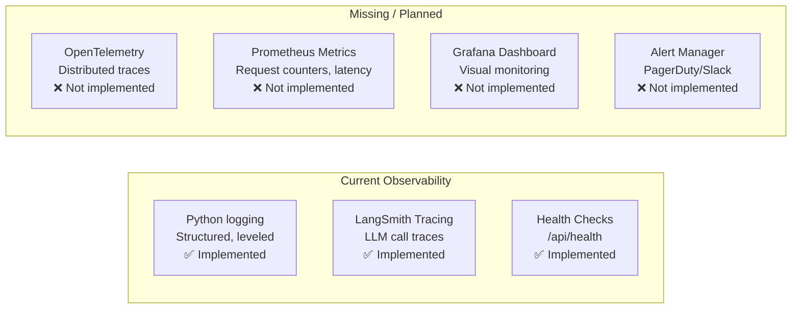

**Recommended Observability Stack:**
- **Tracing:** OpenTelemetry SDK → Jaeger/Azure Monitor
- **Metrics:** `prometheus-flask-exporter` → Prometheus → Grafana
- **Logging:** Existing Python logging → Structured JSON → Azure Log Analytics
- **Frontend:** `web-vitals` + Datadog/Sentry browser SDK

### 8.3 Testing Coverage

| Layer | Framework | Test Count | Coverage | Status |
|-------|-----------|------------|----------|--------|
| Backend Unit | pytest + mocks | 100+ | ~70% | 🟢 Good |
| Backend API | pytest + Flask test client | ~20 | Routes covered | 🟡 Fair |
| Backend Agent | pytest + mocked LLMs | ~10 | Core paths | 🟡 Fair |
| Frontend Unit | Jest (CRA) | **0** | **0%** | 🔴 None |
| Frontend E2E | None | **0** | **0%** | 🔴 None |
| Integration | None | **0** | **0%** | 🔴 None |

**Backend Test Pattern (Healthy):**
```python
# Protocol-based mock injection
def test_workspace_service_caches_with_ttl(mock_repo, mock_cache):
    service = WorkspaceService(repository=mock_repo, cache=mock_cache)
    service.get_workspace("ws123")
    mock_cache.set_json.assert_called_once_with(
        "workspace:ws123", ANY, ttl_seconds=300
    )
```

**Recommended Frontend Testing Stack:**
- **Unit/Component:** Vitest + React Testing Library
- **E2E:** Playwright for critical user flows (send message → receive streaming response)
- **Visual Regression:** Storybook + Chromatic

### 8.4 Configuration Management

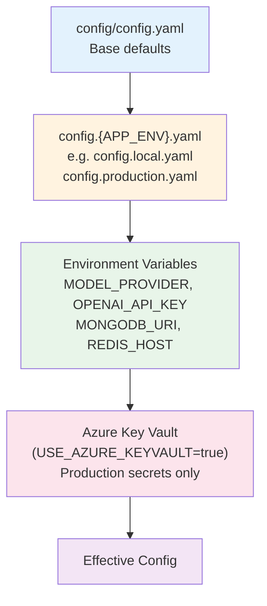

**Hierarchy:** Base YAML → Environment Overlay → Env Vars → Cloud Secrets (highest priority)  
**Override Mode:** Controlled by `CONFIG_ENV_OVERRIDE_MODE` (`all` / `secrets-only` / `none`)

---

## 9. Strengths Summary

The system demonstrates enterprise-grade thinking in several areas:

### ✅ Strong Foundations

1. **LangGraph ReAct Agent** — Well-structured agent with proper tool orchestration, streaming support, and session memory
2. **Dependency Injection Pattern** — Frozen dataclass `APIRouteContext` prevents accidental mutation and enables clean testing
3. **Multi-Provider LLM Strategy** — OpenAI + Grok with configurable fallback order is resilient
4. **Repository + Service Pattern** — Clear layering; no ad-hoc DB queries outside repositories
5. **SSE Streaming** — Correct implementation using `ReadableStream` + `AbortController` on both ends
6. **Session Memory** — MongoDBSaver enables real multi-turn conversations across requests
7. **Tool Caching** — TTL-based tool result caching reduces LLM tool call latency and cost
8. **Multi-Stage Docker** — Minimal production images with non-root users
9. **Helm + Terraform IaC** — Reproducible, environment-parameterized deployments
10. **Health Check Contract** — Every service implements `health_check() -> Tuple[bool, Dict]`

---

## 10. Improvement Opportunities & Recommendations

### 10.1 Priority Matrix

```mermaid
quadrantChart
    title Improvement Priority Matrix
    x-axis Low Effort --> High Effort
    y-axis Low Impact --> High Impact

    quadrant-1 Quick Wins
    quadrant-2 Major Projects
    quadrant-3 Low Priority
    quadrant-4 Fill In Gaps

    Fix hardcoded secret key: [0.1, 0.9]
    Fix hardcoded CORS origin: [0.1, 0.7]
    Fix hardcoded frontend URLs: [0.2, 0.7]
    Add JWT authentication: [0.4, 0.95]
    Add rate limiting: [0.2, 0.8]
    Migrate CRA to Vite: [0.35, 0.85]
    Add React Router: [0.3, 0.6]
    Add Zustand state mgmt: [0.35, 0.7]
    Add Tailwind CSS: [0.4, 0.65]
    Frontend test coverage: [0.4, 0.75]
    Add Prometheus metrics: [0.45, 0.7]
    Add OpenTelemetry: [0.55, 0.75]
    PWA support: [0.5, 0.5]
    E2E testing Playwright: [0.5, 0.7]
    Expand agent tools: [0.6, 0.85]
    HPA configuration: [0.3, 0.65]
```

### 10.2 Frontend Modernization Recommendations

#### Migrate Build Tool: CRA → Vite

```bash
# Benefits:
# - 10-100x faster dev server cold start (native ESM)
# - Modern TypeScript/JSX transform
# - First-class Vitest integration
# - Plugin ecosystem (PWA, bundle analysis)
```

Create React App is officially deprecated and no longer receives updates. Migrating to **Vite** offers dramatically improved developer experience, faster builds, and a healthy maintenance trajectory.

#### Adopt a Design System

The current UI uses raw inline styles with no visual hierarchy, color system, or accessible components. Recommended options:

| Option | Size | Accessibility | Best For |
|--------|------|---------------|----------|
| **Tailwind CSS + shadcn/ui** | Minimal bundle | Built-in | Modern component library |
| **MUI (Material-UI)** | Larger bundle | Excellent | Enterprise dashboard feel |
| **Chakra UI** | Medium | Good | Balance of speed + quality |

#### State Management Lift

Replace monolithic `App.tsx` state with composable hooks and a global store:

```typescript
// Recommended: Zustand for global state
const useChatStore = create<ChatState>((set) => ({
  conversations: {},
  activeSessionId: null,
  addMessage: (sessionId, msg) => set(state => ({...})),
  setStreaming: (sessionId, isStreaming) => set(state => ({...}))
}));

// Recommended: TanStack Query for server state
const { data: models } = useQuery({
  queryKey: ['models', 'openai'],
  queryFn: () => modelsApi.listModels(),
  staleTime: 3600_000
});
```

### 10.3 Security Hardening (Immediate Actions)

```python
import os, secrets

# 1. Fix SECRET_KEY (api_server.py __init__)
# Generate a secure key: python -c "import secrets; print(secrets.token_hex(32))"
secret_key = os.environ.get("SECRET_KEY")
if not secret_key or len(secret_key) < 32:
    raise RuntimeError(
        "SECRET_KEY env var is required and must be at least 32 characters. "
        "Generate one with: python -c \"import secrets; print(secrets.token_hex(32))\""
    )
self.app.config['SECRET_KEY'] = secret_key

# 2. Fix CORS (api_server.py __init__)
cors_origins_str = os.environ.get("CORS_ORIGINS", "http://localhost:3000")
origins = [o.strip() for o in cors_origins_str.split(",")]

# 3. Fix frontend API URL (App.tsx) — App.tsx currently bypasses config.ts
// Use the centralized config instead of hardcoding:
import { API_CONFIG } from './config';
const API_BASE_URL = API_CONFIG.BASE_URL;  // reads REACT_APP_API_URL env var

# 4. Add rate limiting (inside APIServer.__init__, after Flask app setup)
# Uses Redis backend for distributed rate limiting across multiple instances
from flask_limiter import Limiter
from flask_limiter.util import get_remote_address
limiter = Limiter(
    app=self.app,
    key_func=get_remote_address,
    storage_uri=f"redis://{redis_host}:{redis_port}",
    default_limits=["200/hour", "50/minute"]
)
```

### 10.4 Observability Additions

```python
# Add Prometheus metrics to Flask
from prometheus_flask_exporter import PrometheusMetrics
metrics = PrometheusMetrics(app)

# Custom metrics
chat_requests = Counter('chat_requests_total', 'Total chat requests', ['provider', 'fallback'])
llm_latency = Histogram('llm_response_seconds', 'LLM response latency', ['provider'])
```

---

## 11. Enhancement Roadmap

### Phase 1 — Foundation Hardening (Sprint 1-2)

| Task | Priority | Effort | Impact |
|------|----------|--------|--------|
| Fix hardcoded `SECRET_KEY` | 🔴 Critical | S | Security |
| Fix hardcoded CORS origin | 🔴 Critical | S | Security |
| Fix frontend hardcoded URLs | 🟡 High | S | Deployment |
| Add `flask-limiter` rate limiting | 🟡 High | M | Security |
| Add `flask-talisman` security headers | 🟡 High | S | Security |
| Consolidate frontend API clients | 🟡 High | M | Code quality |
| Fix `@types/socket.io-client` version | 🟡 High | S | Type safety |
| Convert JS files to TypeScript | 🟡 High | M | Type safety |

### Phase 2 — Frontend Modernization (Sprint 3-4)

| Task | Priority | Effort | Impact |
|------|----------|--------|--------|
| Migrate CRA → Vite | 🟡 High | M | Build speed, DX |
| Add Tailwind CSS + shadcn/ui | 🟡 High | M | UI quality |
| Add React Router v6 | 🟡 High | M | Navigation |
| Add Zustand state management | 🟡 High | M | Scalability |
| Add TanStack Query for server state | 🟡 High | M | Caching, loading |
| Add frontend Vitest + RTL tests | 🟡 High | L | Quality |
| Add error boundaries | 🟢 Medium | S | Reliability |
| Implement PWA (manifest + SW) | 🟢 Medium | M | Progressive |

### Phase 3 — API & Agent Enhancement (Sprint 5-6)

| Task | Priority | Effort | Impact |
|------|----------|--------|--------|
| Add JWT authentication | 🟡 High | L | Security |
| Add `/api/v1/` API versioning prefix | 🟢 Medium | M | Compatibility |
| Add request ID tracing | 🟢 Medium | S | Debugging |
| Expand agent toolset | 🟢 Medium | L | Features |
| Add Prometheus metrics | 🟢 Medium | M | Observability |
| Add OpenTelemetry tracing | 🟢 Medium | M | Observability |
| Add E2E tests with Playwright | 🟢 Medium | L | Quality |

### Phase 4 — Infrastructure & Scale (Sprint 7-8)

| Task | Priority | Effort | Impact |
|------|----------|--------|--------|
| Enable Azure Key Vault by default | 🟡 High | M | Security |
| Add Kubernetes HPA | 🟢 Medium | S | Scalability |
| Add Network Policies | 🟢 Medium | M | Security |
| Add Grafana/Prometheus Helm deps | 🟢 Medium | M | Observability |
| Add PodDisruptionBudget | 🟢 Medium | S | Availability |
| Container image signing (Cosign) | 🟢 Medium | M | Supply chain |

### Target Architecture (Post-Roadmap)

```mermaid
graph TB
    subgraph Frontend_New["Modern Frontend (Vite + React)"]
        Router["React Router v6"]
        Store["Zustand Store\n+ TanStack Query"]
        UI["Tailwind CSS\n+ shadcn/ui"]
        PWA["PWA\nService Worker\n+ Manifest"]
        A11Y["ARIA\n+ Axe Testing"]
    end

    subgraph API_New["Hardened API"]
        Auth["JWT Auth\nMiddleware"]
        Limit["Rate Limiting\nflask-limiter"]
        Headers["Security Headers\nflask-talisman"]
        Ver["Versioned Routes\n/api/v1/"]
        OTEL["OpenTelemetry\nDistributed Tracing"]
    end

    subgraph Agent_New["Enhanced Agent"]
        MoreTools["Expanded Tools\nNews, Screener\nPortfolio Analyzer"]
        AgentV["Agent Versioning\nPrompt A/B Testing"]
    end

    subgraph Infra_New["Production Infrastructure"]
        HPA["HPA\nAuto-scaling"]
        NetPol["Network Policies"]
        AKV["Azure Key Vault\n(enforced)"]
        Prom["Prometheus\n+ Grafana"]
        Cosign["Image Signing\nCosign"]
    end

    Frontend_New --> API_New
    API_New --> Agent_New
    Agent_New --> Infra_New
```

---

## Appendix: Key File Reference

| File | Role | Notes |
|------|------|-------|
| `frontend/src/App.tsx` | Root component | Monolithic — split into composable components |
| `frontend/src/config.ts` | API constants | Add more env-driven config |
| `frontend/src/services/restApiClient.js` | Primary API client | Convert to TypeScript, merge with apiService.ts |
| `frontend/src/services/webSocketService.ts` | Socket.IO | Not used by App.tsx — integrate or remove |
| `src/web/api_server.py` | Flask app factory | Fix SECRET_KEY and CORS origin loading |
| `src/web/routes/ai_chat_routes.py` | Chat endpoints | Add auth middleware, input limits |
| `src/core/stock_assistant_agent.py` | ReAct agent | Core intelligence layer |
| `src/core/model_factory.py` | LLM client factory | Add new provider registration |
| `src/utils/config_loader.py` | Config management | Hierarchical loading, env overlays |
| `src/utils/cache.py` | Cache backend | Redis + in-memory fallback |
| `IaC/Dockerfile.api` | API container | Multi-stage, non-root |
| `IaC/helm/dp-stock/values.yaml` | K8s defaults | Add HPA, NetworkPolicy templates |
| `IaC/infra/terraform/main.tf` | Azure IaC | Add Key Vault module |

---

*This document was generated as part of the architecture review and enhancement planning for DP Stock Investment Assistant. For implementation guidance on any specific area, refer to the domain instruction files in `.github/instructions/`.*
