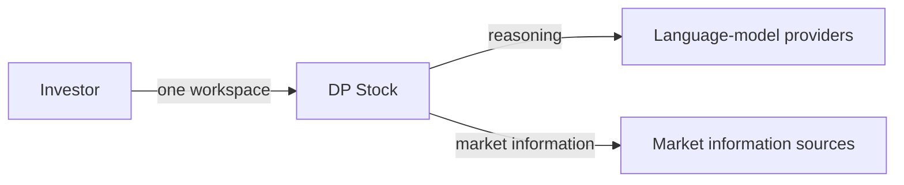
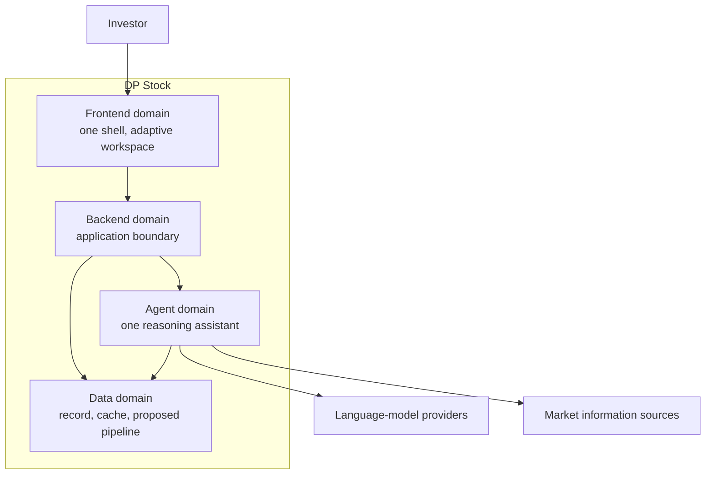

# System Overview and Boundaries

## Document Control

| Field | Value |
|---|---|
| Document | System architecture description |
| Path | `docs/architecture/SYSTEM_OVERVIEW_AND_BOUNDARIES.md` |
| Version | 0.4 |
| Date | 2026-09-30 |
| Status | Working draft. Published on `product-design-specification-and-roadmap`. |
| Standards stance | **Aligned** to ISO/IEC/IEEE 42010. Not a certification claim. |
| Shape | Same architecture-description shape as `docs/domains/agent/ARCHITECTURE_DESIGN.md`: entity, stakeholders, viewpoints, views, correspondences, rationale. |
| arc42 owned here | §2 Constraints, §3 Context and scope, §4 Solution strategy, §5 Building blocks at system level (C4 Level 1 and Level 2). |
| Product input, frozen | Spec v1.7.0, IA map v1.0.0, Journeys v1.0.0, at `7f54056`. |
| Governing references, not copied | Agent architecture description. Frontend ADR-001 and ADR-002. Data-pipeline ELT proposal. |

## 1. Architecture description overview

### 1.1 Purpose

This is the architecture description of the whole system. It says what the system is, which domains own which responsibilities, and what Spec Phase 1 adds beside the live platform.

It follows the agent domain's architecture description in structure, not in depth. The agent document is the worked example of an ISO 42010 description in this repository. This file is the system-level one. It does not absorb domain internals, technology selections, or deployment procedure.

### 1.2 Entity of interest

The entity is the **DP Stock Investment Assistant**: one investment workspace for a Techno-Fundamental Investor, with a presentation domain, an application boundary, one reasoning agent, and a data domain.

### 1.3 Environment

Outside the system:

- the investor;
- language-model providers;
- market information sources, both live queries and batch files.

Inside, but not redesigned here:

- the live chat platform, including short-term session memory and the tool gateway;
- domain documents for agent, backend, and frontend, which describe that platform;
- hosting. Recorded only as "the domains are deployable." The deployment view belongs in `DEPLOYMENT_AND_INFRASTRUCTURE.md`.

### 1.4 Scope

This description covers system context, the solution strategy, the container responsibilities, and the Phase 1 identities.

It does not replace:

- `docs/domains/agent/ARCHITECTURE_DESIGN.md` for agent viewpoints;
- the frontend ADRs for the frontend decision;
- the data-pipeline proposal for ingestion design;
- runtime flows, the decision record, and the data-domain note still to come in this session.

### 1.5 Key characteristics

| Aspect | Architectural characteristic | Where the detail lives |
|---|---|---|
| Presentation | One deployable shell. An adaptive workspace, not a chat column and not a set of separately deployed frontends. | ADR-Frontend-001 |
| Frontend foundation | Contract-first modules, a fast lane for live presentation and a slow lane for server state, a primary chart distinct from auxiliary charts, structured streaming into the companion. | ADR-Frontend-002. Products are not restated here. |
| Application boundary | Services in front of repositories. The presentation domain does not touch storage. | Backend domain design |
| Reasoning | One assistant. Tools, provider fallback, short-term session memory. Output advises. It does not own the thesis or the gate. | Agent architecture description |
| Visualization | Market pictures are provenance of the picture, not thesis evidence. | Agent tool boundary, already decided |
| Data, proposed | ELT, not ETL. A medallion of raw, conformed, and curated layers, plus a separate live-query path that does not wait on the batch pipeline. | Data-pipeline proposal. Not yet an adopted ADR. |
| Phase 1 addition | Working Thesis and Position as new identities. Decision is the gate between them. Case is optional. | This file, Spec §4.6 |

### 1.6 Authority split

| Document | Owns |
|---|---|
| This file | System context, strategy, containers, Phase 1 boundary |
| Spec, IA map, Journeys | Product meaning, zones, journeys |
| Agent architecture description | Agent viewpoints |
| ADR-Frontend-001 | Modular shell and multi-pane workspace, not micro-frontends |
| ADR-Frontend-002 | Frontend foundation. Domain decision. |
| Data-pipeline proposal | Proposed ingestion architecture. Research, until an ADR adopts it. |
| Runtime flows, ADRs, data technical design | Later outputs of this session |

## 2. Stakeholders and concerns

| Stakeholder | Concern this view must answer |
|---|---|
| Investor | One workspace, advice that does not act for them |
| Product | Phase 1 path is visible in the architecture, not only in the Spec |
| Architecture | Domains stay separated, and proposals are not mistaken for decisions |
| Frontend | The shell and the canvas direction are acknowledged, not redesigned |
| Agent and backend | The live assistant stays one agent, with session memory only |
| Data | Ingestion strategy is named, and it is not allowed to redefine Position or Thesis |

Concerns: where the system stops, which container owns which responsibility, what Phase 1 adds, and which existing documents stay authoritative.

## 3. Viewpoint catalog

| Viewpoint | What this file gives | Model |
|---|---|---|
| Context and boundary | Section 4.1 | C4 Level 1 |
| Logical | Section 4.2 | C4 Level 2 containers |
| Information | Section 4.3 | Identities and the proposed data layers |
| Process | Named, not drawn | Pass and Revise belong in the runtime document |
| Development, deployment, operations | Named, not drawn | Domain docs and the deployment document |

## 4. Architecture views

### 4.1 Context and boundary

**Current-state.** The investor uses one system. The system calls model providers and market sources. It does not execute trades.

**Target-state for Phase 1**, same context, tighter scope. In: Insights to Working Thesis to the Decision gate to a Position, evidence and provenance first-class, no store designed in this file. Out: brokerage execution, long-term memory, an Insights store, and everything the Spec places after Phase 1.

### 4.2 Logical view

**Current-state containers.** Four domains. Calls move inward. The agent is one assistant, not a set of Phase 1 services.

| Container | Responsibility taken from the governing docs | Not this container |
|---|---|---|
| Frontend | One shell. Bounded modules behind a platform layer. The workspace is a resizable canvas: chart, companion, and analytical docks stay in one surface. ADR-001. The foundation that implements it is ADR-002. | Micro-frontends. Owning the gate outcome. |
| Backend | Application boundary. Services depend on repositories. | Reasoning policy. Storage layout. |
| Agent | One ReAct assistant, tool gateway, provider fallback, short-term session memory. Charts it returns are visualization provenance. | A thesis record. A Position. Long-term memory. |
| Data | Live records and cache today. Proposed next shape is section 4.3. | Pretending today's holding, idea, and session records are the Phase 1 identities. |

**Target-state, not drawn as containers.**

- Working Thesis, in the research lane. Multi-stance is Bull and Bear on that thesis, not its own container and not a track.
- Position, created only by Pass. Not today's holding record.
- Decision gate, the transition between them. Not a container.
- Case, optional binder. Not required, not created by Pass.

The chart yielding at the gate is a presentation rule of the research lane. It is not a stored layout. The portfolio lane does not inherit it. Tracks are lanes of the workspace, not a status on the thesis or the position. Research-lane work and Revise never write holding records.

### 4.3 Information view

Two states, kept apart on purpose.

**Current-state.** The data domain holds the live platform's records, including holding records, idea records, and session notes. Those stay what they are.

**Proposed-state, from the data-pipeline proposal, not yet decided.** Two paths:

1. **Batch path.** ELT. Land raw inputs first, conform them, then curate marts. The proposal calls these bronze, silver, and gold, on one data store.
2. **Live path.** External market queries skip the batch landing. Services and agent tools read them through a cache so a conversation does not wait on a pipeline.

The proposal's curated layer names session analyses, idea records, and vector memory as gold marts. This architecture does not accept that naming. Those records are not a Working Thesis, not a Position, and not an Insight. Vector memory stays after Phase 1. Adopting the pipeline is a future ADR, not a decision of this draft.

Evidence and provenance stay first-class on the Phase 1 path. Neither this view nor the proposal's gold layer is the store for them.

## 5. Correspondences

| This view says | Must stay consistent with |
|---|---|
| One shell, not micro-frontends | ADR-Frontend-001 |
| Foundation is a domain decision | ADR-Frontend-002 |
| One agent, session memory, visualization is not thesis evidence | Agent architecture description |
| ELT medallion plus a live bypass | Data-pipeline proposal, status proposed |
| Pass creates a Position. Revise does not. Case is optional. | Spec §4.6 |
| Domain docs are the live platform, not the Phase 1 objects | Session charter |

If a gold mart in the proposal and a Phase 1 identity share a word, the Spec wins. The proposal must be amended before it is adopted, not the other way around.

## 6. Rationale

- The agent document is the structural model because it already separates viewpoints, views, and decision authority. A flat strategy list was not that description, which is why the previous draft felt empty.
- ADR-001 is an architectural decision of the frontend domain, so the system view records the outcome (one shell, one canvas) and leaves the module rules there.
- ADR-002 chooses a foundation. Copying its product list into this file would turn a system view into a stack guide. The correspondence above is the link.
- The data proposal is the only system-level ingestion strategy on paper. It is included as proposed, with the conflict called out, so Phase 1 does not inherit `investment_ideas`, `analyses`, or `memory_vectors` as its objects.
- Phase 1 identities stay beside the containers so a later design does not hide them inside today's collections.

## 7. Left for later

| Topic | Document |
|---|---|
| Pass and Revise as a flow | `RUNTIME_AND_INTEGRATION_FLOWS.md` |
| The decision record for the gate | `docs/architecture/DECISIONS/` |
| Kept records versus new identities | `docs/domains/data/TECHNICAL_DESIGN.md` |
| Hosting | `DEPLOYMENT_AND_INFRASTRUCTURE.md` |
| Adopting or rejecting the ELT proposal | A data ADR, not this session |

## 8. Revision history

| Version | Date | Notes |
|---|---|---|
| 0.0 | 2026-04-03 | Empty skeleton. |
| 0.1–0.3 | 2026-09-30 | Earlier drafts. Superseded. 0.3 was a thin skeleton and is the one replaced here. |
| 0.4 | 2026-09-30 | Published. Restructured on the agent architecture-description shape. Frontend ADR-001 and ADR-002 and the ELT proposal brought in as governing references, with the proposal's gold-layer conflict called out. |
