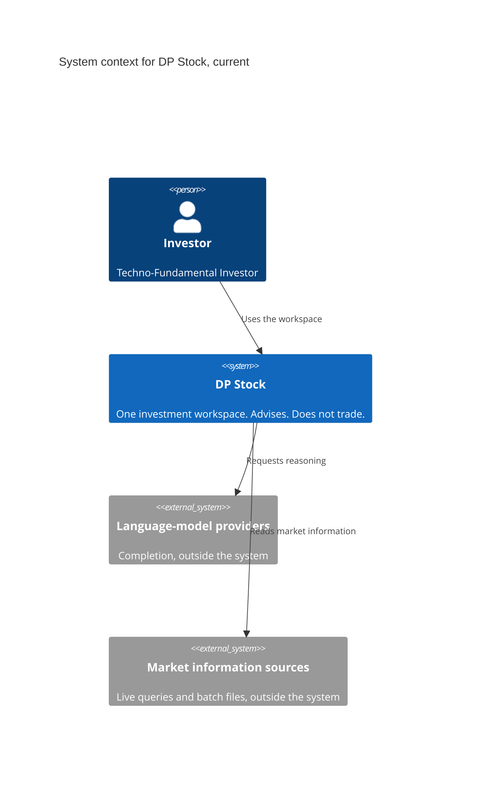
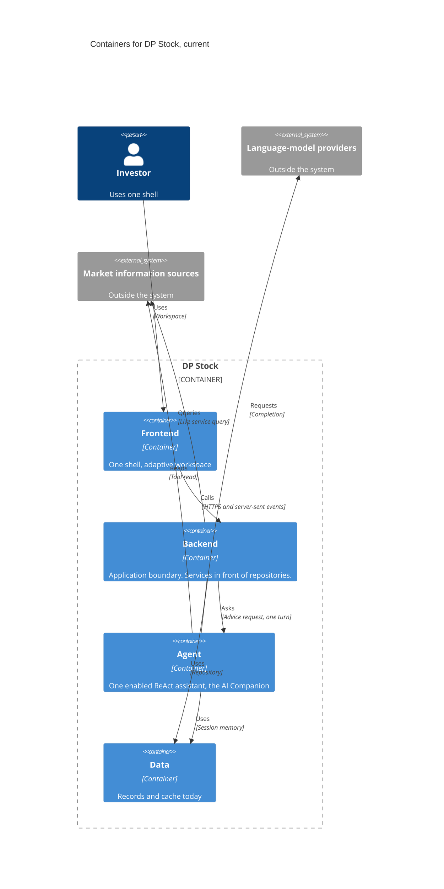
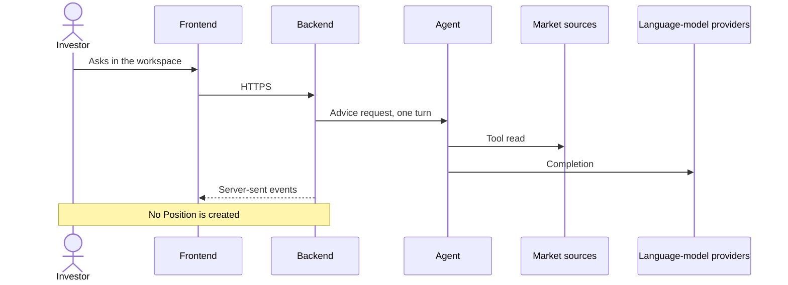
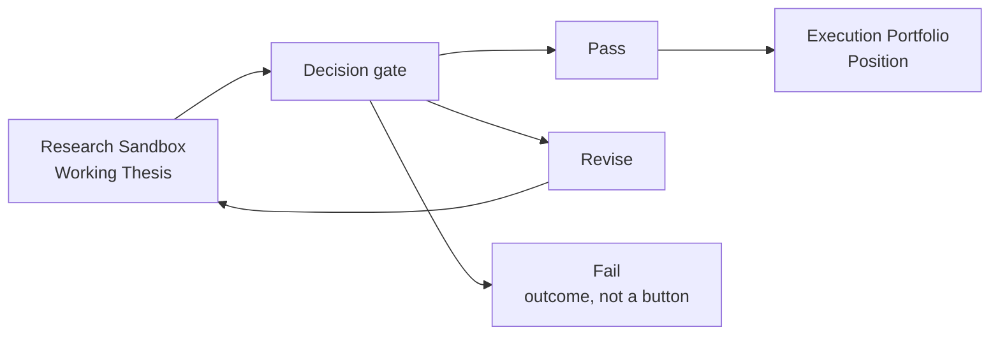

# System Architecture Overview and Boundaries

## Document Control

| Field | Value |
|---|---|
| Document | System architecture description |
| Path | `docs/architecture/SYSTEM_OVERVIEW_AND_BOUNDARIES.md` |
| Version | 0.6 |
| Date | 2026-10-02 |
| Status | Local working draft. Not committed. |
| Standards stance | **Aligned** to ISO/IEC/IEEE 42010. Not a certification claim. |
| Shape | Same architecture-description shape as `docs/domains/agent/ARCHITECTURE_DESIGN.md`: entity, stakeholders, viewpoints, views, correspondences, rationale. |
| arc42 owned here | §2 Constraints, §3 Context and scope, §4 Solution strategy, §5 Building blocks at system level, plus a system-level runtime view, cross-cutting list, and risk list. See §1.7. |
| Product input, frozen | Spec v1.7.0, IA map v1.0.0, Journeys v1.0.0, at `7f54056`. |
| Governing references, not copied | Agent architecture description. Frontend ADR-001 and ADR-002. Data-pipeline ELT proposal. |

## 1. Architecture description overview

### 1.1 Purpose

This is the architecture description of the whole system. It says what the system is, which domains own which responsibilities, and what Spec Phase 1 adds beside the live platform.

It follows the agent domain's architecture description in structure, not in depth. The agent document is the worked example of an ISO 42010 description in this repository. This file is the system-level one. It names the patterns and gives a one-line stack pointer per domain. Domain internals, product lists, and deployment procedure stay in the domain documents.

### 1.2 Entity of interest

The entity is the **DP Stock Investment Assistant**: one investment workspace for a Techno-Fundamental Investor, with a presentation domain, an application boundary, one reasoning agent, and a data domain.

### 1.3 Environment

Outside the system:

- the investor;
- language-model providers;
- market information sources, both live queries and batch files.

Inside, but not redesigned here:

- the live chat platform, including short-term session memory and the tool gateway;
- domain documents for agent, backend, and frontend, which describe that platform;
- hosting. Recorded only as "the domains are deployable." The deployment view belongs in `DEPLOYMENT_AND_INFRASTRUCTURE.md`.

### 1.4 Scope

This description covers system context, the solution strategy, the container responsibilities, and the Phase 1 identities.

It does not replace:

- `docs/domains/agent/ARCHITECTURE_DESIGN.md` for agent viewpoints;
- the frontend ADRs for the frontend decision;
- the data-pipeline proposal for ingestion design;
- the full Pass and Revise sequence, the decision record, and the data-domain note still to come in this session.

### 1.5 Key characteristics

| Aspect | Architectural characteristic | Where the detail lives |
|---|---|---|
| Presentation | One deployable shell. An adaptive workspace, not a chat column and not a set of separately deployed frontends. | ADR-Frontend-001 |
| Frontend foundation | Contract-first modules, a fast lane for live presentation and a slow lane for server state, a primary chart distinct from auxiliary charts, structured streaming into the companion. | ADR-Frontend-002. Products are not restated here. |
| Application boundary | Services in front of repositories. The presentation domain does not touch storage. | Backend domain design |
| Reasoning | One assistant. Tools, provider fallback, short-term session memory. Output advises. It does not own the thesis or the gate. | Agent architecture description |
| Visualization | Market pictures are provenance of the picture, not thesis evidence. | Agent tool boundary, already decided |
| Data, proposed | ELT, not ETL. A medallion of raw, conformed, and curated layers, plus a separate live-query path that does not wait on the batch pipeline. | Data-pipeline proposal. Not yet an adopted ADR. |
| Phase 1 addition | Working Thesis and Position as new identities. Decision is the gate between them. Case is optional. | This file, Spec §4.6 |

### 1.6 Authority split

| Document | Owns |
|---|---|
| This file | System context, strategy, containers, Phase 1 boundary |
| Spec, IA map, Journeys | Product meaning, zones, journeys |
| Agent architecture description | Agent viewpoints |
| ADR-Frontend-001 | Modular shell and multi-pane workspace, not micro-frontends |
| ADR-Frontend-002 | Frontend foundation. Domain decision. |
| Data-pipeline proposal | Proposed ingestion architecture. Research, until an ADR adopts it. |
| Runtime flows, ADRs, data technical design | Later outputs of this session |

### 1.7 How arc42 and C4 are used here

These are two different tools, used together. Neither one is a certification.

**arc42** is the section checklist for this file. It says which question a section must answer. This file answers the system-level questions below. Deployment and component design stay named in §7 and are not drawn here.

| arc42 section | Question it answers | Where |
|---|---|---|
| §2 Constraints | What the architecture is not free to change | §1.5, §5, and the Phase 1 rules in §4.2 |
| §3 Context and scope | What is inside the system, and what sits outside | §4.1 |
| §4 Solution strategy | The few decisions that shape everything else | §4.5 |
| §5 Building blocks, level 1 | The major pieces and what each owns | §4.2 and §4.6 |
| §6 Runtime view | How a turn moves, and how the Phase 1 path moves | §4.4. The step-by-step stays in the runtime document. |
| §8 Cross-cutting concepts | Rules that cross blocks | §4.7. The full arc42 chapter still waits. |
| §11 Risks | Risks already named | §4.8. No fix steps. |

**C4** is the drawing notation, not a second document outline. This file uses only the first two levels:

| C4 level | What the picture shows | Where | Not drawn |
|---|---|---|---|
| Level 1, system context | One system, and the people and systems outside it | §4.1 | Containers |
| Level 2, containers | The four domains inside the system, and the two external systems | §4.2 | Classes, modules, schemas |

C4 Level 3 (components) and Level 4 (code) do not belong in this file. A container picture is not a stack guide, and a context picture is not a journey.

**ISO 42010** is the shape around both: stakeholders, viewpoints, views, and correspondences. arc42 says which questions are in scope. C4 says how the two pictures are drawn. The Spec still decides what the words mean.

## 2. Stakeholders and concerns

| Stakeholder | Concern this view must answer |
|---|---|
| Investor | One workspace, advice that does not act for them |
| Product | Phase 1 path is visible in the architecture, not only in the Spec |
| Architecture | Domains stay separated, and proposals are not mistaken for decisions |
| Frontend | The shell and the canvas direction are acknowledged, not redesigned |
| Agent and backend | The live AI Companion stays one agent, with session memory. A later multi-agent aim is recorded, not built |
| Data | Ingestion strategy is named, and it is not allowed to redefine Position or Thesis |

Concerns: where the system stops, which container owns which responsibility, what Phase 1 adds, and which existing documents stay authoritative.

## 3. Viewpoint catalog

| Viewpoint | What this file gives | Model |
|---|---|---|
| Context and boundary | Section 4.1 | C4 Level 1 |
| Logical | Section 4.2 | C4 Level 2 containers |
| Information | Section 4.3 | Identities and the proposed data layers |
| Process | Section 4.4 | Drawn at system level. Current chat turn and Phase 1 target. |
| Cross-cutting | Section 4.7 | Rules that cross blocks |
| Risks | Section 4.8 | Named risks. No fix steps. |
| Development, deployment, operations | Named, not drawn | Domain docs and the deployment document |

## 4. Architecture views

### 4.1 Context and boundary

**Current-state.** The investor uses one system. The system calls model providers and market sources. It does not execute trades.

**Target-state for Phase 1**, same context, tighter scope. In: Insights to Working Thesis to the Decision gate to a Position, evidence and provenance first-class, no store designed in this file. Out: brokerage execution, long-term memory, an Insights store, and everything the Spec places after Phase 1.

### 4.2 Logical view

**Current-state containers.** Four containers inside one system, plus two external systems. The frontend does not call the agent, the data domain, model providers, or market sources. The agent does not call the frontend. The medallion pipeline stays proposed, so it is not a fifth block.

| From | To | Interface | What crosses it |
|---|---|---|---|
| Investor | Frontend | Workspace | The investor uses one shell. |
| Frontend | Backend | HTTPS and server-sent events | API calls and the AI Companion stream. The companion does not use the Socket.IO client. |
| Backend | Agent | Advice request | One turn for the AI Companion. Not a thesis or a Position. |
| Backend | Data | Repository | Today's records and cache. Not the Phase 1 identities. |
| Backend | Market sources | Live service query | On-demand reads. They do not wait on the proposed batch path. |
| Agent | Data | Session memory | Conversation-scoped state. Not a holding write. |
| Agent | Language-model providers | Completion | Reasoning. Advice, not a trade. |
| Agent | Market sources | Tool read | Market pictures are visualization provenance, not thesis evidence. |

| Block | Type | Responsibility | Not this block |
|---|---|---|---|
| Frontend | Container | One shell. Bounded modules behind a platform layer. The workspace is a resizable canvas: chart, companion, and analytical docks stay in one surface. ADR-001. The foundation that implements it is ADR-002. | Micro-frontends. Calling the agent, the data domain, model providers, or market sources. Owning the gate outcome. |
| Backend | Container | Application boundary. Services depend on repositories. | Reasoning policy. Storage layout. |
| Agent | Container | One enabled ReAct assistant. In the Spec and the IA this is the AI Companion. Tool gateway, provider fallback, short-term session memory. Charts it returns are visualization provenance. | A thesis record. A Position. Calling the frontend. The future multi-agent aim is not this container. |
| Data | Container | Live records and cache today. The proposed medallion is section 4.3, not a fifth container. | Pretending today's holding, idea, and session records are the Phase 1 identities. |
| Language-model providers | External system | Completion. | Inside the system. A trade. |
| Market information sources | External system | Live queries and batch files. | A requirement that a live read wait on the batch path. |

Phase 1 identities stay beside these blocks, not inside them.

**Target-state, not drawn as containers.**

- Working Thesis, in the Research Sandbox. Multi-stance is Bull and Bear on that thesis, not its own container and not a track.
- Position, created only by Pass. Not today's holding record. After Pass, the Thesis remains why we hold and attaches to the Position.
- Decision gate, the transition between them. Not a container. The pre-mortem check stays in Spec §4.6.
- Case, optional binder. Not required, not created by Pass.

The chart yielding at the gate is a presentation rule of the Research Sandbox. It is not a stored layout. The Execution Portfolio does not inherit it. Tracks are lanes of the workspace, not a status on the thesis or the position. Sandbox work and Revise never write holding records.

### 4.3 Information view

Two states, kept apart on purpose.

**Current-state.** The data domain holds the live platform's records, including holding records, idea records, and session notes. Those stay what they are.

**Proposed-state, from the data-pipeline proposal, not yet decided.** Two paths:

1. **Batch path.** The proposal uses ELT: land raw inputs first, conform them, then curate marts. It calls these bronze, silver, and gold, on one data store. Those layer names are the medallion idea. ELT is the proposal's fill method, not a requirement of the public pattern.
2. **Live path.** External market queries skip the batch landing. Services and agent tools read them through a cache so a conversation does not wait on a pipeline.

The proposal's curated layer names session analyses, idea records, and vector memory as gold marts. This architecture does not accept that naming. Those records are not a Working Thesis, not a Position, and not an Insight. Vector memory stays after Phase 1. Adopting the pipeline is a future ADR, not a decision of this draft.

Evidence and provenance stay first-class on the Phase 1 path. Neither this view nor the proposal's gold layer is the store for them.

### 4.4 Process view

Drawn at system level. The runtime document still owns the step-by-step.

**Current.** A chat turn. Nothing in that turn creates a Position.

**Phase 1 target, not built.** Research Sandbox holds the Working Thesis. The Decision gate is the only way out. Pass creates a Position on the Execution Portfolio, and the Thesis remains why we hold. Revise returns to the thesis and writes no holding. Fail is an outcome, not a button. Case is optional and is not created by Pass. The chart yield at the gate is a Sandbox presentation rule.

### 4.5 Patterns applied

These are the patterns this system uses. Detail stays in the domain document named beside each one.

| Pattern | What it means here | Status |
|---|---|---|
| One system, four containers | Presentation, application boundary, reasoning, and data. Calls follow the eight interfaces in §4.2. The frontend does not call the agent or the data domain. | Current. C4 Level 2 in §4.2. |
| Modular monolith | One deployable shell and an adaptive canvas. Modules sit behind a platform layer. Not separately deployed frontends. | Current direction. [Frontend ADR-001](../domains/frontend/DECISIONS/ADR-FRONTEND-001-MODULAR-APPLICATION.md). |
| Services in front of repositories | The presentation domain does not touch storage. | Current. [Backend technical design](../domains/backend/TECHNICAL_DESIGN.md). |
| One ReAct assistant | The enabled agent is the AI Companion. Tools fetch and calculate. The model explains. Output advises and does not trade. | Current. [Agent architecture description](../domains/agent/ARCHITECTURE_DESIGN.md). |
| Medallion layering, with a live bypass | Batch inputs would land raw, then be validated, then be enriched. Live market queries skip that landing and use a cache. | Proposed. Medallion names the layers. ELT is this proposal's way of filling them, not a rule of the public pattern. [Data-pipeline proposal](../research/DATA_PIPELINE_PROCESS_ELT_RESEARCH_AND_PROPOSAL.md). |

**Future aim, not a current pattern.** The enabled agent stays one ReAct assistant serving the AI Companion. The later aim is several agents, with robust short-term memory, long-term memory, and a wider tool set. That aim is not Phase 1, and it is not drawn as a container here. Long-term memory stays where the Spec places it, after Phase 1.

### 4.6 Domain stacks

One line each. The link is where the stack is actually described. This table does not choose new products.

| Domain | Stack, briefly | Where the description lives |
|---|---|---|
| Frontend | One React and TypeScript shell. The companion stream is server-sent events. The foundation direction is a domain decision, not restated here. | [Frontend architecture](../domains/frontend/ARCHITECTURE.md). [ADR-001](../domains/frontend/DECISIONS/ADR-FRONTEND-001-MODULAR-APPLICATION.md). [ADR-002](../domains/frontend/DECISIONS/ADR-FRONTEND-002-MODERNIZE-FRONTEND-FOUNDATION.md). |
| Backend | Python services on Flask. They own the API, service orchestration, and server-sent event delivery. Socket.IO is named in that design and is not the companion's current path. | [Backend technical design](../domains/backend/TECHNICAL_DESIGN.md). |
| Agent | One enabled ReAct assistant, the AI Companion, with session memory and a tool gateway. | [Agent architecture description](../domains/agent/ARCHITECTURE_DESIGN.md). |
| Data | MongoDB for records and Redis for cache, as named by the data technical design. A medallion on that same store is proposed, not adopted. | [Data technical design](../domains/data/TECHNICAL_DESIGN.md). [ELT proposal](../research/DATA_PIPELINE_PROCESS_ELT_RESEARCH_AND_PROPOSAL.md). |

### 4.7 Cross-cutting concepts

Each line is a rule that crosses blocks, not a design. arc42's full cross-cutting chapter still waits.

| Concept | Rule | Where the detail lives |
|---|---|---|
| Advice boundary | The system advises. It does not trade. | This file, Spec |
| Companion stream | The live companion path is server-sent events. | Backend technical design |
| Evidence | Market pictures are provenance of the picture. Thesis evidence is separate, and this file designs no store for it. | Agent architecture description |
| Memory | Session memory does not store financial facts. Long-term memory is after Phase 1. | Agent ADR-001 |
| Naming | If a proposal name and a Spec name collide, the Spec wins. | This file |
| State labeling | Diagrams say current or target. Proposed is not decided. | This file |

### 4.8 Risks

These are risks already named in the architecture review or in this session. No fix steps.

| Risk | Why it is on this page |
|---|---|
| A reader treats today's holding, idea, or session records as a Thesis or a Position. | The collections already exist and the names are close. |
| A reader treats the data proposal as an adopted decision. | The proposal says "selected." No data ADR has adopted it. |
| A reader treats Socket.IO as the companion path. | The backend design names it. The live companion path is server-sent events. |
| Phase 1 is built as several agents, or with long-term memory. | That is the future aim, not the current block. |
| Security gaps on the live platform. | The architecture review rates security as needing work: no auth, hardcoded secrets, no rate limiting. The review owns the detail. |

## 5. Correspondences

| This view says | Must stay consistent with |
|---|---|
| One shell, not micro-frontends | ADR-Frontend-001 |
| Foundation is a domain decision | ADR-Frontend-002 |
| One agent, session memory, visualization is not thesis evidence | Agent architecture description |
| Medallion layers plus a live bypass. ELT is the proposal's fill method | Data-pipeline proposal, status proposed |
| Pass creates a Position. Revise does not. Case is optional. | Spec §4.6 |
| Domain docs are the live platform, not the Phase 1 objects | Session charter |

If a gold mart in the proposal and a Phase 1 identity share a word, the Spec wins. The proposal must be amended before it is adopted, not the other way around.

## 6. Rationale

- The agent document is the structural model because it already separates viewpoints, views, and decision authority. A flat strategy list was not that description, which is why the previous draft felt empty.
- ADR-001 is an architectural decision of the frontend domain, so the system view records the outcome (one shell, one canvas) and leaves the module rules there.
- ADR-002 chooses a foundation. §4.6 names the domain and points at that ADR. Copying its product list here would turn a system view into a stack guide.
- The data proposal is the only system-level ingestion strategy on paper. It is included as proposed, with the conflict called out, so Phase 1 does not inherit `investment_ideas`, `analyses`, or `memory_vectors` as its objects.
- Phase 1 identities stay beside the containers so a later design does not hide them inside today's collections.
- The process view is drawn here so the gate is visible. It does not replace `RUNTIME_AND_INTEGRATION_FLOWS.md`.

## 7. Left for later

The process view in §4.4 does not replace the runtime document.

| Topic | Document |
|---|---|
| Pass and Revise as a step-by-step flow | `RUNTIME_AND_INTEGRATION_FLOWS.md` |
| The decision record for the gate | `docs/architecture/DECISIONS/` |
| Kept records versus new identities | `docs/domains/data/TECHNICAL_DESIGN.md` |
| Hosting | `DEPLOYMENT_AND_INFRASTRUCTURE.md` |
| Adopting or rejecting the ELT proposal | A data ADR, not this session |

## 8. Revision history

| Version | Date | Notes |
|---|---|---|
| 0.0 | 2026-04-03 | Empty skeleton. |
| 0.1–0.3 | 2026-09-30 | Earlier drafts. Superseded. 0.3 was a thin skeleton and is the one replaced here. |
| 0.4 | 2026-09-30 | Published as `f88ed92`. Restructured on the agent architecture-description shape. Frontend ADR-001 and ADR-002 and the ELT proposal brought in as governing references, with the proposal's gold-layer conflict called out. |
| 0.5 | 2026-10-02 | Local only. Patterns, a one-line stack pointer per domain, and an explicit arc42-to-C4 map. The current agent is named as the AI Companion. Multi-agent with robust short-term memory, long-term memory, and tools is recorded as a future aim. Lanes renamed to Research Sandbox and Execution Portfolio. |
| 0.6 | 2026-10-02 | Local only. Accepted proposal applied. C4 context and container diagrams replace the flowcharts. Call direction is the eight interfaces, not inward. Process view, cross-cutting concepts, and risks added at system level. Section order restored. |