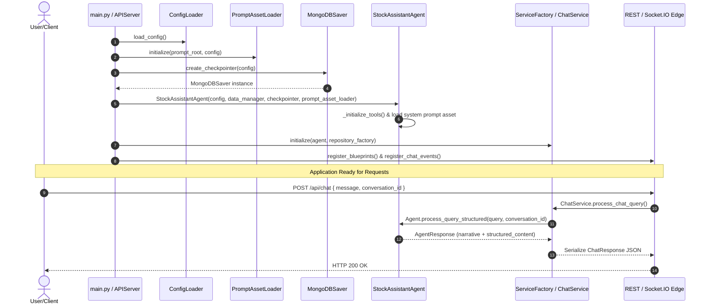
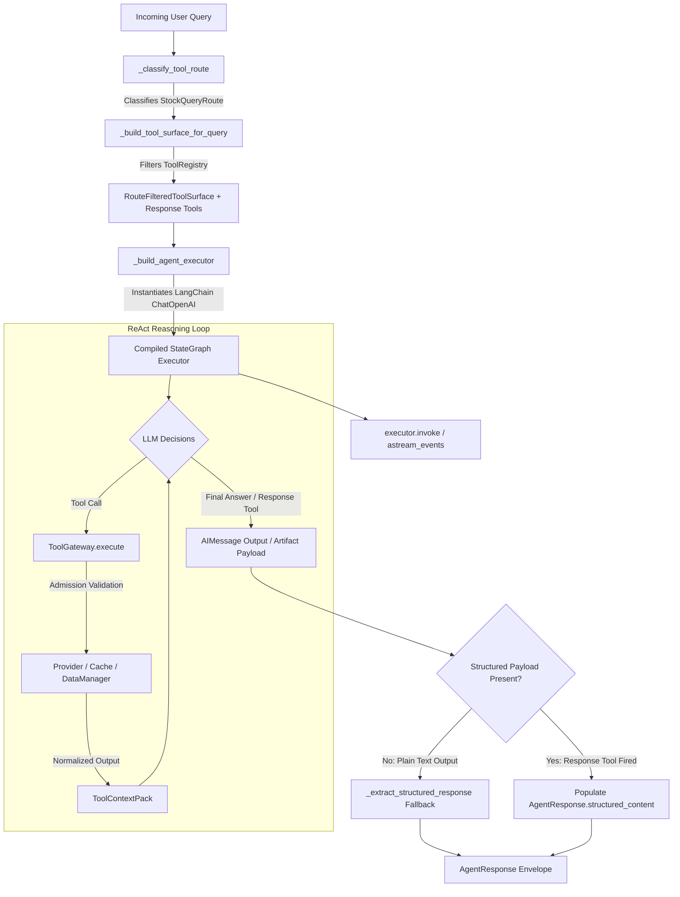

# Stock Investment Assistant — Agent Execution & Application Architecture

> **Document Status**: Active Reference  
> **Last Updated**: July 29, 2026  
> **Domain**: Agent & Application Subsystems  
> **Target Scope**: Application flows, ReAct execution lifecycle, and agent subsystem integrations  
> **Companion Documents**: [ARCHITECTURE_DESIGN.md](./ARCHITECTURE_DESIGN.md), [TECHNICAL_DESIGN.md](./TECHNICAL_DESIGN.md), [AGENT_MEMORY_TECHNICAL_DESIGN.md](./AGENT_MEMORY_TECHNICAL_DESIGN.md), [ADR Index](./DECISIONS/AGENT_ARCHITECTURE_DECISION_RECORDS.md)

---

## 1. Architectural Overview & Boundary Alignment

The **Agent Domain** is a **LangChain/LangGraph-based ReAct (Reasoning + Acting)** subsystem governed by a layered architecture ([ADR-001](./DECISIONS/ADR-AGENT-001-LAYERED-LLM-ARCHITECTURE.md)). It isolates AI reasoning, tool execution, and short-term memory (STM) from transport semantics and backend metadata authority.

### Key Domain Principles:
1. **Strict Authority Separation**: Service orchestration (`ChatService`, `ConversationService`) owns session hierarchy, archive policy, and metadata persistence. The agent runtime ([`stock_assistant_agent.py`](../../src/core/stock_assistant_agent.py)) owns reasoning and checkpoint state binding.
2. **Data-Fact Isolation**: Memory layers store messages, user intents, and routing hints **only**—never market prices, financial ratios, or analytical conclusions. All factual data is sourced dynamically via tools.
3. **Route-Filtered Tool Surfaces**: Model-visible tools are filtered per-turn based on semantic route classification to minimize prompt bloat and prevent non-admitted tool execution.
4. **Structured Response Contracts**: Outputs are emitted through an `AgentResponse` envelope carrying both raw narrative markdown (`content: str`) and typed polymorphic Pydantic payloads (`structured_content: Optional[AgentStructuredOutput]`).

---

## 2. Application Entry Point & Bootstrap Flows

The entry point of the application is [`src/main.py`](../../src/main.py), which delegates setup to [`APIServer`](../../src/web/api_server.py).

```
main.py ──> ConfigLoader ──> APIServer ──> ServiceFactory ──> Flask REST & Socket.IO
                                 │
                                 ├── PromptAssetLoader
                                 ├── MongoDBSaver Checkpointer
                                 └── StockAssistantAgent
```

### 2.1 Initialization Steps (`main.py` & `APIServer`)

1. **CLI & Argument Parsing**: Reads `--mode` (`web`, `cli`, or `both`), `--host`, and `--port`.
2. **Config & Logging Setup**: Loads `config/config.yaml` via `ConfigLoader` and sets log levels while suppressing verbose PyMongo heartbeat loggers.
3. **Prompt Config Validation**: Validates `prompts.*` structural configuration (`validate_prompts_config()`) and instantiates `PromptAssetLoader` to manage versioned prompt assets.
4. **Checkpointer Bootstrap**: Invokes `create_checkpointer(config)` in [`langgraph_bootstrap.py`](../../src/core/langgraph_bootstrap.py) to instantiate a `MongoDBSaver` connected to MongoDB `agent_checkpoints`.
5. **Agent Instantiation**: Instantiates `StockAssistantAgent` with `config`, `DataManager`, `checkpointer`, and `prompt_asset_loader`.
6. **Service & Repository Factory Setup**: Instantiates `RepositoryFactory` and `ServiceFactory`, passing the `agent` instance to `ChatService`.
7. **Transport Blueprint Registration**:
   - **REST**: Registers HTTP Blueprints (`/api/chat`, `/api/conversations`, `/api/sessions`, etc.).
   - **WebSockets**: Registers Socket.IO event handlers (`register_chat_events`) for real-time streaming.

### 2.2 Application Startup & Request Topology Diagram



---

## 3. Current Agent Execution Flow

The core agent execution logic lives in [`src/core/stock_assistant_agent.py`](../../src/core/stock_assistant_agent.py). The runtime uses the **LangGraph ReAct Pattern** (`create_agent`).



### 3.1 Step-by-Step Execution Lifecycle

#### Step 1: Semantic Route Classification
When a query enters `process_query_structured(query, conversation_id=...)`:
- The agent calls `_classify_tool_route(query)`.
- If `StockQueryRouter` is active, it performs semantic vector/keyword classification against predefined routes (`PRICE_CHECK`, `TECHNICAL_ANALYSIS`, `FUNDAMENTALS`, `PORTFOLIO`, `IDEAS`, `NEWS_ANALYSIS`, `GENERAL_CHAT`).

#### Step 2: Route-Filtered Tool Surface Construction
- `_build_tool_surface_for_query()` invokes `ToolSurfaceBuilder` to create a `RouteFilteredToolSurface`.
- Only evidence tools applicable to the classified route are exposed to the model.
- The matching control-plane **Response Tool** ([`ADR-AGENT-005`](./DECISIONS/ADR-AGENT-005-STRUCTURED-OUTPUT-BOUNDARY-AND-RESPONSE-TOOL-PATTERN.md)) is appended:
  - Data routes $\rightarrow$ `submit_stock_analysis`
  - Portfolio/Idea routes $\rightarrow$ `submit_recommendation`
  - General chat $\rightarrow$ `submit_general_chat`

#### Step 3: Per-Turn StateGraph Execution & Checkpoint Binding
- `_build_executor_for_query()` builds a turn-specific compiled `StateGraph` backed by `ChatOpenAI`.
- If a `conversation_id` is supplied, the agent passes `{"configurable": {"thread_id": conversation_id}}` to LangGraph's `invoke()` or `astream_events()`.
- LangGraph automatically loads prior conversation messages from MongoDB `agent_checkpoints` for that `thread_id` and saves updated thread states after the turn.

#### Step 4: Tool Call Interception & Gateway Admission
- When the ReAct agent generates a tool call, execution passes through `ToolGateway.execute()`.
- The gateway checks descriptor integrity, risk classes (`RiskClass.BOUNDED_NON_MUTATING`), freshness rules, and licensing.
- Data outputs are wrapped into normalized kinds (`NormalizedOutput`) and aggregated into a request-scoped `ToolContextPack` for prompt assembly.

#### Step 5: Output Extraction & Structured Payload Assembly
- If the model calls the route response tool (`return_direct=True`), execution terminates immediately (saving tokens), and the Pydantic tool argument becomes `structured_content`.
- If the model emits plain narrative text without invoking a response tool, `process_query_structured()` runs a two-stage service-layer fallback extraction (`_extract_structured_response()`). If fallback extraction degrades, the status is set to `ResponseStatus.PARTIAL`.

---

## 4. Current Agent Integration Subsystems

```
┌─────────────────────────────────────────────────────────────────────────────┐
│                          AGENT INTEGRATION SUBSYSTEMS                       │
├─────────────────────────────────────────────────────────────────────────────┤
│                                                                             │
│   ┌─────────────────────┐  ┌─────────────────────┐  ┌────────────────────┐ │
│   │ 1. Short-Term       │  │ 2. Prompt Asset     │  │ 3. Tool & Provider │ │
│   │    Memory (STM)     │  │    & Composition    │  │    Gateway         │ │
│   │ • MongoDBSaver      │  │ • PromptAssetLoader │  │ • ToolRegistry     │ │
│   │ • conversation_id   │  │ • PromptAssembler   │  │ • ToolSurface      │ │
│   │   -> thread_id      │  │ • Trace Tags        │  │ • ToolGateway      │ │
│   └──────────┬──────────┘  └──────────┬──────────┘  └─────────┬──────────┘ │
│              │                        │                       │            │
│              └────────────────┐       │      ┌────────────────┘            │
│                               ▼       ▼      ▼                             │
│                           ┌──────────────────────┐                         │
│                           │ StockAssistantAgent  │                         │
│                           └──────────┬───────────┘                         │
│                                      │                                     │
│                                      ▼                                     │
│                           ┌──────────────────────┐                         │
│                           │ 4. Model Client      │                         │
│                           │    Factory           │                         │
│                           │ • OpenAI / Grok      │                         │
│                           │ • Fallback Sequence  │                         │
│                           └──────────────────────┘                         │
└─────────────────────────────────────────────────────────────────────────────┘
```

---

### 4.1 Short-Term Memory (STM) Subsystem

Implemented in [`src/core/langgraph_bootstrap.py`](../../src/core/langgraph_bootstrap.py), [`src/utils/memory_config.py`](../../src/utils/memory_config.py), and [`AGENT_MEMORY_TECHNICAL_DESIGN.md`](./AGENT_MEMORY_TECHNICAL_DESIGN.md).

```
Parent Context          Conversation Key           State Checkpointer
┌──────────────┐  1:N   ┌─────────────────┐  1:1   ┌───────────────────┐
│   Session    │ ─────> │ Conversation    │ ─────> │ MongoDBSaver      │
│ (Metadata/   │        │ (Lifecycle/     │        │ (agent_checkpoints│
│  Workspace)  │        │  Message Count) │        │  collection)      │
└──────────────┘        └─────────────────┘        └───────────────────┘
```

- **Thread Mapping**: `conversation_id` maps 1:1 to LangGraph `thread_id`.
- **Collection Boundary**:
  - `agent_checkpoints`: Managed by `MongoDBSaver`. Stores thread runtime messages and tool state.
  - `conversations`: Managed by `ConversationRepository`. Stores metadata, status (`active`, `summarized`, `archived`), token counters, and intent overrides.
- **Archive Policy**: Implements **Archive-Over-Delete**. Closed threads transition to `status: archived`, preserving auditability.

---

### 4.2 Prompt Subsystem

Implemented in [`src/core/prompt_asset_loader.py`](../../src/core/prompt_asset_loader.py), [`src/core/prompt_assembler.py`](../../src/core/prompt_assembler.py), and [`src/prompts/`](../../src/prompts).

- **Externalized System Prompt**: System prompt stored as markdown with YAML frontmatter at `src/prompts/system/react_analyst.md`.
- **Asset Resolution**: `PromptAssetLoader` resolves versioned prompt files based on `SelectionTuple(agent_role, selection_mode, requested_version)`.
- **Route-Aware Prompt Assembly**: When `prompts.route_contexts.enabled: true`, `PromptAssembler` dynamically injects route-specific skill prompts from `src/prompts/skills/routes/*.md`.
- **Observability & Trace Tags**: Prompt version, variant, selection mode, and route metadata are automatically injected into LangSmith trace tags on every invocation turn.

---

### 4.3 Tool Gateway & Provider Subsystem

Implemented across `src/core/tools/` ([`descriptors.py`](../../src/core/tools/descriptors.py), [`surface.py`](../../src/core/tools/surface.py), [`gateway.py`](../../src/core/tools/gateway.py), [`normalization.py`](../../src/core/tools/normalization.py), [`context.py`](../../src/core/tools/context.py)).

```
ReAct LLM
  │
  ├─> ToolSurfaceBuilder (pre-filters tools by query route)
  │
  └─> Tool Gateway Execution Path:
      ToolGateway.execute()
        │
        ├── Risk & License Policy Check
        ├── Cache Backend Check (Redis write-through)
        ├── Tool Execution (DataManager / VietnamMarketDataTool / StockSymbolTool / TradingViewTool)
        ├── Normalizer (Output classification & source attribution)
        └── ToolContextPack Assembly (Request-scoped data context)
```

#### Implemented Tool Families:
1. [`StockSymbolTool`](../../src/core/tools/stock_symbol.py): Symbol resolution, exchange mapping, and internal store metadata lookup.
2. [`VietnamMarketDataTool`](../../src/core/tools/market_data.py): Real-time quotes, technical stats, and market index lookups for Vietnam markets.
3. [`TradingViewTool`](../../src/core/tools/tradingview.py): Returns widget/chart deep-link payloads classified as `VisualizationProvenance`.
4. [`ReportingTool`](../../src/core/tools/reporting.py): Report structure scaffolding.
5. **Control-Plane Response Tools** ([`ADR-AGENT-005`](./DECISIONS/ADR-AGENT-005-STRUCTURED-OUTPUT-BOUNDARY-AND-RESPONSE-TOOL-PATTERN.md)): `submit_stock_analysis`, `submit_recommendation`, `submit_general_chat`.

---

### 4.4 Model Client & Provider Fallback Subsystem

Implemented in [`src/core/model_factory.py`](../../src/core/model_factory.py), [`openai_model_client.py`](../../src/core/openai_model_client.py), and [`grok_model_client.py`](../../src/core/grok_model_client.py).

- **Client Resolution**: `ModelClientFactory.get_client()` constructs and caches provider instances (`openai`, `grok`).
- **Automatic Fallback Chain**: If the primary provider fails during legacy or non-ReAct execution paths, `_generate_with_fallback()` automatically iterates through the configured provider fallback sequence (e.g. OpenAI $\rightarrow$ Grok).
- **Dynamic Model Switching**: Exposes `set_default_model()` and `set_active_model()` to allow runtime model changes via REST API endpoints (`/api/models`).

---

## 5. Summary Matrix of Agent Domain Core Modules

| Module / Component | Layer | Primary Responsibility |
| :--- | :--- | :--- |
| [`main.py`](../../src/main.py) | Entry Point | Bootstraps server mode, CLI REPL, config loader, logging |
| [`api_server.py`](../../src/web/api_server.py) | Transport Server | Initializes Flask CORS, Socket.IO, checkpointer, agent, services, and route blueprints |
| [`stock_assistant_agent.py`](../../src/core/stock_assistant_agent.py) | Agent Core | Executes ReAct reasoning loop, route surface filtering, thread memory binding, and structured response packaging |
| [`langgraph_bootstrap.py`](../../src/core/langgraph_bootstrap.py) | Memory Bootstrap | Instantiates `MongoDBSaver` checkpointer connected to MongoDB `agent_checkpoints` |
| [`prompt_asset_loader.py`](../../src/core/prompt_asset_loader.py) | Prompt Subsystem | Resolves externalized prompt files with frontmatter metadata parsing and fallback handling |
| [`prompt_assembler.py`](../../src/core/prompt_assembler.py) | Prompt Subsystem | Assembles route-aware system prompts combining base prompt assets and route skill templates |
| [`stock_query_router.py`](../../src/core/stock_query_router.py) | Routing | Semantic classification of user queries into domain routes (`PRICE_CHECK`, `FUNDAMENTALS`, etc.) |
| `src/core/tools/*` | Tool Gateway | Registry, descriptor metadata, thin admission gateway, provider policy, normalizer, and context packs |
| [`model_factory.py`](../../src/core/model_factory.py) | Provider Factory | Manages LLM client instances (OpenAI, Grok) and fallback sequence evaluation |
| [`chat_service.py`](../../src/services/chat_service.py) | Service Layer | Business orchestration, archive check validation, per-turn metadata tracking, and fallback extraction |
