# Agent Domain — Architecture Description

> **Status**: Active working draft
> **Standards Stance**: Aligned to ISO/IEC/IEEE 42010
> **Technology Stack**: LangGraph 0.2.62+, LangChain, OpenAI SDK, semantic-router, MongoDB, Redis
> **Companion Documents**: [TECHNICAL_DESIGN.md](./TECHNICAL_DESIGN.md), [AGENT_MEMORY_TECHNICAL_DESIGN.md](./AGENT_MEMORY_TECHNICAL_DESIGN.md), [PROMPT_SYSTEM_RESEARCH_PROPOSAL.md](./PROMPT_SYSTEM_RESEARCH_PROPOSAL.md), [AGENT_ARCHITECTURE_DECISION_RECORDS.md](./decisions/AGENT_ARCHITECTURE_DECISION_RECORDS.md)

## Document Control

| Field | Value |
|-------|-------|
| Project | DP Stock Investment Assistant |
| Domain | Agent |
| Focus | Architecture description of the agent domain, including boundaries, views, concerns, rationale, and evolution |
| Date | 2026-05-21 |
| Status | Active |
| Audience | Engineering, architecture, maintainers, and reviewers |

## Table of Contents

1. [Architecture Description Overview](#1-architecture-description-overview)
2. [Stakeholders, Perspectives, and Concerns](#2-stakeholders-perspectives-and-concerns)
3. [Viewpoint Catalog](#3-viewpoint-catalog)
4. [Architecture Views](#4-architecture-views)
5. [Correspondences and Traceability](#5-correspondences-and-traceability)
6. [Architecture Rationale](#6-architecture-rationale)
7. [Architecture Considerations and Planned Evolution](#7-architecture-considerations-and-planned-evolution)
8. [Revision History](#8-revision-history)

---

## 1. Architecture Description Overview

### 1.1 Purpose

This document is the architecture description for the agent domain. It expresses the fundamental concepts, structures, runtime interactions, and governing rationale of the LangChain-based stock investment assistant agent.

The document follows the repository's documentation methodology, where architecture descriptions are **aligned** to ISO/IEC/IEEE 42010 rather than presented as formal certification artifacts. In this repo, that means the document should identify the entity of interest, environment, stakeholders, concerns, viewpoints, views, correspondences, and rationale while avoiding duplication of detailed implementation material that belongs in technical design, ADRs, contracts, or delivery-scoped specs.

> **Note on scope**: The project methodology defines architecture descriptions at the system level. This is a domain-level architecture description created because the agent domain carries sufficient complexity (multi-layer LLM reasoning, memory management, prompt composition, tooling, and provider fallback) to warrant its own viewpoint-governed description within the system-wide architecture.

> **Architecture-description package statement:** This document set is an agent-domain architecture description aligned to ISO/IEC/IEEE 42010 concepts. It is intended to define the agent domain's entity of interest, stakeholders, concerns, viewpoints, views, correspondences, and rationale across the companion architecture package. It is not a formal certification artifact and does not claim whole-system compliance for the full DP Stock Investment Assistant.

### 1.2 Entity of Interest

The **entity of interest** is the **agent domain** of the DP Stock Investment Assistant: the LangChain and LangGraph-based reasoning and tool-orchestration subsystem that answers stock-investment queries, manages conversation-scoped short-term memory, applies prompt policies and guardrails, and coordinates model/provider fallback behavior.

### 1.3 Environment and External Dependencies

The agent domain operates within a wider application and infrastructure environment that includes:

- frontend clients that initiate chat and streaming requests;
- backend API routes and Socket.IO handlers that invoke the agent;
- service-owned session and conversation-management boundaries that resolve reusable parent context and lifecycle metadata;
- MongoDB collections for conversation metadata and LangGraph checkpoints, with future LTM personalization remaining a separate planned authority boundary;
- Redis-backed caching and in-memory fallback cache paths;
- external model providers such as OpenAI and Grok;
- external financial data sources such as Yahoo Finance;
- future prompt asset, evaluation, and observability flows governed by prompt-version and runtime metadata.

### 1.4 Scope and Boundaries

This architecture description covers:

- agent orchestration and tool use;
- route classification and provider/model selection;
- conversation-scoped STM wiring and lifecycle boundaries;
- prompt composition and behavioral guardrail architecture;
- primary runtime flows and domain-level evolution directions.

This architecture description does not replace:

- [TECHNICAL_DESIGN.md](./TECHNICAL_DESIGN.md) for implementation-oriented realization detail;
- [AGENT_MEMORY_TECHNICAL_DESIGN.md](./AGENT_MEMORY_TECHNICAL_DESIGN.md) for STM and checkpoint subsystem detail;
- [AGENT_ARCHITECTURE_DECISION_RECORDS.md](./decisions/AGENT_ARCHITECTURE_DECISION_RECORDS.md) and the individual ADRs for decision authority;
- SRS or spec artifacts for requirement authority and delivery traceability.

### 1.5 Key Characteristics

| Aspect | Description |
|--------|-------------|
| Architecture | ReAct pattern with tool orchestration |
| AI Framework | LangChain >=1.0.0 with `langchain_core` and `langchain_openai` |
| Model Providers | OpenAI (GPT-5-nano), Grok (grok-4-1-fast-reasoning) with automatic fallback |
| Tool System | Registry-based with caching support |
| Memory | Service-owned session context and lifecycle metadata, LangGraph `MongoDBSaver` for conversation-scoped STM, and a planned future LTM personalization boundary |
| Semantic Router | `semantic-router` library with OpenAI/HuggingFace encoders |
| Response Types | Structured (`AgentResponse`) with immutable dataclasses |
| Prompt System | Architecture baseline uses a single governed runtime prompt; planned evolution externalizes shared policy, route-aware skills, and prompt guardrails through the ADR-governed prompt compiler path |

### 1.6 Document Authority Split

| Document | Primary Responsibility |
|----------|------------------------|
| [ARCHITECTURE_DESIGN.md](./ARCHITECTURE_DESIGN.md) | Viewpoint-governed architecture description for the agent domain |
| [TECHNICAL_DESIGN.md](./TECHNICAL_DESIGN.md) | Technical realization, component behavior, configuration, and extension details |
| [AGENT_MEMORY_TECHNICAL_DESIGN.md](./AGENT_MEMORY_TECHNICAL_DESIGN.md) | Detailed memory subsystem design, data model, sequence diagrams, and API impacts |
| [ADR-AGENT-001-LAYERED-LLM-ARCHITECTURE.md](./decisions/ADR-AGENT-001-LAYERED-LLM-ARCHITECTURE.md) | Governing layered architecture and memory boundaries |
| [ADR-AGENT-002-SKILLS-PATTERN-PROMPT-COMPOSITION.md](./decisions/ADR-AGENT-002-SKILLS-PATTERN-PROMPT-COMPOSITION.md) | Prompt skills composition decision |
| [ADR-AGENT-003-EXTERNALIZE-VERSION-PROMPT-ASSETS.md](./decisions/ADR-AGENT-003-EXTERNALIZE-VERSION-PROMPT-ASSETS.md) | Externalized prompt asset decision |

---

## 2. Stakeholders, Perspectives, and Concerns

### 2.1 Stakeholders

The agent-domain architecture package uses the following normalized stakeholder classes across the architecture description and ADR set.

| Stakeholder | Responsibilities | Key Concerns |
|-------------|------------------|--------------|
| Product | Feature roadmap, prioritization, and release planning | Capability coverage, iteration speed, user value |
| Business | Product-risk framing and domain-positioning oversight | Non-advisory boundary, financial-domain risk, adoption confidence |
| End Users | Use the assistant for investment research and decision support | Transparency, clarity, trust, usability |
| AI Engineers / Agent Maintainers | Agent orchestration, model behavior, prompt evolution, and retrieval design | Accuracy, explainability, prompt evolution, extensibility |
| Backend Engineers | Service, API, and metadata integration | Maintainability, extensibility, stable invocation contracts, lifecycle integrity |
| DevOps / SRE | Runtime operations, deployment, observability, and recovery support | Reliability, observability, rollback safety, drift visibility |
| Security & Compliance | Data handling, policy controls, and legal safeguards | Privacy, financial disclaimers, evidence-first behavior, anti-hype controls |
| Architecture Owners | Architecture governance and decision consistency | Boundary integrity, ADR alignment, separation of concerns |
| QA / Test Maintainers | Verification strategy, regression control, and release-readiness checks | Testability, release confidence, behavior regression detection |

### 2.2 Concerns

The architecture description is intended to address the following recurring concerns:

- how the agent domain is bounded within the larger system;
- how the static architecture is decomposed across runtime, tools, memory, prompts, and supporting services;
- how requests flow through routing, tool use, fallback, and response generation;
- how conversation-scoped STM is isolated and governed;
- how prompt behavior, guardrails, and future prompt externalization align to ADRs;
- how current design choices support extensibility without collapsing responsibilities across layers;
- how future evolution paths remain explicit without turning this architecture description into a roadmap backlog.

### 2.3 Concern Categories

This architecture description uses the following concern categories to frame concerns:

- **structural**: source layout, major components, boundaries, and dependencies;
- **behavioral**: runtime flows, routing, fallback, streaming, and prompt assembly;
- **informational/stateful**: conversation state, checkpoint relationships, and metadata ownership;
- **operational**: traceability, observability hooks, and evolution constraints.

---

## 3. Viewpoint Catalog

### 3.1 How Viewpoints and Views Are Used in This Document

This architecture description follows the ISO 42010 distinction between a **viewpoint** and a **view**:

- a **viewpoint** is the template that defines which stakeholders, concerns, and model kinds govern a view;
- a **view** is the actual architecture content produced using that viewpoint.

In this document, section 3 defines the viewpoints. Section 4 then provides one architecture view for each viewpoint so the framing rules and the resulting architecture description stay clearly separated.

### 3.2 Viewpoint Catalog

| Viewpoint | Stakeholders | Concerns Framed | Conventions / Model Kinds |
|-----------|--------------|-----------------|----------------------------|
| Context and Boundary Viewpoint | Architecture Owners, Backend Engineers, Product, Security & Compliance | Domain scope, environment, external dependencies, system boundary, ownership boundaries | Narrative boundary statements, system context diagrams, context summaries, dependency tables |
| Logical Viewpoint | AI Engineers / Agent Maintainers, Backend Engineers, Architecture Owners | Modularity, separation of concerns, responsibility allocation, integration boundaries, dependency direction | Component and responsibility tables, logical decomposition summaries, relationship narratives |
| Process Viewpoint | AI Engineers / Agent Maintainers, Backend Engineers, DevOps / SRE | Runtime flow, route handling, tool orchestration, latency-sensitive paths, provider fallback, fault tolerance | Interaction flows, sequence-style diagrams, runtime decision summaries |
| Information and State Viewpoint | Architecture Owners, Backend Engineers, Security & Compliance | STM scope, state ownership, lifecycle, metadata boundaries, hierarchy, memory constraints | State and lifecycle tables, hierarchy summaries, state ownership narratives |
| Development Viewpoint | AI Engineers / Agent Maintainers, Backend Engineers, QA / Test Maintainers | Code organization, module ownership, maintainability, build-facing structure, extension points | Source-layout views, module-boundary summaries, ownership and dependency tables |
| Deployment Viewpoint | DevOps / SRE, Security & Compliance, Architecture Owners | Runtime topology, containers and services, health endpoints, scaling boundaries, environment overlays, secrets boundaries | Deployment context summaries, topology tables, environment and probe mappings |
| Operations and Maintenance Viewpoint | DevOps / SRE, Backend Engineers, Product, Security & Compliance | Production operation, availability, resilience, observability, drift detection, recovery surfaces, maintainability in service | Operational responsibility tables, resilience summaries, observability and health mappings |
| Prompt and Behavior Viewpoint | AI Engineers / Agent Maintainers, Architecture Owners, Security & Compliance, Product | Prompt composition, guardrails, behavioral policy, prompt observability, prompt evolution | Layered prompt diagrams, taxonomy tables, metadata tables |

These viewpoints govern the corresponding views in section 4. Detailed code-oriented realization belongs in [TECHNICAL_DESIGN.md](./TECHNICAL_DESIGN.md), detailed STM realization belongs in [AGENT_MEMORY_TECHNICAL_DESIGN.md](./AGENT_MEMORY_TECHNICAL_DESIGN.md), and deployment procedure detail belongs in [IaC/README.md](../../../IaC/README.md).

---

## 4. Architecture Views

### 4.1 Context and Boundary View

The agent domain sits between the API and service layer and the external data and model-provider ecosystem. It does not own the frontend UI, REST or Socket.IO transport surface, or repository-wide operational policy. It does own reasoning workflow, tool orchestration, route-aware behavior, prompt-system policy composition, provider fallback, and conversation-scoped STM binding, while consuming service-owned session context and lifecycle authority rather than absorbing those controls into the runtime.

The primary context relationships are:

- API routes and Socket.IO handlers pass user requests into the agent runtime;
- service-layer components govern ownership, archival checks, session-context resolution, and metadata synchronization around conversations;
- LangGraph checkpointer infrastructure stores conversation-scoped execution state only;
- future LTM personalization is a planned cross-conversation boundary and is not a synonym for session context, checkpoints, or retrieval;
- tool implementations gather external or repository-backed data;
- prompt policy is governed inside the system boundary through the current runtime baseline and the planned prompt compiler path;
- prompt assets and prompt composition logic govern model behavior, not factual storage.

This boundary is consistent with the repository methodology's rule that architecture descriptions should explain **what structures and interactions exist**, while implementation detail and contract detail remain in companion documents.

#### 4.1.1 System Context

The system context view clarifies the trust and control boundaries between client applications, service orchestration, session-context resolution, conversation lifecycle governance, conversation-scoped checkpoint persistence, planned future LTM personalization, prompt-system assets, external LLM providers, and external market data providers. This boundary is operationally important because security, archive governance, reusable parent context, runtime-state persistence, and evidence acquisition are owned by different internal layers.

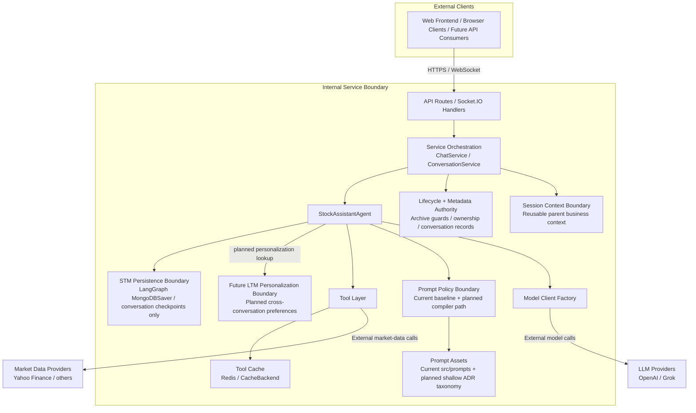

```text
Boundary classification
-----------------------
Client apps            : Outside internal trust boundary
Service orchestration  : Internal request-governance boundary
Conversation lifecycle : Internal business-state and archive-governance boundary
Session context        : Internal reusable-parent-context boundary
Checkpoint persistence : Internal recoverable runtime-state boundary
Future LTM (planned)   : Internal cross-conversation personalization boundary
Prompt system assets   : Internal behavioral policy boundary (ADR-governed taxonomy)
LLM providers          : External AI processing boundary
Market data providers  : External evidence and pricing boundary
Redis cache            : Internal cache acceleration boundary
```

The architecture intentionally routes external reasoning and evidence flows through distinct internal control points rather than allowing client applications to call providers or state stores directly. Service orchestration owns request validation, session-context resolution, and conversation lifecycle governance, the agent runtime binds conversation-scoped checkpoints, any future LTM layer remains a distinct optional personalization boundary, the tool layer mediates cache and market-data access, and prompt behavior is mediated internally through ADR taxonomy assets and guardrail middleware before provider calls. The current REST chat path enforces the lifecycle boundary directly through `ChatService`, while Socket.IO parity remains a documented follow-up in companion technical-design material.

| Boundary | Primary Responsibility | Security / Compliance / Operations Significance |
|----------|------------------------|-------------------------------------------------|
| Client Apps -> Transport and Service Edge | Transport, authentication, request validation, and streaming control | Protects internal capabilities from direct exposure and centralizes auditability |
| Service Orchestration -> Conversation Lifecycle and Metadata | Archive guards, conversation existence, metadata recording, and session-context resolution | Keeps business lifecycle and ownership control outside the reasoning runtime |
| Service Orchestration -> Session Context Boundary | Resolve reusable parent business context across related conversations | Keeps parent context separate from checkpoints and future personalization so sibling conversations do not share thread state |
| Agent Runtime -> Conversational Checkpoint Persistence | Thread-local reasoning state and checkpoint recovery | Prevents checkpoint storage from becoming the source of truth for ownership, archive policy, or reusable parent context |
| Agent Runtime -> Future LTM Personalization Boundary (planned) | Optional cross-conversation personalization and symbol-tracking context | Keeps planned personalization separate from lifecycle metadata, checkpoint state, and sourced evidence |
| Agent Runtime -> Prompt System Assets | Prompt policy composition and behavioral guardrail enforcement | Keeps behavioral policy versioned, auditable, and governed within the internal control boundary |
| Agent Runtime / Model Factory -> LLM Providers | Prompted reasoning and generated responses | External AI providers must be treated as non-authoritative processors; prompts and outputs require policy and logging controls |
| Tool Layer -> Market Data Providers | Evidence and pricing retrieval through tools | Keeps factual market-data sourcing explicit and separable from model reasoning |
| Tool Layer -> Redis Cache | Execution acceleration for tool paths | Preserves cache separation from authoritative business or conversational state |

From a compliance and operational perspective, this context establishes six hard boundaries:

1. Client applications are consumers of the system, not participants in internal orchestration.
2. Conversation lifecycle governance, application metadata, and reusable session context remain in the service layer and do not collapse into the checkpoint store.
3. Conversation-scoped checkpoints retain reasoning state for a thread but do not become the source of truth for archive policy, ownership, reusable parent context, or business metadata.
4. Future LTM personalization, when realized, remains an optional cross-conversation personalization boundary rather than a replacement for session context, STM, or retrieval.
5. LLM providers are external reasoning services and do not become the source of truth for market facts or conversation ownership.
6. Market data providers are external evidence sources and are accessed only through controlled internal tool paths.

This system context complements the deployment and operations views by showing who is inside the controlled system boundary and which dependencies remain external.

#### 4.1.1a External and Internal Interface Diagram (Architecture-Level)

The following diagram keeps an architecture-level view of system components and primary interfaces across the trust boundary. The labels use a canonical interface vocabulary for this architecture package so the boundary can be described consistently across context, logical, and technical views without forcing implementation detail into the architecture narrative.

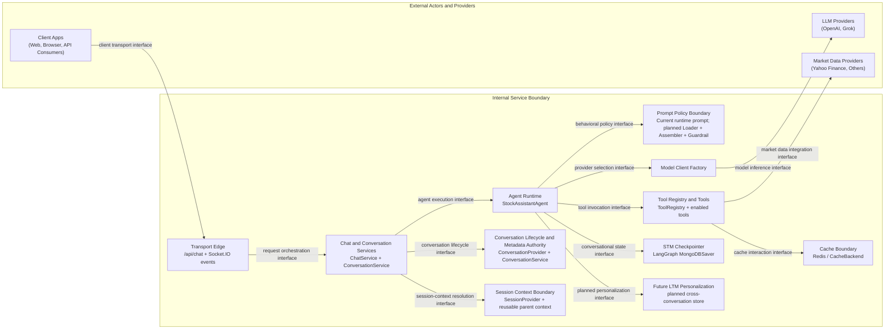

The architecture-relevant interfaces expressed in this view are:

| Interaction Direction | Canonical Interface Name | Architectural Meaning |
|-----------------------|--------------------------|-----------------------|
| Client -> Transport edge | Client transport interface | Admits user requests and response streams across the trust boundary while keeping transport concerns separate from reasoning concerns |
| Transport edge -> service orchestration | Request orchestration interface | Hands normalized user work into the internal control boundary where validation, delivery mode, and downstream coordination are governed |
| Service orchestration -> agent runtime | Agent execution interface | Transfers a conversation-qualified unit of work into the reasoning runtime without making the runtime own client or transport semantics |
| Service orchestration -> conversation lifecycle and metadata boundary | Conversation lifecycle interface | Applies lifecycle governance, context-resolution, and archive-integrity controls to conversations outside the reasoning runtime |
| Service orchestration -> session context boundary | Session-context resolution interface | Resolves reusable parent business context independently from checkpoint state and from any future LTM personalization |
| Agent runtime -> prompt policy boundary | Behavioral policy interface | Separates behavior shaping and guardrail policy from state management and evidence acquisition |
| Agent runtime -> tool boundary | Tool invocation interface | Delegates evidence gathering and deterministic computation to governed tool surfaces rather than embedding external access into the runtime core |
| Agent runtime -> model factory | Provider selection interface | Isolates provider choice, model binding, and fallback policy from the reasoning workflow itself |
| Agent runtime -> STM checkpointer | Conversational state interface | Binds checkpoint-managed conversational runtime state to a dedicated persistence boundary without collapsing lifecycle metadata or session context into runtime memory |
| Agent runtime -> future LTM personalization boundary | Planned personalization interface | Reserves a distinct future boundary for cross-conversation personalization so it does not blur with session context, STM, or evidence retrieval |
| Tool boundary -> cache boundary | Cache interaction interface | Keeps execution acceleration separate from authoritative business or evidence state |
| Model factory -> external LLMs | Model inference interface | Carries outbound reasoning requests to external providers while preserving internal control over policy and provider selection |
| Tool boundary -> market data providers | Market data integration interface | Constrains factual evidence acquisition to explicit internal mediation points |

Detailed realization anchors for this vocabulary are intentionally deferred to [TECHNICAL_DESIGN.md](./TECHNICAL_DESIGN.md), where the same interface names are bound to routes, protocols, factories, and concrete methods.

This interface view makes two architectural boundaries explicit that are easy to miss in a simpler adjacency diagram. First, conversation lifecycle and archive-integrity responsibilities are exercised in the service layer before and after agent execution rather than inside the reasoning core. Second, conversation memory, metadata persistence, provider selection, prompt policy, tool execution, and cache use are separate integration boundaries with distinct owners and evolution paths even though they contribute to one end-user interaction.

### 4.2 Logical View

#### 4.2.1 Logical Building Blocks

| Building Block | Responsibility |
|----------------|----------------|
| `[Implemented]` [stock_assistant_agent.py](../../../src/core/stock_assistant_agent.py) | Main ReAct runtime and conversation-aware agent entry points |
| `[Implemented]` [langgraph_bootstrap.py](../../../src/core/langgraph_bootstrap.py) | STM infrastructure boundary, including checkpointer creation and conversation-scoped checkpoint wiring |
| `[Implemented]` [stock_query_router.py](../../../src/core/stock_query_router.py) | Semantic route classification |
| `[Implemented]` [model_factory.py](../../../src/core/model_factory.py) and provider clients | Provider and model selection with cached client construction |
| `[Implemented]` [src/core/tools/](../../../src/core/tools/) | Tool registration, caching, and domain data access |
| `[Implemented]` [conversation_repository.py](../../../src/data/repositories/conversation_repository.py) | Conversation metadata persistence, archive status, and session linkage outside checkpoint state |
| `[Implemented]` [chat_service.py](../../../src/services/chat_service.py) and [conversation_service.py](../../../src/services/conversation_service.py) | Service orchestration, archive guards, session-context resolution, lifecycle governance, and metadata helpers |
| `[Planned]` Future LTM personalization boundary | Optional cross-conversation personalization and symbol-tracking context outside the current runtime baseline |
| `[Implemented]` [src/prompts/](../../../src/prompts/) | Current runtime prompt templates and text assets; planned externalized prompt asset model remains `[Proposed]` under ADR-002 and ADR-003 as a shallow metadata-driven `system` / `skills` / `experiments` taxonomy |

These building blocks are separated so that reasoning orchestration, session context, STM persistence, metadata ownership, provider integration, and future personalization can evolve independently. The agent runtime owns reasoning and tool orchestration, service-layer components own reusable parent context and business lifecycle enforcement, checkpoints own recoverable conversation-scoped runtime state only, repositories own metadata persistence, and prompt assets govern behavior rather than domain data.

#### 4.2.2 Responsibility and Dependency Boundaries

| Logical Concern | Primary Owner | Architectural Boundary |
|-----------------|---------------|------------------------|
| Reasoning, tool selection, and STM binding | `[Implemented]` [StockAssistantAgent](../../../src/core/stock_assistant_agent.py) | Binds `conversation_id -> thread_id` into conversation-scoped runtime state but does not own lifecycle authority, session context, or checkpoint persistence policy |
| STM persistence infrastructure | `[Implemented]` [langgraph_bootstrap.py](../../../src/core/langgraph_bootstrap.py) plus LangGraph checkpointer boundary | Preserves recoverable thread-local runtime state only; not a source of truth for archive policy, ownership, or metadata |
| Semantic route classification | `[Implemented]` [stock_query_router.py](../../../src/core/stock_query_router.py) | Classifies requests but does not execute tools or persist state |
| Provider and model selection | `[Implemented]` [ModelClientFactory](../../../src/core/model_factory.py) and provider clients | Isolates provider-specific concerns from routes and services |
| Session context resolution and conversation lifecycle | `[Implemented]` [ChatService](../../../src/services/chat_service.py), [ConversationService](../../../src/services/conversation_service.py) | Owns reusable parent context, archive guards, and metadata synchronization outside the agent core; REST path currently enforces this boundary directly |
| Conversation metadata persistence | `[Implemented]` [ConversationRepository](../../../src/data/repositories/conversation_repository.py) | Persists application metadata and session linkage, separate from LangGraph checkpoint state |
| Future cross-conversation personalization | `[Planned]` Future LTM boundary | Optional personalization only; not factual store or required orchestration state |
| Prompt behavior and guardrails | `[Implemented]` Current runtime prompt baseline plus `[Planned]` prompt compiler path (`PromptAssetLoader -> PromptAssembler -> ResponseGuardrailMiddleware`) | Controls behavioral policy, not business state or financial facts |

This logical separation is the primary extensibility mechanism for the domain. New providers, tools, prompt assets, or conversation-management behaviors should be added by extending the relevant building block rather than by collapsing responsibilities into the agent runtime.

Current transport parity remains intentionally visible as a caveat rather than hidden as a design assumption: the REST path enforces lifecycle and metadata guards through `ChatService`, while Socket.IO parity for those same service-owned controls remains a documented follow-up.

#### 4.2.2a Logical Component Interface View

This view focuses on logical component categories and architectural interfaces, using the same canonical interface vocabulary as section 4.1.1a but at a logical decomposition level. The goal is to show which logical boundary owns each interaction, not how that interaction is implemented.

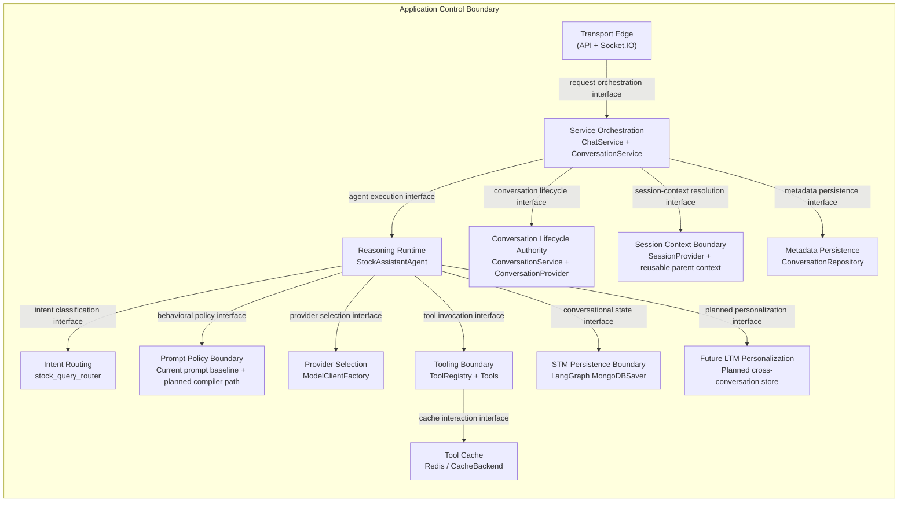

The logical architectural interfaces are interpreted as follows:

| Interaction Direction | Canonical Interface Name | Architectural Meaning |
|-----------------------|--------------------------|-----------------------|
| Transport edge -> service orchestration | Request orchestration interface | Converts externally initiated work into an internally governed work item |
| Service orchestration -> reasoning runtime | Agent execution interface | Preserves a clean handoff between business governance and reasoning execution |
| Service orchestration -> conversation lifecycle | Conversation lifecycle interface | Enforces conversation existence, archive status, and per-turn metadata governance outside the reasoning runtime |
| Service orchestration -> session context boundary | Session-context resolution interface | Resolves reusable parent business context separately from checkpoints and any future personalization store |
| Reasoning runtime -> intent routing | Intent classification interface | Lets classification evolve independently from tool execution and provider binding |
| Reasoning runtime -> prompt composition boundary | Behavioral policy interface | Keeps response behavior and guardrails as a distinct policy concern |
| Reasoning runtime -> provider selection | Provider selection interface | Prevents provider mechanics from leaking into service or transport layers |
| Reasoning runtime -> tooling boundary | Tool invocation interface | Contains external evidence access and deterministic computation behind a governed surface |
| Service orchestration -> metadata persistence | Metadata persistence interface | Separates business metadata ownership from checkpoint-managed conversational state |
| Reasoning runtime -> conversational state store | Conversational state interface | Isolates checkpoint-managed conversational runtime state from broader application lifecycle metadata and parent-context authority |
| Reasoning runtime -> future LTM personalization | Planned personalization interface | Preserves a future cross-conversation personalization boundary without making it a current runtime dependency |
| Tooling boundary -> tool cache | Cache interaction interface | Limits execution acceleration to the tooling boundary rather than the broader reasoning model |

Taken together, these boundaries show that the logical decomposition is not only a grouping of components but also a partitioning of authority. Orchestration owns business governance and session-context resolution, the runtime owns reasoning and checkpoint binding, routing classifies, prompt composition governs behavior, provider selection mediates model access, tooling mediates evidence access, STM persistence remains separate from lifecycle metadata, and future LTM stays a planned personalization boundary rather than an implied current store.

#### 4.2.3 Layered Architecture Boundaries

The agent domain uses a layered architecture so personalization, session context, conversation state, external evidence, behavioral policy, and deterministic computation remain separable concerns rather than blending into a single prompt or storage surface. The status labels below distinguish active runtime boundaries from planned or future target-state layers.

| Layer | Current Status | Primary Purpose | Architectural Boundary |
|-------|----------------|-----------------|------------------------|
| Session Context (adjacent control boundary) | Implemented | Hold reusable parent business context across related conversations | Service-owned boundary outside the LLM memory tiers; sibling conversations do not share checkpoints |
| Long-Term Memory (LTM) | Planned | Persist stable user preferences and symbol-tracking context across conversations | Personalization layer only; not a source of market facts, valuations, or recommendations |
| Short-Term Memory (STM) | Implemented | Retain conversation-scoped state and checkpoint-managed reasoning context | Scoped to a conversation boundary; does not become a cross-session factual store or lifecycle authority |
| Intent Routing | Implemented | Classify requests so the runtime selects the right tools, retrieval path, and response behavior | Classification layer only; does not own persistence, tool execution, or lifecycle rules |
| Retrieval-Augmented Generation (RAG) | Planned architecture; partial evidence support via tools today | Supply sourced evidence for domain-specific reasoning | Evidence layer only; stores retrieved source content, not user preferences or model-authored conclusions |
| Prompting and Guardrails | Implemented baseline; planned compiler expansion | Control behavior, disclosure, and response framing | Policy layer only; governs how the model behaves, not where domain truth is stored |
| Tools and Deterministic Computation | Implemented | Fetch data and compute auditable metrics | Computation layer only; performs data retrieval and calculations that the LLM then interprets |
| Fine-Tuning | Future | Enforce reasoning structure and tone for selected workflows | Behavior-shaping layer only; does not function as a knowledge store |

Session context and lifecycle metadata sit adjacent to these LLM layers rather than inside them: the service layer owns reusable parent business context and conversation lifecycle control, while the runtime consumes only the state surfaces intentionally passed into it.

This boundary model is the core rationale for ADR-001: it reduces hallucination pressure, keeps market facts external to memory and prompt state, and allows session context, retrieval, prompting, and execution behavior to evolve independently.

#### 4.2.3a Dependency and Ownership Diagram

This diagram emphasizes dependency direction and ownership boundaries at architecture abstraction level.

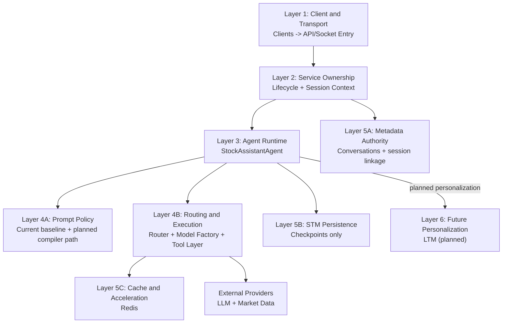

Metadata authority, STM persistence, and cache acceleration may share deployment substrates today, but they remain separate logical authorities. Future LTM is shown as a planned boundary, not a current runtime dependency.

#### 4.2.4 Structural Patterns and Stack Summary

| Category | Architectural Role |
|----------|--------------------|
| Factory | `[Implemented]` [ModelClientFactory](../../../src/core/model_factory.py), `create_checkpointer()` with explicit separation between provider wiring and STM persistence boundary setup |
| Registry / Singleton | `[Implemented]` [ToolRegistry](../../../src/core/tools/registry.py) |
| Strategy | Provider-specific model clients |
| Template Method / Decorator | `[Implemented]` [CachingTool](../../../src/core/tools/base.py) |
| Repository | `[Implemented]` [ConversationRepository](../../../src/data/repositories/conversation_repository.py) |
| Planned Asset Loader / Composer / Middleware | Prompt system evolution path aligned to ADR-002 and ADR-003 |

Memory-specific realization follows the same separation-of-authority rule: checkpointer factories govern STM persistence, repositories govern lifecycle metadata and session linkage, and any future LTM store remains a separate extension point rather than an extension of the checkpoint boundary. The detailed class hierarchy, patterns catalog, configuration snippets, and file relationships are preserved in [TECHNICAL_DESIGN.md](./TECHNICAL_DESIGN.md).

### 4.3 Process View

The process view describes the runtime interactions that turn a user request into a routed, tool-aware, and provider-backed response. It focuses on the execution path and degraded-operation behavior rather than on class-level realization.

#### 4.3.1 Primary Query Processing Flow

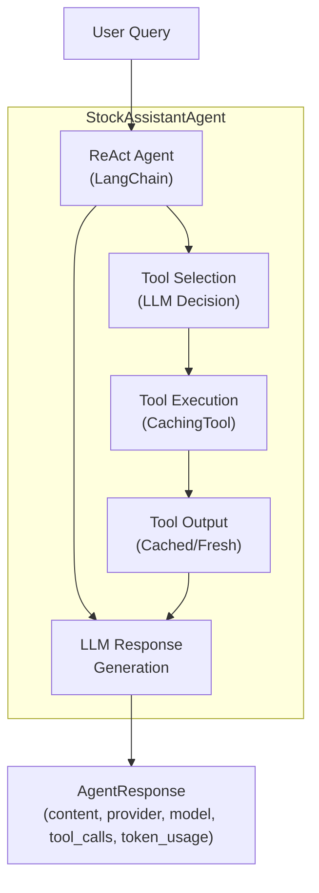

##### End-to-End Request/Response & Streaming Sequence (UML Notation)

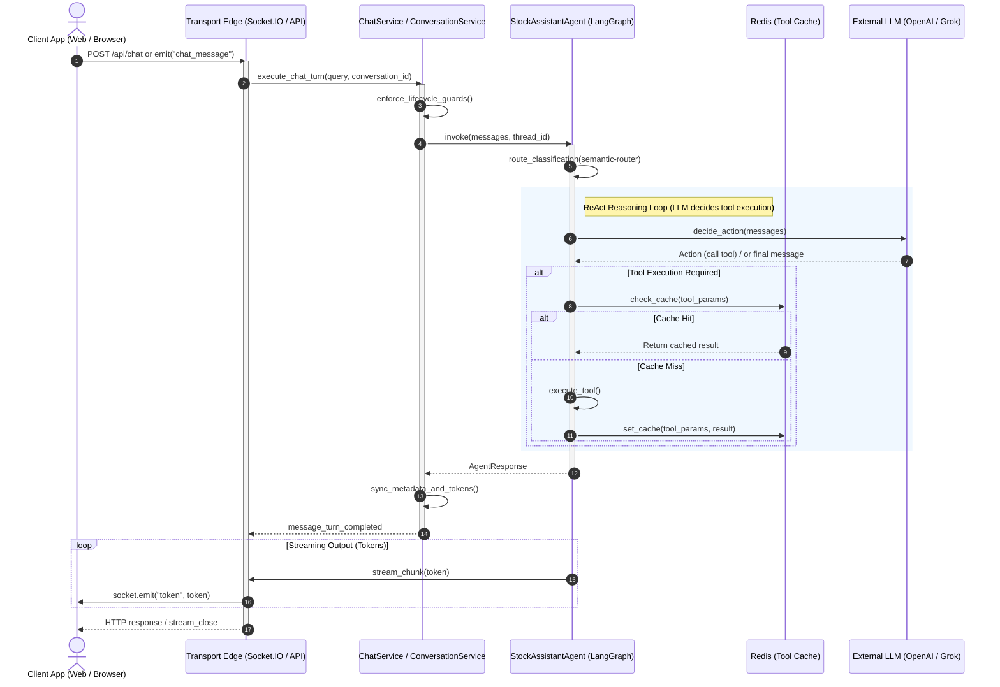

Service-layer orchestration remains on the outer edge of this process. Archive safety, ownership validation, and metadata synchronization are intentionally handled outside the core reasoning loop so the process path can stay focused on classification, tool use, and generation.

#### 4.3.2 Route Classification View

The runtime uses `semantic-router` with OpenAI embeddings and HuggingFace fallback to classify user requests into one of eight route categories.

| Route | Description | Example Queries |
|-------|-------------|-----------------|
| `PRICE_CHECK` | Current prices, quotes, market cap | "What is AAPL trading at?" |
| `NEWS_ANALYSIS` | Headlines, earnings, market events | "Latest news on Tesla" |
| `PORTFOLIO` | Holdings, P&L, allocation | "Show my portfolio value" |
| `TECHNICAL_ANALYSIS` | Charts, MACD, RSI, patterns | "Show RSI for NVDA" |
| `FUNDAMENTALS` | P/E, P/B, DCF, financial ratios | "What's Apple's P/E ratio?" |
| `IDEAS` | Stock picks, investment strategies | "Recommend growth stocks" |
| `MARKET_WATCH` | Index updates, sector performance | "How is VN-Index doing?" |
| `GENERAL_CHAT` | Fallback for unmatched queries | "Hello, how are you?" |

#### 4.3.3 Provider Selection and Fallback View

The provider and model path is mediated by `ModelClientFactory`, which caches provider-model client instances. Runtime fallback behavior preserves a graceful-degradation path if the primary provider fails or if the ReAct executor is unavailable.

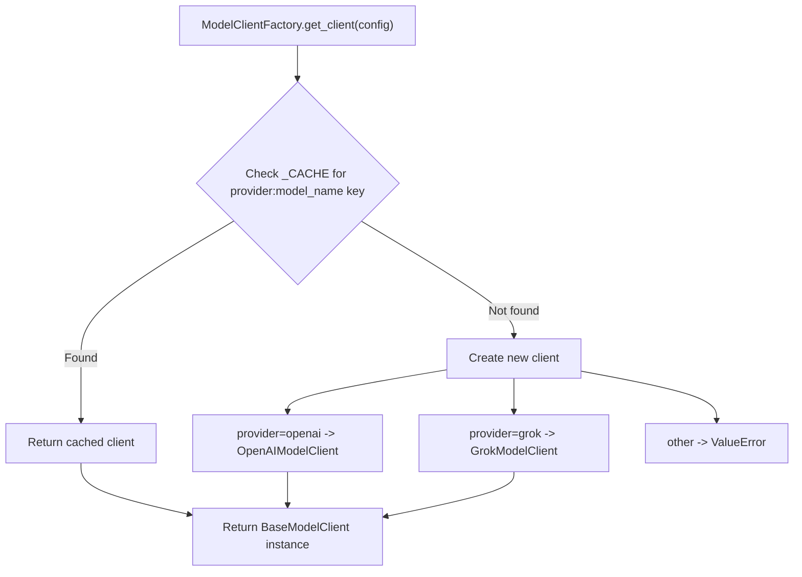

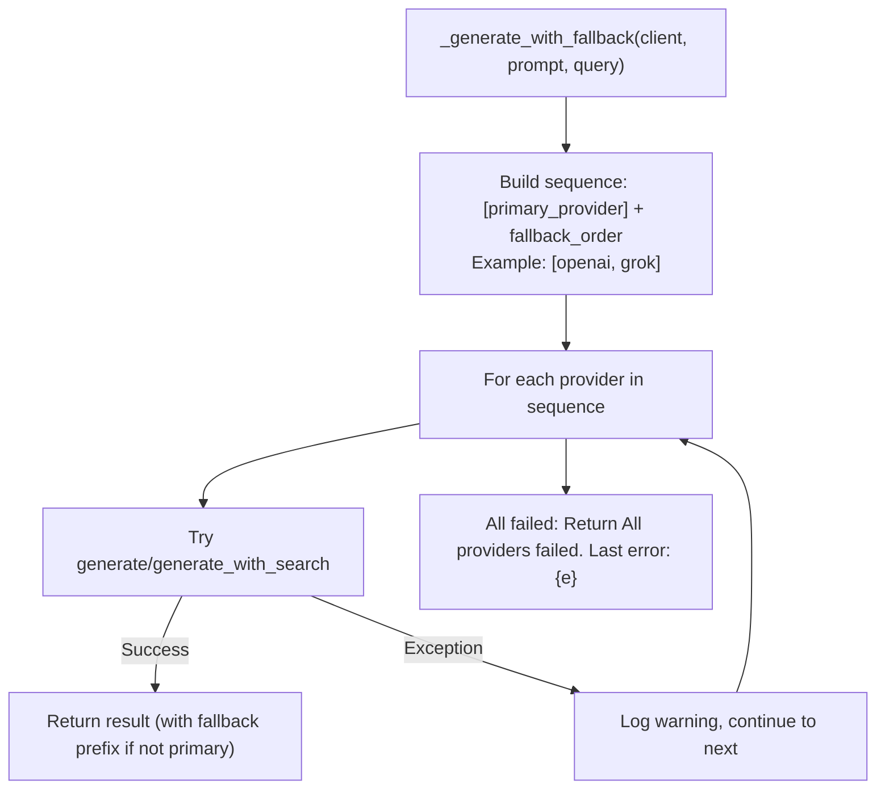

These process flows express the domain's latency and fault-tolerance posture: semantic routing limits unnecessary tool exploration, provider fallback preserves degraded operation, and service-layer lifecycle checks keep archived or invalid conversation states out of the reasoning path.

### 4.4 Information and State View

The agent domain uses LangGraph's `MongoDBSaver` for conversation-scoped STM persistence, with `conversation_id -> thread_id` as the canonical binding. The architecture deliberately separates five non-interchangeable state and evidence surfaces: session-owned reusable business context, service-owned conversation lifecycle and metadata, agent-owned checkpoint state, future long-term personalization state, and sourced evidence or computed results that remain outside memory. Sessions remain parent business context, conversations own STM identity, checkpoints retain only thread-local execution state, and evidence stays external to the memory layers.

The layered LLM architecture (ADR-001) also defines a Long-Term Memory (LTM) layer for stable, slow-changing user preferences and symbol-tracking context. In target-state terms, LTM is a cross-conversation personalization store shared across threads, not a synonym for session context, STM history, or RAG. LTM is architecturally distinct from STM: it persists across conversations, enables personalization and routing, and explicitly excludes financial facts, which remain in RAG or tools. LTM is not yet implemented in the runtime; the design and scope boundaries are governed by the ADR-001 LTM boundary decision.

ADR-001 further defines **Retrieval-Augmented Generation (RAG)** and **Fine-Tuning** as distinct architectural layers. RAG provides intent-specific vector indices for sourced documents, while Fine-Tuning enforces reasoning structure and tone without storing knowledge. Neither layer is implemented in the current runtime; their scope and boundaries are governed by ADR-001.

#### 4.4.1 Consolidated Memory Reference Diagram

The following diagram provides a single architectural reference view across the memory-adjacent surfaces in this package. It is intentionally neither a data-model diagram nor a runtime sequence: it shows which authority each surface owns, which surfaces are implemented versus planned, and how the agent runtime consumes them without collapsing session context, STM, future LTM, RAG, prompt policy, or tools into one storage layer.

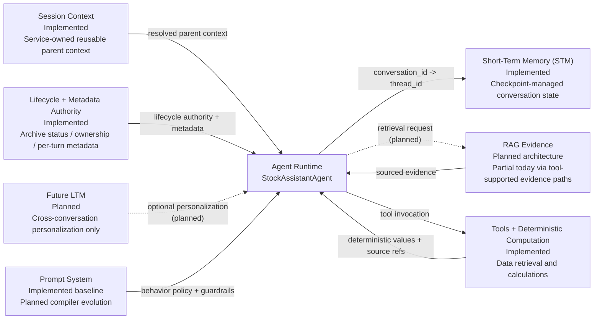

Architecturally, this consolidated view should be read with six rules in mind:

1. Session context is parent business context resolved by the service layer, not a checkpoint layer.
2. STM is the implemented conversation-scoped runtime-state boundary and remains distinct from lifecycle metadata.
3. Future LTM is a planned optional personalization boundary, not a replacement for session context, STM, or evidence retrieval.
4. RAG remains a sourced-evidence surface and does not become a memory store for opinions or conclusions.
5. Tools remain the deterministic data and computation surface that the runtime invokes rather than a memory authority.
6. The prompt system governs behavior and guardrails, but it does not become a storage surface for business truth or conversational state.

#### 4.4.2 State and Evidence Allocation Boundaries

The state model is intentionally split so user context, conversation state, retrieved evidence, and computed financial results do not collapse into one storage boundary.

| Concern | Canonical Architectural Home | Explicit Exclusions |
|---------|------------------------------|---------------------|
| Session-owned reusable business context | Session provider and management-service boundary | Shared checkpoint state across sibling conversations, cross-conversation factual store, prompt-level injection claims unless explicitly realized |
| Stable cross-conversation personalization and symbol-tracking context | Future LTM store | Prices, ratios, valuations, forecasts, recommendations |
| Conversation-scoped reasoning state and thread-local message history | STM via LangGraph checkpoints | Archive policy, ownership metadata, cross-conversation factual store, durable financial truth |
| Conversation lifecycle, archive status, and per-turn metadata | Service layer plus `conversations` metadata boundary | Checkpoint-managed agent state as the source of truth for ownership or archive policy |
| Sourced market and filing evidence | RAG indices and external data sources | User preferences, model-authored interpretations, long-lived conversation state |
| Deterministic metrics and fetched numbers | Tool execution and approved data providers | Prompt state, LTM/STM persistence, model-only inferred facts |
| Output behavior, disclosure, and tone | Prompt and guardrail policy | Persistent domain data and financial truth |

This allocation is what allows the domain to enforce the ADR-001 hard rules in architecture terms: memory personalizes and contextualizes, RAG informs, tools compute, and prompts govern behavior without becoming a shadow data layer.

| Aspect | Architectural Position |
|--------|------------------------|
| State authorities | LangGraph checkpointer owns thread-local agent execution state; service layer and `conversations` own lifecycle and metadata; sessions own reusable parent context |
| Binding | Direct 1:1 `conversation_id -> thread_id` |
| Hierarchy | `workspace -> session -> conversation` |
| Current lifecycle control | `active` and `archived` are current-state control boundaries in the service-governance path |
| Planned / partial lifecycle capability | `summarized` and automated summarization remain schema-supported but not yet universal runtime control flow |
| Future personalization surface | LTM remains a planned cross-conversation store for stable preferences and symbol-tracking context only |
| Scope boundary | Conversation text and state only; no prices, ratios, or tool outputs in memory |

The runtime contract is now `conversation_id` across agent methods, REST chat, management APIs, repositories, reconciliation, and migration tooling. The REST `POST /api/chat` route still accepts a deprecated `session_id` alias and normalizes it into `conversation_id`; the Socket.IO handler accepts `conversation_id` only.

The information boundary is deliberate: LangGraph checkpoints retain recoverable agent execution state for a conversation, while the `conversations` collection and service layer retain application metadata and lifecycle control. This keeps behavioral state and business metadata aligned without making the checkpointer the source of truth for application ownership or archival rules. Session context is resolved in service helpers as reusable parent business context, but prompt-level injection of that merged context is not yet a universally realized runtime behavior. The target-state architecture allows LTM-backed personalization to complement that session context, but not replace the service-owned parent context boundary.

##### Conversation & STM Lifecycle State Machine (UML Notation)

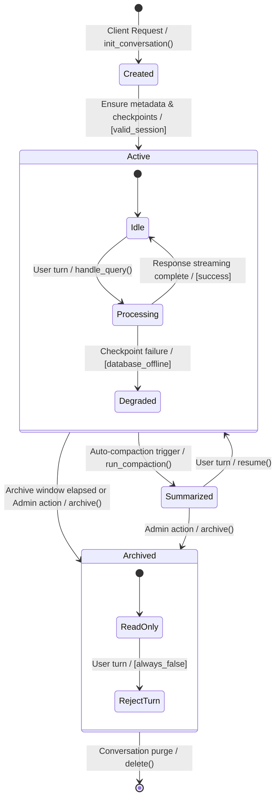

#### 4.4.3 STM Correspondence and Authority Model

STM is represented through cooperating but non-identical boundaries so the architecture can distinguish runtime recovery state from business lifecycle control.

| Question or Concern | Authoritative Boundary | Supporting Boundary | Architectural Note |
|---------------------|------------------------|---------------------|--------------------|
| Can a conversation accept new turns? | Service-layer lifecycle governance and `conversations` metadata | LangGraph checkpoints | Archive status and ownership remain business controls outside the reasoning runtime |
| What thread state should the runtime resume? | LangGraph checkpoint boundary keyed by `thread_id` | `conversations` metadata | Recovery state is conversation-scoped and is bound through `conversation_id -> thread_id` |
| What reusable parent context applies to a conversation? | Session boundary resolved through service helpers | `conversations` metadata and checkpoints | Sessions provide lineage and reusable business context without sharing checkpoints across sibling conversations |
| Where are per-turn counters, status, and metadata recorded? | `conversations` metadata boundary | Checkpoints may reflect message history indirectly | Business metadata remains outside checkpoint serialization |
| What if metadata and checkpoints diverge? | Service layer remains authoritative for ownership, archive status, and context lineage | Checkpoints remain authoritative only for recoverable thread-local reasoning state | Divergence is tolerated as a degraded-state condition rather than collapsed into one source of truth |

This correspondence model allows bounded divergence. A checkpoint may temporarily exist before a metadata record is ensured, metadata may outlive checkpoint availability during degraded operation, and stateless requests may bypass STM entirely. Those cases do not redefine ownership: lifecycle authority remains with the service-governance path, while checkpoint authority remains limited to conversation-scoped runtime state.

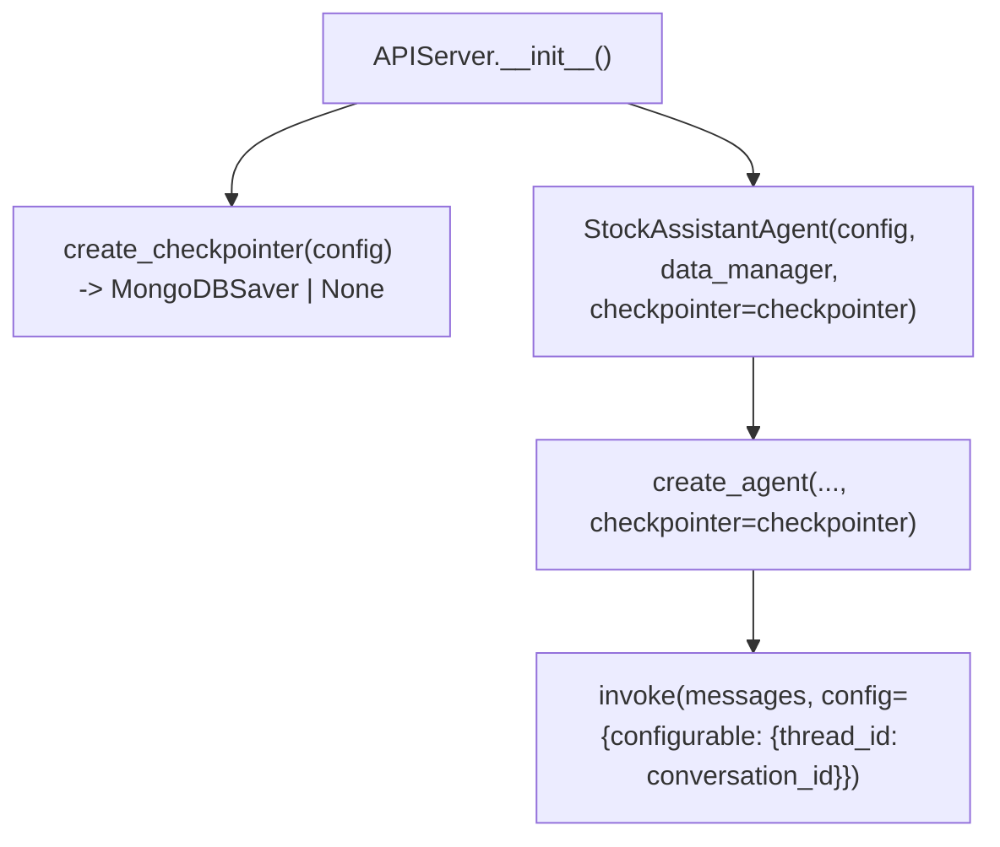

The full memory data model, API impact, reconciliation behavior, and sequence diagrams are preserved in [AGENT_MEMORY_TECHNICAL_DESIGN.md](./AGENT_MEMORY_TECHNICAL_DESIGN.md).

#### 4.4.4 Memory Failure and Recovery Boundaries

The memory architecture is intentionally designed to degrade without collapsing authority boundaries when state services are missing, delayed, or inconsistent.

| Failure or Degraded Condition | Architectural Response | Boundary Preserved |
|-------------------------------|------------------------|--------------------|
| `conversation_id` omitted | Use the stateless single-turn path and skip STM binding entirely | Stateless operation does not create synthetic thread ownership |
| Checkpointer unavailable during a stateful request | Continue in degraded mode without durable checkpoint persistence where supported | Service lifecycle and metadata ownership remain outside the checkpoint boundary |
| Conversation metadata missing or delayed | Keep lifecycle ownership in the service path and repair or create metadata through service-governed logic rather than through checkpoint writes | Checkpoints do not become the source of truth for application ownership |
| Metadata and checkpoint divergence detected | Tolerate bounded divergence temporarily, surface the mismatch operationally, and reconcile through dedicated repair tooling | Service authority governs lifecycle; checkpoint authority governs recoverable thread state only |
| Archived conversation targeted for new turns | Reject mutation before the request is treated as active reasoning work | Archive immutability remains a service-governed boundary |
| Session-context lookup or merge fails | Continue with reduced context or conservative fallback behavior rather than promoting checkpoint state into parent-context authority | Session context remains external parent business context |
| Future LTM store unavailable (planned future scenario) | Continue without cross-conversation personalization and keep evidence and computation paths independent | LTM remains optional personalization, not factual truth or required orchestration state |

These recovery expectations are architecture-level control statements. Runbook steps, CLI behavior, reconciliation details, and concrete sequence logic remain in the technical-design companion documents.

### 4.5 Development View

The development view captures how the architecture is realized in the repository so maintainers can evolve the domain without eroding responsibility boundaries.

#### 4.5.1 Source Layout View

```text
src/core/
├── stock_assistant_agent.py    # Main ReAct agent with conversation-aware STM routing
├── langgraph_bootstrap.py      # LangGraph agent builder + MongoDBSaver checkpointer factory
├── stock_query_router.py       # Semantic router for query classification
├── routes.py                   # Route definitions and utterances
├── types.py                    # Core types: AgentResponse, ToolCall, TokenUsage
├── langchain_adapter.py        # Prompt building with external file support
├── model_factory.py            # Factory pattern for model clients
├── base_model_client.py        # Abstract base for providers
├── openai_model_client.py      # OpenAI implementation
├── grok_model_client.py        # Grok (xAI) implementation
├── data_manager.py             # Yahoo Finance data fetching
└── tools/
    ├── base.py                 # CachingTool base class
    ├── registry.py             # ToolRegistry singleton
    ├── stock_symbol.py         # Stock lookup tool
    ├── tradingview.py          # TradingView placeholder (Phase 2)
    └── reporting.py            # Report generation tool

src/utils/
└── memory_config.py            # MemoryConfig frozen dataclass with fail-fast validation

src/data/repositories/
└── conversation_repository.py  # ConversationRepository (conversations collection, archive status, session linkage)

src/services/
├── chat_service.py             # Chat orchestration, archive guard, session-context resolution, metadata sync (REST path)
└── conversation_service.py     # ConversationService (lifecycle, management APIs, session-context and metadata helpers)

src/prompts/                    # Prompt subsystem in transition from legacy files to canonical prompt assets
├── system/                     # Planned shallow metadata-driven prompt taxonomy
│   ├── shared/
│   │   ├── investment_safety.md
│   │   ├── response_contract.md
│   │   └── tool_use_policy.md
│   ├── react_analyst.md
│   ├── react_analyst.vi.md
│   ├── orchestrator.md
│   └── rag_research.md
├── skills/
│   ├── always_on/
│   │   ├── evidence_first.md
│   │   ├── uncertainty_contract.md
│   │   └── anti_hype_guardrail.md
│   └── routes/
│       ├── price_check.md
│       ├── news_analysis.md
│       ├── portfolio.md
│       ├── technical_analysis.md
│       ├── fundamentals.md
│       ├── ideas.md
│       ├── market_watch.md
│       └── general_chat.md
├── experiments/
│   ├── react_analyst.evidence_strict.md
│   └── manifest.yaml
├── CHANGELOG.md
├── analysis_prompt.j2          # Current legacy template retained until prompt compiler cutover
├── generic_query.j2            # Current legacy template retained until prompt compiler cutover
├── system_stock_assistant-vn.txt
└── system_stock_assistant.txt
```

The source layout view keeps the implemented module boundaries intact while making the prompt-subsystem transition explicit in place. Session and lifecycle authority remain realized in services and repositories, STM persistence remains in the LangGraph bootstrap boundary, and future LTM remains only an architectural extension point rather than an existing runtime module. Within `src/prompts/`, the current legacy prompt files remain visible for runtime accuracy, while the canonical target layout is the shallow metadata-driven `system` / `skills` / `experiments` taxonomy shown above.

#### 4.5.1.1 Prompt Asset Layout: Current vs Target

| View | Prompt Asset Model | Status |
|------|--------------------|--------|
| Current runtime layout | Template/text assets under `src/prompts/` | Implemented |
| ADR taxonomy target (canonical) | Shallow metadata-driven layout under `src/prompts/system/`, `src/prompts/skills/`, and `src/prompts/experiments/` with examples such as `system/react_analyst.md`, `system/react_analyst.vi.md`, `skills/routes/price_check.md`, and `experiments/react_analyst.evidence_strict.md` | Proposed |

The architecture package treats ADR taxonomy as canonical for prompt assets. Planning-artifact path aliases are non-authoritative and must map back to the ADR taxonomy.

The target layout is intentionally shallow. Directory ownership communicates asset class, while version, locale, variant, activation mode, and baseline fallback semantics stay in metadata and loader policy instead of expanding into deeper folder trees.

#### 4.5.2 Maintainability and Extension Boundaries

| Development Concern | Architectural Guidance |
|---------------------|------------------------|
| Module ownership | Keep agent reasoning in `[Implemented]` [src/core/](../../../src/core/), business orchestration in `[Implemented]` [src/services/](../../../src/services/), and persistence in `[Implemented]` [src/data/repositories/](../../../src/data/repositories/) |
| Extending providers | Add provider-specific clients behind `[Implemented]` [BaseModelClient](../../../src/core/base_model_client.py) and register through `[Implemented]` [ModelClientFactory](../../../src/core/model_factory.py) |
| Extending tools | Add tool implementations under `[Implemented]` [src/core/tools/](../../../src/core/tools/) and expose them through `[Implemented]` [ToolRegistry](../../../src/core/tools/registry.py) rather than wiring ad hoc calls |
| Memory changes | Preserve `conversation_id -> thread_id` as the canonical STM binding and keep business metadata outside checkpoints |
| Prompt evolution | Add metadata-governed assets under `[Proposed]` [src/prompts/](../../../src/prompts/) `system|skills|experiments`, keep file layout shallow, and keep prompt composition policy separate from tool or repository logic |

This view is intentionally about code organization and maintainability, not low-level realization. Detailed implementation behavior, configuration, and extension mechanics remain in [TECHNICAL_DESIGN.md](./TECHNICAL_DESIGN.md).

### 4.6 Deployment View

The agent domain runs inside a broader multi-service deployment topology. At architecture level, the important concern is how the agent-related runtime depends on API, cache, database, and model-provider boundaries across local and production-like environments.

#### 4.6.1 Runtime Topology Summary

| Runtime Element | Deployment Role | Boundary Notes |
|-----------------|-----------------|----------------|
| API container | Hosts Flask routes, Socket.IO handlers, and the agent invocation path | Primary entry point for frontend and service integration |
| Agent container | Background worker and health surface | Separates long-running or asynchronous work from request-serving flow |
| MongoDB | Stores conversation metadata and LangGraph checkpoint state | Lifecycle metadata and STM persistence remain logically separate even when stored on the same platform family; future LTM remains a distinct planned authority |
| Redis | Cache and transient coordination layer | Supports performance and graceful degradation paths |
| Frontend container | User-facing interface | Consumes API and streaming surfaces but does not host agent logic |

#### 4.6.2 Environment and Reliability Boundaries

| Concern | Architecture Position |
|---------|-----------------------|
| Local development topology | Docker Compose provides an integration-faithful multi-service environment |
| Production-like topology | Helm-managed Kubernetes deployment scales API, agent, and frontend independently |
| Health contracts | API `GET /api/health`, agent `GET /health`, frontend `GET /healthz` |
| Memory substrate separation | Shared infrastructure does not collapse service-owned session context, metadata, STM checkpoints, and any future LTM into one authority boundary |
| Configuration overlays | `APP_ENV` and environment-specific config overlays select environment behavior without changing architecture boundaries |
| Secrets boundary | Local secrets come from environment variables; production secrets are intended to come from Azure Key Vault or equivalent managed secret stores |

Detailed deployment procedures, port mappings, Docker and Helm specifics, and runbooks belong in [IaC/README.md](../../../IaC/README.md) and the infrastructure artifacts under `IaC/`.

### 4.7 Operations and Maintenance View

The operations and maintenance view addresses how the architecture supports production operation, resilience, and maintainability after deployment.

#### 4.7.1 Health, Observability, and Drift Surfaces

| Operational Concern | Current Architectural Surface |
|---------------------|-------------------------------|
| Health reporting | Agent and service health aggregate through explicit health endpoints and service health checks |
| Logging and traceability | Runtime logging exists now; the architecture anticipates structured logs and prompt-level trace metadata |
| Memory authority visibility | Reconciliation tooling, service ownership, and checkpoint boundaries make lifecycle/metadata drift distinguishable from runtime-state loss |
| Prompt observability | Prompt version, route, experiment, and guardrail outcomes are intended as traceable runtime metadata |
| Drift detection | Reconciliation and migration tooling provide visibility into conversation and checkpoint drift |
| Archive safety | `ChatService` protects the REST path from invalid archived-conversation execution |

#### 4.7.2 Resilience and Recovery Boundaries

| Failure Mode | Architectural Response |
|--------------|------------------------|
| Provider failure or timeout | Fallback order enables degraded continuation rather than immediate hard failure |
| Cache unavailability | In-memory fallback paths preserve partial operation where supported |
| Checkpointer unavailability | Agent runtime can run without checkpoint persistence, with reduced STM capability |
| Session-context resolution degraded | Continue with reduced or conservative context rather than promoting checkpoint state into parent-context authority |
| Metadata and checkpoint drift | Reconciliation tooling and service ownership boundaries contain and repair mismatch risk |
| Archived conversation access | Service-layer guards prevent invalid runtime mutation of archived context |

#### 4.7.3 Quality Attribute Scenarios

The following quality scenarios summarize the failure, degradation, recovery, and performance expectations already established in this architecture description and its governing companion artifacts. They are expressed at architecture level so reviewers can assess whether the system's control boundaries and fallback paths are adequate without reading implementation detail.

##### 4.7.3.1 Reliability and Fault-Tolerance Scenarios

| Scenario | Stimulus and Environment | Expected Architectural Response |
|----------|--------------------------|---------------------------------|
| LLM provider outage or timeout | The primary model provider becomes unavailable during active query processing and fallback is enabled | Route generation to the next provider in `fallback_order`, preserve service continuity in degraded mode, and surface fallback metadata in the response path |
| Semantic-router primary encoder failure | The primary embeddings provider is unavailable during route classification | Use the configured secondary encoder and continue classification; if confidence remains insufficient, preserve a safe fallback route rather than fail the request outright |
| Cache backend unavailable | Redis or the primary cache path is unavailable during tool execution | Continue with in-memory fallback or uncached execution where supported so tool use remains available with reduced efficiency |
| Checkpointer unavailable | Checkpoint persistence cannot be reached during a conversation-scoped request | Continue without checkpoint persistence so the agent remains usable, but with reduced STM capability and no assumption of durable thread state |
| Legacy executor fallback required | The preferred ReAct execution path is unavailable or cannot be initialized | Use the retained legacy execution path so the system degrades functionally rather than becoming unavailable |

##### 4.7.3.2 Data Integrity and Lifecycle Scenarios

| Scenario | Stimulus and Environment | Expected Architectural Response |
|----------|--------------------------|---------------------------------|
| Archived conversation mutation attempt | A request targets a conversation whose lifecycle state is `archived` | Service-layer guards reject invalid mutation before the request enters the reasoning path |
| Metadata and checkpoint drift detected | Reconciliation tooling or runtime checks detect mismatch between application metadata and LangGraph checkpoint state | Contain the mismatch within service and repository boundaries, expose drift to operators, and use reconciliation tooling to repair alignment |
| Stateless request path | A request omits `conversation_id` and therefore does not bind to conversation-scoped STM | Preserve single-turn operation by using a stateless path rather than forcing checkpoint-dependent behavior |
| Session-context resolution degraded | Session lineage or reusable parent context cannot be loaded cleanly for a conversation-scoped request | Continue with reduced or conservative context rather than promoting checkpoint state into the parent-context authority boundary |
| Migration interruption or partial progress | A migration or repair operation stops mid-run due to interruption or failure | Preserve non-destructive, resumable behavior with dry-run support so operators can recover without data loss |

##### 4.7.3.3 Interface and Streaming Scenarios

| Scenario | Stimulus and Environment | Expected Architectural Response |
|----------|--------------------------|---------------------------------|
| Streaming pipeline failure | An error occurs after a streaming response has started | End the stream with a machine-detectable terminal error condition rather than leaving the client with an indeterminate open channel |
| Client-initiated cancellation | A client cancels an in-progress streaming response | Stop further generation promptly and avoid continued background work for a cancelled response path |
| Transient upstream failure during active request | A retry-safe external failure occurs during generation or tool access | Preserve retry-safe or failover-safe behavior without corrupting conversation state or leaking partial invalid output as completed work |

##### 4.7.3.4 Prompt and Behavior Scenarios

| Scenario | Stimulus and Environment | Expected Architectural Response |
|----------|--------------------------|---------------------------------|
| Unmatched or ambiguous intent | A user query does not match a stronger domain route with sufficient confidence | Route to `GENERAL_CHAT` so the request remains serviceable rather than producing a routing failure |
| Guardrail violation candidate detected | Generated output appears to weaken investment-safety rules, evidence discipline, or disclosure expectations | Keep enforcement in the prompt and response-policy boundary, prefer a conservative response path, and emit machine-detectable guardrail outcomes for traceability |
| Preferred prompt contract unavailable | A selected prompt lineage or governed prompt contract cannot be resolved in the planned prompt system | Fall back to a stable baseline prompt lineage rather than blocking response generation entirely |
| Route-specific prompt context unavailable | A route resolves successfully but the route-aware prompt context cannot be applied | Continue with shared policy and general analyst behavior, emit prompt fallback metadata, and avoid hard request failure |
| Guardrail enforcement degraded | Response-policy evaluation is unavailable or incomplete because the guardrail path is degraded | Preserve service continuity through a conservative response path and emit machine-detectable guardrail degradation metadata |

##### 4.7.3.5 Planned Retrieval and Asset-Dependency Scenarios

The following scenarios are architecture-relevant but remain future-state because the richer retrieval and prompt-variant layers are not yet fully implemented in the active runtime.

| Scenario | Stimulus and Environment | Expected Architectural Response |
|----------|--------------------------|---------------------------------|
| Vector-backed retrieval unavailable | A future LTM or RAG retrieval store is unavailable when retrieval-augmented behavior is expected | Degrade to a non-retrieval response path that continues to use available tools and prompt policy, while making reduced evidence coverage observable |
| Selected prompt variant or experimental contract unavailable | A planned experimental or version-specific prompt contract cannot be resolved | Fall back to the stable prompt lineage and keep the degraded selection observable to operators |

##### 4.7.3.6 Performance and Availability Scenarios

| Scenario | Stimulus and Environment | Expected Architectural Response |
|----------|--------------------------|---------------------------------|
| Simple query under normal operating load | A price lookup or similar lightweight request is processed during steady-state operation | Preserve the architecture's low-latency path through routing, limited tool use, and bounded response generation |
| Multi-tool analytical query under normal operating load | A request requires multiple tool calls or a longer reasoning path | Preserve service availability while accepting a slower bounded path than lightweight requests |
| Sustained concurrent conversational load | Multiple active conversations and requests are processed concurrently | Preserve availability through independent service boundaries, cache support, and separation of API, agent, and persistence concerns |
| Partial observability degradation | Logging, metrics, or tracing coverage is reduced while the runtime remains healthy | Continue serving requests while keeping health and drift surfaces available so operators can detect reduced observability without mistaking it for full outage |

##### 4.7.3.7 Unified Degraded-Operation Decision Diagram

This diagram consolidates architecture-level degraded-operation paths and fallback interfaces across routing, prompt selection, memory, cache, and provider boundaries.

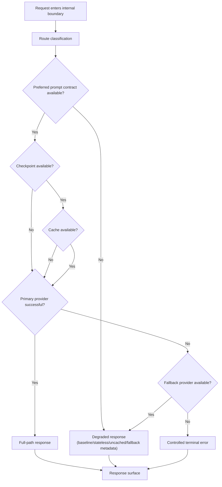

This view is architecture-level only. Runbook steps, CLI usage, monitoring dashboards, and operational procedures remain outside this document and belong in [TECHNICAL_DESIGN.md](./TECHNICAL_DESIGN.md) only where realization detail is needed, or in operational documentation such as [IaC/README.md](../../../IaC/README.md).

### 4.8 Prompt and Behavior View

This view addresses prompt policy as a governed behavioral boundary. It distinguishes the current architectural baseline from the planned prompt-system evolution so the architecture package can describe where prompt responsibilities belong without collapsing into code-level implementation detail.

#### 4.8.1 Architectural Baseline

The current baseline is a single runtime prompt contract that shapes agent behavior centrally, supported by prompt assets that are useful source material but not yet the full architectural system of record. At architecture level, the important point is not the literal prompt text but the role it plays: behavioral policy is already separated from tools, memory, and external evidence, even though it has not yet been externalized into the planned versioned asset model.

This baseline establishes three constraints that the evolved prompt architecture must preserve:

1. Prompt policy governs behavior and response framing, not domain facts.
2. Prompt policy may reference memory, tools, and retrieval boundaries, but it does not replace them.
3. Prompt changes remain an internal system concern rather than a provider-managed or user-edited runtime surface.

#### 4.8.2 Planned Prompt Architecture

> **Status:** Proposed design — not yet implemented.
> **Research Authority:** [PROMPT_SYSTEM_RESEARCH_PROPOSAL.md](./PROMPT_SYSTEM_RESEARCH_PROPOSAL.md)
> **Governing ADRs:** [ADR-AGENT-002-SKILLS-PATTERN-PROMPT-COMPOSITION.md](./decisions/ADR-AGENT-002-SKILLS-PATTERN-PROMPT-COMPOSITION.md), [ADR-AGENT-003-EXTERNALIZE-VERSION-PROMPT-ASSETS.md](./decisions/ADR-AGENT-003-EXTERNALIZE-VERSION-PROMPT-ASSETS.md)

| Architectural Concern | Planned Boundary | Purpose |
|-----------------------|------------------|---------|
| Prompt policy source | Versioned prompt assets under the ADR-governed taxonomy | Keeps behavioral policy repo-owned, reviewable, and separable from runtime code |
| Prompt composition | Prompt compiler path: `PromptAssetLoader -> PromptAssembler -> ResponseGuardrailMiddleware` | Separates asset discovery, composition, and response-policy enforcement into explicit boundaries |
| Route-aware behavior | Skills-pattern composition using route-specific prompt context | Lets behavior narrow by request category without immediately requiring a multi-agent runtime |
| Prompt observability | Prompt identity, selection, fallback, and guardrail outcomes as runtime metadata | Makes prompt behavior traceable without turning prompt metadata into business-state persistence |
| Role-specific prompt contracts | Shared policy plus bounded analyst, orchestrator, and retrieval-specialist contracts | Centralizes common safety rules while allowing narrower role responsibilities over time |

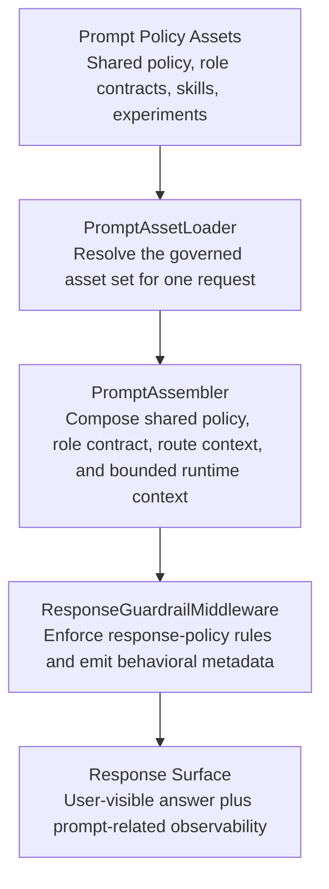

| Planned Boundary | Architectural Responsibility | Governing Basis |
|------------------|-----------------------------|-----------------|
| **PromptAssetLoader** | Resolve the correct prompt asset set for a request, including stable fallback behavior when preferred assets are unavailable | ADR-003 |
| **PromptAssembler** | Compose one prompt contract from shared policy, role-specific guidance, route-aware context, and bounded runtime inputs | ADR-002 |
| **ResponseGuardrailMiddleware** | Keep response-policy enforcement separate from prompt assembly so behavioral controls remain visible and governable | ADR-001 hard rules on behavior and evidence boundaries |

#### 4.8.3 Prompt Composition and Role Contracts

The architecture treats prompt composition as an ordered behavioral-policy concern rather than an arbitrary string assembly problem. The intended composition path is deterministic so that shared safety rules stay authoritative while route-aware or role-specific behavior remains bounded.

Planned composition order:

1. Shared system policy and investment-safety rules
2. Always-active behavioral skills
3. Route-specific prompt context via the Skills pattern
4. Bounded memory context, when architecturally available
5. Retrieved evidence and tool-derived facts
6. Task-specific framing
7. Output contract and formatting rules

| Prompt Contract | Architectural Role | Boundary Rule |
|-----------------|--------------------|---------------|
| Shared policy contract | Carries investment-safety rules, evidence discipline, and general response expectations across all agent roles | Must remain stronger than any specialist-local customization |
| ReAct analyst contract | Governs the primary tool-using analyst behavior | May reason with tools and evidence, but does not become a source of truth for facts |
| Orchestrator contract | Future routing or delegation contract for deciding which specialist path should handle a request | Must stay narrow, classification-oriented, and not silently broaden into analyst behavior |
| Retrieval specialist contract | Future retrieval-grounded synthesis contract | Must remain source-aware and treat retrieved content as bounded evidence rather than policy |

The near-term architectural direction is the Skills pattern: one agent, one shared policy layer, and route-aware prompt context selected without requiring a full specialist-agent runtime. Richer multi-agent prompt contracts remain a later evolution path once the architecture needs explicit orchestration and synthesis boundaries.

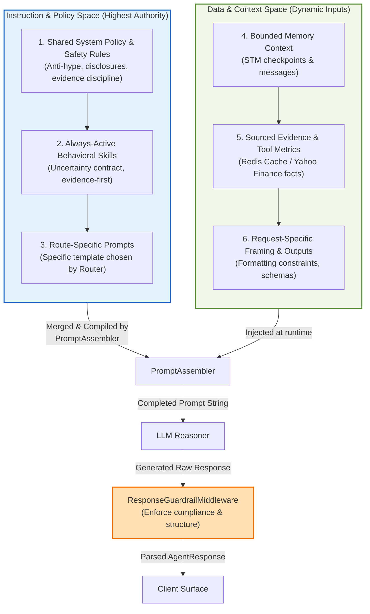

#### 4.8.4 Guardrail Boundary Model

Prompt policy is only one part of behavioral control. The architecture therefore places guardrails at the boundary where a risk first becomes material, rather than relying on post-generation prompt wording alone to correct problems that should have been constrained earlier.

| Guardrail Boundary | Architectural Scope | Primary Risks | Expected Architectural Response |
|--------------------|---------------------|---------------|---------------------------------|
| Input guardrail boundary | Before prompt assembly and agent execution | Unsafe request classes, malformed override attempts, and instruction-shaped content arriving from low-trust surfaces | Block, narrow, annotate, or route the request into a conservative path before main prompt execution |
| Prompt-assembly guardrail boundary | During `PromptAssetLoader` and `PromptAssembler` selection | Authority inversion, unapproved dynamic fields, and instruction pollution from retrieved or quoted content | Admit only schema-approved dynamic inputs and preserve higher-authority policy over lower-authority context |
| Tool guardrail boundary | Around tool eligibility, argument shaping, and tool-result handling | Invalid tool use, unsafe escalation, malformed arguments, and future side-effecting actions | Validate tool availability and arguments, constrain execution by tool risk class, and preserve approval hooks for high-impact actions |
| Output guardrail boundary | After model generation but before user-visible response leaves the system | Unsupported certainty, hype framing, weak attribution, and missing disclosure or refusal behavior | Enforce conservative response-policy checks and emit machine-detectable guardrail outcomes |
| Approval boundary | Before any future high-impact or irreversible side effect | Actions whose risk exceeds what prompt-only or model-only controls should authorize | Pause the workflow for human review rather than relying on autonomous execution |

These guardrail boundaries are cumulative. Later checks do not replace earlier ones; they provide defense in depth across request admission, prompt construction, tool mediation, and response release.

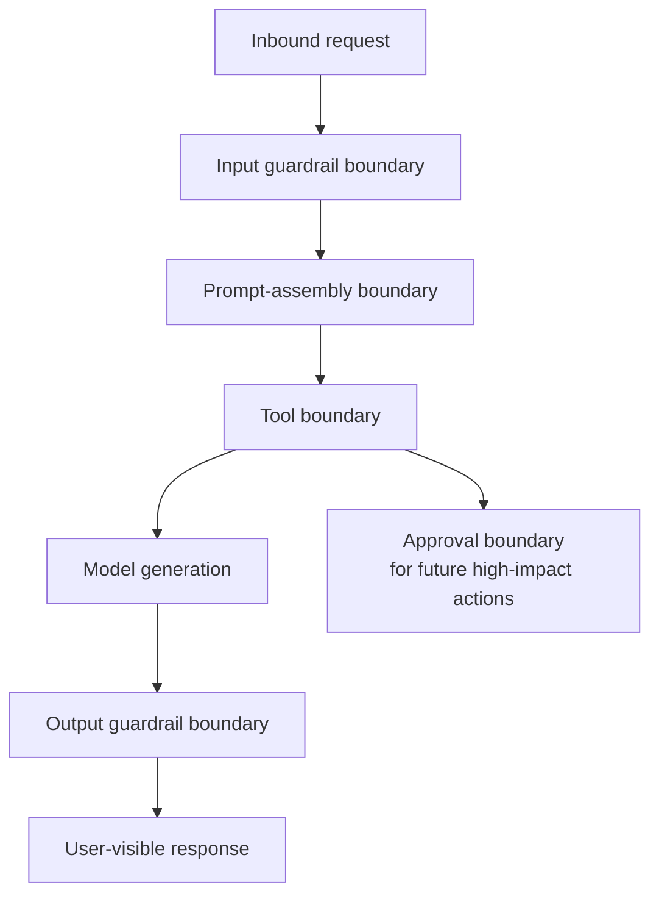

#### 4.8.5 Tool Risk and Approval Envelope

The architecture does not treat all tool paths as equivalent. Tool classes are architectural control categories because the line between evidence gathering and state-changing or externally side-effecting actions determines where authorization, validation, and approval must live.

| Tool Risk Class | Architectural Meaning | Current Admission | Boundary Requirement |
|-----------------|-----------------------|-------------------|----------------------|
| `read_only_evidence` | Retrieves internal or external evidence without mutating durable state | Admitted in the current baseline | Tool guardrail boundary validates eligibility, arguments, provenance, and result handling; no approval boundary is required |
| `bounded_transformation` | Produces deterministic calculations or reformatted outputs from governed inputs without mutating durable state | Admitted in the current baseline | Tool guardrail boundary validates input and output contracts and keeps results inside the data-only evidence boundary |
| `workflow_mutation` | Creates, updates, archives, or otherwise changes repo-owned or user-owned durable state | Future only | Requires service-owned authorization plus an approval-capable boundary before execution |
| `external_side_effect` | Triggers actions outside repo-owned state, such as brokerage actions, messaging, or third-party writes | Prohibited in the current baseline | Requires the strongest approval boundary, explicit allowlisting, and fail-closed runtime defaults |

Architectural rules:

1. The tool registry or equivalent runtime control surface owns the authoritative class of each tool.
2. Prompt policy may narrow tool exposure but must never downgrade a tool's architectural risk class.
3. The current analyst-facing architecture should remain bounded to `read_only_evidence` and `bounded_transformation` tools until stronger approval flows are explicitly designed.

#### 4.8.6 Prompt Segment and Locale Governance

The prompt boundary stays governable only if it distinguishes durable policy from request-scoped controls and data-only evidence. Locale variants belong to that same governance model: they are separate prompt assets in one policy lineage, not free-form translations with independent safety posture.

| Segment or Variant Class | Architectural Role | Reuse Rule | Governance Requirement |
|--------------------------|--------------------|------------|------------------------|
| Static policy assets | Shared policy, role contracts, and route skills that shape behavior | Reusable only by exact approved prompt lineage | Must remain versioned, attributable, and stronger than any request-scoped control |
| Dynamic control segments | Locale choice, workspace mode, expertise mode, and experiment markers | Request-scoped by default; reuse requires explicit equivalence and non-sensitive inputs | Must be schema-approved and must not change finance-policy semantics |
| Runtime evidence segments | Tool outputs, retrieved documents, quoted attachments, and summarized memory | Never reusable as policy; attached per request as data-only context | Must remain non-authoritative and cannot introduce executable instruction content |
| Non-default locale variants | Parallel `vi` and `en` assets within one policy lineage | Promotion beyond evaluation requires parity evidence; unresolved drift fails closed to the default locale | Must preserve the same finance-policy, disclosure, and anti-hype posture as the default locale |

Provider-specific prompt caching, long-context packaging, and reasoning features are architectural optimizations only. They may accelerate static policy segments but must not redefine instruction authority order, segment class, or locale-parity obligations.

#### 4.8.7 Prompt Observability and Degraded Modes

Prompt observability is an architectural requirement because prompt behavior is part of the governed response path. The goal is not to expose raw prompt internals to end users but to preserve enough metadata for review, evaluation, rollback analysis, and controlled evolution.

| Observability Concern | Architectural Expectation | Why It Matters |
|-----------------------|---------------------------|----------------|
| Prompt identity | The active prompt contract should be attributable to a stable version or baseline lineage | Supports auditability, rollback analysis, and evaluation |
| Route and role selection | Prompt behavior should remain attributable to the route-aware or role-aware contract chosen for the request | Makes behavior shifts understandable during operations and review |
| Prompt fallback visibility | Degraded prompt selection should remain visible as metadata rather than silently changing behavior | Prevents hidden policy drift during asset or selection failures |
| Guardrail outcomes | Response-policy checks should emit machine-detectable outcomes suitable for tracing and evaluation | Keeps behavior controls observable and reviewable |

| Degraded Prompt Condition | Expected Architectural Response |
|---------------------------|--------------------------------|
| Preferred prompt asset unavailable | Continue on a stable baseline prompt path rather than blocking the entire response path |
| Route-specific context unavailable | Preserve shared policy and general analyst behavior rather than failing the request outright |
| Experiment or variant unavailable | Fall back to the stable prompt lineage while keeping the degraded selection observable |
| Guardrail evaluation degraded | Preserve a conservative response path and emit machine-detectable degradation metadata |

---

## 5. Correspondences and Traceability

### 5.1 View-to-Document Correspondence

| Architecture View | Primary Companion Documents |
|-------------------|-----------------------------|
| Context and Boundary View | [TECHNICAL_DESIGN.md](./TECHNICAL_DESIGN.md), [SOFTWARE_REQUIREMENTS_SPECIFICATION.md](./SOFTWARE_REQUIREMENTS_SPECIFICATION.md) |
| Logical View | [TECHNICAL_DESIGN.md](./TECHNICAL_DESIGN.md), [ADR-AGENT-001-LAYERED-LLM-ARCHITECTURE.md](./decisions/ADR-AGENT-001-LAYERED-LLM-ARCHITECTURE.md) |
| Process View | [TECHNICAL_DESIGN.md](./TECHNICAL_DESIGN.md), [AGENT_MEMORY_TECHNICAL_DESIGN.md](./AGENT_MEMORY_TECHNICAL_DESIGN.md) |
| Information and State View | [AGENT_MEMORY_TECHNICAL_DESIGN.md](./AGENT_MEMORY_TECHNICAL_DESIGN.md), [ADR-AGENT-001-LAYERED-LLM-ARCHITECTURE.md](./decisions/ADR-AGENT-001-LAYERED-LLM-ARCHITECTURE.md) |
| Development View | [TECHNICAL_DESIGN.md](./TECHNICAL_DESIGN.md), [README.md](../../../README.md) |
| Deployment View | [IaC/README.md](../../../IaC/README.md), [TECHNICAL_DESIGN.md](./TECHNICAL_DESIGN.md) |
| Operations and Maintenance View | [TECHNICAL_DESIGN.md](./TECHNICAL_DESIGN.md), [IaC/README.md](../../../IaC/README.md) |
| Prompt and Behavior View | [PROMPT_SYSTEM_RESEARCH_PROPOSAL.md](./PROMPT_SYSTEM_RESEARCH_PROPOSAL.md), [TECHNICAL_DESIGN.md §3.5](./TECHNICAL_DESIGN.md#35-prompt-realization-and-guardrails), [ADR-AGENT-002-SKILLS-PATTERN-PROMPT-COMPOSITION.md](./decisions/ADR-AGENT-002-SKILLS-PATTERN-PROMPT-COMPOSITION.md), [ADR-AGENT-003-EXTERNALIZE-VERSION-PROMPT-ASSETS.md](./decisions/ADR-AGENT-003-EXTERNALIZE-VERSION-PROMPT-ASSETS.md) |

### 5.2 Concern-to-Decision Correspondence

| Concern | Governing Decision / Artifact |
|---------|-------------------------------|
| Layered LLM boundaries and memory scope | [ADR-AGENT-001-LAYERED-LLM-ARCHITECTURE.md](./decisions/ADR-AGENT-001-LAYERED-LLM-ARCHITECTURE.md) |
| Prompt skills composition | [ADR-AGENT-002-SKILLS-PATTERN-PROMPT-COMPOSITION.md](./decisions/ADR-AGENT-002-SKILLS-PATTERN-PROMPT-COMPOSITION.md) |
| Externalized prompt assets and prompt versioning | [ADR-AGENT-003-EXTERNALIZE-VERSION-PROMPT-ASSETS.md](./decisions/ADR-AGENT-003-EXTERNALIZE-VERSION-PROMPT-ASSETS.md) |
| Conversation hierarchy, checkpoints, and runtime reconciliation | [AGENT_MEMORY_TECHNICAL_DESIGN.md](./AGENT_MEMORY_TECHNICAL_DESIGN.md) |
| Prompt-system design research and rollout path | [PROMPT_SYSTEM_RESEARCH_PROPOSAL.md](./PROMPT_SYSTEM_RESEARCH_PROPOSAL.md) |

### 5.3 Terminology and Concept Evolution

| Original Concept (ADR-001 Prompt Compiler decision) | Evolved Realization (ADR-002, ADR-003) | Note |
|-------------------------------|----------------------------------------|------|
| Prompt Compiler | PromptAssetLoader → PromptAssembler → ResponseGuardrailMiddleware | The single-step compiler concept was elaborated into a governed composition path that separates asset resolution, composition, and response-policy enforcement. See [TECHNICAL_DESIGN.md §3.5.2](./TECHNICAL_DESIGN.md#352-planned-prompt-compiler-path) for realization detail. |
| PromptRegistry (implementation-discussion alias) | Loader-facade naming for prompt asset resolution | When this name is used in proposal or implementation discussion, it should be understood as a technical facade within the PromptAssetLoader boundary rather than a separate architectural concept. |
| Prompt asset taxonomy | ADR taxonomy (`src/prompts/system|skills|experiments`) with a shallow metadata-driven file layout | ADR taxonomy is canonical for architecture and decision authority; version, locale, and baseline semantics belong in metadata and loader rules rather than deeper directory nesting. |
| Intent-based routing | `StockQueryRoute` enum with 8 canonical routes | Originally described with 7 working-name intents; refined to 8 routes during implementation. |

### 5.4 Content Preservation Correspondence

The pre-rewrite architecture document mixed architecture description, technical realization, and roadmap material. That content has been preserved as follows:

- viewpoint-relevant architecture content remains in this document;
- implementation-heavy component, configuration, pattern, and extension detail is preserved in [TECHNICAL_DESIGN.md](./TECHNICAL_DESIGN.md);
- memory-specific subsystem detail is preserved in [AGENT_MEMORY_TECHNICAL_DESIGN.md](./AGENT_MEMORY_TECHNICAL_DESIGN.md);
- prompt-system research, detailed rollout logic, and evaluation design are preserved in [PROMPT_SYSTEM_RESEARCH_PROPOSAL.md](./PROMPT_SYSTEM_RESEARCH_PROPOSAL.md);
- decision authority remains with the ADR set in [decisions](./decisions).

### 5.5 Correspondence Rules and Consistency Checks

The following rules govern how this architecture-description package stays consistent across ADRs and companion design documents:

1. Accepted ADRs govern architectural decision boundaries and win if a companion document describes a conflicting boundary or responsibility split.
2. [ARCHITECTURE_DESIGN.md](./ARCHITECTURE_DESIGN.md) governs viewpoint-framed architecture views, cross-document correspondences, and package-level standards-positioning language.
3. [TECHNICAL_DESIGN.md](./TECHNICAL_DESIGN.md) governs realization detail and implementation-oriented sequencing, but it must not override an accepted ADR or restate planned behavior as implemented.
4. [AGENT_MEMORY_TECHNICAL_DESIGN.md](./AGENT_MEMORY_TECHNICAL_DESIGN.md) governs STM-specific subsystem detail within the architectural boundaries established by ADR-001 and this architecture description.
5. Proposed ADRs may shape planned or future-state architecture content, but they do not override accepted decisions until their status changes.
6. Terminology changes that affect architectural concepts, view names, or decision names must be reconciled across sections 3, 4, 5, and 6 of this document and across the affected ADRs in the same update pass.
7. Memory descriptions across this package must preserve the ownership split between service-governed lifecycle metadata, session-owned reusable context, checkpoint-managed runtime state, and future LTM personalization scope.
8. Current-state STM caveats, including REST-only lifecycle enforcement, Socket.IO parity gaps, unwired automatic summarization, and not-yet-universal prompt-level session-context injection, must remain labeled consistently across this document and both STM companion design documents.
9. System-context, logical, deployment, and information/state views must not collapse session context, lifecycle metadata, STM checkpoints, and future LTM into one storage or authority boundary even when they share infrastructure platforms.

Reviewer checklist:

- [ ] ADR status and title references in this document match the current ADR files.
- [ ] View names used in ADRs match the viewpoint and view names defined in sections 3 and 4.
- [ ] Accepted ADR boundaries are not contradicted by companion design documents.
- [ ] Proposed or future-state capabilities remain labeled as planned where runtime implementation is incomplete.
- [ ] Memory ownership statements consistently distinguish lifecycle metadata, session context, checkpoint state, and future LTM scope.
- [ ] System-context and logical-view diagrams keep session context, lifecycle metadata, STM persistence, and future LTM as separate authorities.
- [ ] STM transport caveats remain synchronized across architecture, technical design, and memory technical design documents.
- [ ] Concept evolution terms such as `Prompt Compiler`, `PromptAssembler`, and `PromptAssetLoader` are used consistently with section 5.3.
- [ ] ADR taxonomy references are stated consistently where prompt asset directories are referenced.

---

## 6. Architecture Rationale

### 6.1 Governing Decisions Already Recorded in ADRs

| ADR | Status | Architectural Effect on This Description |
|-----|--------|------------------------------------------|
| [ADR-AGENT-001-LAYERED-LLM-ARCHITECTURE.md](./decisions/ADR-AGENT-001-LAYERED-LLM-ARCHITECTURE.md) | **Accepted** | Governs memory boundaries, evidence separation, and layered LLM responsibilities |
| [ADR-AGENT-002-SKILLS-PATTERN-PROMPT-COMPOSITION.md](./decisions/ADR-AGENT-002-SKILLS-PATTERN-PROMPT-COMPOSITION.md) | **Proposed** | Governs the composable skills model used in the prompt architecture view |
| [ADR-AGENT-003-EXTERNALIZE-VERSION-PROMPT-ASSETS.md](./decisions/ADR-AGENT-003-EXTERNALIZE-VERSION-PROMPT-ASSETS.md) | **Proposed** | Governs the move from hardcoded prompts to versioned external assets |

#### 6.1.1 Architectural Hard Rules (from ADR-001 Hard Rules)

The following governing principles are established as accepted architectural constraints:

1. **Memory never stores facts** — STM retains conversation-local text and thread state, future LTM retains stable personalization, and financial facts originate from external sources or verified data stores.
2. **RAG never stores opinions** — RAG indices contain sourced documents only; interpretations remain in LLM output tied to cited evidence.
3. **Fine-tuning never stores knowledge** — Fine-tuning enforces structure and tone, not factual content.
4. **Prompting controls behavior, not data** — Prompts encode rules, safety constraints, and output schema; data is injected at runtime.
5. **Tools compute numbers, LLM reasons about them** — Deterministic tools fetch and calculate; the LLM explains implications.
6. **Investment data sources are external** — Stock data is fetched from pre-listed external sources and the in-system database.
7. **Market manipulation safeguards are enforced** — Outputs are informational and grounded in verifiable sources only.

### 6.2 Additional Rationale Reflected in the Current Architecture

The current architecture also reflects several design choices that shape the views in this document:

- **ReAct pattern selection**: chosen for autonomous tool selection, extensibility, and transparent multi-step reasoning;
- **Model client factory and caching**: used to keep provider-specific creation logic outside call sites and to avoid redundant client initialization;
- **Singleton tool registry**: used to centralize enabled/disabled tool state and simplify health aggregation;
- **semantic routing**: preferred over LLM-only intent routing for speed and explicit route taxonomies;
- **immutable response types**: used to preserve predictable response contracts and avoid accidental mutation;
- **dual execution mode**: retained to preserve graceful degradation while the newer LangChain/LangGraph path matures.

These rationale elements are preserved as architecture context here and as realization detail in [TECHNICAL_DESIGN.md](./TECHNICAL_DESIGN.md).

---

## 7. Architecture Considerations and Planned Evolution

This section retains the major evolution themes from the previous architecture document, but reframes them as architecture considerations rather than mixing them into the active views.

### 7.1 Tooling and Data Access Evolution

| Area | Current State | Planned Direction |
|------|---------------|------------------|
| Stock symbol data | Yahoo Finance plus repository fallback | Multi-source data providers and richer domain actions |
| TradingView integration | Placeholder only | Full chart, widget, and analysis integration |
| Reporting | Basic report generation | Template-driven HTML/PDF capable reporting |

### 7.2 Agent Runtime Evolution

| Area | Current State | Planned Direction |
|------|---------------|------------------|
| Agent topology | Single ReAct agent | Skills-based prompt specialization, then possibly router-orchestrated specialists |
| Output format | Primarily unstructured text | Structured-output contracts for selected response types |
| Routing | 8 static route categories | Dynamic route discovery, multi-intent handling, and adaptive thresholds |
| Memory | Conversation-scoped STM implemented with service-owned session context and lifecycle boundaries | Automated STM compaction, Socket.IO lifecycle parity, and optional future LTM personalization layered on top of session context |

### 7.3 Prompt-System Evolution

| Area | Current State | Planned Direction |
|------|---------------|------------------|
| Prompt storage | Hardcoded runtime prompt plus current template/text assets under `src/prompts/` | ADR taxonomy target: shallow metadata-driven files under `src/prompts/system|skills|experiments` |
| Composition | Single monolithic runtime prompt | Planned prompt compiler layering (`PromptAssetLoader -> PromptAssembler -> ResponseGuardrailMiddleware`) aligned to PS-01..PS-08 milestone path |
| Versioning | Implicit in code changes | Embedded prompt identity and trace metadata with metadata-governed version, locale, variant, and baseline fallback policy |
| Guardrails | Inline instructions | Middleware-enforced response guardrails with failure metadata and conservative fallback behavior |
| Experimentation | Not supported in runtime | Controlled prompt variants and rollout modes (`fixed`, `forced`, `shadow`, optional `weighted`) aligned to M3/M4 gates |

### 7.4 Quality and Operations Evolution

| Area | Current State | Planned Direction |
|------|---------------|------------------|
| Logging | Basic Python logging | Structured logs and richer runtime metadata |
| Metrics and tracing | Limited | Prometheus/OpenTelemetry-style observability |
| Testing | Existing but uneven by slice | Broader unit, integration, E2E, and performance coverage |

The detailed extension catalog, example snippets, configuration candidates, and engineering follow-up notes are preserved in [TECHNICAL_DESIGN.md](./TECHNICAL_DESIGN.md).

---

## 8. Revision History

| Version | Date | Author | Notes |
|---------|------|--------|-------|
| 0.0 | 2026-04-16 | GitHub Copilot | Reorganized the former mixed architecture document into an ISO 42010-aligned architecture description and redirected realization detail to companion documents |
| 0.1 | 2026-04-16 | GitHub Copilot | Applied cross-document review fixes: route taxonomy reconciliation with code ground truth, ADR-001 principles surfaced, status column added, methodology justification, prompt compiler correspondence, LTM acknowledgment, concern category terminology, SRS coverage simplified |
| 0.2 | 2026-05-05 | GitHub Copilot | Reframed the document around explicit ISO 42010 viewpoints versus views, added logical, process, development, deployment, and operations-and-maintenance coverage, and updated cross-document correspondences |
| 0.3 | 2026-05-05 | GitHub Copilot | Added a System Context subsection to the Context and Boundary View to make client, internal-service, LLM-provider, and market-data-provider boundaries explicit for security, compliance, and operations concerns |
| 0.4 | 2026-05-05 | GitHub Copilot | Added architecture-level quality attribute scenarios covering current failure, degradation, lifecycle, prompt, and planned retrieval cases under the Operations and Maintenance View |
| 0.5 | 2026-05-06 | GitHub Copilot | Migrated layered-boundary and state-versus-evidence allocation content out of ADR-001 into architecture views and replaced stale section-number references with concept-based citations |
| 0.6 | 2026-05-12 | GitHub Copilot | Added target-state prompt architecture refinements: explicit planned-status framing, ADR taxonomy alignment, expanded prompt failure scenarios, observability attributes, and correspondence-rule updates aligned to proposal/roadmap synchronization |
| 0.7 | 2026-05-15 | GitHub Copilot | Refined the system-context, logical, deployment, and operations views so session context, lifecycle metadata, conversation-scoped STM, and planned future LTM are represented as separate architectural authorities with explicit current-versus-planned status labeling. Added a dedicated consolidated memory reference diagram under the Information and State View so session context, STM, future LTM, RAG, prompt policy, tools, and lifecycle metadata can be understood in one architectural view|
| 0.8 | 2026-05-19 | GitHub Copilot | Synchronized prompt-asset references with the simplified proposal layout by describing the ADR taxonomy as a shallow metadata-driven `system` / `skills` / `experiments` structure and clarifying that version, locale, variant, and baseline fallback semantics belong in metadata and loader policy rather than deeper directory nesting |
| 0.9 | 2026-05-19 | GitHub Copilot | Updated the Source Layout View to show the prompt-subsystem transition in place: canonical shallow prompt assets under `src/prompts/system|skills|experiments` plus the still-current legacy prompt files retained until prompt compiler cutover |
| 1.0 | 2026-05-19 | GitHub Copilot | Added an explicit guardrail boundary model to the Prompt and Behavior View so input, prompt-assembly, tool, output, and approval controls are represented as separate architectural boundaries rather than as response-only behavior shaping |
| 1.1 | 2026-05-21 | GitHub Copilot | Added architectural tool-risk classes plus prompt-segment and locale-governance boundaries so approval posture, static-versus-dynamic segment treatment, and locale parity remain explicit as the prompt system evolves |

