# Agent Domain — Technical Design

> **Status**: Scaffolded from current agent architecture material and ready for iterative refinement.
> **Standards Stance**: Aligned design practice
> **Technology Stack**: LangGraph 0.2.62+, LangChain, OpenAI SDK, semantic-router, MongoDB, Redis
> **Companion Documents**: [ARCHITECTURE_DESIGN.md](./ARCHITECTURE_DESIGN.md), [SOFTWARE_REQUIREMENTS_SPECIFICATION.md](./SOFTWARE_REQUIREMENTS_SPECIFICATION.md), [SRS_SPEC_TRACEABILITY.md](./SRS_SPEC_TRACEABILITY.md), [AGENT_MEMORY_TECHNICAL_DESIGN.md](./AGENT_MEMORY_TECHNICAL_DESIGN.md), [PROMPT_SYSTEM_RESEARCH_PROPOSAL.md](./PROMPT_SYSTEM_RESEARCH_PROPOSAL.md), [TOOLS_RESEARCH_AND_PROPOSAL.md](./TOOLS_RESEARCH_AND_PROPOSAL.md), [spec-sync-status.md](../../../specs/spec-sync-status.md), [ADR-AGENT-001-LAYERED-LLM-ARCHITECTURE.md](./DECISIONS/ADR-AGENT-001-LAYERED-LLM-ARCHITECTURE.md), [ADR-AGENT-002-SKILLS-PATTERN-PROMPT-COMPOSITION.md](./DECISIONS/ADR-AGENT-002-SKILLS-PATTERN-PROMPT-COMPOSITION.md), [ADR-AGENT-003-EXTERNALIZE-VERSION-PROMPT-ASSETS.md](./DECISIONS/ADR-AGENT-003-EXTERNALIZE-VERSION-PROMPT-ASSETS.md), [ADR-AGENT-004-THIN-TOOL-GATEWAY-AND-NORMALIZED-TOOL-CONTEXT.md](./DECISIONS/ADR-AGENT-004-THIN-TOOL-GATEWAY-AND-NORMALIZED-TOOL-CONTEXT.md)

## Document Control

| Field | Value |
|-------|-------|
| Project | DP Stock Investment Assistant |
| Domain | Agent |
| Focus | Technical realization of the LangChain ReAct agent domain, including orchestration, memory, prompt composition, and fallback behavior |
| Date | 2026-05-27 |
| Status | Active working scaffold |
| Audience | Engineering, architecture, agent maintainers, and reviewers |

## Purpose

Explains how the agent domain realizes allocated requirements and architecture decisions. This document preserves implementation-oriented material extracted from the current architecture description so that the architecture document can focus on viewpoint-governed views while this document holds realization detail.

The corresponding architecture views for context and boundary, logical structure, process flow, information and state, development, deployment, operations and maintenance, and prompt behavior are defined in [ARCHITECTURE_DESIGN.md](./ARCHITECTURE_DESIGN.md). This document complements those views by describing how the codebase realizes them, rather than restating the architecture-level framing.

### Reference and Authority Map

This document uses compact references to preserve authority boundaries. Requirements, decisions, delivery status, schema truth, and implementation evidence remain owned by their source artifacts.

| Evidence or Authority | Owning Artifact | Technical Design Use |
|-----------------------|-----------------|----------------------|
| Agent requirements and acceptance criteria | [SOFTWARE_REQUIREMENTS_SPECIFICATION.md](./SOFTWARE_REQUIREMENTS_SPECIFICATION.md), [SRS_SPEC_TRACEABILITY.md](./SRS_SPEC_TRACEABILITY.md) | Cite FR/AC/NFR identifiers that drive realization constraints |
| Architecture boundaries and viewpoints | [ARCHITECTURE_DESIGN.md](./ARCHITECTURE_DESIGN.md) | Translate architecture views into code-level components, stores, flows, and caveats |
| Durable decisions | [ADR index](./DECISIONS/AGENT_ARCHITECTURE_DECISION_RECORDS.md), ADR-001 through ADR-004 | Record how accepted or proposed decisions are realized without duplicating rationale |
| Verified and implemented delivery evidence | [spec-sync-status.md](../../../specs/spec-sync-status.md), `specs/prompt-system-milestone1`, `specs/prompt-system-milestone2`, `specs/agent-session-with-stm-wiring`, `specs/stm-phase-cde` | Promote stable implementation evidence and label planned or gated behavior explicitly |
| Runtime source evidence | `src/core`, `src/services`, `src/web`, `src/data`, `src/utils` | Anchor current-state implementation claims to the narrowest useful module |
| Verification evidence | `tests/test_*`, `tests/integration`, `tests/api`, `tests/security`, `tests/performance` | Link design verification surfaces without prescribing the test harness |


## 1. Domain Scope and Boundaries

### 1.1 Scope

This document covers the technical realization of:

- ReAct agent orchestration
- Tool registration and execution
- Model selection and provider fallback
- Conversation-scoped STM and checkpointing
- Prompt composition and prompt asset evolution
- Runtime interaction flows, configuration, and extension points

### 1.2 Out of Scope

This document does not replace:

- The ADR set for architectural decisions and trade-offs
- SRS documents for requirement authority
- Operations/runbook documents for deployment procedures
- Testing strategy documents for cross-repository verification policy

## 2. Realization Overview

The StockAssistantAgent is a LangChain-based ReAct agent designed for stock investment assistance. It orchestrates AI model providers and specialized tools to answer user queries about stock prices, technical analysis, and investment research.

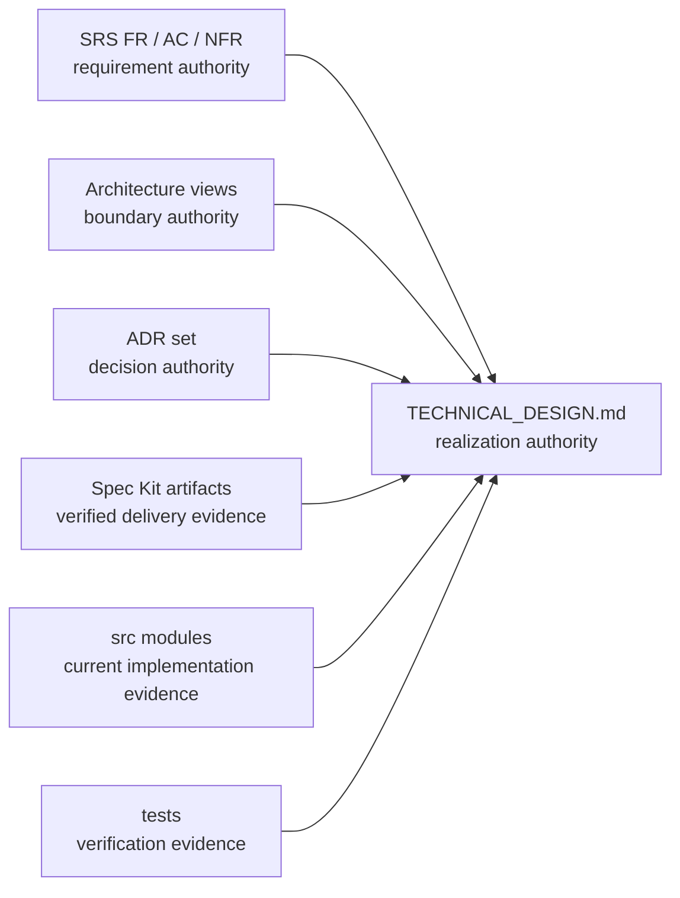

Refs: [SOFTWARE_REQUIREMENTS_SPECIFICATION.md](./SOFTWARE_REQUIREMENTS_SPECIFICATION.md); [ARCHITECTURE_DESIGN.md](./ARCHITECTURE_DESIGN.md); [ADR index](./DECISIONS/AGENT_ARCHITECTURE_DECISION_RECORDS.md); [spec-sync-status.md](../../../specs/spec-sync-status.md); `src/`; `tests/`.

### 2.1 Key Characteristics

| Aspect | Description |
|--------|-------------|
| Architecture | ReAct pattern with tool orchestration |
| AI Framework | LangChain >=1.0.0 with `langchain_core` and `langchain_openai` |
| Model Providers | OpenAI (GPT-5-nano), Grok (grok-4-1-fast-reasoning) with automatic fallback |
| Tool System | Registry-based with caching support |
| Memory | Service-owned session context and lifecycle metadata, LangGraph `MongoDBSaver` for conversation-scoped STM, and a planned future LTM personalization boundary |
| Semantic Router | `semantic-router` library with OpenAI/HuggingFace encoders |
| Response Types | Structured (`AgentResponse`) with immutable dataclasses |

Refs: SRS FR-1, FR-2, FR-3, FR-4, FR-5, FR-6; [ARCHITECTURE_DESIGN.md section 4](./ARCHITECTURE_DESIGN.md#4-architecture-views); ADR-001 through ADR-004.

### 2.2 Source Layout

```text
src/core/
├── stock_assistant_agent.py    # Main ReAct agent with conversation-aware STM routing
├── langgraph_bootstrap.py      # LangGraph agent builder + MongoDBSaver checkpointer factory
├── stock_query_router.py       # Semantic router for query classification
├── routes.py                   # Route definitions and utterances
├── types.py                    # Core types: AgentResponse, ToolCall, TokenUsage
├── langchain_adapter.py        # Prompt building with external file support
├── model_factory.py            # Factory pattern for model clients
├── base_model_client.py        # Abstract base for providers
├── openai_model_client.py      # OpenAI implementation
├── grok_model_client.py        # Grok (xAI) implementation
├── data_manager.py             # Yahoo Finance data fetching
└── tools/
    ├── base.py                 # CachingTool base class
    ├── registry.py             # ToolRegistry singleton
    ├── stock_symbol.py         # Stock lookup tool
    ├── tradingview.py          # TradingView placeholder (Phase 2)
    └── reporting.py            # Report generation tool

src/utils/
└── memory_config.py            # MemoryConfig frozen dataclass with fail-fast validation

src/data/repositories/
└── conversation_repository.py  # ConversationRepository (conversations collection)

src/services/
├── chat_service.py             # Chat orchestration, archive guard, metadata sync (REST path)
└── conversation_service.py     # ConversationService (lifecycle, management APIs, metadata helpers)

src/prompts/
├── analysis_prompt.j2
├── generic_query.j2
├── system_stock_assistant-vn.txt
└── system_stock_assistant.txt
```

Current prompt-system implementation also includes the M1/M2 prompt compiler modules under `src/core/`: `prompt_types.py`, `prompt_asset_loader.py`, and `prompt_assembler.py`. The implemented prompt asset layout includes `src/prompts/system/react_analyst.md` and route-skill assets under `src/prompts/skills/routes/*.md`; legacy template/text assets remain present during the transition window.

Refs: `src/core`; `src/services`; `src/web`; `src/data`; `src/utils`; `src/prompts`; [ARCHITECTURE_DESIGN.md section 4.5.1](./ARCHITECTURE_DESIGN.md#451-source-layout-view).

### 2.3 Prompt Asset Mapping (Current vs Planned)

| View | Prompt Asset Model | Status |
|------|--------------------|--------|
| Legacy runtime layout | Template/text assets under `src/prompts/` | Implemented and retained during transition |
| M1 prompt asset layout | Shallow metadata-driven `src/prompts/system/react_analyst.md` with version, role, status, locale, parity group, and variant in frontmatter | Implemented and verified by `specs/prompt-system-milestone1/review.md` |
| M2 route-skill layout | Route-scoped markdown assets under `src/prompts/skills/routes/*.md` for the canonical `StockQueryRoute` set | Implemented as assets and assembler inputs; runtime activation is gated by assembler injection and `prompts.route_contexts.enabled` |
| Future prompt asset layout | Additional locale variants, always-active skills, shared policy assets, and experiment variants under the ADR taxonomy | Planned / future state |

The technical design treats ADR taxonomy as canonical for prompt assets. Planning-artifact path aliases are non-authoritative and must map back to ADR taxonomy paths.

The structure stays intentionally shallow. Asset class is conveyed by directory, while version, locale, variant, activation mode, and baseline fallback semantics are resolved through metadata and loader policy rather than deeper directory nesting.

Refs: [ADR-002](./DECISIONS/ADR-AGENT-002-SKILLS-PATTERN-PROMPT-COMPOSITION.md); [ADR-003](./DECISIONS/ADR-AGENT-003-EXTERNALIZE-VERSION-PROMPT-ASSETS.md); [prompt-system-milestone1 review](../../../specs/prompt-system-milestone1/review.md); [prompt-system-milestone2 review](../../../specs/prompt-system-milestone2/review.md); `src/core/prompt_asset_loader.py`; `src/core/prompt_assembler.py`; `src/prompts`.

## 3. Core Realization

### 3.1 Agent Runtime and Orchestration

#### StockAssistantAgent

**Location**: `src/core/stock_assistant_agent.py`

**Responsibilities**:

1. Initialize ReAct agent with enabled tools and optional checkpointer
2. Process queries via LangGraph or legacy path
3. Support streaming with `astream_events()`
4. Handle provider fallback orchestration
5. Expose model configuration APIs
6. Manage conversation-aware STM routing via `conversation_id`; parent session context is handled outside the agent in service and management layers

**Key Methods**:

| Method | Description |
|--------|-------------|
| `process_query(query, *, conversation_id)` | Synchronous query processing with optional conversation-scoped memory |
| `process_query_streaming(query, *, conversation_id)` | Generator-based streaming with optional conversation-scoped memory |
| `process_query_structured(query, *, conversation_id)` | Returns `AgentResponse` with metadata |
| `set_default_model(provider, name)` | Update active model |
| `run_interactive()` | CLI REPL mode |

**Constructor behavior**:

The constructor accepts an optional `checkpointer` parameter injected by `APIServer`. When a checkpointer is present and `conversation_id` is provided, the agent includes `{"configurable": {"thread_id": conversation_id}}` in the invoke config so LangGraph automatically loads and saves conversation state.

**Hierarchy behavior**:

- LangGraph checkpoints store thread-specific reasoning state without leaking STM across sibling conversations.
- Conversation lifecycle metadata, archive status, and per-turn counters remain outside the checkpoint store in service and repository surfaces.
- The REST chat path uses `ChatService` to reject archived conversations and record per-turn metadata non-blocking.
- The Socket.IO path validates `conversation_id` and preserves it through to the agent, but currently bypasses `ChatService` lifecycle and metadata helpers.
- Workspace/session/conversation ownership and lifecycle validation live in the management APIs and services, not inside `StockAssistantAgent` itself.
- Session-context resolution helpers exist in `ChatService` and `ConversationService`; merged context is resolved at query time in service helpers, but prompt-level injection of that merged context is still follow-up work.

Refs: SRS FR-1.1, FR-1.2, FR-3.1, FR-3.2, FR-5.1, FR-5.2; [ARCHITECTURE_DESIGN.md section 4.3.1](./ARCHITECTURE_DESIGN.md#431-primary-query-processing-flow); `src/core/stock_assistant_agent.py`; `src/web/api_server.py`; `src/services/chat_service.py`; `src/web/routes/ai_chat_routes.py`; `src/web/sockets/chat_events.py`; `tests/test_agent.py`; `tests/test_chat_service.py`; `tests/test_chat_routes.py`.

#### 3.1.1 Mirror — Component Interface Diagram

This realization-oriented mirror corresponds to the architecture-level interface diagrams in [ARCHITECTURE_DESIGN.md](./ARCHITECTURE_DESIGN.md) section 4.1.1a and section 4.2.2a. It deliberately reuses the same canonical interface vocabulary, then ties each architectural interface to the concrete routes, protocols, factories, registries, and state adapters that realize it in the current codebase.

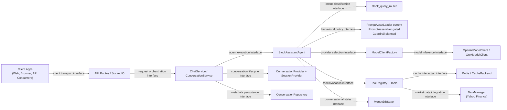

Phase 2B keeps this current runtime shape and adds a target tool-system overlay rather than a second agent runtime. The target path is:

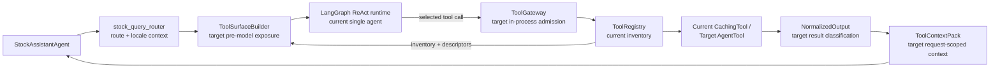

This overlay is target-state Phase 2B design. It does not claim `ToolSurfaceBuilder`, `ToolGateway`, `AgentTool`, provider adapters, normalizers, or `ToolContextPack` exist in the current runtime.

The current realization of those canonical interfaces is:

| Canonical Interface Name | Realization Path in Current Code | Primary Anchors |
|--------------------------|----------------------------------|-----------------|
| Client transport interface | User traffic enters through HTTP and Socket.IO entry points, with request-body validation and conversation identifier normalization at the transport edge | `src/web/routes/ai_chat_routes.py`, `src/web/sockets/chat_events.py` |
| Request orchestration interface | The REST transport edge dispatches into `ChatService` for non-streaming and SSE paths, preserving transport-mode handling outside the agent runtime; the Socket.IO path currently implements a thinner passthrough and does not yet have full orchestration parity | `create_chat_blueprint()`, `ChatService.process_chat_query()`, `ChatService.stream_chat_response()`, `register_chat_events()` |
| Agent execution interface | `ChatService` depends on the `AgentProvider` protocol and delegates query execution and model-info lookup through that contract | `src/services/protocols.py`, `ChatService`, `StockAssistantAgent.process_query*()` |
| Conversation lifecycle interface | Service-layer logic checks archive status, ensures conversation existence, resolves parent session context, and records message metadata outside the agent runtime; this boundary is fully realized on the REST path and remains a known parity gap on Socket.IO | `ConversationProvider`, `SessionProvider`, `_validate_conversation_active()`, `_ensure_conversation_exists()`, `_record_message_metadata()`, `_load_conversation_context()` |
| Metadata persistence interface | Conversation-management metadata is persisted through service and repository paths rather than through the LangGraph checkpoint store | `ConversationService`, `ConversationRepository`, service-factory wiring |
| Intent classification interface | The runtime consults `stock_query_router` as the query classification boundary, keeping intent selection separate from provider binding and tool execution | `src/core/stock_query_router.py`, runtime routing flow |
| Behavioral policy interface | `PromptAssetLoader` (M1) resolves versioned assets in the current runtime; `PromptAssembler` (M2) is implemented and tested but requires explicit runtime injection plus `prompts.route_contexts.enabled=true`; `ResponseGuardrailMiddleware` remains planned | `StockAssistantAgent.REACT_SYSTEM_PROMPT` (legacy fallback), `PromptAssetLoader`, `PromptAssembler`, section 3.5 |
| Provider selection interface | The runtime uses `ModelClientFactory` to resolve provider/model clients and fallback ordering without embedding provider construction logic into route or service code | `ModelClientFactory.get_client()`, `ModelClientFactory.get_fallback_sequence()`, `StockAssistantAgent._select_client()` |
| Tool invocation interface | The runtime materializes enabled tools from `ToolRegistry`, then passes that governed tool surface into the LangGraph ReAct agent | `get_tool_registry()`, `ToolRegistry.get_enabled_tools()`, `StockAssistantAgent._initialize_tools()`, `_build_agent_executor()` |
| Conversational state interface | `APIServer` injects the LangGraph checkpointer, and the runtime binds `conversation_id` into `configurable.thread_id` during invoke so checkpoints stay conversation-scoped | `create_checkpointer()`, `APIServer.__init__()`, `process_query_structured()`, `_process_with_react()` / streaming invoke path |
| Cache interaction interface | Cache-aware tools delegate lookup and write-through behavior to `CacheBackend` and Redis without making cache state part of the agent-facing reasoning contract | `CachingTool`, `CacheBackend`, `StockSymbolTool`, `ReportingTool` |
| Market data integration interface | Tool implementations invoke `DataManager` as the outbound data-access boundary to Yahoo Finance, keeping all market data retrieval behind the tooling surface | `src/core/data_manager.py`, `DataManager`, `StockSymbolTool` |
| Model inference interface | Provider-specific client classes encapsulate the outbound call contract to OpenAI or Grok once the factory has selected the provider/model binding | `OpenAIModelClient`, `GrokModelClient`, `BaseModelClient` |

Current transport note: the REST path fully realizes the request-orchestration and conversation-lifecycle interfaces through `ChatService`, while the Socket.IO path currently realizes client transport plus direct agent invocation with UUID validation only.

This split keeps the architecture package disciplined. The architecture description names the architectural boundaries and their ownership, while this technical view records the concrete adapters, protocol contracts, and call sites that currently realize those interfaces.

Refs: [ARCHITECTURE_DESIGN.md section 4.1.1a](./ARCHITECTURE_DESIGN.md#411a-external-and-internal-interface-diagram-architecture-level); [ARCHITECTURE_DESIGN.md section 4.2.2a](./ARCHITECTURE_DESIGN.md#422a-logical-component-interface-view); [ADR-004](./DECISIONS/ADR-AGENT-004-THIN-TOOL-GATEWAY-AND-NORMALIZED-TOOL-CONTEXT.md); SRS FR-2.4-FR-2.11 and AC-9; `src/services/protocols.py`; `src/services/factory.py`; `src/data/repositories/conversation_repository.py`.

### 3.2 Tool System Realization and Target Gateway Flow

Tool invocation currently stays behind the registry boundary. Cache-aware tools decide whether a request can be served from Redis-backed cache before executing their data-access path, and market-data retrieval remains a tool-owned outbound concern rather than an agent memory concern.

The Phase 2B target keeps that current runtime path, then adds a thin in-process exposure and admission layer around it. `ToolSurfaceBuilder` shapes the model-visible tool surface before ReAct invocation; `ToolGateway` validates the selected call after ReAct tool selection; provider selection, normalization, and `ToolContextPack` assembly stay below model-visible tool names.

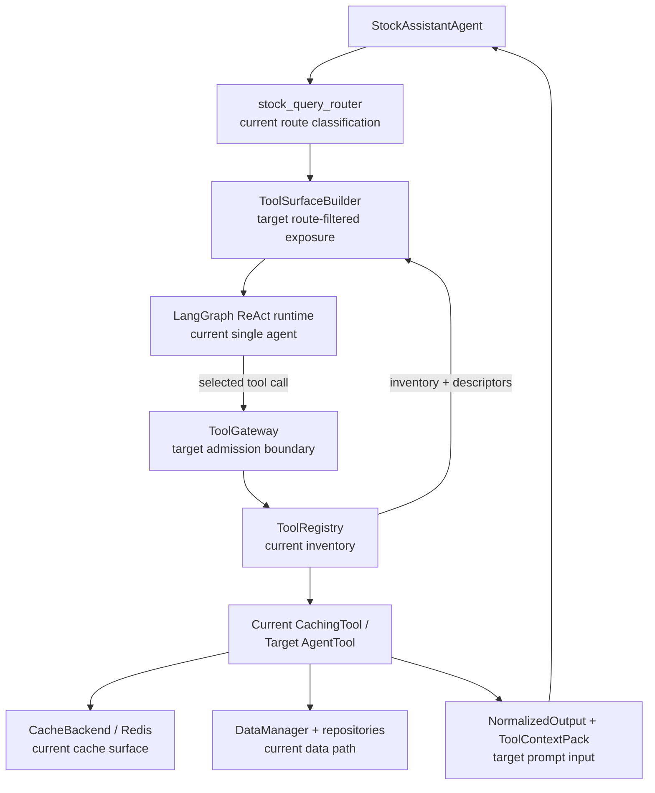

Refs: SRS FR-2.1-FR-2.5; [ADR-004](./DECISIONS/ADR-AGENT-004-THIN-TOOL-GATEWAY-AND-NORMALIZED-TOOL-CONTEXT.md); [ARCHITECTURE_DESIGN.md section 4.3.4](./ARCHITECTURE_DESIGN.md#434-tool-provider-selection-and-fallback-view); `src/core/tools/base.py`; `src/core/tools/registry.py`; `src/core/tools/stock_symbol.py`; `src/core/tools/reporting.py`; `src/core/tools/tradingview.py`; `src/core/data_manager.py`; `src/utils/cache.py`; `tests/test_tools.py`.

#### 3.2.1 Current-to-Target Tool Boundary

| Area | Current State | Target Phase 2B State | Future / Not Yet Admitted |
|------|---------------|-----------------------|----------------------------|
| Agent-visible tool surface | `StockAssistantAgent` builds the ReAct agent from `ToolRegistry.get_enabled_tools()` | `ToolSurfaceBuilder` builds a compact route-filtered model-visible tool list before ReAct invocation | Remote/MCP tool admission only after descriptor integrity and operational need exist |
| Tool execution base | `CachingTool` subclasses provide LangChain-compatible execution and cache write-through | `AgentTool` becomes the target architectural name for descriptor-backed, cache-aware tool execution while preserving current behavior | Full rename or wrapper is implementation-spec work |
| Execution admission | Tool selection is governed primarily by registry enablement and LangChain tool schema | Thin in-process `ToolGateway.execute(route, tool_name, args)` validates route, arguments, risk, license, freshness, timeout, descriptor integrity, and provider state | High-risk mutation paths require explicit authorization and confirmation policy |
| Provider access | `StockSymbolTool` can call `DataManager` for Yahoo-backed live data and fall back to `SymbolRepository` | Provider choice moves below tools through `ProviderSelectionPolicy` and provider adapters; Vietnam-first providers are target for market-data tools | Generic web fetch remains deny-by-default and only normalized evidence when admitted |
| Symbol data ownership | `StockSymbolTool` mixes live price lookup and repository metadata fallback | `StockSymbolTool` targets in-system symbol lookup, normalization, aliases, coverage, tags, and internal metadata through a symbol-store boundary | Symbol-store writes remain disabled until mutation policy and `MutationReceipt` behavior exist |
| Tool outputs | Raw dict-like tool results return to the agent loop | Results are wrapped or normalized into admitted output kinds and assembled into request-scoped `ToolContextPack` | `ToolContextPack` is not persisted wholesale as memory or market truth |
| TradingView | Placeholder tool raises `NotImplementedError` | `TradingViewTool` returns chart/widget/deep-link payloads as `VisualizationProvenance` | TradingView numeric values are not evidence unless a future approved policy admits them |
| Reporting | Scaffold returns placeholder markdown | `ReportingTool` composes from `ToolContextPack`, visualization provenance, generated artifacts, warnings, and degraded states | Direct provider scraping from reports remains out of bounds |

Refs: SRS FR-2.4-FR-2.11, AC-9, IR-3, CON-6-CON-10; [PHASE_2_AGENT_ENHANCEMENT_ROADMAP.md section 2B](./PHASE_2_AGENT_ENHANCEMENT_ROADMAP.md#phase-2b-enhanced-tool-system-feature-implementations); [ADR-004](./DECISIONS/ADR-AGENT-004-THIN-TOOL-GATEWAY-AND-NORMALIZED-TOOL-CONTEXT.md); [SRS_SPEC_TRACEABILITY.md](./SRS_SPEC_TRACEABILITY.md); `src/core/tools`.

#### 3.2.2 Target Phase 2B Runtime Flow

The target flow is a logical in-process realization path. It preserves the current LangChain/LangGraph ReAct runtime and registry-backed execution while adding policy, provider, normalization, and context boundaries.

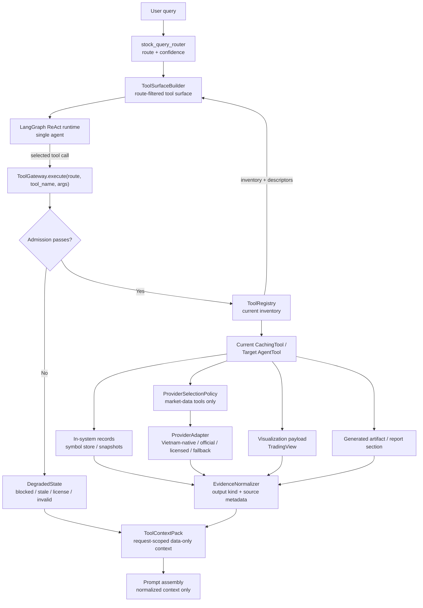

Runtime invariants:

1. Provider adapters are never exposed as a flat model-visible tool list.
2. Raw provider payloads, raw web content, and page instructions do not enter prompt context.
3. Market facts carry source, timestamp, exchange, currency, freshness, license posture, and degraded-state warnings when applicable.
4. Cache hits preserve freshness and source metadata rather than hiding stale or license-unclear data.

##### Tool Call Persistence Decision Flow

This sequence is a target realization view. It explains when data may remain request-scoped, enter cache, or become a retained MongoDB/filesystem derivative; it is not an executable persistence contract or migration plan.

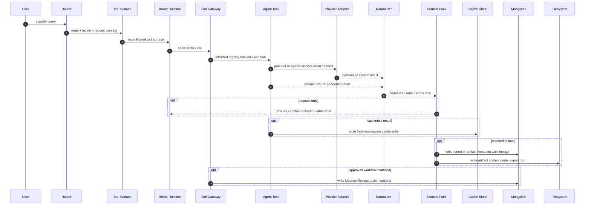

#### 3.2.3 Tool and Adapter Responsibility Split

| Model-Visible Tool Family | Target Responsibility | Internal Adapter / Provider Class | Boundary Rule |
|---------------------------|-----------------------|-----------------------------------|---------------|
| `StockSymbolTool` | In-system symbol lookup, normalization, aliases, exchange/currency identity, coverage, tags, and stored metadata | `InternalSymbolStoreAdapter`, `SymbolRepository`, optional stored-snapshot adapter | No Yahoo/DataManager ownership for target live market data |
| Market-data tools | Quotes, history, fundamentals, market breadth, flow, disclosures, and corporate actions | Vietnam-native, official exchange/depository, licensed commercial, public-web, wrapper/prototype, and international-fallback adapters | Provider order and fallback are internal policy, not model-visible choices |
| `TradingViewTool` | Chart URLs, widget payloads, symbol validation, ticker tape, heatmap/screener payloads where supported | TradingView visualization adapter | Returns `VisualizationProvenance`; not canonical evidence by default |
| `ReportingTool` | Report composition and generated artifact metadata | `ToolContextPack`, artifact metadata store, report storage boundary | Consumes normalized inputs; does not fetch or scrape providers directly |
| `GenericWebFetchTool` | Allowlisted public-web evidence retrieval when concrete tools cannot cover a source | Generic web fetch policy, parser/extractor, citation normalizer | Deny-by-default and produces `EvidenceSnippet` or `EvidenceDocument` only |

Refs: SRS FR-2.6-FR-2.11, IR-3; [ARCHITECTURE_DESIGN.md section 4.3.4](./ARCHITECTURE_DESIGN.md#434-tool-provider-selection-and-fallback-view); [TOOLS_RESEARCH_AND_PROPOSAL.md](./TOOLS_RESEARCH_AND_PROPOSAL.md); `src/core/tools/stock_symbol.py`; `src/core/tools/tradingview.py`; `src/core/tools/reporting.py`.

#### 3.2.4 Target Tool Contract and Failure Realization

The following tables describe target realization ownership only. They do not replace SRS `IR-3`, executable contracts, or implementation specs.

| Target Contract | Target Runtime Owner | Validation / Assembly Point | Persistence and Authority Rule |
|-----------------|----------------------|-----------------------------|--------------------------------|
| `ToolCapabilityDescriptor` | `ToolSurfaceBuilder` | Before pre-model tool exposure | Model-visible only; no credentials, provider fallback, license policy, or parser limits |
| `ToolPolicyDescriptor` | `ToolGateway` | Before execution admission | Internal policy only; traced by descriptor version or integrity marker |
| `ProviderAdapterDescriptor` | `ProviderSelectionPolicy` | Before provider-backed adapter execution | Hidden from the model; carries provider class, license posture, freshness, and credential owner |
| `ProviderSelectionPolicy` | Provider-backed `AgentTool` families | Provider order, fallback, market-session, freshness, timeout, and fail-closed checks | No admissible provider returns `DegradedState`; provider choice is not prompt-controlled |
| `ToolExecutionEnvelope` | `ToolGateway` | Around every governed tool call | Request-scoped trace, admission outcome, cache/freshness status, warnings, and degraded reason |
| `NormalizedOutput` | `EvidenceNormalizer` | After tool execution and before prompt assembly | Only admitted output kinds enter `ToolContextPack` |
| `ToolContextPack` | Prompt assembly boundary | After normalization and before LLM context assembly | Request-scoped data-only context; not persisted wholesale as memory or market truth |
| `GenericWebFetchPolicy` | `GenericWebFetchTool` and parser adapter | Before fetch and after extraction | Deny-by-default; raw HTML, PDF bytes, scripts, hidden text, and page instructions stay outside prompt context |
| `MutationReceipt` | Mutation policy boundary | After approved `workflow_mutation` / `internal_state_mutation` execution | Retained as audit metadata for approved mutations; unauthorized mutations are blocked or degraded |
| `ArtifactMetadata` | `ReportingTool` and artifact storage boundary | When report/export/document/chart artifacts are retained | Stores URI/reference, retention class, checksum where available, and source lineage |

| Failure / Guard | Target Detection Point | Target Result |
|-----------------|------------------------|---------------|
| Route-tool mismatch or disallowed risk class | `ToolSurfaceBuilder` before exposure; `ToolGateway` before execution | Tool is not exposed, or selected call returns `DegradedState` |
| Invalid or missing tool arguments | `ToolGateway` schema and admission validation | Execution is blocked with validation warning and `DegradedState` |
| Descriptor drift, tampering, or unapproved remote descriptor | `ToolSurfaceBuilder` and `ToolGateway` descriptor-integrity check | Tool is not exposed or executed; trace records descriptor version/hash mismatch |
| License-unclear provider or unsupported credential scope | `ProviderSelectionPolicy` | Fail closed with `DegradedState`; no silent provider substitution |
| Stale cache or stale provider data | `AgentTool` cache path and `ProviderSelectionPolicy` freshness check | Refresh from admissible provider, or return stale-data `DegradedState` with source metadata |
| Provider outage, timeout, or missing fields | `ProviderAdapter` and `ToolGateway` timeout/error boundary | Try admitted fallback provider when available; otherwise return degraded provider state |
| Raw web prompt-injection text, parser limit, or blocked domain | `GenericWebFetchTool`, parser adapter, and normalizer | Quarantine page instructions; return normalized snippets/documents or `DegradedState` only |
| TradingView numeric fact used as evidence | `EvidenceNormalizer` and prompt assembly boundary | Classify as `VisualizationProvenance`; final numeric facts must come from approved evidence or computation tools |
| Unauthorized symbol-store mutation | `ToolGateway` and mutation policy boundary | Block or degrade; no durable mutation occurs without authorization, confirmation, and audit metadata |
| Report section lacks source lineage | `ReportingTool` and artifact metadata boundary | Surface warning/degraded state; retained report artifacts preserve lineage for sourced sections |

Refs: SRS IR-3, FR-2.4-FR-2.11, AC-9, CON-6-CON-10; [ADR-004](./DECISIONS/ADR-AGENT-004-THIN-TOOL-GATEWAY-AND-NORMALIZED-TOOL-CONTEXT.md); [ARCHITECTURE_DESIGN.md section 4.3.4](./ARCHITECTURE_DESIGN.md#434-tool-provider-selection-and-fallback-view); [PHASE_2_AGENT_ENHANCEMENT_ROADMAP.md section 2B](./PHASE_2_AGENT_ENHANCEMENT_ROADMAP.md#phase-2b-enhanced-tool-system-feature-implementations).

#### 3.2.5 Tool Data Model and Persistent Storage Realization

The tool-system data model is a target-state realization view. It uses current MongoDB schemas and filesystem export behavior as anchors, but it does not claim that the target tool metadata collections, artifact paths, or schema overlays are implemented. Executable MongoDB schemas, migrations, and repository classes remain future implementation-spec work.

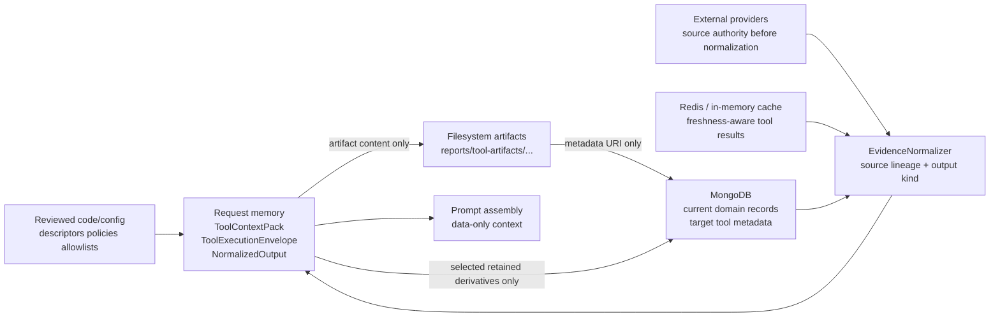

Data-tier rules:

1. `ToolContextPack`, `ToolExecutionEnvelope`, and raw normalized outputs are request-scoped by default.
2. Redis and in-memory cache are performance layers; cached market data must carry source timestamp and freshness metadata.
3. MongoDB is the durable domain-record and metadata store, not a dumping ground for raw prompt context.
4. Filesystem storage is the initial artifact-content backend; MongoDB stores the metadata, URI/path, checksum, retention class, and lineage.
5. Reviewed descriptors, provider policy, parser limits, and allowlists remain code/config authority and should be traceable by version or hash.

##### Tool Data Storage Stack and Access Mechanisms

This C4-style storage view is a target realization diagram. It shows component ownership and access mechanisms, not a mandate to create new services or a claim that target metadata collections already exist.

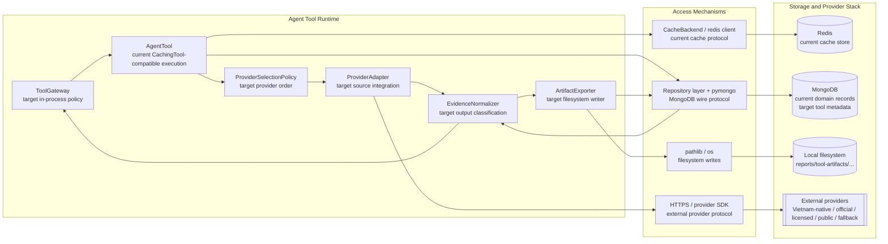

##### Current MongoDB Collection Anchors

| Collection | Current Role | Current Schema Anchor | Tool-System Use | Target Overlay / Gap |
|------------|--------------|-----------------------|-----------------|----------------------|
| `symbols` | Canonical symbol metadata, listing context, aliases, identifiers, coverage, snapshots, and tags | `src/data/schema/symbols_schema.py`, `SymbolRepository` | Target source for evolved `StockSymbolTool` internal lookup and normalization | Current unique index is ticker-only; target identity needs `symbol + exchange + currency` and Vietnam aliases such as `HOSE:FPT` |
| `market_data` | Time-series OHLCV records keyed by symbol and timestamp | `src/data/schema/market_data_schema.py` | Target persistence path for approved quote/history facts when retention is explicitly needed | Current metadata is symbol-centric; target provider-backed facts need exchange, currency, source URL/reference, freshness, and license posture |
| `market_snapshots` | Market-wide snapshot payloads | `src/data/schema/market_snapshots_schema.py`, `MarketSnapshotRepository` | Target retention path for market breadth, index, flow, and dashboard snapshots | Current schema is generic `as_of + data`; target snapshots need market, provider, source lineage, coverage, and degraded-state visibility |
| `reports` | Workspace/session/analysis-bound publishable reports with sections and attachments | `src/data/schema/reports_schema.py` | Target workspace report metadata and artifact references | Current attachments have name/type/URI; target requires checksum, retention class, source lineage, and degraded-state visibility |
| `investment_reports` | Symbol-oriented investment report records with analysis sections, charts, and metadata | `src/data/schema/investment_reports_schema.py` | Target symbol report metadata when report output is tied to one security | Current metadata tracks data sources and `data_as_of`; target needs normalized-output lineage and finance-safety/degraded-state metadata |
| `conversations` | Application-owned conversation lifecycle and metadata | `src/data/schema/conversations_schema.py` | Stores conversation state metadata, not durable market truth | Must not persist `ToolContextPack` wholesale or raw tool outputs as conversation memory |
| `agent_checkpoints` | LangGraph-managed checkpoint state | `src/data/schema/agent_checkpoints_schema.py` documentation only | Recoverable conversation-scoped agent state | Managed by `MongoDBSaver`; not a schema extension point for tool facts, artifacts, or market truth |

##### Target Tool Metadata Collections

These target collections are proposed technical contracts. They should be implemented only after a Phase 2B implementation spec defines concrete MongoDB schemas, migrations, repositories, and indexes.

| Collection | Purpose | Required Fields | Important Indexes | Retention Rule |
|------------|---------|-----------------|-------------------|----------------|
| `tool_artifacts` | Durable metadata for report exports, extracted source documents, chart snapshots, generated sections, and large retained evidence files | `artifact_id`, `artifact_type`, `uri`, `storage_backend`, `workspace_id` where available, `conversation_id` where available, `source_lineage`, `generated_by`, `created_at`, `checksum`, `size_bytes`, `mime_type`, `retention_class` | unique `artifact_id`; `workspace_id + created_at`; `conversation_id`; `source_lineage.provider`; `retention_class` | Persist metadata only for explicitly retained artifacts; content lives on filesystem initially |
| `tool_mutation_receipts` | Audit records for approved `workflow_mutation` actions, including `internal_state_mutation` symbol-store writes | `mutation_id`, `target_collection`, `target_record`, `action`, `before_summary`, `after_summary`, `actor`, `route`, `tool_name`, `approval_status`, `policy_descriptor_hash`, `gateway_admission`, `created_at`, `result` | unique `mutation_id`; `target_collection + target_record`; `actor.user_id + created_at`; `route + tool_name` | Durable audit metadata for approved, rejected, or blocked mutation attempts when policy requires audit |
| `tool_execution_traces` | Optional diagnostic trace metadata for governed tool calls | `trace_id`, `request_id`, `conversation_id` where available, `route`, `tool_name`, `adapter_name`, `descriptor_hashes`, `cache_status`, `latency_ms`, `warnings`, `degraded_state`, `created_at`, `expires_at` | unique `trace_id`; `request_id`; `conversation_id + created_at`; TTL index on `expires_at` | Disabled by default; if enabled, TTL-scoped and must not store raw provider payloads or full `ToolContextPack` |

The following collection view is a logical schema relationship diagram. It documents current and target relationships for design review only; executable schemas, migrations, and indexes remain owned by later implementation specs.

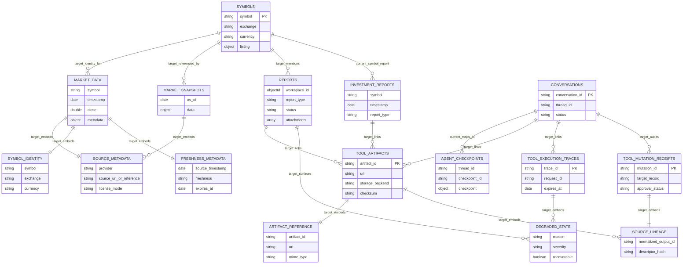

##### Shared Embedded Blocks

| Block | Fields | Used By | Rule |
|-------|--------|---------|------|
| `source_metadata` | `provider`, `provider_class`, `source_url_or_reference`, `retrieved_at`, `published_at`, `effective_at`, `license_mode`, `parser_quality`, `warnings` | `EvidenceFact`, `EvidenceSnippet`, `EvidenceDocument`, report sections, artifacts, retained snapshots | Required for every retained market fact or source-derived artifact |
| `symbol_identity` | `symbol`, `exchange`, `currency`, optional `mic`, `country`, `asset_type`, `provider_symbol` | symbol records, market facts, reports, TradingView payloads, snapshots | Ticker alone is insufficient for durable identity |
| `freshness_metadata` | `source_timestamp`, `retrieved_at`, `freshness`, `ttl_seconds`, `expires_at`, `market_session`, `degraded_reason` | cache entries, market facts, reports, traces | TTL alone is not enough; freshness must remain visible |
| `source_lineage` | normalized output ID or run ID, provider/source metadata, artifact IDs, report IDs, mutation IDs, descriptor hashes | `tool_artifacts`, reports, mutation receipts, traces | Retained outputs must be auditable back to normalized source material |
| `artifact_reference` | `artifact_id`, `artifact_type`, `uri`, `storage_backend`, `checksum`, `size_bytes`, `mime_type`, `created_at` | reports, investment reports, chart metadata, extracted documents | MongoDB stores metadata and URI/path; filesystem stores content |
| `degraded_state` | `reason`, `severity`, `source`, `tool_name`, `adapter_name`, `recoverable`, `user_visible_message`, `created_at` | envelopes, reports, artifacts, traces | Missing, stale, blocked, parser-limited, provider-down, or license-unclear data must not silently disappear |

##### Filesystem Artifact Storage

The initial artifact-content backend is local filesystem storage under the configured export root. The current config anchor is `export.output_directory`, which defaults to `reports`, and the current exporter writes files through `src/export/report_exporter.py`.

Target path convention:

```text
reports/tool-artifacts/{workspace_or_global}/{yyyy}/{mm}/{artifact_id}.{ext}
```

Filesystem rules:

1. `workspace_or_global` is the workspace ID when available; otherwise use `global`.
2. `artifact_id` is generated before writing content and is the join key to `tool_artifacts`.
3. The filesystem path is stored as a URI/path in MongoDB; MongoDB remains the metadata authority.
4. Artifact content may include report exports, generated tables, extracted source documents, chart snapshots, or large evidence files.
5. Raw provider/web payloads are not prompt context. If retained, they must be treated as artifacts with source lineage, parser warnings, license posture, and checksum metadata.
6. Future object storage or GridFS may replace the filesystem backend behind the same `artifact_reference` contract.

##### Target Schema Gap Register

| Gap | Current Fact | Target Direction | Implementation Note |
|-----|--------------|------------------|---------------------|
| Symbol identity | `symbols` has a unique `symbol` index | Durable identity uses `symbol + exchange + currency`, with aliases for provider and exchange-specific symbols | Add migration and duplicate-resolution plan before changing uniqueness |
| Market fact lineage | `market_data.metadata` currently tracks source, quality, and last update | Retained facts include provider class, source URL/reference, exchange, currency, freshness, license mode, and degraded-state reason | Extend schema through implementation spec before provider expansion persists facts |
| Market snapshots | `market_snapshots` accepts generic `data` payload | Retained snapshots include market, provider coverage, source lineage, and snapshot freshness | Keep flexible payload but standardize metadata envelope |
| Report artifacts | `reports.attachments` stores name/type/URI | Retained report artifacts include checksum, size, MIME/format, retention class, and source lineage | Prefer `tool_artifacts` metadata linked from reports instead of embedding heavy artifact detail |
| Investment report sources | `investment_reports.metadata.data_sources` and `data_as_of` are coarse | Report sections preserve normalized-output lineage, degraded states, and finance-safety warnings | Avoid persisting unsourced generated recommendations as market truth |
| Tool traces | No dedicated tool trace collection exists | Optional TTL-scoped `tool_execution_traces` contains metadata only | Do not store raw provider payloads or full context packs in traces |

Refs: SRS FR-2.5, FR-2.10, FR-2.11, IR-3, AC-9, CON-9, CON-10; [ARCHITECTURE_DESIGN.md section 4.4.2](./ARCHITECTURE_DESIGN.md#442-state-and-evidence-allocation-boundaries); [TOOLS_RESEARCH_AND_PROPOSAL.md](./TOOLS_RESEARCH_AND_PROPOSAL.md); `src/data/schema/symbols_schema.py`; `src/data/schema/market_data_schema.py`; `src/data/schema/market_snapshots_schema.py`; `src/data/schema/reports_schema.py`; `src/data/schema/investment_reports_schema.py`; `src/data/schema/conversations_schema.py`; `src/data/schema/agent_checkpoints_schema.py`; `src/data/schema/schema_manager.py`; `src/export/report_exporter.py`; `config/config.yaml`.

Tool invocation stays behind the registry boundary. Cache-aware tools decide whether a request can be served from Redis-backed cache before executing their data-access path, and market-data retrieval remains a tool-owned outbound concern rather than an agent memory concern.

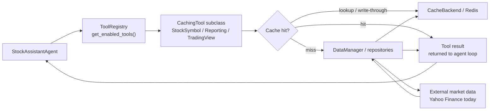

Refs: SRS FR-2.1, FR-2.2, FR-2.3; [ADR-004](./DECISIONS/ADR-AGENT-004-THIN-TOOL-GATEWAY-AND-NORMALIZED-TOOL-CONTEXT.md); [ARCHITECTURE_DESIGN.md section 4.3.4](./ARCHITECTURE_DESIGN.md#434-tool-provider-selection-and-fallback-view); `src/core/tools/base.py`; `src/core/tools/registry.py`; `src/core/tools/stock_symbol.py`; `src/core/tools/reporting.py`; `src/core/tools/tradingview.py`; `src/core/data_manager.py`; `src/utils/cache.py`; `tests/test_tools.py`.

#### CachingTool Base Class

**Location**: `src/core/tools/base.py`

**Responsibilities**:

1. Extend LangChain's `BaseTool` with caching
2. Generate deterministic cache keys
3. Track execution metrics
4. Provide health check interface

**Key Features**:

```python
class CachingTool(BaseTool):
    cache_ttl_seconds: int = 60
    enable_cache: bool = True

    def _run(self, **kwargs) -> Any:
        result, was_cached = self._cached_run(**kwargs)
        return result

    def _cached_run(self, **kwargs) -> tuple[Any, bool]:
        cache_key = self._generate_cache_key(**kwargs)
        if cached := self._cache.get_json(cache_key):
            return cached, True
        result = self._execute(**kwargs)
        self._cache.set_json(cache_key, result, ttl_seconds=self.cache_ttl_seconds)
        return result, False
```

#### StockSymbolTool

**Location**: `src/core/tools/stock_symbol.py`

**Actions**:

- `get_info`: Retrieve stock price and metadata
- `search`: Search symbols by name pattern

**Data Sources**:

1. **DataManager** (Yahoo Finance) - Live price data
2. **SymbolRepository** (MongoDB) - Symbol metadata fallback

**Caching Strategy**:

- TTL: 60 seconds (default)
- Cache key: `tool:stock_symbol:<md5_hash>`

#### ToolRegistry

**Location**: `src/core/tools/registry.py`

| Method | Description |
|--------|-------------|
| `register(tool, enabled=True)` | Add tool to registry |
| `unregister(name)` | Remove tool |
| `get(name)` | Get tool by name |
| `get_enabled_tools()` | List enabled tools |
| `set_enabled(name, bool)` | Toggle tool state |
| `health_check()` | Aggregate tool health |

#### Tool Risk Realization

The runtime should expose tool risk as first-class control metadata so prompt policy, tool guardrails, and future approval hooks share one vocabulary instead of ad hoc per-tool assumptions.

| Risk Class | Current Technical Meaning | Registry / Runtime Requirement | Current Status |
|------------|---------------------------|-------------------------------|----------------|
| `read_only_evidence` | Fetches data without mutating durable state | Registry records class; runtime validates arguments and preserves provenance in traces | Supported target for current baseline |
| `bounded_transformation` | Computes or reformats governed inputs without mutating durable state | Registry records class; runtime validates input and output schema before results re-enter prompt assembly | Supported target for current baseline |
| `workflow_mutation` | Changes repo-owned or user-owned durable state | Requires service-owned authorization, approval-capable workflow hooks, and audit metadata before enablement | Future only |
| `external_side_effect` | Writes to third-party systems or triggers real-world actions | Requires explicit allowlisting, human approval, and fail-closed defaults before enablement | Not admitted in the current baseline |

Runtime rules:

1. `ToolRegistry.get_enabled_tools()` should filter by both enablement and the strongest risk class admitted by the selected prompt asset.
2. Prompt-facing tool policy may narrow exposure but must not reclassify a tool below the registry-declared risk class.
3. Any runtime path that exercises a class above `bounded_transformation` must emit approval-state and `tool_risk_class` metadata for tracing and audit.

Refs: [ADR-004](./DECISIONS/ADR-AGENT-004-THIN-TOOL-GATEWAY-AND-NORMALIZED-TOOL-CONTEXT.md); [TOOLS_RESEARCH_AND_PROPOSAL.md](./TOOLS_RESEARCH_AND_PROPOSAL.md); [TOOLS_ARCHITECTURE_BENCHMARK_REVIEW.md](./TOOLS_ARCHITECTURE_BENCHMARK_REVIEW.md); SRS FR-1.4.14 and FR-1.5.6; `tests/security/test_operator_tooling_boundaries.py`.

### 3.3 Memory Architecture and Lifecycle

#### Short-Term Memory (STM) via LangGraph Checkpointer

**Decision in force**: Use LangGraph's `MongoDBSaver` checkpointer for conversation-scoped STM persistence, with `conversation_id -> thread_id` as the canonical memory mapping and service-owned session context retained as reusable parent business context.

**Status**: Implemented in the current runtime. Conversation-scoped checkpoints, management APIs, reconciliation tooling, and legacy-thread migration tooling are live on this branch.

**Reference model in force**:

- Session context remains a service-owned parent business context boundary rather than a memory tier.
- STM remains the implemented conversation-scoped, checkpoint-managed runtime state surface.
- Future LTM remains a planned cross-conversation personalization boundary only.
- RAG and tools remain evidence and computation surfaces rather than extensions of STM or LTM.

**Key Design Choices**:

| Aspect | Decision |
|--------|----------|
| Checkpointer | LangGraph `MongoDBSaver` — native integration with agent execution |
| Thread ID Mapping | Direct 1:1: `conversation_id` → `thread_id` |
| Hierarchy Model | `workspace -> session -> conversation`, where the session owns reusable business context and the conversation owns STM |
| Dual Collections | `agent_checkpoints` (LangGraph-owned runtime state) + `conversations` (app-managed lifecycle metadata) |
| Backward Compatibility | `conversation_id` is optional — omitting preserves stateless single-turn behavior |
| Memory Scope | Stores conversation text only; never stores prices, ratios, or tool outputs |
| Current lifecycle behavior | `active` and `archived` are current-state service controls; `summarized` remains schema-supported but not universally active runtime flow |
| Transport parity | REST uses `ChatService` lifecycle and metadata helpers; Socket.IO currently bypasses them |
| Session-context timing | Resolved at query time in service helpers via conversation-to-session lookup; not yet injected into the prompt path |
| Future LTM boundary | Planned cross-conversation personalization only; separate from session context, STM, and RAG |
| Configuration | `MemoryConfig` frozen dataclass with 9 configurable parameters and fail-fast validation |

**Architecture Note**:

The canonical runtime contract is now `conversation_id` across agent methods, REST chat, management APIs, repositories, reconciliation, and migration tooling. The REST `POST /api/chat` route still accepts a deprecated `session_id` alias and normalizes it into `conversation_id` before validation; the Socket.IO handler accepts `conversation_id` only.

#### 3.3.1 STM Store Boundaries and Authority

The current runtime keeps checkpoint state and business metadata in separate stores on purpose.

| Concern | Authoritative Surface | Supporting Surface | Current Behavior |
|---------|-----------------------|--------------------|------------------|
| Recoverable conversation execution state | `agent_checkpoints` via LangGraph `MongoDBSaver` | `conversation_id -> thread_id` mapping from app surfaces | The runtime binds `conversation_id` into `configurable.thread_id` and lets LangGraph load and save thread state |
| Archive status, ownership, and per-turn metadata | `conversations` plus service-layer helpers | Checkpoints may indirectly reflect message history only | Archive guards and metadata recording live outside the checkpoint store |
| Reusable parent business context | Session service plus conversation-linked `session_id` | Conversation `context_overrides` | `ChatService._load_conversation_context()` resolves merged context at query time |
| Stateless fallback | No STM store required | None | Requests without `conversation_id` preserve the single-turn path |

This split means the stores may diverge temporarily without collapsing into one source of truth. A metadata record may exist even when checkpoint persistence is unavailable, and a checkpoint may exist before metadata has been ensured. In those cases the service layer remains authoritative for ownership and lifecycle, while checkpoints remain authoritative only for recoverable thread-local reasoning state.

#### 3.3.2 Current Runtime Caveats

- The REST route is the only chat path that currently realizes archive guards, `ensure_conversation_exists()`, metadata sync, and session-context lookup through `ChatService`.
- The Socket.IO handler validates `conversation_id` and passes it to `agent.process_query(...)`, but it does not yet call the lifecycle and metadata helpers used by REST.
- `MemoryConfig` exposes `summarize_threshold`, `max_messages`, and related limits, but the chat execution path does not yet trigger automatic summarization when those thresholds are exceeded.
- The REST route still accepts deprecated `session_id` only as an alias normalized into `conversation_id` before validation.

**Wiring Flow**:

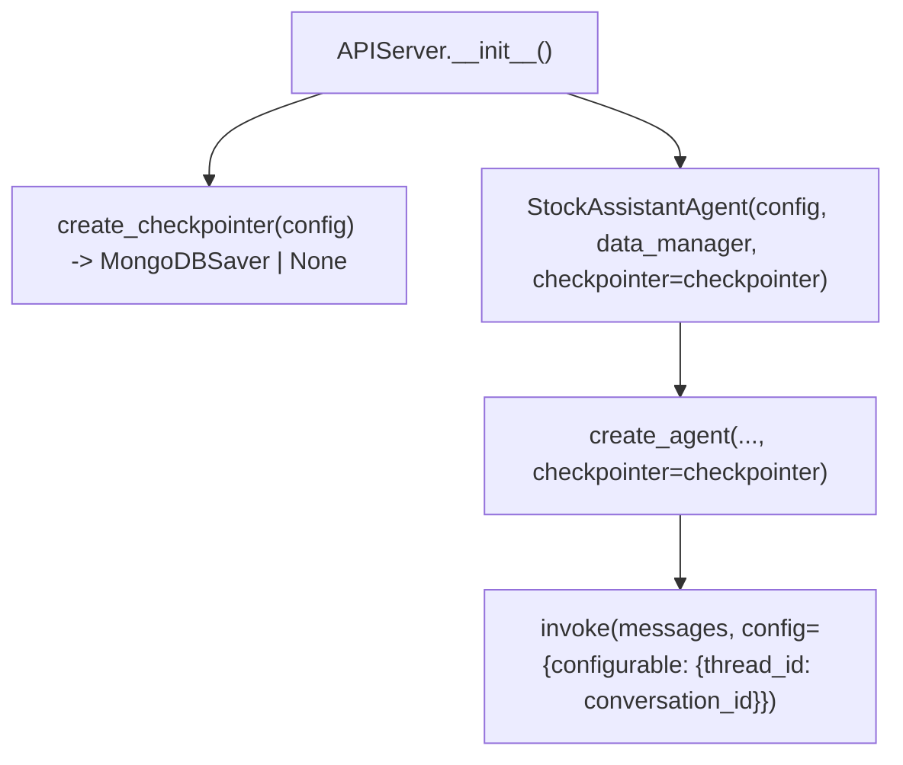

**Detailed Design**: [AGENT_MEMORY_TECHNICAL_DESIGN.md](./AGENT_MEMORY_TECHNICAL_DESIGN.md)

Refs: SRS FR-3.1, FR-3.2, FR-3.3, FR-3.4; [ARCHITECTURE_DESIGN.md section 4.4](./ARCHITECTURE_DESIGN.md#44-information-and-state-view); [AGENT_MEMORY_TECHNICAL_DESIGN.md](./AGENT_MEMORY_TECHNICAL_DESIGN.md); [agent-session-with-stm-wiring review](../../../specs/agent-session-with-stm-wiring/review.md); [stm-phase-cde review](../../../specs/stm-phase-cde/review.md); `src/core/langgraph_bootstrap.py`; `src/utils/memory_config.py`; `src/services/conversation_service.py`; `tests/test_agent_memory.py`; `tests/integration/test_stm_runtime_wiring.py`; `tests/integration/test_memory_persistence.py`.

### 3.4 Model Selection, Routing, and Fallback

Model selection and route classification are separate runtime concerns. Routing determines intent and prompt/tool context; provider selection determines which model client executes the request and how fallback metadata is reported.

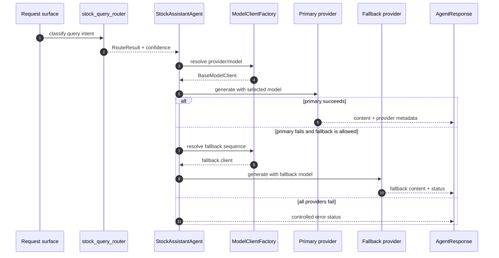

Refs: SRS FR-1.3, FR-4.1, FR-4.2; [ARCHITECTURE_DESIGN.md section 4.3.2](./ARCHITECTURE_DESIGN.md#432-route-classification-view); [ARCHITECTURE_DESIGN.md section 4.3.3](./ARCHITECTURE_DESIGN.md#433-model-provider-selection-and-fallback-view); `src/core/model_factory.py`; `src/core/base_model_client.py`; `src/core/openai_model_client.py`; `src/core/grok_model_client.py`; `src/core/stock_query_router.py`; `src/core/routes.py`; `tests/test_model_factory.py`; `tests/test_stock_query_router.py`; `tests/test_agent_fallback.py`.

#### ModelClientFactory

**Decision**: Use `ModelClientFactory` with caching for model client instantiation.

```python
class ModelClientFactory:
		_CACHE: Dict[str, BaseModelClient] = {}
```

**Rationale**:

- Single responsibility: Factory handles creation logic, clients handle generation
- Lazy instantiation: Clients created on-demand, not at startup
- Cache efficiency: Prevents redundant API client initialization
- Provider agnostic: Uniform interface regardless of OpenAI, Grok, or future providers

#### Semantic Router for Query Classification

**Decision**: Use `semantic-router` with OpenAI embeddings and HuggingFace fallback for intent classification.

**Route Categories**:

| Route | Description | Example Queries |
|-------|-------------|-----------------|
| `PRICE_CHECK` | Current prices, quotes, market cap | "What is AAPL trading at?" |
| `NEWS_ANALYSIS` | Headlines, earnings, market events | "Latest news on Tesla" |
| `PORTFOLIO` | Holdings, P&L, allocation | "Show my portfolio value" |
| `TECHNICAL_ANALYSIS` | Charts, MACD, RSI, patterns | "Show RSI for NVDA" |
| `FUNDAMENTALS` | P/E, P/B, DCF, financial ratios | "What's Apple's P/E ratio?" |
| `IDEAS` | Stock picks, investment strategies | "Recommend growth stocks" |
| `MARKET_WATCH` | Index updates, sector performance | "How is VN-Index doing?" |
| `GENERAL_CHAT` | Fallback for unmatched queries | "Hello, how are you?" |

**Configuration**:

```yaml
semantic_router:
	encoder:
		primary: openai
		fallback: huggingface
		openai_model: "text-embedding-3-small"
		huggingface_model: "sentence-transformers/all-MiniLM-L6-v2"
	threshold: 0.7
	cache_embeddings: true
```

#### Retrieval-Augmented Generation Realization

> **Status:** Planned architecture with partial evidence support today via tool paths; intent-specific retrieval indices are not yet fully implemented in the active runtime.

The layered architecture treats retrieval as a distinct evidence path rather than as an extension of memory. In realization terms, this means route classification determines which evidence sources are eligible for a request and keeps retrieved source material separate from LTM, STM, and prompt-policy assets.

| Intent Family | Retrieval Focus | Expected Freshness Profile |
|---------------|-----------------|----------------------------|
| `FUNDAMENTALS` | Filings, financial statements, and valuation-supporting evidence | Medium-lived; refreshed around reporting cycles |
| `NEWS_ANALYSIS` | Press releases, headlines, and event-driven evidence | Short-lived; refreshed frequently |
| `MARKET_WATCH` | Macro, sector, and index context | Medium-lived; refreshed on market cadence |
| `TECHNICAL_ANALYSIS` | Indicator-supporting data and chart-derived context | Near-real-time or recent-window bias |

This design preserves two technical invariants from ADR-001: retrieved evidence is sourced and attributable, and any interpretation produced from that evidence remains in the model output rather than being written back into memory as domain truth.

Refs: [ADR-001](./DECISIONS/ADR-AGENT-001-LAYERED-LLM-ARCHITECTURE.md); SRS FR-1.5.1, FR-1.5.5, FR-4.2.1; `src/core/tools`; `src/core/data_manager.py`; `tests/test_data_manager.py`.

#### Immutable Response Types

**Decision**: Use frozen dataclasses for all response types.

```python
@dataclass(frozen=True)
class AgentResponse:
		content: str
		provider: str
		model: str
		status: ResponseStatus = ResponseStatus.SUCCESS
		tool_calls: tuple[ToolCall, ...] = field(default_factory=tuple)
		token_usage: TokenUsage = field(default_factory=TokenUsage)
```

#### Dual Execution Mode (ReAct + Legacy Fallback)

**Decision**: Maintain legacy processing path as fallback.

```python
def process_query(
		self,
		query: str,
		*,
		provider: Optional[str] = None,
		conversation_id: Optional[str] = None,
) -> str:
		try:
				if self._agent_executor:
						return self._process_with_react(
								query,
								provider=provider,
								conversation_id=conversation_id,
						)
				return self._process_legacy(query, provider=provider)
		except Exception as e:
				self.logger.error(f"Error generating response: {e}")
				return f"Sorry, I encountered an error: {e}"
```

Refs: SRS FR-1.2.2, FR-1.3.2, FR-1.3.3; `src/core/types.py`; `src/core/stock_assistant_agent.py`; `tests/test_agent_regression.py`; `tests/test_agent_fallback.py`.

### 3.5 Prompt Realization and Guardrails

> **Status:** Mixed current, gated, and planned realization path.
> **Decision coupling:** This section reflects implemented M1/M2 source evidence, verified Spec Kit reviews, and the prompt-related ADRs.

The prompt system has moved from one governed runtime prompt toward a structured realization path. M1 externalized and versioned the baseline prompt with loader-backed fallback and response metadata. M2 implemented route-skill assets and `PromptAssembler`, but route-aware assembly is gated in the default runtime because the API server currently injects only `PromptAssetLoader` and `prompts.route_contexts.enabled` defaults to `false`. Response guardrail middleware, experiment rollout, and full streaming guardrail behavior remain planned.

| Concern family | Primary authority | Use this section for |
|----------------|-------------------|----------------------|
| Boundary, precedence, and component ownership | [ARCHITECTURE_DESIGN.md §4.8 Prompt and Behavior View](./ARCHITECTURE_DESIGN.md#48-prompt-and-behavior-view), [ADR-AGENT-001-LAYERED-LLM-ARCHITECTURE.md](./DECISIONS/ADR-AGENT-001-LAYERED-LLM-ARCHITECTURE.md), [ADR-AGENT-002-SKILLS-PATTERN-PROMPT-COMPOSITION.md](./DECISIONS/ADR-AGENT-002-SKILLS-PATTERN-PROMPT-COMPOSITION.md), [ADR-AGENT-003-EXTERNALIZE-VERSION-PROMPT-ASSETS.md](./DECISIONS/ADR-AGENT-003-EXTERNALIZE-VERSION-PROMPT-ASSETS.md) | Realization views that stay inside the architecture boundary rather than redefining it |
| Requirements, rollout gates, and release controls | [SOFTWARE_REQUIREMENTS_SPECIFICATION.md §FR-1.4 System Prompt](./SOFTWARE_REQUIREMENTS_SPECIFICATION.md#fr-14-system-prompt), [SOFTWARE_REQUIREMENTS_SPECIFICATION.md §NFR-5: Observability](./SOFTWARE_REQUIREMENTS_SPECIFICATION.md#nfr-5-observability), [SOFTWARE_REQUIREMENTS_SPECIFICATION.md §AC-8: Prompt System](./SOFTWARE_REQUIREMENTS_SPECIFICATION.md#ac-8-prompt-system), [PHASE_2_AGENT_ENHANCEMENT_ROADMAP.md §2A.2 Prompt Compiler Path & Controlled Rollout](./PHASE_2_AGENT_ENHANCEMENT_ROADMAP.md#22-prompt-compiler-path--controlled-rollout) | Mapping technical contracts, diagrams, and residual rules back to FR, NFR, AC, and rollout controls |
| Design rationale, benchmark alignment, and sync | [PROMPT_SYSTEM_RESEARCH_PROPOSAL.md §Target Prompt System Architecture](./PROMPT_SYSTEM_RESEARCH_PROPOSAL.md#target-prompt-system-architecture), [PROMPT_SYSTEM_BENCHMARK_REVIEW.md §4.3 Guardrails Belong at Boundaries](./PROMPT_SYSTEM_BENCHMARK_REVIEW.md#43-guardrails-belong-at-boundaries), [SRS_SPEC_TRACEABILITY.md §Reverse Trace](./SRS_SPEC_TRACEABILITY.md#reverse-trace), [spec-sync-status.md](../../../specs/spec-sync-status.md) | Checking whether the realization stays aligned with the target design, benchmark guidance, and post-change traceability duties |

Refs: [prompt-system-milestone1 review](../../../specs/prompt-system-milestone1/review.md); [prompt-system-milestone2 review](../../../specs/prompt-system-milestone2/review.md); `src/core/prompt_asset_loader.py`; `src/core/prompt_assembler.py`; `src/core/prompt_types.py`; `src/prompts`; `tests/test_prompt_asset_loader.py`; `tests/test_prompt_assembler.py`; `tests/test_prompt_metadata.py`; `tests/test_prompt_config.py`.

The following stack separates current, gated, and planned runtime technologies in the prompt control plane, orchestration loop, and observability boundary.

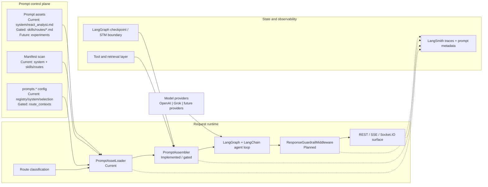

The current default request path uses loader-resolved prompt content. Route-aware compilation is implemented at component level and becomes active only when `PromptAssembler` is constructed and injected into `StockAssistantAgent` while `prompts.route_contexts.enabled` is `true`. Guardrail middleware and experiment controls are not current runtime behavior.

#### 3.5.1 Current Baseline and Transition Direction

The current baseline is a loader-resolved runtime prompt contract supported by prompt assets under `src/prompts/`. The implementation retains the hardcoded `REACT_SYSTEM_PROMPT` as a legacy fallback alias, while `PromptAssetLoader` is the current authoritative prompt source in the API server path.

For technical design purposes, the key transition is:

- from hardcoded prompt content to versioned prompt assets: implemented in M1;
- from direct asset loading to route-aware prompt compilation: implemented in M2 components and gated for runtime activation;
- from broad prompt changes to bounded route-aware prompt context via the Skills pattern: implemented as route assets and assembler behavior, not enabled by default server wiring; and
- from prompt identity metadata to full response guardrail outcomes: metadata is current, guardrail outcome enforcement remains planned.

#### 3.5.2 Prompt Compiler Path

The prompt compiler path is `PromptAssetLoader -> PromptAssembler -> ResponseGuardrailMiddleware`.

**M1 status**: ``PromptAssetLoader`` is **implemented** (``src/core/prompt_asset_loader.py``) with the full
8-field selection tuple (see §3.5.2.2), startup config validation, baseline fallback, and response metadata emission through the REST chat route.

**M2 status**: ``PromptAssembler`` is **implemented but runtime-gated** (``src/core/prompt_assembler.py``) with deterministic assembly order, route-skill resolution, missing-skill degradation, and dynamic-controls allowlist. Unit verification exists in `tests/test_prompt_assembler.py` and delivery verification is recorded in `specs/prompt-system-milestone2/review.md`. The default API server path currently constructs and injects `PromptAssetLoader` only; route-aware compilation requires explicit `PromptAssembler` injection plus `prompts.route_contexts.enabled=true`. ``ResponseGuardrailMiddleware`` remains planned.

The following views explain the interfaces, call flow, and request-scoped data movement for that path.

##### 3.5.2.1 Component Boundaries and Interfaces

The following component diagram shows current and gated service interfaces plus the planned guardrail boundary.

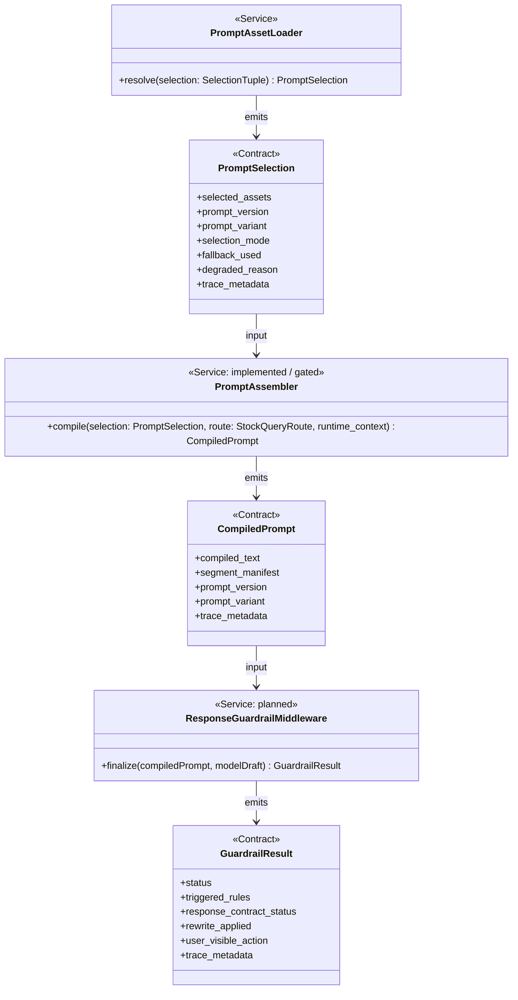

| Component | Primary interface | Must not own |
|-----------|-------------------|--------------|
| `PromptAssetLoader` | Current: `resolve(SelectionTuple) -> PromptSelection` | Route classification, prompt concatenation, tool execution, or model invocation |
| `PromptAssembler` | Implemented/gated: `compile(PromptSelection, StockQueryRoute, runtime_context) -> CompiledPrompt` | Asset approval, route reclassification, tool-authorization policy, or response disposition |
| `ResponseGuardrailMiddleware` | Planned: `finalize(compiledPrompt, modelDraft) -> GuardrailResult` | Prompt assembly, retrieval, tool execution, or request-level policy selection |

##### 3.5.2.2 PromptAssetLoader Realization Contract

- The implemented selection tuple is explicit: `agent_role`, `route`, `locale`, `selection_mode`, `requested_version`, `prompt_experiment_id`, `workspace_mode`, and `env`. M1 actively uses `agent_role`, `requested_version`, and `selection_mode`; the remaining fields are expansion-ready defaults.
- The implemented manifest scan reads `system`, `skills`, `skills/routes`, and `experiments` directories, silently skipping missing directories and skipping invalid prompt assets with WARN-level logging.
- Current asset admissibility comes from frontmatter parsing, route-scope validation for route assets, active baseline selection, and `prompts.*` structural validation. Review-state gates and richer rollout admission remain target-state policy.
- Failure remains fail-closed: missing role assets, missing requested versions, malformed frontmatter, or exhausted baseline lineage fall back to an approved baseline when available or raise an unresolvable prompt error rather than passing unknown assets downstream.

##### 3.5.2.3 PromptAssembler Realization Contract

- `PromptAssembler` admits only `PromptSelection`, a `StockQueryRoute`, and optional runtime context containing approved dynamic controls, bounded memory summary, evidence, task framing, and output contract text.
- Current M2 assembly is deterministic in this order: shared policy metadata for the role prompt, role prompt content, route-specific skill, bounded memory context, evidence and tool-derived facts, task framing, and output contract.
- At M2 scope, shared policy is embedded in `system/react_analyst.md`; standalone shared policy files and always-active skills are target evolution.
- If route skills are missing or dynamic fields are rejected, the assembler continues with approved inputs only, records `missing_route_skills` or `dropped_dynamic_fields` in trace metadata, and never synthesizes substitute instructions.

##### 3.5.2.4 ResponseGuardrailMiddleware Realization Contract

- The middleware executes after model generation and before any response is committed to a non-streaming or streaming surface.
- The ordered check sequence remains: output-contract completeness, evidence attribution, uncertainty and disclosure, anti-hype controls, instruction-data separation, and tool-risk or approval consistency.
- `GuardrailResult.status` remains one of `pass`, `warn`, `block`, or `degraded`; the middleware is the final boundary check and must not act as a second orchestrator.

##### 3.5.2.5 Request-Scoped Call Flow

The following sequence shows the gated route-aware path once `PromptAssembler` is injected and enabled. The default API runtime currently stops at loader-resolved prompt content; guardrail middleware remains planned.

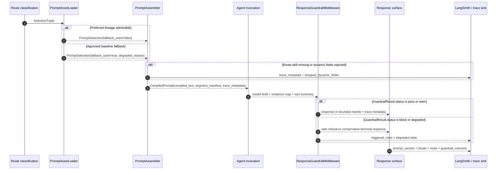

##### 3.5.2.6 Data Flow and Request-Scoped Inputs

The following data-flow view separates control components from the request-scoped payloads they consume and emit. `PromptAssetLoader` is current; assembler inputs are implemented and gated; guardrail outputs are planned.

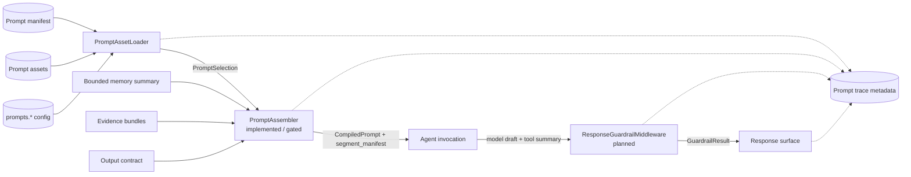

#### 3.5.3 Prompt Asset Model and Composition Rules

The implemented asset taxonomy stays shallow for current prompt assets: `system/react_analyst.md` for the role prompt and `skills/routes/*.md` for M2 route skills. `experiments`, standalone shared policy files, and always-active skills remain target-state extensions. The following composition view shows the implemented M2 layering rule.

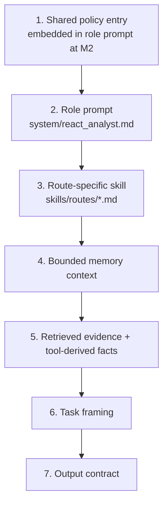

- Higher-authority policy wins from top to bottom in this stack.
- Baseline fallback remains a lineage rule carried by metadata and loader policy.
- Standalone shared policy and always-active skills are target evolution, not current M2 runtime facts.
- The output contract may shape structure, but it must not override earlier policy or evidence constraints.

#### 3.5.4 Static and Dynamic Segment Realization

`PromptAssembler` classifies every emitted segment before provider invocation when route-aware assembly is enabled. This keeps authority treatment deterministic even while runtime activation remains gated.

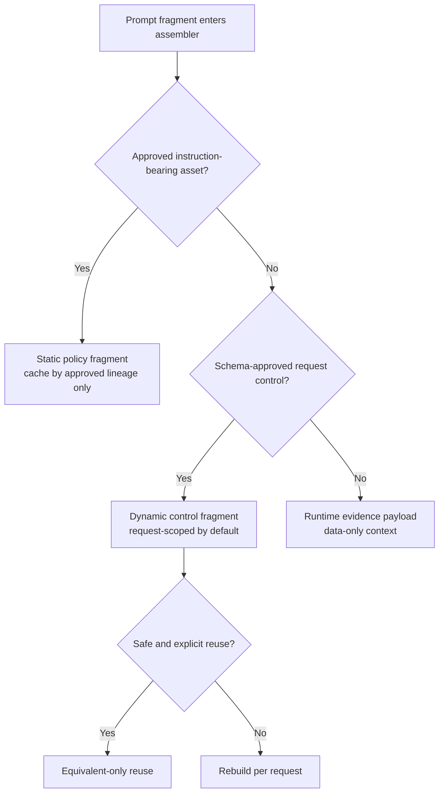

- Static policy fragments are keyed by approved prompt lineage only.
- Dynamic controls are admitted only from schema-approved request fields and are request-scoped unless explicit equivalence is safe.
- Runtime evidence remains data-only context and must never be promoted into instruction-bearing policy.
- If fragment classification is ambiguous, the safer implementation default is request-scoped data rather than static policy.

#### 3.5.5 Locale Parity and Variant Realization

The following logical model shows how approved lineages, locale variants, selections, compiled prompts, and guardrail outcomes relate in the planned runtime.

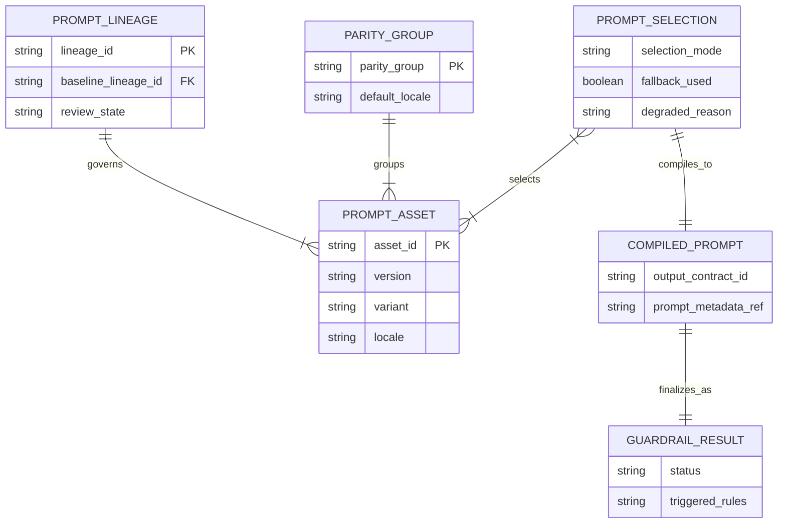

- Locale resolution should use `asset_id`, `locale`, and `parity_group` together rather than treating locale files as isolated prompt families.
- Non-default locale variants remain `forced`-only until parity evaluation and locale-competent review are complete.
- Missing, malformed, or parity-blocked variants fall back to the configured default locale with explicit degradation metadata.

#### 3.5.6 Near-Term Skills Pattern and Future Expansion

The near-term specialization path remains the Skills pattern: one agent, one shared policy layer embedded in the role prompt at M2, and route-aware prompt context selected from the existing route taxonomy. Route-skill assets exist for the canonical routes, while default runtime activation still requires `PromptAssembler` injection and `prompts.route_contexts.enabled=true`. Multi-agent routing and retrieval-specialist prompt families remain later evolutions only when contracts materially diverge.

| Route | Canonical route skill |
|-------|-----------------------|
| `PRICE_CHECK` | `skills/routes/price_check.md` |
| `NEWS_ANALYSIS` | `skills/routes/news_analysis.md` |
| `PORTFOLIO` | `skills/routes/portfolio.md` |
| `TECHNICAL_ANALYSIS` | `skills/routes/technical_analysis.md` |
| `FUNDAMENTALS` | `skills/routes/fundamentals.md` |
| `IDEAS` | `skills/routes/ideas.md` |
| `MARKET_WATCH` | `skills/routes/market_watch.md` |
| `GENERAL_CHAT` | `skills/routes/general_chat.md` |

Each route skill inherits the role prompt's shared policy posture so specialization narrows behavior without redefining common investment-safety or output-contract obligations. Always-on skills are a target extension and should not be described as current M2 runtime behavior until implemented.

#### 3.5.7 Prompt Observability and Fault Tolerance

Prompt behavior should remain observable runtime metadata rather than hidden implicit state. The current and target metadata families are:

- current M1 response metadata: `prompt_version`, `prompt_variant`, `prompt_selection_mode`, `fallback_used`, `degraded_reason` when applicable, `model_provider`, and `model_name`;
- implemented/gated M2 metadata: `route`, `route_skill_used`, `selected_skills`, `missing_route_skills`, and `dropped_dynamic_fields` when `CompiledPrompt` is active;
- target prompt-governance metadata: `prompt_locale`, `parity_group`, effective tool-risk class, and final `guardrail_outcome`.

The following target flow shows how preferred selection, locale fallback, route-skill degradation, and final guardrail outcomes converge on traceable response states. Current M1/M2 verification covers baseline fallback, prompt identity, route-skill degradation, and dropped dynamic fields; locale parity and guardrail outcome enforcement remain planned.

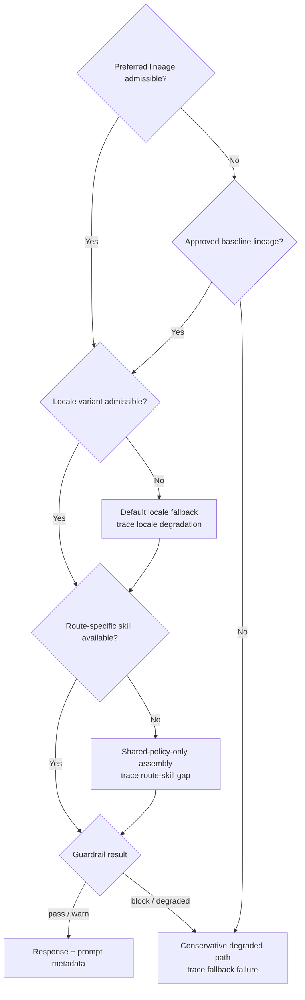

When any planned prompt-governance surface changes, this section should be synchronized with [SRS_SPEC_TRACEABILITY.md §Reverse Trace](./SRS_SPEC_TRACEABILITY.md#reverse-trace) and the post-delivery synchronization duties in [spec-kit HOW-TO.md §3.3.5 Synchronization and Maintenance](../../spec-driven%20development%20%28SDD%29/spec-kit%20HOW-TO.md#335-synchronization-and-maintenance).

#### 3.5.7.1 Streaming Guardrail and Terminal Behavior

> **Status:** Planned streaming realization only. This subsection defines the target streaming boundary and does not claim full current-runtime parity across all response surfaces.

Streaming reuses the same guardrail rule set and `GuardrailResult` vocabulary as the non-streaming path. The streaming specialization is temporal rather than policy-specific: emission windows, blocker timing, cancellation semantics, and terminal framing.

- Partial output may be emitted only after local admission checks pass for the current emission window.
- Later blocker detection stops further emission immediately and forces a safe terminal action rather than an implied completed answer.
- Cancellation must be recorded as cancelled rather than completed.
- A success-complete marker must never be emitted before final guardrail commitment.

The following state flow shows how buffering, checkpoint evaluation, cancellation, and terminal behavior should work on streaming surfaces.

```mermaid
stateDiagram-v2
	[*] --> Generating
	Generating --> Buffered : draft tokens available
	Buffered --> Checkpoint : emission window closes
	Checkpoint --> Emitting : local admission passes
	Checkpoint --> SafeTerminal : block or degraded terminal path
	Emitting --> Buffered : more draft content
	Emitting --> FinalCheck : model completes
	Generating --> Cancelled : client cancellation
	Buffered --> Cancelled : client cancellation
	FinalCheck --> Completed : pass or warn with bounded rewrite
	FinalCheck --> SafeTerminal : block or degraded final check
	Cancelled --> [*]
	Completed --> [*]
	SafeTerminal --> [*]
```

#### 3.5.8 Prompt-System Config Surface

> **Status:** M1 config surface is current; M2 route context config is present but disabled by default; guardrail, streaming, locale-promotion, and experiment controls remain target state.

The following namespace map shows how the current and target prompt control plane is grouped and which components each namespace governs.

```mermaid
flowchart LR
	subgraph Registry["prompts.registry"]
		Dir["directory"]
		Man["manifest"]
		Refresh["refresh_window_seconds"]
	end
	subgraph SystemCfg["prompts.system + prompts.selection_mode"]
		Version["active_role + active_version"]
		Mode["selection_mode"]
		Variants["variants"]
	end
	subgraph RouteCfg["prompts.route_contexts"]
		RouteEnabled["enabled=false by default"]
		RouteDir["directory"]
		Supported["supported_routes"]
	end
	subgraph Controls["prompts.dynamic_controls"]
		Allow["allowed_fields"]
		Reject["reject_unknown_fields"]
	end
	subgraph GuardCfg["prompts.guardrails + prompts.streaming"]
		GuardKeys["blocking + rewrite policy"]
		StreamKeys["checkpoint + terminal behavior"]
	end
	subgraph Policy["prompts.locale + prompts.trace + prompts.cache"]
		Locale["default_locale + fallback_behavior"]
		Rollout["fixed | forced | shadow | weighted"]
		TraceFields["required_fields"]
		Cache["static segment cache"]
	end

	Registry --> Loader["PromptAssetLoader\ncurrent"]
	SystemCfg --> Loader
	RouteCfg --> Assembler["PromptAssembler\nimplemented / gated"]
	Controls --> Assembler
	GuardCfg --> Guard["ResponseGuardrailMiddleware"]
	Policy --> Loader
	Policy --> Assembler
	Policy --> Guard
```

| Namespace family | Key responsibilities | Fail-closed note |
|------------------|----------------------|------------------|
| `prompts.registry` | Current directory and refresh-window control for prompt asset discovery | Manifest or lineage errors must not widen selection authority |
| `prompts.system` and `prompts.selection_mode` | Current active role, active version, variants, and selection mode | Invalid structure blocks startup; missing content falls back through loader policy |
| `prompts.route_contexts` and `prompts.dynamic_controls` | M2 route-aware assembly gate, route-skill directory, supported routes, and allowed request controls | `route_contexts.enabled=false` preserves M1 behavior; unknown dynamic fields are dropped and traced when assembler is active |
| `prompts.guardrails` and `prompts.streaming` | Planned blocking policy, bounded rewrite policy, checkpoint timing, cancellation handling, terminal behavior | Streaming completion requires final guardrail commitment |
| `prompts.locale`, `prompts.trace`, `prompts.cache`, and experiments | Target locale fallback, mandatory trace fields, static-segment reuse, and controlled variants | Missing mandatory trace fields block promotion to wider rollout |

Supported selection modes remain `fixed`, `forced`, `shadow`, and `weighted`, aligned directly with the roadmap and SRS vocabulary.

#### 3.5.9 Component-Level Verification Matrix

This section records the component-level verification surface for the current, gated, and planned prompt compiler path. It does not prescribe the concrete test harness or repository-specific automation. Detailed verification execution remains governed by [SOFTWARE_REQUIREMENTS_SPECIFICATION.md §AC-8: Prompt System](./SOFTWARE_REQUIREMENTS_SPECIFICATION.md#ac-8-prompt-system), [SOFTWARE_REQUIREMENTS_SPECIFICATION.md §NFR-5: Observability](./SOFTWARE_REQUIREMENTS_SPECIFICATION.md#nfr-5-observability), and [VERIFICATION_AND_TRACEABILITY_STRATEGY.md](../../testing/VERIFICATION_AND_TRACEABILITY_STRATEGY.md).

| Component or slice | Status | Verified / required scenario | Expected outcome | Required emitted metadata or evidence | Evidence / authority |
|--------------------|--------|------------------------------|------------------|---------------------------------------|----------------------|
| `PromptAssetLoader` | Current state - M1 implemented | Preferred version is missing or malformed | Baseline lineage is selected when available; exhausted baseline raises an unresolvable prompt error | `prompt_version`, `prompt_variant`, `selection_mode`, `fallback_used`, `degraded_reason` when applicable | `specs/prompt-system-milestone1/review.md`, `tests/test_prompt_asset_loader.py`, SRS FR-1.4.8 |
| `prompts.*` structural validation | Current state - M1 implemented | Invalid config structure or unsupported selection mode appears at startup | Startup fails with actionable configuration error rather than silently widening prompt authority | Config validation exception and startup log | `validate_prompts_config()`, `tests/test_prompt_config.py` |
| Response metadata | Current state - M1 implemented | REST chat response is returned with or without LangSmith availability | Response metadata includes prompt identity and model identity; LangSmith failure does not remove response metadata | `prompt_version`, `prompt_variant`, `prompt_selection_mode`, `fallback_used`, `model_provider`, `model_name` | `src/web/routes/ai_chat_routes.py`, `tests/test_prompt_metadata.py` |
| `PromptAssembler` | Implemented / gated - M2 | Route skill exists for the classified route | `CompiledPrompt` includes role prompt, route-skill content, segment manifest, and route metadata | `compiled_text`, `segment_manifest`, `route`, `route_skill_used`, `selected_skills` | `specs/prompt-system-milestone2/review.md`, `tests/test_prompt_assembler.py` |
| `PromptAssembler` | Implemented / gated - M2 | Route-specific skill is missing or all route skills are absent | Assembly continues from approved inputs only and records route-skill degradation | `missing_route_skills`, `route_skill_used=false`, `segment_manifest` | `tests/test_prompt_assembler.py`, SRS FR-1.4.7 and FR-1.4.11 |
| `PromptAssembler` dynamic controls | Implemented / gated - M2 | Runtime context includes unknown dynamic control fields | Unknown fields are dropped, recorded, and not elevated into policy segments | `dropped_dynamic_fields`, `segment_manifest` | `tests/test_prompt_assembler.py`, SRS FR-1.4.16 |
| Default API runtime wiring | Current state limitation | API server constructs `StockAssistantAgent` | `PromptAssetLoader` is injected; `PromptAssembler` is not constructed by default; `route_contexts.enabled=false` preserves M1 behavior | Source-code wiring inspection | `src/web/api_server.py`, `config/config.yaml` |
| `ResponseGuardrailMiddleware` | Planned | Output contract is incomplete or required disclosures are missing | Final response is blocked or conservatively rewritten before completed-answer state is recorded | `status`, `triggered_rules`, `response_contract_status`, `user_visible_action` | SRS FR-1.5.6 and AC-8; implementation pending |
| Cross-component streaming guardrail path | Planned | A blocker is detected after partial buffering has begun | Further chunks stop and a safe terminal frame or equivalent action is emitted | `guardrail_outcome`, `triggered_rules`, `stream_terminal_reason`, `prompt_version`, `fallback_used` | Architecture guardrail boundary view; implementation pending |

Interpret this matrix as the minimum design-level verification contract:

1. Current-state rows must remain backed by source code or verified M1/M2 review evidence.
2. Implemented/gated rows are component-ready but not default-runtime behavior until API construction and `route_contexts.enabled` are updated.
3. Planned rows must not be described as implemented until source and verification evidence exists.
4. Missing mandatory prompt identity, fallback, route-skill, locale, or guardrail metadata is a verification failure for the slice where that metadata is in scope.
5. Release-gate evidence should be collected in the repository verification and traceability workflow rather than duplicated as a test procedure in this document.

### 3.6 Fine-Tuning Realization

> **Status:** Planned realization only; fine-tuning is not yet implemented in the current runtime.

ADR-001 constrains fine-tuning to reasoning structure and tone, not knowledge storage. The technical realization of that constraint should keep fine-tuning datasets narrow, human-verified, and explicitly separated from dynamic market facts.

| In Scope for Fine-Tuning | Out of Scope for Fine-Tuning |
|--------------------------|------------------------------|
| Earnings summary structure | Valuation logic as source of truth |
| Risk-framing patterns | Price targets and forecasts |
| Scenario-table formatting | Macro outlook as durable knowledge |
| Consistent disclosure tone | Invented numbers or unsupported claims |

Implementation-oriented safeguards:

- Training examples should contain human-verified outputs only.
- Numerical claims should remain runtime-injected from tools or retrieval, not baked into training data as durable facts.
- Evaluation should check formatting consistency, uncertainty disclosure, and unsupported-claim rates before any rollout.

### 3.7 Example Reasoning Flow

The following walkthrough preserves the layered contract in a concrete engineering form without making the ADR carry the worked example. It represents the target layered flow while keeping current-runtime caveats explicit: service-owned session context and STM are available today, while future LTM enrichment remains optional follow-up work rather than an active runtime dependency.

```mermaid
flowchart TD
	Q["User: \"Danh gia HSG trung han\""] --> SessionNode["Resolve service-owned session context\nrisk profile: moderate\ntime horizon: 6-18 months"]
	SessionNode --> STMNode["Load STM and conversation-scoped assumptions\ncurrent thread hypothesis: steel price bottoming"]
	STMNode --> RouteNode["Route classification\nroute: FUNDAMENTALS"]
	RouteNode --> Evidence["Retrieve evidence\ncompany financials + relevant steel-price context"]
	Evidence --> Assemble["Assemble prompt\nbase rules + skills + memory context + evidence + output contract"]
	Assemble --> Response["Generate response\nstructured reasoning with evidence-backed narrative"]
```

Future LTM, when introduced, should enrich the assembly step as optional cross-conversation personalization rather than replacing session context, STM, or evidence retrieval.

## 4. Engineering Constraints and Extension Paths

### 4.1 Tool and Reporting Enhancements

This section records target-state extension paths. It does not promote research proposals into current runtime behavior unless the implementation and verification evidence already exists.

Refs: [TOOLS_RESEARCH_AND_PROPOSAL.md](./TOOLS_RESEARCH_AND_PROPOSAL.md); [TOOLS_ARCHITECTURE_BENCHMARK_REVIEW.md](./TOOLS_ARCHITECTURE_BENCHMARK_REVIEW.md); [ADR-004](./DECISIONS/ADR-AGENT-004-THIN-TOOL-GATEWAY-AND-NORMALIZED-TOOL-CONTEXT.md); SRS FR-2 and AC-9; `src/core/tools`; `tests/test_tools.py`.

#### Phase 2B Tool-System Extension Path

| Area | Current State | Target Phase 2B Realization |
|------|---------------|-----------------------------|
| Tool abstraction | `CachingTool` is the implemented LangChain-compatible base class | `AgentTool` becomes the target architectural name for cache-aware, descriptor-backed tool execution |
| Tool exposure | ReAct receives all currently enabled registry tools | `ToolSurfaceBuilder` exposes only route-eligible, enabled, policy-admitted tools before model invocation |
| Execution policy | Registry enablement and tool schema are the main execution controls | Thin in-process `ToolGateway` performs admission, trace, degraded-state, and post-execution validation around registry-backed execution |
| Provider selection | Current `StockSymbolTool` can call `DataManager` for Yahoo-backed live data | `ProviderSelectionPolicy` chooses provider order, fallback, freshness, licensing, and degraded-state behavior below model-visible tools |
| Output handling | Tool outputs are raw dict-like payloads returned to the agent loop | Tool results are normalized into output kinds and assembled into request-scoped `ToolContextPack` inputs |
| Data retention | Cache and repositories hold implementation-specific data | Retained reports, artifacts, snapshots, mutation receipts, and traces preserve source lineage; `ToolContextPack` is not persisted wholesale |

#### `StockSymbolTool` Target Direction

The current `StockSymbolTool` uses `DataManager` for Yahoo-backed live data and falls back to `SymbolRepository` for stored metadata. That remains the current implementation fact.

The target Phase 2B direction is different: `StockSymbolTool` becomes the in-system symbol data tool. It should focus on lookup, search, normalization, canonical symbol identity, exchange/currency metadata, aliases, identifiers, coverage, tags, and stored symbol snapshots through an internal symbol-store boundary. Live quote, history, and fundamental retrieval move to separate market-data tools and provider adapters.

```mermaid
flowchart LR
	User["Symbol prompt\nFPT / HOSE:FPT / HNX:SHS"]
	Tool["StockSymbolTool\ntarget in-system symbol tool"]
	Adapter["InternalSymbolStoreAdapter\ntarget"]
	Repo["SymbolRepository / symbols collection\ncurrent persistence boundary"]
	Market["Market-data tools\ntarget quote / history / fundamentals"]

	User --> Tool --> Adapter --> Repo
	Tool -. "does not own target live market data" .-> Market
```

Target rules:

1. Yahoo/YahooFinance/DataManager is not the target adapter path for the evolved `StockSymbolTool`.
2. Yahoo and Alpha Vantage may remain international fallback or cross-market comparison providers for external market-data tools when admitted by provider policy.
3. Symbol-store write actions remain disabled until classified as `workflow_mutation` with `internal_state_mutation`, authorization/confirmation policy, and `MutationReceipt` output.

#### TradingView Target Direction

`TradingViewTool` is currently a placeholder that raises `NotImplementedError`. In Phase 2B it should generate chart URLs, widget payloads, deep links, ticker-tape payloads, symbol-overview payloads, and heatmap/screener payloads where supported.

TradingView output is `VisualizationProvenance`, not canonical market evidence. Numeric market facts in final answers must come from approved evidence or computation tools unless a future policy explicitly admits a TradingView data category as evidence.

#### Reporting Target Direction

`ReportingTool` is currently a scaffold that returns placeholder markdown. In Phase 2B it should compose reports from `ToolContextPack`, `VisualizationProvenance`, `GeneratedArtifact`, warnings, degraded states, and source-attributed facts/snippets/documents.

Report generation should preserve source lineage for retained report metadata or exported artifacts. It should not scrape providers directly or use unsourced generated analysis as market truth.

Persistent report outputs should use MongoDB metadata plus filesystem artifact content as the initial storage model. The configured export root defaults to `reports`, while target retained artifacts use metadata records such as `tool_artifacts` to preserve URI/path, checksum, retention class, source lineage, and degraded-state visibility. The raw `ToolContextPack` is not persisted wholesale.

### 4.2 Routing, Output, and Prompt Evolution

#### Single-Runtime Tool Specialization

**Current**: one LangChain/LangGraph ReAct agent handles all query routes.

**Near-term target**: keep the single runtime and specialize behavior through route classification, prompt skills, route-filtered tool exposure, gateway admission, and normalized tool context.

```mermaid
flowchart TD
	Route["stock_query_router\nstatic route taxonomy"]
	Prompt["PromptAssembler\nimplemented / gated route skills"]
	Surface["ToolSurfaceBuilder\ntarget route-filtered tools"]
	ReAct["Single ReAct runtime"]
	Context["ToolContextPack\ntarget normalized context"]

	Route --> Prompt
	Route --> Surface
	Prompt --> ReAct
	Surface --> ReAct
	ReAct --> Context
```

Multi-agent orchestration remains future exploration only. It should not be introduced for Phase 2B unless tool, prompt, memory, and data boundaries diverge enough to justify a second runtime.

#### Structured Output Mode

```python
from langchain_core.output_parsers import JsonOutputParser

class StockPriceResponse(BaseModel):
		symbol: str
		current_price: float
		change_percent: float
		volume: int
		analysis: str

parser = JsonOutputParser(pydantic_object=StockPriceResponse)
```

#### Semantic Router Enhancements

| Area | Current State | Proposed Improvement |
|------|---------------|---------------------|
| Routes | 8 static categories | Preserve static taxonomy first; add evaluated Vietnam/mixed-language route fixtures before considering dynamic route discovery |
| Utterances | Hardcoded examples | ML-generated training data |
| Multi-language | English only | Vietnamese + English utterances |
| Confidence Calibration | Fixed 0.7 threshold | Per-route adaptive thresholds |
| Route Chaining | Single route per query | Multi-intent detection |

### 4.3 Performance, Observability, and Testing

Refs: SRS NFR-1, NFR-2, NFR-5, NFR-6; `tests/integration`; `tests/api`; `tests/security`; `tests/performance`; `tests/test_agent_regression.py`; `tests/test_langsmith_integration.py`.

#### Performance Optimizations

| Area | Current | Proposed |
|------|---------|----------|
| Caching | Per-tool Redis cache | Tiered cache (memory + Redis) |
| Async | Sync-to-async wrapper | Native async tool execution |
| Batching | Single symbol queries | Batch symbol lookup |
| Streaming | Event-based chunks | Token-level streaming |

#### Observability Improvements

| Area | Current | Proposed |
|------|---------|----------|
| Logging | Basic Python logging | Structured JSON logs |
| Metrics | None | Prometheus metrics endpoint |
| Tracing | None | OpenTelemetry integration |
| Dashboards | None | Grafana monitoring |

#### Testing Improvements

| Area | Current | Proposed |
|------|---------|----------|
| Unit Tests | Basic coverage | Mock all external APIs |
| Integration | Limited | Full agent → tool → data flow |
| E2E | None | Playwright/Selenium for UI |
| Performance | None | Locust load testing |

#### Mirror — Unified Degraded-Operation Diagram

This realization-oriented mirror corresponds to [ARCHITECTURE_DESIGN.md](./ARCHITECTURE_DESIGN.md) section 4.7.3.7.

```mermaid
flowchart TD
	Start["Inbound request"] --> Prompt{"Prompt asset load succeeds?"}
	Prompt -- "No" --> Baseline["Baseline prompt fallback"]
	Prompt -- "Yes" --> Checkpoint{"Checkpoint available?"}
	Checkpoint -- "No" --> Stateless["Stateless invocation path"]
	Checkpoint -- "Yes" --> Cache{"Cache available?"}
	Cache -- "No" --> Uncached["Uncached tool execution path"]
	Cache -- "Yes" --> Normal["Cached execution path"]
	Baseline --> Provider{"Primary provider succeeds?"}
	Stateless --> Provider
	Uncached --> Provider
	Normal --> Provider
	Provider -- "Yes" --> Success["Served response"]
	Provider -- "No" --> Fallback{"Fallback provider succeeds?"}
	Fallback -- "Yes" --> Degraded["Served degraded response"]
	Fallback -- "No" --> ControlledError["Controlled terminal error"]
```

Refs: [ARCHITECTURE_DESIGN.md section 4.7.3](./ARCHITECTURE_DESIGN.md#473-quality-attribute-scenarios); `src/core/prompt_asset_loader.py`; `src/core/langgraph_bootstrap.py`; `src/core/tools/base.py`; `src/core/model_factory.py`; `tests/test_agent_fallback.py`; `tests/test_prompt_asset_loader.py`; `tests/test_checkpointer.py`.

### 4.4 Delivery Sequencing for Layered Runtime

The ADR decisions are realized in phases so memory, retrieval, prompt policy, and behavior shaping do not drift out of order.

| Phase | Realization Focus | Current State |
|------|--------------------|---------------|
| 1 | Conversation-scoped STM and checkpoint lifecycle | Implemented |
| 2 | Prompt externalization and composable skills | M1 implemented; M2 implemented / gated |
| 2B | Tool gateway, provider adapters, normalized tool context, and Vietnam-first data coverage | Target / planned; clarified in SRS v2.8, Phase 2B roadmap, ADR-004, and traceability docs; no implementation spec yet |
| 3 | Intent-specific retrieval and evidence wiring | Planned / partial by tool path |
| 4 | Fine-tuning for structure and tone | Planned |
| 5 | Guardrail observability, streaming guardrails, and experiment controls | Planned |

Refs: [PHASE_2_AGENT_ENHANCEMENT_ROADMAP.md](./PHASE_2_AGENT_ENHANCEMENT_ROADMAP.md); [PROMPT_SYSTEM_RESEARCH_PROPOSAL.md](./PROMPT_SYSTEM_RESEARCH_PROPOSAL.md); [TOOLS_RESEARCH_AND_PROPOSAL.md](./TOOLS_RESEARCH_AND_PROPOSAL.md); [spec-sync-status.md](../../../specs/spec-sync-status.md).

## 5. Supporting Patterns, Stacks, and Relationships

### 5.1 Design Patterns Used

| Pattern | Component | Purpose |
|---------|-----------|---------|
| **Factory** | `ModelClientFactory` | Create provider-specific clients |
| **Factory** | `create_checkpointer()` | Create MongoDBSaver or None based on config |
| **Singleton** | `ToolRegistry` | Centralized tool management |
| **Template Method** | `CachingTool._execute()` | Define tool execution skeleton |
| **Strategy** | `BaseModelClient` subclasses | Interchangeable model providers |
| **Adapter** | `langchain_adapter.py` | Bridge external prompts to LangChain |
| **Decorator** | `CachingTool._cached_run()` | Add caching to tool execution |
| **Registry** | `ToolRegistry` | Dynamic component registration |
| **Immutable Config** | `MemoryConfig` | Frozen dataclass with fail-fast validation |
| **Repository** | `ConversationRepository` | Data access for conversations collection |
| **Asset Loader** | `PromptAssetLoader` | Discover, validate, cache, and fall back for versioned prompt files (M1 implemented) |
| **Composer** | `PromptAssembler` | Compose route skills plus the role prompt by route classification (M2 implemented / gated in default runtime) |
| **Middleware** | `ResponseGuardrailMiddleware` | Post-process agent output for behavioral compliance (planned) |
| **Facade / Gateway** | `ToolGateway` | Target in-process policy boundary around registry-backed tool execution |
| **Builder** | `ToolSurfaceBuilder` | Target pre-model route-filtered tool surface construction |
| **Policy** | `ProviderSelectionPolicy` | Target provider ordering, fallback, licensing, freshness, and degraded-state mapping below tools |
| **Adapter** | `ProviderAdapter` family | Target provider-specific integration boundary hidden from model-visible tools |
| **Normalizer** | Evidence/output normalizer | Target conversion from adapter/tool output to normalized output kinds |
| **Context Object** | `ToolContextPack` | Target request-scoped normalized tool context passed toward prompt assembly |
| **Descriptor** | Tool and provider descriptors | Target model-visible capability metadata and internal policy metadata |

### 5.2 Software Stack

#### Core Dependencies

| Library | Version | Purpose |
|---------|---------|---------|
| `langchain` | >=1.0.0 | Agent framework, tool definitions |
| `langchain_core` | >=0.3.28 | Base types (messages, prompts) |
| `langchain_openai` | >=0.3.5 | OpenAI ChatModel integration |
| `langgraph` | >=0.2.62 | LangGraph core for agent workflows |
| `langgraph-checkpoint` | >=2.0.9 | Checkpoint base interfaces |
| `langgraph-checkpoint-mongodb` | >=2.0.5 | MongoDB checkpointer for STM (FR-3.1) |
| `semantic-router` | >=0.1.0 | Query classification with embeddings |
| `pydantic` | 2.x | Data validation for tools |
| `openai` | 1.x | Direct API access for OpenAI |

#### Data Layer

| Library | Purpose |
|---------|---------|
| `yfinance` | Current Yahoo Finance data fetching through `DataManager`; target role is international fallback for market-data tools when admitted |
| `pymongo` | MongoDB driver for domain records, report metadata, checkpoint metadata, and target tool artifact/mutation/trace metadata |
| `redis` | Cache backend via `CacheBackend`; target market-data cache entries carry source timestamp, freshness, warnings, and degraded-state metadata |
| Python filesystem APIs (`pathlib`, `os`) | Initial artifact-content backend under `export.output_directory`, defaulting to `reports` |

Target Phase 2B provider categories are design-level dependencies, not installed package claims. They include in-system symbol/snapshot stores, Vietnam-native providers, official exchange/depository sources, licensed commercial providers, allowlisted public-web sources, TradingView visualization, and international fallback providers.

Target tool-system storage roles are:

| Storage Surface | Role |
|-----------------|------|
| MongoDB | Durable metadata and domain records: `symbols`, `market_data`, `market_snapshots`, `reports`, `investment_reports`, conversations, checkpoints, and future tool metadata collections |
| Redis / in-memory cache | Short-lived tool and provider acceleration with freshness-aware cache metadata |
| Local filesystem | Initial storage for report exports, chart snapshots, extracted documents, generated tables, and other retained artifact content |

#### Infrastructure

| Library | Purpose |
|---------|---------|
| `flask` | Web API framework |
| `flask_socketio` | Real-time streaming |
| `gunicorn` + `eventlet` | WSGI server with WebSocket |

### 5.3 Class Hierarchy

```text
BaseModelClient (ABC)
+-- OpenAIModelClient
+-- GrokModelClient

Current tool hierarchy:

CachingTool (BaseTool)
+-- StockSymbolTool
+-- ReportingTool
+-- TradingViewTool (placeholder)

Target Phase 2B tool boundary:

AgentTool (target architectural name; may wrap or rename CachingTool)
+-- StockSymbolTool (target internal symbol-store tool)
+-- MarketDataTool family (target quote / history / fundamentals)
+-- TradingViewTool (target VisualizationProvenance producer)
+-- ReportingTool (target ToolContextPack report composer)
+-- GenericWebFetchTool (target deny-by-default evidence fallback)

AgentResponse (frozen dataclass)
+-- .success() classmethod
+-- .error() classmethod
+-- .fallback() classmethod
```

### 5.4 Key File Relationships

The following relationship list remains implementation-facing. Source files are the current-state anchors, while specs and tests provide delivery and verification evidence for those anchors.

Refs: `src/core`; `src/services`; `src/web`; `src/data`; `src/utils`; `specs/spec-sync-status.md`; `tests`.

```text
stock_assistant_agent.py
		imports: types.py (AgentResponse, ToolCall)
		imports: model_factory.py (ModelClientFactory)
		imports: langchain_adapter.py (build_prompt)
		imports: tools/registry.py (ToolRegistry)
		receives: checkpointer via constructor injection

langgraph_bootstrap.py
		imports: langgraph.checkpoint.mongodb (MongoDBSaver)
		imports: utils/memory_config.py (MemoryConfig)
		reads: config["database"]["mongodb"]["connection_string"]
		exports: create_checkpointer(), get_agent()

api_server.py
		imports: langgraph_bootstrap.py (create_checkpointer)
		wires: checkpointer → StockAssistantAgent constructor

conversation_repository.py
		extends: mongodb_repository.py (MongoGenericRepository)
		manages: conversations collection

chat_service.py
		uses: ConversationService + SessionService via protocols
		implements: archive guard, optional conversation auto-create, metadata recording

conversation_service.py
		uses: ConversationRepository
		implements: management ownership checks, archive/detail/list flows, metadata helpers

utils/memory_config.py
		defines: MemoryConfig (frozen dataclass, 9 parameters)
		defines: ContentValidator (FR-3.1.7/FR-3.1.8 compliance scanning)

stock_query_router.py
		imports: routes.py (ROUTE_UTTERANCES, RouteResult, StockQueryRoute)
		imports: semantic_router (Route, SemanticRouter)
		imports: semantic_router.encoders (OpenAIEncoder, HuggingFaceEncoder)
```

```mermaid
flowchart TD
	Specs["Spec evidence\nprompt M1/M2 + STM features"]
	Tests["Verification suites\nunit + integration + api + security + performance"]
	Transport["src/web\nroutes + sockets + API server"]
	Services["src/services\nchat + conversation lifecycle"]
	Agent["src/core\nagent + router + prompts + tools + models"]
	Data["src/data + src/utils\nrepositories + schemas + cache + config"]
	Design["TECHNICAL_DESIGN.md\nrealization map"]

	Specs --> Design
	Tests --> Design
	Transport --> Services --> Agent
	Services --> Data
	Agent --> Data
	Transport --> Design
	Services --> Design
	Agent --> Design
	Data --> Design
	Tests --> Transport
	Tests --> Services
	Tests --> Agent
	Tests --> Data
```

Refs: [spec-sync-status.md](../../../specs/spec-sync-status.md); `specs/prompt-system-milestone1`; `specs/prompt-system-milestone2`; `specs/agent-session-with-stm-wiring`; `specs/stm-phase-cde`; `tests/test_agent.py`; `tests/test_chat_service.py`; `tests/test_conversation_service.py`; `tests/integration/test_stm_runtime_wiring.py`; `tests/api/test_chat_routes_memory.py`; `tests/security/test_operator_tooling_boundaries.py`; `tests/performance/test_management_api_latency.py`.

#### 5.4.1 Mirror — Dependency and Ownership Diagram

This realization-oriented mirror corresponds to [ARCHITECTURE_DESIGN.md](./ARCHITECTURE_DESIGN.md) section 4.2.3a.

```mermaid
flowchart TD
	Entry["Transport Entry\nAPI + Socket.IO"]
	Services["Service Ownership\nChatService + ConversationService"]
	Agent["Reasoning Runtime\nStockAssistantAgent"]
	Prompt["Prompt Policy Boundary\nLoader + Assembler + Guardrail"]
	Exec["Execution Boundary\nRouter + ModelFactory + Tools"]
	State["Persistence + Cache\nConversations + Checkpoints + Redis"]
	External["External Providers\nLLM + Market Data"]

	Entry --> Services --> Agent
	Agent --> Prompt
	Agent --> Exec
	Services --> State
	Agent --> State
	Exec --> External
```

## 6. Configuration and Reference Material

### 6.1 Configuration Reference

```yaml
model:
	provider: openai
	name: gpt-5-nano
	allow_fallback: true
	fallback_order:
		- openai
		- grok
	debug_prompt: false

openai:
	api_key: ${OPENAI_API_KEY}
	model: gpt-5-nano
	temperature: 0.7

grok:
	api_key: ${GROK_API_KEY}
	base_url: https://api.x.ai/v1
	model: grok-4-1-fast-reasoning

semantic_router:
	encoder:
		primary: openai
		fallback: huggingface
		openai_model: "text-embedding-3-small"
		huggingface_model: "sentence-transformers/all-MiniLM-L6-v2"
	threshold: 0.7
	cache_embeddings: true

langchain:
	tools:
		enabled: true
		cache_ttl:
			stock_symbol: 60
			reporting: 600
			tradingview: 300
			default: 120
	memory:
		enabled: true
		summarize_threshold: 4000
		max_messages: 50
		messages_to_keep: 10
		max_content_size: 32768
		summary_max_length: 500
		context_load_timeout_ms: 500
		state_save_timeout_ms: 50
		checkpoint_collection: "agent_checkpoints"
		conversations_collection: "conversations"
```

### 6.2 Type Definitions Quick Reference

```python
SUCCESS = "success"
FALLBACK = "fallback"
ERROR = "error"
PARTIAL = "partial"

AgentResponse.success(content, provider, model, **kwargs)
AgentResponse.error(message, provider, model)
AgentResponse.fallback(content, provider, model, **kwargs)
```

## 7. Revision History

| Version | Date | Author | Notes |
|---------|------|--------|-------|
| 0.0 | 2026-04-03 | GitHub Copilot | Skeleton created |
| 0.1 | 2026-04-16 | GitHub Copilot | Scaffolded from implementation-focused content formerly concentrated in `ARCHITECTURE_DESIGN.md` |
| 0.2 | 2026-04-16 | GitHub Copilot | Route taxonomy aligned to canonical `StockQueryRoute` enum from `src/core/routes.py` |
| 0.3 | 2026-05-06 | GitHub Copilot | Migrated realization-only material out of ADR-001: retrieval realization boundaries, prompt assembly order, fine-tuning realization, example reasoning flow, and layered runtime delivery sequencing |
| 0.4 | 2026-05-12 | GitHub Copilot | Aligned prompt taxonomy references to ADR-canonical paths (`src/prompts/system|skills|experiments`) and removed hybrid path language |
| 0.5 | 2026-05-19 | GitHub Copilot | Synchronized prompt-asset realization language with the simplified proposal layout by describing the ADR taxonomy as a shallow metadata-driven `system` / `skills` / `experiments` structure and replacing separate baseline-asset wording with metadata-governed fallback lineage |
| 0.6 | 2026-05-21 | GitHub Copilot | Added runtime tool-risk realization, static-versus-dynamic prompt segment handling, locale-parity selection rules, and observability metadata for locale and tool-risk governed prompt paths |
| 0.7 | 2026-05-27 | GitHub Copilot | Reframed section 3.5 as a realization-level traceability hub with explicit companion-document ownership, subsection-specific prompt-governance references, and synchronization guidance for reverse trace and Spec Kit workflow updates |
| 0.8 | 2026-05-27 | GitHub Copilot | Deepened section 3.5.2 with explicit planned component contracts, canonical route-to-skill mapping, and request-scoped prompt lifecycle and guardrail behavior |
| 0.9 | 2026-05-27 | GitHub Copilot | Added planned streaming guardrail behavior, localized `prompts.*` control-plane design, and a component-level verification matrix to section 3.5 |
| 0.10 | 2026-05-27 | GitHub Copilot | Simplified section 3.5 into diagram-first technical-design views for the prompt realization stack, component interfaces, call flow, data flow, logical model, degradation behavior, and config surface |
| 0.11 | 2026-06-24 | Codex | Synchronized prompt-system technical design with verified M1/M2 implementation evidence; separated current, gated, target, and planned prompt-system behavior |
| 0.12 | 2026-06-25 | Codex | Added authority and evidence cross-reference map, realization diagrams, compact `Refs:` blocks, and source/spec/test relationship tracing |
| 0.13 | 2026-06-25 | Codex | Aligned tool-system technical design with Phase 2B roadmap, SRS FR-2.4-FR-2.11, ADR-004, and current source-state boundaries |
| 0.14 | 2026-06-25 | Codex | Refined Phase 2B tool-system realization with split pre-model/execution flow, target contract ownership, and degraded-state failure mapping |
| 0.15 | 2026-06-25 | Codex | Added tool-system persistent data model and storage design covering MongoDB metadata, filesystem artifacts, target schema contracts, and source-lineage rules |
| 0.16 | 2026-06-25 | Codex | Added tool-system persistence decision, storage-stack, and collection/schema diagrams for Phase 2B data-model realization |
