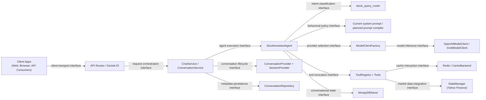
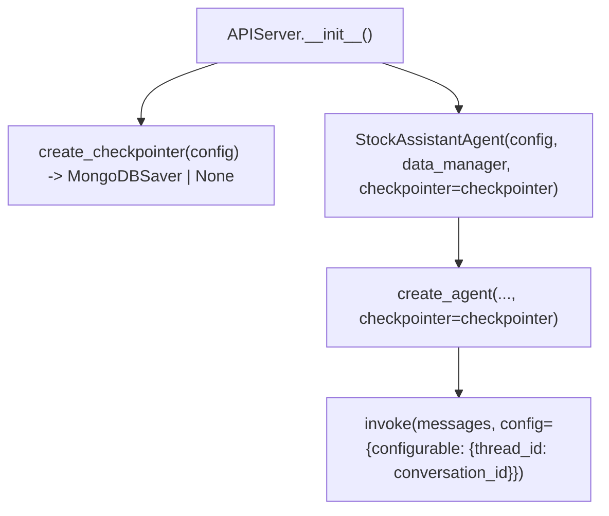
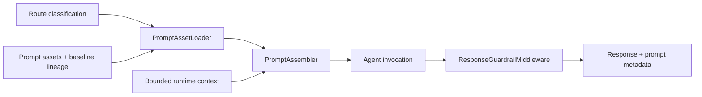
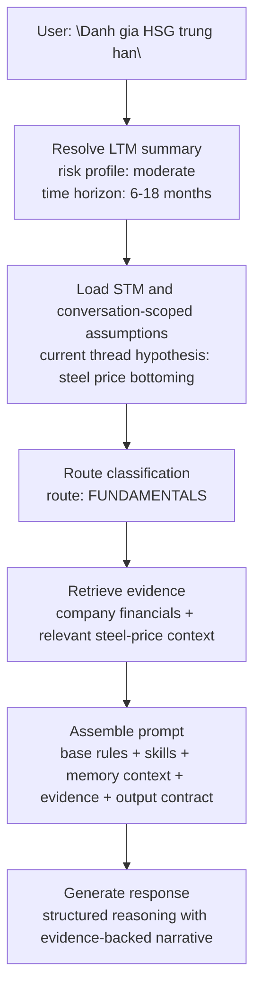
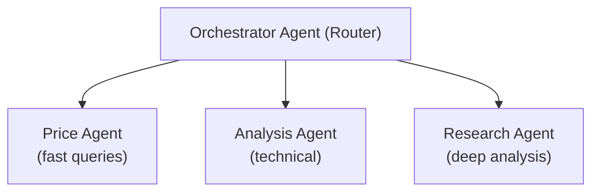
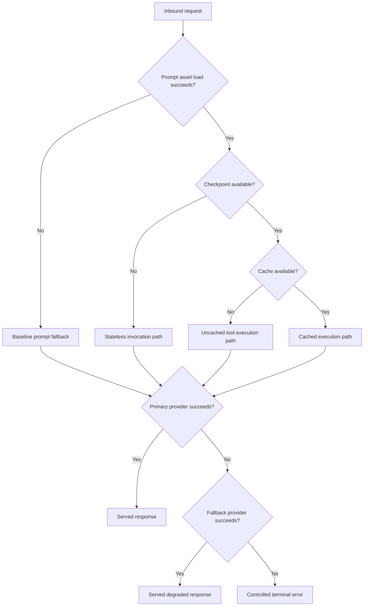
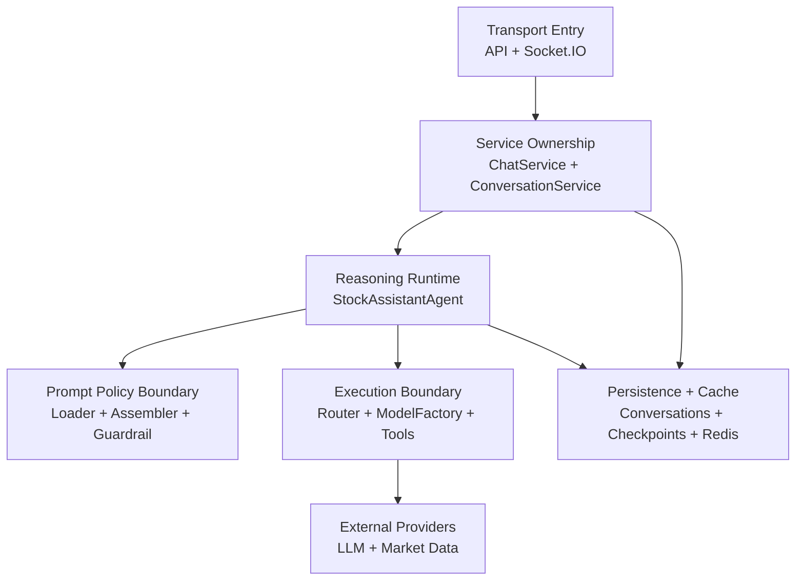

# Agent Domain — Technical Design

> **Status**: Scaffolded from current agent architecture material and ready for iterative refinement.
> **Standards Stance**: Aligned design practice
> **Technology Stack**: LangGraph 0.2.62+, LangChain, OpenAI SDK, semantic-router, MongoDB, Redis
> **Companion Documents**: [ARCHITECTURE_DESIGN.md](./ARCHITECTURE_DESIGN.md), [AGENT_MEMORY_TECHNICAL_DESIGN.md](./AGENT_MEMORY_TECHNICAL_DESIGN.md), [PROMPT_SYSTEM_RESEARCH_PROPOSAL.md](./PROMPT_SYSTEM_RESEARCH_PROPOSAL.md), [ADR-AGENT-001-LAYERED-LLM-ARCHITECTURE.md](./decisions/ADR-AGENT-001-LAYERED-LLM-ARCHITECTURE.md), [ADR-AGENT-002-SKILLS-PATTERN-PROMPT-COMPOSITION.md](./decisions/ADR-AGENT-002-SKILLS-PATTERN-PROMPT-COMPOSITION.md), [ADR-AGENT-003-EXTERNALIZE-VERSION-PROMPT-ASSETS.md](./decisions/ADR-AGENT-003-EXTERNALIZE-VERSION-PROMPT-ASSETS.md)

## Document Control

| Field | Value |
|-------|-------|
| Project | DP Stock Investment Assistant |
| Domain | Agent |
| Focus | Technical realization of the LangChain ReAct agent domain, including orchestration, memory, prompt composition, and fallback behavior |
| Date | 2026-05-06 |
| Status | Active working scaffold |
| Audience | Engineering, architecture, agent maintainers, and reviewers |

## Purpose

Explains how the agent domain realizes allocated requirements and architecture decisions. This document preserves implementation-oriented material extracted from the current architecture description so that the architecture document can focus on viewpoint-governed views while this document holds realization detail.

The corresponding architecture views for context and boundary, logical structure, process flow, information and state, development, deployment, operations and maintenance, and prompt behavior are defined in [ARCHITECTURE_DESIGN.md](./ARCHITECTURE_DESIGN.md). This document complements those views by describing how the codebase realizes them, rather than restating the architecture-level framing.

## 1. Domain Scope and Boundaries

### 1.1 Scope

This document covers the technical realization of:

- ReAct agent orchestration
- Tool registration and execution
- Model selection and provider fallback
- Conversation-scoped STM and checkpointing
- Prompt composition and prompt asset evolution
- Runtime interaction flows, configuration, and extension points

### 1.2 Out of Scope

This document does not replace:

- The ADR set for architectural decisions and trade-offs
- SRS documents for requirement authority
- Operations/runbook documents for deployment procedures
- Testing strategy documents for cross-repository verification policy

## 2. Realization Overview

The StockAssistantAgent is a LangChain-based ReAct agent designed for stock investment assistance. It orchestrates AI model providers and specialized tools to answer user queries about stock prices, technical analysis, and investment research.

### 2.1 Key Characteristics

| Aspect | Description |
|--------|-------------|
| Architecture | ReAct pattern with tool orchestration |
| AI Framework | LangChain >=1.0.0 with `langchain_core` and `langchain_openai` |
| Model Providers | OpenAI (GPT-5-nano), Grok (grok-4-1-fast-reasoning) with automatic fallback |
| Tool System | Registry-based with caching support |
| Memory | LangGraph `MongoDBSaver` checkpointer for conversation-scoped STM, with sessions as reusable parent business context |
| Semantic Router | `semantic-router` library with OpenAI/HuggingFace encoders |
| Response Types | Structured (`AgentResponse`) with immutable dataclasses |

### 2.2 Source Layout

```text
src/core/
├── stock_assistant_agent.py    # Main ReAct agent with conversation-aware STM routing
├── langgraph_bootstrap.py      # LangGraph agent builder + MongoDBSaver checkpointer factory
├── stock_query_router.py       # Semantic router for query classification
├── routes.py                   # Route definitions and utterances
├── types.py                    # Core types: AgentResponse, ToolCall, TokenUsage
├── langchain_adapter.py        # Prompt building with external file support
├── model_factory.py            # Factory pattern for model clients
├── base_model_client.py        # Abstract base for providers
├── openai_model_client.py      # OpenAI implementation
├── grok_model_client.py        # Grok (xAI) implementation
├── data_manager.py             # Yahoo Finance data fetching
└── tools/
    ├── base.py                 # CachingTool base class
    ├── registry.py             # ToolRegistry singleton
    ├── stock_symbol.py         # Stock lookup tool
    ├── tradingview.py          # TradingView placeholder (Phase 2)
    └── reporting.py            # Report generation tool

src/utils/
└── memory_config.py            # MemoryConfig frozen dataclass with fail-fast validation

src/data/repositories/
└── conversation_repository.py  # ConversationRepository (conversations collection)

src/services/
├── chat_service.py             # Chat orchestration, archive guard, metadata sync (REST path)
└── conversation_service.py     # ConversationService (lifecycle, management APIs, metadata helpers)

src/prompts/
├── analysis_prompt.j2
├── generic_query.j2
├── system_stock_assistant-vn.txt
└── system_stock_assistant.txt
```

### 2.3 Prompt Asset Mapping (Current vs Planned)

| View | Prompt Asset Model | Status |
|------|--------------------|--------|
| Current runtime layout | Template/text assets under `src/prompts/` | Implemented |
| ADR taxonomy target (canonical) | `src/prompts/system/`, `src/prompts/skills/`, `src/prompts/experiments/` | Proposed |

The technical design treats ADR taxonomy as canonical for prompt assets. Planning-artifact path aliases are non-authoritative and must map back to ADR taxonomy paths.

## 3. Core Realization

### 3.1 Agent Runtime and Orchestration

#### StockAssistantAgent

**Location**: `src/core/stock_assistant_agent.py`

**Responsibilities**:

1. Initialize ReAct agent with enabled tools and optional checkpointer
2. Process queries via LangGraph or legacy path
3. Support streaming with `astream_events()`
4. Handle provider fallback orchestration
5. Expose model configuration APIs
6. Manage conversation-aware STM routing via `conversation_id`; parent session context is handled outside the agent in service and management layers

**Key Methods**:

| Method | Description |
|--------|-------------|
| `process_query(query, *, conversation_id)` | Synchronous query processing with optional conversation-scoped memory |
| `process_query_streaming(query, *, conversation_id)` | Generator-based streaming with optional conversation-scoped memory |
| `process_query_structured(query, *, conversation_id)` | Returns `AgentResponse` with metadata |
| `set_default_model(provider, name)` | Update active model |
| `run_interactive()` | CLI REPL mode |

**Constructor behavior**:

The constructor accepts an optional `checkpointer` parameter injected by `APIServer`. When a checkpointer is present and `conversation_id` is provided, the agent includes `{"configurable": {"thread_id": conversation_id}}` in the invoke config so LangGraph automatically loads and saves conversation state.

**Hierarchy behavior**:

- LangGraph checkpoints store thread-specific reasoning state without leaking STM across sibling conversations.
- Conversation lifecycle metadata, archive status, and per-turn counters remain outside the checkpoint store in service and repository surfaces.
- The REST chat path uses `ChatService` to reject archived conversations and record per-turn metadata non-blocking.
- The Socket.IO path validates `conversation_id` and preserves it through to the agent, but currently bypasses `ChatService` lifecycle and metadata helpers.
- Workspace/session/conversation ownership and lifecycle validation live in the management APIs and services, not inside `StockAssistantAgent` itself.
- Session-context resolution helpers exist in `ChatService` and `ConversationService`; merged context is resolved at query time in service helpers, but prompt-level injection of that merged context is still follow-up work.

#### 3.1.1 Mirror — Component Interface Diagram

This realization-oriented mirror corresponds to the architecture-level interface diagrams in [ARCHITECTURE_DESIGN.md](./ARCHITECTURE_DESIGN.md) section 4.1.1a and section 4.2.2a. It deliberately reuses the same canonical interface vocabulary, then ties each architectural interface to the concrete routes, protocols, factories, registries, and state adapters that realize it in the current codebase.



The current realization of those canonical interfaces is:

| Canonical Interface Name | Realization Path in Current Code | Primary Anchors |
|--------------------------|----------------------------------|-----------------|
| Client transport interface | User traffic enters through HTTP and Socket.IO entry points, with request-body validation and conversation identifier normalization at the transport edge | `src/web/routes/ai_chat_routes.py`, `src/web/sockets/chat_events.py` |
| Request orchestration interface | The REST transport edge dispatches into `ChatService` for non-streaming and SSE paths, preserving transport-mode handling outside the agent runtime; the Socket.IO path currently implements a thinner passthrough and does not yet have full orchestration parity | `create_chat_blueprint()`, `ChatService.process_chat_query()`, `ChatService.stream_chat_response()`, `register_chat_events()` |
| Agent execution interface | `ChatService` depends on the `AgentProvider` protocol and delegates query execution and model-info lookup through that contract | `src/services/protocols.py`, `ChatService`, `StockAssistantAgent.process_query*()` |
| Conversation lifecycle interface | Service-layer logic checks archive status, ensures conversation existence, resolves parent session context, and records message metadata outside the agent runtime; this boundary is fully realized on the REST path and remains a known parity gap on Socket.IO | `ConversationProvider`, `SessionProvider`, `_validate_conversation_active()`, `_ensure_conversation_exists()`, `_record_message_metadata()`, `_load_conversation_context()` |
| Metadata persistence interface | Conversation-management metadata is persisted through service and repository paths rather than through the LangGraph checkpoint store | `ConversationService`, `ConversationRepository`, service-factory wiring |
| Intent classification interface | The runtime consults `stock_query_router` as the query classification boundary, keeping intent selection separate from provider binding and tool execution | `src/core/stock_query_router.py`, runtime routing flow |
| Behavioral policy interface | The active runtime passes a built-in system prompt into agent construction; the explicit `PromptAssetLoader -> PromptAssembler -> ResponseGuardrailMiddleware` boundary remains planned | `StockAssistantAgent.REACT_SYSTEM_PROMPT`, `create_agent(... system_prompt=...)`, planned prompt components in section 3.5 |
| Provider selection interface | The runtime uses `ModelClientFactory` to resolve provider/model clients and fallback ordering without embedding provider construction logic into route or service code | `ModelClientFactory.get_client()`, `ModelClientFactory.get_fallback_sequence()`, `StockAssistantAgent._select_client()` |
| Tool invocation interface | The runtime materializes enabled tools from `ToolRegistry`, then passes that governed tool surface into the LangGraph ReAct agent | `get_tool_registry()`, `ToolRegistry.get_enabled_tools()`, `StockAssistantAgent._initialize_tools()`, `_build_agent_executor()` |
| Conversational state interface | `APIServer` injects the LangGraph checkpointer, and the runtime binds `conversation_id` into `configurable.thread_id` during invoke so checkpoints stay conversation-scoped | `create_checkpointer()`, `APIServer.__init__()`, `process_query_structured()`, `_process_with_react()` / streaming invoke path |
| Cache interaction interface | Cache-aware tools delegate lookup and write-through behavior to `CacheBackend` and Redis without making cache state part of the agent-facing reasoning contract | `CachingTool`, `CacheBackend`, `StockSymbolTool`, `ReportingTool` |
| Market data integration interface | Tool implementations invoke `DataManager` as the outbound data-access boundary to Yahoo Finance, keeping all market data retrieval behind the tooling surface | `src/core/data_manager.py`, `DataManager`, `StockSymbolTool` |
| Model inference interface | Provider-specific client classes encapsulate the outbound call contract to OpenAI or Grok once the factory has selected the provider/model binding | `OpenAIModelClient`, `GrokModelClient`, `BaseModelClient` |

Current transport note: the REST path fully realizes the request-orchestration and conversation-lifecycle interfaces through `ChatService`, while the Socket.IO path currently realizes client transport plus direct agent invocation with UUID validation only.

This split keeps the architecture package disciplined. The architecture description names the architectural boundaries and their ownership, while this technical view records the concrete adapters, protocol contracts, and call sites that currently realize those interfaces.

### 3.2 Tool Registry and Tool Execution

#### CachingTool Base Class

**Location**: `src/core/tools/base.py`

**Responsibilities**:

1. Extend LangChain's `BaseTool` with caching
2. Generate deterministic cache keys
3. Track execution metrics
4. Provide health check interface

**Key Features**:

```python
class CachingTool(BaseTool):
    cache_ttl_seconds: int = 60
    enable_cache: bool = True

    def _run(self, **kwargs) -> Any:
        result, was_cached = self._cached_run(**kwargs)
        return result

    def _cached_run(self, **kwargs) -> tuple[Any, bool]:
        cache_key = self._generate_cache_key(**kwargs)
        if cached := self._cache.get_json(cache_key):
            return cached, True
        result = self._execute(**kwargs)
        self._cache.set_json(cache_key, result, ttl_seconds=self.cache_ttl_seconds)
        return result, False
```

#### StockSymbolTool

**Location**: `src/core/tools/stock_symbol.py`

**Actions**:

- `get_info`: Retrieve stock price and metadata
- `search`: Search symbols by name pattern

**Data Sources**:

1. **DataManager** (Yahoo Finance) - Live price data
2. **SymbolRepository** (MongoDB) - Symbol metadata fallback

**Caching Strategy**:

- TTL: 60 seconds (default)
- Cache key: `tool:stock_symbol:<md5_hash>`

#### ToolRegistry

**Location**: `src/core/tools/registry.py`

| Method | Description |
|--------|-------------|
| `register(tool, enabled=True)` | Add tool to registry |
| `unregister(name)` | Remove tool |
| `get(name)` | Get tool by name |
| `get_enabled_tools()` | List enabled tools |
| `set_enabled(name, bool)` | Toggle tool state |
| `health_check()` | Aggregate tool health |

### 3.3 Memory Architecture and Lifecycle

#### Short-Term Memory (STM) via LangGraph Checkpointer

**Decision in force**: Use LangGraph's `MongoDBSaver` checkpointer for conversation-scoped STM persistence, with `conversation_id -> thread_id` as the canonical memory mapping and sessions retained as parent workflow context.

**Status**: Implemented in the current runtime. Conversation-scoped checkpoints, management APIs, reconciliation tooling, and legacy-thread migration tooling are live on this branch.

**Key Design Choices**:

| Aspect | Decision |
|--------|----------|
| Checkpointer | LangGraph `MongoDBSaver` — native integration with agent execution |
| Thread ID Mapping | Direct 1:1: `conversation_id` → `thread_id` |
| Hierarchy Model | `workspace -> session -> conversation`, where the session owns reusable business context and the conversation owns STM |
| Dual Collections | `agent_checkpoints` (LangGraph-owned runtime state) + `conversations` (app-managed lifecycle metadata) |
| Backward Compatibility | `conversation_id` is optional — omitting preserves stateless single-turn behavior |
| Memory Scope | Stores conversation text only; never stores prices, ratios, or tool outputs |
| Current lifecycle behavior | `active` and `archived` are current-state service controls; `summarized` remains schema-supported but not universally active runtime flow |
| Transport parity | REST uses `ChatService` lifecycle and metadata helpers; Socket.IO currently bypasses them |
| Session-context timing | Resolved at query time in service helpers via conversation-to-session lookup; not yet injected into the prompt path |
| Configuration | `MemoryConfig` frozen dataclass with 9 configurable parameters and fail-fast validation |

**Architecture Note**:

The canonical runtime contract is now `conversation_id` across agent methods, REST chat, management APIs, repositories, reconciliation, and migration tooling. The REST `POST /api/chat` route still accepts a deprecated `session_id` alias and normalizes it into `conversation_id` before validation; the Socket.IO handler accepts `conversation_id` only.

#### 3.3.1 STM Store Boundaries and Authority

The current runtime keeps checkpoint state and business metadata in separate stores on purpose.

| Concern | Authoritative Surface | Supporting Surface | Current Behavior |
|---------|-----------------------|--------------------|------------------|
| Recoverable conversation execution state | `agent_checkpoints` via LangGraph `MongoDBSaver` | `conversation_id -> thread_id` mapping from app surfaces | The runtime binds `conversation_id` into `configurable.thread_id` and lets LangGraph load and save thread state |
| Archive status, ownership, and per-turn metadata | `conversations` plus service-layer helpers | Checkpoints may indirectly reflect message history only | Archive guards and metadata recording live outside the checkpoint store |
| Reusable parent business context | Session service plus conversation-linked `session_id` | Conversation `context_overrides` | `ChatService._load_conversation_context()` resolves merged context at query time |
| Stateless fallback | No STM store required | None | Requests without `conversation_id` preserve the single-turn path |

This split means the stores may diverge temporarily without collapsing into one source of truth. A metadata record may exist even when checkpoint persistence is unavailable, and a checkpoint may exist before metadata has been ensured. In those cases the service layer remains authoritative for ownership and lifecycle, while checkpoints remain authoritative only for recoverable thread-local reasoning state.

#### 3.3.2 Current Runtime Caveats

- The REST route is the only chat path that currently realizes archive guards, `ensure_conversation_exists()`, metadata sync, and session-context lookup through `ChatService`.
- The Socket.IO handler validates `conversation_id` and passes it to `agent.process_query(...)`, but it does not yet call the lifecycle and metadata helpers used by REST.
- `MemoryConfig` exposes `summarize_threshold`, `max_messages`, and related limits, but the chat execution path does not yet trigger automatic summarization when those thresholds are exceeded.
- The REST route still accepts deprecated `session_id` only as an alias normalized into `conversation_id` before validation.

**Wiring Flow**:



**Detailed Design**: [AGENT_MEMORY_TECHNICAL_DESIGN.md](./AGENT_MEMORY_TECHNICAL_DESIGN.md)

### 3.4 Model Selection, Routing, and Fallback

#### ModelClientFactory

**Decision**: Use `ModelClientFactory` with caching for model client instantiation.

```python
class ModelClientFactory:
		_CACHE: Dict[str, BaseModelClient] = {}
```

**Rationale**:

- Single responsibility: Factory handles creation logic, clients handle generation
- Lazy instantiation: Clients created on-demand, not at startup
- Cache efficiency: Prevents redundant API client initialization
- Provider agnostic: Uniform interface regardless of OpenAI, Grok, or future providers

#### Semantic Router for Query Classification

**Decision**: Use `semantic-router` with OpenAI embeddings and HuggingFace fallback for intent classification.

**Route Categories**:

| Route | Description | Example Queries |
|-------|-------------|-----------------|
| `PRICE_CHECK` | Current prices, quotes, market cap | "What is AAPL trading at?" |
| `NEWS_ANALYSIS` | Headlines, earnings, market events | "Latest news on Tesla" |
| `PORTFOLIO` | Holdings, P&L, allocation | "Show my portfolio value" |
| `TECHNICAL_ANALYSIS` | Charts, MACD, RSI, patterns | "Show RSI for NVDA" |
| `FUNDAMENTALS` | P/E, P/B, DCF, financial ratios | "What's Apple's P/E ratio?" |
| `IDEAS` | Stock picks, investment strategies | "Recommend growth stocks" |
| `MARKET_WATCH` | Index updates, sector performance | "How is VN-Index doing?" |
| `GENERAL_CHAT` | Fallback for unmatched queries | "Hello, how are you?" |

**Configuration**:

```yaml
semantic_router:
	encoder:
		primary: openai
		fallback: huggingface
		openai_model: "text-embedding-3-small"
		huggingface_model: "sentence-transformers/all-MiniLM-L6-v2"
	threshold: 0.7
	cache_embeddings: true
```

#### Retrieval-Augmented Generation Realization

> **Status:** Planned architecture with partial evidence support today via tool paths; intent-specific retrieval indices are not yet fully implemented in the active runtime.

The layered architecture treats retrieval as a distinct evidence path rather than as an extension of memory. In realization terms, this means route classification determines which evidence sources are eligible for a request and keeps retrieved source material separate from LTM, STM, and prompt-policy assets.

| Intent Family | Retrieval Focus | Expected Freshness Profile |
|---------------|-----------------|----------------------------|
| `FUNDAMENTALS` | Filings, financial statements, and valuation-supporting evidence | Medium-lived; refreshed around reporting cycles |
| `NEWS_ANALYSIS` | Press releases, headlines, and event-driven evidence | Short-lived; refreshed frequently |
| `MARKET_WATCH` | Macro, sector, and index context | Medium-lived; refreshed on market cadence |
| `TECHNICAL_ANALYSIS` | Indicator-supporting data and chart-derived context | Near-real-time or recent-window bias |

This design preserves two technical invariants from ADR-001: retrieved evidence is sourced and attributable, and any interpretation produced from that evidence remains in the model output rather than being written back into memory as domain truth.

#### Immutable Response Types

**Decision**: Use frozen dataclasses for all response types.

```python
@dataclass(frozen=True)
class AgentResponse:
		content: str
		provider: str
		model: str
		status: ResponseStatus = ResponseStatus.SUCCESS
		tool_calls: tuple[ToolCall, ...] = field(default_factory=tuple)
		token_usage: TokenUsage = field(default_factory=TokenUsage)
```

#### Dual Execution Mode (ReAct + Legacy Fallback)

**Decision**: Maintain legacy processing path as fallback.

```python
def process_query(
		self,
		query: str,
		*,
		provider: Optional[str] = None,
		conversation_id: Optional[str] = None,
) -> str:
		try:
				if self._agent_executor:
						return self._process_with_react(
								query,
								provider=provider,
								conversation_id=conversation_id,
						)
				return self._process_legacy(query, provider=provider)
		except Exception as e:
				self.logger.error(f"Error generating response: {e}")
				return f"Sorry, I encountered an error: {e}"
```

### 3.5 Prompt Realization and Guardrails

> **Status:** Planned realization path.
> **Decision coupling:** This section reflects the prompt-system direction proposed in the companion research document and the prompt-related ADRs.

The prompt system should evolve from a single governed runtime prompt into a structured realization path that externalizes prompt assets, composes route-aware behavior deterministically, and keeps response-policy enforcement visible. This section focuses on the intended realization model and extension path rather than on a full code-level walkthrough.

#### 3.5.1 Current Baseline and Transition Direction

The current baseline is a single runtime prompt contract supported by prompt assets under `src/prompts/`. The planned prompt system does not replace that baseline with an unrelated design; it formalizes it into explicit technical boundaries for asset resolution, prompt assembly, and guardrail enforcement.

For the purposes of technical design, the important transition is:

- from one centrally managed prompt contract to versioned prompt assets;
- from implicit behavior shaping to explicit composition rules;
- from broad prompt changes to bounded route-aware prompt context via the Skills pattern; and
- from opaque prompt behavior to attributable prompt metadata and guardrail outcomes.

#### 3.5.2 Planned Prompt Compiler Path

The planned prompt compiler path realizes the architectural prompt boundary as three cooperating components.

| Concept | Planned Realization | Technical Note |
|---------|---------------------|----------------|
| Prompt compiler | `PromptAssetLoader -> PromptAssembler -> ResponseGuardrailMiddleware` | The compiler concept is realized as an explicit path rather than a single opaque step |
| Loader facade naming in implementation discussions | `PromptRegistry` (or equivalent) | When used, this name should be treated as a loader-facing facade rather than a separate design concept |
| Prompt asset taxonomy | ADR-governed system, skills, experiments, and baseline assets | Technical layout should remain consistent with the architecture-package taxonomy |



| Component | Responsibility | Planned Outcome |
|-----------|----------------|-----------------|
| **PromptAssetLoader** | Resolve the correct prompt asset set for a request, including stable fallback behavior | Prompt identity remains attributable even when selection degrades |
| **PromptAssembler** | Compose shared policy, role-specific guidance, route-aware context, and bounded runtime context into one prompt contract | Prompt behavior stays deterministic and reviewable |
| **ResponseGuardrailMiddleware** | Enforce anti-hype, attribution, uncertainty, and related response-policy checks after model generation | Behavioral controls remain explicit and traceable |

#### 3.5.3 Prompt Asset Model and Composition Rules

| Asset Type | Technical Purpose | Planned Lifecycle |
|------------|-------------------|-------------------|
| Shared policy assets | Carry investment-safety rules, response contract, and common tool-use guidance | Versioned and stable; inherited across roles |
| Role contracts | Define the behavioral contract for the primary analyst role and future specialist roles | Versioned; activated by selected runtime path |
| Skills assets | Add route-specific context without replacing the shared policy layer | Composable; activated by route-aware selection |
| Experiment or variant assets | Support controlled evaluation and rollout of alternative prompt behaviors | Temporary and explicitly attributable |
| Baseline asset | Provides the last-known-stable prompt lineage when preferred assets are unavailable | Permanent fallback path |

The intended composition order remains deterministic:

1. Shared policy and investment-safety rules
2. Always-active behavioral skills
3. Route-specific prompt context
4. Bounded memory context, when available
5. Retrieved evidence and tool-derived facts
6. Task framing
7. Output contract

This order preserves ADR-001 separation of concerns. Behavioral policy is established before contextual evidence, and output shaping remains last so it cannot silently overwrite policy or factual grounding.

#### 3.5.4 Near-Term Skills Pattern and Future Expansion

The near-term realization path is the Skills pattern: one agent, one shared policy layer, and route-aware prompt context selected from the existing route taxonomy. This is the preferred technical bridge because it improves specialization without immediately introducing orchestrator overhead or user-visible multi-agent complexity.

| Direction | Technical Meaning | Scope |
|-----------|-------------------|-------|
| Near-term Skills pattern | Route classification selects additional prompt context for one agent invocation | Primary planned realization path |
| Future orchestrator contract | A narrow routing contract may later choose between prompt families or specialist paths | Later evolution only |
| Future retrieval specialist contract | Retrieval-grounded prompt contract may later narrow synthesis behavior around sourced evidence | Later evolution only |

#### 3.5.5 Prompt Observability and Fault Tolerance

The technical design should preserve prompt behavior as observable runtime metadata rather than hidden implicit state.

| Metadata Category | Technical Expectation |
|------------------|-----------------------|
| Prompt identity | Stable version or baseline lineage should be attributable in traces or response metadata |
| Route and role selection | Selected route-aware or role-aware contract should remain visible for diagnostics and evaluation |
| Active prompt components | Selected skills or variant lineage should be reviewable when behavior changes |
| Prompt fallback outcome | Degraded asset resolution should remain machine-detectable |
| Guardrail outcome | Response-policy checks should emit reviewable success, warning, or degradation outcomes |

| Failure Mode | Planned Response |
|--------------|------------------|
| Preferred prompt asset unavailable | Continue with baseline lineage rather than block the request |
| Route-specific skill unavailable | Continue with shared policy and stable analyst behavior |
| Experiment or variant unavailable | Fall back to the stable prompt line while preserving attribution |
| Guardrail evaluation degraded | Preserve a conservative response path and emit machine-detectable degradation metadata |

### 3.6 Fine-Tuning Realization

> **Status:** Planned realization only; fine-tuning is not yet implemented in the current runtime.

ADR-001 constrains fine-tuning to reasoning structure and tone, not knowledge storage. The technical realization of that constraint should keep fine-tuning datasets narrow, human-verified, and explicitly separated from dynamic market facts.

| In Scope for Fine-Tuning | Out of Scope for Fine-Tuning |
|--------------------------|------------------------------|
| Earnings summary structure | Valuation logic as source of truth |
| Risk-framing patterns | Price targets and forecasts |
| Scenario-table formatting | Macro outlook as durable knowledge |
| Consistent disclosure tone | Invented numbers or unsupported claims |

Implementation-oriented safeguards:

- Training examples should contain human-verified outputs only.
- Numerical claims should remain runtime-injected from tools or retrieval, not baked into training data as durable facts.
- Evaluation should check formatting consistency, uncertainty disclosure, and unsupported-claim rates before any rollout.

### 3.7 Example Reasoning Flow

The following walkthrough preserves the layered contract in a concrete engineering form without making the ADR carry the worked example. It represents the target layered flow once prompt externalization and richer retrieval wiring are fully in place.



## 4. Engineering Constraints and Extension Paths

### 4.1 Tool and Reporting Enhancements

#### StockSymbolTool Enhancements

| Area | Current State | Proposed Improvement |
|------|---------------|---------------------|
| Data Sources | Yahoo Finance only | Add Alpha Vantage, Polygon.io |
| Actions | `get_info`, `search` | Add `get_historical`, `get_fundamentals`, `compare` |
| Caching | Fixed 60s TTL | Per-action configurable TTL |
| Error Handling | Generic fallback | Retry with exponential backoff |

#### TradingView Integration

**Current**: Placeholder with `NotImplementedError`

```python
class TradingViewTool(CachingTool):
		"""Phase 2: Full TradingView integration"""
```

#### Reporting Enhancements

| Area | Current State | Proposed Improvement |
|------|---------------|---------------------|
| Templates | Hardcoded markdown | Jinja2 template system |
| Report Types | Basic 3 types | Add earnings, comparison, sector |
| Output Formats | Markdown only | Add HTML, PDF export |
| Data Integration | Placeholder content | Real data from analysis services |

### 4.2 Routing, Output, and Prompt Evolution

#### Multi-Agent Orchestration

**Current**: Single ReAct agent handles all queries

**Proposed**: Specialized agents with routing



#### Structured Output Mode

```python
from langchain_core.output_parsers import JsonOutputParser

class StockPriceResponse(BaseModel):
		symbol: str
		current_price: float
		change_percent: float
		volume: int
		analysis: str

parser = JsonOutputParser(pydantic_object=StockPriceResponse)
```

#### Semantic Router Enhancements

| Area | Current State | Proposed Improvement |
|------|---------------|---------------------|
| Routes | 8 static categories | Dynamic route discovery from tools |
| Utterances | Hardcoded examples | ML-generated training data |
| Multi-language | English only | Vietnamese + English utterances |
| Confidence Calibration | Fixed 0.7 threshold | Per-route adaptive thresholds |
| Route Chaining | Single route per query | Multi-intent detection |

### 4.3 Performance, Observability, and Testing

#### Performance Optimizations

| Area | Current | Proposed |
|------|---------|----------|
| Caching | Per-tool Redis cache | Tiered cache (memory + Redis) |
| Async | Sync-to-async wrapper | Native async tool execution |
| Batching | Single symbol queries | Batch symbol lookup |
| Streaming | Event-based chunks | Token-level streaming |

#### Observability Improvements

| Area | Current | Proposed |
|------|---------|----------|
| Logging | Basic Python logging | Structured JSON logs |
| Metrics | None | Prometheus metrics endpoint |
| Tracing | None | OpenTelemetry integration |
| Dashboards | None | Grafana monitoring |

#### Testing Improvements

| Area | Current | Proposed |
|------|---------|----------|
| Unit Tests | Basic coverage | Mock all external APIs |
| Integration | Limited | Full agent → tool → data flow |
| E2E | None | Playwright/Selenium for UI |
| Performance | None | Locust load testing |

#### Mirror — Unified Degraded-Operation Diagram

This realization-oriented mirror corresponds to [ARCHITECTURE_DESIGN.md](./ARCHITECTURE_DESIGN.md) section 4.7.3.7.



### 4.4 Delivery Sequencing for Layered Runtime

The ADR decisions are realized in phases so memory, retrieval, prompt policy, and behavior shaping do not drift out of order.

| Phase | Realization Focus | Current State |
|------|--------------------|---------------|
| 1 | Conversation-scoped STM and checkpoint lifecycle | Implemented |
| 2 | Prompt externalization and composable skills | Planned |
| 3 | Intent-specific retrieval and evidence wiring | Planned / partial by tool path |
| 4 | Fine-tuning for structure and tone | Planned |
| 5 | Guardrail observability and experiment controls | Planned |

## 5. Supporting Patterns, Stacks, and Relationships

### 5.1 Design Patterns Used

| Pattern | Component | Purpose |
|---------|-----------|---------|
| **Factory** | `ModelClientFactory` | Create provider-specific clients |
| **Factory** | `create_checkpointer()` | Create MongoDBSaver or None based on config |
| **Singleton** | `ToolRegistry` | Centralized tool management |
| **Template Method** | `CachingTool._execute()` | Define tool execution skeleton |
| **Strategy** | `BaseModelClient` subclasses | Interchangeable model providers |
| **Adapter** | `langchain_adapter.py` | Bridge external prompts to LangChain |
| **Decorator** | `CachingTool._cached_run()` | Add caching to tool execution |
| **Registry** | `ToolRegistry` | Dynamic component registration |
| **Immutable Config** | `MemoryConfig` | Frozen dataclass with fail-fast validation |
| **Repository** | `ConversationRepository` | Data access for conversations collection |
| **Asset Loader** | `PromptAssetLoader` | Discover, validate, and cache versioned prompt files (planned) |
| **Composer** | `PromptAssembler` | Compose skills + base prompt by route classification (planned) |
| **Middleware** | `ResponseGuardrailMiddleware` | Post-process agent output for behavioral compliance (planned) |

### 5.2 Software Stack

#### Core Dependencies

| Library | Version | Purpose |
|---------|---------|---------|
| `langchain` | >=1.0.0 | Agent framework, tool definitions |
| `langchain_core` | >=0.3.28 | Base types (messages, prompts) |
| `langchain_openai` | >=0.3.5 | OpenAI ChatModel integration |
| `langgraph` | >=0.2.62 | LangGraph core for agent workflows |
| `langgraph-checkpoint` | >=2.0.9 | Checkpoint base interfaces |
| `langgraph-checkpoint-mongodb` | >=2.0.5 | MongoDB checkpointer for STM (FR-3.1) |
| `semantic-router` | >=0.1.0 | Query classification with embeddings |
| `pydantic` | 2.x | Data validation for tools |
| `openai` | 1.x | Direct API access for OpenAI |

#### Data Layer

| Library | Purpose |
|---------|---------|
| `yfinance` | Yahoo Finance data fetching |
| `pymongo` | MongoDB driver for symbol metadata |
| `redis` | Cache backend (via `CacheBackend`) |

#### Infrastructure

| Library | Purpose |
|---------|---------|
| `flask` | Web API framework |
| `flask_socketio` | Real-time streaming |
| `gunicorn` + `eventlet` | WSGI server with WebSocket |

### 5.3 Class Hierarchy

```text
BaseModelClient (ABC)
├── OpenAIModelClient
└── GrokModelClient

CachingTool (BaseTool)
├── StockSymbolTool
├── ReportingTool
└── TradingViewTool (placeholder)

AgentResponse (frozen dataclass)
├── .success() classmethod
├── .error() classmethod
└── .fallback() classmethod
```

### 5.4 Key File Relationships

```text
stock_assistant_agent.py
		imports: types.py (AgentResponse, ToolCall)
		imports: model_factory.py (ModelClientFactory)
		imports: langchain_adapter.py (build_prompt)
		imports: tools/registry.py (ToolRegistry)
		receives: checkpointer via constructor injection

langgraph_bootstrap.py
		imports: langgraph.checkpoint.mongodb (MongoDBSaver)
		imports: utils/memory_config.py (MemoryConfig)
		reads: config["database"]["mongodb"]["connection_string"]
		exports: create_checkpointer(), get_agent()

api_server.py
		imports: langgraph_bootstrap.py (create_checkpointer)
		wires: checkpointer → StockAssistantAgent constructor

conversation_repository.py
		extends: mongodb_repository.py (MongoGenericRepository)
		manages: conversations collection

chat_service.py
		uses: ConversationService + SessionService via protocols
		implements: archive guard, optional conversation auto-create, metadata recording

conversation_service.py
		uses: ConversationRepository
		implements: management ownership checks, archive/detail/list flows, metadata helpers

utils/memory_config.py
		defines: MemoryConfig (frozen dataclass, 9 parameters)
		defines: ContentValidator (FR-3.1.7/FR-3.1.8 compliance scanning)

stock_query_router.py
		imports: routes.py (ROUTE_UTTERANCES, RouteResult, StockQueryRoute)
		imports: semantic_router (Route, SemanticRouter)
		imports: semantic_router.encoders (OpenAIEncoder, HuggingFaceEncoder)
```

#### 5.4.1 Mirror — Dependency and Ownership Diagram

This realization-oriented mirror corresponds to [ARCHITECTURE_DESIGN.md](./ARCHITECTURE_DESIGN.md) section 4.2.3a.



## 6. Configuration and Reference Material

### 6.1 Configuration Reference

```yaml
model:
	provider: openai
	name: gpt-5-nano
	allow_fallback: true
	fallback_order:
		- openai
		- grok
	debug_prompt: false

openai:
	api_key: ${OPENAI_API_KEY}
	model: gpt-5-nano
	temperature: 0.7

grok:
	api_key: ${GROK_API_KEY}
	base_url: https://api.x.ai/v1
	model: grok-4-1-fast-reasoning

semantic_router:
	encoder:
		primary: openai
		fallback: huggingface
		openai_model: "text-embedding-3-small"
		huggingface_model: "sentence-transformers/all-MiniLM-L6-v2"
	threshold: 0.7
	cache_embeddings: true

langchain:
	tools:
		enabled: true
		cache_ttl:
			stock_symbol: 60
			reporting: 600
			tradingview: 300
			default: 120
	memory:
		enabled: true
		summarize_threshold: 4000
		max_messages: 50
		messages_to_keep: 10
		max_content_size: 32768
		summary_max_length: 500
		context_load_timeout_ms: 500
		state_save_timeout_ms: 50
		checkpoint_collection: "agent_checkpoints"
		conversations_collection: "conversations"
```

### 6.2 Type Definitions Quick Reference

```python
SUCCESS = "success"
FALLBACK = "fallback"
ERROR = "error"
PARTIAL = "partial"

AgentResponse.success(content, provider, model, **kwargs)
AgentResponse.error(message, provider, model)
AgentResponse.fallback(content, provider, model, **kwargs)
```

## 7. Revision History

| Version | Date | Author | Notes |
|---------|------|--------|-------|
| 0.0 | 2026-04-03 | GitHub Copilot | Skeleton created |
| 0.1 | 2026-04-16 | GitHub Copilot | Scaffolded from implementation-focused content formerly concentrated in `ARCHITECTURE_DESIGN.md` |
| 0.2 | 2026-04-16 | GitHub Copilot | Route taxonomy aligned to canonical `StockQueryRoute` enum from `src/core/routes.py` |
| 0.3 | 2026-05-06 | GitHub Copilot | Migrated realization-only material out of ADR-001: retrieval realization boundaries, prompt assembly order, fine-tuning realization, example reasoning flow, and layered runtime delivery sequencing |
| 0.4 | 2026-05-12 | GitHub Copilot | Aligned prompt taxonomy references to ADR-canonical paths (`src/prompts/system|skills|experiments`) and removed hybrid path language |
