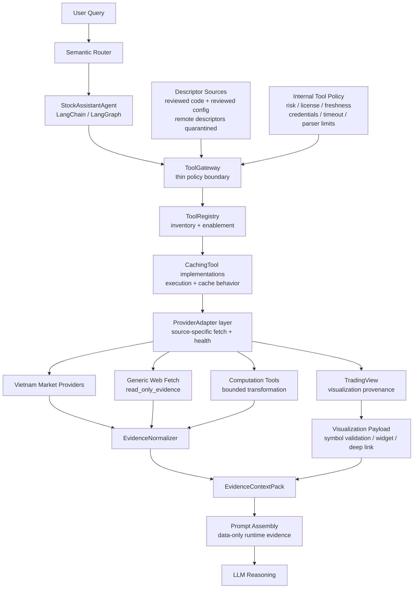
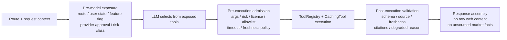

# Tool System Architecture and Design

> **Document Version**: 1.0
> **Last Updated**: June 11, 2026
> **Phase**: 2B - Vietnam-Market Tool Integration
> **Status**: Research consolidated and standalone proposal
> **Scope**: Agent tool architecture, Vietnam-market data providers, Tool Gateway, provider adapters, generic web evidence, TradingView visualization
> **Primary Source Requirement**: Official vendor, framework, provider, and security documentation where available
> **Governing Architecture Principle**: Tools fetch and compute; the LLM reasons; memory does not store market facts

---

## Table of Contents

1. [Executive Summary](#executive-summary)
2. [Scope and Project Boundaries](#scope-and-project-boundaries)
3. [Current State Assessment](#current-state-assessment)
4. [Session Synthesis](#session-synthesis)
5. [Research Synthesis and Design Drivers](#research-synthesis-and-design-drivers)
6. [Layered Architecture Alignment](#layered-architecture-alignment)
7. [Target Tool System Architecture](#target-tool-system-architecture)
8. [Evidence, Provider, and Visualization Strategy](#evidence-provider-and-visualization-strategy)
   - [Vietnam-Market Provider Strategy](#vietnam-market-provider-strategy)
   - [TradingView Visualization Strategy](#tradingview-visualization-strategy)
   - [Generic Web Evidence Trust Model](#generic-web-evidence-trust-model)
9. [Target Contracts](#target-contracts)
10. [Implementation Roadmap](#implementation-roadmap)
11. [Verification Strategy](#verification-strategy)
12. [Research Log and Decision Log](#research-log-and-decision-log)
13. [Document Update Log](#document-update-log)
14. [Reference Index](#reference-index)

---

## Executive Summary

### Objective

Define a practical tool-system architecture for the Stock Investment Assistant that:

- keeps the current LangChain/LangGraph agent and existing tool model as the starting point;
- makes Vietnam-market data a first-class tool domain;
- introduces a thin in-process Tool Gateway for policy, validation, and auditability;
- separates provider-specific fetching from evidence normalization and prompt assembly;
- treats generic web fetching as deny-by-default `read_only_evidence`;
- treats TradingView as visualization provenance, not canonical financial truth;
- preserves the layered architecture boundary where tools fetch or compute, the LLM reasons, and memory does not store market facts.

### Design Position

The tool system should remain **project-scoped, repo-owned, provider-neutral, and incremental**.
The correct near-term move is not to introduce a second agent runtime, a separate gateway service, or a large provider abstraction platform. The project already has a registry-based tool model and cache-aware tool execution. The first tool-architecture improvement should wrap that baseline with a thin policy and validation layer that controls which tools are visible to the model, which tool calls may execute, and which normalized results may enter LLM context.

### Core Conclusion

Adopt a **thin Tool Gateway with strong contracts**. The gateway should be an in-process facade or middleware boundary around the existing `ToolRegistry` / `CachingTool` model. It should own route-aware tool exposure, execution admission, risk-class enforcement, source-attribution checks, license/freshness policy, descriptor integrity, degraded-state handling, and trace metadata.

It should not own provider-specific fetch logic, parsing logic, LLM reasoning, memory storage, business lifecycle governance, or prompt policy text.

### Vietnam and Web Evidence Conclusion

Vietnam-market data should be planned around native and official sources first:

- official exchange/depository sources for highest-authority notices and reference data;
- licensed commercial data providers for production-grade normalized datasets;
- public web sources for evidence, news, disclosures, and market context only after terms/licensing review;
- Python wrappers for prototype and research acceleration;
- TradingView for charting and visualization payloads.

Generic web fetch should be useful but conservative. It should be disabled by default, allowlisted when needed, parser-limited, source-attributed, prompt-injection quarantined, and normalized before use.

---

## Scope and Project Boundaries

### In Scope

- Tool architecture for the current stock investment agent.
- Vietnam-market data provider strategy.
- Tool Gateway pattern and responsibility boundaries.
- Generic web fetch and public-web evidence trust model.
- TradingView chart/widget/deep-link strategy.
- Target contracts for tool capability, execution envelope, provider adapters, context packs, and web fetch policy.
- Verification strategy for tool exposure, evidence integrity, degraded states, and finance-safety behavior.

### Out of Scope

- Implementing source code changes.
- Selecting a final paid provider contract.
- Replacing the current agent runtime.
- Creating a separate gateway service.
- Automated trade execution or brokerage actions.
- Treating public-web content or TradingView widget data as canonical financial truth by default.

### Boundary Rules

| Boundary | Required Rule |
|----------|---------------|
| Agent runtime | Coordinates reasoning and tool use; does not own provider parsing or persistent market facts |
| Tool Gateway | Owns policy and validation; does not fetch provider data or become a second runtime |
| ToolRegistry / CachingTool | Owns inventory, enablement, and cache-aware execution |
| Provider adapters | Own source-specific fetch, credential/scope use, health, and field mapping |
| Evidence normalizer | Owns schema validation, citations, freshness, warnings, and degraded-state packaging |
| Prompt assembly | Consumes normalized evidence as data-only context; does not accept raw web/provider payloads as instructions |
| Memory | Stores conversation context only; never stores mutable market facts as truth |

---

## Current State Assessment

### Baseline Tool Model

The current project direction already contains the foundations needed for an incremental tool architecture:

| Area | Current Baseline | Architectural Meaning |
|------|------------------|-----------------------|
| Agent runtime | LangChain/LangGraph ReAct-style stock assistant | The model can reason and select tools, but the application owns execution |
| Tool registration | `ToolRegistry` pattern | Central inventory and enablement surface for available tools |
| Tool execution | `CachingTool` pattern | Cache-aware deterministic execution boundary |
| Stock symbol tooling | Symbol lookup and company information direction | Existing starting point for market-data integration |
| TradingView tooling | Chart URL/widget/analysis direction | Existing starting point for visualization integration |
| Reporting tooling | Report-generation direction | Existing starting point for composing sourced sections into user-facing output |
| Semantic routing | Route-aware query classification | Foundation for limiting model-visible tools by query intent |

### Current Gaps

| Gap | Risk |
|-----|------|
| Source attribution is not yet a universal tool contract | Answers can become difficult to audit or verify |
| Provider licensing posture is not centralized | Public-web or wrapper use can drift into production without review |
| Tool exposure and execution are not clearly separated | The model may see too many tools or tools that are not valid for a route |
| Descriptor integrity is not explicit | Tool names, descriptions, schemas, or remote descriptors can become a trust surface |
| Generic web fetch lacks a trust model | Web content can introduce stale data, prompt injection, or unsupported claims |
| TradingView authority boundary needs to stay explicit | Visualization widgets can be mistaken for canonical data sources |
| Provider-specific parsing can leak into orchestration | The gateway can become overcentralized if responsibilities are not partitioned |

---

## Session Synthesis

This proposal consolidates the tool-domain knowledge developed during the current research pass and related side analysis. The main synthesis is:

1. The Tool Gateway pattern fits the project only if it stays thin.
2. The existing `ToolRegistry` and `CachingTool` model should remain the execution baseline.
3. The gateway should wrap policy around tools rather than replacing them.
4. Vietnam-market support requires provider classification, licensing posture, freshness metadata, and source attribution from the start.
5. TradingView is valuable for visualization, but numeric facts should originate from approved evidence or computation tools.
6. Generic web fetch is necessary for public disclosures, reports, and news, but it must be deny-by-default and normalized before reaching the LLM.
7. Remote/MCP-style tools should be future-facing only until descriptor integrity, approval, credentials, observability, and operational controls are mature.

The internal documentation delta reviewed for this synthesis changed architecture, roadmap, requirements, and decision-record direction around the same themes: Vietnam-first providers, thin gateway policy, generic web trust, descriptor integrity, and evidence normalization. This document intentionally captures the durable knowledge without depending on temporary edits, draft ADR numbers, or changed document versions.

---

## Research Synthesis and Design Drivers

### OpenAI Tool and Function Calling Guidance

OpenAI's tool/function-calling model separates model-selected tool calls from application-executed tool behavior. The model can request a function call based on a provided schema, but the application remains responsible for executing the function and returning results. OpenAI's function-calling and latency guidance also make the performance tradeoff explicit: keep the initially available function set small, reduce input tokens, make fewer requests, parallelize independent work, and avoid using the LLM for deterministic application logic.

Design implication for this project:

- Keep tool execution application-owned.
- Treat tool schemas/descriptions as controlled descriptors.
- Validate arguments and outputs outside the model.
- Feed tool results back as data, not as higher-authority instructions.
- Keep model-visible tools route-filtered and compact instead of exposing every provider as a separate tool.
- Treat latency as a first-class gateway design concern: cache first, avoid unnecessary model calls, and parallelize independent provider fetches.

Sources:

- [OpenAI Function Calling](https://developers.openai.com/api/docs/guides/function-calling)
- [OpenAI Tools Guide](https://developers.openai.com/api/docs/guides/tools)
- [OpenAI Latency Optimization](https://developers.openai.com/api/docs/guides/latency-optimization)

### Anthropic Tool Use Guidance

Anthropic's tool-use model similarly distinguishes model decisions from client-side tool execution. This reinforces the same boundary: tool choice may be model-assisted, but execution, validation, security, and result handling are application responsibilities.

Design implication for this project:

- The Tool Gateway should mediate execution even when the model selects the tool.
- Tool output should be validated and normalized before it reaches the response-generation path.
- Tool use should be traceable for audit and debugging.

Source:

- [Anthropic Tool Use Overview](https://platform.claude.com/docs/en/agents-and-tools/tool-use/overview)

### LangChain Tools and Middleware Guidance

LangChain tools expose callable functions with schemas, and LangChain middleware supports interception around model and tool behavior. LangChain also warns that too many tools can increase tool-selection error and supports dynamic tool filtering.

Design implication for this project:

- Start with an in-process facade or middleware rather than a separate service.
- Filter model-visible tools by route and context.
- Use pre/post execution hooks for validation, retries, error handling, permissions, and tracing.
- Avoid expanding the model-visible tool surface unnecessarily.

Sources:

- [LangChain Tools](https://docs.langchain.com/oss/python/langchain/tools)
- [LangChain Middleware](https://docs.langchain.com/oss/python/langchain/middleware)
- [LangChain Multi-Agent](https://docs.langchain.com/oss/python/langchain/multi-agent)

### MCP and GitHub Copilot MCP Guidance

MCP treats tools as named capabilities with schemas and server-side descriptors. That model is useful for future extensibility, but remote descriptors increase the trust surface. GitHub Copilot's MCP guidance shows that remote/local tool providers require explicit configuration, authorization, and organizational policy.

Design implication for this project:

- Treat remote/MCP-style descriptors as untrusted until locally admitted.
- Version and trace descriptor changes.
- Do not start with MCP as the primary architecture unless there is a concrete integration need.
- Keep MCP-style admission as a later stage after local gateway contracts are mature.

Sources:

- [Model Context Protocol Tools Specification](https://modelcontextprotocol.io/specification/2025-06-18/server/tools)
- [GitHub Copilot MCP](https://docs.github.com/en/copilot/how-tos/provide-context/use-mcp-in-your-ide/extend-copilot-chat-with-mcp)

### Hugging Face Tool-Use Guidance

Hugging Face's tool-use and agent guidance reinforces the preference for structured tool calls over free-form code-generation agents when predictable execution and validation matter. It also treats shared or remote tools as trust decisions rather than neutral implementation details.

Design implication for this project:

- Prefer JSON-schema-like tool calls and application-owned execution.
- Keep remote/shared tool admission behind explicit local policy.
- Treat tool code, descriptors, and remote metadata as separate trust surfaces.
- Avoid exposing broad code-execution agents for market-data workflows.

Sources:

- [Hugging Face Transformers Tool Use](https://huggingface.co/docs/transformers/en/chat_extras)
- [Hugging Face smolagents Tools](https://huggingface.co/docs/smolagents/en/tutorials/tools)
- [Hugging Face smolagents Agent Types](https://huggingface.co/docs/smolagents/en/guided_tour)

### OWASP Prompt Injection Guidance

OWASP identifies indirect prompt injection through websites, files, and external content as a core LLM application risk. External content must be treated as untrusted, separated from instructions, least-privileged, validated, and tested adversarially.

Design implication for this project:

- Generic web fetch must quarantine instruction-shaped page content.
- Raw HTML/PDF/page text must not become prompt authority.
- Evidence snippets need citations, source URL, timestamps, freshness, and parser warnings.
- Tests should include malicious page text and descriptor tampering scenarios.

Source:

- [OWASP LLM01 Prompt Injection](https://genai.owasp.org/llmrisk/llm01-prompt-injection/)

---

## Layered Architecture Alignment

The tool architecture must preserve the layered agent architecture:

| Layer Principle | Tool-System Interpretation |
|-----------------|----------------------------|
| Memory never stores facts | Market data, web evidence, and computed metrics stay request-scoped or source-attributed; they are not persisted as memory truth |
| RAG stores evidence, not opinions | Any future retrieval layer stores sourced material, not model-authored conclusions |
| Prompting controls behavior, not data | Prompt assets define response policy; they do not embed mutable market facts |
| Tools compute numbers; LLM reasons about them | Deterministic tools fetch and calculate; the LLM explains implications and uncertainty |
| Investment data sources are external | Data comes from approved providers, public evidence, or repository-owned records through controlled tool paths |

The relevant stable project reference is [ADR-001 - Layered LLM Architecture](./DECISIONS/ADR-AGENT-001-LAYERED-LLM-ARCHITECTURE.md). This proposal extends the tool side of that boundary without changing its principles.

---

## Target Tool System Architecture

### Design Overview

The target design treats the gateway as a four-phase policy boundary, not as a tool executor. The model may select from exposed tool capabilities, but application code owns exposure, admission, execution, validation, and final response assembly. This aligns with OpenAI and Anthropic tool-calling guidance, LangChain middleware patterns, MCP descriptor cautions, and OWASP prompt-injection controls.

The diagram below is a **logical responsibility view**. It is not a recommendation to create separate services, network calls, or serialization boundaries for every box. In Phase 2B, these responsibilities should be fused into one in-process gateway execution path around the existing `ToolRegistry` and `CachingTool` model.



### Logical Responsibilities vs Runtime Hops

The architecture intentionally separates policy, inventory, provider access, normalization, and prompt assembly so each responsibility can be governed and tested. That separation should not be implemented as a long physical call chain.

If every logical box became a remote service, the design would introduce avoidable drawbacks:

| Risk | Why It Matters |
|------|----------------|
| Added latency | Repeated network calls, serialization, retries, and tracing overhead would compete with already-expensive LLM and provider calls |
| Operational complexity | More deployable units increase configuration, credential, observability, and failure-mode surfaces |
| Over-abstraction | The gateway can become a god object if it starts owning provider parsing, business lifecycle, prompt policy, and execution logic |
| Tool overload | Exposing provider-level tools directly to the model increases prompt tokens and tool-selection errors |
| Debugging friction | Failures become harder to attribute when policy, provider, normalization, and prompt assembly are split across runtime boundaries |

The implementation posture should therefore be:

- keep `ToolGateway` as an in-process facade or LangChain middleware boundary;
- expose coarse agent-callable capabilities, not every source provider;
- collapse registry lookup, cache-aware execution, adapter selection, and normalization behind one application call;
- use cache-first execution and freshness checks before external provider calls;
- parallelize independent provider calls for report and market-overview workflows;
- reserve separate services or remote/MCP providers for later operational need, not initial architecture cleanliness.

Optimized runtime view:

```mermaid
flowchart LR
  User["User Query"] --> Agent["Agent Runtime"]
  Agent --> Route["Fast Route + Semantic Router"]
  Route --> Gateway["In-Process ToolGateway"]

  Gateway --> Policy["Local Policy Checks\nroute / risk / license / freshness"]
  Policy --> Tool["Registry Tool Call\nCachingTool"]
  Tool --> Cache{"Fresh Cache?"}

  Cache -- "yes" --> Normalize["Normalize Cached Result"]
  Cache -- "no" --> Providers["Provider Calls\nparallel when independent"]
  Providers --> Normalize

  Normalize --> Pack["EvidenceContextPack"]
  Pack --> Prompt["Prompt Assembler"]
  Prompt --> LLM["LLM Final Reasoning"]
```



Recommended facade shape:

```text
gateway.execute(route, tool_name, args) -> ToolExecutionEnvelope
```

From the agent runtime's perspective, this is one boundary. Internally it may perform descriptor lookup, route admission, cache checks, provider calls, evidence normalization, warning generation, and trace collection.

### Latency and Complexity Controls

The gateway should include explicit performance controls so safety and evidence quality do not turn into unnecessary latency:

| Control | Target Behavior |
|---------|-----------------|
| Route-filtered exposure | Only expose tools relevant to the current route, locale, feature flags, and provider approval |
| Coarse tools, internal adapters | Keep model-visible tools compact while allowing provider choice behind the gateway |
| Cache-first execution | Return fresh cached evidence when policy allows, with retrieved timestamp and freshness metadata |
| Fast deterministic paths | Handle symbol normalization, TradingView deep-link generation, and simple metadata lookup without additional LLM calls |
| Provider timeouts | Enforce per-provider and per-tool budgets, then return degraded states instead of blocking indefinitely |
| Parallel provider fetch | Fetch independent quote, disclosure, flow, and visualization data concurrently for composite reports |
| Generic web slow path | Use web fetch only when allowed and needed; never make it the default path for native market data |
| Observability | Record route, exposed tools, selected tool, provider, cache status, freshness, timeout, warning, and degraded-state reason |

Separate gateway services or remote/MCP-style providers should be deferred until there is concrete need for shared cross-agent tooling, independent provider scaling, stricter operational ownership, or production remote-tool admission.

### Responsibility Matrix

| Component | Owns | Must Not Own |
|-----------|------|--------------|
| `ToolRegistry` | Inventory, enabled/disabled state, canonical tool names, reviewed local descriptor source | Route policy, provider parsing, external credential policy, prompt assembly |
| `ToolGateway` | Model-visible tool filtering, execution admission, route-tool match, risk class, license/freshness checks, timeout budget, descriptor integrity checks, degraded-state policy, trace metadata | Provider-specific fetch logic, source parsing, LLM reasoning, memory storage, conversation lifecycle, prompt policy text, business workflow ownership |
| `ProviderAdapter` | Provider-specific fetch, credential/scope use, provider health, source field mapping | Tool exposure policy, prompt authority, memory persistence |
| `EvidenceNormalizer` | Output schema validation, citations, source URL checks, freshness labels, warnings, degraded-state packaging | Provider access, model reasoning, durable memory |
| `PromptAssembler` | Consumption of normalized context packs as runtime data-only context | Raw provider payload parsing, tool admission, market fact persistence |

### Tool and Adapter Taxonomy

The architecture distinguishes **tools** from **adapter providers**:

- a **tool** is an agent-callable capability exposed through the registry and mediated by the gateway;
- an **adapter provider** is a lower-level source connector used by a tool to fetch, validate, or enrich data;
- a **normalizer** converts tool/provider outputs into request-scoped evidence, visualization provenance, warnings, and citations.
- a **descriptor** has two layers: a compact model-visible capability descriptor and an internal policy descriptor.

This separation prevents the agent-facing tool list from growing into a provider list. For example, a `VietnamMarketDataTool` can use `vnstock`, FiinGroup, HOSE/HNX, or CafeF adapters behind one consistent tool contract, while the model sees only the capability it needs.

| Classification Dimension | Applies To | Purpose |
|--------------------------|------------|---------|
| Descriptor layer | Tools | Splits model-visible name/description/schema from internal risk, license, credential, freshness, and output-policy metadata |
| Tool family | Tools | Groups model-visible capabilities such as market data, disclosure evidence, visualization, reporting, or computation |
| Tool risk class | Tools | Controls admission as `read_only_evidence`, `bounded_transformation`, future `workflow_mutation`, or prohibited `external_side_effect` |
| Route exposure | Tools | Limits model-visible tools by route, locale, user/session state, feature flag, and provider approval |
| Output kind | Tools and normalizers | Distinguishes market facts, evidence snippets, generated reports, visualization provenance, warnings, and degraded states |
| Provider class | Adapters | Distinguishes official, licensed commercial, public web, wrapper/prototype, visualization, and international fallback providers |
| License mode | Adapters | Records prototype, research, production-approved, terms-review-required, or blocked usage |
| Freshness policy | Tools and adapters | Defines expected timestamps, staleness rules, market-session awareness, and stale-data warnings |
| Credential/scope owner | Adapters | Identifies who owns credentials and access scope for licensed, private, or remote providers |

### Tool Catalog

| Tool | Status | Tool Family | Primary Output | Adapter Providers |
|------|--------|-------------|----------------|-------------------|
| `StockSymbolTool` | Existing baseline | Market reference | Symbol lookup, company information, basic market data | Yahoo Finance, repository fallback, future Vietnam symbol adapters |
| `TradingViewTool` | Existing / needs expansion | Visualization | Chart URLs, widget payloads, deep links, symbol validation, visualization provenance | TradingView adapter |
| `ReportingTool` | Existing / needs expansion | Reporting | Markdown/HTML report sections from sourced tool outputs | Market data, disclosure, visualization, portfolio, and computation tools |
| `VietnamMarketDataTool` | Potential | Market data | Quotes, OHLCV history, profile, fundamentals, indices, exchange metadata | `vnstock`, FiinGroup, Vietstock, CafeF, HOSE/HNX, VSDC |
| `VietnamDisclosureTool` | Potential | Evidence retrieval | News, disclosures, shareholder documents, event summaries | Vietstock, CafeF, HOSE/HNX notices, VSDC |
| `CorporateActionTool` | Potential | Evidence retrieval | Dividends, rights, splits, listing changes, effective dates | VSDC, HOSE/HNX, Vietstock, CafeF |
| `MarketBreadthFlowTool` | Potential | Market analytics | Index breadth, sector performance, liquidity, top movers, foreign/proprietary flow | Vietstock, CafeF, FiinGroup, TradingView heatmap as visualization-only |
| `TechnicalIndicatorTool` | Potential | Bounded computation | RSI, MACD, moving averages, Bollinger Bands, support/resistance candidates | Approved price-history adapters; deterministic calculation library |
| `GenericWebFetchTool` | Potential / controlled | Read-only evidence | Normalized snippets, tables, PDFs, parser warnings, source metadata | Allowlisted public-web adapter with parser limits |
| `PortfolioAnalyticsTool` | Potential | Bounded computation | Allocation, concentration, benchmark comparison, realized/unrealized performance | Portfolio repository, approved quote/history adapters |
| `ToolHealthFreshnessTool` | Potential | Operations evidence | Provider health, cache status, freshness warnings, degraded-state diagnostics | Registry, cache backend, provider adapters |

### Adapter Provider Catalog

| Adapter Provider | Provider Class | Used By Tools | Notes |
|------------------|----------------|---------------|-------|
| `YahooFinanceAdapter` | International fallback | `StockSymbolTool`, cross-market comparison tools | Useful for non-Vietnam symbols and fallback only |
| `AlphaVantageAdapter` | International fallback | Cross-market comparison, FX, non-Vietnam market data | Not primary for Vietnam coverage |
| `VnstockAdapter` | Wrapper/prototype | `VietnamMarketDataTool`, research workflows | Useful prototype path; license and usage caveats must be reviewed |
| `FiinGroupAdapter` | Licensed commercial | Market data, fundamentals, breadth/flow, reports | Preferred production-grade candidate when licensed |
| `VietstockAdapter` | Public web / candidate evidence | Disclosures, statements, screeners, market overview | Requires terms-of-use review and parser controls |
| `CafeFAdapter` | Public web / candidate evidence | News, company pages, disclosures, market overview, flow data | Requires terms-of-use review and parser controls |
| `VSDCAdapter` | Official source | Corporate actions, rights, securities registration | Highest-authority candidate for depository/corporate-action data |
| `HoseHnxAdapter` | Official exchange source | Reference data, exchange notices, listings | Separate exchange-specific mapping may be needed |
| `TradingViewAdapter` | Visualization provider | `TradingViewTool`, visualization sections in reports | Produces `visualization_provenance`, not canonical market facts by default |
| `GenericWebAdapter` | Public web / controlled evidence | `GenericWebFetchTool` | Deny-by-default; uses allowlist, rate limits, parser limits, and prompt-injection quarantine |

### Categorization Mechanism

The gateway should classify tools and adapters separately:

1. `ToolCapabilityDescriptor` classifies only the model-visible capability: name, concise description, input schema, output kind, and route family.
2. `ToolPolicyDescriptor` stays internal to the gateway: risk class, license mode, freshness policy, cache policy, credentials, rate limits, timeout budget, parser constraints, required metadata, enabled environments, and production eligibility.
3. `ProviderAdapterDescriptor` classifies the source connector: provider class, license mode, credential/scope owner, supported markets, freshness policy, parser limits, production eligibility, and source-attribution requirements.
4. `ToolExecutionEnvelope` records the selected tool, selected adapter, descriptor versions or hashes, admission decisions, warnings, degraded-state reason, and normalized result reference.
5. `EvidenceContextPack` carries only normalized facts, snippets, report sections, visualization provenance, warnings, citations, and freshness metadata to prompt assembly.

This mechanism lets the model reason over a compact tool capability list while the application retains detailed provider policy and failover control. It also keeps sensitive policy details, credential ownership, license posture, and provider fallback logic out of model-visible descriptions.

Descriptor integrity should follow a progressive trust model:

- local descriptors defined in reviewed code are trusted after code review;
- config manifests are trusted only after repository review and environment approval;
- remote or MCP-style descriptors are untrusted until locally admitted;
- descriptor changes should be versioned or hashed and recorded in trace metadata;
- descriptor drift should produce a degraded state or blocked admission instead of silent execution.

### Gateway Phase Ownership

| Phase | Primary Question | Inputs | Output |
|-------|------------------|--------|--------|
| Pre-model exposure | Which tools may the model see for this turn? | route, locale, enabled state, user/session state, model-visible capability descriptors, feature flags | compact tool list with names, descriptions, and schemas |
| Pre-execution admission | Is the selected tool call allowed now? | tool arguments, internal policy descriptor, provider health, risk class, license posture, credentials, timeout budget, freshness policy | execution approval or degraded-state denial |
| Post-execution validation | Is the result usable as evidence or visualization? | raw tool result, adapter descriptor, output schema, required metadata, source URL, timestamps, warnings | normalized facts, snippets, visual provenance, or validation failure |
| Response assembly | What context may reach the prompt? | evidence context pack, finance-safety checks, citation coverage, stale-data warnings | data-only prompt context with no raw web instructions |

### Gateway Decision Phases



### Design Rules

1. Keep the gateway in-process at first.
2. Keep the current registry and cache-aware tool execution model.
3. Separate model-visible tool exposure from execution-time admission.
4. Treat tool descriptors and adapter descriptors as controlled, versioned artifacts.
5. Keep provider-specific fetch and parsing in adapters.
6. Normalize evidence before prompt assembly.
7. Return degraded-state metadata instead of silently suppressing useful but incomplete evidence.
8. Preserve finance safety by blocking unsourced recommendations and unsupported certainty.
9. Use freshness policy instead of TTL-only cache rules.
10. Keep remote/MCP-style tool admission behind descriptor-integrity and operations gates.

---

## Evidence, Provider, and Visualization Strategy

This section groups the lower-level source, visualization, and public-web trust strategies that sit behind agent-visible tools. The parent boundary is intentionally provider-facing rather than model-facing: providers and adapters are selected by tool policy, not exposed as a flat list of model-callable tools.

### Vietnam-Market Provider Strategy

#### Provider Classes

| Provider Class | Candidate Sources | Best Use | Production Caveat |
|----------------|------------------|----------|-------------------|
| Official exchange/depository sources | HOSE, HNX, [VSDC](https://www.vsd.vn/vi/) | Securities registration, exchange notices, official reference data, corporate actions, rights events | Coverage and machine-readability may vary |
| Licensed commercial providers | [FiinGroup](https://fiingroup.vn/), FiinTrade, FiinQuant, API Datafeed | Production-grade normalized market data, financial statements, fundamentals, ownership, sector data, institutional workflows | Requires commercial agreement and credential governance |
| Public web sources | [Vietstock](https://vietstock.vn/), [VietstockFinance](https://finance.vietstock.vn/), [CafeF market data](https://cafef.vn/du-lieu.chn) | News, disclosures, statements, market overview, foreign flow, proprietary trading, screeners, public evidence | Requires terms-of-use review, parser limits, and source attribution |
| Python wrappers | [`vnstock`](https://pypi.org/project/vnstock/) | Prototype/research adapter for Vietnam equities, indices, fundamentals, market data, and related event/news surfaces | License/usage posture must be reviewed before production use |
| Visualization providers | [TradingView Vietnam Market](https://www.tradingview.com/markets/stocks-vietnam/) | Charts, widgets, screeners, heatmaps, ticker tape, deep links | Visualization provenance only unless explicitly admitted as a data source |
| International fallback | Yahoo Finance, Alpha Vantage | Non-Vietnam symbols, FX, commodities, cross-market comparison | Not primary for Vietnam-market coverage |

#### Vietnam-Market Capability Targets

| Capability | Target Coverage |
|------------|-----------------|
| Symbol normalization | `FPT`, `HOSE:FPT`, `HNX:SHS`, `UPCOM:BSR`, VNINDEX, VN30, HNXINDEX, UPINDEX |
| Quote and history | Price, OHLCV, time window, exchange, currency `VND`, provider, source URL, freshness |
| Fundamentals | Statements, ratios, reporting periods, sector/industry metadata, missing-field warnings |
| Market breadth | Index movement, sector performance, liquidity, top movers, advance/decline, heatmap data |
| Flow | Foreign trading, proprietary trading, exchange/sector/symbol time windows |
| News and disclosures | Titles, publisher/provider, source URL, symbol/exchange, published/effective timestamps, event type |
| Corporate actions | Dividends, rights, splits, listing changes, shareholder documents, official notices |
| Reports | Symbol, market, sector, portfolio, and event reports with source-attributed sections |

#### Recommended Provider Posture

Use `vnstock` and public web sources for prototype and research where terms allow. Prefer licensed providers for production-grade market data. Use official sources for reference data, notices, and corporate actions where available. Use Yahoo and Alpha Vantage as international fallback and comparison sources, not as the primary Vietnam-market strategy.

### TradingView Visualization Strategy

#### Role

TradingView should enrich the user experience with visualization payloads and links. It should not become the canonical source of financial truth by default.

#### Target Capabilities

| Capability | Intended Use |
|------------|--------------|
| Advanced Chart widget | Interactive symbol chart with interval, theme, locale, style, and optional indicators |
| Technical Analysis widget | Visual technical rating or signal summary when supported |
| Symbol overview | High-level visual summary for a validated symbol |
| Ticker tape | Market or watchlist scanning surface |
| Heatmap and screener | Sector and market overview when TradingView supports Vietnam symbols |
| Deep links | Direct links to TradingView Supercharts or symbol pages |
| Symbol validation | Confirm whether `HOSE:`, `HNX:`, or Vietnam-market symbols render before returning a payload |

#### Authority Boundary

TradingView outputs should enter the agent context as `visualization_provenance`:

- widget type;
- symbol;
- interval;
- theme/locale;
- validation status;
- deep link;
- fallback message if unsupported.

Numeric facts in answers should originate from approved evidence or computation tools unless a later source-approval decision explicitly admits TradingView-derived data.

Sources:

- [TradingView Vietnam Market](https://www.tradingview.com/markets/stocks-vietnam/)
- [TradingView Advanced Chart Widget](https://www.tradingview.com/widget-docs/widgets/charts/advanced-chart/)
- [TradingView Technical Analysis Widget](https://www.tradingview.com/widget-docs/widgets/symbol-details/technical-analysis/)

### Generic Web Evidence Trust Model

#### Trust Position

Generic web fetch is useful for public reports, news, disclosures, tables, and filings-like pages, but it is a low-trust input channel. It must be deny-by-default and limited to `read_only_evidence`.

#### Required Controls

| Control | Requirement |
|---------|-------------|
| Domain allowlist | Only approved domains may be fetched |
| Rate limits | Fetch cadence must respect provider and operational limits |
| ToS/licensing posture | Production enablement requires review |
| Render mode | Static or browser-rendered fetch must be configured explicitly |
| Extraction mode | HTML text, table extraction, PDF extraction, or metadata-only extraction must be explicit |
| Parser limits | Maximum bytes, pages, tables, links, and extraction depth must be bounded |
| Freshness | Retrieved and published timestamps must be captured where available |
| Prompt-injection quarantine | Instructions embedded in pages, hidden content, scripts, and document text are treated as untrusted data |
| Degraded states | Blocked, stale, parser-limited, license-unclear, or source-incomplete paths return warnings instead of unsourced content |

#### Normalized Evidence Only

Raw HTML, raw PDF bytes, scripts, hidden text, and unvalidated provider payloads should never be passed directly into LLM context. The prompt should receive only normalized evidence context:

- facts;
- snippets;
- source URL;
- retrieved timestamp;
- published timestamp where available;
- freshness;
- provider/license posture;
- parser warnings;
- citations;
- degraded-state reason.

---

## Target Contracts

### `ToolCapabilityDescriptor`

Purpose: declare the compact model-visible tool capability. This descriptor should be safe to expose to the LLM and should not contain sensitive policy, credential, license, provider fallback, or internal admission details.

Recommended fields:

- tool name and description;
- supported routes;
- input schema;
- output kind;
- natural-language usage guidance;
- route family;
- locale/language coverage;
- model-visible examples;
- descriptor source and version.

### `ToolPolicyDescriptor`

Purpose: declare internal gateway policy for an agent-visible tool. This descriptor is evaluated by application code before execution and during post-execution validation.

Recommended fields:

- risk class;
- allowed provider classes;
- license mode and production eligibility;
- freshness policy;
- cache policy;
- timeout and retry budget;
- rate-limit policy;
- credential/scope owner;
- required source metadata;
- required output schema;
- enabled environments;
- descriptor source and version;
- descriptor hash or integrity marker.

### `ProviderAdapterDescriptor`

Purpose: declare policy and trust metadata for a source-specific adapter behind one or more tools.

Recommended fields:

- provider name;
- provider class;
- supported markets and exchanges;
- supported data categories;
- license mode;
- credential/scope owner;
- freshness policy;
- parser limits;
- source-attribution requirements;
- health-check behavior;
- production eligibility;
- descriptor source, version, and integrity marker.

### `ToolExecutionEnvelope`

Purpose: wrap the runtime result of a tool call.

Recommended fields:

- request metadata;
- selected route;
- selected tool;
- selected adapter;
- capability descriptor version;
- policy descriptor version or hash;
- adapter descriptor version or hash;
- admission phase outcomes;
- normalized result reference;
- cache status;
- warnings;
- degraded-state reason;
- source-attribution status;
- trace metadata.

### `ProviderAdapter`

Purpose: isolate provider-specific fetch, credential use, health, and mapping.

Recommended responsibilities:

- fetch from provider;
- report provider health;
- use credentials/scopes under explicit ownership;
- map provider fields to normalized outputs;
- attach source URL and timestamps;
- classify freshness and completeness;
- emit provider-specific warnings without leaking provider logic into the gateway.

### `EvidenceContextPack`

Purpose: pass request-scoped normalized data to prompt assembly.

Recommended contents:

- request ID and route;
- normalized facts;
- normalized documents/snippets;
- visualization provenance;
- provider metadata;
- source URLs and citations;
- freshness metadata;
- license mode;
- warnings;
- degraded-state reason.

### `GenericWebFetchPolicy`

Purpose: define when and how public-web evidence may be fetched.

Recommended fields:

- allowed domains;
- rate limits;
- render mode;
- extraction mode;
- parser limits;
- maximum content size;
- freshness policy;
- license posture;
- prompt-injection quarantine behavior.

---

## Implementation Roadmap

### Stage 1: In-Process Gateway Facade

Build a small gateway facade or middleware boundary around the existing tool registry and cache-aware tool execution path. Stage 1 should optimize for a fused runtime path, not a physically layered call chain. The gateway should expose one application-level call to the agent runtime while keeping policy, registry lookup, execution, normalization, and tracing internally organized.

Deliverables:

- route-aware model-visible tool filtering;
- two-layer descriptors: model-visible capability plus internal gateway policy;
- pre-execution argument and risk validation;
- license/freshness-policy/source metadata checks;
- timeout budget and degraded-state handling;
- trace metadata for tool decision phases;
- `gateway.execute(route, tool_name, args) -> ToolExecutionEnvelope` facade contract;
- cache-first execution and deterministic fast paths for low-risk operations;
- initial latency-budget instrumentation for route, gateway, cache, provider, normalizer, and final LLM phases.

Avoid:

- separate gateway service;
- replacing `ToolRegistry`;
- provider-specific parsing inside the gateway;
- tool-specific business logic inside the gateway;
- exposing internal policy, credential, provider fallback, or parser-limit details to the model-visible tool list;
- provider-level tool explosion in the model-visible tool list.

### Stage 2: Provider Adapters and Evidence Normalization

Introduce provider adapters and normalized context packs.

Deliverables:

- Vietnam provider adapter contract;
- provider adapter descriptors with source class, license mode, supported markets, and freshness policy;
- provider health and credential/scope ownership;
- source URL, timestamp, freshness, and license metadata;
- evidence normalizer for facts, snippets, warnings, and citations;
- TradingView `visualization_provenance`.

### Stage 3: Generic Web Fetch Trust Model

Enable generic web fetch only after the policy surface is mature.

Deliverables:

- deny-by-default configuration;
- allowlist;
- parser limits;
- ToS/licensing posture;
- prompt-injection quarantine;
- degraded-state behavior;
- adversarial tests with malicious page instructions.

### Stage 4: Optional Remote/MCP-Style Tool Admission

Admit remote or MCP-style tool providers only if local tools and provider adapters are insufficient.

Prerequisites:

- descriptor integrity;
- descriptor version/hash tracing;
- local policy admission;
- credential/scope ownership;
- audit metadata;
- timeout/rate-limit controls;
- operational need.

---

## Verification Strategy

### Acceptance Scenarios

| Scenario | Expected Result |
|----------|-----------------|
| Route-filtered tool visibility | Price queries expose market-data tools; chart queries expose visualization tools; unrelated tools are hidden |
| Model-visible descriptor filtering | The LLM sees concise tool names, descriptions, schemas, and examples, but not license policy, credentials, provider fallback rules, or parser limits |
| Pre-execution denial | Invalid arguments, blocked domains, missing license posture, or disallowed risk class return degraded-state metadata |
| Descriptor tampering | Changed, unapproved, or remote descriptors are not exposed or executed without local admission, descriptor version/hash trace, and degraded-state handling |
| Provider failover | Provider outage, stale data, or missing fields produce fallback or degraded-state messaging |
| Freshness-policy handling | Quotes, disclosures, corporate actions, and financial statements use category-specific freshness expectations rather than one shared TTL |
| Stale data | Answers surface freshness, category-specific staleness, and avoid overstating currentness |
| Generic web prompt injection | Page instructions remain untrusted data and cannot alter tool behavior or prompt policy |
| TradingView non-evidence handling | Widget/deep-link payloads are returned as visualization provenance only |
| Vietnamese and mixed-language routes | Queries such as `khoi ngoai mua rong FPT`, `bao cao tai chinh VNM`, and `show HOSE:FPT chart` route to the intended tool family |
| Finance-safety response | Unsourced recommendations, guaranteed-return claims, and hype language are blocked or rewritten conservatively |

### Evaluation Dataset Families

- Vietnam symbol normalization.
- Vietnam price/history retrieval.
- Fundamentals and statements.
- Market breadth and foreign/proprietary flow.
- News, disclosures, and corporate actions.
- TradingView visualization payload generation.
- Generic web fetch and prompt-injection resistance.
- Provider failover and stale-data behavior.
- Vietnamese and English route utterances.

---

## Research Log and Decision Log

| Topic | Finding | Proposal Impact |
|-------|---------|-----------------|
| Tool Gateway pattern | Good fit only as a thin policy boundary | Start with an in-process facade around existing tools |
| ToolRegistry vs Gateway | Registry should remain inventory/execution source | Gateway wraps policy; it does not replace registry |
| Provider adapters | Provider-specific logic must stay outside gateway | Use adapters for fetch, health, credentials, and field mapping |
| Evidence normalization | Raw outputs should not enter prompt context | Normalize into request-scoped context packs |
| Generic web fetch | Useful but high-risk | Deny-by-default, allowlist, parser limits, injection quarantine |
| TradingView | Strong visualization provider | Treat as visualization provenance, not canonical facts |
| Remote/MCP tools | Powerful but expands trust surface | Defer until descriptor integrity and operational controls mature |
| Vietnam providers | Native and official sources matter | Make Vietnam-market provider classes first-class |

---

## Document Update Log

| Version | Date | Author | Changes |
|---------|------|--------|---------|
| 1.0 | 2026-06-11 | Codex | Initial standalone tool-system research and proposal consolidating Tool Gateway, Vietnam-market providers, TradingView visualization, generic web evidence, target contracts, roadmap, verification strategy, and the logical-vs-runtime gateway performance clarification |

---

## Reference Index

### Project References

- [Prompt System Architecture and Design](./PROMPT_SYSTEM_RESEARCH_PROPOSAL.md)
- [Agent Domain Architecture Description](./ARCHITECTURE_DESIGN.md)
- [Stock Investment Assistant Agent - Software Requirements Specification](./SOFTWARE_REQUIREMENTS_SPECIFICATION.md)
- [Phase 2 Agent Enhancement Roadmap](./PHASE_2_AGENT_ENHANCEMENT_ROADMAP.md)
- [Agent Architecture Decision Records](./DECISIONS/AGENT_ARCHITECTURE_DECISION_RECORDS.md)
- [ADR-001 - Layered LLM Architecture](./DECISIONS/ADR-AGENT-001-LAYERED-LLM-ARCHITECTURE.md)
- [Project Documentation and Specification Methodology](../../study-hub/project-documentation-and-specification-methodology.md)

### Vendor and Framework References

- [OpenAI Function Calling](https://developers.openai.com/api/docs/guides/function-calling)
- [OpenAI Tools Guide](https://developers.openai.com/api/docs/guides/tools)
- [OpenAI Latency Optimization](https://developers.openai.com/api/docs/guides/latency-optimization)
- [Anthropic Tool Use Overview](https://platform.claude.com/docs/en/agents-and-tools/tool-use/overview)
- [LangChain Tools](https://docs.langchain.com/oss/python/langchain/tools)
- [LangChain Middleware](https://docs.langchain.com/oss/python/langchain/middleware)
- [LangChain Multi-Agent](https://docs.langchain.com/oss/python/langchain/multi-agent)
- [Model Context Protocol Tools Specification](https://modelcontextprotocol.io/specification/2025-06-18/server/tools)
- [GitHub Copilot MCP](https://docs.github.com/en/copilot/how-tos/provide-context/use-mcp-in-your-ide/extend-copilot-chat-with-mcp)
- [Hugging Face Transformers Tool Use](https://huggingface.co/docs/transformers/en/chat_extras)
- [Hugging Face smolagents Tools](https://huggingface.co/docs/smolagents/en/tutorials/tools)
- [Hugging Face smolagents Agent Types](https://huggingface.co/docs/smolagents/en/guided_tour)
- [OWASP LLM01 Prompt Injection](https://genai.owasp.org/llmrisk/llm01-prompt-injection/)

### Vietnam Market and Visualization References

- [`vnstock` PyPI](https://pypi.org/project/vnstock/)
- [Vietstock](https://vietstock.vn/)
- [VietstockFinance](https://finance.vietstock.vn/)
- [CafeF market data](https://cafef.vn/du-lieu.chn)
- [FiinGroup](https://fiingroup.vn/)
- [VSDC](https://www.vsd.vn/vi/)
- [TradingView Vietnam Market](https://www.tradingview.com/markets/stocks-vietnam/)
- [TradingView Advanced Chart Widget](https://www.tradingview.com/widget-docs/widgets/charts/advanced-chart/)
- [TradingView Technical Analysis Widget](https://www.tradingview.com/widget-docs/widgets/symbol-details/technical-analysis/)

---

*End of Tool System Research and Proposal*
