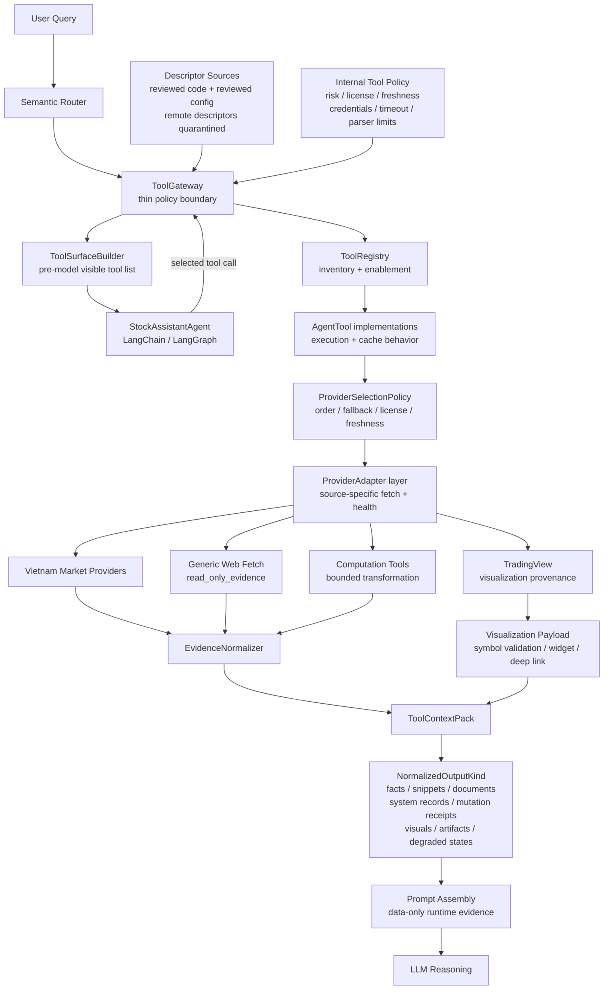
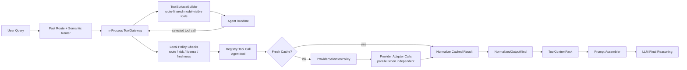
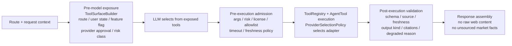
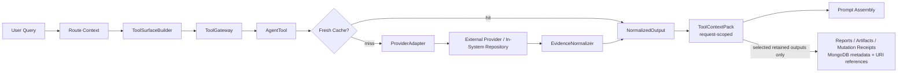

# Tool System Architecture and Design

## 0. Document Control and Navigation

### 0.1 Document Control

| Field | Value |
|-------|-------|
| Project | DP Stock Investment Assistant |
| Domain | Agent |
| Document Type | Research and technical design proposal |
| Document Version | 1.6 |
| Last Updated | June 15, 2026 |
| Phase | 2B - Vietnam-Market Tool Integration |
| Status | Research consolidated; standalone proposal; non-authoritative input for architecture, technical design, SRS, and ADR refinement |
| Standards Stance | Practice-based research/proposal aligned to the project documentation methodology |
| Audience | Engineering, architecture, agent maintainers, reviewers, and requirement custodians |
| Scope | Agent tool architecture, Vietnam-market data providers, Tool Gateway, provider adapters, generic web evidence, TradingView visualization |
| Authority Boundary | This document informs future updates. It does not override the SRS, ADRs, architecture description, technical design, executable contracts, or verified feature specs. |
| Promotion Targets | `ARCHITECTURE_DESIGN.md`, `TECHNICAL_DESIGN.md`, `SOFTWARE_REQUIREMENTS_SPECIFICATION.md`, ADRs, and delivery-scoped specs when implementation work begins |
| Primary Source Requirement | Official vendor, framework, provider, and security documentation where available |
| Governing Architecture Principle | Tools fetch and compute; the LLM reasons; memory does not store market facts |

---

### 0.2 Table of Contents

0. [0. Document Control and Navigation](#0-document-control-and-navigation)
1. [1. Executive Summary](#1-executive-summary)
2. [2. Scope and Project Boundaries](#2-scope-and-project-boundaries)
3. [3. Current State Assessment](#3-current-state-assessment)
4. [4. Session Synthesis](#4-session-synthesis)
5. [5. Research Synthesis and Design Drivers](#5-research-synthesis-and-design-drivers)
6. [6. Layered Architecture Alignment](#6-layered-architecture-alignment)
7. [7. Target Tool System Architecture](#7-target-tool-system-architecture)
8. [8. Technical Design Proposal](#8-technical-design-proposal)
9. [9. Tool Data Architecture and Integrity Design](#9-tool-data-architecture-and-integrity-design)
10. [10. Evidence, Provider, and Visualization Strategy](#10-evidence-provider-and-visualization-strategy)
   - [10.1 Vietnam-Market Provider Strategy](#101-vietnam-market-provider-strategy)
   - [10.2 TradingView Visualization Strategy](#102-tradingview-visualization-strategy)
   - [10.3 Generic Web Evidence Trust Model](#103-generic-web-evidence-trust-model)
11. [11. Target Contracts](#11-target-contracts)
12. [12. Implementation Roadmap](#12-implementation-roadmap)
   - [12.1 Promotion Gates](#121-promotion-gates)
   - [12.2 Phase 1: AgentTool Baseline and Descriptor Inventory](#122-phase-1-agenttool-baseline-and-descriptor-inventory)
   - [12.3 Phase 2: Route-Filtered Tool Surface and Thin Gateway](#123-phase-2-route-filtered-tool-surface-and-thin-gateway)
   - [12.4 Phase 3: Evolved `StockSymbolTool` over Internal Symbol Store](#124-phase-3-evolved-stocksymboltool-over-internal-symbol-store)
   - [12.5 Phase 4: Provider Policy and Normalized Output Backbone](#125-phase-4-provider-policy-and-normalized-output-backbone)
   - [12.6 Phase 5: Concrete Market Data and Visualization Tools](#126-phase-5-concrete-market-data-and-visualization-tools)
   - [12.7 Phase 6: Reporting from Tool Context Packs](#127-phase-6-reporting-from-tool-context-packs)
   - [12.8 Phase 7: Generic Web Evidence Pipeline](#128-phase-7-generic-web-evidence-pipeline)
   - [12.9 Phase 8: Optional Remote MCP-Style Tool Admission](#129-phase-8-optional-remote-mcp-style-tool-admission)
   - [12.10 Roadmap Anti-Goals](#1210-roadmap-anti-goals)
13. [13. Verification Strategy](#13-verification-strategy)
14. [14. Research Log and Decision Log](#14-research-log-and-decision-log)
15. [15. Revision History](#15-revision-history)
16. [16. Reference Index](#16-reference-index)

---

## 1. Executive Summary

### 1.1 Objective

Define a practical tool-system architecture for the Stock Investment Assistant that:

- keeps the current LangChain/LangGraph agent and existing tool model as the starting point;
- makes Vietnam-market data a first-class tool domain;
- introduces a thin in-process Tool Gateway for policy, validation, and auditability;
- separates provider-specific fetching from evidence normalization and prompt assembly;
- treats generic web fetching as deny-by-default `read_only_evidence`;
- treats TradingView as visualization provenance, not canonical financial truth;
- preserves the layered architecture boundary where tools fetch or compute, the LLM reasons, and memory does not store market facts.

### 1.2 Design Position

The tool system should remain **project-scoped, repo-owned, provider-neutral, and incremental**.
The correct near-term move is not to introduce a second agent runtime, a separate gateway service, or a large provider abstraction platform. The project already has a registry-based tool model and cache-aware tool execution. The first tool-architecture improvement should wrap that baseline with a thin policy and validation layer that controls which tools are visible to the model, which tool calls may execute, and which normalized results may enter LLM context.

### 1.3 Core Conclusion

Adopt a **thin Tool Gateway with strong contracts**. The gateway should be an in-process facade or middleware boundary around the existing `ToolRegistry` / `AgentTool` model. It should own route-aware tool exposure, execution admission, risk-class enforcement, source-attribution checks, license/freshness policy, descriptor integrity, degraded-state handling, and trace metadata.

It should not own provider-specific fetch logic, parsing logic, LLM reasoning, memory storage, business lifecycle governance, or prompt policy text.

### 1.4 Vietnam and Web Evidence Conclusion

Vietnam-market data should be planned around native and official sources first:

- official exchange/depository sources for highest-authority notices and reference data;
- licensed commercial data providers for production-grade normalized datasets;
- public web sources for evidence, news, disclosures, and market context only after terms/licensing review;
- Python wrappers for prototype and research acceleration;
- TradingView for charting and visualization payloads.

Generic web fetch should be useful but conservative. It should be disabled by default, allowlisted when needed, parser-limited, source-attributed, prompt-injection quarantined, and normalized before use.

---

## 2. Scope and Project Boundaries

### 2.1 In Scope

- Tool architecture for the current stock investment agent.
- Vietnam-market data provider strategy.
- Tool Gateway pattern and responsibility boundaries.
- Generic web fetch and public-web evidence trust model.
- TradingView chart/widget/deep-link strategy.
- Target contracts for tool capability, execution envelope, provider adapters, `ToolContextPack`, and web fetch policy.
- Verification strategy for tool exposure, evidence integrity, degraded states, and finance-safety behavior.

### 2.2 Out of Scope

- Implementing source code changes.
- Selecting a final paid provider contract.
- Replacing the current agent runtime.
- Creating a separate gateway service.
- Automated trade execution or brokerage actions.
- Treating public-web content or TradingView widget data as canonical financial truth by default.

### 2.3 Boundary Rules

| Boundary | Required Rule |
|----------|---------------|
| Agent runtime | Coordinates reasoning and tool use; does not own provider parsing or persistent market facts |
| Tool Gateway | Owns policy and validation; does not fetch provider data or become a second runtime |
| ToolRegistry / AgentTool | Owns inventory, enablement, and cache-aware execution |
| Provider adapters | Own source-specific fetch, credential/scope use, health, and field mapping |
| Evidence normalizer | Owns schema validation, citations, freshness, warnings, and degraded-state packaging |
| Prompt assembly | Consumes normalized tool context as data-only context; does not accept raw web/provider payloads as instructions |
| Memory | Stores conversation context only; never stores mutable market facts as truth |

---

## 3. Current State Assessment

### 3.1 Baseline Tool Model

The current project direction already contains the foundations needed for an incremental tool architecture:

| Area | Current Baseline | Architectural Meaning |
|------|------------------|-----------------------|
| Agent runtime | LangChain/LangGraph ReAct-style stock assistant | The model can reason and select tools, but the application owns execution |
| Tool registration | `ToolRegistry` pattern | Central inventory and enablement surface for available tools |
| Tool execution | `AgentTool` pattern | Cache-aware deterministic execution boundary |
| Stock symbol tooling | Symbol lookup, normalization, and in-system symbol metadata direction | Existing starting point for persistent symbol-data integration |
| TradingView tooling | Chart URL/widget/analysis direction | Existing starting point for visualization integration |
| Reporting tooling | Report-generation direction | Existing starting point for composing sourced sections into user-facing output |
| Semantic routing | Route-aware query classification | Foundation for limiting model-visible tools by query intent |

### 3.2 Current `StockSymbolTool` Context

The current `StockSymbolTool` implementation mixes two responsibilities:

- `get_info` first attempts live Yahoo-backed data through `DataManager`, then falls back to `SymbolRepository`;
- `search` already uses `SymbolRepository` against the persistent MongoDB `symbols` collection.

The persistent symbol model already supports richer in-system symbol data: canonical ticker, aliases, identifiers, listing exchange/country/currency, classification, coverage metadata, tags, fundamentals snapshot, price snapshot, ingestion metadata, and timestamps. This makes `StockSymbolTool` a better fit as the agent-facing tool for **in-system stock symbol data lookup, normalization, and controlled manipulation**, not as a live external market-data adapter.

Target implication: remove Yahoo/YahooFinance ownership from `StockSymbolTool`. External quote/history/fundamental retrieval should move to market-data tools and their provider adapters. `StockSymbolTool` should use an internal repository-backed adapter such as `InternalSymbolStoreAdapter`, with write actions gated by explicit policy.

### 3.3 Current Gaps

| Gap | Risk |
|-----|------|
| Source attribution is not yet a universal tool contract | Answers can become difficult to audit or verify |
| Provider licensing posture is not centralized | Public-web or wrapper use can drift into production without review |
| Tool exposure and execution are not clearly separated | The model may see too many tools or tools that are not valid for a route |
| Descriptor integrity is not explicit | Tool names, descriptions, schemas, or remote descriptors can become a trust surface |
| Generic web fetch lacks a trust model | Web content can introduce stale data, prompt injection, or unsupported claims |
| TradingView authority boundary needs to stay explicit | Visualization widgets can be mistaken for canonical data sources |
| Provider-specific parsing can leak into orchestration | The gateway can become overcentralized if responsibilities are not partitioned |
| Quality and accuracy benchmarks are not yet codified | Tool architecture can look complete without measurable citation, freshness, route, and safety gates |

### 3.4 Current Runtime vs Target Proposal Fit

| Current Runtime Element | Target Proposal Position | Compatibility Rule |
|-------------------------|--------------------------|--------------------|
| LangChain/LangGraph ReAct-style path | Preserve as the primary orchestration route | Do not introduce a second runtime in the early phases |
| `ToolRegistry` | Keep as tool inventory and enablement source | Gateway wraps registry-backed execution instead of replacing it |
| `AgentTool` target abstraction | Use as the repo-owned name for cache-aware tool execution | Preserve current cache behavior while adding descriptors and envelopes |
| Static semantic route taxonomy | Use as the first `ToolSurfaceBuilder` input | Avoid dynamic route discovery until the static route-to-tool map is verified |
| `StockSymbolTool` | Evolve into the in-system symbol data tool | Remove Yahoo/DataManager ownership and route live market data to market-data tools |
| `TradingViewTool` | Keep as visualization and symbol-validation capability | Return `VisualizationProvenance`, not canonical financial evidence |
| `ReportingTool` | Keep as a composition tool | Consume `ToolContextPack` inputs and generated artifacts instead of scraping providers |

### 3.5 Companion Document Update Targets

This standalone proposal is intended to feed later controlled updates, not to bypass existing authority. Candidate follow-up updates are:

| Target Document | Proposed Promotion Content |
|-----------------|----------------------------|
| Architecture design | Thin Tool Gateway boundary, ToolSurfaceBuilder, ProviderSelectionPolicy, ToolContextPack, and TradingView visualization authority |
| Technical design | Candidate module placement, runtime flow, descriptor validation, adapter contracts, and trace fields |
| SRS | Tool exposure, admission, source attribution, degraded states, workflow mutation gating, and verification acceptance criteria |
| ADR set | Thin gateway decision, generic web trust model, and mutation/HITL policy when implementation scope is approved |
| Delivery specs | Phase-specific contracts, fixtures, provider allowlists, and measurable quality gates |

### 3.6 Promotion Guidance

This proposal is intentionally broader than any one long-lived document. Future propagation should extract only the authority slice each target document owns:

| Target Artifact | Content to Promote | Content to Avoid |
|-----------------|--------------------|------------------|
| Architecture design | Tool-system boundaries, system-context relationships, data authority boundaries, and high-level diagrams | Implementation module names, field-level schemas, rollout tasks |
| Technical design | Runtime flow, module placement, schemas/contracts, cache behavior, adapter interfaces, artifact metadata, and trace fields | Business priority language or normative requirement numbering |
| SRS | Functional requirements, constraints, acceptance criteria, data-integrity requirements, source-attribution rules, and degraded-state behavior | Architecture rationale, provider research notes, implementation class layout |
| ADRs | Irreversible or hard-to-reverse decisions such as thin gateway boundary, generic web trust model, ToolContextPack retention posture, and mutation approval policy | Detailed rollout tasks or provider catalog commentary |
| Roadmap/delivery specs | Runnable increments, gates, fixtures, implementation sequence, and provider onboarding steps | Full research synthesis or broad benchmark discussion |

Propagation rule: do not copy this proposal wholesale into long-lived documents. Translate each section into the receiving document's responsibility model so architecture, technical design, SRS, ADRs, and roadmap remain distinct.

### 3.7 Current vs Target Terminology

| Current / Legacy Term | Target Term | Promotion Rule |
|-----------------------|-------------|----------------|
| `CachingTool` | `AgentTool` | Use `AgentTool` for target architecture while preserving cache-aware behavior as an implementation capability |
| `DataManager` / Yahoo-first stock lookup | Market-data adapter path | Keep Yahoo/DataManager as migration context only; live quote/history/fundamental data moves to dedicated market-data tools |
| Tool output dictionary | `ToolExecutionEnvelope` plus `NormalizedOutput` | Describe raw dictionaries as current implementation detail, not target contract |
| Evidence-only context pack | `ToolContextPack` | Use `ToolContextPack` because the pack may carry evidence, system records, mutation receipts, visualization provenance, generated artifacts, warnings, and degraded states |
| Provider-specific model-visible tools | Coarse model-visible tools plus internal adapters | Keep providers behind `ProviderSelectionPolicy`; expose capabilities, not provider internals |
| Raw report content | `GeneratedArtifact` from `ToolContextPack` inputs | Reports are generated from normalized context and retained with source lineage where persisted |
| Ticker-only identity | symbol + exchange + currency | Durable market facts and symbol normalization should not rely on ticker alone |

---

## 4. Session Synthesis

This proposal consolidates the tool-domain knowledge developed during the current research pass and related side analysis. The main synthesis is:

1. The Tool Gateway pattern fits the project only if it stays thin.
2. The existing `ToolRegistry` and `AgentTool` model should remain the execution baseline.
3. The gateway should wrap policy around tools rather than replacing them.
4. Vietnam-market support requires provider classification, licensing posture, freshness metadata, and source attribution from the start.
5. TradingView is valuable for visualization, but numeric facts should originate from approved evidence or computation tools.
6. Generic web fetch is necessary for public disclosures, reports, and news, but it must be deny-by-default and normalized before reaching the LLM.
7. Remote/MCP-style tools should be future-facing only until descriptor integrity, approval, credentials, observability, and operational controls are mature.

The internal documentation delta reviewed for this synthesis changed architecture, roadmap, requirements, and decision-record direction around the same themes: Vietnam-first providers, thin gateway policy, generic web trust, descriptor integrity, and evidence normalization. This document intentionally captures the durable knowledge without depending on temporary edits, draft ADR numbers, or changed document versions.

---

## 5. Research Synthesis and Design Drivers

### 5.1 OpenAI Tool and Function Calling Guidance

OpenAI's tool/function-calling model separates model-selected tool calls from application-executed tool behavior. The model can request a function call based on a provided schema, but the application remains responsible for executing the function and returning results. OpenAI's function-calling and latency guidance also make the performance tradeoff explicit: keep the initially available function set small, reduce input tokens, make fewer requests, parallelize independent work, and avoid using the LLM for deterministic application logic.

Design implication for this project:

- Keep tool execution application-owned.
- Treat tool schemas/descriptions as controlled descriptors.
- Validate arguments and outputs outside the model.
- Feed tool results back as data, not as higher-authority instructions.
- Keep model-visible tools route-filtered and compact instead of exposing every provider as a separate tool.
- Treat latency as a first-class gateway design concern: cache first, avoid unnecessary model calls, and parallelize independent provider fetches.

Sources:

- [OpenAI Function Calling](https://developers.openai.com/api/docs/guides/function-calling)
- [OpenAI Tools Guide](https://developers.openai.com/api/docs/guides/tools)
- [OpenAI Latency Optimization](https://developers.openai.com/api/docs/guides/latency-optimization)

### 5.2 Anthropic Tool Use Guidance

Anthropic's tool-use model similarly distinguishes model decisions from client-side tool execution. This reinforces the same boundary: tool choice may be model-assisted, but execution, validation, security, and result handling are application responsibilities.

Design implication for this project:

- The Tool Gateway should mediate execution even when the model selects the tool.
- Tool output should be validated and normalized before it reaches the response-generation path.
- Tool use should be traceable for audit and debugging.

Source:

- [Anthropic Tool Use Overview](https://platform.claude.com/docs/en/agents-and-tools/tool-use/overview)

### 5.3 LangChain Tools and Middleware Guidance

LangChain tools expose callable functions with schemas, and LangChain middleware supports interception around model and tool behavior. LangChain also warns that too many tools can increase tool-selection error and supports dynamic tool filtering.

Design implication for this project:

- Start with an in-process facade or middleware rather than a separate service.
- Filter model-visible tools by route and context.
- Use pre/post execution hooks for validation, retries, error handling, permissions, and tracing.
- Avoid expanding the model-visible tool surface unnecessarily.

Sources:

- [LangChain Tools](https://docs.langchain.com/oss/python/langchain/tools)
- [LangChain Middleware](https://docs.langchain.com/oss/python/langchain/middleware)
- [LangChain Multi-Agent](https://docs.langchain.com/oss/python/langchain/multi-agent)

### 5.4 MCP and GitHub Copilot MCP Guidance

MCP treats tools as named capabilities with schemas and server-side descriptors. That model is useful for future extensibility, but remote descriptors increase the trust surface. GitHub Copilot's MCP guidance shows that remote/local tool providers require explicit configuration, authorization, and organizational policy.

Design implication for this project:

- Treat remote/MCP-style descriptors as untrusted until locally admitted.
- Version and trace descriptor changes.
- Do not start with MCP as the primary architecture unless there is a concrete integration need.
- Keep MCP-style admission as a later phase after local gateway contracts are mature.

Sources:

- [Model Context Protocol Tools Specification](https://modelcontextprotocol.io/specification/2025-06-18/server/tools)
- [GitHub Copilot MCP](https://docs.github.com/en/copilot/how-tos/provide-context/use-mcp-in-your-ide/extend-copilot-chat-with-mcp)

### 5.5 Hugging Face Tool-Use Guidance

Hugging Face's tool-use and agent guidance reinforces the preference for structured tool calls over free-form code-generation agents when predictable execution and validation matter. It also treats shared or remote tools as trust decisions rather than neutral implementation details.

Design implication for this project:

- Prefer JSON-schema-like tool calls and application-owned execution.
- Keep remote/shared tool admission behind explicit local policy.
- Treat tool code, descriptors, and remote metadata as separate trust surfaces.
- Avoid exposing broad code-execution agents for market-data workflows.

Sources:

- [Hugging Face Transformers Tool Use](https://huggingface.co/docs/transformers/en/chat_extras)
- [Hugging Face smolagents Tools](https://huggingface.co/docs/smolagents/en/tutorials/tools)
- [Hugging Face smolagents Agent Types](https://huggingface.co/docs/smolagents/en/guided_tour)

### 5.6 OWASP Prompt Injection Guidance

OWASP identifies indirect prompt injection through websites, files, and external content as a core LLM application risk. External content must be treated as untrusted, separated from instructions, least-privileged, validated, and tested adversarially.

Design implication for this project:

- Generic web fetch must quarantine instruction-shaped page content.
- Raw HTML/PDF/page text must not become prompt authority.
- Evidence snippets need citations, source URL, timestamps, freshness, and parser warnings.
- Tests should include malicious page text and descriptor tampering scenarios.

Source:

- [OWASP LLM01 Prompt Injection](https://genai.owasp.org/llmrisk/llm01-prompt-injection/)

---

## 6. Layered Architecture Alignment

The tool architecture must preserve the layered agent architecture:

| Layer Principle | Tool-System Interpretation |
|-----------------|----------------------------|
| Memory never stores facts | Market data, web evidence, and computed metrics stay request-scoped or source-attributed; they are not persisted as memory truth |
| RAG stores evidence, not opinions | Any future retrieval layer stores sourced material, not model-authored conclusions |
| Prompting controls behavior, not data | Prompt assets define response policy; they do not embed mutable market facts |
| Tools compute numbers; LLM reasons about them | Deterministic tools fetch and calculate; the LLM explains implications and uncertainty |
| Investment data sources are external | Data comes from approved providers, public evidence, or repository-owned records through controlled tool paths |

The relevant stable project reference is [ADR-001 - Layered LLM Architecture](./DECISIONS/ADR-AGENT-001-LAYERED-LLM-ARCHITECTURE.md). This proposal extends the tool side of that boundary without changing its principles.

---

## 7. Target Tool System Architecture

### 7.1 Design Overview

The target design treats the gateway as a four-phase policy boundary, not as a tool executor. The model may select from exposed tool capabilities, but application code owns exposure, admission, execution, validation, and final response assembly. This aligns with OpenAI and Anthropic tool-calling guidance, LangChain middleware patterns, MCP descriptor cautions, and OWASP prompt-injection controls.

The corrected control flow is important: pre-model exposure happens **before** the ReAct agent receives its tool surface. A `ToolSurfaceBuilder` should construct the compact model-visible tool list from route context, descriptors, feature flags, and risk policy. After the model selects a tool, the same gateway boundary performs pre-execution admission, invokes the registry-backed tool path, validates normalized output, and passes only typed context into prompt assembly.

The data architecture behind this flow is intentionally narrow: `ToolContextPack` stays request-scoped by default, cache entries accelerate validated tool/provider results without becoming authoritative, and durable storage is reserved for existing domain records, sourced artifacts, generated reports, mutation receipts, audit metadata, and explicitly retained source lineage. This keeps the tool design consistent with the layered rule that memory does not store market facts.

The diagram below is a **logical responsibility view**. It is not a recommendation to create separate services, network calls, or serialization boundaries for every box. In Phase 2B, these responsibilities should be fused into one in-process gateway execution path around the existing `ToolRegistry` and `AgentTool` model.



### 7.2 Logical Responsibilities vs Runtime Hops

The architecture intentionally separates policy, inventory, provider access, normalization, and prompt assembly so each responsibility can be governed and tested. That separation should not be implemented as a long physical call chain.

If every logical box became a remote service, the design would introduce avoidable drawbacks:

| Risk | Why It Matters |
|------|----------------|
| Added latency | Repeated network calls, serialization, retries, and tracing overhead would compete with already-expensive LLM and provider calls |
| Operational complexity | More deployable units increase configuration, credential, observability, and failure-mode surfaces |
| Over-abstraction | The gateway can become a god object if it starts owning provider parsing, business lifecycle, prompt policy, and execution logic |
| Tool overload | Exposing provider-level tools directly to the model increases prompt tokens and tool-selection errors |
| Debugging friction | Failures become harder to attribute when policy, provider, normalization, and prompt assembly are split across runtime boundaries |

The implementation posture should therefore be:

- keep `ToolGateway` as an in-process facade or LangChain middleware boundary;
- expose coarse agent-callable capabilities, not every source provider;
- collapse registry lookup, cache-aware execution, adapter selection, and normalization behind one application call;
- use cache-first execution and freshness checks before external provider calls;
- parallelize independent provider calls for report and market-overview workflows;
- reserve separate services or remote/MCP providers for later operational need, not initial architecture cleanliness.

Optimized runtime view:



Recommended facade shape:

```text
gateway.execute(route, tool_name, args) -> ToolExecutionEnvelope
```

From the agent runtime's perspective, this is one boundary. Internally it may perform descriptor lookup, route admission, cache checks, provider calls, evidence normalization, warning generation, and trace collection.

### 7.3 Latency and Complexity Controls

The gateway should include explicit performance controls so safety and evidence quality do not turn into unnecessary latency:

| Control | Target Behavior |
|---------|-----------------|
| Route-filtered exposure | Only expose tools relevant to the current route, locale, feature flags, and provider approval |
| Coarse tools, internal adapters | Keep model-visible tools compact while allowing provider choice behind the gateway |
| Cache-first execution | Return fresh cached evidence when policy allows, with retrieved timestamp and freshness metadata |
| Fast deterministic paths | Handle symbol normalization, TradingView deep-link generation, and simple metadata lookup without additional LLM calls |
| Provider timeouts | Enforce per-provider and per-tool budgets, then return degraded states instead of blocking indefinitely |
| Parallel provider fetch | Fetch independent quote, disclosure, flow, and visualization data concurrently for composite reports |
| Generic web slow path | Use web fetch only when allowed and needed; never make it the default path for native market data |
| Observability | Record route, exposed tools, selected tool, provider, cache status, freshness, timeout, warning, and degraded-state reason |

Separate gateway services or remote/MCP-style providers should be deferred until there is concrete need for shared cross-agent tooling, independent provider scaling, stricter operational ownership, or production remote-tool admission.

### 7.4 Responsibility Matrix

| Component | Owns | Must Not Own |
|-----------|------|--------------|
| `ToolRegistry` | Inventory, enabled/disabled state, canonical tool names, reviewed local descriptor source | Route policy, provider parsing, external credential policy, prompt assembly |
| `AgentTool` | Cache-aware execution, tool-local input handling, health metadata, declared output kind, and bridge to provider-backed or deterministic operations | Model-visible policy filtering, provider ordering, source-specific parsing outside its declared boundary, prompt assembly |
| `ToolSurfaceBuilder` | Route-filtered model-visible tool list from route, locale, capability descriptors, feature flags, and admitted risk class | Tool execution, provider selection, internal policy disclosure |
| `ToolGateway` | Model-visible tool filtering, execution admission, route-tool match, risk class, license/freshness checks, timeout budget, descriptor integrity checks, degraded-state policy, trace metadata | Provider-specific fetch logic, source parsing, LLM reasoning, memory storage, conversation lifecycle, prompt policy text, business workflow ownership |
| `ProviderSelectionPolicy` | Internal provider ordering, fallback eligibility, license posture, freshness expectations, market-session rules, and timeout budgets | Model-visible tool naming, provider-specific parsing, prompt synthesis |
| `ProviderAdapter` | Provider-specific fetch, credential/scope use, provider health, source field mapping | Tool exposure policy, prompt authority, memory persistence |
| `EvidenceNormalizer` | Output schema validation, citations, source URL checks, freshness labels, warnings, degraded-state packaging | Provider access, model reasoning, durable memory |
| `PromptAssembler` | Consumption of `ToolContextPack` instances as runtime data-only context | Raw provider payload parsing, tool admission, market fact persistence |

### 7.5 Tool and Adapter Taxonomy

The architecture distinguishes **tools** from **adapter providers**:

- a **tool** is an agent-callable capability exposed through the registry and mediated by the gateway;
- an **adapter provider** is a lower-level source connector used by a tool to fetch, validate, or enrich data;
- a **normalizer** converts tool/provider outputs into request-scoped evidence, visualization provenance, warnings, and citations.
- a **descriptor** has two layers: a compact model-visible capability descriptor and an internal policy descriptor.

This separation prevents the agent-facing tool list from growing into a provider list. For example, a `VietnamMarketDataTool` can use `vnstock`, FiinGroup, HOSE/HNX, or CafeF adapters behind one consistent tool contract, while the model sees only the capability it needs.

| Classification Dimension | Applies To | Purpose |
|--------------------------|------------|---------|
| Descriptor layer | Tools | Splits model-visible name/description/schema from internal risk, license, credential, freshness, and output-policy metadata |
| Tool family | Tools | Groups model-visible capabilities such as market data, disclosure evidence, visualization, reporting, or computation |
| Tool risk class | Tools | Controls admission as `read_only_evidence`, `bounded_transformation`, `workflow_mutation` with an `internal_state_mutation` subtype for repo-owned symbol-store writes, or prohibited `external_side_effect` |
| Route exposure | Tools | Limits model-visible tools by route, locale, user/session state, feature flag, and provider approval |
| Runtime visibility | Tools | Distinguishes model-visible tools, gated tools, internal diagnostics, and provider adapters that are never directly exposed |
| Output kind | Tools and normalizers | Distinguishes market facts, evidence snippets, system records, mutation receipts, generated reports, visualization provenance, warnings, and degraded states |
| Provider class | Adapters | Distinguishes in-system persistent data, official, licensed commercial, public web, wrapper/prototype, visualization, and international fallback providers |
| License mode | Adapters | Records prototype, research, production-approved, terms-review-required, or blocked usage |
| Freshness policy | Tools and adapters | Defines expected timestamps, staleness rules, market-session awareness, and stale-data warnings |
| Credential/scope owner | Adapters | Identifies who owns credentials and access scope for licensed, private, or remote providers |

### 7.6 Tool Catalog

| Tool | Runtime Visibility | Status | Tool Family | Primary Output | Adapter Providers |
|------|--------------------|--------|-------------|----------------|-------------------|
| `StockSymbolTool` | Model-visible by route; write actions gated | Existing baseline / target evolution | In-system symbol lookup, normalization, persistent metadata, coverage/status/tags, aliases, identifiers, and controlled symbol-record manipulation | `InternalSymbolStoreAdapter`, `SymbolRepository`, optional `InternalStockSnapshotAdapter` for persisted snapshots |
| `TradingViewTool` | Model-visible for visualization routes | Existing / needs expansion | Chart URLs, widget payloads, deep links, symbol validation, visualization provenance | `TradingViewAdapter` |
| `ReportingTool` | Model-visible for report routes with constrained inputs | Existing / needs expansion | Markdown/HTML report sections generated from normalized context | `ToolContextPack` inputs, visualization provenance, generated artifacts |
| `VietnamMarketDataTool` | Model-visible by Vietnam market routes | Potential | Quotes, OHLCV history, profile, fundamentals, indices, exchange metadata | `VnstockAdapter`, `FiinGroupAdapter`, `VietstockAdapter`, `CafeFAdapter`, `HoseHnxAdapter`, `VSDCAdapter` |
| `VietnamDisclosureTool` | Model-visible by evidence routes | Potential | News, disclosures, shareholder documents, event summaries | `VietstockAdapter`, `CafeFAdapter`, `HoseHnxAdapter`, `VSDCAdapter` |
| `CorporateActionTool` | Model-visible by corporate-action routes | Potential | Dividends, rights, splits, listing changes, effective dates | `VSDCAdapter`, `HoseHnxAdapter`, `VietstockAdapter`, `CafeFAdapter` |
| `MarketBreadthFlowTool` | Model-visible by market-watch routes | Potential | Index breadth, sector performance, liquidity, top movers, foreign/proprietary flow | `VietstockAdapter`, `CafeFAdapter`, `FiinGroupAdapter`; TradingView heatmap as visualization-only |
| `TechnicalIndicatorTool` | Model-visible by technical-analysis routes | Potential | RSI, MACD, moving averages, Bollinger Bands, support/resistance candidates | Approved price-history adapters; deterministic calculation library |
| `GenericWebFetchTool` | Hidden by default; exposed only by allowlisted evidence routes | Potential / controlled | Normalized snippets, tables, PDFs, parser warnings, source metadata | `GenericWebAdapter` with allowlist and parser limits |
| `PortfolioAnalyticsTool` | Gated by authenticated portfolio context | Potential | Allocation, concentration, benchmark comparison, realized/unrealized performance | Portfolio repository, approved quote/history adapters |
| `ToolHealthFreshnessTool` | Internal diagnostics by default | Potential | Provider health, cache status, freshness warnings, degraded-state diagnostics | Registry, cache backend, provider adapters |

### 7.7 Adapter Provider Catalog

| Adapter Provider | Provider Class | Used By Tools | Notes |
|------------------|----------------|---------------|-------|
| `InternalSymbolStoreAdapter` | In-system persistent data | `StockSymbolTool` | Repository-backed adapter over the MongoDB `symbols` collection; owns canonical symbol metadata, aliases, identifiers, listing context, coverage, tags, and controlled symbol-record updates |
| `InternalStockSnapshotAdapter` | In-system persistent data | `StockSymbolTool`, market-data summary tools | Optional adapter over persisted price/fundamentals snapshots and stock-data services; used only for stored snapshots, not live provider fetch |
| `YahooFinanceAdapter` | International fallback | Cross-market comparison and external market-data tools | Target adapter for non-Vietnam live market-data fallback; not an adapter provider for the evolved `StockSymbolTool` |
| `AlphaVantageAdapter` | International fallback | Cross-market comparison, FX, non-Vietnam market data | Not primary for Vietnam coverage |
| `VnstockAdapter` | Wrapper/prototype | `VietnamMarketDataTool`, research workflows | Useful prototype path; license and usage caveats must be reviewed |
| `FiinGroupAdapter` | Licensed commercial | Market data, fundamentals, breadth/flow, reports | Preferred production-grade candidate when licensed |
| `VietstockAdapter` | Public web / candidate evidence | Disclosures, statements, screeners, market overview | Requires terms-of-use review and parser controls |
| `CafeFAdapter` | Public web / candidate evidence | News, company pages, disclosures, market overview, flow data | Requires terms-of-use review and parser controls |
| `VSDCAdapter` | Official source | Corporate actions, rights, securities registration | Highest-authority candidate for depository/corporate-action data |
| `HoseHnxAdapter` | Official exchange source | Reference data, exchange notices, listings | Separate exchange-specific mapping may be needed |
| `TradingViewAdapter` | Visualization provider | `TradingViewTool`, visualization sections in reports | Produces `visualization_provenance`, not canonical market facts by default |
| `GenericWebAdapter` | Public web / controlled evidence | `GenericWebFetchTool` | Deny-by-default; uses allowlist, rate limits, parser limits, and prompt-injection quarantine |

### 7.8 Categorization Mechanism

The gateway should classify tools and adapters separately:

1. `ToolCapabilityDescriptor` classifies only the model-visible capability: name, concise description, input schema, output kind, and route family.
2. `ToolPolicyDescriptor` stays internal to the gateway: risk class, license mode, freshness policy, cache policy, credentials, rate limits, timeout budget, parser constraints, required metadata, enabled environments, and production eligibility.
3. `ProviderAdapterDescriptor` classifies the source connector: provider class, license mode, credential/scope owner, supported markets, freshness policy, parser limits, production eligibility, and source-attribution requirements.
4. `ToolExecutionEnvelope` records the selected tool, selected adapter, descriptor versions or hashes, admission decisions, warnings, degraded-state reason, and normalized result reference.
5. `NormalizedOutputKind` classifies the result as `EvidenceFact`, `EvidenceSnippet`, `EvidenceDocument`, `SystemRecord`, `MutationReceipt`, `VisualizationProvenance`, `GeneratedArtifact`, or `DegradedState`.
6. `ToolContextPack` carries only normalized facts, snippets, documents, system records, mutation receipts, report sections, visualization provenance, generated artifacts, warnings, citations, and freshness metadata to prompt assembly.

This mechanism lets the model reason over a compact tool capability list while the application retains detailed provider policy and failover control. It also keeps sensitive policy details, credential ownership, license posture, and provider fallback logic out of model-visible descriptions.

Descriptor integrity should follow a progressive trust model:

- local descriptors defined in reviewed code are trusted after code review;
- config manifests are trusted only after repository review and environment approval;
- remote or MCP-style descriptors are untrusted until locally admitted;
- descriptor changes should be versioned or hashed and recorded in trace metadata;
- descriptor drift should produce a degraded state or blocked admission instead of silent execution.

### 7.9 Gateway Phase Ownership

| Phase | Primary Question | Inputs | Output |
|-------|------------------|--------|--------|
| Pre-model exposure | Which tools may the model see for this turn? | route, locale, enabled state, user/session state, model-visible capability descriptors, feature flags | compact tool list with names, descriptions, and schemas |
| Pre-execution admission | Is the selected tool call allowed now? | tool arguments, internal policy descriptor, provider health, risk class, license posture, credentials, timeout budget, freshness policy | execution approval or degraded-state denial |
| Post-execution validation | Is the result usable as evidence or visualization? | raw tool result, adapter descriptor, output schema, required metadata, source URL, timestamps, warnings | normalized facts, snippets, visual provenance, or validation failure |
| Response assembly | What context may reach the prompt? | `ToolContextPack`, finance-safety checks, citation coverage, stale-data warnings | data-only prompt context with no raw web instructions |

### 7.10 Gateway Decision Phases



### 7.11 Design Rules

1. Keep the gateway in-process at first.
2. Keep the current registry and cache-aware tool execution model.
3. Separate model-visible tool exposure from execution-time admission.
4. Treat tool descriptors and adapter descriptors as controlled, versioned artifacts.
5. Keep provider-specific fetch and parsing in adapters.
6. Normalize evidence before prompt assembly.
7. Return degraded-state metadata instead of silently suppressing useful but incomplete evidence.
8. Preserve finance safety by blocking unsourced recommendations and unsupported certainty.
9. Use freshness policy instead of TTL-only cache rules.
10. Keep remote/MCP-style tool admission behind descriptor-integrity and operations gates.
11. Keep Phase 2 route exposure tied to the current static route taxonomy; dynamic route discovery is a later evaluated capability.
12. Keep reporting downstream of `ToolContextPack` inputs, visualization provenance, and generated artifacts rather than direct provider scraping.
13. Remove legacy Yahoo-specific data access from the evolved `StockSymbolTool`; route live external market data through market-data tools and explicit provider adapters.
14. Treat `StockSymbolTool` write operations as controlled in-system mutations with route, authorization, audit, and confirmation policy before enabling them.

---

## 8. Technical Design Proposal

This section turns the [Target Tool System Architecture](#7-target-tool-system-architecture) into an implementation-oriented proposal. It should be read together with the [Tool Data Architecture and Integrity Design](#9-tool-data-architecture-and-integrity-design), [Evidence, Provider, and Visualization Strategy](#10-evidence-provider-and-visualization-strategy), [Target Contracts](#11-target-contracts), [Implementation Roadmap](#12-implementation-roadmap), and [Verification Strategy](#13-verification-strategy). The proposal remains documentation-level: it defines the target stack, component boundaries, and migration path without claiming the code already implements them.

### 8.1 Design Objective

The target design should be simple enough for Phase 2B implementation and strong enough to evolve. The first implementation should:

- keep the current LangChain/LangGraph ReAct-style runtime;
- keep `ToolRegistry` as the inventory and enablement owner;
- introduce `AgentTool` as the repo-owned tool execution abstraction;
- add `ToolSurfaceBuilder` before model invocation;
- add an in-process `ToolGateway` around registry-backed execution;
- move provider choice below tools through `ProviderSelectionPolicy`;
- normalize every provider result before prompt assembly;
- treat TradingView as `VisualizationProvenance`;
- keep generic web fetch deny-by-default.

### 8.2 Naming Decision: `AgentTool`

The target architecture should use `AgentTool` as the architectural name for the repo-owned tool execution abstraction. This replaces the earlier working name `CachingTool`.

Rationale:

- `CachingTool` describes only one implementation concern, while the target abstraction also needs descriptors, risk metadata, execution envelopes, freshness handling, normalized output contracts, and degraded-state behavior.
- `AgentTool` better communicates that the class is the agent-facing execution boundary, even when a specific tool does not use cache heavily.
- Cache behavior should remain an internal capability of `AgentTool`, not the concept that defines the entire abstraction.
- The rename keeps future provider adapters and reporting tools from looking artificially tied to cache semantics.

Migration rule: existing cache-aware behavior should be preserved when introducing `AgentTool`. The initial code change can alias or subclass the current implementation if needed, but new documentation and target contracts should use `AgentTool`.

### 8.3 Proposed Technology Stack

| Concern | Proposed Stack | Design Role |
|---------|----------------|-------------|
| Routing and agent runtime | Existing semantic routing plus LangChain/LangGraph ReAct-style path | Preserve the current orchestration model and avoid a runtime rewrite |
| Tool interface | LangChain tool interface plus repo-owned `AgentTool` | Keep compatibility with model tool calling while adding project-specific policy and envelopes |
| Tool inventory | Existing `ToolRegistry` | Central source for registered tools, enabled state, and health |
| Pre-model exposure | New `ToolSurfaceBuilder` | Build a compact model-visible tool list from route, locale, feature flags, descriptor state, and admitted risk |
| Execution policy | New in-process `ToolGateway` | Enforce route-tool admission, argument validation, timeout, freshness, license posture, degraded-state behavior, and trace metadata |
| Provider selection | New `ProviderSelectionPolicy` | Choose adapter order and fallback behind model-visible tools based on market, provider class, license mode, freshness, and health |
| Provider access | `ProviderAdapter` classes using provider SDKs, Python wrappers, or `httpx`-style controlled HTTP clients | Isolate source-specific fetch, credentials, health, and field mapping |
| Schema validation | Pydantic models and JSON Schema-compatible descriptors | Validate tool arguments, descriptors, execution envelopes, and normalized evidence |
| Cache | Existing cache backend, with Redis-compatible behavior where configured | Cache normalized or validated provider results with freshness metadata |
| Persistence | Existing conversation/checkpoint storage plus sourced artifact storage where needed | Persist conversation context and sourced artifacts; do not persist unsourced market facts as memory |
| Web extraction | Controlled allowlisted HTTP/render/extraction pipeline using HTML/table/PDF parsers such as BeautifulSoup/lxml, pandas table extraction, or PDF extraction libraries where adopted | Fetch public evidence only when policy allows; never inject raw page instructions into prompt context |
| Report composition | Existing reporting direction, updated to consume `ToolContextPack` | Generate reports from normalized evidence, visualization provenance, and generated artifacts |
| Observability | Structured application logs first; LangSmith/OpenTelemetry-compatible tracing later | Trace route, exposed tools, selected tool, provider, cache status, freshness, latency, warning, and degraded-state reason |
| Remote tools | MCP-compatible descriptor admission later | Future extension point after local descriptor integrity and operational controls are proven |

### 8.4 Component Design

| Component | Candidate Module Area | Technical Responsibility |
|-----------|-----------------------|--------------------------|
| `AgentTool` | `src/core/tools/base.py` | Repo-owned base abstraction for tool execution, cache behavior, descriptors, normalized output declaration, and health metadata |
| `ToolRegistry` | `src/core/tools/registry.py` | Register, enable, disable, retrieve, and health-check available `AgentTool` instances |
| `ToolSurfaceBuilder` | `src/core/tools/surface.py` or gateway module | Build the model-visible tool list before the agent is invoked |
| `ToolGateway` | `src/core/tools/gateway.py` | Apply admission, risk, license, freshness, timeout, degraded-state, and trace policy around tool calls |
| `ProviderSelectionPolicy` | `src/core/providers/selection.py` | Select provider adapter order and fallback rules below a selected tool |
| `ProviderAdapter` | `src/core/providers/adapters/` | Encapsulate internal symbol-store, internal snapshot, Yahoo, Vietnam-native, official, licensed, public-web, TradingView, and generic-web source integrations |
| `EvidenceNormalizer` | `src/core/evidence/normalizer.py` | Convert adapter outputs into `EvidenceFact`, `EvidenceSnippet`, `EvidenceDocument`, `SystemRecord`, `MutationReceipt`, `VisualizationProvenance`, `GeneratedArtifact`, or `DegradedState` |
| `ToolContextPack` | `src/core/tools/context_pack.py` | Carry request-scoped normalized evidence, system records, mutation receipts, visualization provenance, generated artifacts, warnings, and degraded states into prompt assembly |
| `PromptAssembler` | prompt/runtime integration layer | Insert only normalized, data-only evidence into LLM context |
| `ReportingTool` | existing reporting module | Compose reports from `ToolContextPack` inputs and generated artifacts, not raw provider payloads |

These candidate module areas are intentionally conservative. They extend the current tool package shape instead of creating a separate tool platform or second agent runtime.

### 8.5 Runtime Flow

The recommended runtime sequence is:

1. Route the user request through the existing static route and semantic routing layer.
2. Call `ToolSurfaceBuilder` with route, locale, session state, feature flags, and model-safe capability descriptors.
3. Invoke the LangChain/LangGraph agent with only the route-filtered tool surface.
4. When the model selects a tool, call `ToolGateway.execute(route, tool_name, args)`.
5. Validate tool admission with internal policy descriptors.
6. Resolve the tool through `ToolRegistry`.
7. Execute the selected `AgentTool`.
8. Use `ProviderSelectionPolicy` inside the tool path when provider-backed data is required.
9. Fetch through one or more `ProviderAdapter` instances.
10. Normalize output through `EvidenceNormalizer`.
11. Return a `ToolExecutionEnvelope` with normalized output, warnings, source metadata, cache status, and degraded-state reason.
12. Pass only a `ToolContextPack` into prompt assembly.

### 8.6 Stack Fit Analysis

| Design Choice | Why It Fits This Project | What To Avoid |
|---------------|--------------------------|---------------|
| In-process `ToolGateway` | Matches the current monolithic agent runtime and keeps latency low | A separate gateway service before operational need exists |
| `ToolSurfaceBuilder` before agent invocation | Aligns with LangChain dynamic tool selection patterns and reduces model-visible tool overload | Exposing every provider and utility as a model-visible tool |
| `AgentTool` over provider-specific tools | Preserves coarse agent capabilities while allowing provider evolution | Turning `vnstock`, Vietstock, CafeF, or Yahoo into direct model-facing tools |
| `ProviderSelectionPolicy` below tools | Keeps licensing, freshness, fallback, and market-session logic deterministic | Letting the LLM choose provider order from prompt text |
| Pydantic/JSON-schema contracts | Fits LangChain-style tool schemas and execution-envelope validation | Ad hoc dictionaries without descriptor integrity or output validation |
| Normalized output kinds | Makes evidence authority explicit before prompt assembly | Treating chart payloads, web snippets, generated reports, and numeric facts as equivalent |
| Deny-by-default web fetch | Matches OWASP prompt-injection guidance for untrusted external content | Passing raw HTML, page scripts, or page instructions to the model |
| MCP-style tools later | Provides future extensibility after admission controls mature | Starting with remote descriptors as trusted local tools |

### 8.7 Initial Tool and Adapter Mapping

| Agent-Facing Tool | Target Phase Technical Shape | Provider/Adapter Path |
|-------------------|-------------------------|-----------------------|
| `StockSymbolTool` | Convert to or wrap as `AgentTool` with capability and policy descriptors for lookup, normalization, and controlled symbol-store mutations | `InternalSymbolStoreAdapter` over `SymbolRepository`, optional `InternalStockSnapshotAdapter` for persisted snapshots |
| `TradingViewTool` | Convert to or wrap as `AgentTool` for visualization routes | `TradingViewAdapter` producing `VisualizationProvenance` |
| `ReportingTool` | Convert to or wrap as `AgentTool` for report routes with constrained inputs | Consumes `ToolContextPack`, visualization provenance, and generated artifacts |
| `VietnamMarketDataTool` | Add after gateway and provider policy exist | `VnstockAdapter`, licensed provider adapter, Vietstock/CafeF adapters, official exchange adapters |
| `GenericWebFetchTool` | Add only after allowlist and parser controls exist | `GenericWebAdapter` producing snippets/documents/degraded states only |

### 8.8 Implementation Constraints

- The first implementation should wrap current behavior, not rewrite it.
- Existing tool responses should remain backward-compatible except for added metadata, warnings, or degraded-state fields.
- `DataManager`-style Yahoo-specific access should be removed from the target `StockSymbolTool` path and treated only as migration context.
- `YahooFinanceAdapter` should become the explicit international fallback path for external market-data tools, not for `StockSymbolTool`.
- `StockSymbolTool` should manipulate persistent symbol records only through `InternalSymbolStoreAdapter` and repository/service boundaries.
- `StockSymbolTool` write actions such as upsert, coverage update, alias merge, tag update, or symbol retirement should require route admission, authorization, audit metadata, and confirmation policy before they are enabled.
- Provider-specific parsing must live in adapters.
- `ReportingTool` must not fetch or scrape provider data directly.
- `TradingViewTool` must not become a canonical evidence source unless explicitly admitted by policy.
- Generic web fetch must stay hidden unless the route and domain are allowlisted.

### 8.9 Rollout Fit

This design maps directly to the roadmap phases:

- Phase 1 establishes `AgentTool` naming and descriptors for existing tools.
- Phase 2 adds route-filtered tool exposure and the thin in-process gateway.
- Phase 3 evolves `StockSymbolTool` onto the internal symbol store.
- Phase 4 adds provider selection, normalized evidence contracts, and the data-integrity backbone for source lineage, cache freshness, request-scoped context, and retained artifact metadata.
- Phase 5 delivers concrete market-data and visualization tools.
- Phase 6 makes reporting consume `ToolContextPack` inputs.
- Phase 7 enables generic web evidence with deny-by-default controls.
- Phase 8 optionally admits MCP-style remote tools after descriptor integrity, tracing, and operational controls are mature.

The data architecture in [section 9](#9-tool-data-architecture-and-integrity-design) should be treated as a cross-phase constraint rather than a standalone deliverable. Each phase should preserve request-scoped tool context, source-attributed facts, explicit cache freshness, and narrow durable retention.

---

## 9. Tool Data Architecture and Integrity Design

This section defines the logical data design behind the target tool system. It is intentionally **logical + target-contract level**: it identifies data domains, storage tiers, ownership, lineage, and integrity rules without requiring immediate MongoDB schema migrations or claiming runtime implementation already exists.

### 9.1 Data Design Position

The tool data architecture should preserve the project boundary that market facts come from tools, providers, or verified in-system records, while memory remains conversation-scoped and non-authoritative for market facts.

Core posture:

- `ToolContextPack` is request-scoped and in-memory by default.
- Durable storage is used only for existing domain records, sourced artifacts, generated reports, mutation receipts, audit metadata, and explicitly retained sourced evidence.
- Cache is a performance layer, not an authority layer.
- Raw provider payloads, raw HTML, raw PDFs, and page instructions do not enter prompt context.
- Existing MongoDB schemas remain current-state references; this proposal does not define implementation-ready migrations.

### 9.2 Data Tier Map

| Data Tier | Target Contents | Location / Mechanism | Retention and Authority |
|-----------|-----------------|----------------------|-------------------------|
| Request-scoped in-memory data | `ToolContextPack`, `ToolExecutionEnvelope`, route context, selected tool call, normalized outputs for the current turn | Agent process memory during one request or stream | Ephemeral; data-only prompt context; not long-term memory |
| Redis or in-memory cache | Short-lived tool/provider results, provider health snapshots, freshness-aware cache entries, cache-stampede markers | Existing `CacheBackend`, `RedisCacheRepository`, Redis when configured, in-memory fallback when not configured | TTL-bound performance cache; must include source timestamp and freshness category where market data is cached |
| MongoDB persistent domain records | `symbols`, `market_data`, `market_snapshots`, `reports`, `investment_reports`, conversations, LangGraph checkpoints, and retained artifact metadata | Existing repository and schema surfaces such as `SymbolRepository`, stock-data services, report repositories, conversation repositories, and MongoDBSaver-managed checkpoints | Durable records with collection-specific ownership; not all normalized tool outputs are persisted |
| URI-backed artifacts | Report exports, extracted source documents, chart snapshots, large evidence files, generated files | MongoDB metadata record plus URI reference to later-selected storage such as filesystem, object storage, GridFS, or managed artifact storage | Durable only when explicitly retained; metadata must preserve source lineage and checksum/hash where available |
| Reviewed code/config data | Tool capability descriptors, policy descriptors, adapter descriptors, provider allowlists, parser limits, schema definitions | Repository-managed code/config files reviewed through normal change control | Controlled configuration authority; version or hash should appear in traces |
| External provider data | Official exchange/depository data, licensed data, public web evidence, wrapper/provider outputs, TradingView visualization payloads | Provider adapters and controlled web fetch paths | External source authority until normalized, attributed, and optionally persisted with lineage |

### 9.3 Logical Data Models

#### 9.3.1 `ToolContextPack`

| Field Group | Target Fields | Storage Posture |
|-------------|---------------|-----------------|
| Request identity | request ID, conversation ID where available, route, locale, timestamp, user/session references where allowed | Request-scoped in memory |
| Tool execution set | tool run IDs, selected tool, selected adapter, descriptor versions/hashes, cache status, latency, warnings | Request-scoped; trace metadata may be retained separately |
| Normalized outputs | `EvidenceFact`, `EvidenceSnippet`, `EvidenceDocument`, `SystemRecord`, `MutationReceipt`, `VisualizationProvenance`, `GeneratedArtifact`, `DegradedState` | Request-scoped; selected outputs may be persisted only through domain/artifact/report paths |
| Attribution | provider/source metadata, citations, source URLs/references, retrieved/published/effective timestamps, freshness labels | Required for market facts and retained artifacts |
| Safety and degradation | stale-data warnings, parser warnings, blocked license state, provider outage, validation failure, finance-safety warnings | Request-scoped; important degraded states may be traced |
| Retention policy | `request_only`, `trace_metadata`, `artifact_metadata`, `report_record`, `mutation_audit` | Controls whether anything derived from the pack is durably retained |

The `ToolContextPack` itself should not be persisted wholesale by default. Persisting the whole pack would mix prompt context, provider evidence, artifacts, and trace data into one durable object and weaken the memory boundary.

#### 9.3.2 `NormalizedOutput`

| Output Kind | Target Shape | Persistence Rule |
|-------------|--------------|------------------|
| `EvidenceFact` | Structured fact with value, unit/currency, exchange, symbol identity, provider/source, timestamp, freshness, license mode | Persist only through approved market-data, snapshot, report, or artifact paths |
| `EvidenceSnippet` | Cited excerpt with source URL/reference, retrieval timestamp, published timestamp where available, extraction metadata | Request-scoped unless retained as sourced artifact metadata |
| `EvidenceDocument` | Normalized document/table/PDF extraction with parser metadata, section list, citations, warnings | Store as URI-backed artifact metadata when retained; do not inject raw file content into prompt context |
| `SystemRecord` | In-system record such as symbol profile, alias map, listing context, coverage state, tags, or stored snapshot | Read from or persisted through owning repository only |
| `MutationReceipt` | Auditable receipt for approved in-system write actions | Durable audit metadata when mutation is executed |
| `VisualizationProvenance` | TradingView chart/widget/deep-link payload with symbol, interval, validation status, generated timestamp | Store as report/chart metadata only; not canonical market evidence |
| `GeneratedArtifact` | Report section, generated table, export metadata, or formatted output generated from normalized inputs | Persist through report/artifact metadata when retained |
| `DegradedState` | Blocked, stale, missing-field, provider-down, license-unclear, parser-limited, or validation-failed state | Request-scoped by default; trace if it affects user-visible output |

#### 9.3.3 Provider and Source Metadata

Every provider-backed output should carry a source metadata block:

| Field | Purpose |
|-------|---------|
| provider | Human-readable provider/source name |
| provider class | official, licensed commercial, public web, wrapper/prototype, visualization, international fallback, or in-system |
| source URL/reference | URL, provider reference, document reference, or in-system record ID |
| retrieved timestamp | When the tool or adapter obtained the data |
| published/effective timestamp | When the provider says the fact, document, or corporate action became available or effective, where available |
| symbol identity | canonical symbol plus exchange and currency, not ticker alone |
| freshness | fresh, stale, delayed, historical, unknown, or blocked by policy |
| license mode | production-approved, research/prototype, terms-review-required, blocked, or unknown |
| parser/data quality | parser mode, extraction confidence, missing fields, provider warnings, quality label |

#### 9.3.4 Artifact Metadata

Artifacts should be represented by metadata and URI, not by assuming one storage backend now.

| Field | Purpose |
|-------|---------|
| artifact ID | Stable internal identifier |
| artifact type | report export, source document, extracted table, chart snapshot, generated section, or other retained evidence |
| URI | Pointer to filesystem, object storage, GridFS, or future artifact storage |
| source lineage | Links back to provider metadata, normalized output IDs, report ID, or mutation receipt |
| generated by | agent, user, system, provider adapter, or report pipeline |
| created timestamp | Durable creation timestamp |
| checksum/hash | Integrity check where available |
| retention class | temporary, report-bound, audit-bound, workspace-bound, or review-required |

#### 9.3.5 Mutation Receipt

`MutationReceipt` is required for enabled `workflow_mutation` actions, including the `internal_state_mutation` subtype for symbol-store updates.

| Field | Purpose |
|-------|---------|
| mutation ID | Stable identifier for the write action |
| target record | Collection and record identifier, such as `symbols` plus record ID or canonical symbol |
| action | upsert, alias merge, coverage update, tag update, retirement marker, or other admitted action |
| before/after summary | Bounded change summary, not necessarily full record payload |
| actor and route | User/session or system actor plus route/tool context |
| approval status | not required, required, approved, denied, expired, or disabled |
| audit metadata | policy descriptor version/hash, gateway admission result, timestamp, warnings |
| result | applied, rejected, degraded, blocked, or failed |

### 9.4 Storage Ownership Matrix

| Data Domain | Owner Boundary | Storage Location | Integrity Rule |
|-------------|----------------|------------------|----------------|
| Symbol identity and coverage | `StockSymbolTool` through `InternalSymbolStoreAdapter` and `SymbolRepository` | MongoDB `symbols` collection | Canonical identity uses symbol + exchange + currency; live market data does not belong to `StockSymbolTool` |
| Live quote/history/fundamentals | Market-data tools through provider adapters/services | Provider result, cache, and approved `market_data` or `market_snapshots` persistence paths | Every fact carries provider/source, timestamp, freshness, exchange, currency, and license posture |
| Market overview and breadth | Market-data/breadth tools through provider adapters | Cache, `market_snapshots`, report records, or artifact metadata where retained | Snapshot timestamp and provider coverage must be explicit |
| Public web evidence | `GenericWebFetchTool` and `GenericWebAdapter` | Request-scoped normalized snippets/documents; retained artifact metadata only when approved | Raw HTML/PDF content stays out of prompt context; citations and parser warnings are required |
| TradingView visuals | `TradingViewTool` and `TradingViewAdapter` | Request-scoped `VisualizationProvenance`; report/chart metadata when retained | Visualization is not canonical evidence unless a future policy explicitly admits it |
| Reports and generated outputs | `ReportingTool` | `reports`, `investment_reports`, and URI-backed artifact metadata where retained | Reports consume `ToolContextPack`; source lineage and degraded states remain visible |
| Conversation state | Service/runtime memory boundary | Conversations collection and LangGraph MongoDBSaver checkpoints | Checkpoints store runtime state, not durable market truth |
| Tool descriptors and provider policy | Reviewed code/config | Repository-managed code/config | Descriptor changes are versioned or hashed and traceable |

### 9.5 Cache and Freshness Design

Cache entries for tool outputs should include more than a TTL. Market-data cache payloads should carry:

- cache key and tool name;
- selected adapter/provider;
- source timestamp;
- retrieved timestamp;
- freshness category;
- TTL and expiry timestamp;
- source URL/reference where available;
- normalized output kind;
- warnings and degraded-state reason where applicable.

Cache is allowed to accelerate repeat calls, but it must not hide stale or license-blocked data. A cached result with expired or unknown freshness should return a `DegradedState` or force a provider refresh according to `ProviderSelectionPolicy`.

### 9.6 Data Integrity Rules

1. Use symbol + exchange + currency as the minimum canonical market identity. Ticker-only identity is insufficient for Vietnam and cross-market workflows.
2. Every market fact must carry provider/source, source URL or reference, retrieved timestamp, freshness, and license posture.
3. Cache freshness must be data-aware. TTL alone is not enough for quotes, disclosures, corporate actions, financial statements, or reports.
4. Durable report and artifact records must preserve lineage back to normalized outputs and provider/source metadata.
5. `ToolContextPack` is not long-term memory and should not be persisted wholesale by default.
6. `MutationReceipt` is required for any enabled `workflow_mutation`, including `internal_state_mutation` symbol-store writes.
7. Stale, missing, parser-limited, provider-down, blocked, or license-unclear data produces `DegradedState` instead of silent fallback.
8. Existing MongoDB schemas are current-state references. Target data contracts in this document should be promoted through technical design, SRS, and migration specs before implementation.

### 9.7 Data Flow Summary



The request-scoped path is the default. Durable retention is explicit and narrow: report records, artifact metadata, mutation receipts, existing domain records, and trace metadata where configured.

---

## 10. Evidence, Provider, and Visualization Strategy

This section groups the lower-level source, visualization, and public-web trust strategies that sit behind agent-visible tools. The parent boundary is intentionally provider-facing rather than model-facing: providers and adapters are selected by tool policy, not exposed as a flat list of model-callable tools.

### 10.1 Vietnam-Market Provider Strategy

#### 10.1.1 Provider Classes

| Provider Class | Candidate Sources | Best Use | Production Caveat |
|----------------|------------------|----------|-------------------|
| Official exchange/depository sources | HOSE, HNX, [VSDC](https://www.vsd.vn/vi/) | Securities registration, exchange notices, official reference data, corporate actions, rights events | Coverage and machine-readability may vary |
| Licensed commercial providers | [FiinGroup](https://fiingroup.vn/), FiinTrade, FiinQuant, API Datafeed | Production-grade normalized market data, financial statements, fundamentals, ownership, sector data, institutional workflows | Requires commercial agreement and credential governance |
| Public web sources | [Vietstock](https://vietstock.vn/), [VietstockFinance](https://finance.vietstock.vn/), [CafeF market data](https://cafef.vn/du-lieu.chn) | News, disclosures, statements, market overview, foreign flow, proprietary trading, screeners, public evidence | Requires terms-of-use review, parser limits, and source attribution |
| Python wrappers | [`vnstock`](https://pypi.org/project/vnstock/) | Prototype/research adapter for Vietnam equities, indices, fundamentals, market data, and related event/news surfaces | License/usage posture must be reviewed before production use |
| Visualization providers | [TradingView Vietnam Market](https://www.tradingview.com/markets/stocks-vietnam/) | Charts, widgets, screeners, heatmaps, ticker tape, deep links | Visualization provenance only unless explicitly admitted as a data source |
| International fallback | Yahoo Finance, Alpha Vantage | Non-Vietnam symbols, FX, commodities, cross-market comparison | Not primary for Vietnam-market coverage |

#### 10.1.2 Vietnam-Market Capability Targets

| Capability | Target Coverage |
|------------|-----------------|
| Symbol normalization | `FPT`, `HOSE:FPT`, `HNX:SHS`, `UPCOM:BSR`, VNINDEX, VN30, HNXINDEX, UPINDEX |
| Quote and history | Price, OHLCV, time window, exchange, currency `VND`, provider, source URL, freshness |
| Fundamentals | Statements, ratios, reporting periods, sector/industry metadata, missing-field warnings |
| Market breadth | Index movement, sector performance, liquidity, top movers, advance/decline, heatmap data |
| Flow | Foreign trading, proprietary trading, exchange/sector/symbol time windows |
| News and disclosures | Titles, publisher/provider, source URL, symbol/exchange, published/effective timestamps, event type |
| Corporate actions | Dividends, rights, splits, listing changes, shareholder documents, official notices |
| Reports | Symbol, market, sector, portfolio, and event reports with source-attributed sections |

#### 10.1.3 Recommended Provider Posture

Use `vnstock` and public web sources for prototype and research where terms allow. Prefer licensed providers for production-grade market data. Use official sources for reference data, notices, and corporate actions where available. Use Yahoo and Alpha Vantage as international fallback and comparison sources, not as the primary Vietnam-market strategy.

### 10.2 TradingView Visualization Strategy

#### 10.2.1 Role

TradingView should enrich the user experience with visualization payloads and links. It should not become the canonical source of financial truth by default.

#### 10.2.2 Target Capabilities

| Capability | Intended Use |
|------------|--------------|
| Advanced Chart widget | Interactive symbol chart with interval, theme, locale, style, and optional indicators |
| Technical Analysis widget | Visual technical rating or signal summary when supported |
| Symbol overview | High-level visual summary for a validated symbol |
| Ticker tape | Market or watchlist scanning surface |
| Heatmap and screener | Sector and market overview when TradingView supports Vietnam symbols |
| Deep links | Direct links to TradingView Supercharts or symbol pages |
| Symbol validation | Confirm whether `HOSE:`, `HNX:`, or Vietnam-market symbols render before returning a payload |

#### 10.2.3 Authority Boundary

TradingView outputs should enter the agent context as `visualization_provenance`:

- widget type;
- symbol;
- interval;
- theme/locale;
- validation status;
- deep link;
- fallback message if unsupported.

Numeric facts in answers should originate from approved evidence or computation tools unless a later source-approval decision explicitly admits TradingView-derived data.

Sources:

- [TradingView Vietnam Market](https://www.tradingview.com/markets/stocks-vietnam/)
- [TradingView Advanced Chart Widget](https://www.tradingview.com/widget-docs/widgets/charts/advanced-chart/)
- [TradingView Technical Analysis Widget](https://www.tradingview.com/widget-docs/widgets/symbol-details/technical-analysis/)

### 10.3 Generic Web Evidence Trust Model

#### 10.3.1 Trust Position

Generic web fetch is useful for public reports, news, disclosures, tables, and filings-like pages, but it is a low-trust input channel. It must be deny-by-default and limited to `read_only_evidence`.

#### 10.3.2 Required Controls

| Control | Requirement |
|---------|-------------|
| Domain allowlist | Only approved domains may be fetched |
| Rate limits | Fetch cadence must respect provider and operational limits |
| ToS/licensing posture | Production enablement requires review |
| Render mode | Static or browser-rendered fetch must be configured explicitly |
| Extraction mode | HTML text, table extraction, PDF extraction, or metadata-only extraction must be explicit |
| Parser limits | Maximum bytes, pages, tables, links, and extraction depth must be bounded |
| Freshness | Retrieved and published timestamps must be captured where available |
| Prompt-injection quarantine | Instructions embedded in pages, hidden content, scripts, and document text are treated as untrusted data |
| Degraded states | Blocked, stale, parser-limited, license-unclear, or source-incomplete paths return warnings instead of unsourced content |

#### 10.3.3 Normalized Evidence Only

Raw HTML, raw PDF bytes, scripts, hidden text, and unvalidated provider payloads should never be passed directly into LLM context. The prompt should receive only normalized tool context:

- facts;
- snippets;
- source URL;
- retrieved timestamp;
- published timestamp where available;
- freshness;
- provider/license posture;
- parser warnings;
- citations;
- degraded-state reason.

---

## 11. Target Contracts

### 11.1 Minimum Contract Set

The following contracts are the minimum set that should be promoted before implementation planning. They can be represented as Pydantic models, dataclasses, JSON Schema-compatible objects, or typed protocol contracts during implementation, but their responsibilities should remain separate.

| Contract | Minimum Purpose | Promotion Target |
|----------|-----------------|------------------|
| `ToolCapabilityDescriptor` | Model-visible tool name, description, input schema, output kind, route coverage, locale coverage, examples, descriptor version | SRS and technical design |
| `ToolPolicyDescriptor` | Internal risk class, license mode, freshness policy, cache policy, timeout budget, credential/scope owner, mutation policy, required metadata, descriptor hash | Technical design and ADRs |
| `ProviderAdapterDescriptor` | Provider class, supported markets, data categories, license posture, credentials, freshness, parser limits, source-attribution requirements | Technical design and provider onboarding specs |
| `ProviderSelectionPolicy` | Provider order, fallback, fail-closed conditions, market/session rules, freshness expectations, degraded-state mapping | Technical design and roadmap gates |
| `ToolExecutionEnvelope` | Runtime result wrapper with route, tool, adapter, descriptor versions, admission outcomes, cache status, warnings, degraded-state reason, trace metadata | Technical design and observability requirements |
| `NormalizedOutput` | Typed output wrapper for facts, snippets, documents, records, mutation receipts, visualization provenance, generated artifacts, and degraded states | Technical design and SRS acceptance criteria |
| `ToolContextPack` | Request-scoped context bundle consumed by prompt assembly; not persisted wholesale by default | Architecture, technical design, and SRS constraints |
| `GenericWebFetchPolicy` | Allowlist, rate limits, render/extraction mode, parser limits, freshness, license posture, and prompt-injection quarantine | SRS constraints and delivery specs |
| `MutationReceipt` | Auditable record for approved `workflow_mutation` actions, including target record, action, approval status, actor/route, timestamp, and result | SRS, technical design, and ADRs |
| `ArtifactMetadata` | URI-backed retained artifact metadata with type, URI, source lineage, generated-by, timestamp, checksum/hash where available, and retention class | Technical design and report/artifact specs |

Minimum-contract rule: implementation work should not begin by adding provider-specific integrations first. It should first establish enough of these contracts to preserve tool-vs-adapter separation, data lineage, cache freshness, degraded states, and finance-safety behavior.

### 11.2 `AgentTool`

Purpose: define the repo-owned base abstraction for agent-callable tool execution. `AgentTool` should preserve current cache-aware behavior while expanding the abstraction to support descriptors, normalized output kinds, health metadata, and gateway-compatible execution envelopes.

Recommended responsibilities:

- expose a LangChain-compatible tool interface;
- declare its `ToolCapabilityDescriptor` and internal `ToolPolicyDescriptor`;
- validate local input shape before provider execution;
- support cache-aware execution where the tool result is cacheable;
- call provider adapters or deterministic computation paths through explicit boundaries;
- declare expected `NormalizedOutputKind` values;
- return results that can be wrapped in a `ToolExecutionEnvelope`;
- report health, cache eligibility, and degraded-state hints.

Must not:

- decide model-visible tool exposure;
- own provider priority or fallback policy;
- inject raw provider or web payloads into prompt context;
- persist mutable market facts as memory.

### 11.3 `ToolCapabilityDescriptor`

Purpose: declare the compact model-visible tool capability. This descriptor should be safe to expose to the LLM and should not contain sensitive policy, credential, license, provider fallback, or internal admission details.

Recommended fields:

- tool name and description;
- supported routes;
- input schema;
- output kind;
- natural-language usage guidance;
- route family;
- locale/language coverage;
- model-visible examples;
- descriptor source and version.

### 11.4 `ToolSurfaceBuilder`

Purpose: produce the route-filtered model-visible tool list before the ReAct agent receives its tool surface.

Recommended responsibilities:

- accept route, locale, user/session context, feature flags, and admitted risk class;
- read only model-safe `ToolCapabilityDescriptor` fields;
- exclude internal policy, provider fallback, credential, parser-limit, and license details from model-visible descriptions;
- hide unrelated, disabled, internal-only, and allowlist-blocked tools;
- preserve trace metadata for exposed tool names, descriptor versions, and filtering reasons.

### 11.5 `ToolPolicyDescriptor`

Purpose: declare internal gateway policy for an agent-visible tool. This descriptor is evaluated by application code before execution and during post-execution validation.

Recommended fields:

- risk class;
- allowed provider classes;
- license mode and production eligibility;
- freshness policy;
- cache policy;
- timeout and retry budget;
- rate-limit policy;
- credential/scope owner;
- mutation policy for gated in-system write actions;
- authorization and confirmation requirements;
- audit metadata requirements for state-changing operations;
- required source metadata;
- required output schema;
- enabled environments;
- descriptor source and version;
- descriptor hash or integrity marker.

### 11.6 `ProviderAdapterDescriptor`

Purpose: declare policy and trust metadata for a source-specific adapter behind one or more tools.

Recommended fields:

- provider name;
- provider class;
- supported markets and exchanges;
- supported data categories;
- license mode;
- credential/scope owner;
- freshness policy;
- parser limits;
- source-attribution requirements;
- health-check behavior;
- production eligibility;
- descriptor source, version, and integrity marker.

### 11.7 `ProviderSelectionPolicy`

Purpose: choose the adapter path behind a model-selected tool without exposing provider details to the LLM.

Recommended fields:

- tool family and supported output kinds;
- provider priority order by market, route, environment, and license mode;
- provider fallback eligibility and fail-closed conditions;
- freshness expectations by data category;
- timeout and retry budget;
- credential/scope owner;
- market-session and currency rules;
- degraded-state mapping for provider outage, stale data, blocked license posture, and missing fields.

### 11.8 `ToolExecutionEnvelope`

Purpose: wrap the runtime result of a tool call.

Recommended fields:

- request metadata;
- selected route;
- selected tool;
- selected adapter;
- capability descriptor version;
- policy descriptor version or hash;
- adapter descriptor version or hash;
- admission phase outcomes;
- normalized result reference;
- cache status;
- warnings;
- degraded-state reason;
- source-attribution status;
- trace metadata.

Storage and retention notes:

- the envelope is request-scoped by default;
- trace systems may retain selected envelope metadata, not necessarily full normalized payloads;
- retained reports, artifacts, or mutation receipts should reference envelope/tool-run identifiers where available;
- cache status must include source freshness context, not only hit/miss.

### 11.9 `NormalizedOutputKind`

Purpose: classify the authority and prompt-treatment of every tool result before it enters a `ToolContextPack`.

Recommended kinds:

- `EvidenceFact`: structured numeric or categorical fact with provider, source URL, timestamp, currency, exchange, and freshness metadata;
- `EvidenceSnippet`: cited text excerpt from an approved or allowlisted source;
- `EvidenceDocument`: normalized document, table, or PDF extraction with parser metadata and source attribution;
- `SystemRecord`: normalized in-system record such as a symbol profile, alias map, listing context, coverage state, tag set, or stored snapshot from the persistent database;
- `MutationReceipt`: auditable result of a gated in-system write such as symbol upsert, alias merge, coverage update, tag update, or retirement marker;
- `VisualizationProvenance`: chart, widget, heatmap, screener, or deep-link payload that supports visual inspection but is not canonical evidence by default;
- `GeneratedArtifact`: report section, table, or formatted output generated from already-normalized inputs;
- `DegradedState`: blocked, stale, parser-limited, license-unclear, missing-field, provider-down, or validation-failed result.

Storage and retention notes:

- normalized outputs remain inside `ToolContextPack` unless a tool explicitly writes through an owning repository, report path, artifact metadata path, or mutation audit path;
- `EvidenceFact` can be persisted only through approved market-data, snapshot, report, or artifact retention flows;
- `VisualizationProvenance` may be retained as chart/report metadata, but does not become market evidence;
- `DegradedState` should be retained in traces or reports when it materially affects a user-visible answer.

### 11.10 `ProviderAdapter`

Purpose: isolate provider-specific fetch, credential use, health, and mapping.

Recommended responsibilities:

- fetch from provider;
- report provider health;
- use credentials/scopes under explicit ownership;
- map provider fields to normalized outputs;
- attach source URL and timestamps;
- classify freshness and completeness;
- emit provider-specific warnings without leaking provider logic into the gateway.

Storage and retention notes:

- adapters fetch and map provider data, but do not own durable persistence policy;
- writes to `symbols`, `market_data`, `market_snapshots`, reports, or artifact metadata must go through the owning tool/service/repository boundary;
- adapter outputs must include source metadata needed by cache, normalization, trace, and optional retention paths.

### 11.11 `ToolContextPack`

Purpose: pass request-scoped normalized tool output to prompt assembly.

`ToolContextPack` is intentionally broader than an evidence-only context container. Evidence remains a major content type, but the target tool system also needs to carry in-system records, mutation receipts, visualization provenance, generated artifacts, warnings, degraded states, and trace references. The broader name avoids implying that every normalized tool output is evidence with the same authority.

Recommended contents:

- request ID and route;
- normalized facts;
- normalized documents/snippets;
- normalized system records;
- mutation receipts for gated in-system writes;
- visualization provenance;
- generated artifacts;
- provider metadata;
- source URLs and citations;
- freshness metadata;
- license mode;
- warnings;
- degraded-state reason.

Storage and retention notes:

- the pack is request-scoped and in-memory by default;
- the pack should not be persisted wholesale as conversation memory or market truth;
- selected outputs may be retained only through explicit paths such as report records, artifact metadata, mutation receipts, existing domain records, or trace metadata;
- persisted derivatives must retain source lineage back to normalized outputs and provider/source metadata.

### 11.12 `GenericWebFetchPolicy`

Purpose: define when and how public-web evidence may be fetched.

Recommended fields:

- allowed domains;
- rate limits;
- render mode;
- extraction mode;
- parser limits;
- maximum content size;
- freshness policy;
- license posture;
- prompt-injection quarantine behavior.

---

## 12. Implementation Roadmap

The roadmap is organized as **runnable phases**. Each phase should leave the agent in a usable state and should be independently testable. A phase can add internal abstractions, but it must also deliver a working increment through existing or newly exposed tools.

### 12.1 Promotion Gates

These gates should be satisfied before the related capability is propagated into long-lived documents or implementation tasks:

| Gate | Required Before | Pass Condition |
|------|-----------------|----------------|
| Contract gate | Provider expansion and reporting persistence | Minimum contracts in section 11 have owner, required fields, retention posture, and degraded-state behavior |
| Tool exposure gate | Adding new model-visible tools | Route-to-tool exposure map exists and unrelated tools are hidden from representative route fixtures |
| Provider gate | Production use of Vietnam-native or public-web providers | License/ToS posture, provider class, freshness policy, source attribution, and fail-closed behavior are documented |
| Generic web gate | Enabling `GenericWebFetchTool` | Allowlist, parser limits, prompt-injection quarantine, citation extraction, and malicious-content fixtures exist |
| Mutation gate | Enabling symbol-store writes | `workflow_mutation` policy, authorization, confirmation, audit metadata, and `MutationReceipt` are defined |
| Report persistence gate | Persisting generated reports or artifacts | `ToolContextPack` inputs, source lineage, degraded-state visibility, artifact metadata, and URI retention are defined |
| TradingView authority gate | Using TradingView values as evidence | Explicit policy admits the data category; otherwise TradingView remains `VisualizationProvenance` only |
| Data integrity gate | Persisting market facts | Symbol + exchange + currency identity, provider/source metadata, timestamp, freshness, license mode, and cache policy are present |

### 12.2 Phase 1: AgentTool Baseline and Descriptor Inventory

Goal: rename and describe the existing tool execution baseline without changing user-facing behavior.

Runnable increment: `StockSymbolTool`, `TradingViewTool`, and `ReportingTool` still execute through the current registry path, but each has model-visible and internal descriptors.

Deliverables:

- `AgentTool` naming and wrapper or alias strategy for current cache-aware tool behavior;
- `ToolCapabilityDescriptor` for existing `StockSymbolTool`, `TradingViewTool`, and `ReportingTool`;
- `ToolPolicyDescriptor` for each existing tool, including risk class, route family, cache policy, timeout budget, required metadata, and output kind;
- descriptor version or hash recorded in local trace metadata;
- compatibility fixtures proving existing tool calls still work.

Acceptance checks:

- current enabled tools can still be listed through `ToolRegistry`;
- current tool calls remain backward-compatible except for added metadata;
- no provider-specific fallback policy is exposed in model-visible descriptors.

### 12.3 Phase 2: Route-Filtered Tool Surface and Thin Gateway

Goal: introduce pre-model tool exposure and execution admission while keeping a fused in-process runtime.

Runnable increment: the agent receives a compact, route-filtered tool list and selected tool calls execute through `ToolGateway.execute(route, tool_name, args)`.

Deliverables:

- `ToolSurfaceBuilder` for route-filtered model-visible tool exposure;
- static route-to-tool exposure map based on the current route taxonomy;
- in-process `ToolGateway` facade around `ToolRegistry` and `AgentTool`;
- pre-execution argument validation, route-tool matching, risk-class admission, timeout handling, and degraded-state denial;
- trace metadata for pre-model exposure, pre-execution admission, execution, validation, and response assembly;
- explicit anti-goals documented in code/design notes: no separate gateway service, no provider parsing inside the gateway, no dynamic route discovery yet.

Acceptance checks:

- price, chart, report, disclosure, and market-breadth route fixtures expose only expected tool families;
- disallowed tool calls return degraded-state metadata instead of executing;
- the LangChain/LangGraph ReAct execution path is preserved.

### 12.4 Phase 3: Evolved `StockSymbolTool` over Internal Symbol Store

Goal: turn `StockSymbolTool` into the in-system persistent symbol lookup, normalization, and controlled manipulation tool.

Runnable increment: symbol lookup/search routes use `InternalSymbolStoreAdapter` over `SymbolRepository`; live Yahoo-backed lookup is no longer the target path for this tool.

Deliverables:

- `InternalSymbolStoreAdapter` over the MongoDB `symbols` collection;
- `StockSymbolTool` actions for lookup, search, normalize, list by exchange, list by sector, list tracked symbols, and tag/coverage reads;
- optional `InternalStockSnapshotAdapter` for persisted price and fundamentals snapshots only;
- `SystemRecord` output for symbol profiles, aliases, identifiers, listing, coverage, classification, tags, and stored snapshots;
- gated `workflow_mutation` policy with an `internal_state_mutation` subtype for future symbol upsert, alias merge, tag update, coverage update, and retirement marker actions;
- mutation actions disabled by default until authorization, confirmation, and audit behavior exist.

Acceptance checks:

- `StockSymbolTool` no longer names `YahooFinanceAdapter` as its target adapter;
- symbol identity fields come from the persistent symbol store;
- live quote/history/fundamental requests route to market-data tools, not `StockSymbolTool`;
- write-like actions require policy admission and otherwise return a degraded or blocked state.

### 12.5 Phase 4: Provider Policy and Normalized Output Backbone

Goal: make provider-backed tools deterministic and source-attributed before adding more providers.

Runnable increment: a provider-backed tool can select an adapter through policy, normalize output, and return a `ToolExecutionEnvelope`.

Deliverables:

- `ProviderAdapterDescriptor` for internal, official, licensed, public-web, wrapper/prototype, visualization, and international fallback provider classes;
- `ProviderSelectionPolicy` for provider order, fallback, licensing, freshness, market session rules, timeout, and degraded-state mapping;
- `NormalizedOutputKind` handling for `EvidenceFact`, `EvidenceSnippet`, `EvidenceDocument`, `SystemRecord`, `MutationReceipt`, `VisualizationProvenance`, `GeneratedArtifact`, and `DegradedState`;
- `EvidenceNormalizer` for source URL, timestamp, currency, exchange, freshness, warnings, citations, and degraded-state reason;
- `ToolContextPack` passed into prompt assembly instead of raw provider payloads.

Acceptance checks:

- provider choice is not visible to the model;
- stale, missing, or license-blocked provider results produce explicit degraded states;
- prompt assembly receives only normalized `ToolContextPack` instances.

### 12.6 Phase 5: Concrete Market Data and Visualization Tools

Goal: deliver functional user-facing market and visualization capabilities before enabling generic web fetch.

Runnable increment: the agent can answer supported stock, market, and chart queries through concrete tools using approved adapters and normalized outputs.

Deliverables:

- external market-data tool separated from `StockSymbolTool`;
- `YahooFinanceAdapter` used only as international fallback for external market-data tools;
- first Vietnam-market adapter path for quotes/history/profile where licensing and terms allow;
- `TradingViewTool` returning `VisualizationProvenance` for chart URLs, widget payloads, deep links, symbol validation, ticker tape, and supported heatmap/screener views;
- deterministic technical indicator calculation path using approved price-history inputs;
- source-attribution fields on market answers: provider, source URL, timestamp, exchange, currency, freshness, and warnings.

Acceptance checks:

- `FPT`, `HOSE:FPT`, `HNX:SHS`, and `UPCOM:BSR` route to the correct symbol/market workflows;
- TradingView output is treated as visualization provenance, not canonical evidence;
- quote/history/fundamental outputs include source metadata and stale-data warnings where applicable.

### 12.7 Phase 6: Reporting from Tool Context Packs

Goal: make reports a composition layer over normalized evidence, not a provider-scraping shortcut.

Runnable increment: symbol, market, and portfolio report routes generate reports from `ToolContextPack`, `VisualizationProvenance`, and `GeneratedArtifact` inputs.

Deliverables:

- report input contract requiring normalized facts, snippets, documents, system records, visualization provenance, generated artifacts, warnings, and degraded-state reasons;
- report sections with source attribution and freshness labels;
- degraded report behavior when one or more upstream evidence sources are unavailable;
- finance-safety checks for unsourced recommendations, guaranteed-return language, and unsupported certainty.

Acceptance checks:

- `ReportingTool` does not call provider adapters directly;
- generated reports surface missing evidence and stale data instead of inventing claims;
- report output remains useful when one provider path is degraded.

### 12.8 Phase 7: Generic Web Evidence Pipeline

Goal: add generic web fetch only after the concrete local tool system, provider policy, normalization, and reporting flow are functional.

Runnable increment: allowlisted public pages can be fetched as `read_only_evidence`, normalized, cited, and passed into `ToolContextPack` instances without raw page instructions.

Deliverables:

- deny-by-default `GenericWebFetchPolicy`;
- domain allowlist, rate limits, render mode, extraction mode, parser limits, maximum content size, and freshness policy;
- ToS/licensing posture captured before production enablement;
- extraction for approved HTML text, tables, PDFs, news pages, disclosures, and public data pages;
- prompt-injection quarantine for page instructions, hidden text, scripts, and malicious document content;
- degraded-state behavior for blocked, stale, parser-limited, license-unclear, or source-incomplete pages;
- adversarial tests with malicious page instructions.

Acceptance checks:

- an unapproved domain is blocked with a degraded-state reason;
- approved web content becomes snippets/documents with citations, not raw HTML;
- prompt-injection text in fetched content cannot alter tool behavior or prompt policy.

### 12.9 Phase 8: Optional Remote MCP-Style Tool Admission

Goal: admit remote or MCP-style tools only if local tools and provider adapters are insufficient.

Runnable increment: a locally admitted remote descriptor can be exposed behind the same gateway policy, descriptor integrity, and execution-envelope controls.

Prerequisites:

- descriptor integrity and version/hash tracing;
- local policy admission;
- credential/scope ownership;
- audit metadata;
- timeout/rate-limit controls;
- operational need that cannot be served by local adapters.

Acceptance checks:

- remote descriptors are untrusted until locally admitted;
- descriptor drift blocks or degrades execution;
- remote tool results still normalize into the same output kinds and `ToolContextPack` structure.

### 12.10 Roadmap Anti-Goals

- Do not create a separate gateway service before operational need exists.
- Do not replace `ToolRegistry` in the first runnable phases.
- Do not put provider-specific parsing in `ToolGateway`.
- Do not expose provider adapters as a flat list of model-visible tools.
- Do not enable generic web fetch before concrete stock, symbol, provider, visualization, and report tools are functional.
- Do not enable symbol-store mutations without route admission, authorization, confirmation, and audit metadata.

---

## 13. Verification Strategy

### 13.1 Acceptance Scenarios

| Scenario | Expected Result |
|----------|-----------------|
| Existing-tool descriptors | `StockSymbolTool`, `TradingViewTool`, and `ReportingTool` have model-visible capability descriptors and internal policy descriptors |
| Pre-model tool surface | `ToolSurfaceBuilder` exposes only route-eligible, enabled, policy-admitted tools before ReAct tool selection |
| Route-filtered tool visibility | Price queries expose market-data tools; chart queries expose visualization tools; unrelated tools are hidden |
| Static route taxonomy preservation | Phase 2 uses the current route taxonomy and does not require dynamic route discovery |
| Model-visible descriptor filtering | The LLM sees concise tool names, descriptions, schemas, and examples, but not license policy, credentials, provider fallback rules, or parser limits |
| Stock symbol internal-store target | `StockSymbolTool` is documented as the in-system symbol lookup/manipulation tool and uses `InternalSymbolStoreAdapter`, not `YahooFinanceAdapter` |
| Tool versus adapter separation | The LLM sees coarse capabilities, while Yahoo, Alpha Vantage, `vnstock`, Vietstock, CafeF, FiinGroup, TradingView, and generic web fetching remain internal adapters or provider selections |
| Pre-execution denial | Invalid arguments, blocked domains, missing license posture, or disallowed risk class return degraded-state metadata |
| Descriptor tampering | Changed, unapproved, or remote descriptors are not exposed or executed without local admission, descriptor version/hash trace, and degraded-state handling |
| Yahoo adapter ownership | International fallback uses `YahooFinanceAdapter` only through external market-data tools, not through `StockSymbolTool` |
| Provider selection policy | Provider order, fallback, licensing, freshness, timeout, and degraded-state behavior are decided below the model-visible tool layer |
| Provider failover | Provider outage, stale data, or missing fields produce fallback or degraded-state messaging |
| Freshness-policy handling | Quotes, disclosures, corporate actions, and financial statements use category-specific freshness expectations rather than one shared TTL |
| Normalized output kinds | Results are classified as `EvidenceFact`, `EvidenceSnippet`, `EvidenceDocument`, `SystemRecord`, `MutationReceipt`, `VisualizationProvenance`, `GeneratedArtifact`, or `DegradedState` before prompt assembly |
| Stale data | Answers surface freshness, category-specific staleness, and avoid overstating currentness |
| Generic web prompt injection | Page instructions remain untrusted data and cannot alter tool behavior or prompt policy |
| TradingView non-evidence handling | Widget/deep-link payloads are returned as visualization provenance only |
| Reporting source discipline | Generated reports are composed from `ToolContextPack` inputs, visualization provenance, and generated artifacts rather than raw provider payloads |
| Request-scoped tool context | `ToolContextPack` is assembled for a response without durable persistence by default |
| Source lineage retention | Persisted reports, artifacts, and mutation receipts retain source lineage back to normalized outputs and provider/source metadata |
| Cache freshness integrity | Cached market-data results include source timestamp, retrieved timestamp, freshness category, provider/source, and warnings where applicable |
| Artifact URI metadata | Generated reports, extracted documents, and chart snapshots are represented by metadata plus URI reference when retained |
| Mutation receipt integrity | Enabled symbol-store writes emit `MutationReceipt` with target record, action, approval status, audit metadata, and timestamp |
| No durable unsourced facts | Unsourced market facts are not stored as memory, reports, artifacts, snapshots, or symbol records |
| Vietnamese and mixed-language routes | Queries such as `khoi ngoai mua rong FPT`, `bao cao tai chinh VNM`, and `show HOSE:FPT chart` route to the intended tool family |
| Finance-safety response | Unsourced recommendations, guaranteed-return claims, and hype language are blocked or rewritten conservatively |

### 13.2 Compatibility and Migration Checks

| Verification Area | Required Check | Pass Criteria |
|-------------------|----------------|---------------|
| Current-runtime compatibility | Add descriptors and gateway metadata around existing `StockSymbolTool`, `TradingViewTool`, and `ReportingTool` without changing their user-facing behavior | Existing tool calls still execute through `ToolRegistry` / `AgentTool`; responses remain backward-compatible except for added metadata, warnings, or degraded-state fields |
| Current-runtime compatibility | Confirm the gateway does not become a second runtime or bypass the current LangChain/LangGraph ReAct execution path | The agent still receives a compact tool surface and selected tool calls still pass through registry-backed execution |
| Static route preservation | Build the Phase 2 tool-surface map from the current static route taxonomy | Route-to-tool exposure is deterministic, reviewable, and testable without dynamic route discovery |
| Static route preservation | Run route fixtures for price, chart, fundamentals, disclosures, market breadth, foreign flow, and reports | Each fixture exposes only the expected model-visible tool family and hides unrelated tools |
| DataManager migration | Treat legacy Yahoo-specific data access in `StockSymbolTool` as migration context only | Target `StockSymbolTool` documentation and verification name `InternalSymbolStoreAdapter` as the adapter path and move live market-data fallback to market-data tools |
| DataManager migration | Compare current Yahoo-backed `get_info` fields with target internal-store and market-data-tool responsibilities during transition | Symbol identity, aliases, exchange, currency, sector, industry, coverage, tags, and stored snapshots remain in `StockSymbolTool`; live quote/history/fundamental fields are routed to market-data tools |
| Tool-vs-adapter separation | Inspect model-visible tool descriptors for provider leakage | The model sees coarse capabilities such as `StockSymbolTool` or `VietnamMarketDataTool`, not provider-specific adapters such as `InternalSymbolStoreAdapter`, `VnstockAdapter`, `FiinGroupAdapter`, `YahooFinanceAdapter`, or `TradingViewAdapter` |
| Tool-vs-adapter separation | Verify provider choice happens only inside `ProviderSelectionPolicy` and adapter execution | Provider order, fallback, credentials, license mode, freshness rules, and parser limits never appear in model-visible tool descriptions |
| Reporting source discipline | Generate a report from market data, disclosure evidence, visualization provenance, and generated artifacts | `ReportingTool` consumes `ToolContextPack` inputs and does not perform direct provider scraping |
| Reporting source discipline | Remove or degrade one upstream evidence source during report generation | The report surfaces missing evidence, stale data, and degraded-state warnings instead of inventing or silently omitting source-dependent claims |
| Data-tier preservation | Inspect persisted outputs after normal tool execution | Request-scoped `ToolContextPack` is not persisted wholesale; only approved reports, artifacts, mutation receipts, trace metadata, or domain records are retained |
| Persistent identity integrity | Normalize symbols across `FPT`, `HOSE:FPT`, `HNX:SHS`, and `UPCOM:BSR` | Canonical identity includes symbol, exchange, and currency; ticker-only identity is not used as the durable key for market facts |
| Artifact metadata integrity | Persist a generated report export or extracted source document | MongoDB-side metadata contains artifact type, URI, source lineage, generated-by, timestamp, retention class, and checksum/hash where available |

### 13.3 Evaluation Dataset Families

- Vietnam symbol normalization.
- Vietnam price/history retrieval.
- Fundamentals and statements.
- Market breadth and foreign/proprietary flow.
- News, disclosures, and corporate actions.
- TradingView visualization payload generation.
- Generic web fetch and prompt-injection resistance.
- Provider failover and stale-data behavior.
- Current-runtime compatibility for existing tools.
- Static route-to-tool exposure preservation.
- DataManager-to-`InternalSymbolStoreAdapter` migration for `StockSymbolTool`.
- External market-data fallback migration to dedicated market-data adapters.
- Tool-vs-adapter descriptor separation.
- Reporting source-discipline and degraded report generation.
- Tool data-tier preservation and no wholesale `ToolContextPack` persistence.
- Source lineage across reports, artifacts, mutation receipts, and normalized outputs.
- Cache freshness metadata and stale-cache degraded behavior.
- Artifact URI metadata and retention-class behavior.
- Symbol identity integrity using symbol + exchange + currency.
- Vietnamese and English route utterances.

### 13.4 Quality, Reliability, and Accuracy Benchmarks

These targets are proposal-level gates. They should be converted into executable eval datasets before implementation promotion.

| Benchmark Area | Initial Target | Measurement Method |
|----------------|----------------|--------------------|
| Source attribution coverage | At least 95% of market-data answers include provider, source URL or provider reference, retrieval timestamp, exchange, currency, freshness, and warnings where applicable | Route-level answer evals over Vietnam price, fundamentals, disclosure, flow, breadth, and report prompts |
| Route-tool exposure precision | At least 0.90 precision for exposing only relevant tool families | Static route fixtures comparing expected and exposed tool names |
| Route-tool exposure recall | At least 0.90 recall for exposing required tool families | Static route fixtures for price, chart, disclosure, fundamentals, breadth, flow, and report routes |
| Vietnamese and mixed-language routing | At least 0.85 initial accuracy, with 0.90 as the promotion target | Curated Vietnamese/English query set for `FPT hôm nay thế nào?`, `HOSE:FPT chart`, `khoi ngoai mua rong`, and disclosure/fundamental requests |
| Freshness and stale-data correctness | At least 95% of stale or missing data cases produce explicit freshness/degraded-state messaging | Provider fixture tests with stale timestamps, market-session edge cases, and missing fields |
| Generic web prompt-injection resistance | Zero critical escapes from allowlisted adversarial pages | Malicious HTML/PDF/table fixtures with instruction-shaped content, hidden text, and override attempts |
| TradingView authority boundary | 100% of TradingView outputs classified as `VisualizationProvenance` unless explicitly approved as evidence | Tool-output classification tests |
| Workflow mutation safety | 100% of unauthorized or unconfirmed `workflow_mutation` calls blocked or returned as degraded states | Symbol-store write fixtures for upsert, alias merge, coverage update, tag update, and retirement marker |
| Reporting source discipline | 100% of generated reports use `ToolContextPack` inputs and surface missing/stale evidence | Report-generation fixtures with provider outage and missing evidence |
| Trace completeness | At least 95% of tool runs include route, exposed tools, selected tool, provider, descriptor version/hash, cache status, freshness, latency, warning, and degraded-state reason | Structured log or LangSmith/OpenTelemetry-compatible trace inspection |
| Data-retention discipline | 100% of request-only tool contexts are not durably persisted wholesale | Persistence inspection after representative tool, report, generic web, and degraded-state flows |
| Source-lineage integrity | 100% of retained reports/artifacts/mutation receipts include source lineage or explicit no-source degraded reason | Artifact/report/mutation fixtures with provider metadata checks |

### 13.5 Source Verification Metadata

Provider and evidence quality should be verified through metadata, not implicit trust. The target system should maintain this posture before any provider becomes production-enabled.

| Source Category | Example Sources | Authority Level | Required Metadata | Verification Posture |
|-----------------|-----------------|-----------------|-------------------|----------------------|
| Official exchange/depository | HOSE, HNX, VSDC | Highest for listings, notices, registrations, and corporate actions | Source URL, exchange/source, retrieved timestamp, published/effective timestamp where available, event type, parser warning | Prefer for authoritative events; verify parser stability and completeness |
| Licensed commercial data | FiinGroup, FiinTrade, FiinQuant | High when licensed and contractually allowed | Provider, licensed product, retrieval timestamp, data category, exchange, currency, freshness, credential scope | Production candidate after contract, credential, and redistribution review |
| Public web evidence | Vietstock, VietstockFinance, CafeF | Medium for public evidence, subject to ToS and parser reliability | URL, retrieved timestamp, published timestamp where available, parser mode, citation, license posture, warnings | Allowlisted only after terms review and adversarial parser tests |
| Wrapper/prototype providers | `vnstock` | Useful for research/prototype, not production authority by default | Package/source version, provider lineage where known, retrieval timestamp, source URL if available, license posture | Prototype only until license, source lineage, and reliability are reviewed |
| Visualization providers | TradingView | Visualization support, not canonical evidence by default | Widget type, symbol, interval, locale/theme, validation status, deep link, generated timestamp | Classify as `VisualizationProvenance`; do not use numeric values as facts unless explicitly admitted |
| International fallback | Yahoo Finance, Alpha Vantage | Fallback/cross-market context | Provider, symbol, market, currency, retrieval timestamp, source/reference URL where available, freshness | Not primary for Vietnam-market coverage |
| In-system persistent data | `SymbolRepository`, symbol store, stored snapshots | High for repo-owned symbol identity and coverage records | Record ID, updated timestamp, source lineage, mutation receipt where applicable, audit metadata | Use for symbol identity and stored snapshots; do not treat as live market feed without snapshot freshness |

### 13.6 Data Integrity Acceptance Checks

| Check | Pass Criteria |
|-------|---------------|
| Request-scoped context | `ToolContextPack` exists only for the current request unless selected derivatives are explicitly retained |
| Durable retention path | Persisted outputs are limited to existing domain records, report records, artifact metadata, mutation receipts, audit metadata, and trace metadata |
| Source lineage | Retained reports and artifacts can trace claims back to normalized outputs and provider/source metadata |
| Cache metadata | Cached market facts include provider/source, source timestamp, retrieved timestamp, freshness category, and degraded-state warnings where applicable |
| Symbol identity | Durable market facts use symbol + exchange + currency, not ticker alone |
| Raw content quarantine | Raw HTML, raw PDF bytes, scripts, hidden page text, and provider payloads do not enter prompt context |
| TradingView authority | TradingView payloads remain `VisualizationProvenance` unless explicitly approved by future policy |
| Mutation audit | `workflow_mutation` actions emit `MutationReceipt`; unauthorized or unconfirmed mutations are blocked or degraded |
| Schema posture | Proposed logical contracts are not treated as implemented MongoDB migrations until promoted through technical design and migration specs |

---

## 14. Research Log and Decision Log

| Topic | Finding | Proposal Impact |
|-------|---------|-----------------|
| Tool Gateway pattern | Good fit only as a thin policy boundary | Start with an in-process facade around existing tools |
| Agent tool naming | The base tool abstraction owns more than caching | Use `AgentTool` as the target architectural name while preserving cache-aware behavior |
| Tool surface construction | Pre-model exposure must happen before ReAct tool selection | Add `ToolSurfaceBuilder` for route-filtered model-visible tools |
| ToolRegistry vs Gateway | Registry should remain inventory/execution source | Gateway wraps policy; it does not replace registry |
| Provider selection | Provider order and fallback should sit below tools | Add `ProviderSelectionPolicy` behind model-visible capabilities |
| Provider adapters | Provider-specific logic must stay outside gateway | Use adapters for fetch, health, credentials, and field mapping |
| Stock symbol ownership | `StockSymbolTool` is a better fit for persistent symbol data than live Yahoo-backed market data | Use `InternalSymbolStoreAdapter` for symbol lookup, normalization, metadata, coverage, tags, aliases, and controlled symbol-record manipulation |
| Yahoo fallback | Target architecture should use an adapter rather than legacy Yahoo-specific data access | Use `YahooFinanceAdapter` only for external market-data fallback tools, not for `StockSymbolTool` |
| Evidence normalization | Raw outputs should not enter prompt context | Normalize into request-scoped `ToolContextPack` inputs |
| Tool data architecture | Tool data needs storage-tier discipline to avoid turning prompt context into durable market truth | Keep `ToolContextPack` request-scoped by default; persist only sourced artifacts, generated reports, mutation receipts, audit metadata, and existing domain records where needed |
| Artifact persistence | Large generated or extracted evidence artifacts should not force a single storage backend decision now | Store artifact metadata and source lineage in MongoDB while referencing file/object storage by URI |
| Output authority | Facts, snippets, documents, system records, mutation receipts, visual payloads, generated artifacts, and degraded states have different prompt authority | Add `NormalizedOutputKind` before prompt assembly |
| Generic web fetch | Useful but high-risk | Deny-by-default, allowlist, parser limits, injection quarantine |
| TradingView | Strong visualization provider | Treat as visualization provenance, not canonical facts |
| Route evolution | Dynamic route discovery is future work | Use current static route taxonomy for Phase 2 tool exposure |
| Reporting | Reports can bypass evidence policy if they fetch raw provider data directly | Compose reports from `ToolContextPack` inputs and generated artifacts |
| Remote/MCP tools | Powerful but expands trust surface | Defer until descriptor integrity and operational controls mature |
| Vietnam providers | Native and official sources matter | Make Vietnam-market provider classes first-class |

---

## 15. Revision History

| Version | Date | Author | Changes |
|---------|------|--------|---------|
| 1.6 | 2026-06-15 | Codex | Added tool-system data architecture and integrity design covering storage tiers, logical data models, source lineage, artifact metadata, cache freshness, mutation receipts, and data-integrity verification |
| 1.5 | 2026-06-15 | Codex | Added project-standard document control, current-runtime compatibility framing, companion document update targets, `ToolContextPack` terminology, `workflow_mutation` subtype treatment for in-system writes, and explicit quality/source-verification benchmarks |
| 1.4 | 2026-06-12 | Codex | Reworked the implementation roadmap into runnable phases with finer-grained deliverables and added numbered headings throughout the document |
| 1.3 | 2026-06-12 | Codex | Repositioned the evolved `StockSymbolTool` as the in-system persistent symbol lookup/manipulation tool, replaced its target Yahoo path with `InternalSymbolStoreAdapter`, and moved Yahoo fallback ownership to external market-data tools |
| 1.2 | 2026-06-12 | Codex | Added the Technical Design Proposal section with technology stack, component design, runtime flow, implementation constraints, rollout fit, and renamed the target cache-aware tool abstraction from `CachingTool` to `AgentTool` with rationale |
| 1.1 | 2026-06-12 | Codex | Refined target architecture with pre-model `ToolSurfaceBuilder`, `ProviderSelectionPolicy`, runtime visibility taxonomy, `NormalizedOutputKind`, Yahoo adapter replacement target, report-source discipline, static route Phase 2 posture, and strengthened roadmap/verification coverage |
| 1.0 | 2026-06-11 | Codex | Initial standalone tool-system research and proposal consolidating Tool Gateway, Vietnam-market providers, TradingView visualization, generic web evidence, target contracts, roadmap, verification strategy, and the logical-vs-runtime gateway performance clarification |

---

## 16. Reference Index

### 16.1 Project References

- [Prompt System Architecture and Design](./PROMPT_SYSTEM_RESEARCH_PROPOSAL.md)
- [Agent Domain Architecture Description](./ARCHITECTURE_DESIGN.md)
- [Stock Investment Assistant Agent - Software Requirements Specification](./SOFTWARE_REQUIREMENTS_SPECIFICATION.md)
- [Phase 2 Agent Enhancement Roadmap](./PHASE_2_AGENT_ENHANCEMENT_ROADMAP.md)
- [Agent Architecture Decision Records](./DECISIONS/AGENT_ARCHITECTURE_DECISION_RECORDS.md)
- [ADR-001 - Layered LLM Architecture](./DECISIONS/ADR-AGENT-001-LAYERED-LLM-ARCHITECTURE.md)
- [Project Documentation and Specification Methodology](../../study-hub/project-documentation-and-specification-methodology.md)

### 16.2 Vendor and Framework References

- [OpenAI Function Calling](https://developers.openai.com/api/docs/guides/function-calling)
- [OpenAI Tools Guide](https://developers.openai.com/api/docs/guides/tools)
- [OpenAI Guardrails and Human Review](https://developers.openai.com/api/docs/guides/agents/guardrails-approvals)
- [OpenAI Agent Orchestration](https://developers.openai.com/api/docs/guides/agents/orchestration)
- [OpenAI Agent Evals](https://developers.openai.com/api/docs/guides/agent-evals)
- [OpenAI Latency Optimization](https://developers.openai.com/api/docs/guides/latency-optimization)
- [Anthropic Tool Use Overview](https://platform.claude.com/docs/en/agents-and-tools/tool-use/overview)
- [Anthropic Building Effective Agents](https://www.anthropic.com/engineering/building-effective-agents)
- [LangChain Tools](https://docs.langchain.com/oss/python/langchain/tools)
- [LangChain Middleware](https://docs.langchain.com/oss/python/langchain/middleware)
- [LangChain Guardrails](https://docs.langchain.com/oss/python/langchain/guardrails)
- [LangChain Multi-Agent](https://docs.langchain.com/oss/python/langchain/multi-agent)
- [LangGraph Overview](https://docs.langchain.com/oss/python/langgraph/overview)
- [LangGraph Persistence](https://docs.langchain.com/oss/python/langgraph/persistence)
- [LangGraph Fault Tolerance](https://docs.langchain.com/oss/python/langgraph/fault-tolerance)
- [LangSmith Observability Concepts](https://docs.langchain.com/langsmith/observability-concepts)
- [LangSmith Metadata and Tags](https://docs.langchain.com/langsmith/add-metadata-tags)
- [LangSmith Threads](https://docs.langchain.com/langsmith/threads)
- [LangSmith Evaluation Concepts](https://docs.langchain.com/langsmith/evaluation-concepts)
- [Google Gemini Agents](https://ai.google.dev/gemini-api/docs/agents)
- [Google Gemini Function Calling](https://ai.google.dev/gemini-api/docs/function-calling)
- [Model Context Protocol Tools Specification](https://modelcontextprotocol.io/specification/2025-06-18/server/tools)
- [GitHub Copilot MCP](https://docs.github.com/en/copilot/how-tos/provide-context/use-mcp-in-your-ide/extend-copilot-chat-with-mcp)
- [Hugging Face Transformers Tool Use](https://huggingface.co/docs/transformers/en/chat_extras)
- [Hugging Face smolagents Tools](https://huggingface.co/docs/smolagents/en/tutorials/tools)
- [Hugging Face smolagents Agent Types](https://huggingface.co/docs/smolagents/en/guided_tour)
- [OWASP LLM01 Prompt Injection](https://genai.owasp.org/llmrisk/llm01-prompt-injection/)

### 16.3 Vietnam Market and Visualization References

- [`vnstock` PyPI](https://pypi.org/project/vnstock/)
- [Vietstock](https://vietstock.vn/)
- [VietstockFinance](https://finance.vietstock.vn/)
- [CafeF market data](https://cafef.vn/du-lieu.chn)
- [FiinGroup](https://fiingroup.vn/)
- [VSDC](https://www.vsd.vn/vi/)
- [TradingView Vietnam Market](https://www.tradingview.com/markets/stocks-vietnam/)
- [TradingView Advanced Chart Widget](https://www.tradingview.com/widget-docs/widgets/charts/advanced-chart/)
- [TradingView Technical Analysis Widget](https://www.tradingview.com/widget-docs/widgets/symbol-details/technical-analysis/)

---

*End of Tool System Research and Proposal*
