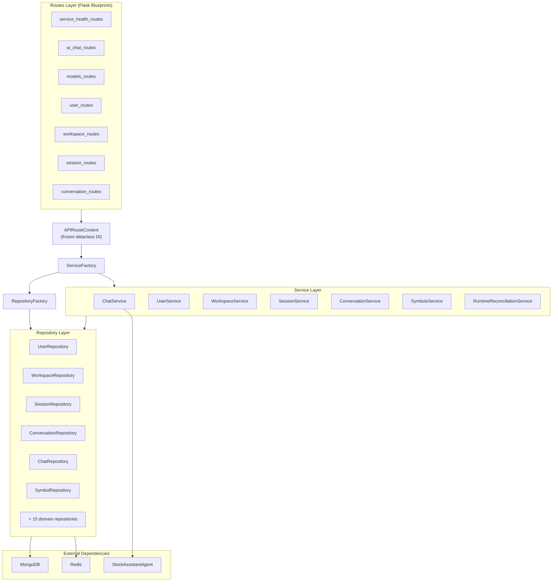
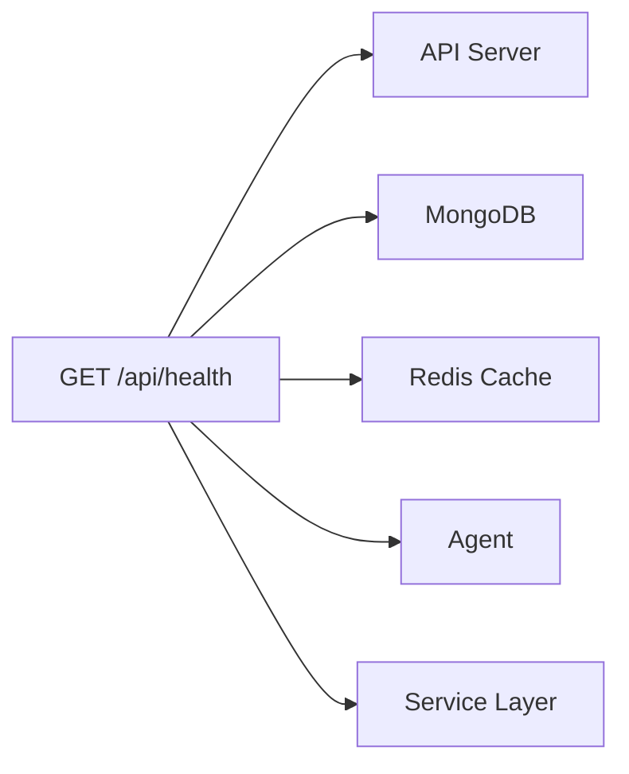

# Backend Domain — Technical Design

## 1. Document Control

| Field | Value |
|-------|-------|
| Project | DP Stock Investment Assistant |
| Document Type | Domain Technical Design |
| Domain | Backend |
| Standards Stance | Aligned design practice |
| Technology Stack | Python 3.8+, Flask 2.3+, Flask-SocketIO 5.3+, Gunicorn + Eventlet |
| Date | 2026-04-03 |
| Status | Initial draft — reflects current implemented architecture |
| Audience | Engineering, architecture, and technical documentation maintainers |

## 2. Domain Scope and Boundaries

### 2.1 What This Domain Owns

The backend domain owns the API surface layer, service orchestration, business workflows, and integration mediation between the frontend, agent, and data domains. Specifically:

- HTTP REST endpoints (Flask blueprints)
- SSE streaming delivery
- WebSocket real-time event handling (Socket.IO)
- Service-layer business logic
- Dependency injection and factory wiring
- Configuration loading and environment management
- Health check aggregation
- OpenAPI contract (executable, authoritative for schema shape)

### 2.2 What This Domain Does Not Own

- **AI reasoning and tool orchestration** — owned by the agent domain
- **Persistence schema and index policy** — owned by the data domain
- **UI rendering and client-side state** — owned by the frontend domain
- **Release and deployment policy** — owned by the operations domain
- **System-level requirements** — owned by the [master system SRS](../system/SYSTEM_REQUIREMENTS_SPECIFICATION.md)

### 2.3 Allocated Requirements

This domain is the **primary owner** for: SR-2 (Lifecycle), SR-5 (Streaming), SR-6 (Model Selection), SR-7 (Admin), SR-8 (Contracts), SNR-1 (Performance), SNR-3 (Security), SNR-5 (Observability), SNR-6 (Maintainability).

It is a **contributing domain** for nearly all other requirement families because the backend mediates cross-domain coordination.

## 3. Architecture Overview

### 3.1 Layered Architecture

The backend follows a strict three-layer architecture with factory-based dependency injection:

```
┌──────────────────────────────────────────────────┐
│  Routes Layer (Flask Blueprints)                  │
│  HTTP request handling, validation, response      │
│  formatting. No business logic.                   │
├──────────────────────────────────────────────────┤
│  Service Layer                                    │
│  Business logic, orchestration, cache policy,     │
│  health reporting. No HTTP or DB awareness.       │
├──────────────────────────────────────────────────┤
│  Repository Layer                                 │
│  Data access, MongoDB queries, cache reads/       │
│  writes. No business logic.                       │
└──────────────────────────────────────────────────┘
```

**Design rule**: Each layer depends only on the layer below it. Routes depend on services; services depend on repositories and protocols; repositories depend on database drivers.

### 3.2 Entry Points

| Entry Point | File | Use |
|-------------|------|-----|
| Local development | `src/main.py` | CLI runner with mode selection (cli/web/both) |
| Production WSGI | `src/wsgi.py` | Gunicorn with eventlet/gevent worker for WebSocket support |
| App factory | `src/web/api_server.py` | `APIServer` class — Flask app factory with blueprint registration and SocketIO setup |

### 3.3 Component Diagram



## 4. Routes Layer

### 4.1 Blueprint Organization

Each domain concern is implemented as a separate Flask blueprint, registered through the app factory (`APIServer`). All blueprints receive their dependencies through the immutable `APIRouteContext` dataclass.

| Blueprint | File | URL Prefix | Purpose |
|-----------|------|------------|---------|
| Health | `service_health_routes.py` | `/api/health` | Component health check aggregation |
| Chat | `ai_chat_routes.py` | `/api/chat` | Chat request handling, SSE streaming |
| Models | `models_routes.py` | `/api/models` | Model catalog, selection, default setting |
| Users | `user_routes.py` | `/api/users` | User profile CRUD |
| Workspaces | `workspace_routes.py` | `/api/workspaces` | Workspace lifecycle (CRUD, archive) |
| Sessions | `session_routes.py` | `/api/sessions` | Session lifecycle (CRUD, close, archive) |
| Conversations | `conversation_routes.py` | `/api/conversations` | Conversation lifecycle (CRUD, archive, summary) |

### 4.2 Dependency Injection Pattern

```python
@dataclass(frozen=True)
class APIRouteContext:
    app: Flask
    agent: StockAgent
    config: Mapping[str, Any]
    logger: Logger
    chat_service: Optional[ChatService] = None
    model_registry: Optional[OpenAIModelRegistry] = None
    service_factory: Optional[ServiceFactory] = None
    user_service: Optional[UserService] = None
```

Blueprints are created by factory functions that receive `APIRouteContext` and return a `Blueprint`. This pattern ensures:

- immutability (frozen dataclass prevents mutation after construction)
- testability (context can be constructed with mock dependencies)
- explicit dependencies (no global state or app-level singletons)

### 4.3 WebSocket Events

Socket.IO events are registered separately from HTTP blueprints through `SocketIOContext` and `register_chat_events()`. Event names are centralized in the frontend's `config.ts` (`API_CONFIG.WEBSOCKET.EVENTS`) to keep frontend and backend aligned.

### 4.4 Streaming Protocol

Chat responses are delivered via SSE using Flask `Response` + `stream_with_context`:

- Content-Type: `text/event-stream`
- Chunked transfer encoding
- Uses `batched()` from `service_utils.py` for controlled iteration
- The agent produces tokens; the backend routes them as SSE events; the frontend reads the `ReadableStream`

## 5. Service Layer

### 5.1 BaseService Contract

All services extend `BaseService` (`src/services/base.py`), which provides:

- `health_check() -> Tuple[bool, Dict[str, Any]]` — mandatory health reporting contract
- `LoggingMixin` — structured logging with component context
- `CacheBackend` integration — optional cache injection
- Time provider — injectable for deterministic testing

### 5.2 ServiceFactory

`ServiceFactory` (`src/services/factory.py`) centralizes dependency wiring:

- Receives `config`, `agent`, `repository_factory`, `cache_backend`, and `checkpointer`
- Produces singleton service instances via `get_<service>()` methods
- Each service receives only the repositories and dependencies it needs

### 5.3 Current Services

| Service | File | Key Responsibilities |
|---------|------|---------------------|
| `ChatService` | `chat_service.py` | Chat request processing, agent invocation, streaming orchestration |
| `UserService` | `user_service.py` | User profile management |
| `WorkspaceService` | `workspace_service.py` | Workspace CRUD, archival, user scoping |
| `SessionService` | `session_service.py` | Session lifecycle, context management, archival |
| `ConversationService` | `conversation_service.py` | Conversation lifecycle, message limits, archival, summary |
| `SymbolsService` | `symbols_service.py` | Stock symbol search and resolution |
| `RuntimeReconciliationService` | `runtime_reconciliation_service.py` | Operator-only drift detection (invoked via scripts, not routes) |

### 5.4 Cross-Service Dependencies

Services use **protocols** (`src/services/protocols.py`) for cross-service dependencies to avoid circular imports. For example, `ChatService` depends on `AgentProvider` protocol rather than importing `StockAssistantAgent` directly.

### 5.5 Cache Integration

- Services receive `CacheBackend` via constructor
- `CacheBackend` (`src/utils/cache.py`) auto-falls back to in-memory if Redis is unavailable
- Created via `CacheBackend.from_config(config)` for environment-aware setup
- TTL constants are defined as class attributes on each service (e.g., `WORKSPACE_CACHE_TTL = 300`)

## 6. Repository Layer

### 6.1 Base Repository

All repositories extend `MongoGenericRepository` (`src/data/repositories/mongodb_repository.py`), which provides:

- Standard CRUD operations (find, insert, update, delete)
- MongoDB connection management
- Collection-level schema validation
- Common query patterns

### 6.2 RepositoryFactory

`RepositoryFactory` (`src/data/repositories/factory.py`) centralizes repository creation:

- Singleton instances via `get_<repository>()` methods
- Shared MongoDB connection and configuration
- No ad-hoc database access outside of repositories

### 6.3 Current Repositories

The repository layer currently contains 20+ domain repositories covering users, workspaces, sessions, conversations, chats, symbols, portfolios, positions, watchlists, trades, market snapshots, technical indicators, notes, tasks, notifications, accounts, analysis, investment ideas, and Redis cache operations.

### 6.4 Repository Design Rules

1. All MongoDB access goes through repositories — no ad-hoc queries in routes or services
2. Use `db.command("listCollections")` for existence checks (not `list_collection_names()` — auth issues in restricted contexts)
3. Repository methods return domain objects or dictionaries, never raw cursors
4. Schema validation is applied at the MongoDB collection level via `src/data/schema/`

## 7. Configuration and Environment

### 7.1 Hierarchical Configuration Loading

`ConfigLoader` (`src/utils/config_loader.py`) loads configuration in this order:

1. Base YAML (`config/config.yaml`)
2. Environment overlay (`config.{APP_ENV}.yaml`) — `APP_ENV` values: `dev`, `local`, `k8s-local`, `staging`, `production`
3. Environment variable overrides — mode controlled by `CONFIG_ENV_OVERRIDE_MODE` (all/secrets-only/none)
4. Cloud secrets — optional Azure Key Vault (`USE_AZURE_KEYVAULT=true`)

### 7.2 Model Configuration

- `ModelClientFactory` creates cached provider-specific AI model clients
- Clients keyed by `{provider}:{model_name}` for cache efficiency
- Primary provider set via `config["model"]["provider"]` or `MODEL_PROVIDER` env var
- Per-request override via `provider` parameter on chat endpoints
- Fallback order configurable via `model.allow_fallback` and `model.fallback_order`

## 8. Health Check Architecture

The backend aggregates health from all critical components through the `/api/health` endpoint:



Each service implements `health_check() -> Tuple[bool, Dict[str, Any]]` per the `BaseService` contract. The health blueprint aggregates component reports into a single response with per-component status.

Container health probes use `GET /api/health` on port 5000 for both liveness and readiness.

## 9. Domain-Specific Constraints

### 9.1 Operator Boundary

Reconciliation and migration services are **operator-only**. They are invoked via scripts (`scripts/reconcile_stm_runtime.py`, `scripts/migrate_legacy_threads.py`), not through Flask routes. No reconciliation or migration blueprints should be added to the API server.

### 9.2 Streaming Constraint

The backend uses Gunicorn with eventlet (or gevent) workers for WebSocket and SSE support. Only **one worker** is used to avoid Socket.IO session affinity issues in single-instance deployments.

### 9.3 Contract Governance

Per Constitution Golden Rule 9, the OpenAPI contract must be updated in the same change set as any API surface change. The contract lives at `docs/domains/backend/api/openapi.yaml` (pending migration from `docs/openapi.yaml`).

## 10. Revision History

| Version | Date | Author | Notes |
|---------|------|--------|-------|
| 0.1 | 2026-04-03 | GitHub Copilot | Initial draft: documented current layered architecture, blueprint organization, service/repository patterns, DI model, configuration, health checks, and domain constraints based on implemented codebase |
