# Frontend Architecture Evolution Report

## Document Control

| Field | Value |
|-------|-------|
| Project | DP Stock Investment Assistant |
| Domain | AI-powered stock and investment assistant |
| Focus | Frontend evolution toward modularization or micro-frontend architecture |
| Date | 2026-03-20 |
| Status | Draft for technical review |
| Audience | Engineering, architecture, product, and platform stakeholders |

## 1. Executive Summary

This report evaluates whether the DP Stock Investment Assistant frontend should evolve into a micro-frontend architecture or remain a modularized frontend application.

The current recommendation is:

- Do not adopt a full micro-frontend architecture immediately.
- Adopt a modular monolith frontend first.
- Define clear architectural boundaries now so the application can transition to micro-frontends later if scale, team topology, or release independence demands it.

This recommendation is based on the current state of the project:

- The system already has service-level separation at the platform level: frontend, API, and agent are independently deployable.
- The frontend itself is still relatively small in feature surface and remains centered around a single chat-oriented SPA.
- The current implementation does not yet show the typical pressure signals that justify micro-frontends, such as many independent frontend teams, separate release cadences, strong domain isolation, or conflicting framework/runtime needs. This aligns with the commonly cited justification for micro-frontends: independently deliverable frontend applications owned by autonomous teams rather than simply a different folder structure or build setup ([Martin Fowler](https://martinfowler.com/articles/micro-frontends.html), [micro-frontends.org](https://micro-frontends.org/)).

For this finance and stock-assistant domain, the higher-value near-term move is stronger frontend modularization around business domains such as chat, market data, workspace, portfolio/watchlist, and model management. This yields most of the maintainability benefits without taking on the runtime, operational, and UX consistency costs of micro-frontends too early.

## 2. Problem Statement

The project needs architectural clarity on how the frontend should evolve as product scope grows. The central question is whether the frontend should continue as a single SPA with better internal structure, or move toward a micro-frontend model.

The decision must consider:

- The finance-oriented product domain.
- User experience expectations for a stock and investment assistant.
- Current codebase maturity and technical constraints.
- Future scale in features, teams, and deployments.
- The cost of architectural complexity relative to business value.

## 3. Current Project Context

### 3.1 Existing Frontend State

Based on the current repository:

- The frontend is a React 18 SPA using TypeScript, with Create React App as the build system. This matters because the official Create React App site now explicitly states that Create React App has been deprecated and points users to modern alternatives on React.dev ([Create React App](https://create-react-app.dev/)).
- The UI is centered primarily around a single root application component and chat workflow.
- Data access is organized through lightweight service wrappers for REST, model APIs, and Socket.IO/WebSocket communication.
- There is no route-driven product area decomposition yet.
- State management remains mostly local to the root app and components.
- Some frontend implementation details are still transitional, including mixed JavaScript and TypeScript files and duplicated service concerns.

### 3.2 Existing System-Level Architecture

The broader system already follows a distributed architecture pattern:

- Frontend is independently deployable.
- API and agent are already separate backend concerns.
- Real-time communication exists through SSE and Socket.IO.
- Infrastructure already supports containerized deployment and Kubernetes/Helm-based scaling.

This is important because the platform already has backend service decomposition. The main architectural question is not whether the whole product is distributed, but whether the frontend itself should now be further decomposed into separately owned and possibly separately deployed UI applications.

### 3.3 Domain Characteristics

This product is not a generic content website. It is a finance-focused assistant with the following traits:

- High emphasis on trust, clarity, and consistency.
- Real-time or near-real-time interaction patterns.
- Cross-feature workflows, where chat, market data, model selection, watchlists, and workspaces are naturally connected.
- Potential need for strict UX consistency and later auditability in decisions, prompts, outputs, and user actions.
- Sensitivity to latency, state continuity, and operational reliability.

These traits matter because they increase the cost of fragmented UI architecture if boundaries are poorly chosen.

## 4. Architectural Options Considered

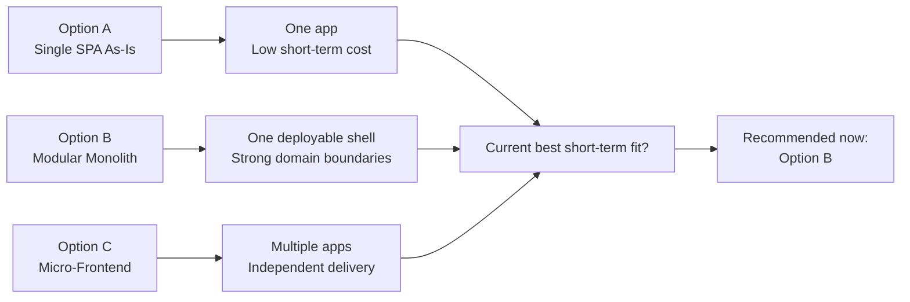

Caption: Option comparison at a conceptual level. The framing of micro-frontends as independently deliverable applications and the contrast with a single-container model is based on [Martin Fowler](https://martinfowler.com/articles/micro-frontends.html) and [micro-frontends.org](https://micro-frontends.org/).

### 4.1 Option A: Continue as a Single SPA Without Structural Changes

Description:

- Keep the current application as one deployable frontend.
- Continue adding features directly to the same React application structure.

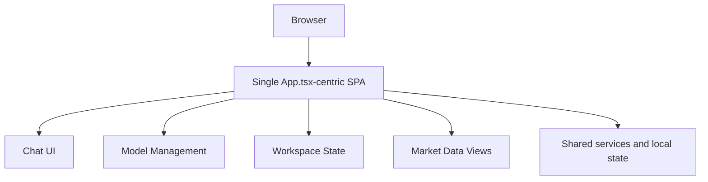

Caption: Option A reflects the current state described by the repository review: one main SPA with centralized state and shared services. This section is intentionally repo-specific; no external source is needed for the structural picture.

Assessment:

- Lowest short-term cost.
- Highest long-term risk of frontend monolith sprawl.
- Increases coupling in UI, state, services, and feature ownership.

Conclusion:

- Not recommended.

### 4.2 Option B: Modular Monolith Frontend

Description:

- Keep one deployable frontend.
- Organize the codebase by business domain and enforce module boundaries internally.
- Centralize shell, design system, auth/session handling, observability, and shared contracts.
- Decompose features into domain modules rather than separately deployed apps.

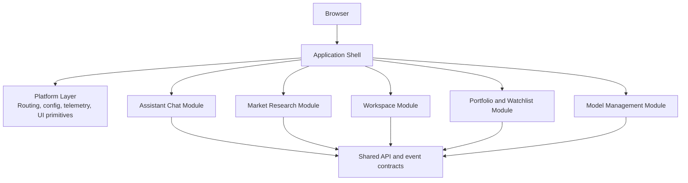

Caption: Option B follows a single-shell, bounded-module model, combining shared platform concerns with explicit domain boundaries. This is consistent with React guidance for scaling state and wiring through providers and contexts ([React](https://react.dev/learn/scaling-up-with-reducer-and-context)) while preserving the central shell pattern commonly discussed in [Martin Fowler](https://martinfowler.com/articles/micro-frontends.html).

Assessment:

- Best fit for current scale.
- Improves maintainability, testability, and future migration readiness. This direction is also consistent with React guidance on scaling complex screens by separating state wiring and providing structured shared state through reducer and context patterns instead of pushing everything through a single root component ([React: Scaling Up with Reducer and Context](https://react.dev/learn/scaling-up-with-reducer-and-context)).
- Preserves UX consistency and avoids premature distributed frontend complexity.

Conclusion:

- Recommended as the target near-term architecture.

### 4.3 Option C: True Micro-Frontend Architecture

Description:

- Split the frontend into multiple independently owned applications.
- Compose them through runtime or build-time integration, such as module federation, route composition, or edge/server composition. These are established patterns in the micro-frontend literature and ecosystem guidance, including runtime composition, server-side composition, and module federation-based sharing ([Martin Fowler](https://martinfowler.com/articles/micro-frontends.html), [Module Federation](https://module-federation.io/guide/start/)).
- Allow domain teams to ship parts of the UI independently.

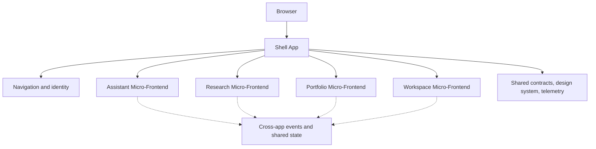

Caption: Option C shows a container plus independently delivered frontend slices, which aligns with the core micro-frontend definition and composition models described by [Martin Fowler](https://martinfowler.com/articles/micro-frontends.html), [micro-frontends.org](https://micro-frontends.org/), and [Module Federation](https://module-federation.io/guide/start/).

Assessment:

- Valuable only when organizational and domain pressures are strong enough.
- Introduces significant integration, governance, performance, and consistency overhead.

Conclusion:

- Not recommended now.
- Should remain a future option with explicit trigger criteria.

## 5. Domain Fit Analysis: Why Apply This Architecture or Not

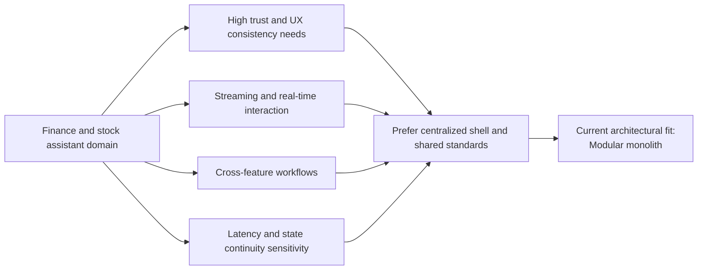

Caption: Domain-fit model synthesized from product constraints in this repository and general micro-frontend tradeoff guidance from [Martin Fowler](https://martinfowler.com/articles/micro-frontends.html) and [micro-frontends.org](https://micro-frontends.org/).

### 5.1 Why a Micro-Frontend Can Be Attractive for This Domain

There are legitimate reasons why finance platforms sometimes move toward micro-frontends. The strongest ones are usually organizational and release-oriented, not purely technical: autonomous teams, independently deployable frontend slices, and incremental upgrades of isolated areas ([Martin Fowler](https://martinfowler.com/articles/micro-frontends.html)).

- Distinct domains can emerge clearly over time: assistant chat, portfolio intelligence, watchlists, market dashboards, research workspace, notification center, and admin operations.
- Different teams may need to ship independently and on different schedules.
- Certain areas may require higher change velocity, such as AI chat and experimentation surfaces, while portfolio or compliance-oriented screens may need stricter control.
- Feature surfaces may eventually become large enough that one frontend deployment becomes a coordination bottleneck.

If the product grows into a broad investment workbench with many independently evolving surfaces, micro-frontends could become justified.

### 5.2 Why a Micro-Frontend Is Not the Best Immediate Fit

For the current project, the architecture appears too early for a full micro-frontend move.

Reasons:

- The frontend is still comparatively compact and centered on one primary user journey.
- Cross-domain workflows are still tightly connected rather than naturally separable.
- The codebase currently needs stronger internal modularity before it would benefit from distributed ownership.
- Finance products pay a high penalty for inconsistent UX, duplicated state logic, and fragmented reliability behavior.
- Runtime composition adds latency, dependency coordination, and operational failure modes that are hard to justify for the current scope. These tradeoffs are well-documented in micro-frontend guidance, especially around payload duplication, environment drift, and governance complexity ([Martin Fowler](https://martinfowler.com/articles/micro-frontends.html), [micro-frontends.org](https://micro-frontends.org/)).

### 5.3 Why Modularization Is the Better Domain Fit Now

For a stock-assistant application, users benefit most from:

- A single coherent product shell.
- Consistent interaction patterns across assistant, data, and workspace features.
- Shared user/session state.
- Unified telemetry and error handling.
- Predictable performance during streaming and data-refresh workflows.

These are better served today by a modular monolith frontend with strong internal domain boundaries.

This also fits React's recommended scaling approach for growing applications: move state wiring into dedicated providers, contexts, and hooks as the tree becomes more complex, rather than immediately distributing the application into separately deployed frontends ([React: Scaling Up with Reducer and Context](https://react.dev/learn/scaling-up-with-reducer-and-context)).

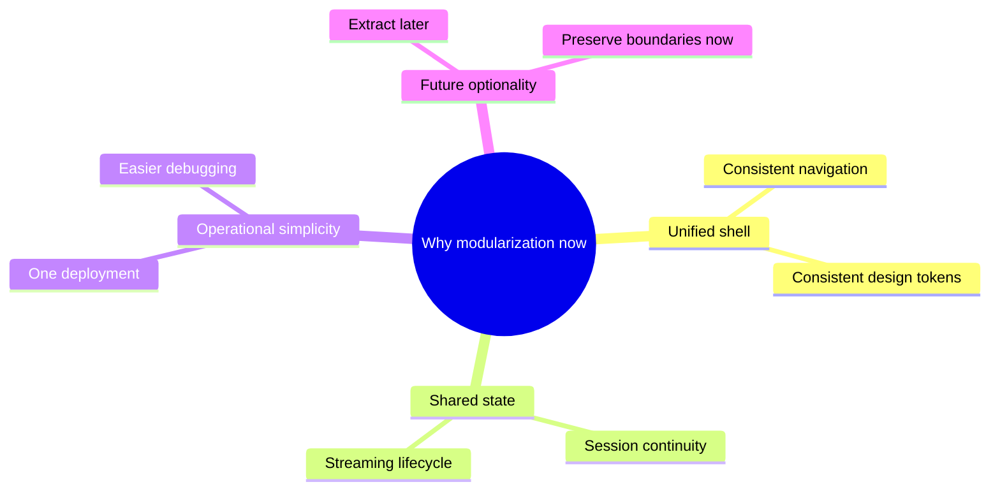

Caption: The rationale here maps local project constraints to React’s recommended scaling model for stateful applications and to micro-frontend guidance that emphasizes explicit boundaries before independent extraction ([React](https://react.dev/learn/scaling-up-with-reducer-and-context), [Martin Fowler](https://martinfowler.com/articles/micro-frontends.html)).

## 6. Benefits and Disadvantages

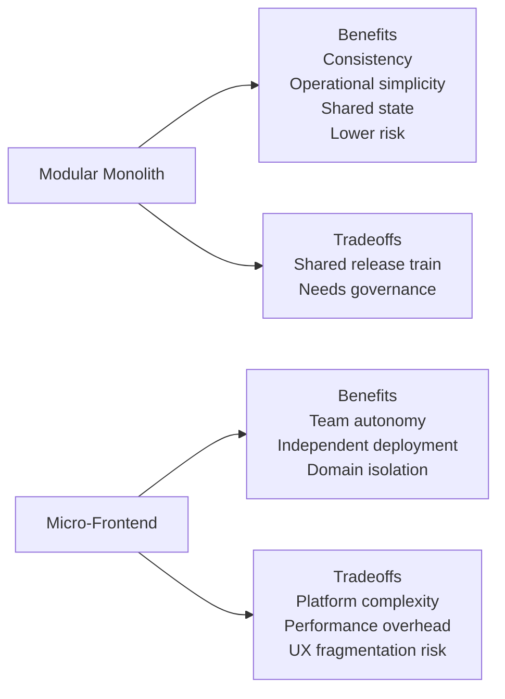

### 6.1 Benefits of Modularization First

- Lower architecture risk while still improving maintainability.
- One deployment artifact, simpler CI/CD, and lower operational overhead.
- Easier enforcement of a consistent design system and interaction model.
- Better control over shared session state, streaming state, caching, and notifications.
- Easier testing and debugging compared to distributed frontend composition.
- Cleaner path to future micro-frontends because domain seams become explicit.

This follows the same incremental-upgrade logic often described in micro-frontend adoption: strengthen boundaries first, then extract only when the benefits of independence outweigh the overhead ([Martin Fowler](https://martinfowler.com/articles/micro-frontends.html)).

### 6.2 Disadvantages of Modularization First

- Teams still coordinate through one deployable frontend.
- Release independence is limited compared to true micro-frontends.
- Strong governance is still required to stop the modular monolith from collapsing back into a code monolith.

### 6.3 Benefits of Micro-Frontends

- Independent deployment by domain team.
- Better team autonomy when domains are mature and stable.
- Ability to evolve certain areas faster without coupling all frontend releases.
- Can isolate high-change experimental areas from highly stable or regulated ones.
- Useful when product scope becomes much broader than a single coherent SPA can comfortably support.

### 6.4 Disadvantages of Micro-Frontends

- More complex frontend platform engineering.
- Harder to maintain consistent UX, accessibility, navigation, and design tokens.
- Increased bundle duplication and runtime performance risk.
- Harder cross-cutting observability, analytics, auth/session, and error handling.
- More difficult local development and integration testing.
- Greater risk of boundary mistakes, where features are split by team convenience rather than user workflow reality.

Those concerns are directly reflected in established guidance: Martin Fowler highlights payload size, environment differences, and operational/governance complexity as core downsides, while micro-frontends.org explicitly warns against "micro frontends anarchy" and recommends clear contracts, namespacing, and limited cross-app coupling ([Martin Fowler](https://martinfowler.com/articles/micro-frontends.html), [micro-frontends.org](https://micro-frontends.org/)).

## 7. Technical Architecture Viewpoint

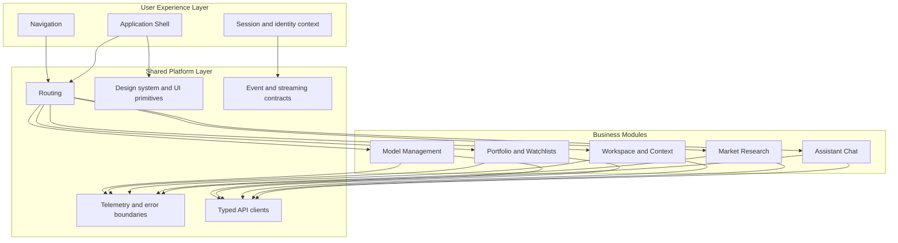

Caption: Target-state architecture for the recommended modular application approach. Shared shell ownership and explicit cross-cutting platform concerns are consistent with [React](https://react.dev/learn/scaling-up-with-reducer-and-context) for internal app scaling and [Martin Fowler](https://martinfowler.com/articles/micro-frontends.html) for future extraction seams.

### 7.1 Recommended Target State

Recommended target state for the next phase:

- One application shell.
- One deployment unit.
- Multiple domain modules with enforceable boundaries.
- Shared platform layer for configuration, routing, design system, auth/session, telemetry, API clients, and event contracts.

### 7.2 Suggested Domain Modules

The current project can be organized into modules such as:

1. Assistant Chat
2. Market Data and Research
3. Workspace and Conversation Context
4. Portfolio and Watchlists
5. Model Management and AI Settings
6. Shared Platform and UI Shell

Each module should own:

- Components
- Feature hooks
- Service adapters
- Types and view models
- Tests
- Route entries where applicable

Each module should avoid reaching into another module's internals directly.

### 7.3 Architectural Principles for the Frontend

- Domain-first folder structure rather than technical-only folder structure.
- Shared platform concerns separated from business features.
- Route-based and feature-based code splitting.
- Typed contracts for frontend-backend integration.
- Shared event schema for streaming, notifications, and telemetry.
- Stable module interfaces so future extraction is feasible.

The emphasis on explicit interfaces and minimal coupling matches micro-frontend guidance to communicate through narrow contracts, routing, DOM events, or container-defined APIs instead of broad shared state models ([Martin Fowler](https://martinfowler.com/articles/micro-frontends.html), [micro-frontends.org](https://micro-frontends.org/)).

### 7.4 Preferred Integration Model If Micro-Frontends Are Needed Later

If the project eventually crosses the threshold where micro-frontends are justified, prefer a staged model:

- Start with route-level composition, not widget-level fragmentation.
- Keep the application shell, auth/session, design system, and navigation centralized.
- Extract only domains with low shared-state coupling and clear ownership.
- Favor build-time or controlled runtime federation only where operationally justified.

This avoids the common failure mode where every feature becomes a separate app and the user experiences the product as fragmented.

This is consistent with common container-based micro-frontend patterns where the shell owns navigation and cross-cutting concerns, while feature areas are mounted through route-based composition or runtime integration contracts ([Martin Fowler](https://martinfowler.com/articles/micro-frontends.html)). Module Federation is relevant here as an implementation option, but its own guidance positions it mainly for large, multi-team, decentralized applications rather than as a default for smaller frontends ([Module Federation](https://module-federation.io/guide/start/)).

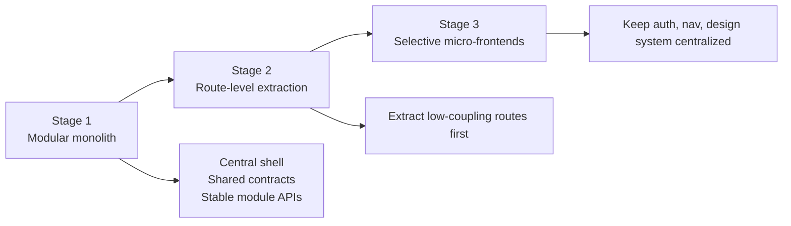

Caption: Preferred extraction sequence if the application later needs micro-frontends. This aligns with container-led composition and route-driven integration patterns discussed by [Martin Fowler](https://martinfowler.com/articles/micro-frontends.html).

## 8. Proposed Application to the Current Project

### 8.1 Immediate Refactoring Direction

Apply a modularization strategy to the existing frontend first.

Recommended actions:

- Replace root-heavy app logic with domain features and shared shell components.
- Move from generic `components/` and `services/` growth toward domain-based folders.
- Introduce route structure even if the first routes are shallow.
- Consolidate API client patterns and remove duplicated service responsibilities.
- Standardize TypeScript contracts across all feature areas.
- Establish a shared design/token layer for finance-grade consistency.

### 8.2 Example Target Structure

```text
frontend/src/
  app/
    shell/
    routing/
    providers/
  platform/
    api/
    config/
    events/
    telemetry/
    ui/
  modules/
    assistant-chat/
      components/
      hooks/
      services/
      types/
    market-research/
      components/
      hooks/
      services/
      types/
    workspace/
      components/
      hooks/
      services/
      types/
    portfolio-watchlist/
      components/
      hooks/
      services/
      types/
    model-management/
      components/
      hooks/
      services/
      types/
```

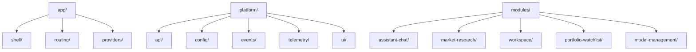

Caption: Suggested repo-level structure for a modular application. The layout is project-specific, while the principle of separating shared platform concerns from domain concerns is supported by [React](https://react.dev/learn/scaling-up-with-reducer-and-context).

### 8.3 Technical Guardrails

To keep the modular monolith healthy:

- Define import rules and ownership rules.
- Keep shared utilities in a controlled platform layer, not a dumping ground.
- Require every module to expose a public API surface.
- Isolate backend contract code and avoid ad hoc fetch logic throughout the UI.
- Add route-level lazy loading for domains.
- Add test coverage at module boundaries.

These guardrails mirror external guidance as well: micro-frontends.org recommends namespacing, explicit contracts, and native browser events over opaque global APIs, while React guidance for larger trees favors moving wiring into providers and custom hooks so feature components stay focused on rendering behavior ([micro-frontends.org](https://micro-frontends.org/), [React: Scaling Up with Reducer and Context](https://react.dev/learn/scaling-up-with-reducer-and-context)).

## 9. Option B Deep Dive: Modular Application Architecture

This section turns Option B from a directional recommendation into a concrete near-term architecture proposal for this repository.

### 9.0 Research Summary: What Pattern Is This in Practice?

Based on the current repository and the referenced architecture guidance, the recommended near-term pattern is not just "modularization" in the abstract. In practice, it is best described as:

- a modular monolith frontend
- implemented as a feature-modular React SPA
- with bounded internal modules behind one application shell
- and designed for possible future extraction, but not current independent deployment

In other words, this is a monolith-first frontend strategy with strong internal modularity. That distinction matters.

Research-backed interpretation:

- Martin Fowler's monolith-first guidance argues that coarse-grained systems are often the safer starting point because boundaries are hard to get right early, and decomposition becomes realistic only when modular seams are intentionally preserved ([Monolith First](https://martinfowler.com/bliki/MonolithFirst.html)).
- React's own scaling guidance recommends moving state and wiring into providers, contexts, reducers, and custom hooks as applications grow, which fits a modular-internal architecture more naturally than jumping to independently deployed frontends ([React: Scaling Up with Reducer and Context](https://react.dev/learn/scaling-up-with-reducer-and-context)).
- Micro-frontend literature defines the stronger form of decomposition as independently deliverable frontend applications composed into a greater whole. That is explicitly beyond what this repository currently needs, but it is the natural future extension if team and release pressure increase enough ([Martin Fowler](https://martinfowler.com/articles/micro-frontends.html)).

For this project's technical stack, the most accurate pattern label is:

`bounded-context modular SPA with a shared shell and shared platform layer`

That means:

- React remains the single runtime.
- Routing remains centralized.
- Shared providers and platform services stay in one deployable application.
- Business areas are separated by module boundaries rather than by deployment boundaries.

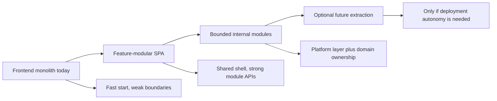

Caption: Research framing for Option B. This path aligns with monolith-first boundary discovery ([Monolith First](https://martinfowler.com/bliki/MonolithFirst.html)), React’s internal application scaling model ([React](https://react.dev/learn/scaling-up-with-reducer-and-context)), and the distinction between modularization and true micro-frontends ([Martin Fowler](https://martinfowler.com/articles/micro-frontends.html)).

### 9.0.1 Pattern Classification for This Repository

| Dimension | Recommended Form in This Project | Why |
|----------|----------------------------------|-----|
| Structural pattern | Modular monolith frontend | One deployable app, multiple internal feature modules |
| Decomposition style | Package-by-feature / bounded context | Better fit than technical-layer-only folders |
| Integration style | Route composition inside a shared shell | Matches current SPA shape and React Router model |
| State model | Shared shell state plus module-local state | Fits current app size and streaming workflow needs |
| Server-state handling | Shared async cache and typed API layer | Prevents ad hoc fetch logic duplication |
| Evolution strategy | Monolith-first, extract later | Boundaries are not yet mature enough for micro-frontends |

### 9.0.2 Why This Pattern Fits the Current Technical Stack

The current stack makes this pattern practical without excessive disruption:

- React 18 already supports composition through providers, hooks, and route-level assembly.
- The frontend is still a single SPA, so introducing feature modules is structurally simpler than introducing multiple independently deployed applications.
- SSE/streaming chat, shared session behavior, and model selection all benefit from a coherent shell and shared contracts.
- Vite, React Router, and TanStack Query are complementary choices for a modular application because they map well to shell bootstrapping, route composition, and server-state orchestration respectively ([Vite](https://vite.dev/guide/), [React Router](https://reactrouter.com/start/declarative/installation), [TanStack Query](https://tanstack.com/query/latest/docs/framework/react/overview)).

### 9.1 Proposed Architecture

The recommended architecture is a modular application with one deployable frontend shell and several strongly bounded feature modules.

Architectural characteristics:

- One React application shell owns app bootstrapping, navigation, layout, error boundaries, telemetry, and environment configuration.
- Business capabilities are implemented as internal modules with explicit public APIs.
- Shared infrastructure concerns live in a platform layer, not inside feature modules.
- Route composition is used to assemble feature modules without turning each route into an independently deployed application.
- Stateful cross-cutting concerns are centralized only where necessary: session, route state, streaming lifecycle, notification orchestration, and feature flags.

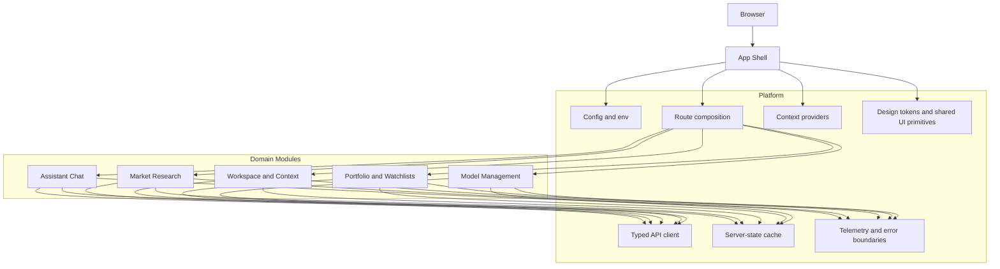

Caption: Deep-dive target for Option B. The route-composed shell plus shared providers model is consistent with [React Router](https://reactrouter.com/start/declarative/installation), [React state scaling guidance](https://react.dev/learn/scaling-up-with-reducer-and-context), and the need to preserve extraction seams emphasized by [Martin Fowler](https://martinfowler.com/articles/micro-frontends.html).

### 9.2 Proposed Technical Stack

Recommended near-term stack for the modular application:

| Concern | Proposed Choice | Why |
|-------|------------------|-----|
| Build tool | [Vite](https://vite.dev/guide/) | Faster and leaner modern development experience; strong plugin model; better long-term fit than deprecated CRA |
| UI framework | React 18 + TypeScript | Already aligned with the repo and avoids unnecessary migration risk |
| Routing | [React Router](https://reactrouter.com/start/declarative/installation) | Clear route-based composition for domain modules |
| Server state | [TanStack Query](https://tanstack.com/query/latest/docs/framework/react/overview) | Strong support for fetching, caching, synchronization, invalidation, and async server-state concerns |
| Local app state | React Context + `useReducer` + feature hooks | Fits current app scale and React’s own scaling guidance |
| Styling foundation | CSS variables + shared UI primitives in `platform/ui` | Enables consistent token governance without forcing premature heavy framework adoption |
| Testing direction | Keep component and module-boundary tests close to modules | Supports modular boundaries and future extraction readiness |

Technical rationale:

- Vite is a better modernization target than Create React App because the CRA project is now officially deprecated, while Vite explicitly targets a faster and leaner modern development experience ([Create React App](https://create-react-app.dev/), [Vite](https://vite.dev/guide/)).
- React Router provides a straightforward route-composition foundation for a modular app shell, which is directly aligned with the recommended decomposition model ([React Router](https://reactrouter.com/start/declarative/installation)).
- TanStack Query is a strong fit for this repository because the application already depends on streaming, fetch orchestration, cache freshness, and server-state-heavy screens, which are exactly the concerns TanStack Query is designed to address ([TanStack Query](https://tanstack.com/query/latest/docs/framework/react/overview)).
- Context and reducer-based feature providers are sufficient for the current frontend size and map cleanly to the intended shell-plus-modules design ([React](https://react.dev/learn/scaling-up-with-reducer-and-context)).

### 9.3 Solution Design

Recommended solution design layers:

1. App shell
2. Platform layer
3. Domain modules
4. Contract boundaries

App shell responsibilities:

- Mount root providers.
- Initialize router.
- Register error boundaries.
- Provide global layout, top navigation, status surfaces, and notifications.
- Handle session bootstrap and feature-flag bootstrap.

Platform layer responsibilities:

- Centralized API client setup.
- Shared query client and async cache policy.
- Shared UI primitives and tokens.
- Logging, telemetry, tracing hooks, and safe error formatting.
- Event contracts for streaming, notifications, and background updates.

Domain module responsibilities:

- Own screens, components, feature hooks, view models, and adapters for one business area.
- Expose only public entry points.
- Avoid importing internals from sibling modules.
- Depend on `platform/*` and local module internals, not on other module internals.

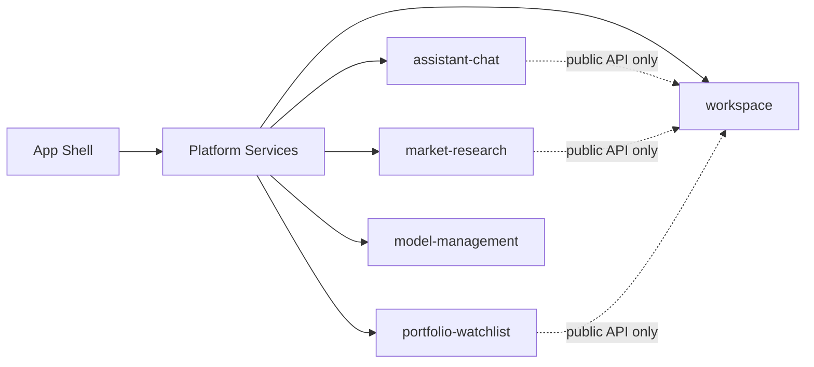

Caption: Solution design view for Option B. The separation of providers, platform services, and feature modules follows the same modular scaling principles described in [React](https://react.dev/learn/scaling-up-with-reducer-and-context).

### 9.3.1 Pros, Cons, and Strategy Tradeoffs

Research synthesis for the modular application strategy in this repository:

| Area | Advantages | Tradeoffs |
|------|------------|-----------|
| Delivery | Faster than distributed frontend decomposition; fewer operational moving parts | Teams still coordinate through one release unit |
| Architecture | Stronger internal boundaries, better cohesion, easier refactoring inside one codebase | Requires discipline to stop shared layers from becoming dumping grounds |
| UX | Easier consistency in navigation, tokens, accessibility, and interaction design | Risk of shell over-centralization if every feature depends on global state |
| State | Easier to share session, streaming lifecycle, and notification behavior | Cross-module state can become tangled if contracts are weak |
| Tooling | One runtime and one deployment artifact reduce platform overhead | Build times and bundle size still need governance as scope grows |
| Future evolution | Extraction remains possible if seams are protected | Extraction becomes difficult if modules are only cosmetic folders |

Pros emphasized by the research:

- Monolith-first reduces the upfront complexity premium of distributed architectures, which Fowler highlights as a major reason to avoid premature decomposition ([Monolith First](https://martinfowler.com/bliki/MonolithFirst.html)).
- Internal modularity creates space to learn where real business boundaries are before those boundaries become expensive to change across deployed systems ([Monolith First](https://martinfowler.com/bliki/MonolithFirst.html)).
- React's provider and hook model supports this kind of structured internal scaling well, particularly when state wiring is moved out of root components and into dedicated providers and reusable hooks ([React](https://react.dev/learn/scaling-up-with-reducer-and-context)).
- TanStack Query is especially helpful when the application has meaningful server-state concerns, because it separates remote data synchronization concerns from local UI state ([TanStack Query](https://tanstack.com/query/latest/docs/framework/react/overview)).

Cons emphasized by the research:

- A modular monolith does not automatically deliver team autonomy in the same way independent deployment does.
- It is easy to claim modularity while still creating hidden coupling through shared state, shared domain models, or uncontrolled imports.
- If boundaries are poorly enforced, the codebase remains a monolith in both structure and behavior, just with more folders.

### 9.3.2 Regular Pitfalls of the Modular Application Pattern

The most common failure modes for this strategy are not technical impossibilities. They are governance failures.

Regular pitfalls:

1. Folder modularity without behavioral modularity
2. Shared platform layer turning into a dumping ground
3. Cross-module imports bypassing public APIs
4. Global state spreading into unrelated features
5. Shared UI libraries absorbing domain logic too early
6. No ownership rules for modules and contracts
7. Route composition existing in name only, while root components still coordinate everything

Why these pitfalls matter here:

- Martin Fowler's micro-frontend guidance repeatedly stresses that architecture benefits come from explicit boundaries and contracts, not from high-level labels alone ([Martin Fowler](https://martinfowler.com/articles/micro-frontends.html)).
- micro-frontends.org warns about "micro frontends anarchy"; the same warning applies one level earlier to modular monoliths if naming, ownership, and contracts are not enforced ([micro-frontends.org](https://micro-frontends.org/)).
- Shared component or platform code becomes dangerous when it absorbs domain logic too early, another issue highlighted in Fowler's discussion of shared component libraries and harvested platform evolution ([Martin Fowler](https://martinfowler.com/articles/micro-frontends.html)).

Recommended countermeasures:

- Enforce public module entry points.
- Define import direction rules.
- Keep domain logic inside domain modules.
- Keep shared UI primitives genuinely generic.
- Use provider-scoped state for domain clusters, not one all-knowing global store.
- Review module boundaries during every significant feature addition.

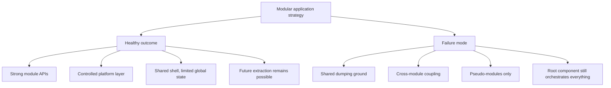

Caption: Practical success and failure patterns for modular applications. The good path reflects monolith-first discipline and explicit module boundaries; the bad path reflects the same coupling and governance problems warned about in [Martin Fowler](https://martinfowler.com/articles/micro-frontends.html), [Monolith First](https://martinfowler.com/bliki/MonolithFirst.html), and [micro-frontends.org](https://micro-frontends.org/).

### 9.4 How to Architecturally Shift to This Approach

The shift should be evolutionary, not a rewrite.

Recommended transition method:

1. Stabilize existing code paths.
2. Introduce the shell and platform layers.
3. Extract domain modules from the existing SPA incrementally.
4. Move route ownership to modules.
5. Add enforcement rules for imports and ownership.

Concrete repo-oriented shift steps:

- Step 1: Move current bootstrapping concerns into `app/`.
- Step 2: Move config, API client code, telemetry helpers, and shared UI tokens into `platform/`.
- Step 3: Extract the current chat workflow into `modules/assistant-chat/`.
- Step 4: Extract model selection and model settings into `modules/model-management/`.
- Step 5: Introduce route structure for future research, portfolio, and workspace screens.
- Step 6: Replace direct component-side fetch logic with platform APIs and shared server-state handling.

This is intentionally similar to the strangler-style migration pattern often recommended for architecture evolution: preserve working paths, create stable seams, and migrate one bounded area at a time instead of performing a broad rewrite ([Martin Fowler](https://martinfowler.com/articles/micro-frontends.html)).

### 9.5 Evolution Plan to Achieve the Modular Application Architecture

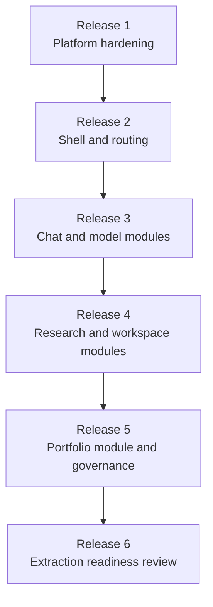

Caption: Option B evolution plan. The sequence prioritizes stable module seams first, then extraction readiness, which is consistent with [Martin Fowler](https://martinfowler.com/articles/micro-frontends.html).

Suggested release-oriented progression:

| Stage | Objective | Key Deliverables |
|------|-----------|------------------|
| Stage 1 | Foundation hardening | Vite migration plan, centralized config, unified API client, root cleanup |
| Stage 2 | Shell introduction | App shell, route scaffolding, shared providers, error boundaries |
| Stage 3 | First module extraction | Assistant chat module and model-management module |
| Stage 4 | Domain expansion | Workspace and market-research modules with route ownership |
| Stage 5 | Governance hardening | Import rules, public module APIs, module-boundary tests, design-token ownership |
| Stage 6 | Readiness review | Coupling analysis, deployment pressure review, extraction decision gate |

The success condition is not "many modules exist". The success condition is:

- the shell is stable,
- feature modules own coherent business areas,
- shared platform code is controlled,
- cross-module imports are disciplined,
- and future extraction is possible without redesigning the frontend from scratch.

### 9.6 ADR Companion Statement

The standalone ADR is maintained in [adr-frontend-001-modular-application.md](./adr-frontend-001-modular-application.md).

The following ADR-style statement formalizes the near-term architectural decision.

**ADR-Frontend-001: Adopt a Modular Application Frontend Before Any Micro-Frontend Decomposition**

Status:

- Proposed

Date:

- 2026-03-24

Context:

- The current frontend is a single React SPA with growing feature scope.
- The product domain requires high UX consistency, trusted interaction patterns, shared session behavior, and predictable streaming workflows.
- The system does not yet have the team topology, release pressure, or domain stability that typically justify independently deployed frontend applications.
- The current codebase would benefit more from explicit internal boundaries than from deployment-time decomposition.

Decision:

- Adopt a modular application architecture for the frontend.
- Keep one deployable frontend shell.
- Organize the codebase around bounded feature modules and a controlled platform layer.
- Use route composition, shared providers, and typed platform services as the primary integration mechanism.
- Defer micro-frontend extraction until explicit readiness triggers are met.

Rationale:

- This follows monolith-first reasoning: discover stable boundaries before making them expensive to move across deployment units ([Monolith First](https://martinfowler.com/bliki/MonolithFirst.html)).
- It aligns with React guidance for scaling larger applications internally through providers, reducers, contexts, and custom hooks ([React](https://react.dev/learn/scaling-up-with-reducer-and-context)).
- It preserves future optionality because the architecture is designed to expose stable seams for later extraction if organizational need appears.

Consequences:

- Positive:
  - Lower near-term architectural risk
  - Faster modernization path from the current SPA
  - Better UX consistency and shared-state control
  - Reduced platform overhead compared to micro-frontends
- Negative:
  - Independent frontend deployment is deferred
  - Governance discipline is required to maintain true module boundaries
  - Build and release remain centralized until readiness changes

Decision triggers for reconsideration:

- Three or more frontend teams require release autonomy.
- Shared release cadence becomes a measurable delivery bottleneck.
- Domain boundaries remain stable across multiple release cycles.
- Module APIs and platform governance are mature enough to support extraction safely.

Implementation note:

- The target implementation pattern is a bounded-context modular SPA with shared shell, route composition, provider-based internal state scaling, and shared server-state orchestration.

This ADR companion is supported by the same evidence used throughout this report: [Monolith First](https://martinfowler.com/bliki/MonolithFirst.html), [Martin Fowler: Micro Frontends](https://martinfowler.com/articles/micro-frontends.html), [React](https://react.dev/learn/scaling-up-with-reducer-and-context), [Vite](https://vite.dev/guide/), [React Router](https://reactrouter.com/start/declarative/installation), and [TanStack Query](https://tanstack.com/query/latest/docs/framework/react/overview).

## 10. Adoption Roadmap

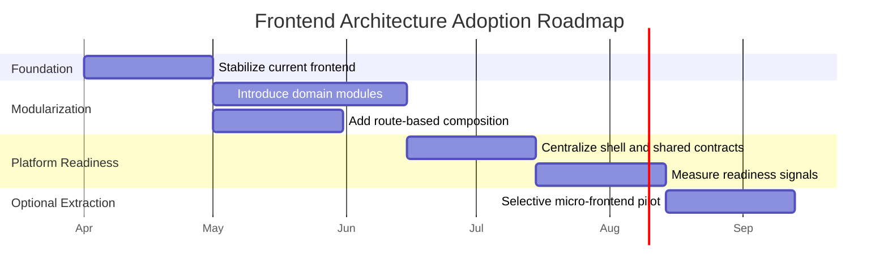

Caption: High-level adoption roadmap for the modular application path first, optional extraction later. Timeline is project-specific; the staged logic is consistent with [Martin Fowler](https://martinfowler.com/articles/micro-frontends.html).

### Phase 1: Stabilize the Current Frontend

Objective:

- Remove friction that would block any future architecture work.

Actions:

- Consolidate duplicate frontend service code.
- Finish TypeScript alignment.
- Reduce root component size and move logic into hooks and feature components.
- Establish shared API client and error handling patterns.
- Introduce route scaffolding and shell layout.

Expected outcome:

- Cleaner baseline for modularization.

### Phase 2: Modular Monolith by Business Domain

Objective:

- Reorganize the frontend around stable product domains.

Actions:

- Create domain modules for assistant, research, workspace, portfolio/watchlist, and model management.
- Add explicit public module interfaces.
- Move to route-based feature loading.
- Introduce design tokens and shared UI primitives.
- Add frontend telemetry and error boundaries at module level.

Expected outcome:

- Strong internal boundaries with one deployable app.

### Phase 3: Platform Readiness for Future Extraction

Objective:

- Prepare for selective extraction without committing to it yet.

Actions:

- Centralize shell, auth/session, navigation, analytics, and event contracts.
- Measure bundle size and domain-specific change frequency.
- Introduce dependency governance for shared packages.
- Identify domains with the lowest coupling and highest independent change rate.

Expected outcome:

- Evidence-based readiness model for micro-frontends.

### Phase 4: Selective Micro-Frontend Extraction Only If Needed

Objective:

- Extract only when measurable organizational and technical thresholds are met.

Entry criteria:

- Multiple frontend teams need autonomous release cycles.
- One frontend release train becomes a bottleneck.
- Domain boundaries have proven stable over time.
- Performance and shell composition strategy are defined.
- Shared UX governance is mature enough to prevent product fragmentation.

Candidate extraction order:

1. Market Research or Dashboard surfaces
2. Portfolio and Watchlist workspace
3. Experimental AI tools or labs surface

Avoid extracting first:

- Shared shell
- Navigation
- Auth/session
- Global notifications
- Cross-cutting chat state unless its surrounding domain is already mature and isolated

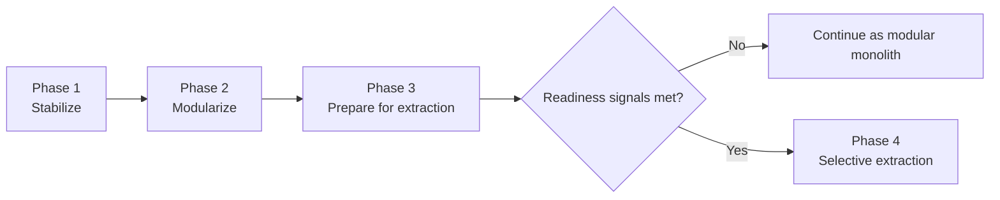

Caption: Phase-gate logic for staying modular by default until objective extraction signals appear, following the readiness criteria described earlier and the tradeoff model documented by [Martin Fowler](https://martinfowler.com/articles/micro-frontends.html).

## 11. Decision Matrix

Chart series order: Single SPA As-Is, Modular Monolith, Micro-Frontend.

```mermaid
xychart-beta
  title "Architecture Option Comparison"
  x-axis ["Delivery Speed", "Maintainability", "Simplicity", "UX Consistency", "Team Autonomy", "Performance Predictability", "Current Fit"]
  y-axis "Relative Score" 0 --> 5
  bar [5, 2, 5, 3, 1, 3, 2]
  bar [3, 5, 4, 5, 3, 5, 5]
  bar [2, 4, 1, 2, 5, 2, 2]
```

Caption: Relative comparison synthesized from repository context and external guidance on autonomous teams, operational complexity, server-state scaling, and modern frontend tooling ([Martin Fowler](https://martinfowler.com/articles/micro-frontends.html), [micro-frontends.org](https://micro-frontends.org/), [React](https://react.dev/learn/scaling-up-with-reducer-and-context), [Vite](https://vite.dev/guide/)).

| Criterion | Single SPA As-Is | Modular Monolith | Micro-Frontend |
|----------|-------------------|------------------|----------------|
| Short-term delivery speed | High | Medium | Low |
| Maintainability over time | Low | High ([Martin Fowler](https://martinfowler.com/articles/micro-frontends.html), [React](https://react.dev/learn/scaling-up-with-reducer-and-context)) | Medium ([Martin Fowler](https://martinfowler.com/articles/micro-frontends.html)) |
| Operational simplicity | High | High | Low ([Martin Fowler](https://martinfowler.com/articles/micro-frontends.html)) |
| UX consistency | Medium | High | Medium-Low ([micro-frontends.org](https://micro-frontends.org/)) |
| Team autonomy | Low | Medium | High ([Martin Fowler](https://martinfowler.com/articles/micro-frontends.html)) |
| Performance predictability | Medium | High ([TanStack Query](https://tanstack.com/query/latest/docs/framework/react/overview)) | Medium-Low ([Martin Fowler](https://martinfowler.com/articles/micro-frontends.html)) |
| Architectural risk now | Medium-High | Low | High ([Martin Fowler](https://martinfowler.com/articles/micro-frontends.html)) |
| Fit for current project stage | Low | High ([Create React App](https://create-react-app.dev/), [Vite](https://vite.dev/guide/), [React](https://react.dev/learn/scaling-up-with-reducer-and-context)) | Low ([Martin Fowler](https://martinfowler.com/articles/micro-frontends.html)) |
| Fit for future multi-team scale | Medium | High | High ([Module Federation](https://module-federation.io/guide/start/)) |

## 12. Final Recommendation

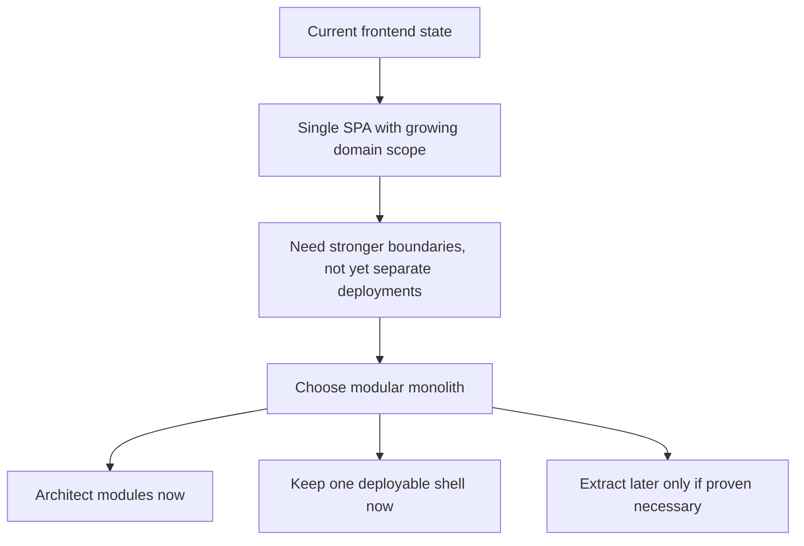

Caption: Final decision logic that combines local repository constraints with external architecture guidance on modular scaling and micro-frontend adoption thresholds ([Martin Fowler](https://martinfowler.com/articles/micro-frontends.html), [React](https://react.dev/learn/scaling-up-with-reducer-and-context)).

The current project should evolve toward a modular monolith frontend, not a true micro-frontend architecture at this time.

Reasoning:

- The business domain benefits from a coherent, trusted, low-friction user experience.
- The current frontend scale does not yet justify distributed frontend complexity.
- The codebase will benefit more from internal domain boundaries, stronger shared platform contracts, and route-based composition than from separate frontend deployments.
- This path preserves future optionality. If the product becomes a broader investment workbench with separate teams and independent release needs, the modular monolith can provide the seams for selective micro-frontend extraction later.

This recommendation is evidence-based rather than preference-based: it follows the same adoption logic described by major micro-frontend references, where independent deployment and team autonomy are the main reasons to pay the added complexity cost, and where loose coupling, careful composition, and explicit contracts are prerequisites for success ([Martin Fowler](https://martinfowler.com/articles/micro-frontends.html), [micro-frontends.org](https://micro-frontends.org/), [Module Federation](https://module-federation.io/guide/start/)).

In practical terms, the right move is not "micro-frontend versus monolith" as a binary choice. The right move is:

- architect for separation now,
- deploy as one frontend for now,
- extract only when real scale signals justify it.

## 13. Recommended Next Steps

1. Approve the modular monolith direction as the target frontend architecture for the next implementation cycle.
2. Define the first domain boundaries and module ownership rules.
3. Refactor the current frontend structure into shell, platform, and modules.
4. Add route-level composition and lazy loading.
5. Reassess micro-frontend readiness after the product has at least several stable domain areas and measurable team/release pressure.

## 14. Appendix: Micro-Frontend Readiness Triggers

Micro-frontends should be reconsidered only if several of the following become true at the same time:

- Three or more frontend teams need independent delivery.
- Frontend deployments are blocked by unrelated domain changes.
- Product domains operate with materially different delivery cadences.
- Shared state between domains is decreasing rather than increasing.
- Shell governance, design system governance, and telemetry standards are mature.
- Bundle growth and build times are becoming structurally difficult to manage in one app.
- Domain boundaries have stayed stable for multiple release cycles.

Until those signals appear, a modularized single frontend is the better engineering and product decision for this repository.

## 15. References

| Source | Type | Relevance |
|-------|------|-----------|
| [Martin Fowler: Micro Frontends](https://martinfowler.com/articles/micro-frontends.html) | Architecture article | Core reference for definition, benefits, downsides, composition models, team autonomy, and governance tradeoffs |
| [micro-frontends.org](https://micro-frontends.org/) | Practical guide and reference site | Useful for composition techniques, contracts, event-based communication, namespacing, and anti-anarchy guidance |
| [Module Federation: Introduction](https://module-federation.io/guide/start/) | Tooling and architecture documentation | Supports statements about Module Federation as an implementation option for large, multi-team decentralized JavaScript applications |
| [Create React App](https://create-react-app.dev/) | Official project site | Evidence that Create React App is officially deprecated and should not be treated as a forward-looking frontend platform choice |
| [React: Scaling Up with Reducer and Context](https://react.dev/learn/scaling-up-with-reducer-and-context) | Official React documentation | Supports the recommendation to modularize state, providers, and feature boundaries before jumping to distributed frontends |
| [Vite Guide](https://vite.dev/guide/) | Official tooling documentation | Supports the recommendation to modernize the frontend build pipeline toward a faster, leaner development experience |
| [TanStack Query Overview](https://tanstack.com/query/latest/docs/framework/react/overview) | Official server-state documentation | Supports the recommendation to separate server-state concerns from local UI state in a modular application |
| [React Router Installation](https://reactrouter.com/start/declarative/installation) | Official routing documentation | Supports route-based composition as the assembly mechanism for feature modules |
| [Thoughtworks Technology Radar: Micro Frontends](https://www.thoughtworks.com/radar/techniques/micro-frontends) | Industry architecture reference | Background source for the maturity and mainstream recognition of micro-frontends as an architectural technique |