# Data Pipeline Process — ELT & Medallion Architecture: Research, Architecture Design, and Proposal

> **Domain:** Data Domain & Cross-Domain System Architecture  
> **Status:** Proposal / Architectural Strategy  
> **Standard Stance:** Aligned to ISO/IEC/IEEE 42010 (Architecture Description) & ISO/IEC/IEEE 29148 (Requirements Framing)  
> **Methodology:** Spec-Driven Development (SDD) & Spec-Kit Governance  
> **Target Artifact:** `docs/research/DATA_PIPELINE_PROCESS_ELT_RESEARCH_AND_PROPOSAL.md`  
> **Companion Documents:**
> - [project-comprehensive-overview.md](../project-comprehensive-overview.md)
> - [architecture-review.md](../architecture-review.md)
> - [ARCHITECTURE_DESIGN.md](../domains/agent/ARCHITECTURE_DESIGN.md)
> - [data_model_design.md](../data/data_model_design.md)
> - [project-documentation-and-specification-methodology.md](../study-hub/project-documentation-and-specification-methodology.md)

---

## Document Control

| Field | Value |
|---|---|
| **Project** | DP Stock Investment Assistant |
| **Domain** | Data Domain (Data Engineering, Ingestion, Pipeline Architecture, Analytics Marts) |
| **Focus** | Architecture design and research proposal for a scalable, resilient ELT (Extract-Load-Transform) data pipeline based on the Medallion Architecture (Bronze / Silver / Gold layers), integrated into the multi-layer system architecture |
| **Date** | 2026-08-19 |
| **Status** | Approved Proposal & Architecture Baseline |
| **Target Document Ownership** | Upstream research & architectural baseline to be promoted into `docs/domains/data/ARCHITECTURE_DESIGN.md`, `docs/domains/data/DECISIONS/`, and downstream Spec-Kit delivery specs under `specs/` |
| **Audience** | Data Engineers, Architecture Owners, Backend Engineers, AI/Agent Maintainers, DevOps/SRE |

---

## Table of Contents

1. [Executive Summary](#1-executive-summary)
2. [Context, Motivation, and State Transitions](#2-context-motivation-and-state-transitions)
   - 2.1 Problem Statement & Background
   - 2.2 System State Lifecycle: Current, Transition, Target, and Future
3. [Stakeholders, Perspectives, and Architectural Concerns](#3-stakeholders-perspectives-and-architectural-concerns)
   - 3.1 Stakeholder Matrix
   - 3.2 Concern Taxonomy
4. [Governing Architectural Principles & Strategy](#4-governing-architectural-principles--strategy)
   - 4.1 Why ELT over Traditional ETL
   - 4.2 Medallion Architecture on a Unified Database Instance
   - 4.3 Reactive Batch Ingestion Strategy (Scheduled & User Upload Triggered)
   - 4.4 Decoupled External API Consumption Pattern
5. [Viewpoint 1: Context & External Ingestion Boundary](#5-viewpoint-1-context--external-ingestion-boundary)
   - 5.1 System Context & Boundary Separation
   - 5.2 External Data Sources & Processing Pathways
   - 5.3 Ingestion Gateways & Trust Boundaries
6. [Viewpoint 2: Medallion Layering Logical Architecture](#6-viewpoint-2-medallion-layering-logical-architecture)
   - 6.1 Logical Layer Decomposition on MongoDB
   - 6.2 Bronze Layer (GridFS File Chunks + BSON Metadata)
   - 6.3 Silver Layer (Standard Document Collections with Strict Visualizer Schemas)
   - 6.4 Gold Layer (Service-Managed & Agent-Refined Analytical Marts)
7. [Viewpoint 3: Process & Runtime Data Flows](#7-viewpoint-3-process--runtime-data-flows)
   - 7.1 Batch & Reactive User-Uploaded File Ingestion Flow
   - 7.2 Interactive Service & Agent API Query Flow
   - 7.3 End-to-End Orchestration Sequence
8. [Viewpoint 4: Information & Storage Architecture](#8-viewpoint-4-information--storage-architecture)
   - 8.1 Physical Storage Topology (Single MongoDB Database + Redis)
   - 8.2 Schema Management & Validation Strategy (Chart Visualization Enforced)
   - 8.3 Partitioning, Standard Indexing & Query Optimization
   - 8.4 GridFS Lifecycle, Retention & Storage Trade-offs
9. [Viewpoint 5: AI Agent & Service Integration](#9-viewpoint-5-ai-agent--service-integration)
   - 9.1 Data Access Layer: Repository Pattern & Service Abstraction
   - 9.2 Tool Gateway & Backend Service Interoperability
   - 9.3 Vector Embeddings & Agent Refinement Loop
10. [Viewpoint 6: Operations, Reliability & Governance](#10-viewpoint-6-operations-reliability--governance)
    - 10.1 Idempotency, Deduplication & Replayability
    - 10.2 Error Handling, Dead-Letter Queues (DLQ) & Fallback Modes
    - 10.3 Data Observability, Lineage & Quality Gates
11. [Architecture Option Analysis & Tradeoff Matrix](#11-architecture-option-analysis--tradeoff-matrix)
12. [Architectural Impact Map & Downstream Routing](#12-architectural-impact-map--downstream-routing)
13. [ADR Candidates & Decision Records](#13-adr-candidates--decision-records)
    - ADR-DATA-001: Adoption of ELT Medallion Architecture on Single MongoDB Instance
    - ADR-DATA-002: Reactive Batch & User-Triggered Ingestion Strategy
    - ADR-DATA-003: Raw Batch File Storage in GridFS with BSON Metadata
14. [Consistency Review & Implementation Roadmap](#14-consistency-review--implementation-roadmap)
15. [References & Citations](#15-references--citations)

---

## 1. Executive Summary

As the **DP Stock Investment Assistant** evolves into a professional-grade AI-assisted stock analysis and investment platform, its data processing capabilities require a structured, scalable, and audit-compliant **Data Pipeline Architecture**. 

This proposal establishes the architectural design for the **Data Pipeline Process**, selecting the **ELT (Extract, Load, Transform)** pattern structured according to the **Medallion Architecture** paradigm (Bronze / Silver / Gold layers) implemented on a unified MongoDB and Redis infrastructure:

- **Extract & Load First (Bronze Layer)**: Batch files (historical CSVs, Excel market dumps, PDF disclosures, research reports) uploaded by users or fetched via scheduled batch routines are stored as-is in **MongoDB GridFS** (`fs.chunks` / `fs.files`), coupled with rich structured BSON metadata in `raw_file_metadata`.
- **Transform In-Engine (Silver Layer)**: Raw batch contents are parsed, cleaned, schema-validated, deduplicated, and normalized into standard MongoDB document collections (`market_data`, `symbols`, `fundamental_analysis`, `technical_indicators`). Native MongoDB time-series collections are intentionally avoided to prevent schema rigidity, while strict schema validation is enforced by `SchemaManager` to support low-latency chart visualization.
- **Curate & Refine (Gold Layer)**: High-value analytical marts (`market_snapshots`, `analyses`, `investment_ideas`, `memory_vectors`) are computed, aggregated, and maintained by **Backend Services** and continuously enriched and refined by the **AI ReAct Agent** using analytical tools and semantic vector embeddings.
- **Decoupled Interactive Provider APIs**: Live external market APIs (e.g., Yahoo Finance, TCBS, Vietstock live quotes) are invoked and transformed directly on-demand by Backend Services and Agent Tools with Redis caching, bypassing the batch ELT pipeline to ensure optimal chat turn latency.

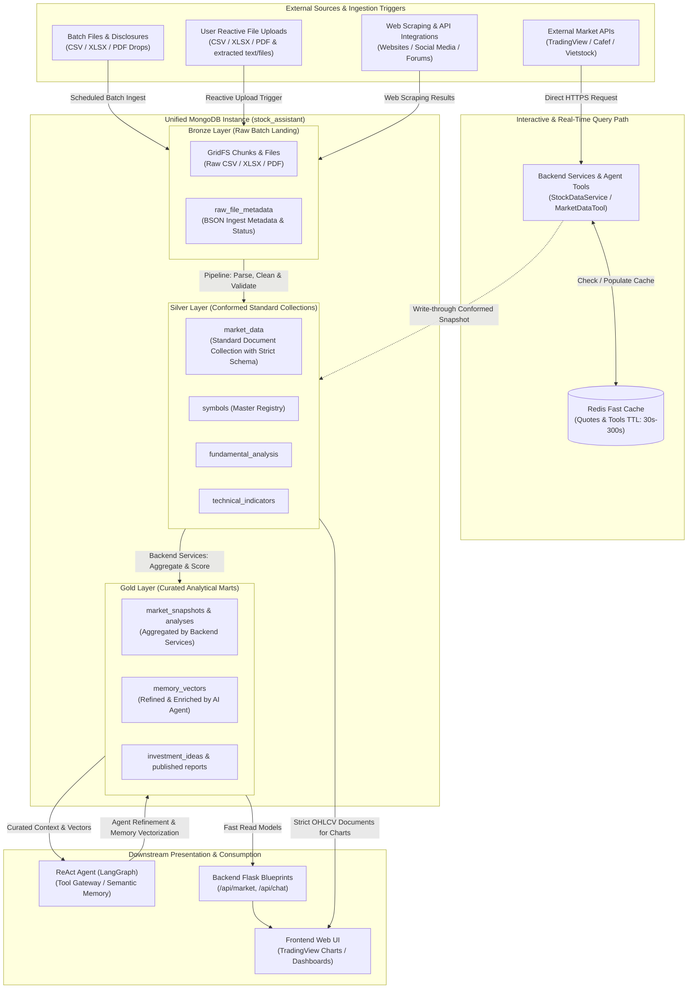

---

## 2. Context, Motivation, and State Transitions

### 2.1 Problem Statement & Background

The application currently utilizes on-demand market retrieval inside `DataManager` (`src/core/data_manager.py`). As the platform expands to include historical backtesting, portfolio batch uploads, deep fundamental research, and automated market snapshotting, several structural bottlenecks emerge:

1. **Lack of Ingestion Auditing for Bulk Data**: When financial analysts import CSV portfolios or bulk financial statements, the system lacks an immutable raw landing zone. If transformation logic contains bugs, the raw files cannot be reprocessed without requesting re-uploads.
2. **Synchronous Coupling of Bulk Files**: Processing large files synchronously inside HTTP request threads blocks the server and degrades response times.
3. **Database Schema Rigidity vs. Flexibility**: Using specialized storage engines or restrictive collection types can hinder rapid schema evolution when provider formats change.
4. **Decoupled Analytical Curation**: Quantitative metrics and qualitative AI agent insights reside in disconnected states without a structured Gold mart layer.

### 2.2 System State Lifecycle: Current, Transition, Target, and Future

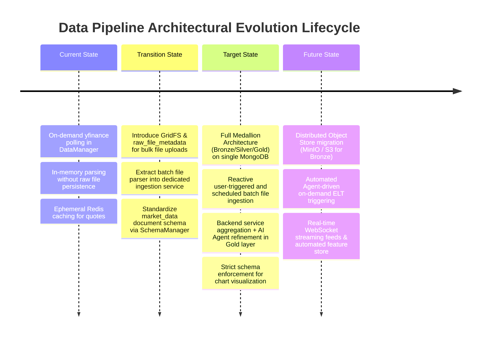

| State Category | Description & Scope | Architectural Boundary |
|---|---|---|
| **Current State** | On-demand yfinance polling via `DataManager`; immediate write to MongoDB `market_data`; no raw audit store. | Monolithic agent-bound ingestion. |
| **Transition State** | Introduce `raw_file_metadata` and GridFS staging for batch CSV files; extract `DataManager` ingestion into reusable pipeline tasks; maintain backward-compatible `StockDataService` APIs. | Coexistence of on-demand APIs and staged batch file loads. |
| **Target State** | Formal Medallion pipeline with Bronze (GridFS + BSON metadata), Silver (cleansed standard document collections), and Gold (curated analytical marts refined by Backend Services and AI Agent); reactive user-triggered and scheduled batch ingestion. | Decoupled ELT pipeline engine with clear service contracts. |
| **Future State** | Dedicated distributed object store (MinIO/S3), automated agent-driven dynamic ELT triggering with distributed locks, real-time WebSocket order-book streaming, and automated ML feature stores. | Enterprise event-driven lakehouse. |

---

## 3. Stakeholders, Perspectives, and Architectural Concerns

### 3.1 Stakeholder Matrix

| Stakeholder Class | Role & Responsibilities | Core Architectural Concerns |
|---|---|---|
| **AI Engineers / Agent Maintainers** | Designs LangGraph agent tools, reasoning graphs, and prompt context injection. | Low-latency data access (<50ms), enriched Gold marts, high-quality vector embeddings, ability to refine Gold insights. |
| **Data Engineers / Pipeline Maintainers** | Develops file connectors, transforms raw data, maintains data quality. | Pipeline idempotency, raw file auditability, replayability, separation of batch ELT from live API queries. |
| **Backend Engineers** | Integrates Flask blueprints and services with repositories. | Clean repository interfaces, type-safe models, connection pooling, cache coherency, managing Gold mart aggregations. |
| **Frontend Engineers** | Builds responsive TradingView charts and analytical dashboards. | Deterministic, strictly typed OHLCV time-series payloads with predictable numeric formats. |
| **DevOps / SRE** | Manages MongoDB, Redis, Docker/K8s infrastructure, and backups. | Single database instance operational simplicity, GridFS chunk management, memory footprint, DLQ monitoring. |
| **Financial Analysts / End Users** | Uploads custom portfolios, views market charts, and consumes investment reports. | Instant upload feedback, complete historical depth, chart rendering accuracy, reliable automated reports. |

### 3.2 Concern Taxonomy

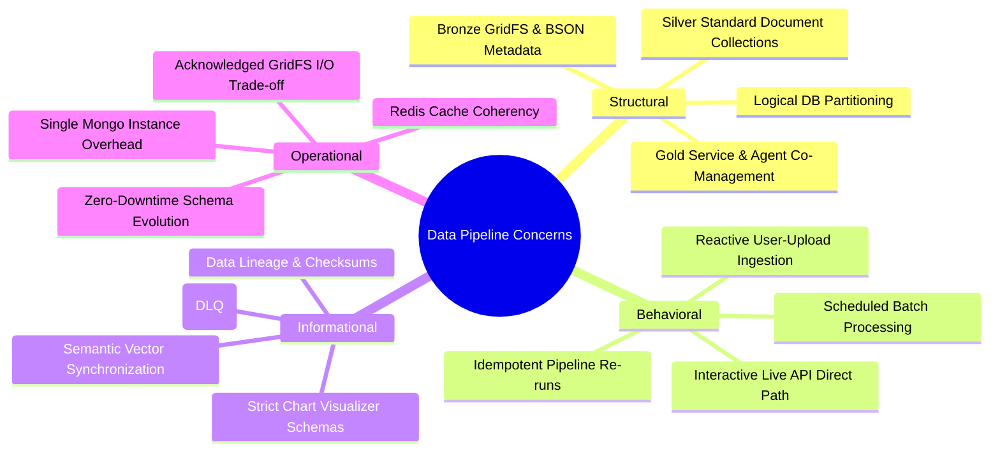

---

## 4. Governing Architectural Principles & Strategy

### 4.1 Why ELT over Traditional ETL

In traditional **ETL (Extract, Transform, Load)**, data is transformed in memory before being loaded into the database [8]. For modern financial analytics, this introduces severe friction:
- If transformation logic changes (e.g., adjusting technical indicator smoothing or financial statement normalization), raw files must be re-obtained or re-uploaded.
- Non-standard fields in vendor filings or analyst spreadsheets are permanently discarded if not mapped upfront.

In **ELT (Extract, Load, Transform)** [1][8]:
1. **Extract**: Ingestion adapters receive batch files from user uploads or scheduled bulk downloads.
2. **Load (Bronze)**: The raw file is stored **as-is** into MongoDB GridFS accompanied by a BSON metadata document (`raw_file_metadata`) capturing `file_name`, `checksum_sha256`, `uploaded_by`, `ingestion_status`, and `schema_version`.
3. **Transform (Silver & Gold)**: Transformation pipelines parse Bronze files into Silver collections (normalized entities) and Gold marts (analytical summaries). Transformations can be re-run at any time over historical Bronze records.

### 4.2 Medallion Architecture on a Unified Database Instance

To avoid unnecessary operational complexity and infrastructure overhead during current operational stages, the Medallion Architecture (Bronze, Silver, Gold) is implemented on a **single MongoDB database instance** (`stock_assistant`) [5][7]. Logical separation is maintained through:
- **Collection Namespace Separation**: Distinct collection prefixes and schemas (`raw_*`, `market_*`/`symbols`/`fundamental_*`, `market_snapshots`/`analyses`/`memory_vectors`).
- **Mutation & Ownership Boundaries**:
  - *Bronze*: Append-only writes by Ingestion Adapters.
  - *Silver*: Upserts by Batch Transformation Pipelines.
  - *Gold*: Managed and updated by **Backend Services**; enriched and refined by the **AI Agent**.
- **Index & Storage Strategies**: Tailored compound indexes and TTL rules for each tier.

### 4.3 Reactive Batch Ingestion Strategy (Scheduled & User Upload Triggered)

The target architecture focuses on **Reactive Batch Ingestion**:
1. **User-Triggered Reactive Uploads**: When an analyst uploads a CSV/XLSX file (portfolio holdings, historical ticker lists, custom fundamental indicators) via `/api/data/import`, the file is immediately saved to GridFS, registered in `raw_file_metadata` with status `PENDING`, and asynchronously picked up by the transformation pipeline.
2. **Scheduled Batch Routines**: Off-peak cron workers download bulk EOD archives, save raw files to GridFS, and trigger Silver/Gold transformations.
3. **Exclusion of Agent-Driven Inline ELT**: Dynamic agent-driven ELT (where agent chat turns invoke full Bronze file landing and Silver pipeline builds) is intentionally excluded from the target state to eliminate distributed lock contention (Redis Redlock), race conditions, and conversational latency spikes.

### 4.4 Decoupled External API Consumption Pattern

External market data APIs (Yahoo Finance, TCBS, Vietstock live quotes) operate on a **dedicated interactive query path**:
- Invoked directly on-demand by **Backend Services** (`StockDataService`) and **Agent Tools** (`MarketDataTool`).
- Cached in Redis (`mkt:quote:<symbol>`, TTL 30s-60s) for rapid sub-millisecond retrieval.
- Conformed snapshots can write-through to the Silver collection (`market_data`) to update the latest price, completely bypassing the bulk file ingestion pipeline.

---

## 5. Viewpoint 1: Context & External Ingestion Boundary

### 5.1 System Context & Boundary Separation

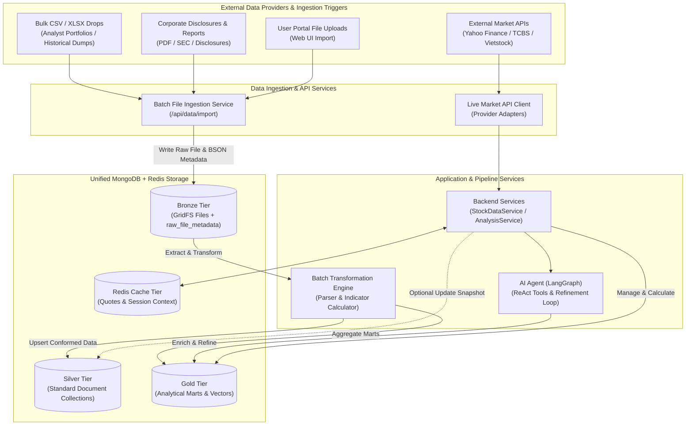

### 5.2 External Data Sources & Processing Pathways

| Pathway | Input Sources | Target Ingestion Layer | Processing Mechanism | Latency Expectation |
|---|---|---|---|---|
| **Batch File Pathway** | Analyst CSVs, XLSX sheets, bulk EOD archives | Bronze Tier (`GridFS` + `raw_file_metadata`) | Asynchronous background transformation worker | Asynchronous (1s - 30s depending on file size) |
| **Document/Report Pathway** | Quarterly PDF filings, financial disclosure texts | Bronze Tier (`GridFS` + `raw_file_metadata`) | Background text extraction, chunking & vectorization | Asynchronous (5s - 60s) |
| **Interactive API Pathway** | Yahoo Finance, TCBS, Vietstock real-time quotes | Redis Cache & Direct Service Models | Synchronous HTTP Client with Redis cache fallback | Real-time (<50ms cache hit, <1.5s live fetch) |

### 5.3 Ingestion Gateways & Trust Boundaries

| Source Type | Security / Trust Classification | Ingestion Mechanism | Sanitization & Validation Gate |
|---|---|---|---|
| **User File Uploads (CSV/XLSX)** | Untrusted User Input | Flask `/api/data/import` multipart upload | MIME-type validation, SHA256 checksum verification, header schema check, file size limit (<50MB via GridFS) |
| **Corporate Disclosures (PDF)** | Semi-trusted Vendor / Scraper | Upload / automated scraper drop | PDF header verification, malicious script stripping, text length clamps |
| **Market APIs (Yahoo/Vietstock)** | External Trusted Provider | Direct HTTPS REST Client | JSON structure validation, numeric type conversion, range assertions |

---

## 6. Viewpoint 2: Medallion Layering Logical Architecture

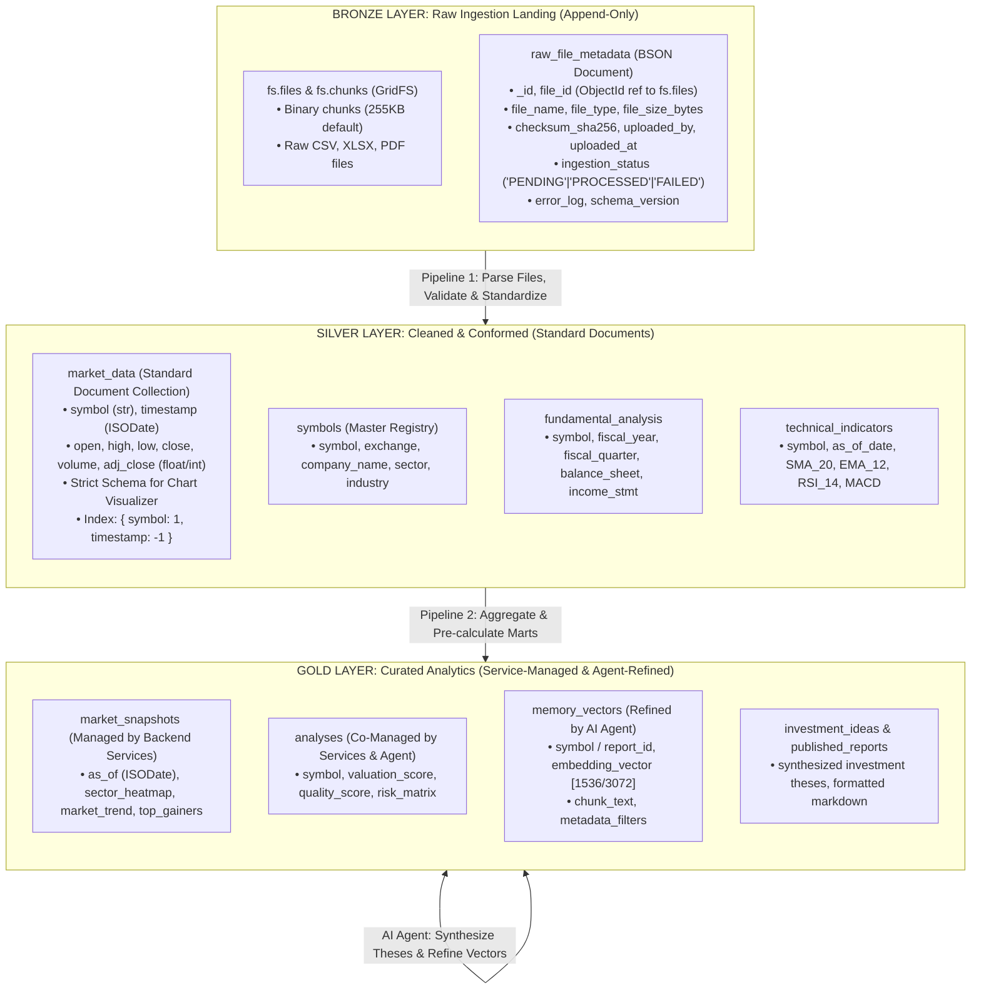

### 6.1 Logical Layer Decomposition on MongoDB

#### 6.2 Bronze Layer (GridFS File Chunks + BSON Metadata)
- **Objective**: Exact fidelity preservation of ingested raw files without polluting document size limits.
- **Characteristics**:
  - File binary stored in MongoDB GridFS (`fs.files` and `fs.chunks`).
  - File metadata stored in `raw_file_metadata` BSON collection for fast querying, status filtering, and audit tracking.
  - Immutable, append-only records.
  - Acknowledged technical constraint: GridFS uses MongoDB compute/IO resources; accepted to avoid managing a separate MinIO/S3 cluster during initial phases.

#### 6.3 Silver Layer (Standard Document Collections with Strict Visualizer Schemas)
- **Objective**: Standardized, validated, normalized entities optimized for high-speed queries and chart rendering.
- **Characteristics**:
  - Stored in standard MongoDB document collections (avoiding native time-series collection constraints like `distinct` query penalties and compression breaks from polymorphic fields [2][6]).
  - **Strict Schema Enforcement**: OHLCV data structures are enforced via `SchemaManager` (`open`, `high`, `low`, `close` as `Double`, `volume` as `Long`, `timestamp` as `ISODate`) specifically tailored for **TradingView / lightweight-charts** visualizer components.
  - Compound indexing on `{ symbol: 1, timestamp: -1 }` ensures sub-10ms range scans.

#### 6.4 Gold Layer (Service-Managed & Agent-Refined Analytical Marts)
- **Objective**: High-density analytical summaries, domain scores, and semantic vector stores.
- **Characteristics**:
  - **Backend Services Management**: Mathematical aggregations, market-wide trend scores, sector benchmark ratios, and snapshot summaries are calculated and stored by `AnalysisService` and `MarketDataService`.
  - **AI Agent Refinement**: The LangGraph ReAct agent enriches Gold documents by generating qualitative investment theses, risk assessments, summary narratives, and semantic vector embeddings (`memory_vectors`).

---

## 7. Viewpoint 3: Process & Runtime Data Flows

### 7.1 Batch & Reactive User-Uploaded File Ingestion Flow

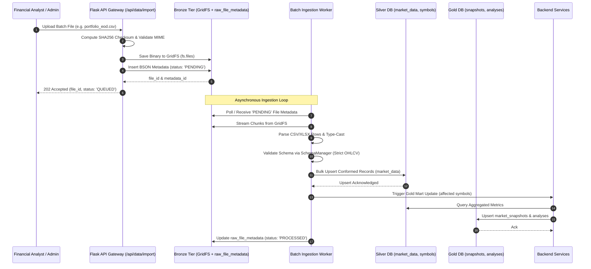

### 7.2 Interactive Service & Agent API Query Flow

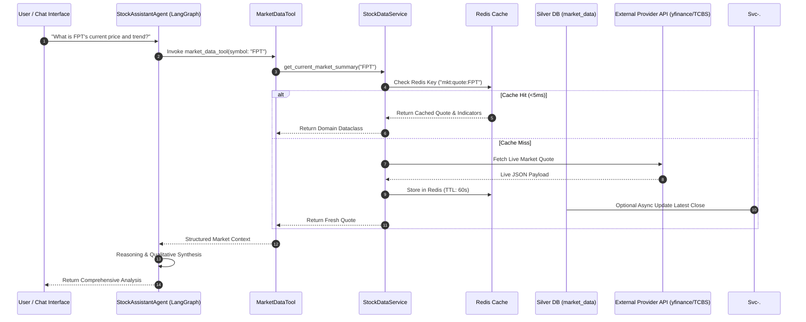

---

## 8. Viewpoint 4: Information & Storage Architecture

### 8.1 Physical Storage Topology (Single MongoDB Database + Redis)

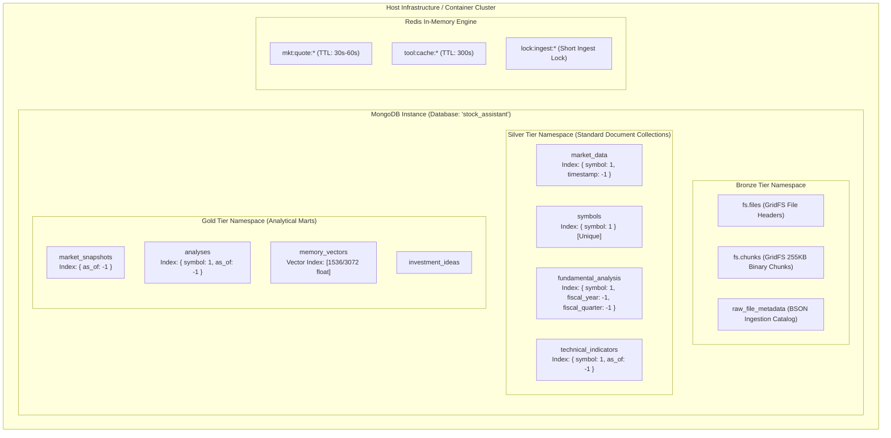

### 8.2 Schema Management & Validation Strategy (Chart Visualization Enforced)

Validation is governed centrally by `SchemaManager` (`src/data/schema/schema_manager.py`).

#### 1. Bronze Metadata Schema (`raw_file_metadata`)
```json
{
  "$jsonSchema": {
    "bsonType": "object",
    "required": ["file_id", "file_name", "checksum_sha256", "uploaded_at", "ingestion_status"],
    "properties": {
      "file_id": { "bsonType": "objectId" },
      "file_name": { "bsonType": "string" },
      "file_type": { "enum": ["csv", "xlsx", "pdf", "json"] },
      "file_size_bytes": { "bsonType": "long" },
      "checksum_sha256": { "bsonType": "string", "pattern": "^[a-fA-F0-9]{64}$" },
      "uploaded_by": { "bsonType": "string" },
      "uploaded_at": { "bsonType": "date" },
      "ingestion_status": { "enum": ["PENDING", "PROCESSING", "PROCESSED", "FAILED"] },
      "error_log": { "bsonType": "string" },
      "schema_version": { "bsonType": "int" }
    }
  }
}
```

#### 2. Silver Market Data Schema (`market_data` Standard Collection)
Strictly typed for compatibility with frontend chart engines (TradingView lightweight-charts):
```json
{
  "$jsonSchema": {
    "bsonType": "object",
    "required": ["symbol", "timestamp", "open", "high", "low", "close", "volume"],
    "properties": {
      "symbol": { "bsonType": "string", "minLength": 1, "maxLength": 10 },
      "timestamp": { "bsonType": "date" },
      "open": { "bsonType": "double" },
      "high": { "bsonType": "double" },
      "low": { "bsonType": "double" },
      "close": { "bsonType": "double" },
      "volume": { "bsonType": "long" },
      "adj_close": { "bsonType": "double" }
    }
  }
}
```

### 8.3 Partitioning, Standard Indexing & Query Optimization

| Layer | Collection | Index Definition | Type / Option | Primary Query Pattern |
|---|---|---|---|---|
| **Bronze** | `raw_file_metadata` | `{ checksum_sha256: 1 }` | Unique | Duplicate file upload detection |
| **Bronze** | `raw_file_metadata` | `{ ingestion_status: 1, uploaded_at: 1 }` | Compound | Worker polling queue |
| **Silver** | `market_data` | `{ symbol: 1, timestamp: -1 }` | Compound Unique | Historical OHLCV range queries for charts |
| **Silver** | `symbols` | `{ symbol: 1 }` | Unique | Symbol master resolution |
| **Silver** | `symbols` | `{ company_name: "text", symbol: "text" }` | Text Index | Autocomplete & fuzzy search |
| **Silver** | `fundamental_analysis` | `{ symbol: 1, fiscal_year: -1, fiscal_quarter: -1 }` | Compound Unique | Quarterly financial statement retrieval |
| **Silver** | `technical_indicators` | `{ symbol: 1, as_of: -1 }` | Compound | Latest indicator lookup for tools |
| **Gold** | `market_snapshots` | `{ as_of: -1 }` | Descending | Latest market dashboard load |
| **Gold** | `memory_vectors` | `{ symbol: 1, category: 1 }` + Vector Index | Vector Search Index | Semantic similarity & RAG search |

### 8.4 GridFS Lifecycle, Retention & Storage Trade-offs

#### Acknowledged GridFS Performance Trade-Off
GridFS divides files into 255KB chunks stored as standard BSON documents. While convenient because it eliminates the need to deploy and manage a standalone MinIO or S3 cluster, it introduces:
- Database memory/buffer pool overhead during large file reads.
- Additional disk I/O contention between batch ingestion and low-latency API queries.

**Architectural Decision**: This trade-off is explicitly accepted for the current and target states to maintain low operational complexity. Migration to an external S3/MinIO bucket is documented as an architectural trigger when batch file volume exceeds 50GB/month.

#### Retention Policies
- **Bronze GridFS Chunks**: Retained for 90 days online; older files can be pruned or dumped to offline storage archives.
- **Silver `market_data`**: Retained indefinitely (10+ years historical daily OHLCV is lightweight under standard indexing).
- **Gold `market_snapshots`**: Retained for 365 days; snapshots older than 1 year are pruned via background maintenance.

---

## 9. AI Agent & Service Integration

### 9.1 Data Access Layer: Repository Pattern & Service Abstraction

The presentation layer and LangGraph Agent never access MongoDB collections directly. All operations are mediated through `RepositoryFactory` and `ServiceFactory`:

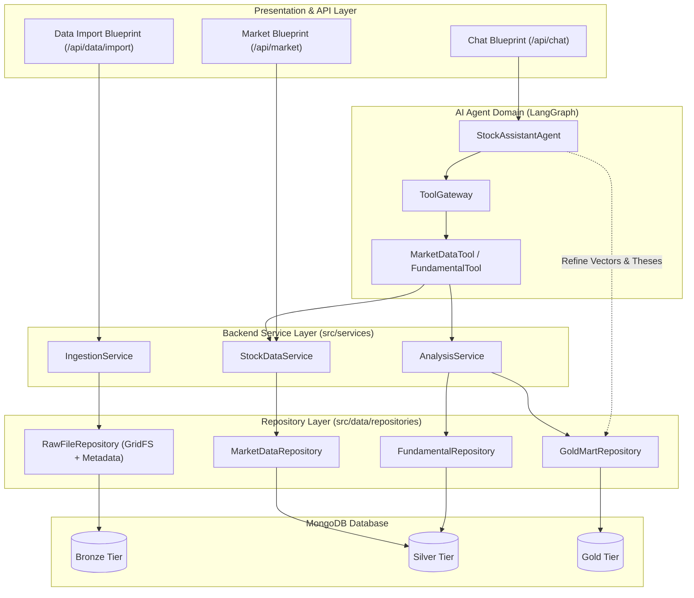

### 9.2 Tool Gateway & Backend Service Interoperability

- Tools receive a structured `ToolContextPack` defining execution limits and permissions ([ADR-AGENT-004](../domains/agent/DECISIONS/ADR-AGENT-004-THIN-TOOL-GATEWAY-AND-NORMALIZED-TOOL-CONTEXT.md)).
- Ingestion operations triggered via the web UI produce a `MutationReceipt` tracking the `file_id` and metadata record.
- Agent tools execute read-only queries against Silver repositories or pre-computed Gold marts, avoiding pipeline lock contention.

### 9.3 Vector Embeddings & Agent Refinement Loop

When corporate disclosures, PDF filings, or quarterly statements are processed into Silver:
1. **Extraction & Chunking**: Background workers extract clean text and partition it into semantic chunks (500 tokens, 50-token overlap).
2. **Embedding**: Text chunks are embedded via OpenAI `text-embedding-3-small` / `text-embedding-3-large`.
3. **Gold Vector Registration**: Embeddings and metadata are saved to `memory_vectors`.
4. **Agent Refinement**: When the AI Agent synthesizes multi-quarter analysis for a symbol, its conclusions (bull/bear theses, qualitative risk notes) are written back to `analyses` and indexed into `memory_vectors`, creating a virtuous data enrichment cycle.

---

## 10. Operations, Reliability & Governance

### 10.1 Idempotency, Deduplication & Replayability

- **Bronze File Idempotency**:
  $$\text{File Hash} = \text{SHA256}(\text{Raw File Bytes})$$
  Uploads matching an existing `checksum_sha256` in `raw_file_metadata` return the existing `file_id` without duplicating GridFS storage chunks.
- **Silver Upsert Idempotency**:
  Silver pipelines use MongoDB upsert operations:
  ```python
  collection.update_one(
      {"symbol": record["symbol"], "timestamp": record["timestamp"]},
      {"$set": record},
      upsert=True
  )
  ```
  Re-executing the transformation pipeline against historical Bronze files yields a deterministic, identical database state.
- **Replayability CLI**:
  Operators can rebuild Silver and Gold tiers from historical raw files:
  ```powershell
  python -m data.pipeline.reprocess --from-bronze --file-type csv --start-date 2026-01-01
  ```

### 10.2 Error Handling, Dead-Letter Queues (DLQ) & Fallback Modes

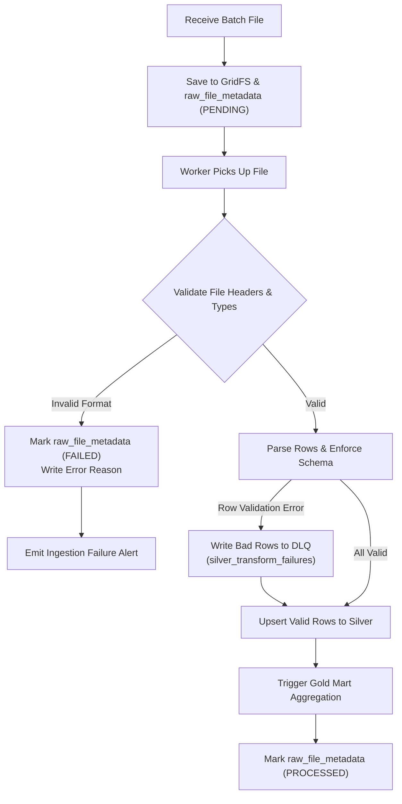

### 10.3 Data Observability, Lineage & Quality Gates

```mermaid
graph LR
    subgraph BronzeGate["Bronze Ingestion Gate"]
        B1["Valid MIME Type"]
        B2["SHA256 Generated"]
        B3["GridFS Chunks Written"]
    end

    subgraph SilverGate["Silver Quality Gate (Chart Enforced)"]
        S1["JSON Schema Validated"]
        S2["High >= Low >= 0"]
        S3["Volume >= 0"]
        S4["Timestamps Valid ISODate"]
    end

    subgraph GoldGate["Gold Quality Gate"]
        G1["Valuation Scores in [0, 100]"]
        G2["Vector Dims == 1536/3072"]
        G3["Snapshot Freshness < 24h"]
    end

    BronzeGate --> SilverGate --> GoldGate
```

---

## 11. Architecture Option Analysis & Tradeoff Matrix

| Dimension | Option A: Monolithic Ad-Hoc Polling (Current) | Option B: Full Distributed Lakehouse (Spark + Delta + MinIO) | Option C: Medallion ELT on Single MongoDB / GridFS / Redis (Selected Target) |
|---|---|---|---|
| **Architecture Pattern** | Ad-hoc synchronous API polling | Distributed Big Data Lakehouse | Single-Instance Medallion ELT (Bronze GridFS, Silver Docs, Gold Marts) |
| **Ingestion Scope** | Live API only (No batch files) | Mass batch & streaming lakehouse | Reactive batch file uploads & scheduled bulk files |
| **Live API Pathway** | Synchronous inside chat turn | Micro-batch streaming | Direct Service/Tool query with Redis cache |
| **Storage Technology** | MongoDB standard collections | S3/MinIO + Delta Parquet + Spark | MongoDB (GridFS + Standard Collections) + Redis |
| **Time-Series Design** | Unvalidated document writes | Columnar Parquet files | Strictly schema-validated standard document collections |
| **Gold Mart Management** | None | Distributed Spark SQL jobs | Backend Services calculation + AI Agent qualitative refinement |
| **Infrastructure Footprint** | Minimal | Very High (JVM, Spark, S3, Hive metastore) | Low-Medium (Reuses existing MongoDB & Redis cluster) |
| **Operational Complexity** | Low (unscalable) | High (requires distributed cluster ops) | Balanced & Pragmatic for current scale |
| **Verdict** | **Rejected** (Does not support bulk files or auditability) | **Deferred to Future State** (Over-engineering for current scale) | **SELECTED TARGET BASELINE** |

---

## 12. Architectural Impact Map & Downstream Routing

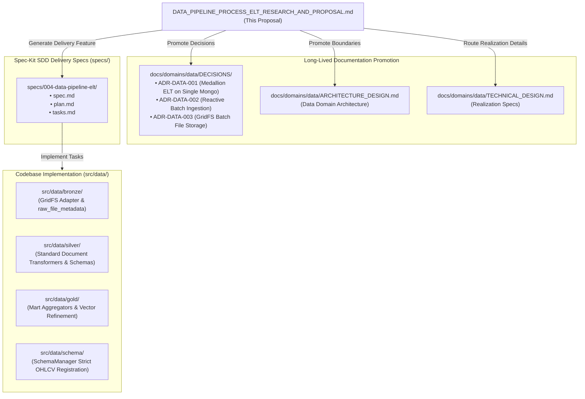

### Detailed Impact Mapping

| Proposal Component | Target Destination | Authority Type | Action |
|---|---|---|---|
| **Medallion Boundaries & Gold Co-Management** | `docs/domains/data/ARCHITECTURE_DESIGN.md` | Architecture Authority | **Promote** into official Data Domain Architecture description. |
| **Core Decisions (Medallion, Batch Ingest, GridFS)** | `docs/domains/data/DECISIONS/ADR-DATA-001..003.md` | Decision Authority | **Create ADRs** documenting drivers, accepted trade-offs, and consequences. |
| **GridFS Adapter & Transformer Classes** | `docs/domains/data/TECHNICAL_DESIGN.md` | Realization Authority | **Route to `$technical-design-manager`** for detailed class diagrams, methods, and schema signatures. |
| **Strict OHLCV Schema Requirements** | `docs/domains/data/SOFTWARE_REQUIREMENTS_SPECIFICATION.md` | Requirement Authority | **Add System Requirements** for TradingView chart schema compatibility and validation gates. |
| **Delivery Planning & Task Tracking** | `specs/004-data-pipeline-elt/` | Delivery Authority | **Run Spec-Kit Lifecycle** (`speckit.specify` → `plan` → `tasks` → `implement`). |
| **Schema Validation Implementations** | `src/data/schema/schema_manager.py` | Code Authority | **Implement** `raw_file_metadata` and strict `market_data` schemas. |

---

## 13. ADR Candidates & Decision Records

### ADR-DATA-001: Adoption of ELT Medallion Architecture on Single MongoDB Instance

- **Status**: Proposed / Recommended
- **Context**: The application needs structured ingestion of bulk market files, auditability, and fast pre-aggregated analytical marts without maintaining separate database clusters.
- **Decision**: Adopt a 3-tier Medallion Architecture (Bronze: GridFS + BSON metadata, Silver: Standard document collections with strict schemas, Gold: Analytical marts & semantic vectors) executed on a single MongoDB database instance (`stock_assistant`). Market data collections will use standard document collections with compound indexing rather than native MongoDB Time-Series collections to prevent schema rigidity and `distinct` query limitations [2][6].
- **Consequences**:
  - *Positive*: Simple operational model, full replayability from raw files, low-latency chart rendering, and decoupled storage boundaries.
  - *Negative*: Database compute shared between ingestion and queries (mitigated by asynchronous worker processing and Redis caching).

### ADR-DATA-002: Reactive Batch & User-Triggered Ingestion Strategy

- **Status**: Proposed / Recommended
- **Context**: Bulk file uploads and scheduled batch downloads require reliable ingestion, whereas real-time agent queries need immediate response times.
- **Decision**: Implement a **Reactive Batch Ingestion Strategy** for all file uploads and scheduled bulk imports. Exclude agent-driven dynamic inline ELT from the target baseline; interactive API queries bypass the bulk ELT pipeline and interact with Backend Services and Redis caches directly. Agent-driven inline ELT is deferred to future architecture iterations.
- **Consequences**:
  - *Positive*: Eliminates distributed locking overhead (Redis Redlock), prevents race conditions between batch workers and user chat turns, and preserves predictable conversational latency.
  - *Negative*: Tickers not present in Silver or cache require direct provider API fetches rather than automatic inclusion in batch pipeline histories.

### ADR-DATA-003: Raw Batch File Storage in GridFS with BSON Metadata

- **Status**: Proposed / Recommended
- **Context**: Raw batch files (CSVs, XLSX sheets, corporate PDF filings) can exceed standard MongoDB 16MB document limits and require structured ingestion tracking.
- **Decision**: Store all raw ingested batch files in MongoDB GridFS (`fs.files` / `fs.chunks`) paired with structured BSON metadata in `raw_file_metadata`. Explicitly acknowledge GridFS I/O and compute overhead as an acceptable temporary architectural constraint to avoid deploying and managing a dedicated MinIO/S3 object store cluster at this stage.
- **Consequences**:
  - *Positive*: Zero additional infrastructure components; unified backup and transaction boundary within MongoDB.
  - *Negative*: Increased database disk and buffer cache usage during large file operations; migration to an S3-compatible Object Store will be triggered if batch file volume exceeds 50GB/month.

---

## 14. Consistency Review & Implementation Roadmap

### 14.1 Consistency Review Checklist

- [x] **Boundary Alignment**: Aligned with ISO/IEC/IEEE 42010 structure used in `docs/domains/agent/ARCHITECTURE_DESIGN.md`.
- [x] **Documentation Methodology**: Complies with `docs/study-hub/project-documentation-and-specification-methodology.md` (separation of WHAT, WHY, HOW, HOW TO OPERATE).
- [x] **Repository Pattern Consistency**: Seamlessly integrates with existing `MongoGenericRepository` and `RepositoryFactory` in `src/data/repositories/`.
- [x] **Tool Gateway Interoperability**: Fully supports `ToolContextPack` and `ProviderSelectionPolicy` established in `src/core/tools/`.
- [x] **Chart Visualization Compatibility**: Strict schema validation ensures direct interoperability with TradingView lightweight-charts.
- [x] **Visual Clarity**: Contains complete C4/Mermaid sequence, flow, class, and entity diagrams reflecting updated boundaries.

### 14.2 Next Steps

1. **Review & Approval**: Finalize architectural review of this proposal.
2. **Promote ADRs**: Create `docs/domains/data/DECISIONS/ADR-DATA-001..003.md` and update the ADR index.
3. **Spec-Kit Feature Delivery**: Initialize feature branch and execute `speckit.specify` for `specs/004-data-pipeline-elt/`.
4. **Realization Specs**: Delegate module-level designs to `$technical-design-manager` for `src/data/bronze/` and `src/data/silver/`.

---

## 15. References & Citations

1. **Databricks**: *What is a Medallion Architecture?* (2024). Explaining Bronze (raw), Silver (conformed/cleaned), and Gold (curated analytical marts) logical tiers. [Online]. Available: `https://www.databricks.com/glossary/medallion-architecture`.
2. **MongoDB Documentation**: *Time Series Collection Limitations and Query Constraints* (2025). Details on `distinct` query penalties and bucketed storage constraints in MongoDB. [Online]. Available: `https://www.mongodb.com/docs/manual/core/timeseries-collections/`.
3. **Tacnode**: *Implementing Lakehouse and Medallion Patterns on Document Databases* (2024). Demonstrating the portability of Medallion logical boundaries to NoSQL and document data stores. [Online]. Available: `https://tacnode.io/blog/medallion-architecture-nosql`.
4. **MongoDB Engineering**: *Time Series Compression and Schema Design Best Practices* (2024). Explaining how schema polymorphism and empty arrays degrade columnar compression efficiency. [Online]. Available: `https://www.mongodb.com/blog/post/time-series-best-practices`.
5. **Modern Data Stack Publications**: *ELT vs. ETL in Modern AI and Analytical Architectures* (2024). Justification for extract-and-load immutability and in-database transformation for AI assistants. [Online]. Available: `https://medium.com/data-engineering/elt-vs-etl-modern-stack`.
