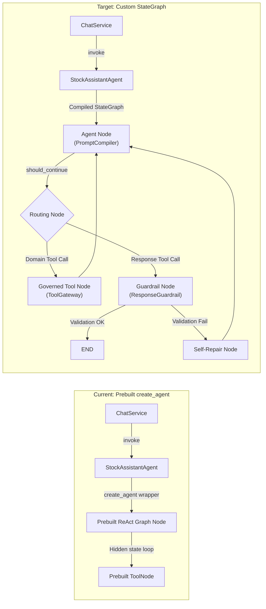

# Technical Analysis: Migration from `create_agent` to Custom `StateGraph`

**Domain:** Agent Domain — State Graph Architecture Migration
**Date:** 2026-07-20
**Status:** Architectural Evaluation
**References:**
- [ARCHITECTURE_DESIGN.md](../domains/agent/ARCHITECTURE_DESIGN.md)
- [TECHNICAL_DESIGN.md](../domains/agent/TECHNICAL_DESIGN.md)
- [PHASE_2_AGENT_ENHANCEMENT_ROADMAP.md](../domains/agent/PHASE_2_AGENT_ENHANCEMENT_ROADMAP.md)
- [AGENT_MEMORY_TECHNICAL_DESIGN.md](../domains/agent/AGENT_MEMORY_TECHNICAL_DESIGN.md)
- [stock_assistant_agent.py](../../src/core/stock_assistant_agent.py)
- [langgraph_bootstrap.py](../../src/core/langgraph_bootstrap.py)
- [gateway.py](../../src/core/tools/gateway.py)

---

## 1. Executive Summary

This report provides a deep technical analysis of migrating the DP Stock Investment Assistant agent from the factory-wrapped `create_agent` (`langchain.agents.create_agent`) constructor to a custom compiled `StateGraph` (`langgraph.graph.StateGraph`).

While `create_agent` provides a fast, prebuilt agent loop, migrating to a custom `StateGraph` offers full control over graph state channels, conditional routing, short-circuiting response tools, in-graph validation self-repair loops, and direct integration with the planned `ResponseGuardrailMiddleware`.

This evaluation analyzes the **architectural impacts**, **technical workloads**, **side effects and risks**, and **mitigation strategies** for this migration.

---

## 2. Architectural Impacts to Current System



### 2.1 Graph State Schema Shift
- **Current State**: `create_agent` relies on a standard prebuilt `AgentState` containing only a `messages` sequence. Custom state variables cannot be easily added without modifying LangChain internals.
- **Target State**: Moving to custom `StateGraph` requires defining an explicit, strongly-typed `AgentState`:
  ```python
  from typing import Annotated, TypedDict, Optional, List
  from langchain_core.messages import AnyMessage
  from langgraph.graph.message import add_messages

  class AgentState(TypedDict):
      messages: Annotated[List[AnyMessage], add_messages]
      structured_response: Optional[AgentStructuredOutput]
      route: Optional[StockQueryRoute]
      retry_count: int
      tool_context_pack: Optional[Dict[str, Any]]
  ```

### 2.2 Memory Substrate & Checkpointer Compatibility (MongoDB)
- **Checkpointer Contract**: `MongoDBSaver` is instantiated in `langgraph_bootstrap.py` and passed into graph compilation via `.compile(checkpointer=checkpointer)`.
- **Checkpoint Serialization Impact**: State channel definitions determine the serialized state schema stored in MongoDB collections (`checkpoints`). Adding new state channels (`structured_response`, `retry_count`) alters the state snapshot dictionary.
- **Backwards Compatibility**: Existing active MongoDB checkpoints created under the prebuilt `create_agent` schema will lack new channel keys. Deserializing older thread checkpoints without default value initializers can cause `KeyError` exceptions when resuming past sessions.

### 2.3 Tool System & `ToolGateway` Boundary
- **Current Pattern**: `ToolGateway` executes via wrapped tools generated by `ToolGateway.create_wrapped_tools()`, which are passed into `create_agent(tools=...)`.
- **Target Pattern**: Custom `StateGraph` allows a dedicated `governed_tool_node` that executes tools via `ToolGateway.execute()`, creating execution envelopes (`ToolExecutionEnvelope`) and updating `tool_context_pack` directly in the graph state before looping back to the agent node.

### 2.4 Prompt Compiler Pipeline Integration
- **Compiler Path**: `PromptAssetLoader -> PromptAssembler -> ResponseGuardrailMiddleware`.
- **Current State**: System prompts are assembled outside the graph and passed as static strings to `create_agent(system_prompt=...)`.
- **Target State**: Prompt assembly happens dynamically inside `agent_node` based on `state["route"]` and `state["tool_context_pack"]`. Post-LLM verification happens inside a dedicated `guardrail_node` before reaching `END`.

### 2.5 Transport Layer & Streaming Parity
- **REST & SSE Streaming**: `ChatService.stream_chat_response_structured` relies on `astream_events(version="v2")` to capture `on_chat_model_stream` tokens and tool execution events.
- **Node Event Name Shift**: Prebuilt `create_agent` emits standard graph node names (`agent`, `tools`). A custom `StateGraph` emits user-defined node names (`agent_node`, `governed_tool_node`, `guardrail_node`). Transport stream handlers must be updated to match custom node names.

---

## 3. Workload & Technical Effort Breakdown

| Work Item Component | Description | Estimated Workload | Key Code Files |
|---------------------|-------------|:------------------:|----------------|
| **1. State Schema & Graph Topology** | Define `AgentState` TypedDict, node functions (`agent_node`, `governed_tool_node`, `guardrail_node`, `self_repair_node`), and conditional edges (`should_continue`). | 2–3 Days | `src/core/agent_graph.py` (New), `src/core/types.py` |
| **2. StateGraph Factory & Bootstrap** | Replace prebuilt `_create_agent` factory in `stock_assistant_agent.py` and `langgraph_bootstrap.py` with custom `StateGraph` compilation and checkpointer binding. | 1–2 Days | `src/core/langgraph_bootstrap.py`, `src/core/stock_assistant_agent.py` |
| **3. Guardrail & Self-Repair Loops** | Implement output contract validation against active route Pydantic models with in-graph re-prompting (`max_structured_retries = 2`). | 2 Days | `src/core/nodes/guardrail_node.py` (New) |
| **4. Transport & Streaming Event Adapter** | Update `ChatService.stream_chat_response_structured` and Socket.IO `chat_events.py` event filters to support custom node names and suppress raw JSON tool argument streaming. | 2 Days | `src/services/chat_service.py`, `src/web/sockets/chat_events.py` |
| **5. Checkpointer Migration / Fallback Handler** | Implement default value initializers for deserializing legacy MongoDB checkpoint state snapshots. | 1 Day | `src/core/langgraph_bootstrap.py` |
| **6. Test Suite Adaptation** | Rewrite unit and integration tests to verify node transitions, conditional routing, state reduction, and checkpointer persistence. | 3 Days | `tests/test_stock_assistant_agent.py`, `tests/test_agent_memory.py` |

---

## 4. Side Effects, Risks & Trade-Offs

### 4.1 Loss of Prebuilt `create_agent` Abstractions
- **Risk**: `create_agent` handles low-level model client interactions, provider fallback binding, and prompt formatting automatically.
- **Impact**: Moving to a custom `StateGraph` shifts responsibility for system prompt formatting, model binding, and tool call parsing directly onto project code.
- **Mitigation**: Encapsulate LLM invocation logic inside a clean, reusable `agent_node` handler using `ModelClientFactory`.

### 4.2 Streaming Event Disruption (`astream_events` Node Name Drift)
- **Risk**: Clients expecting event streams from `node: "agent"` or `node: "tools"` will miss events if custom node names (`agent_node`, `governed_tool_node`) are emitted.
- **Impact**: WebSocket and SSE streaming indicators (e.g. "Agent is thinking...", "Executing tool...") could fail to render in the frontend UI.
- **Mitigation**: Maintain an event name mapping dictionary in `ChatService` that translates custom graph node events into standardized transport event types.

### 4.3 MongoDB Checkpointer Incompatibility & Migration Risk
- **Risk**: State schema modifications (adding `structured_response` or `route` channels) can cause deserialization errors when users resume pre-existing conversation threads.
- **Impact**: Returning users experience 500 errors or thread state reset.
- **Mitigation**: Implement a state migration/sanitization wrapper in `langgraph_bootstrap.py` that injects missing default keys (`structured_response=None`, `retry_count=0`) into retrieved state dictionaries before graph execution.

### 4.4 Code Base Complexity & Ownership Shift
- **Risk**: Hand-rolled `StateGraph` code increases the line count of the core agent module and requires ongoing maintenance as LangGraph versions evolve.
- **Impact**: Higher onboarding friction for new developers compared to using a single-line factory call.
- **Mitigation**: Keep graph topology modular by separating state schemas, node functions, and graph assembly into distinct, well-documented modules under `src/core/graph/`.

---

## 5. Recommended Migration Strategy

To ensure zero downtime and prevent regressions, the migration should follow a **feature-flagged 2-phase strategy**:

```
[Phase A: Parallel Graph Wrapper] ────────────────> [Phase B: Primary StateGraph Promotion]
  - Build custom StateGraph in agent_graph.py         - Toggle feature flag to default True
  - Feature-flag gate: use_custom_stategraph          - Retire prebuilt create_agent fallback
  - Run regression tests on REST & WebSocket          - Retain legacy MongoDB checkpoint sanitizer
```

1. **Phase A (Parallel Feature-Flagged Implementation)**: Build the custom `StateGraph` alongside `create_agent`. Enable it via configuration flag `config["agent"]["use_custom_stategraph"] = True`.
2. **Phase B (Verification & Promotion)**: Validate streaming parity, MongoDB checkpointer state migration, and self-repair loops. Promote `StateGraph` as the primary engine once all verification gates pass.

---

## 6. Comparative Evaluation: `create_agent` vs `StateGraph`

### 6.1 Pros & Cons Matrix

| Evaluation Dimension | Factory Pattern (`create_agent`) | Custom Graph (`StateGraph`) | Winner |
|---------------------|--------------------------------|----------------------------|:------:|
| **Initial Implementation Effort** | **Minimal** (1-2 days). Single-line factory call with high-level parameters (`model`, `tools`, `system_prompt`). | **High** (11-13 days). Must manually construct nodes, state channels, edge reducers, and conditional routers. | `create_agent` |
| **Ongoing Maintenance Burden** | **Low**. Upstream updates in LangChain package handle internal loop optimizations and bug fixes. | **High**. Project engineers own graph topology, node error handling, and state channel maintenance. | `create_agent` |
| **Graph Control & Custom Routing** | **Low**. ReAct loop is a prebuilt black box. Cannot intercept intermediate node transitions or customize conditional edges. | **Absolute**. Full control over every node transition, state key, reducer, conditional edge, and early termination node. | `StateGraph` |
| **Custom State Channels** | **Restricted**. Limited to standard message history (`messages`). Custom keys require modifying internal graph dictionaries. | **Unlimited**. Define rich custom `AgentState` channels (`structured_response`, `route`, `retry_count`, `tool_context_pack`). | `StateGraph` |
| **In-Graph Validation & Self-Repair** | **Basic**. Model errors or tool validation failures either crash the loop or require external re-prompts in application service code. | **Advanced**. Custom `guardrail_node` and `self_repair_node` re-prompt the LLM inside the graph execution loop up to `max_retries`. | `StateGraph` |
| **Token Cost Efficiency (Option B)** | **Good**. Supports response tools, but extracting arguments requires parsing message history after the invoke call completes. | **Optimal**. Intercepts response tool calls in a custom node, populates state, and short-circuits directly to `END` (0% extra tokens). | `StateGraph` |
| **Checkpoint & State Migration Risk** | **Low**. Standard state schema avoids breaking MongoDB thread checkpoints during package upgrades. | **Medium-High**. Changing state channels risks breaking deserialization of active MongoDB session checkpoints without sanitizers. | `create_agent` |

---

### 6.2 Is It Worth Doing the Migration? (ROI & Decision Framework)

#### 1. Short-Term Verdict (Milestone 1 / Baseline Integration): **NO (NOT WORTH IT YET)**
- **Rationale**: For Milestone 1, our goal is to deliver validated structured output (`AgentResponse.structured_content`). This can be achieved **100% cleanly** using `create_agent` by registering response tools (`submit_stock_analysis`) and extracting arguments in `process_query_structured()`, with Option C (`_extract_structured_response()`) as a fallback.
- **ROI Assessment**: Spending 11-13 developer days in Milestone 1 to rewrite the execution loop into a custom `StateGraph` yields **zero immediate user-visible benefit** while introducing streaming node name drift and checkpointer migration risks.

#### 2. Long-Term Verdict (Milestone 2 / Target Architecture): **YES (HIGH VALUE WHEN REQUIRED)**
- **Rationale**: Migration to `StateGraph` becomes **highly valuable** once the project requires:
  1. **In-Graph Self-Repair Loops**: Automatically retrying Pydantic validation errors inside the graph without returning control to `ChatService`.
  2. **Multi-Agent Specialist Orchestration**: Transitioning from a single ReAct loop to a router-orchestrated network of specialist sub-agents (as outlined in `ARCHITECTURE_DESIGN.md §7.2`).
  3. **Native ResponseGuardrailMiddleware Execution**: Running formal post-LLM compliance, disclaimer, and contract checks inside a dedicated graph node before reaching `END`.
- **Final Recommendation**: Keep `create_agent` for Milestone 1 to achieve fast delivery, then execute the `StateGraph` migration in Milestone 2 as a planned architectural upgrade:

```
[Milestone 1: Use create_agent Factory] ───────────> [Milestone 2: Upgrade to StateGraph]
  - Register Response Tools (submit_*)                 - Build custom StateGraph (agent_graph.py)
  - Extract arguments in process_query_structured     - Enable in-graph self-repair & guardrails
  - Option C fallback on plain text                   - Multi-agent specialist sub-graphs
```
