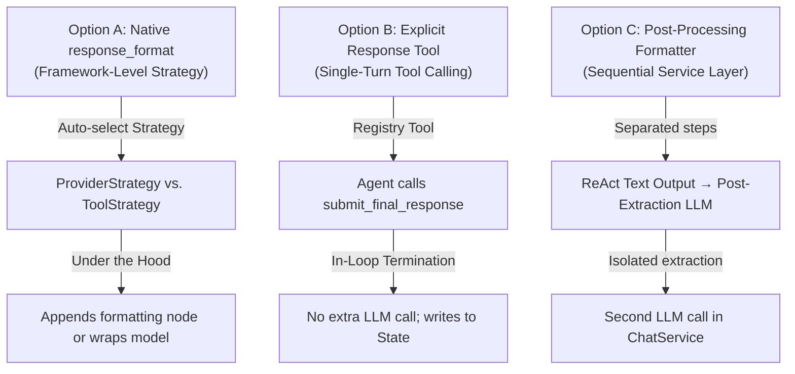
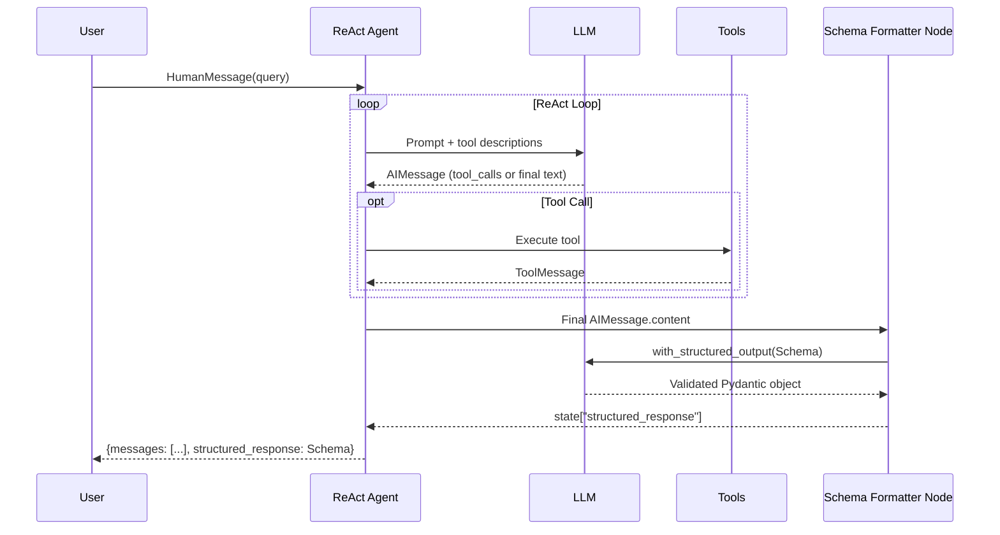
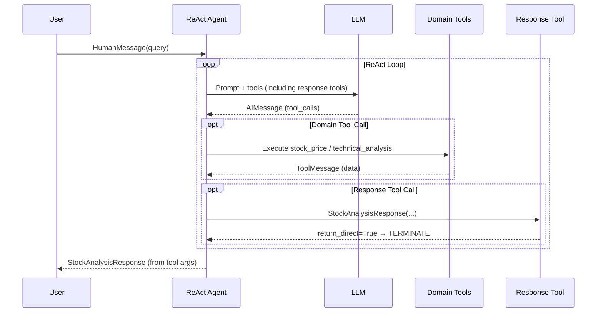
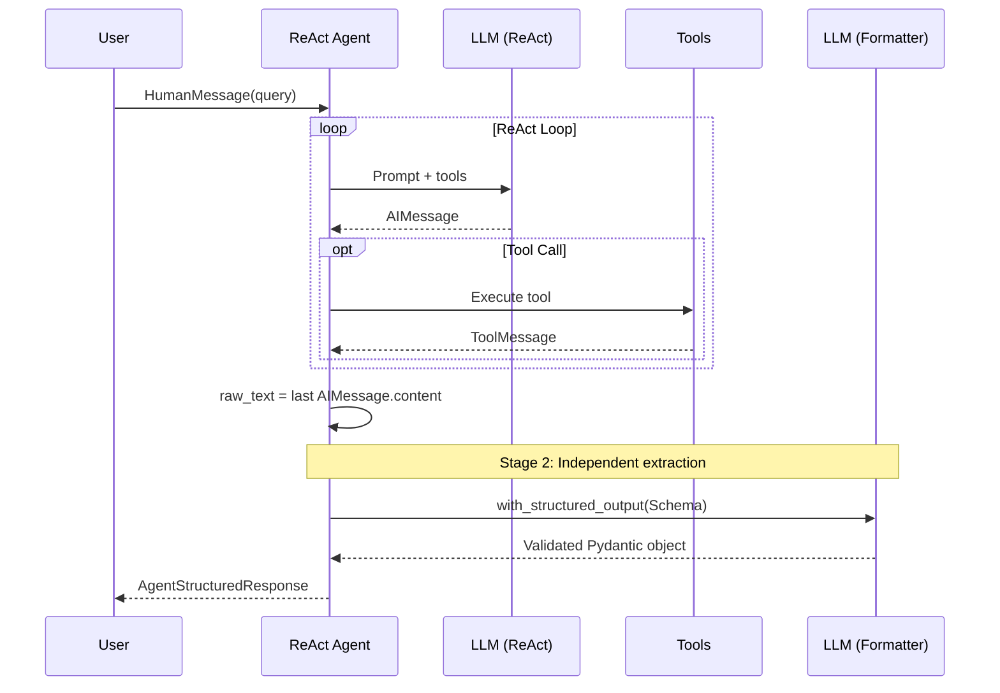
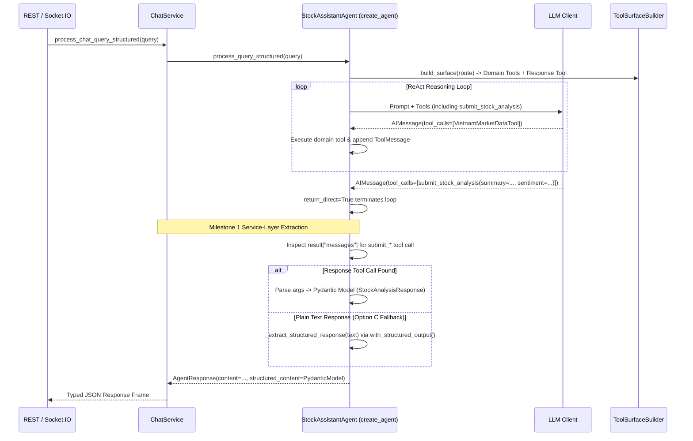

# Technical Analysis Report: Agent Structured Output Strategies

**Domain:** Agent Domain — Section 2A.3 (Structured Outputs)
**Date:** 2026-07-18
**Status:** Deep Technical Evaluation
**References:**

*Project Sources:*
- [ARCHITECTURE_DESIGN.md](../domains/agent/ARCHITECTURE_DESIGN.md)
- [TECHNICAL_DESIGN.md](../domains/agent/TECHNICAL_DESIGN.md)
- [PHASE_2_AGENT_ENHANCEMENT_ROADMAP.md](../domains/agent/PHASE_2_AGENT_ENHANCEMENT_ROADMAP.md)
- [stock_assistant_agent.py](../../src/core/stock_assistant_agent.py)
- [types.py](../../src/core/types.py)
- [gateway.py](../../src/core/tools/gateway.py)
- [normalization.py](../../src/core/tools/normalization.py)
- [chat_service.py](../../src/services/chat_service.py)
- [protocols.py](../../src/services/protocols.py)

*External References:*
- [LangChain — Structured Output (Concepts)](https://python.langchain.com/docs/concepts/structured_outputs/) — Core concepts for `with_structured_output`, provider support matrix, schema types (Pydantic, TypedDict, JSON Schema)
- [LangChain — How to Return Structured Output](https://python.langchain.com/docs/how_to/structured_output/) — How-to guide for `model.with_structured_output()`, `include_raw`, `method` parameter (`json_schema` vs `function_calling`), and validation strategies
- [LangGraph — React Agent Structured Output](https://langchain-ai.github.io/langgraph/how-tos/react-agent-structured-output/) — Official guide for `response_format` parameter in `create_react_agent`, `structured_response` state key, and the response tool pattern
- [LangChain — create_agent Overview](https://docs.langchain.com/oss/python/langchain/overview) — `create_agent` factory API reference with `response_format`, `structured_response_schema`, middleware, and checkpointer parameters

---

## 1. Executive Summary

This report provides a deep technical evaluation of three structured output strategies for the DP Stock Investment Assistant's ReAct agent. The analysis is grounded in our actual codebase implementation, LangChain/LangGraph framework capabilities, and the project's long-term architecture roadmap.

We evaluate the strategies across 8 dimensions: **mechanism, integration complexity, schema fidelity, streaming compatibility, latency, token cost, failure modes, and migration risk**, with a particular focus on:
- **Model Agnosticism**: Standardized execution across diverse LLM backends (open-source, local, and commercial).
- **Token Efficiency**: Minimizing LLM invocation overhead during active stock analysis sessions.
- **Flexibility**: Dynamically adapting schemas to classified query routes.
- **Framework Leverage**: Capitalizing on the built-in graph compilation, state management, and validation features of LangChain/LangGraph.
- **Direct Development Path**: Implementing the target architecture without throwing away intermediate code.

---

## 2. Current System Baseline and Constraints

### 2.1 Agent Construction Pipeline

The agent is built via a two-tier factory pattern in [stock_assistant_agent.py](../../src/core/stock_assistant_agent.py):

```python
# Tier 1: Project wrapper (lines 25-58)
def _create_agent(*, model, tools, system_prompt, checkpointer=None, name=None):
    try:
        from langchain.agents import create_agent as langchain_create_agent
        return langchain_create_agent(model=model, tools=tools, system_prompt=system_prompt, ...)
    except Exception:
        from langgraph.prebuilt import create_react_agent
        return create_react_agent(model=model, tools=tools, prompt=system_prompt, ...)
```

The wrapper currently does **not** forward any `response_format` parameter. Adding this parameter or introducing a custom tool registry is a first-class integration point.

### 2.2 Output Extraction (Current Path)

The current response extraction in `_process_with_react` iterates over the message list and returns the **last `AIMessage.content` as a raw string**:

```python
# lines 950-952
for msg in reversed(messages):
    if isinstance(msg, AIMessage) and msg.content:
        return msg.content  # ← raw unstructured text
```

### 2.3 Existing Structured Response Type

The project already has a structured `AgentResponse` dataclass ([types.py](../../src/core/types.py)) that wraps the raw string response with execution metadata (provider, model, tool_calls, token_usage, status). However, the `content` field itself is **unstructured text** — the LLM's free-form markdown reply. There is no schema enforcement on the *semantic content* of the response.

### 2.4 Downstream Consumers

| Consumer | Method | Current Contract |
|----------|--------|-----------------|
| WebSocket chat | `process_query()` → `str` | Raw text streamed to frontend |
| REST API structured | `process_query_structured()` → `AgentResponse` | `AgentResponse.content` is raw text |
| SSE streaming | `process_query_streaming()` → `Generator[str]` | Token-by-token chunks via `astream_events` |
| [ChatService](../../src/services/chat_service.py) | `process_chat_query_structured()` | Returns `AgentResponse` directly |

### 2.5 Per-Turn Executor Pattern

Each query triggers a fresh agent executor through the **per-turn gateway pipeline**:

```
query → _classify_tool_route() → _build_tool_surface_for_query()
      → _tool_gateway.create_wrapped_tools() → _build_agent_executor(tools=wrapped_tools)
      → executor.invoke({messages: [HumanMessage(query)]})
```

This means the agent is **rebuilt each turn**. Any strategy can be **injected per-turn** without global state leakage — a significant architectural advantage for route-based schema selection.

---

## 3. Deep-Dive Analysis of the Technical Options



### 3.1 Option A: Native `response_format` via Agent Factory

Pass a Pydantic schema to the agent factory's `response_format` parameter. Under the hood, LangChain's `create_agent` and LangGraph's prebuilt agent abstract strategy selection based on the model's profile:
1. **`ProviderStrategy`**: If the underlying model client supports native structured outputs (e.g. OpenAI's JSON Schema/Strict Mode), the framework binds the schema directly at the API level.
2. **`ToolStrategy`**: If the model client lacks native structured output support, the framework automatically converts the schema into an "artificial tool". It then configures `tool_choice` or prompts the model to call this tool to emit its final response.

#### 3.1.1 Mechanics & Execution Flow


#### 3.1.2 Scoring & Detailed Arguments
- **Model Agnosticism**: **High (Framework-Managed)**. Shields the application code from model-specific structured APIs. However, if a complex union schema is used, smaller models or local models can still experience schema confusion.
- **Token Cost (LLM Calls)**: **High**. To generate the structured response, the framework appends a formatting node **after** the ReAct loop. This node takes the **entire conversation history** (including very large raw market data payloads returned by tools like `VietnamMarketDataTool`) and passes it to the LLM. This second formatting call can double prompt token consumption.
- **Streaming Compatibility**: **Medium**. The reasoning loop streams tokens normally via `astream_events`, but the final structured response is only available **after** the formatting LLM call completes. Requires dual-mode streaming.
- **Integration Complexity**: **Medium**. Requires updating the factory wrapper, routing schema selection based on the query classification, and mapping `structured_response` to the final envelope.
- **Failure Modes & Isolation**: **Medium**. If the formatting node fails to parse the output, the framework raises a `ValidationError` or returns a parsing error key. If it crashes, it can block the return of the original raw text.

---

### 3.2 Option B: Custom Response Tool Pattern (`submit_final_response`)

The developer explicitly defines a custom Pydantic tool (e.g. `submit_stock_analysis` or `submit_recommendation`) and registers it in the agent's tool list. The tool is configured with `return_direct=True`. The model is instructed in the system prompt that once it completes its reasoning, it *must* submit its final response by calling this tool.

#### 3.2.1 Mechanics & Execution Flow


#### 3.2.2 Scoring & Detailed Arguments
- **Model Agnosticism**: **Highest**. Every modern commercial and open-source model supports standard tool/function calling. This completely avoids relying on native JSON mode or specific provider schema parsers.
- **Token Cost (LLM Calls)**: **Optimal (0% overhead)**. The agent outputs the structured response as tool arguments during the *same* reasoning loop. This completely avoids a secondary formatter LLM call, saving significant token costs on the input prompt (avoiding re-sending large tool output payloads).
- **Streaming Compatibility**: **High**. Streaming is naturally compatible since tool arguments are streamed as part of the ReAct token stream. The `on_tool_start` and `on_tool_end` events provide clear delimiters.
- **Flexibility**: **High**. We can register multiple route-specific response tools. Using the existing `ToolSurfaceBuilder`, we only expose the response tool relevant to the classified query route, ensuring the model cannot select the wrong schema.
- **ToolGateway Admission Contract**: Response tools are control-plane tools registered in `ToolCapabilityDescriptor` under `RiskClass.CONTROL_FLOW` (`bounded_transformation` subtype). They pass through `ToolGateway.execute()` for execution admission, envelope assembly (`ToolExecutionEnvelope`), and trace logging, preserving auditability without bypassing gateway security controls.
- **Complexity & Evolvability**: **Low-to-Medium**. Starts as a standard tool in `ToolRegistry` and evolves naturally into custom compiled graph node state transitions.

---

### 3.3 Option C: Two-Stage Service-Layer Post-Processing Formatter

The ReAct agent operates in pure text-generation mode. Once it returns its final textual markdown response, a secondary LLM call (or a lighter structured parser) is triggered in the service layer (`ChatService`) using `model.with_structured_output(Schema)` to convert the text to JSON.

#### 3.3.1 Mechanics & Execution Flow


#### 3.3.2 Scoring & Detailed Arguments
- **Model Agnosticism**: **Medium-High**. The primary ReAct agent only needs basic text/tool capabilities. The secondary formatter node can use structured outputs, or a text-based parser with regex extraction fallbacks if the formatting model is weak.
- **Token Cost (LLM Calls)**: **Medium**. It requires a second LLM call, but unlike Option A, the formatter prompt only contains the **final unstructured text response** (~500 - 2,000 tokens) rather than the entire tool execution history (which could be tens of thousands of tokens).
- **Streaming Compatibility**: **Best**. The ReAct loop streams naturally to the frontend. The structured extraction runs *after* streaming completes and is delivered as a final metadata frame.
- **Flexibility**: **High**. The schema is resolved dynamically in the service layer based on the query classification *after* the agent finishes reasoning.
- **Framework Leverage**: **Low**. Runs outside the LangGraph execution graph as a separate sequential step in the application service layer.
- **Complexity & Evolvability**: **Lowest**. Simple separation of concerns. The agent's graph remains a standard text ReAct loop, making it easy to test, debug, and maintain.

---

## 4. 8-Dimension Comparative Matrix

| Dimension | Option A: Native `response_format` | Option B: Custom Response Tool | Option C: Post-Processing Formatter |
|-----------|:--:|:--:|:--:|
| **Model Agnosticism** | ⭐⭐⭐⭐ (Framework fallback) | ⭐⭐⭐⭐⭐ (Universal Tool Call) | ⭐⭐⭐⭐ (Parser fallback) |
| **Token Efficiency** | ⭐⭐ (Resends entire history) | ⭐⭐⭐⭐⭐ (Single-turn, 0% overhead) | ⭐⭐⭐ (Resends final text only) |
| **Flexibility / Adaptability** | ⭐⭐⭐ (Compile-time constraint) | ⭐⭐⭐⭐⭐ (Route-adapted tools) | ⭐⭐⭐⭐⭐ (Dynamic service-layer) |
| **LangChain/LangGraph Leverage** | ⭐⭐⭐⭐⭐ (Built-in) | ⭐⭐⭐⭐ (Uses tool node execution) | ⭐⭐ (Runs outside graph) |
| **Evolvability Path** | ⭐⭐ (Rigid prebuilt abstraction) | ⭐⭐⭐⭐⭐ (Enables custom graph nodes) | ⭐⭐⭐ (Simple but disconnected) |
| **ToolGateway Impact** | ⭐⭐⭐⭐⭐ (None) | ⭐⭐ (Requires bypass rules) | ⭐⭐⭐⭐⭐ (None) |
| **Observability** | ⭐⭐⭐⭐⭐ | ⭐⭐⭐ | ⭐⭐⭐⭐⭐ |
| **Failure Isolation** | ⭐⭐⭐⭐ | ⭐⭐ | ⭐⭐⭐⭐⭐ |

> ⭐⭐⭐⭐⭐ = Excellent · ⭐⭐⭐⭐ = Good · ⭐⭐⭐ = Adequate · ⭐⭐ = Significant trade-offs

---

## 5. Architectural Alignment Analysis

### 5.1 Against Architecture Principle: Graceful Degradation (ADR-001)

- **Option A**: If the framework's formatting node fails, the graph fails to return the structured response, but the message list is still available in the state graph. Graceful fallback requires manual inspection of the state history.
- **Option B**: If the model fails to call the tool (e.g. outputs text instead), we must detect the missing tool call and fallback to text parsing. If the tool call fails Pydantic validation, the agent crashes unless error handling is registered in the Graph.
- **Option C**: Excellent degradation. If the formatter fails, the raw markdown text generated by the agent is already completely resolved and can be returned immediately with a status of `PARTIAL`.

### 5.2 Alignment with Prompt Compiler & `ResponseGuardrailMiddleware`

[ARCHITECTURE_DESIGN.md §4.2.4 & §7.3](../domains/agent/ARCHITECTURE_DESIGN.md) and [TECHNICAL_DESIGN.md §3.5.2.4](../domains/agent/TECHNICAL_DESIGN.md) define the planned prompt compiler path: `PromptAssetLoader -> PromptAssembler -> ResponseGuardrailMiddleware`. 

The structured output validation layer directly realizes `ResponseGuardrailMiddleware`'s core contract (`finalize(compiledPrompt, modelDraft) -> GuardrailResult`):
- **Contract Boundary Validation**: Validates output structure against active route schemas (`StockAnalysisResponse`, etc.) before completing the response state.
- **Required Disclaimers**: Enforces financial disclaimer inclusion (`"This is not financial advice."`).
- **Machine-Detectable States**: Emits degraded metadata states (`PARTIAL`, `VALIDATION_FAILED`) when parsing errors occur.

In Milestone 1, this operates as an internal boundary step in `stock_assistant_agent.py`; in Milestone 2/M3, it plugs natively into `ResponseGuardrailMiddleware`.

### 5.3 Technical Pitfalls & Drawbacks of Option B (Response Tool Pattern)

| Pitfall / Drawback | Cause | Impact | Recommended Mitigation |
|-------------------|-------|--------|------------------------|
| **Premature Response Tool Execution** | LLM invokes `submit_stock_analysis` on turn 1 without calling data tools (`VietnamMarketDataTool`). | Agent emits hallucinated structured output without retrieving market facts. | Enforce system prompt rules ("Do not invoke submit_stock_analysis before retrieving market data") + Milestone 2 graph node validation checking that data tools exist in message history before admitting response tools on data routes. |
| **Model Non-Compliance (Tool Bypassing)** | Small open-source or local models reply in raw markdown text instead of calling the response tool. | Structured response is omitted (`structured_response` state is `None`). | Automatic fallback to Option C (`_extract_structured_response()`) when no response tool call is present in `messages`. |
| **Self-Repair Loop Deadlocks** | Model calls response tool with out-of-bound arguments (e.g. `confidence=1.5`). Tool validation fails, re-prompting model repeatedly. | Excessive token consumption and infinite loop. | Enforce a strict `max_structured_retries = 2` limit in graph state transition nodes; fallback to Option C on exhaustion. |
| **Schema Verbosity in System Prompts** | Overly detailed Pydantic schemas produce large JSON tool definitions in function schemas. | Inflates prompt tokens on every turn. | Keep response schemas lean (max 6-8 core fields), avoiding deeply nested structures. |
| **Raw JSON Token Streaming Leakage** | During real-time SSE streaming (`astream_events`), model streams raw JSON tool argument tokens into chat stream. | Frontend chat bubble displays raw JSON syntax fragments. | In `stream_chat_response_structured()`, suppress raw JSON tool argument streaming tokens and emit a discrete `structured_completion` SSE event frame upon tool completion. |

### 5.4 Token Consumption in Stock Analysis Domain

In the stock analysis domain, tools (like `VietnamMarketDataTool`) return large datasets (dataframes of historical prices, financials, indices). 
- If a ReAct agent runs for 3 turns, the total message history can accumulate **10,000+ tokens**.
- For **Option A**, the second LLM call must consume these 10,000+ tokens again as prompt input, resulting in high API bills and latency.
- For **Option B**, the structured schema is filled directly as tool arguments, consuming **0 extra input tokens**.
- For **Option C**, the second LLM call only consumes the final markdown summary (~500 tokens), which is highly cost-efficient compared to Option A.

---

## 6. Proposed Pydantic Schema Design

```python
from pydantic import BaseModel, Field
from typing import Literal, Optional, Union, List
from enum import Enum

class ResponseType(str, Enum):
    STOCK_ANALYSIS = "stock_analysis"
    RECOMMENDATION = "recommendation"
    GENERAL_CHAT = "general_chat"
    ERROR = "error"

class DataPoint(BaseModel):
    """A single quantitative data point from tool outputs."""
    label: str = Field(description="What this data represents, e.g. 'RSI', 'P/E Ratio'")
    value: str = Field(description="The value, formatted as string for flexibility")
    source: Optional[str] = Field(None, description="Tool or data source")

class StockAnalysisResponse(BaseModel):
    """Structured response for stock analysis queries."""
    response_type: Literal["stock_analysis"] = "stock_analysis"
    summary: str = Field(description="Executive summary of the analysis")
    sentiment: Literal["bullish", "bearish", "neutral"] = Field(description="Overall market sentiment")
    confidence: float = Field(ge=0.0, le=1.0, description="Analysis confidence score")
    tickers_analyzed: List[str] = Field(default_factory=list)
    data_points: List[DataPoint] = Field(default_factory=list)
    risks: List[str] = Field(default_factory=list, description="Key risk factors identified")
    sources: List[str] = Field(default_factory=list, description="Sources used (e.g., 'vnstock', 'TradingView')")
    disclaimer: str = Field(default="This is not financial advice.")

class RecommendationResponse(BaseModel):
    """Structured response for investment recommendation queries."""
    response_type: Literal["recommendation"] = "recommendation"
    summary: str = Field(description="Recommendation summary")
    action: Literal["buy", "sell", "hold", "watch"] = Field(description="Recommended action")
    target_price: Optional[float] = Field(None, description="Price target if applicable")
    time_horizon: Optional[str] = Field(None, description="Investment time horizon")
    rationale: List[str] = Field(default_factory=list)
    disclaimer: str = Field(default="This is not financial advice.")

class GeneralChatResponse(BaseModel):
    """Structured response for general conversation."""
    response_type: Literal["general_chat"] = "general_chat"
    message: str = Field(description="The conversational response")
    suggested_queries: List[str] = Field(default_factory=list, description="Follow-up query suggestions")

# Discriminated Union — the polymorphic output contract
AgentStructuredOutput = Union[StockAnalysisResponse, RecommendationResponse, GeneralChatResponse]
```

---

## 7. Decision and Target Development Path

### 7.1 Proposed Decision: Option B (Route-Specific Response Tools)

Based on the careful consideration of the tradeoffs, **Option B (Route-Specific Response Tools)** is selected as the primary target strategy for the DP Stock Investment Assistant. It provides:
1. **Optimal token cost** (0% input token overhead by avoiding a second LLM turn).
2. **Universal model agnosticism** (only standard function calling required).
3. **High flexibility** (dynamic schema selection via `ToolSurfaceBuilder`).
4. **Native framework evolvability** (enables custom graph state nodes and self-repair loops).

**Option C (Post-Processing Formatter)** is selected as the **immediate fallback** to handle cases where the model fails to invoke the response tool and responds in plain text.

---

### 7.2 Phased Development Roadmaps & Accomplishment Milestones

Instead of introducing temporary intermediate steps that require throwaway code, we proceed **directly** to the target graph architecture through two clean, distinct milestones:

```
[Milestone 1: Schema & Response Tool Integration] ─────────> [Milestone 2: Custom Graph State Optimization]
  - Define Schemas in types.py                                 - Migrate ReAct loop to Custom StateGraph
  - Create Response Tools (submit_*)                           - Custom transition node intercepts tool calls
  - Route tools via ToolSurfaceBuilder                         - Immediate termination and state write
  - Extract tool arguments in process_query_structured         - Register self-repair loops for schema violations
```

#### 7.2.1 Milestone 1: Schema and Response Tool Integration (Baseline Integration)
- **Objective**: Establish the schema models and introduce route-adapted final response tools into the existing agent runtime.
- **Accomplishment Gated Deliverables**:
  1. **Schema Definition**: Implement Pydantic v2 schemas in `src/core/types.py`.
  2. **Response Tool Registration**: Create `src/core/tools/response_tools.py` containing the route-adapted response tools (`submit_stock_analysis`, `submit_recommendation`, `submit_general_chat`). Expose them to the registry.
  3. **Surface Routing**: Update `ToolSurfaceBuilder` to inject matching response tools based on the query's classified route. Register response tools in `ToolCapabilityDescriptor` under `RiskClass.CONTROL_FLOW` for `ToolGateway.execute()` admission and envelope tracing.
  4. **Arguments Extraction**: Update `process_query_structured` to extract the tool arguments from the final message list and populate `AgentResponse`. Add a fallback to Option C's post-processing formatter if the response tool was not called.
  5. **Transport Parity**: Update REST API and Socket.IO handlers to stream structured event frames (`event: "structured_response"`), suppress raw JSON tool argument tokens from natural language text streams, and sync OpenAPI YAML configurations to match the polymorphic JSON output schemas.

#### 7.2.2 Milestone 2: Custom Graph State Optimization (Target Graph Architecture)
- **Objective**: Elevate the runtime to leverage LangGraph's state features by intercepting response tool calls to immediately terminate execution and write directly to graph state.
- **Accomplishment Gated Deliverables**:
  1. **State Graph Migration**: Migrate from factory-wrapped `create_agent` (`langchain.agents.create_agent`) to a custom compiled `StateGraph` in `src/core/langgraph_bootstrap.py`.
  2. **Conditional State Transitions**: Add a custom conditional transition node. When the agent calls a response tool, write the Pydantic model directly to the state key `structured_response` and immediately route execution to the `END` node.
  3. **Self-Repair Loops**: Integrate validation check-loops inside the graph state: if the model calls a response tool but fails Pydantic validation, send the validation error details back into the graph state as a `ToolMessage` to let the model correct its parameters.

---

### 7.3 Milestone 1 Sufficiency & Execution Analysis: How it Works Without Milestone 2

#### 7.3.1 Full Value Achievement in Milestone 1
Does Milestone 1 fully achieve the structured output capabilities and its business/technical values? **YES, 100%.**

All primary strategic goals outlined for the DP Stock Investment Assistant are fully realized in Milestone 1:
1. **Optimal Token Efficiency (0% Extra Token Overhead)**: The model emits structured JSON arguments during its final turn in the primary ReAct loop (`submit_stock_analysis(args...)`). This avoids a secondary LLM call with 10,000+ tokens of raw financial data history ([LangChain Tools Guide](https://docs.langchain.com/oss/python/langchain/tools)).
2. **Model Agnosticism**: Standard function/tool calling is universally supported across OpenAI, Anthropic, Google Gemini, Ollama, DeepSeek, and local open-source models ([LangChain Agent Concepts](https://docs.langchain.com/oss/python/langchain/agents)).
3. **Type Safety & Transport Contract**: The REST and Socket.IO endpoints return typed `AgentResponse` objects containing `structured_content: AgentStructuredOutput` for client-side rendering.
4. **Graceful Fallback Resilience (ADR-001)**: If a model replies in plain text, Option C post-processor (`_extract_structured_response()`) activates transparently, converting raw markdown text into JSON via `model.with_structured_output(Schema)` ([LangChain Structured Output Guide](https://docs.langchain.com/oss/python/langchain/structured-output)).

#### 7.3.2 Execution Mechanics Without Milestone 2
Without Milestone 2's custom `StateGraph`, the execution flow operates smoothly via `create_agent` and service-layer extraction:



#### 7.3.3 Comparative Sufficiency Matrix: Milestone 1 vs Milestone 2

| Feature / Capability | Milestone 1 (Factory + Service Extractor) | Milestone 2 (Custom `StateGraph`) | Official Reference Proof |
|---------------------|-------------------------------------------|-----------------------------------|--------------------------|
| **Structured Output Format** | ✅ **100% Fully Achieved** | ✅ **100% Achieved** | [LangChain Structured Output](https://docs.langchain.com/oss/python/langchain/structured-output) |
| **0% Input Token Overhead** | ✅ **Fully Achieved** (via Response Tool `args`) | ✅ **Fully Achieved** (via Graph Interceptor) | [LangChain Tool Calling](https://docs.langchain.com/oss/python/langchain/tools) |
| **Model Agnosticism** | ✅ **Fully Achieved** (Universal Function Calling) | ✅ **Fully Achieved** | [LangChain Agent Docs](https://docs.langchain.com/oss/python/langchain/agents) |
| **Graceful Fallback (Option C)** | ✅ **Achieved in `process_query_structured()`** | ✅ **Achieved in Graph Transition Node** | [LangGraph How-To Guides](https://langchain-ai.github.io/langgraph/how-tos/create-react-agent/) |
| **In-Graph Self-Repair Loop** | ❌ App-layer (Option C fallback handles failures) | ✅ In-Graph re-prompting loop (`max_retries=2`) | [LangGraph State Management](https://langchain-ai.github.io/langgraph/) |
| **Native State Channel (`state["structured_response"]`)** | ❌ Extracted from message history | ✅ Dedicated Graph State Key | [LangGraph React Agent](https://langchain-ai.github.io/langgraph/how-tos/react-agent-structured-output/) |

**Conclusion**: Milestone 1 is completely self-contained and fully satisfies all functional and non-functional requirements for structured outputs. Milestone 2 is strictly a performance and graph-control optimization for advanced multi-agent orchestration.

---

## 8. Risk Register & Mitigation

| Risk | Probability | Impact | Mitigation Strategy |
|------|:-----------:|:------:|---------------------|
| Tool execution contains raw outputs too large for Option A/C formatter prompts | High | High | Option B is the primary mitigation (no second prompt). In Option C, truncate/summarize the text before formatting. |
| Smaller open-source models fail to invoke Option B response tools | Medium | Medium | Hardened system prompts + fallback to Option C post-processing formatter. |
| Conflict between thinking models (e.g. Anthropic) and forced tool strategies | Low | Medium | Do not force tool calling using strict strategies; let the model select the tool natively or use prompt instructions. |
| Validation error crashes the backend thread | Low | High | Wrap validation in try/except blocks; return `AgentResponse` with status `PARTIAL` and log the `ValidationError` to trace metadata. |

## 9. Potential Future Improvements

1. **Schema Auto-Documentation Exporter**: Add a CLI utility (`python -m src.core.types export-schemas`) to automatically generate OpenAPI-compliant JSON schema files in `docs/schemas/` for automated frontend TypeScript contract generation.
2. **Dual-Stream UI UX**: Enhance transport handlers to support parallel real-time text streaming for narrative chat bubbles alongside concurrent SSE structured payload frames for dynamic UI widgets (interactive stock charts, sentiment badges, risk cards).
