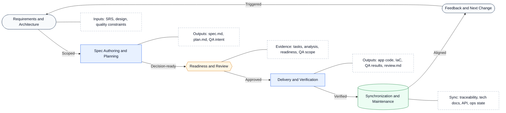
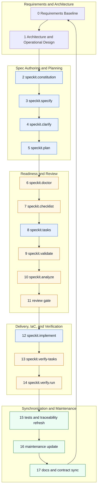
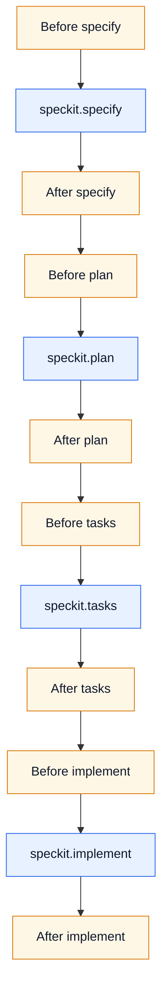
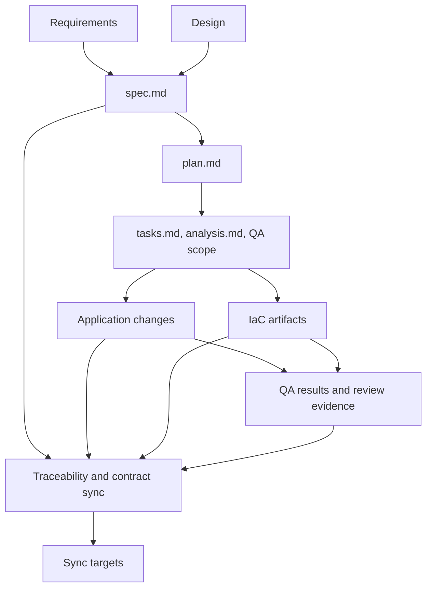

# SDD with Spec-Kit - HOW-TO

This guide defines how `dp-stock-investment-assistant` uses Spec Kit for Spec-Driven Development (SDD). It combines the official Spec Kit lifecycle with this repository's governance, traceability, and review conventions.

The most important rule in this repository is simple: governed feature work lives under [../../specs/](../../specs/). The `.specify/` directory supports Spec Kit runtime behavior, templates, integrations, extensions, and workflows, but it is not the canonical home for governed feature delivery artifacts in this project.

---

## Table of Contents

- [Spec-Kit HOW-TO](#spec-kit-how-to)
  - [1. Overview](#1-overview)
  - [2. Quick Start in This Repo](#2-quick-start-in-this-repo)
  - [3. Workflow and SDLC Loop](#3-workflow-and-sdlc-loop)
  - [4. Repository Artifact Authority](#4-repository-artifact-authority)
  - [5. Extensions and Automation](#5-extensions-and-automation)
  - [6. Best Practices](#6-best-practices)
  - [7. Troubleshooting](#7-troubleshooting)
  - [8. References](#8-references)

---

## 1. Overview

Spec Kit is the working method this repository uses to apply Spec-Driven Development (SDD) to AI-assisted software delivery. In this project, that method is intentionally expanded beyond the core Spec Kit command chain into a broader SDLC practice that also covers requirements engineering, architecture and technical design, QA and testing, deployment, operations, and maintenance. Its general purpose is to move work from vague requests and ad-hoc prompts into a governed sequence of artifacts that define intent, reduce ambiguity, guide implementation, and preserve evidence after code is written. In SDD, the specification is not throwaway documentation. It is a durable working asset that defines the `what` and `why` before the repository commits to the `how`.

This matters especially in AI agentic workflows. Spec Kit gives a coding agent structured Markdown context instead of relying only on transient chat history or one-shot prompts. The spec, plan, tasks, analysis, review evidence, and synchronization artifacts make the workflow more auditable, more reviewable, and less dependent on a single model turn. In practice, humans still own scope, business intent, architectural constraints, and approval decisions; the agent accelerates clarification, planning, implementation, and verification inside those boundaries. In this repository, those governed artifacts are also tied back to SRS baselines, design documentation, QA evidence, operational expectations, and post-delivery maintenance synchronization.

### 1.1 Purpose and Philosophy

The core philosophy behind SDD with Spec Kit is simple: define what should be built before asking an agent to build it, and refine that intent through explicit quality gates rather than jumping straight from prompt to code.

- intent before implementation: specifications define expected behavior, scope, and value before technical execution begins
- multi-step refinement over one-shot generation: `specify`, `clarify`, `checklist`, `plan`, `tasks`, `analyze`, and `implement` are meant to progressively reduce ambiguity
- structured context for AI agents: each artifact feeds the next stage so the agent works from governed inputs instead of improvising from incomplete instructions
- iterative SDLC, not waterfall theater: the workflow loops from requirements through synchronization and back into the next governed change
- technology-independent process: Spec Kit is a delivery method, not a framework lock-in; this repository applies it within its own architecture, standards, and governance rules

### 1.2 Audience and Participants

This HOW-TO is for everyone who contributes to a governed change, not only the person writing code.

- product owners, analysts, and domain experts who define business intent, scope, and acceptance expectations
- architects and technical leads who shape solution boundaries, standards, and integration constraints
- implementation engineers and AI coding agents who turn approved artifacts into working changes
- reviewers and QA participants who check requirement quality, artifact consistency, test evidence, and implementation correctness
- maintainers, release owners, and API or documentation owners who must keep contracts, traceability, and operational guidance synchronized after delivery

### 1.3 What This Repository Adds

This repository does not use Spec Kit as a generic demo flow. It extends core Spec Kit into a broader SDLC practice with project-specific governance, artifact authority, and synchronization disciplines.

- requirements engineering is part of the governed method: SRS artifacts, scoped requirements, and traceability are treated as first-class delivery inputs and outputs
- architecture and technical design are explicit lifecycle concerns: solution boundaries, design constraints, and technical documentation are reviewed and synchronized alongside specifications and code
- QA, testing, deployment, operations, and maintenance are included in the loop: verification evidence, operational readiness, contract updates, and maintenance synchronization are governed responsibilities rather than afterthoughts
- root [../../specs/](../../specs/) is the source of truth for governed feature artifacts
- `.specify/` supports runtime behavior, templates, integrations, extensions, and workflows, but it is not the canonical store for governed delivery evidence
- SRS traceability must remain synchronized in [../../specs/spec-traceability.yaml](../../specs/spec-traceability.yaml)
- sync reporting must stay current in [../../specs/spec-sync-status.md](../../specs/spec-sync-status.md)
- REST API changes must keep [../../docs/openapi.yaml](../../docs/openapi.yaml) aligned with implementation
- repository-specific review and verification extensions act as quality gates around the core Spec Kit flow

### 1.4 Constraints, Limits, and Pitfalls

SDD with Spec Kit improves AI-assisted delivery, but it does not remove engineering responsibility. The main constraints and pitfalls to watch in this repository are below.

- Spec Kit is not a substitute for domain knowledge, architecture judgment, security review, or testing discipline
- skipping clarification or checklist quality gates usually pushes ambiguity downstream into weak plans, fragile tasks, and low-confidence code generation
- one-shot prompting is still possible, but it works poorly for meaningful or ambiguous changes and increases rework risk
- large features should be phased so the agent does not lose context and reviewers can validate progress incrementally
- specifications should stay focused on behavior, constraints, and intent; forcing low-level implementation details too early can reduce better design options later
- artifact drift is a real risk: specs, plans, tasks, code, tests, traceability, and API contracts can diverge if synchronization is skipped after implementation
- generated artifacts are only useful if they remain current; stale specs or stale traceability can create false confidence in the delivery state
- repository governance still wins over generic Spec Kit defaults: when project rules and generated output differ, this repository's canonical artifacts and review gates take precedence

## 2. Quick Start in This Repo

This repository is already initialized for Spec Kit with GitHub Copilot and PowerShell-oriented scripts. In most cases, contributors inspect and use the existing setup rather than initialize the project again.

### 2.1 Prerequisites

- Access to this repository and its documentation
- Git, Python 3.11+, and either `uv` or `pipx`
- GitHub Copilot available in VS Code
- Familiarity with Markdown and the local [../../.specify/templates/spec-template.md](../../.specify/templates/spec-template.md)

### 2.2 Core Local Checks

Use these commands to confirm your local Spec Kit toolchain and project metadata are available:

```powershell
specify version
specify check
specify integration list
specify extension list
specify workflow list
```

### 2.3 Install or Recreate Local CLI Access

Persistent installation:

```powershell
uv tool install specify-cli --from git+https://github.com/github/spec-kit.git@vX.Y.Z
specify version
```

One-time execution without installing:

```powershell
uvx --from git+https://github.com/github/spec-kit.git specify version
```

If you must recreate Spec Kit metadata in a clean working copy, use the repository's current integration style:

```powershell
specify init --here --integration copilot --script ps
```

Only re-run initialization when you intentionally need to restore or recreate `.specify/` and related managed assets.

## 3. Workflow and SDLC Loop

This section describes the repository's full Spec-Driven Development operating model across the SDLC, not only the core Spec Kit command chain. In this project, the loop starts with requirements engineering, architecture, and technical design; uses Spec Kit to govern specification, clarification, planning, task generation, implementation, and review; and then closes through QA and testing evidence, traceability refresh, operational alignment, and maintenance synchronization.

The workflow is intentionally iterative rather than waterfall. A governed change begins with requirements and design inputs, produces specifications and plans, delivers application and infrastructure changes, records QA and testing results as review evidence, and then synchronizes traceability, contracts, technical documentation, and maintenance state so the next cycle starts from an accurate governed baseline.

### 3.1 SDLC Loop Overview



Verification and synchronization are not terminal stages in this repository. They close the loop by refreshing the governed baseline, so the next clarification, plan revision, defect fix, or feature cycle starts from current specs, current contracts, current QA evidence, and current traceability.

QA is embedded through the full loop in this repository: requirements define testability, plans define intended verification, readiness gates check coverage and consistency, delivery produces QA results, and synchronization preserves those results as governed evidence.

#### 3.1.1 How to Read the Loop

| Symbol | What it means in this repository | Examples in the loop |
|--------|----------------------------------|----------------------|
| ⚪ | Gray state node: loop boundary state that either starts or restarts governed work | requirements intake, feedback into the next change |
| 🟦 | Blue phase node: main delivery phase that creates or changes governed artifacts | specification and planning, delivery and verification |
| 🟧 | Orange gate node: review checkpoint that decides whether work can advance | readiness, review approval |
| 🟩 | Green sync node: post-delivery alignment work that makes implementation and documentation agree | traceability refresh, technical documentation sync, API contract sync |
| ⬜ | Dashed note node: short annotation showing the dominant inputs, outputs, or evidence for a nearby phase | SRS and design inputs, plan outputs, QA evidence |

#### 3.1.2 QA Through the Loop

Testing and QA are woven into the loop rather than deferred to the end. Steps `15-17` formalize the refresh cycle, but the evidence needed for those steps is designed during specification, pressure-tested during readiness, executed during delivery, and synchronized during maintenance.

| Loop phase | QA intent | Repository evidence |
|------------|-----------|---------------------|
| Requirements and Architecture | Define acceptance boundaries, testability expectations, affected non-functional constraints, and delivery impacts | [../../docs/testing/VERIFICATION_AND_TRACEABILITY_STRATEGY.md](../../docs/testing/VERIFICATION_AND_TRACEABILITY_STRATEGY.md)<br/>requirements and architecture inputs used by the feature |
| Spec Authoring and Planning | Turn requirements into verifiable acceptance criteria, planned test coverage, and expected infrastructure or deployment impact | [../../docs/testing/API_TEST_TOOL_COMPARISON_REPORT.md](../../docs/testing/API_TEST_TOOL_COMPARISON_REPORT.md)<br/>`specs/feature/spec.md`<br/>`specs/feature/plan.md` |
| Readiness and Review | Check that planned tasks, traceability, review criteria, and QA scope are strong enough before implementation begins | `specs/feature/tasks.md`<br/>`specs/feature/analysis.md`<br/>readiness and review findings |
| Delivery and Verification | Execute and record regression, runtime, performance, and security results against the approved plan | `tests/test_*.py`<br/>[../../tests/api/](../../tests/api/)<br/>[../../tests/integration/](../../tests/integration/)<br/>[../../tests/performance/](../../tests/performance/)<br/>[../../tests/security/](../../tests/security/)<br/>[../../tests/API tests.md](../../tests/API%20tests.md)<br/>[../../docs/testing/backend-api-service/HOWTO_PYTEST_RUNTIME_API_INTEGRATION.md](../../docs/testing/backend-api-service/HOWTO_PYTEST_RUNTIME_API_INTEGRATION.md)<br/>`specs/feature/review.md` |
| Synchronization and Maintenance | Preserve QA outcomes as governed evidence and sync all affected contracts, trace links, and maintenance state | [../../specs/spec-traceability.yaml](../../specs/spec-traceability.yaml)<br/>[../../specs/spec-sync-status.md](../../specs/spec-sync-status.md)<br/>[../../docs/domains/agent/SRS_SPEC_TRACEABILITY.md](../../docs/domains/agent/SRS_SPEC_TRACEABILITY.md)<br/>[../../docs/openapi.yaml](../../docs/openapi.yaml) |

### 3.2 Artifact-by-Phase Map

| SDLC Phase | Steps | Main Inputs | Main Outputs and Sync Targets |
|------------|-------|-------------|-------------------------------|
| Requirements and Architecture | `0-1` | [../../docs/domains/agent/SOFTWARE_REQUIREMENTS_SPECIFICATION.md](../../docs/domains/agent/SOFTWARE_REQUIREMENTS_SPECIFICATION.md)<br/>[../../docs/system/SYSTEM_REQUIREMENTS_SPECIFICATION.md](../../docs/system/SYSTEM_REQUIREMENTS_SPECIFICATION.md)<br/>[../../docs/system/REQUIREMENTS_METHOD_AND_GOVERNANCE.md](../../docs/system/REQUIREMENTS_METHOD_AND_GOVERNANCE.md)<br/>[../../docs/architecture/SYSTEM_OVERVIEW_AND_BOUNDARIES.md](../../docs/architecture/SYSTEM_OVERVIEW_AND_BOUNDARIES.md)<br/>domain technical design docs under `docs/domains/` | Scoped requirement set, affected architecture boundaries, initial acceptance and testability expectations, and expected delivery or operational impact |
| Spec Authoring and Planning | `2-5` | requirements baseline, architecture references, [../../specs/spec-traceability.yaml](../../specs/spec-traceability.yaml) | `specs/feature/spec.md`<br/>`specs/feature/plan.md`<br/>updated feature-to-SRS mapping, draft QA intent, and expected application or IaC change scope |
| Readiness and Review | `6-11` | governed spec and plan artifacts, planned test intent, review criteria | `specs/feature/tasks.md`<br/>`specs/feature/analysis.md`<br/>review findings, readiness verdict, QA scope, and expected test coverage |
| Delivery and Verification | `12-14` | tasks, review findings, [../../docs/testing/VERIFICATION_AND_TRACEABILITY_STRATEGY.md](../../docs/testing/VERIFICATION_AND_TRACEABILITY_STRATEGY.md)<br/>[../../docs/testing/backend-api-service/HOWTO_PYTEST_RUNTIME_API_INTEGRATION.md](../../docs/testing/backend-api-service/HOWTO_PYTEST_RUNTIME_API_INTEGRATION.md) | implemented application changes in `src/` and `frontend/`<br/>IaC artifacts in `IaC/Dockerfile.api`, `IaC/Dockerfile.agent`, `IaC/helm/dp-stock/`, `IaC/infra/terraform/`, and `IaC/ci-cd/`<br/>QA and testing results in `tests/` and `specs/feature/review.md` |
| Synchronization and Maintenance | `15-17` | delivered code, IaC outputs, QA evidence, review evidence, operational policy, and API contract references | [../../specs/spec-traceability.yaml](../../specs/spec-traceability.yaml)<br/>[../../specs/spec-sync-status.md](../../specs/spec-sync-status.md)<br/>[../../docs/domains/agent/SRS_SPEC_TRACEABILITY.md](../../docs/domains/agent/SRS_SPEC_TRACEABILITY.md)<br/>[../../docs/openapi.yaml](../../docs/openapi.yaml)<br/>updated technical design, release, and maintenance notes<br/>for prompt-system changes: [../../docs/domains/agent/TECHNICAL_DESIGN.md#35-prompt-realization-and-guardrails](../../docs/domains/agent/TECHNICAL_DESIGN.md#35-prompt-realization-and-guardrails), [../../docs/domains/agent/ARCHITECTURE_DESIGN.md](../../docs/domains/agent/ARCHITECTURE_DESIGN.md), [../../docs/domains/agent/PROMPT_SYSTEM_RESEARCH_PROPOSAL.md](../../docs/domains/agent/PROMPT_SYSTEM_RESEARCH_PROPOSAL.md), [../../docs/domains/agent/PHASE_2_AGENT_ENHANCEMENT_ROADMAP.md](../../docs/domains/agent/PHASE_2_AGENT_ENHANCEMENT_ROADMAP.md), and [../../docs/domains/agent/PROMPT_SYSTEM_BENCHMARK_REVIEW.md](../../docs/domains/agent/PROMPT_SYSTEM_BENCHMARK_REVIEW.md) |

### 3.3 17-Step Lifecycle Aligned to the Loop

The 17-step lifecycle below is the detailed execution model inside the SDLC loop. The steps are grouped by SDLC phase so they complement the loop rather than compete with it.

#### 3.3.1 Requirements and Architecture Foundation

0. **Requirements Baseline**: Define functional and non-functional requirements as traceable SRS items with stable identifiers, measurable behavior, and explicit scope boundaries.
1. **Architecture and Operational Design**: Define architectural, technical, and operational specifications that satisfy the requirements and align with repository principles.

#### 3.3.2 Spec Authoring and Planning

2. **`speckit.constitution`**: Establish or refine the project and feature governance rules that constrain all downstream artifacts and implementation choices.
3. **`speckit.specify`**: Produce the feature specification, map it back to SRS scope, and publish governed artifacts under [../../specs/](../../specs/).
4. **`speckit.clarify`**: Resolve ambiguity, missing constraints, open questions, and weak acceptance criteria before the workflow advances.
5. **`speckit.plan`**: Generate the technical implementation plan and update SRS-to-spec traceability when scope changes or new coverage is introduced.

#### 3.3.3 Readiness and Review

6. **`speckit.doctor`**: Validate project health, command surfaces, templates, and repository readiness before deeper execution.
7. **`speckit.checklist`**: Pressure-test specification quality, completeness, and ambiguity using a structured requirements checklist.
8. **`speckit.tasks`**: Break the approved plan into actionable, dependency-aware implementation tasks.
9. **`speckit.validate`**: Validate traceability, artifact completeness, and workflow readiness before implementation begins.
10. **`speckit.analyze`**: Run cross-artifact consistency analysis across the specification, plan, and task set.
11. **Review Gate**: Conduct structured pre-implementation review. Historical notes may call this `speckit.review`, but the current repository review path is typically `speckit.fleet.review` or an equivalent governed review step.

#### 3.3.4 Delivery and Verification

12. **`speckit.implement`**: Execute the approved implementation plan against the governed artifact set across application code and any required delivery or infrastructure artifacts, including `src/`, `frontend/`, and `IaC/`.
13. **`speckit.verify-tasks`**: Detect phantom completions and verify that tasks marked complete correspond to actual implemented work.
14. **`speckit.verify.run`**: Validate implementation against the specification, plan, tasks, and constitution. This stage should leave governed QA and testing results that can be carried into `review.md`, traceability, and downstream maintenance sync.

#### 3.3.5 Synchronization and Maintenance

15. **Test and Traceability Refresh**: Run project test suites and update [../../specs/spec-traceability.yaml](../../specs/spec-traceability.yaml) whenever delivered scope changes.
16. **Maintenance Update**: Keep governed feature artifacts current after delivery, including plan, review, status, and operational notes when behavior evolves.
17. **Implementation, Specs, and Technical Documentation Synchronization**: Keep code, governed specs, technical documentation, and external contracts such as [../../docs/openapi.yaml](../../docs/openapi.yaml) synchronized over time.

### 3.4 Workflow Visuals

The diagrams below answer three different workflow questions: where the 17 steps sit inside the SDLC loop, where repository hooks and gates attach, and which project artifacts move through the governed delivery flow.

#### 3.4.1 17-Step Placement in the SDLC Loop



#### 3.4.2 Hook and Review Overlay



In this repository, the hook sequence usually covers branch setup, memory loading, `doctor`, `validate`, fleet review, verification, and architecture review around the core `specify`, `plan`, `tasks`, and `implement` commands.

#### 3.4.3 Artifact Flow and Synchronization



The main synchronization targets behind the final node are [../../specs/spec-traceability.yaml](../../specs/spec-traceability.yaml), [../../specs/spec-sync-status.md](../../specs/spec-sync-status.md), [../../docs/domains/agent/SRS_SPEC_TRACEABILITY.md](../../docs/domains/agent/SRS_SPEC_TRACEABILITY.md), and [../../docs/openapi.yaml](../../docs/openapi.yaml). In this repository, the IaC outputs in [../../IaC/](../../IaC/) and the QA results captured in `tests/` plus `specs/feature/review.md` are also part of the governed evidence chain.

### 3.5 Command Normalization Notes

The repository still contains older lifecycle terminology in some places. Use the current command surfaces below when updating documentation or executing the workflow:

| Historical Label | Current Repository Surface |
|------------------|----------------------------|
| `speckit.doctor` | `speckit.doctor` alias for `speckit.speckit-utils.doctor` |
| `speckit.validate` | `speckit.validate` alias for `speckit.speckit-utils.validate` |
| `speckit.review` | typically handled as `speckit.fleet.review` in this repository |
| `speckit.verify` | `speckit.verify.run` |
| `speckit.tests` | repository test execution plus traceability refresh, not a single core Spec Kit command |
| `speckit.maintain` | maintenance stage name, not a single installed core command |

## 4. Repository Artifact Authority

| Location | Role | Authority Level | Notes |
|----------|------|-----------------|-------|
| [../../specs/](../../specs/) | Governed feature work | Canonical | Create and maintain approved feature specs, plans, tasks, review evidence, and sync artifacts here. |
| [../../specs/spec-traceability.yaml](../../specs/spec-traceability.yaml) | SRS to feature traceability | Canonical | Update when a feature gains, removes, or changes SRS scope. |
| [../../specs/spec-sync-status.md](../../specs/spec-sync-status.md) | Feature sync reporting | Canonical | Reflects current coverage, derived status, and evidence links. |
| [../../.specify/](../../.specify/) | Runtime and automation area | Supporting | Stores templates, workflows, integration metadata, extension catalogs, scripts, and local command assets. |
| [../../.specify/templates/](../../.specify/templates/) | Spec Kit templates | Supporting | Use as references when shaping governed artifacts, but publish governed outputs in root `specs/`. |
| [../../docs/spec-driven development (SDD)/](../../docs/spec-driven%20development%20(SDD)/) | Process guidance | Supporting | Method guidance lives here, not governed feature delivery artifacts. |
| [../../docs/openapi.yaml](../../docs/openapi.yaml) | Public REST contract | Canonical when API changes | Required synchronization target whenever REST API behavior changes. |

## 5. Extensions and Automation

Spec Kit extensions are managed through the `specify` CLI and repository configuration under [../../.specify/](../../.specify/). Use current command names and current file locations when working on this repository.

### 5.1 Current Configuration Surfaces

| Path | Purpose |
|------|---------|
| [../../.specify/integration.json](../../.specify/integration.json) | Declares the default integration and script style. This repository is set up for GitHub Copilot with PowerShell-oriented scripts. |
| [../../.specify/extensions.yml](../../.specify/extensions.yml) | Defines extension hooks before and after key lifecycle commands. |
| [../../.specify/extension-catalogs.yml](../../.specify/extension-catalogs.yml) | Lists the official and community extension catalogs. |
| [../../.specify/extensions/](../../.specify/extensions/) | Stores extension packages, prompts, configs, and command assets used by the repository. |
| [../../.specify/workflows/](../../.specify/workflows/) | Stores workflow definitions such as the local `speckit` workflow. |

### 5.2 Current CLI Patterns

Inspect the current project setup with:

```powershell
specify integration list
specify extension list
specify workflow list
specify workflow info speckit
```

Use the current extension commands, not older `spec-kit` CLI forms:

```powershell
specify extension search <query>
specify extension add <name>
specify extension list
specify extension info <name>
specify extension update
```

### 5.3 Repository Hook Expectations

The repository's configured extension hooks form an operating overlay around the core Spec Kit lifecycle:

| Trigger | Typical Actions | Purpose |
|---------|-----------------|---------|
| Before `specify` | feature branch creation, memory loading | Prepare a clean feature context |
| After `specify` | doctor, optional commit | Check project health and preserve generated state |
| Before `plan` | optional commit, memory loading | Carry forward clean context into planning |
| After `plan` | validate, architecture scan | Check traceability and detect drift early |
| Before `tasks` | optional commit, memory loading | Keep task generation grounded in current state |
| After `tasks` | requirements validation, fleet review, architecture follow-up | Strengthen readiness before implementation |
| Before `implement` | optional commit, memory loading | Reduce context loss before code generation |
| After `implement` | verify-tasks, verify.run, architecture review | Confirm real delivery and post-implementation compliance |

When documenting or adjusting this automation, prefer what is actually configured in [../../.specify/extensions.yml](../../.specify/extensions.yml) over generic examples from older Spec Kit material.

## 6. Best Practices

- Create and maintain governed feature artifacts under [../../specs/](../../specs/), not under `docs/` and not as the primary record in `.specify/specs/`.
- Keep [../../specs/spec-traceability.yaml](../../specs/spec-traceability.yaml) synchronized whenever SRS scope changes.
- Keep [../../specs/spec-sync-status.md](../../specs/spec-sync-status.md) aligned with actual feature status and evidence.
- Treat the project constitution in [../../.specify/memory/constitution.md](../../.specify/memory/constitution.md) as binding when reviewing or implementing work.
- Use [../../docs/openapi.yaml](../../docs/openapi.yaml) as a mandatory synchronization target for REST API changes.
- Prefer current official documentation links from `https://github.github.io/spec-kit/` over older repository blob links.
- Keep diagrams, tables, command names, and prose synchronized so the workflow description does not drift.
- Use `speckit.clarify` aggressively when requirements remain ambiguous before implementation.

## 7. Troubleshooting

- **`specify` is not available**: install the CLI with `uv tool install` or use one-shot execution with `uvx --from git+https://github.com/github/spec-kit.git specify ...`.
- **A command does not appear in the agent**: run `specify extension list`, confirm the related extension is available locally, and review [../../.specify/extensions.yml](../../.specify/extensions.yml).
- **The integration looks wrong**: run `specify integration list`; this repository expects GitHub Copilot with PowerShell-oriented scripts.
- **Unsure where to place new feature artifacts**: publish governed work in [../../specs/](../../specs/). Treat `.specify/` as supporting automation and template infrastructure.
- **Traceability is stale**: update [../../specs/spec-traceability.yaml](../../specs/spec-traceability.yaml), refresh task and review evidence, then bring [../../specs/spec-sync-status.md](../../specs/spec-sync-status.md) back in line.
- **REST behavior changed but documentation did not**: update [../../docs/openapi.yaml](../../docs/openapi.yaml) as part of the same delivery cycle.
- **Mermaid does not render cleanly**: keep diagrams in fenced `mermaid` blocks and use short labels with simple punctuation.

## 8. References

### 8.1 Repository References

- [../../.specify/templates/spec-template.md](../../.specify/templates/spec-template.md)
- [../../.specify/extensions.yml](../../.specify/extensions.yml)
- [../../.specify/extension-catalogs.yml](../../.specify/extension-catalogs.yml)
- [../../.specify/integration.json](../../.specify/integration.json)
- [../../.specify/workflows/speckit/workflow.yml](../../.specify/workflows/speckit/workflow.yml)
- [../../.specify/memory/constitution.md](../../.specify/memory/constitution.md)
- [../../specs/spec-traceability.yaml](../../specs/spec-traceability.yaml)
- [../../specs/spec-sync-status.md](../../specs/spec-sync-status.md)
- [../../.github/instructions/architecture.instructions.md](../../.github/instructions/architecture.instructions.md)
- [../../.github/instructions/testing.instructions.md](../../.github/instructions/testing.instructions.md)
- [../../docs/openapi.yaml](../../docs/openapi.yaml)

### 8.2 Official Spec Kit Documentation

- [Spec Kit Home](https://github.github.io/spec-kit/index.html)
- [Installation Guide](https://github.github.io/spec-kit/installation.html)
- [Quick Start Guide](https://github.github.io/spec-kit/quickstart.html)
- [What is Spec-Driven Development?](https://github.github.io/spec-kit/concepts/sdd.html)
- [CLI Reference](https://github.github.io/spec-kit/reference/overview.html)
- [Core Commands Reference](https://github.github.io/spec-kit/reference/core.html)
- [Integrations Reference](https://github.github.io/spec-kit/reference/integrations.html)
- [Extensions Reference](https://github.github.io/spec-kit/reference/extensions.html)
- [Workflows Reference](https://github.github.io/spec-kit/reference/workflows.html)