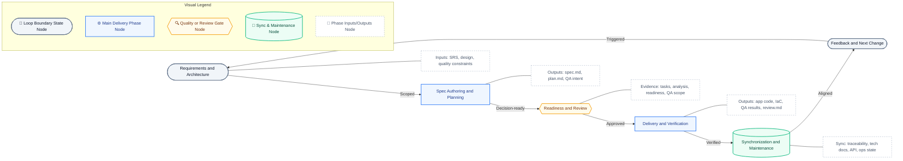
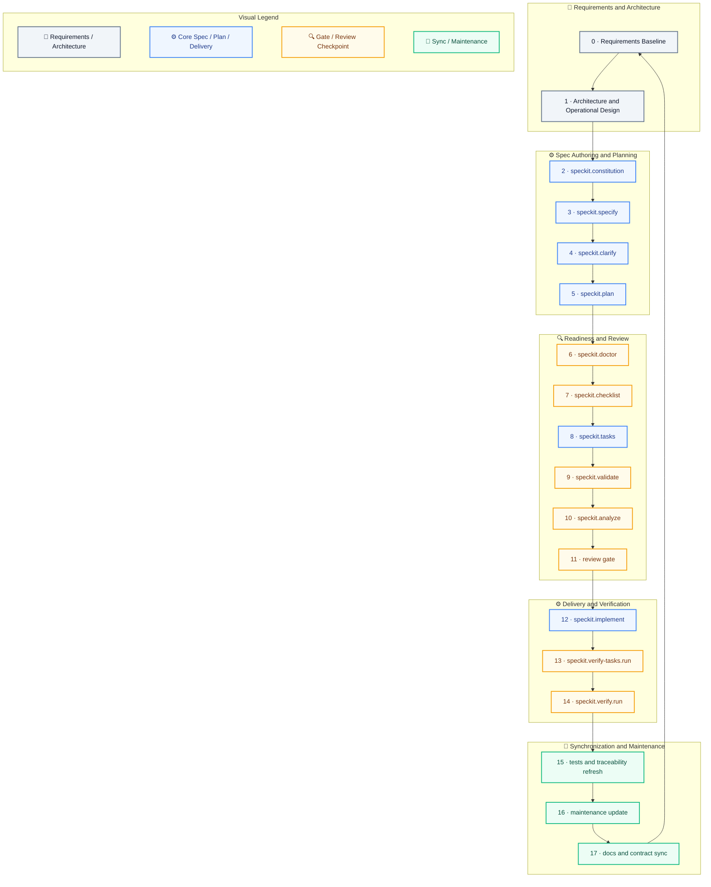
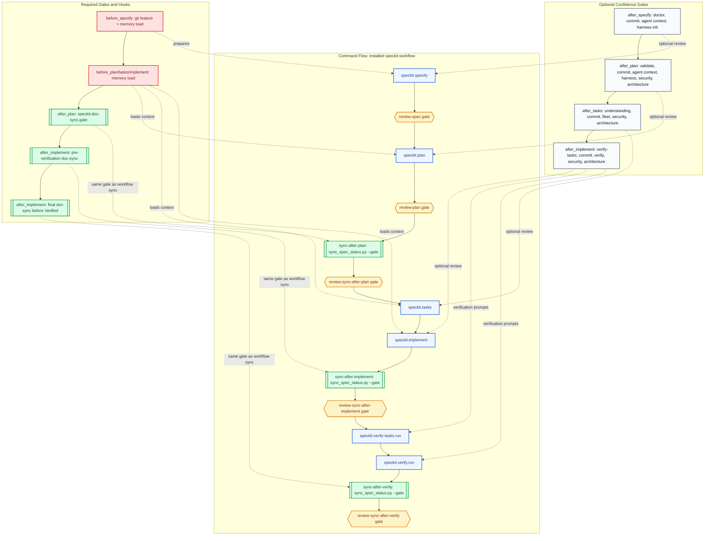
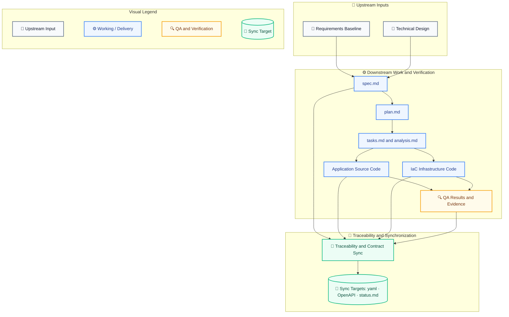
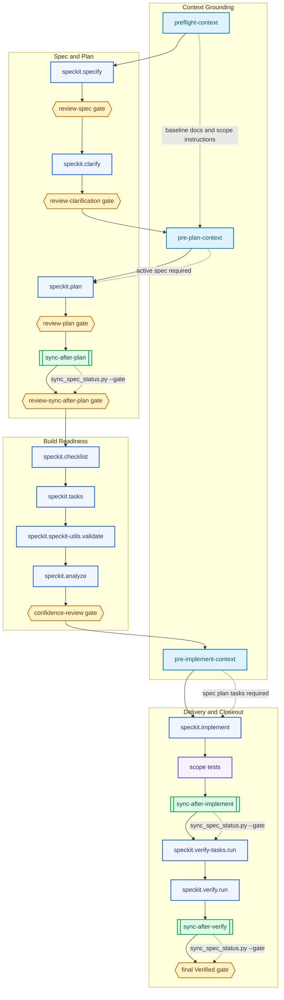

# SDD with Spec Kit - HOW-TO

This guide defines how `dp-stock-investment-assistant` uses Spec Kit to implement Spec-Driven Development (SDD). It combines the official Spec Kit lifecycle with this repository's governance, traceability, and review conventions.

The most important rule in this repository is simple: governed feature work lives under [../../specs/](../../specs/). The `.specify/` directory supports Spec Kit runtime behavior, templates, integrations, extensions, and workflows, but it is not the canonical home for governed feature delivery artifacts in this project.

---

## Table of Contents

- [Spec-Kit HOW-TO](#spec-kit-how-to)
  - [1. Overview](#1-overview)
  - [2. Quick Start in This Repo](#2-quick-start-in-this-repo)
  - [3. Workflow and SDLC Loop](#3-workflow-and-sdlc-loop)
  - [4. Repository Artifact Authority](#4-repository-artifact-authority)
  - [5. Extensions and Automation](#5-extensions-and-automation)
  - [6. Best Practices](#6-best-practices)
  - [7. Troubleshooting](#7-troubleshooting)
  - [8. References](#8-references)

---

## 1. Overview

Spec Kit is the working method this repository uses to apply Spec-Driven Development (SDD) to AI-assisted software delivery. In this project, that method is intentionally expanded beyond the core Spec Kit command chain into a broader SDLC practice that also covers requirements engineering, architecture and technical design, QA and testing, deployment, operations, and maintenance. Its general purpose is to move work from vague requests and ad-hoc prompts into a governed sequence of artifacts that define intent, reduce ambiguity, guide implementation, and preserve evidence after code is written. In SDD, the specification is not throwaway documentation. It is a durable working asset that defines the `what` and `why` before the repository commits to the `how`.

This matters especially in AI agentic workflows. Spec Kit gives a coding agent structured Markdown context instead of relying only on transient chat history or one-shot prompts. The spec, plan, tasks, analysis, review evidence, and synchronization artifacts make the workflow more auditable, more reviewable, and less dependent on a single model turn. In practice, humans still own scope, business intent, architectural constraints, and approval decisions; the agent accelerates clarification, planning, implementation, and verification inside those boundaries. In this repository, those governed artifacts are also tied back to SRS baselines, design documentation, QA evidence, operational expectations, and post-delivery maintenance synchronization.

### 1.1 Purpose and Philosophy

The core philosophy behind SDD with Spec Kit is simple: define what should be built before asking an agent to build it, and refine that intent through explicit quality gates rather than jumping straight from prompt to code.

- intent before implementation: specifications define expected behavior, scope, and value before technical execution begins
- multi-step refinement over one-shot generation: `specify`, `clarify`, `checklist`, `plan`, `tasks`, `analyze`, and `implement` are meant to progressively reduce ambiguity
- structured context for AI agents: each artifact feeds the next stage so the agent works from governed inputs instead of improvising from incomplete instructions
- iterative SDLC, not waterfall theater: the workflow loops from requirements through synchronization and back into the next governed change
- technology-independent process: Spec Kit is a delivery method, not a framework lock-in; this repository applies it within its own architecture, standards, and governance rules

### 1.2 Audience and Participants

This HOW-TO is for everyone who contributes to a governed change, not only the person writing code.

- product owners, analysts, and domain experts who define business intent, scope, and acceptance expectations
- architects and technical leads who shape solution boundaries, standards, and integration constraints
- implementation engineers and AI coding agents who turn approved artifacts into working changes
- reviewers and QA participants who check requirement quality, artifact consistency, test evidence, and implementation correctness
- maintainers, release owners, and API or documentation owners who must keep contracts, traceability, and operational guidance synchronized after delivery

### 1.3 What This Repository Adds

This repository does not use Spec Kit as a generic demo flow. It extends core Spec Kit into a broader SDLC practice with project-specific governance, artifact authority, and synchronization disciplines.

- requirements engineering is part of the governed method: SRS artifacts, scoped requirements, and traceability are treated as first-class delivery inputs and outputs
- architecture and technical design are explicit lifecycle concerns: solution boundaries, design constraints, and technical documentation are reviewed and synchronized alongside specifications and code
- QA, testing, deployment, operations, and maintenance are included in the loop: verification evidence, operational readiness, contract updates, and maintenance synchronization are governed responsibilities rather than afterthoughts
- root [../../specs/](../../specs/) is the source of truth for governed feature artifacts
- `.specify/` supports runtime behavior, templates, integrations, extensions, and workflows, but it is not the canonical store for governed delivery evidence
- SRS traceability must remain synchronized in [../../specs/spec-traceability.yaml](../../specs/spec-traceability.yaml)
- sync reporting must stay current in [../../specs/spec-sync-status.md](../../specs/spec-sync-status.md)
- REST API changes must keep [../../docs/openapi.yaml](../../docs/openapi.yaml) aligned with implementation
- repository-specific review and verification extensions act as quality gates around the core Spec Kit flow

### 1.4 Constraints, Limits, and Pitfalls

SDD with Spec Kit improves AI-assisted delivery, but it does not remove engineering responsibility. The main constraints and pitfalls to watch in this repository are below.

- Spec Kit is not a substitute for domain knowledge, architecture judgment, security review, or testing discipline
- skipping clarification or checklist quality gates usually pushes ambiguity downstream into weak plans, fragile tasks, and low-confidence code generation
- one-shot prompting is still possible, but it works poorly for meaningful or ambiguous changes and increases rework risk
- large features should be phased so the agent does not lose context and reviewers can validate progress incrementally
- specifications should stay focused on behavior, constraints, and intent; forcing low-level implementation details too early can reduce better design options later
- artifact drift is a real risk: specs, plans, tasks, code, tests, traceability, and API contracts can diverge if synchronization is skipped after implementation
- generated artifacts are only useful if they remain current; stale specs or stale traceability can create false confidence in the delivery state
- repository governance still wins over generic Spec Kit defaults: when project rules and generated output differ, this repository's canonical artifacts and review gates take precedence

## 2. Quick Start in This Repo

This repository is already initialized for Spec Kit with GitHub Copilot and Codex as the supported integration, and PowerShell-oriented scripts. In most cases, contributors inspect and use the existing setup rather than initialize the project again.

### 2.1 Prerequisites

- Access to this repository and its documentation
- Git, Python 3.11+, and either `uv` or `pipx`
- Codex or GitHub Copilot available in the contributor's working environment
- Familiarity with Markdown and the local [../../.specify/templates/spec-template.md](../../.specify/templates/spec-template.md)

### 2.2 Core Local Checks

Use these commands to confirm your local Spec Kit toolchain and project metadata are available:

```powershell
specify version --features --json
specify check
specify integration status
specify integration list
specify extension list
specify workflow info speckit
Get-Content .specify\feature.json
python scripts/sync_spec_status.py --gate
```

Treat this local output as the operating truth for the current checkout. Upstream examples and older prompts are useful references, but local feature state, integration state, installed extensions, workflow steps, and sync-gate output decide what is safe to run today.

For documentation-first work in Copilot, contributors can start with the [Documentation Spec Maintainer Agent](../../.github/agents/documentation.spec-maintainer.agent.md). It is the fastest entry point for maintaining long-lived docs, delivery-scoped specs, traceability, and Copilot customization files while staying inside the same SDD lifecycle described in this HOW-TO. When feature-scoped artifacts are needed, the agent can hand off to `speckit.specify`, `speckit.plan`, and `speckit.verify.run`.

### 2.3 Current Installed State

As of 2026-07-09, this repository should be operated from the local installed truth below. Upstream documentation is useful context, but a command is adopted locally only after `specify version --features --json`, `specify extension list`, `specify workflow info speckit`, `specify workflow info sdd-feature-delivery`, and the installed prompt/skill files confirm it exists in this checkout.

| Surface | Current local state | Operating interpretation |
|---------|---------------------|--------------------------|
| Spec Kit CLI | `specify 0.12.0` | Use local command availability first; treat newer upstream commands as upgrade-gated until the CLI and managed files are upgraded together. |
| CLI feature flags | `self_check_command`, `integration_upgrade_command`, `integration_use_command`, `workflow_catalog`, `bundled_templates`, and multi-install metadata support are present | The repo can use `self check`, `self upgrade`, `integration use`, and `integration upgrade`, but must still review managed-file diffs. |
| Active feature pointer | `.specify/feature.json` stores the active `specs/<feature>/` pointer for the latest workflow context | Inspect it before plan, tasks, implementation, verification, or sync work. Do not bake the current pointer into reusable runbooks. |
| Integration metadata | `.specify/integration.json` declares default integration `codex`, installed integrations `copilot` and `codex`, and shared template alignment to `codex` | Codex is the current default. Copilot remains installed for portability. Keep one coherent feature workflow and one authoritative artifact set. |
| Integration status | `specify integration status` currently exits non-zero with `unsafe-multi-install` plus managed-file modification warnings; missing managed files and invalid manifest paths are `0` | Treat this as a known warning only while missing files and invalid manifests remain zero and the default remains intentionally `codex`. Missing files, invalid manifests, or unexpected default changes remain blockers. |
| Workflow catalog | `specify workflow list` reports the bundled `speckit` workflow and the project-owned `sdd-feature-delivery` workflow | Keep `speckit` as the compatibility/default closeout workflow. Use `sdd-feature-delivery` as the recommended normal governed feature-delivery path for this repository. |
| Compatibility workflow | `specify workflow info speckit` reports 14 steps: specify, review-spec, plan, review-plan, sync-after-plan, review-sync-after-plan, tasks, implement, sync-after-implement, review-sync-after-implement, verify-tasks, verify, sync-after-verify, review-sync-after-verify | The bundled 14-step workflow remains available with the same step graph. This repository's broader SDLC remains the governance overlay around that workflow. |
| SDD feature-delivery workflow | `specify workflow info sdd-feature-delivery` reports the project-owned workflow with context grounding, specify, review gates, clarify, plan, hard sync gates, checklist, tasks, validate, analyze, implementation, scope tests, verify-tasks, verify, final sync, and a final Verified gate | Use this for normal feature delivery. Scope-specific test gates are selected by workflow input: `agent-tool`, `backend-api`, `frontend`, or `full`. Doc-only, risky-change, and backfill workflow variants are reserved for future governed work. |
| Workflow shell-step schema | Shell steps in `.specify/workflows/*/workflow.yml` use `type: shell` with `run:` | Spec Kit 0.12 workflow validation rejects shell steps that still use `command:`. Use `command:` only for Spec Kit command steps such as `speckit.specify`. |
| Codex workflow runner | `.specify/scripts/powershell/run-sdd-feature-delivery-codex.ps1` wraps `sdd-feature-delivery` for local Codex CLI runs | Pass `-Spec "<feature description>"` for each feature. The wrapper pins the current `codex` executable for the process and injects `SPECKIT_INTEGRATION_CODEX_EXTRA_ARGS="--sandbox workspace-write"` so `codex exec` can create or update feature artifacts. |
| Workflow metadata drift | `.specify/workflows/speckit/workflow.yml` still has an input default of `copilot` while `.specify/integration.json` defaults to `codex`; `.specify/workflows/sdd-feature-delivery/workflow.yml` defaults to `codex` and supports `codex` plus `copilot` | Prefer the integration state from `.specify/integration.json` and `specify integration status` for existing workflows unless workflow metadata is corrected in a separate governed maintenance pass. |
| Installed extensions | Understanding, Verify Tasks, Spec Kit Utilities, Git, Fleet, Verify, Memory Loader, Architecture Workflow, Coding Agent Context, Research Harness, Security Review, Architecture Guard, and Document Spec Sync Gate are enabled | Use current extension command names from this HOW-TO instead of older shorthand names. |
| Document/spec sync gate | `speckit.doc-sync.gate` is the repository-local wrapper around `python scripts/sync_spec_status.py --gate` | Run this hard gate after `speckit.plan`, after `speckit.implement`, and after `speckit.verify.run`; it regenerates `specs/spec-sync-status.md` and `docs/domains/agent/SRS_SPEC_TRACEABILITY.md`. |
| Third-party sync extension | A sync extension package may exist in `.specify/extensions/sync`, but `speckit.sync.*` is not installed/enabled in the current command surface | Treat it as optional drift-analysis support only until a governed migration proves it covers this repository's generated SRS/spec reports. |

### 2.4 Install or Recreate Local CLI Access

Persistent installation:

```powershell
uv tool install specify-cli --from git+https://github.com/github/spec-kit.git@vX.Y.Z
specify version
```

One-time execution without installing:

```powershell
uvx --from git+https://github.com/github/spec-kit.git specify version
```

If you must recreate Spec Kit metadata in a clean working copy, use the repository's current integration style:

```powershell
specify init --here --integration copilot --script ps
specify init --here --integration codex --script ps
```

Only re-run initialization when you intentionally need to restore or recreate `.specify/` and related managed assets.

### 2.5 Upgrade an Existing Spec Kit Setup

When upgrading Spec Kit in this repository, treat the CLI tool and the project files as separate layers. Upgrade the CLI to get new features and bug fixes, then refresh the repository's installed Spec Kit assets so prompts, templates, scripts, and shared memory stay aligned with the version you are actually running.

#### Check Current State First

Use the following commands before upgrading:

```powershell
specify self check
specify version --features --json
specify check
specify integration status
specify extension list
specify workflow info speckit
```

- `specify self check` looks for newer released CLI versions.
- `specify version --features --json` confirms which persistent `specify` is on your `PATH` and which command surfaces are actually available.
- `specify check` validates the local installation and environment.
- `specify integration status` shows default integration, installed integrations, shared-template health, and managed-file drift.
- `specify extension list` and `specify workflow info speckit` confirm which extension commands and bundled workflow steps are locally available.

#### Upgrade the CLI Tool

Prefer the CLI's own upgrade flow when it is available:

```powershell
specify self upgrade --dry-run
specify self upgrade
specify version --features --json
```

The dry run is required for this repository because Spec Kit upgrades can change managed prompts, skills, templates, and scripts. Review the proposed target version before applying it.

If the self-upgrade flow is unavailable or you need to pin a specific version, use the package-manager fallback. For `uv tool install`:

```powershell
uv tool install specify-cli --force --from git+https://github.com/github/spec-kit.git@vX.Y.Z
```

For `pipx`:

```powershell
pipx install --force git+https://github.com/github/spec-kit.git@vX.Y.Z
```

If you rely on one-shot `uvx` commands, remember that `uvx` does not upgrade a persistent CLI installation. It only runs a temporary copy for that command.

#### Back Up Repository Customizations Before Refreshing Project Files

The official upgrade path warns that `specify init --here --force` can overwrite customized files under `.specify/`, especially `.specify/memory/constitution.md`, `.specify/templates/`, and `.specify/scripts/`. In this repository, back up those files before refreshing project assets.

```powershell
Copy-Item .specify\memory\constitution.md .specify\memory\constitution.backup.md
Copy-Item .specify\templates .specify\templates-backup -Recurse
Copy-Item .specify\scripts .specify\scripts-backup -Recurse
```

If the repository is clean in Git, you can also restore customized files afterward with `git restore` instead of manual copies.

#### Refresh Project Files for This Repository

After upgrading the CLI and backing up customizations, refresh the repository's Spec Kit assets with the same integration style this project uses. Prefer integration-aware refreshes over a blanket re-initialization:

```powershell
specify integration upgrade codex --script ps
specify integration upgrade copilot --script ps
specify integration status
```

Only use `specify init --here --force --integration codex --script ps` when the repository metadata must be recreated. Only use `integration upgrade --force` after reviewing the managed-file diff and deciding how local customizations will be preserved. These commands update the repository's installed Spec Kit infrastructure such as command files, templates, scripts, and shared memory content. They do **not** overwrite governed feature work under [../../specs/](../../specs/), source code, or Git history, but they can replace customized `.specify/`, prompt, or skill files.

#### After the Upgrade

After refreshing project files:

- restore or manually merge customized `.specify` files if needed
- restart VS Code completely if new or updated slash commands do not appear immediately
- verify that the expected command files still exist under [../../.github/prompts/](../../.github/prompts/)
- keep CLI and project files in sync, especially for major-version upgrades

For this repository, treat upgrades as governed maintenance work: preserve local customizations, validate command availability, and avoid assuming that `--force` is safe for customized `.specify` assets unless you have a backup or a clean Git restore path.

### 2.6 Multiple Integrations in the Same Project

This repository may use more than one Spec Kit AI coding-agent integration so contributors can work with GitHub Copilot in VS Code and Codex in the Codex app, Codex CLI, or Codex IDE extension. Treat this as a portability setup, not as permission to mix agents casually inside one feature workflow.

The current project state is tracked in [../../.specify/integration.json](../../.specify/integration.json). That file records all installed integrations, the default integration, and per-integration invocation settings. The official Spec Kit [multiple integrations FAQ](https://github.github.io/spec-kit/reference/integrations.html#can-i-install-multiple-integrations-in-the-same-project) explains the same model: Spec Kit tracks one default integration, all installed integrations, and each integration's runtime settings.

#### Confirm the Installed Integrations

Before changing integration state, inspect it without modifying files:

```powershell
specify integration status
specify integration list
```

`specify integration status` reports the default integration, installed integrations, missing managed files, modified managed files, and shared template health. The command behavior is documented in Spec Kit's [Report Integration Status](https://github.github.io/spec-kit/reference/integrations.html#report-integration-status) reference.

Current repository exception: `specify integration status` can exit non-zero because this checkout intentionally has both Copilot and Codex installed, while upstream metadata does not declare Copilot as multi-install safe. Treat that `unsafe-multi-install` finding as expected only when the default integration is intentionally `codex`, Copilot remains installed for portability, and there are no missing or invalid managed files. Any missing managed file, invalid manifest path, or unexpected default integration change requires normal investigation before feature work continues.

#### Install Codex Beside GitHub Copilot

If this repository needs to be recreated from a Copilot-only setup, install Codex as an additional integration from the repository root:

```powershell
specify integration install codex --script ps --force
specify integration status
```

Use `--force` only when you intentionally want multiple agent-specific integrations in the same project. Spec Kit installs an additional integration automatically only when all involved integrations are declared multi-install safe; otherwise, `--force` is the explicit opt-in. The official [Install an Integration](https://github.github.io/spec-kit/reference/integrations.html#install-an-integration) reference documents `--force`, rollback behavior, and the rule that installing an additional integration does not change the default integration.

Codex is listed by Spec Kit as a skills-based integration that installs skills into `.agents/skills` and invokes them as `$speckit-<command>` in the official [Supported AI Coding Agents](https://github.github.io/spec-kit/reference/integrations.html#supported-ai-coding-agents) table. Spec Kit also declares `codex` multi-install safe because it uses isolated `.agents/skills` files and `AGENTS.md`; see [Which integrations are multi-install safe?](https://github.github.io/spec-kit/reference/integrations.html#which-integrations-are-multi-install-safe).

#### Choose the Active Default Integration

After both integrations are installed, use `use` for normal default changes:

```powershell
# Make Codex the default integration
specify integration use codex

# Make GitHub Copilot the default integration
specify integration use copilot

# Confirm the active default
specify integration status
```

Prefer `specify integration use <key>` when the target integration is already installed. It changes the default integration without uninstalling the other integration and refreshes shared templates so command references match the active default integration. See Spec Kit's [Use an Installed Integration](https://github.github.io/spec-kit/reference/integrations.html#use-an-installed-integration) reference.

Use `specify integration switch <key>` only when replacing the current default integration or when you want Spec Kit to uninstall/install as a single operation. If the target is already installed, `switch` behaves like `use`; this is documented in [Switch to a Different Integration](https://github.github.io/spec-kit/reference/integrations.html#switch-to-a-different-integration).

#### Invocation Style by Agent

Use the command style that belongs to the agent you are working in:

| Tool | Spec Kit invocation style |
| --- | --- |
| GitHub Copilot | `/speckit.constitution`, `/speckit.specify`, `/speckit.clarify`, `/speckit.checklist`, `/speckit.plan`, `/speckit.tasks`, `/speckit.analyze`, `/speckit.implement` plus installed extension prompts such as `/speckit.fleet.review`, `/speckit.verify-tasks.run`, and `/speckit.verify.run` |
| Codex | `$speckit-constitution`, `$speckit-specify`, `$speckit-clarify`, `$speckit-checklist`, `$speckit-plan`, `$speckit-tasks`, `$speckit-analyze`, `$speckit-implement` plus installed extension skills such as `$speckit-architecture-guard-*`, `$speckit-security-review-*`, and verification skills |

The core Spec Kit lifecycle commands are described in the official Spec Kit README under [Available Slash Commands](https://github.com/github/spec-kit#available-slash-commands). The naming differs because Codex uses Spec Kit skills mode while Copilot uses slash-command prompts.

#### Project-Local Documentation Skills

In addition to generated Spec Kit skills, this repository includes project-local documentation skills for long-lived design maintenance. Use them when the task is documentation propagation or synchronization rather than normal feature specification.

| Skill | Use Case | Default Inputs | Default Targets | Default Edit Scope | Output Expectations |
|-------|----------|----------------|-----------------|--------------------|---------------------|
| [`$research-to-architecture-adr`](../../.agents/skills/research-to-architecture-adr/SKILL.md) | Promote non-authoritative research, proposal, benchmark, or side-chat findings into architecture updates and ADR candidates | Research/proposal inputs, SRS, architecture design, technical design, roadmap, ADR index, executable contracts, traceability files | Architecture design and ADRs | Architecture and ADRs only unless the user explicitly expands targets | Impact map, ADR candidate analysis, architecture updates, ADR index updates, consistency review |
| [`$technical-design-manager`](../../.agents/skills/technical-design-manager/SKILL.md) | Maintain domain technical design from governing docs, verified specs, executable contracts, and `src/` evidence | SRS, architecture design, ADRs, roadmap, verified or planned `specs/`, executable contracts, source files under `src/` | Domain `TECHNICAL_DESIGN.md` sections or modules | Technical design only by default; `src/` and `specs/` are evidence unless explicitly targeted | Technical-design impact map, focused realization updates, implementation/spec sync assessment, follow-up list |

#### Best Practices

- Keep one default integration active for a complete governed feature workflow from specification through implementation.
- Run `specify integration status` before and after every `install`, `use`, `switch`, or `upgrade`.
- Review `git diff` after integration changes, especially when `--force` is used.
- Commit shared Spec Kit artifacts such as `.specify/`, `specs/`, `.specify/integration.json`, `AGENTS.md`, `.agents/skills/`, and relevant Copilot prompt files so teammates receive the same workflow.
- Do not manually edit generated integration files unless repository governance requires it. Prefer `specify integration upgrade <key>` after upgrading the CLI; the official [Upgrade an Integration](https://github.github.io/spec-kit/reference/integrations.html#upgrade-an-integration) reference documents the supported refresh path.

## 3. Workflow and SDLC Loop

This section describes the repository's full Spec-Driven Development operating model across the SDLC, not only the core Spec Kit command chain. In this project, the loop starts with requirements engineering, architecture, and technical design; uses Spec Kit to govern specification, clarification, planning, task generation, implementation, and review; and then closes through QA and testing evidence, traceability refresh, operational alignment, and maintenance synchronization.

The workflow is intentionally iterative rather than waterfall. A governed change begins with requirements and design inputs, produces specifications and plans, delivers application and infrastructure changes, records QA and testing results as review evidence, and then synchronizes traceability, contracts, technical documentation, and maintenance state so the next cycle starts from an accurate governed baseline.

**Practical daily workflow**: inspect current tool and feature state, continue from the active `specs/<feature>/` directory, confirm SRS mappings plus affected docs/contracts before task generation, implement from `tasks.md`, and mark tasks complete only with real code, test, documentation, contract, or review evidence.

**Governed closeout recipe**: use `specify -> clarify -> checklist/analyze -> plan -> tasks -> validate/fleet review -> implement -> doc-sync -> verify-tasks -> verify-run -> final doc-sync -> Verified` for meaningful feature work. Accepted warnings must be written into `review.md` with scope and follow-up handling; they must not silently promote a feature to `Verified`.

### 3.1 SDLC Loop Overview

The following diagram illustrates the iterative Spec-Driven Development (SDD) lifecycle loop, highlighting the transitions between phases, quality gates, and synchronization checkpoints.



Verification and synchronization are not terminal stages in this repository. They close the loop by refreshing the governed baseline, so the next clarification, plan revision, defect fix, or feature cycle starts from current specs, current contracts, current QA evidence, and current traceability.

QA is embedded through the full loop in this repository: requirements define testability, plans define intended verification, readiness gates check coverage and consistency, delivery produces QA results, and synchronization preserves those results as governed evidence.

#### 3.1.1 How to Read the Loop

| Symbol | What it means in this repository | Examples in the loop |
|--------|----------------------------------|----------------------|
| ⚪ | Gray state node: loop boundary state that either starts or restarts governed work | requirements intake, feedback into the next change |
| 🟦 | Blue phase node: main delivery phase that creates or changes governed artifacts | specification and planning, delivery and verification |
| 🟧 | Orange gate node: review checkpoint that decides whether work can advance | readiness, review approval |
| 🟩 | Green sync node: post-delivery alignment work that makes implementation and documentation agree | traceability refresh, technical documentation sync, API contract sync |
| ⬜ | Dashed note node: short annotation showing the dominant inputs, outputs, or evidence for a nearby phase | SRS and design inputs, plan outputs, QA evidence |

#### 3.1.2 QA Through the Loop

Testing and QA are woven into the loop rather than deferred to the end. Steps `15-17` formalize the refresh cycle, but the evidence needed for those steps is designed during specification, pressure-tested during readiness, executed during delivery, and synchronized during maintenance.

| Loop phase | QA intent | Repository evidence |
|------------|-----------|---------------------|
| Requirements and Architecture | Define acceptance boundaries, testability expectations, affected non-functional constraints, and delivery impacts | [VERIFICATION_AND_TRACEABILITY_STRATEGY.md](../testing/VERIFICATION_AND_TRACEABILITY_STRATEGY.md)<br/>requirements and architecture inputs used by the feature |
| Spec Authoring and Planning | Turn requirements into verifiable acceptance criteria, planned test coverage, and expected infrastructure or deployment impact | [API_TEST_TOOL_COMPARISON_REPORT.md](../testing/API_TEST_TOOL_COMPARISON_REPORT.md)<br/>`specs/feature/spec.md`<br/>`specs/feature/plan.md` |
| Readiness and Review | Check that planned tasks, traceability, review criteria, and QA scope are strong enough before implementation begins | `specs/feature/tasks.md`<br/>`specs/feature/analysis.md`<br/>readiness and review findings |
| Delivery and Verification | Execute and record regression, runtime, performance, and security results against the approved plan | `tests/test_*.py`<br/>[api/](../../tests/api/)<br/>[integration/](../../tests/integration/)<br/>[performance/](../../tests/performance/)<br/>[security/](../../tests/security/)<br/>[API tests.md](../../tests/API%20tests.md)<br/>[HOWTO_PYTEST_RUNTIME_API_INTEGRATION.md](../testing/backend-api-service/HOWTO_PYTEST_RUNTIME_API_INTEGRATION.md)<br/>`specs/<feature>/review.md` |
| Synchronization and Maintenance | Preserve QA outcomes as governed evidence and sync all affected contracts, trace links, and maintenance state | [spec-traceability.yaml](../../specs/spec-traceability.yaml)<br/>[spec-sync-status.md](../../specs/spec-sync-status.md)<br/>[SRS_SPEC_TRACEABILITY.md](../domains/agent/SRS_SPEC_TRACEABILITY.md)<br/>[openapi.yaml](../openapi.yaml) |

### 3.2 Artifact-by-Phase Map

| SDLC Phase | Steps | Main Inputs | Main Outputs and Sync Targets |
|------------|-------|-------------|-------------------------------|
| Requirements and Architecture | `0-1` | [SOFTWARE_REQUIREMENTS_SPECIFICATION.md](../domains/agent/SOFTWARE_REQUIREMENTS_SPECIFICATION.md)<br/>[SYSTEM_REQUIREMENTS_SPECIFICATION.md](../system/SYSTEM_REQUIREMENTS_SPECIFICATION.md)<br/>[REQUIREMENTS_METHOD_AND_GOVERNANCE.md](../system/REQUIREMENTS_METHOD_AND_GOVERNANCE.md)<br/>[SYSTEM_OVERVIEW_AND_BOUNDARIES.md](../architecture/SYSTEM_OVERVIEW_AND_BOUNDARIES.md)<br/>domain technical design docs under [domains/](../domains/)<br/>research/proposal documents and benchmark review reports as non-authoritative inputs | Scoped requirement set, affected architecture boundaries, long-lived document impact map, planned propagation targets, requirements/design increments, initial acceptance and testability expectations, and expected delivery or operational impact |
| Spec Authoring and Planning | `2-5` | requirements baseline, architecture references, [spec-traceability.yaml](../../specs/spec-traceability.yaml) | `specs/feature/spec.md`<br/>`specs/feature/plan.md`<br/>updated feature-to-SRS mapping, draft QA intent, and expected application or IaC change scope |
| Readiness and Review | `6-11` | governed spec and plan artifacts, planned test intent, review criteria | `specs/feature/tasks.md`<br/>`specs/feature/analysis.md`<br/>review findings, readiness verdict, QA scope, and expected test coverage |
| Delivery and Verification | `12-14` | tasks, review findings, [VERIFICATION_AND_TRACEABILITY_STRATEGY.md](../testing/VERIFICATION_AND_TRACEABILITY_STRATEGY.md)<br/>[HOWTO_PYTEST_RUNTIME_API_INTEGRATION.md](../testing/backend-api-service/HOWTO_PYTEST_RUNTIME_API_INTEGRATION.md) | implemented application changes in `src/` and `frontend/`<br/>IaC artifacts in `IaC/Dockerfile.api`, `IaC/Dockerfile.agent`, `IaC/helm/dp-stock/`, `IaC/infra/terraform/`, and `IaC/ci-cd/`<br/>QA and testing results in `tests/` and `specs/<feature>/review.md` |
| Synchronization and Maintenance | `15-17` | delivered code, IaC outputs, QA evidence, review evidence, operational policy, and API contract references | [spec-traceability.yaml](../../specs/spec-traceability.yaml)<br/>[spec-sync-status.md](../../specs/spec-sync-status.md)<br/>[SRS_SPEC_TRACEABILITY.md](../domains/agent/SRS_SPEC_TRACEABILITY.md)<br/>[openapi.yaml](../openapi.yaml)<br/>updated technical design, release, and maintenance notes<br/>for prompt-system changes: [TECHNICAL_DESIGN.md#35-prompt-realization-and-guardrails](../domains/agent/TECHNICAL_DESIGN.md#35-prompt-realization-and-guardrails), [ARCHITECTURE_DESIGN.md](../domains/agent/ARCHITECTURE_DESIGN.md), [PROMPT_SYSTEM_RESEARCH_PROPOSAL.md](../domains/agent/PROMPT_SYSTEM_RESEARCH_PROPOSAL.md), [PHASE_2_AGENT_ENHANCEMENT_ROADMAP.md](../domains/agent/PHASE_2_AGENT_ENHANCEMENT_ROADMAP.md), and [PROMPT_SYSTEM_BENCHMARK_REVIEW.md](../domains/agent/PROMPT_SYSTEM_BENCHMARK_REVIEW.md) |

### 3.3 18-Step Lifecycle Aligned to the Loop

The 18-step lifecycle below is the detailed execution model inside the SDLC loop. The steps are grouped by SDLC phase so they complement the loop rather than compete with it.

The installed `speckit` workflow currently executes 14 concrete steps, including sync gates after planning, implementation, and verification. The 18-step model below remains the broader SDLC governance overlay that explains requirement intake, architecture/design promotion, readiness, delivery, synchronization, and maintenance responsibilities around that installed workflow.

#### 3.3.1 Requirements and Architecture Foundation

0. **Requirements Baseline**: Define functional and non-functional requirements as traceable SRS items with stable identifiers, measurable behavior, and explicit scope boundaries.
   - **Mapped Long-Lived Documents**:
     - [SYSTEM_REQUIREMENTS_SPECIFICATION.md](../system/SYSTEM_REQUIREMENTS_SPECIFICATION.md) (Cross-domain system baseline)
     - [REQUIREMENTS_METHOD_AND_GOVERNANCE.md](../system/REQUIREMENTS_METHOD_AND_GOVERNANCE.md) (Requirements standards and governance)
     - [SOFTWARE_REQUIREMENTS_SPECIFICATION.md](../domains/agent/SOFTWARE_REQUIREMENTS_SPECIFICATION.md) (Agent domain specialization)
   - **Cross-Reference Prompt Hint**:
     > *Prompt Hint*: "Refer to [SYSTEM_REQUIREMENTS_SPECIFICATION.md](../system/SYSTEM_REQUIREMENTS_SPECIFICATION.md) to locate the exact requirement IDs (e.g., `SR-1.2`) relevant to this change set. Ensure the prompt reads from the upstream baseline, using: 'Based on requirements defined in [SYSTEM_REQUIREMENTS_SPECIFICATION.md](../system/SYSTEM_REQUIREMENTS_SPECIFICATION.md)...'"

0a. **Research and Proposal Intake**: Collect research reports, proposal documents, benchmark reviews, side-chat findings, and external-source studies that may justify a requirements or design increment.
   - **Mapped Supporting Documents**:
     - Study or proposal documents under [docs/domains/](../domains/) or [docs/study-hub/](../study-hub/) when they summarize reusable domain knowledge
     - Benchmark or review reports when they compare a proposal against external guidance, internal constraints, or current implementation facts
     - [project-documentation-and-specification-methodology.md](../study-hub/project-documentation-and-specification-methodology.md) for document authority, standards stance, and promotion rules
   - **Authority Boundary**:
     - Research and proposal documents are inputs, not authority. They may recommend changes, but the stable baseline is established only after the content is translated into the owning SRS, architecture, technical design, ADR, roadmap, executable contract, or runbook.
   - **Skill Usage**:
     - Use [`$research-to-architecture-adr`](../../.agents/skills/research-to-architecture-adr/SKILL.md) when research or proposal content may change architecture boundaries, runtime views, integration ownership, or ADR decisions.
     - Use [`$technical-design-manager`](../../.agents/skills/technical-design-manager/SKILL.md) when research or proposal content needs to become technical realization detail in a domain `TECHNICAL_DESIGN.md`.
     - Keep research and proposal documents as evidence inputs for both skills; neither skill makes the proposal itself authoritative.
   - **Cross-Reference Prompt Hint**:
     > *Prompt Hint*: "Treat the research report as non-authoritative input. Extract only stable, reusable decisions or requirements and map each item to the smallest long-lived document that should own it."

0b. **Long-Lived Document Impact Mapping**: Identify which authoritative or long-lived documents must absorb the proposed increment before delivery work starts.
   - **Document Responsibility Map**:
     - **SRS**: WHAT-level requirements, constraints, acceptance criteria, interfaces, traceability, and stable quality obligations
     - **Architecture**: boundaries, system context, major components, integration relationships, runtime views, and deployment-impacting structure
     - **Technical Design**: realization details, internal components, data flow, schemas, persistence, module responsibilities, and implementation constraints
     - **Roadmap**: sequencing, runnable increments, backlog mirrors, dependencies, gates, and delivery order
     - **ADRs**: irreversible or architecture-significant decisions, decision drivers, alternatives, consequences, and ownership
     - **Benchmark Reports**: external alignment, gap evidence, quality comparison, and follow-up recommendations
     - **Executable Contracts**: schema and payload truth, including OpenAPI or JSON Schema where applicable
   - **Impact Map Template**:

     | Proposal Point | Target Document | Target Section or Artifact | Authority Type | Action |
     |----------------|-----------------|----------------------------|----------------|--------|
     | Stable requirement or constraint | SRS | FR/NFR/CON/AC/IR section | Requirement authority | Promote as SHALL/MUST language |
     | Boundary, component, or runtime relationship | Architecture design | Context, container, component, runtime, or data view | Architecture authority | Promote as viewpoint-level design |
     | Module, data flow, schema, persistence, or integration detail | Technical design | Realization, data, interface, or runtime section | Realization authority | Promote as HOW-level design |
     | Irreversible or architecture-significant choice | ADR | New or existing ADR | Decision authority | Record decision, alternatives, consequences |
     | Sequencing, dependency, gate, or runnable increment | Roadmap | Phase, milestone, backlog mirror | Planning authority | Promote as traceable delivery sequence |
     | Payload or wire format | Executable contract | OpenAPI, JSON Schema, or owned contract artifact | Schema authority | Promote to machine-readable contract |
     | Research rationale or external comparison | Proposal or benchmark report | Research log, benchmark matrix, reference index | Evidence input | Keep as supporting evidence |
   - **Cross-Reference Prompt Hint**:
     > *Prompt Hint*: "Create an impact map before editing: for every proposed point, identify whether it belongs in SRS, architecture, technical design, roadmap, ADR, benchmark review, or executable contract. Do not duplicate the same authority in multiple places."
   - **Skill-Assisted Impact Mapping**:
     - Use `$research-to-architecture-adr` for architecture and ADR impact maps, ADR boundary questions, and architecture consistency review.
     - Use `$technical-design-manager` for technical-design impact maps, implementation/spec synchronization checks, and module/component realization updates.
     - When both skills are relevant, run the architecture/ADR impact map first so technical design can realize the approved boundaries and decisions rather than inventing them.

0c. **Requirements Increment Planning**: Convert stable proposal content into SRS-ready increments without copying research prose into requirements.
   - **Expected Outputs**:
     - New or revised requirement IDs
     - Constraint and NFR updates
     - Acceptance criteria additions
     - Interface requirement obligations
     - Traceability rows or reverse-trace updates where stable
   - **Quality Rules**:
     - Requirements must state observable behavior and measurable obligations.
     - Requirements must not encode detailed implementation module placement, transient rollout history, or decision rationale that belongs in ADRs or technical design.
   - **Cross-Reference Prompt Hint**:
     > *Prompt Hint*: "Rewrite proposal claims as SRS language: SHALL/MUST behavior, acceptance checks, constraints, and traceability. Keep rationale in the proposal or ADR, not in the requirement row."

1. **Architecture and Operational Design**: Define architectural, technical, and operational specifications that satisfy the requirements and align with repository principles.
   - **Mapped Long-Lived Documents**:
     - [SYSTEM_OVERVIEW_AND_BOUNDARIES.md](../architecture/SYSTEM_OVERVIEW_AND_BOUNDARIES.md) (System context and layers)
     - [RUNTIME_AND_INTEGRATION_FLOWS.md](../architecture/RUNTIME_AND_INTEGRATION_FLOWS.md) (Cross-domain runtime flows)
     - System architecture decisions in [DECISIONS/](../architecture/DECISIONS/)
     - [OPERATIONS_AND_RELEASE_POLICY.md](../operations/OPERATIONS_AND_RELEASE_POLICY.md) (Operational limits and policies)
   - **Cross-Reference Prompt Hint**:
     > *Prompt Hint*: "Constrain design changes against system boundaries: 'Check [SYSTEM_OVERVIEW_AND_BOUNDARIES.md](../architecture/SYSTEM_OVERVIEW_AND_BOUNDARIES.md) and related ADRs in [DECISIONS/](../architecture/DECISIONS/) to ensure the proposed architectural changes do not violate existing container boundaries or deployment rules.'"

1a. **Architecture and Technical Design Increment Planning**: Translate approved requirements increments into architecture and technical-design increments with explicit current-state, target-state, and migration boundaries.
   - **Expected Outputs**:
     - Architecture boundary updates and diagrams where the system context or major component relationships change
     - Technical design updates for realization details, data design, schemas, module responsibilities, runtime flows, and persistence behavior
     - ADR candidates for decisions that change long-term structure, ownership, or operational posture
   - **Architecture and ADR Promotion Rules**:
     - Promote proposal content into architecture only when it changes durable boundaries, major building blocks, system context, runtime relationships, data-store relationships, provider or integration boundaries, or operationally relevant constraints.
     - Promote proposal content into ADRs only when the project is choosing a durable direction among meaningful alternatives, accepting explicit consequences, or constraining future implementation choices.
     - Do not copy broad research sections into architecture or ADRs. Extract stable claims, rewrite them for the target document's authority, and cite the proposal or benchmark report only as supporting evidence.
     - ADRs should link to the relevant architecture section, SRS requirement IDs, roadmap milestone, or benchmark report when that trace helps future readers understand why the decision exists.
     - Architecture updates should label current state, target state, and transition state when a proposal includes both implemented and planned behavior.
   - **Skill Usage**:
     - Use `$research-to-architecture-adr` for architecture and ADR work. It should inspect SRS, architecture, technical design, roadmap, ADR index, executable contracts, and traceability before promoting stable claims.
     - Use `$technical-design-manager` for realization work. It should inspect governing docs plus relevant `src/` and `specs/` evidence, then update only the requested technical design scope by default.
     - Use both skills with explicit current-state, target-state, transition-state, and future-state labels when a change mixes implemented behavior with planned design.
   - **Quality Rules**:
     - Architecture documents describe boundaries and relationships, not detailed payload schemas.
     - Technical design documents describe realization, not requirement authority.
     - Planned, mixed-state, or future-state diagrams must be labeled explicitly.
   - **Cross-Reference Prompt Hint**:
     > *Prompt Hint*: "Convert proposal architecture into target-document form: architecture gets boundaries and viewpoints; technical design gets components, data flow, persistence, and implementation constraints; ADRs get durable decisions."

   - **Reusable Propagation Prompt Pattern**:

     ```text
     Review the research/proposal inputs listed below as non-authoritative sources.
     Inspect the current SRS, architecture design, technical design, roadmap, ADR index, executable contracts, and traceability files before editing.

     Use $research-to-architecture-adr for architecture and ADR propagation.
     Use $technical-design-manager for TECHNICAL_DESIGN.md realization updates and implementation/spec sync.

     Produce an impact map first:
     - proposal point
     - target document
     - target section or artifact
     - authority type
     - action: promote, defer, ADR, SRS, technical design, roadmap, contract, or do not promote

     Then update only the agreed target documents:
     - architecture gets boundaries, viewpoints, major components, runtime/data flows, and current-vs-target labels
     - ADRs get decision, status, context, options, consequences, and traceability
     - technical design gets realization details, modules, data flow, schemas, and persistence
     - SRS gets WHAT-level requirements, constraints, acceptance criteria, interfaces, and traceability
     - roadmap gets runnable increments, gates, dependencies, and backlog mirrors

     Do not copy proposal prose wholesale. Translate each stable claim into the target document's responsibility.
     After edits, run a consistency review for stale terminology, duplicate authority, broken links, missing traceability, and current-vs-target drift.
     ```

   - **Focused Skill Prompt Examples**:

     ```text
     Use $research-to-architecture-adr. Inputs: <proposal/research files>. Targets: <architecture file>, <ADR directory/index>. Produce an impact map first, then promote stable claims only into architecture and ADRs.
     ```

     ```text
     Use $technical-design-manager. Inputs: <SRS/architecture/ADR/spec/proposal/source files>. Target: <TECHNICAL_DESIGN.md section/module>. Produce an impact map first, then update only the agreed technical design scope.
     ```

1b. **Roadmap and Backlog Mirror Planning**: Convert approved increments into runnable roadmap slices and backlog mirrors that remain traceable to SRS IDs and acceptance criteria.
   - **Expected Outputs**:
     - Runnable roadmap increments or phases
     - Backlog mirror IDs linked to SRS requirement IDs, acceptance criteria, dependencies, outcomes, and detailed roadmap sections
     - Promotion gates for items that must not start until contracts, provider policy, authorization, testability, or evidence rules exist
   - **Cross-Reference Prompt Hint**:
     > *Prompt Hint*: "When a proposal creates a multi-step capability, add a roadmap backlog mirror with concrete backlog IDs, SRS mappings, dependencies, outcomes, and links to detailed sections before implementation tasks are generated."

1c. **Foundation Consistency Review**: Review the proposed long-lived document increments before implementation planning to catch drift, missing requirements, stale terminology, and authority-boundary mistakes.
   - **Review Checks**:
     - Every roadmap increment maps to SRS requirements or explicitly identified future requirements.
     - SRS acceptance criteria cover the behavior promised by the roadmap.
     - Architecture and technical design do not contradict current system boundaries or planned migration posture.
     - Research and benchmark documents remain cited as inputs, not as overriding authority.
     - Backlog mirrors and traceability rows use stable requirement IDs and section links.
   - **Accuracy and Consistency Controls**:
     - Check that each promoted claim has one owning authority. For example, requirements live in SRS, decisions live in ADRs, realization details live in technical design, and schema shape lives in executable contracts.
     - Check that terminology is consistent across proposal, roadmap, SRS, architecture, technical design, and ADRs. Record intentional renames in a current-vs-target terminology table when needed.
     - Check current-state, target-state, and future-state wording. Do not document planned behavior as implemented behavior.
     - Check that every benchmark or research source is used as evidence, not as a replacement for repository authority.
     - Check that architecture and ADR updates link back to governing SRS IDs or roadmap increments when those links materially improve traceability.
     - Check that new ADRs do not duplicate architecture explanation; architecture should hold sustained design description, while ADRs hold decision rationale and consequences.
     - Run `git diff --check` on changed documents and inspect `git diff --name-only` to confirm scope.
   - **Practical Example - Tool-System Research Propagation**:
     - [TOOLS_RESEARCH_AND_PROPOSAL.md](../domains/agent/TOOLS_RESEARCH_AND_PROPOSAL.md) acted as research/design input for the tool-system direction.
     - [TOOLS_ARCHITECTURE_BENCHMARK_REVIEW.md](../domains/agent/TOOLS_ARCHITECTURE_BENCHMARK_REVIEW.md) captured external benchmark evidence.
     - [PHASE_2_AGENT_ENHANCEMENT_ROADMAP.md](../domains/agent/PHASE_2_AGENT_ENHANCEMENT_ROADMAP.md) absorbed runnable increments and backlog mirror entries.
     - [SOFTWARE_REQUIREMENTS_SPECIFICATION.md](../domains/agent/SOFTWARE_REQUIREMENTS_SPECIFICATION.md) absorbed stable WHAT-level requirements, acceptance criteria, interfaces, and traceability.
     - A staged consistency review checked for stale provider assumptions, runtime-preservation gaps, fragile anchors, and traceability drift before implementation planning.
   - **Practical Example - Prompt-System Research Propagation**:
     - [PROMPT_SYSTEM_RESEARCH_PROPOSAL.md](../domains/agent/PROMPT_SYSTEM_RESEARCH_PROPOSAL.md) should remain the research/design input for prompt compiler, prompt asset, prompt versioning, and evaluation strategy.
     - Architecture updates should promote only stable prompt-system boundaries, such as prompt asset ownership, compiler path, route-aware prompt context, and observability/evaluation boundaries.
     - ADRs should capture durable decisions such as adopting a governed prompt asset/compiler model or delaying multi-agent prompt-family evolution until measurable limits justify it.
     - Technical design should own implementation realization such as loader behavior, prompt metadata, experiment selection, trace tags, and persistence or configuration mechanics.
     - SRS and roadmap updates should cover stable behavior, acceptance criteria, rollout gates, and traceability rather than restating research rationale.
   - **Cross-Reference Prompt Hint**:
     > *Prompt Hint*: "Run a consistency review across the staged long-lived document changes: list missing, incorrect, stale, or misaligned points before creating implementation specs or tasks."

#### 3.3.2 Spec Authoring and Planning

2. **`speckit.constitution`**: Establish or refine the project and feature governance rules that constrain all downstream artifacts and implementation choices.
   - **Mapped Long-Lived Documents**:
     - [constitution.md](../../.specify/memory/constitution.md) (Core rules, memory architecture, SOLID rules)
   - **Cross-Reference Prompt Hint**:
     > *Prompt Hint*: "Validate rules early: 'Read [constitution.md](../../.specify/memory/constitution.md) and confirm that the proposed feature design respects all 9 Golden Development Rules (especially Rule 1: Security First and Rule 9: API Contract Sync).'"

3. **`speckit.specify`**: Produce the feature specification, map it back to SRS scope, and publish governed artifacts under [specs/](../../specs/).
   - **Mapped Long-Lived Documents**:
     - [SYSTEM_REQUIREMENTS_SPECIFICATION.md](../system/SYSTEM_REQUIREMENTS_SPECIFICATION.md)
     - [spec-traceability.yaml](../../specs/spec-traceability.yaml) (Bidirectional traceability manifest)
   - **Cross-Reference Prompt Hint**:
     > *Prompt Hint*: "Bind specs to requirements: 'Link the user stories and scenarios in this specification to the appropriate requirement IDs in [SYSTEM_REQUIREMENTS_SPECIFICATION.md](../system/SYSTEM_REQUIREMENTS_SPECIFICATION.md). Register this coverage mapping in [spec-traceability.yaml](../../specs/spec-traceability.yaml) under the feature entry.'"

4. **`speckit.clarify`**: Resolve ambiguity, missing constraints, open questions, and weak acceptance criteria before the workflow advances.
   - **Mapped Long-Lived Documents**:
     - [SYSTEM_REQUIREMENTS_SPECIFICATION.md](../system/SYSTEM_REQUIREMENTS_SPECIFICATION.md)
     - [constitution.md](../../.specify/memory/constitution.md)
   - **Cross-Reference Prompt Hint**:
     > *Prompt Hint*: "Identify gaps: 'Cross-analyze the draft specification against the constraints in [SYSTEM_REQUIREMENTS_SPECIFICATION.md](../system/SYSTEM_REQUIREMENTS_SPECIFICATION.md) and [constitution.md](../../.specify/memory/constitution.md) to detect any missing boundary scenarios. Output a list of clarifying questions to resolve before proceeding.'"

5. **`speckit.plan`**: Generate the technical implementation plan and update SRS-to-spec traceability when scope changes or new coverage is introduced.
   - **Mapped Long-Lived Documents**:
     - [SYSTEM_OVERVIEW_AND_BOUNDARIES.md](../architecture/SYSTEM_OVERVIEW_AND_BOUNDARIES.md) (System context and layers)
     - [RUNTIME_AND_INTEGRATION_FLOWS.md](../architecture/RUNTIME_AND_INTEGRATION_FLOWS.md) (Cross-domain runtime flows)
     - [TECHNICAL_DESIGN.md](../domains/backend/TECHNICAL_DESIGN.md) (Backend realization rules)
     - [TECHNICAL_DESIGN.md](../domains/frontend/TECHNICAL_DESIGN.md) (Frontend realization rules)
     - [TECHNICAL_DESIGN.md](../domains/agent/TECHNICAL_DESIGN.md) (Agent reasoning design)
     - [openapi.yaml](../openapi.yaml) (Executable REST interface schema)
     - [ARCHITECTURE_DESIGN.md](../domains/agent/ARCHITECTURE_DESIGN.md) (Agent architecture design)
   - **Cross-Reference Prompt Hint**:
     > *Prompt Hint*: "Structure the implementation: 'Generate the plan (`plan.md`) utilizing the architecture constraints in [SYSTEM_OVERVIEW_AND_BOUNDARIES.md](../architecture/SYSTEM_OVERVIEW_AND_BOUNDARIES.md), [RUNTIME_AND_INTEGRATION_FLOWS.md](../architecture/RUNTIME_AND_INTEGRATION_FLOWS.md), domain realization guidelines in [backend/TECHNICAL_DESIGN.md](../domains/backend/TECHNICAL_DESIGN.md), and contract payload schemas in [openapi.yaml](../openapi.yaml) to ensure design conformance.'"

#### 3.3.3 Readiness and Review

6. **`speckit.doctor`**: Validate project health, command surfaces, templates, and repository readiness before deeper execution.
   - **Mapped Long-Lived Documents**:
     - Spec Kit configuration assets under [.specify/](../../.specify/) (e.g., [integration.json](../../.specify/integration.json), [extensions.yml](../../.specify/extensions.yml))
   - **Cross-Reference Prompt Hint**:
     > *Prompt Hint*: "Verify workspace sanity: 'Confirm that the project's Spec Kit runtime files match [integration.json](../../.specify/integration.json) and verify template files are clean of uncommitted boilerplate.'"

7. **`speckit.checklist`**: Pressure-test specification quality, completeness, and ambiguity using a structured requirements checklist.
   - **Mapped Long-Lived Documents**:
     - [REQUIREMENTS_METHOD_AND_GOVERNANCE.md](../system/REQUIREMENTS_METHOD_AND_GOVERNANCE.md) (Quality gate definitions)
   - **Cross-Reference Prompt Hint**:
     > *Prompt Hint*: "Perform requirements check: 'Compare this specification (`spec.md`) with the quality gate criteria defined in Section 8 of [REQUIREMENTS_METHOD_AND_GOVERNANCE.md](../system/REQUIREMENTS_METHOD_AND_GOVERNANCE.md) to generate a custom quality checklist.'"

8. **`speckit.tasks`**: Break the approved plan into actionable, dependency-aware implementation tasks.
   - **Mapped Long-Lived Documents**:
     - [VERIFICATION_AND_TRACEABILITY_STRATEGY.md](../testing/VERIFICATION_AND_TRACEABILITY_STRATEGY.md) (Test execution expectations)
   - **Cross-Reference Prompt Hint**:
     > *Prompt Hint*: "Inject QA tasks: 'Based on testing expectations in [VERIFICATION_AND_TRACEABILITY_STRATEGY.md](../testing/VERIFICATION_AND_TRACEABILITY_STRATEGY.md), generate corresponding testing tasks for Pytest runtime integration and manual REST suite validation.'"

9. **`speckit.validate`**: Validate traceability, artifact completeness, and workflow readiness before implementation begins.
   - **Mapped Long-Lived Documents**:
     - [spec-traceability.yaml](../../specs/spec-traceability.yaml)
   - **Cross-Reference Prompt Hint**:
     > *Prompt Hint*: "Validate task mappings: 'Check that every task in `tasks.md` maps directly back to a specification requirement and matches the active status gates in [spec-traceability.yaml](../../specs/spec-traceability.yaml).'"

10. **`speckit.analyze`**: Run cross-artifact consistency analysis across the specification, plan, and task set.
    - **Mapped Long-Lived Documents**:
      - [constitution.md](../../.specify/memory/constitution.md)
    - **Cross-Reference Prompt Hint**:
      > *Prompt Hint*: "Cross-analyze inconsistencies: 'Run cross-artifact analysis against [constitution.md](../../.specify/memory/constitution.md) guidelines to surface any code layout or paradigm contradictions between `spec.md`, `plan.md`, and `tasks.md`.'"

11. **Review Gate**: Conduct structured pre-implementation review. Historical notes may call this `speckit.review`, but the current repository review path is typically `speckit.fleet.review` or an equivalent governed review step.
    - **Mapped Long-Lived Documents**:
      - [REQUIREMENTS_METHOD_AND_GOVERNANCE.md](../system/REQUIREMENTS_METHOD_AND_GOVERNANCE.md)
    - **Cross-Reference Prompt Hint**:
      > *Prompt Hint*: "Simulate fleet review: 'Execute pre-implementation review criteria in Section 11 of [REQUIREMENTS_METHOD_AND_GOVERNANCE.md](../system/REQUIREMENTS_METHOD_AND_GOVERNANCE.md) to verify that tasks are dependency-aware and ready for coding.'"

#### 3.3.4 Delivery and Verification

12. **`speckit.implement`**: Execute the approved implementation plan against the governed artifact set across application code and any required delivery or infrastructure artifacts, including `src/`, `frontend/`, and `IaC/`.
    - **Mapped Long-Lived Documents**:
      - [openapi.yaml](../openapi.yaml)
      - Domain designs under [domains/](../domains/)
    - **Cross-Reference Prompt Hint**:
      > *Prompt Hint*: "Drive implementation: 'Code the feature following the generated plan. Strictly conform to interface constraints in [openapi.yaml](../openapi.yaml) and design conventions in [backend/TECHNICAL_DESIGN.md](../domains/backend/TECHNICAL_DESIGN.md).'"

13. **`speckit.verify-tasks.run`**: Detect phantom completions and verify that tasks marked complete correspond to actual implemented work.
    - **Mapped Long-Lived Documents**:
      - Feature tasks in `tasks.md`
    - **Cross-Reference Prompt Hint**:
      > *Prompt Hint*: "Detect phantom completions: 'Inspect files updated during implementation to ensure that every task checked off in `tasks.md` has physical, non-stubbed code realization in the codebase.'"

14. **`speckit.verify.run`**: Validate implementation against the specification, plan, tasks, and constitution. This stage should leave governed QA and testing results that can be carried into `review.md`, traceability, and downstream maintenance sync.
    - **Mapped Long-Lived Documents**:
      - [constitution.md](../../.specify/memory/constitution.md)
      - [VERIFICATION_AND_TRACEABILITY_STRATEGY.md](../testing/VERIFICATION_AND_TRACEABILITY_STRATEGY.md)
    - **Cross-Reference Prompt Hint**:
      > *Prompt Hint*: "Run verification: 'Verify implementation compliance with [constitution.md](../../.specify/memory/constitution.md) principles and confirm test results conform to evidence policies in [VERIFICATION_AND_TRACEABILITY_STRATEGY.md](../testing/VERIFICATION_AND_TRACEABILITY_STRATEGY.md).'"

**Document-Spec Sync Gates**: Run `speckit.doc-sync.gate` at three hard checkpoints around delivery. After `speckit.plan`, the gate validates planned SRS mappings, baseline version, lifecycle status, and evidence paths before task generation. After `speckit.implement`, it refreshes forward and reverse reports from implementation evidence before verification. After `speckit.verify.run`, it is the final closeout gate before a feature can be treated as `Verified`. The command surface is `speckit.doc-sync.gate`, and the canonical executable operation remains `python scripts/sync_spec_status.py --gate`.

#### 3.3.5 Synchronization and Maintenance

15. **Test and Traceability Refresh**: Run project test suites and update [spec-traceability.yaml](../../specs/spec-traceability.yaml) whenever delivered scope changes.
    - **Mapped Long-Lived Documents**:
      - [spec-traceability.yaml](../../specs/spec-traceability.yaml)
      - [spec-sync-status.md](../../specs/spec-sync-status.md)
      - [SRS_SPEC_TRACEABILITY.md](../domains/agent/SRS_SPEC_TRACEABILITY.md)
    - **Cross-Reference Prompt Hint**:
      > *Prompt Hint*: "Refresh traceability manifests: 'Execute the project's test suite and compile evidence links. Update [spec-traceability.yaml](../../specs/spec-traceability.yaml) status to `verified`, then run `python scripts/sync_spec_status.py --gate` to regenerate [spec-sync-status.md](../../specs/spec-sync-status.md) and [SRS_SPEC_TRACEABILITY.md](../domains/agent/SRS_SPEC_TRACEABILITY.md).'"

16. **Maintenance Update**: Keep governed feature artifacts current after delivery, including plan, review, status, and operational notes when behavior evolves.
    - **Mapped Long-Lived Documents**:
      - Feature spec artifacts (e.g. `specs/<feature>/spec.md`, `specs/<feature>/plan.md`)
    - **Cross-Reference Prompt Hint**:
      > *Prompt Hint*: "Synchronize specifications: 'Review code commits since the last deployment. Update specifications under [specs/](../../specs/) so that current behavior and acceptance criteria reflect the exact state of the production codebase.'"

17. **Implementation, Specs, and Technical Documentation Synchronization**: Keep code, governed specs, technical documentation, and external contracts such as [openapi.yaml](../openapi.yaml) synchronized over time.
    - **Mapped Long-Lived Documents**:
      - [openapi.yaml](../openapi.yaml)
      - [SYSTEM_REQUIREMENTS_SPECIFICATION.md](../system/SYSTEM_REQUIREMENTS_SPECIFICATION.md)
      - Domain designs under [domains/](../domains/)
    - **Skill Usage**:
      - Use [`$technical-design-manager`](../../.agents/skills/technical-design-manager/SKILL.md) as the preferred skill for synchronizing verified `specs/`, current `src/` behavior, executable contracts, and implementation learnings into domain `TECHNICAL_DESIGN.md`.
      - By default, `$technical-design-manager` treats `src/` and `specs/` as evidence sources and reports code/spec follow-ups instead of editing them. Expand the edit scope only when the user explicitly includes those targets.
      - Use [`$research-to-architecture-adr`](../../.agents/skills/research-to-architecture-adr/SKILL.md) during synchronization only when the delivered work reveals an architecture boundary change or a durable decision that should be captured in architecture or ADRs.
    - **Cross-Reference Prompt Hint**:
      > *Prompt Hint*: "Promote spec learnings to long-lived docs: 'Review the verified specification and implementation learnings. Synchronize any API contract updates in [openapi.yaml](../openapi.yaml) and update realization prose in [backend/TECHNICAL_DESIGN.md](../domains/backend/TECHNICAL_DESIGN.md) or [SYSTEM_REQUIREMENTS_SPECIFICATION.md](../system/SYSTEM_REQUIREMENTS_SPECIFICATION.md).'"
    - **Drift Review Prompt Hint**:
      > *Prompt Hint*: "Use `$technical-design-manager` to compare verified `specs/`, current `src/` behavior, executable contracts, and the target domain `TECHNICAL_DESIGN.md`. Produce an impact map, update only the agreed technical-design section, and report any required `src/`, `specs/`, SRS, architecture, ADR, roadmap, contract, or traceability follow-ups."

### 3.4 Workflows

This section presents four workflow views: where the 18 steps sit inside the SDLC loop, where repository hooks and gates attach, which project artifacts move through the governed delivery flow, and how the project-owned feature-delivery workflow executes.

#### 3.4.1 18-Step Placement in the SDLC Loop

The diagram below displays the sequential mapping of the 18 SDD steps grouped within their corresponding SDLC phases.



#### 3.4.2 Hook and Gate Overlay

The diagram below shows the currently installed 14-step `speckit` workflow and the repository extension hook overlay from [extensions.yml](../../.specify/extensions.yml). It separates blocking gates from optional confidence checks so the operating path is clear.



In this repository, hooks are configured automation from [extensions.yml](../../.specify/extensions.yml), while gates are decision, shell, or verification points that determine whether work can advance. Required gates block advancement when they fail or when their review decision is rejected. Optional gates add confidence for ambiguous, high-risk, security-sensitive, or architecture-sensitive work, but they do not replace required sync, task-verification, or final verification evidence.

The hard document/spec synchronization surface is `speckit.doc-sync.gate`, which runs the canonical `python scripts/sync_spec_status.py --gate` operation. The installed workflow runs sync gates after planning, after implementation, and after verification; the extension configuration also registers mandatory `doc-sync` hooks after `plan` and during the `after_implement` closeout sequence. The optional hook set includes verification prompts (`speckit.verify-tasks.run`, `speckit.verify.run`), fleet review, security review, architecture guard checks, research harness checks, git commits, and agent-context refreshes. Treat `speckit.verify-tasks.run` and `speckit.verify.run` as verification gates; treat fleet, security, architecture, and harness checks as confidence gates unless the repository later makes a specific hook mandatory.

#### 3.4.3 Artifact Flow and Synchronization

The diagram below outlines the dependency relationships and generation flow between upstream requirements, working feature specifications, code realization, and final synchronization targets.



The main synchronization targets behind the final node are [spec-traceability.yaml](../../specs/spec-traceability.yaml), [spec-sync-status.md](../../specs/spec-sync-status.md), [SRS_SPEC_TRACEABILITY.md](../domains/agent/SRS_SPEC_TRACEABILITY.md), and [openapi.yaml](../openapi.yaml). In this repository, the IaC outputs in [IaC/](../../IaC/) and the QA results captured in `tests/` plus `specs/<feature>/review.md` are also part of the governed evidence chain.

For skill-assisted synchronization, use [`$technical-design-manager`](../../.agents/skills/technical-design-manager/SKILL.md) to check design-to-implementation and implementation-to-design drift between `TECHNICAL_DESIGN.md`, verified `specs/`, executable contracts, and `src/`. Use [`$research-to-architecture-adr`](../../.agents/skills/research-to-architecture-adr/SKILL.md) when synchronization reveals proposal-to-architecture promotion needs, ADR candidates, or durable architecture boundary changes. These skills complement the diagram by preserving authority boundaries: technical design owns realization, architecture owns boundaries and viewpoints, ADRs own decisions, specs own delivery evidence, and contracts own schema truth.

#### 3.4.4 SDD Feature Delivery Workflow

Use `sdd-feature-delivery` for normal governed feature delivery in this repository. It does not rename or replace `speckit`; it adds a project-owned path that makes context grounding, hard document/spec sync, scope-selected tests, verification, and final Verified evidence explicit.

```powershell
specify workflow info sdd-feature-delivery
specify workflow run sdd-feature-delivery -i spec="<feature description>" -i integration=codex -i scope=agent-tool
```

Treat `spec` as the reusable feature brief, not as a fixed repository value. The workflow will create or continue the active `specs/<feature>/` context based on Spec Kit state, then drive gates and artifacts for that feature. Workflow run state is separate from the active feature pointer: `.specify/feature.json` identifies the current feature context, while `.specify/workflows/runs/<run_id>/` records the execution state for a specific workflow run.

##### Workflow Operations

Use workflow status and resume commands before starting another run, especially after an interrupted, failed, or aborted execution:

```powershell
specify workflow status --json
specify workflow status <run_id>
specify workflow resume <run_id>
```

Each run persists its own state under `.specify/workflows/runs/<run_id>/`. Inspect `state.json` for current step and status, `inputs.json` for resolved workflow inputs, and `log.jsonl` for step-level events and failures. If a run failed because of a missing CLI, shell-step schema issue, or sync-gate problem, fix the cause and resume that run when the feature context is still correct. Start a fresh run only when the earlier run intentionally targeted the wrong feature, used the wrong integration or scope, or was explicitly abandoned.

Use `--json` when another tool needs machine-readable workflow output. In JSON mode, stdout is reserved for the final JSON object and step progress or prompts are redirected to stderr. That is useful for automation, but poor for normal gated feature delivery because review gates require human inspection and approval.

##### Runbook Variant A - Codex CLI

Use this variant when the local terminal can run both `specify` and `codex`. For normal local Codex usage from the VS Code PowerShell terminal, prefer the project wrapper because it supplies the sandbox arguments needed by `codex exec`.

```powershell
specify workflow info sdd-feature-delivery
codex --version
.\.specify\scripts\powershell\run-sdd-feature-delivery-codex.ps1 `
  -Spec "<feature description>" `
  -Scope agent-tool `
  -DryRun
```

Start the workflow after the dry run shows the expected command, executable paths, and scope:

```powershell
.\.specify\scripts\powershell\run-sdd-feature-delivery-codex.ps1 `
  -Spec "<feature description>" `
  -Scope agent-tool
```

The wrapper exists because Spec Kit dispatches Codex command steps through `codex exec`. Codex exec defaults to a read-only sandbox unless sandbox permissions are set, so the wrapper injects `--sandbox workspace-write` via `SPECKIT_INTEGRATION_CODEX_EXTRA_ARGS` for the current process.

Use `-Scope backend-api`, `-Scope frontend`, or `-Scope full` when the feature's implementation and tests fall outside the default `agent-tool` gate. Avoid `-Json` for normal feature delivery because review gates are interactive; non-interactive runs cannot approve gates and may abort at `review-spec`.

At each gate, inspect the generated artifact before approving. Reject the gate when the artifact points to the wrong feature directory, has unresolved ambiguity, skips required sync output, or lacks evidence for the requested scope.

##### Runbook Variant B - GitHub Copilot

Use this variant when the local environment is set up for GitHub Copilot. VS Code Copilot chat can use the installed `.github/agents` prompts manually, but `specify workflow run` dispatches command steps through the Copilot CLI, so workflow automation also requires `copilot` or `copilot.cmd` on `PATH`.

```powershell
specify workflow info sdd-feature-delivery
copilot --help
specify workflow run sdd-feature-delivery `
  -i spec="<feature description>" `
  -i integration=copilot `
  -i scope=agent-tool
```

Use the same `scope` values as the Codex variant. Keep the run interactive for the review gates, and approve only after checking the generated `spec.md`, `plan.md`, task readiness outputs, sync reports, test output, verification output, and final status evidence.

If Copilot CLI is unavailable but VS Code Copilot is available, use the installed Copilot agents and prompts directly for the same lifecycle stages: `/speckit.specify`, `/speckit.clarify`, `/speckit.plan`, `/speckit.checklist`, `/speckit.tasks`, `/speckit.analyze`, `/speckit.implement`, `/speckit.verify-tasks.run`, and `/speckit.verify.run`. In that fallback path, run the repository sync gate manually after plan, implementation, and verification:

```powershell
python .\scripts\sync_spec_status.py --gate
```

##### Complex Feature Handling

Large features should not be implemented as one unbounded agent run. The default practice is to scope each implementation pass by task range or phase, then stop and verify progress before continuing:

```text
speckit.implement only execute tasks T001-T010, then stop and report progress
speckit.implement only execute the Setup phase, then stop
```

When the active agent supports sub-agents, use delegation for parallel `[P]` tasks only after `tasks.md` is clear enough for each sub-agent to work from a focused slice. For very large changes, combine both patterns: execute one phase at a time and delegate parallel tasks inside that phase. If a single phase still overwhelms context, split the work into smaller linked feature specs and run each through its own specify, plan, tasks, implementation, verification, and sync cycle.

After every partial implementation pass, reconcile `tasks.md`, run the scope-appropriate tests, run or schedule `speckit.verify-tasks.run`, and keep `speckit.doc-sync.gate` / `python scripts/sync_spec_status.py --gate` current before promoting status. Do not mark a partial pass `Verified` just because a task range completed.

The visual below shows how the workflow moves from context grounding through specification, planning, readiness checks, implementation, tests, verification, sync gates, and final approval.



| Workflow Input | Supported Values | Gate Effect |
|----------------|------------------|-------------|
| `integration` | `codex`, `copilot` | Selects the installed agent integration used for Spec Kit command steps. The default is `codex`. |
| `scope` | `agent-tool`, `backend-api`, `frontend`, `full` | Selects the post-implementation test shell gate. `agent-tool` runs tool gateway, router, and agent regression tests; `backend-api` runs API and integration tests; `frontend` runs `npm run test:ci` in `frontend/`; `full` runs backend pytest plus frontend CI tests. |

Workflow shell steps run local commands with the current user's privileges. The workflow `requires` block is an advisory precondition for Spec Kit version and integrations; it is not a capability sandbox and does not restrict shell commands at runtime. Review any new or downloaded workflow YAML before running it, and keep human gates before sensitive shell activity.

The context-grounding shell step validates and prints an explicit read list; it does not concatenate document contents. Baseline grounding includes core Spec Kit state, the agent-domain SRS/architecture/technical design/traceability files, `docs/openapi.yaml`, generated spec sync reports, `README.md`, [project-documentation-and-specification-methodology.md](../study-hub/project-documentation-and-specification-methodology.md), this HOW-TO, `.github/copilot-instructions.md`, and global `.github/instructions` anchors for architecture, documentation/specification, and testing.

Context grounding is also scope-aware and stage-aware. The selected `scope` adds matching `.github/instructions` files: backend and LangChain instructions for `agent-tool`, backend instructions for `backend-api`, frontend instructions for `frontend`, and all of those for `full`; testing instructions are always included. The `preflight` stage checks baseline and scope context only. The `pre-plan` stage also requires the active feature directory and `spec.md`. The `pre-implement` stage requires `spec.md`, `plan.md`, and `tasks.md`, and only warns when optional design artifacts such as `research.md`, `data-model.md`, `quickstart.md`, `contracts/`, or `checklists/` are absent.

The workflow keeps `python .\scripts\sync_spec_status.py --gate` first-class through the local sync helper after planning, after implementation, and after verification. Optional fleet, security, architecture, harness, and understanding checks remain confidence gates unless a future governed change makes a specific gate mandatory. Planned workflow variants such as doc-only, risky-change, and backfill remain out of scope for this pass.

### 3.5 Command Normalization Notes

The repository still contains older lifecycle terminology in some places. Use the current command surfaces below when updating documentation or executing the workflow:

| Historical Label | Current Repository Surface |
|------------------|----------------------------|
| `speckit.doctor` | `speckit.doctor` alias for `speckit.speckit-utils.doctor` |
| `speckit.validate` | `speckit.validate` alias for `speckit.speckit-utils.validate` |
| `speckit.review` | typically handled as `speckit.fleet.review` in this repository |
| `speckit.verify` | `speckit.verify.run` |
| `speckit.verify-tasks` | `speckit.verify-tasks.run` |
| `speckit.sync` or `speckit.sync.analyze` | not installed/enabled today; use `speckit.doc-sync.gate` / `python scripts/sync_spec_status.py --gate` plus manual or skill-assisted doc promotion |
| `speckit.converge` | official upstream convergence concept, upgrade-gated here until the CLI and local managed prompts/skills expose it; current closeout is `speckit.verify-tasks.run`, `speckit.verify.run`, final document/spec sync gate, and documentation promotion |
| `speckit.tests` | repository test execution plus traceability refresh, not a single core Spec Kit command |
| `speckit.maintain` | maintenance stage name, not a single installed core command |

### 3.6 Feature Status Taxonomy

Use the status names below in feature `spec.md` headers, reviews, traceability notes, and sync discussions. Status names should describe the lifecycle state of the feature directory, not optimism about future work.

| Status | Meaning | Required evidence |
|--------|---------|-------------------|
| `Draft` | Initial spec exists but clarification is incomplete or the feature has not reached a governed quality gate | `spec.md` exists and may still contain unresolved questions. |
| `Clarified` | Major ambiguity has been resolved and the spec is ready for planning | `spec.md` records clarification decisions; no blocking `NEEDS CLARIFICATION` remains for the approved scope. |
| `Planned` | Implementation approach is accepted but delivery is not complete | `plan.md` exists and constitution/technical context checks are recorded. |
| `Implemented` | Tasks are complete and implementation evidence exists, but final verification marker is not present | `tasks.md` is complete; implementation, review, or verify-task evidence exists; `.verify-done` may be absent. |
| `Verified` | Implementation has passed the post-implementation gate | `review.md` exists, `.verify-done` exists, task completion is complete, and the final after-verify sync gate reports `current`. |
| `Backfilled` | Spec was created after existing behavior to restore governance coverage | The spec names the source implementation evidence and must be reconciled through analysis and sync before it becomes normal planned/implemented work. |
| `Superseded` | Feature directory is retained for history but replaced by another spec or governed artifact | `spec.md` links the replacement and explains whether traceability moved or remains historical. |

Practical status notes:

- Use `Implemented` when tasks and implementation evidence are complete but final verification or `.verify-done` is not present.
- Use `Verified` only when `review.md`, `.verify-done`, complete tasks, and final current sync output all support the state.
- Keep accepted warnings in `review.md` with explicit follow-up ownership; do not hide them by promoting status alone.
- Use `Backfilled` only for governance restoration of existing behavior, not for normal late documentation updates.
- Use `Superseded` only with an explicit replacement link and traceability handling note.

Status movement rules:

- Update the `**Status**` field in `spec.md` when the feature moves between these lifecycle states.
- Create or update `review.md` during implementation verification; create `.verify-done` only after `speckit.verify.run` passes.
- Regenerate [spec-sync-status.md](../../specs/spec-sync-status.md) and [SRS_SPEC_TRACEABILITY.md](../domains/agent/SRS_SPEC_TRACEABILITY.md) with `speckit.doc-sync.gate` / `python scripts/sync_spec_status.py --gate` after planning, implementation, verification, status, tasks, review, or SRS mapping changes.
- Use `Implemented`, not `Verified`, when implementation evidence is complete but `.verify-done` is absent.
- Use `Backfilled` for governance restoration of pre-existing behavior; do not use it for a normal feature that is merely late in updating docs.

### 3.7 Spec Persistence Policy

Spec Kit does not force one persistence model for `spec.md`, `plan.md`, and `tasks.md`; this repository does. The default policy is Flow-back while a feature is active and Flow-forward after it is Verified.

During active delivery, use Flow-back: implementation discoveries can update `tasks.md`, planning discoveries can revise `plan.md`, and clarification decisions can update `spec.md`, but the artifact set must be reconciled before the next gate. `spec.md` remains the behavioral contract for the feature. `plan.md` and `tasks.md` may evolve during active work, but they cannot silently contradict the accepted spec, SRS mapping, architecture constraints, tests, or sync reports.

After a feature reaches `Verified`, use Flow-forward: treat the completed feature directory as a historical record. New requirements should create a new linked `specs/<feature>/` directory unless the previous feature is explicitly reopened before verification is complete. Use `Superseded` when a later feature replaces an earlier one, and record the replacement link and traceability handling in `spec.md`.

Use Living Spec behavior only for long-lived authority documents outside a completed feature directory, such as SRS, architecture, technical design, OpenAPI, ADRs, and generated sync reports. Verified feature knowledge should flow forward into those authorities instead of repeatedly rewriting closed feature artifacts.

## 4. Repository Artifact Authority

| Location | Role | Authority Level | Notes |
|----------|------|-----------------|-------|
| [../../specs/](../../specs/) | Governed feature work | Canonical | Create and maintain approved feature specs, plans, tasks, review evidence, and sync artifacts here. |
| [../../specs/spec-traceability.yaml](../../specs/spec-traceability.yaml) | SRS to feature traceability | Canonical | Update when a feature gains, removes, or changes SRS scope. |
| [../../specs/spec-sync-status.md](../../specs/spec-sync-status.md) | Feature sync reporting | Canonical | Reflects current coverage, derived status, and evidence links. |
| [../../.specify/](../../.specify/) | Runtime and automation area | Supporting | Stores templates, workflows, integration metadata, extension catalogs, scripts, and local command assets. |
| [../../.specify/templates/](../../.specify/templates/) | Spec Kit templates | Supporting | Use as references when shaping governed artifacts, but publish governed outputs in root `specs/`. |
| [../../docs/spec-driven development (SDD)/](../../docs/spec-driven%20development%20(SDD)/) | Process guidance | Supporting | Method guidance lives here, not governed feature delivery artifacts. |
| [../../docs/openapi.yaml](../../docs/openapi.yaml) | Public REST contract | Canonical when API changes | Required synchronization target whenever REST API behavior changes. |

## 5. Extensions and Automation

Spec Kit extensions are managed through the `specify` CLI and repository configuration under [../../.specify/](../../.specify/). Use current command names and current file locations when working on this repository.

### 5.1 Current Configuration Surfaces

| Path | Purpose |
|------|---------|
| [../../.specify/integration.json](../../.specify/integration.json) | Declares the default integration, installed integrations, metadata version, and script style. This repository currently defaults to Codex with PowerShell-oriented scripts while also carrying Copilot prompts for portability. |
| [../../.specify/extensions.yml](../../.specify/extensions.yml) | Defines extension hooks before and after key lifecycle commands. |
| [../../.specify/extension-catalogs.yml](../../.specify/extension-catalogs.yml) | Lists the official and community extension catalogs. |
| [../../.specify/extensions/](../../.specify/extensions/) | Stores extension packages, prompts, configs, and command assets used by the repository. |
| [../../.specify/workflows/](../../.specify/workflows/) | Stores workflow definitions such as the bundled `speckit` workflow and the project-owned `sdd-feature-delivery` workflow. |
| [../../.specify/workflows/runs/](../../.specify/workflows/runs/) | Stores per-run workflow state, resolved inputs, and step logs for status and resume operations. |
| [../../.specify/scripts/powershell/run-sdd-feature-delivery-codex.ps1](../../.specify/scripts/powershell/run-sdd-feature-delivery-codex.ps1) | Starts the `sdd-feature-delivery` workflow through Codex with the required `codex exec` sandbox arguments. |

### 5.2 Current CLI Patterns

Inspect the current project setup with:

```powershell
specify integration list
specify extension list
specify workflow list
specify workflow info speckit
specify workflow info sdd-feature-delivery
specify workflow status --json
.\.specify\scripts\powershell\run-sdd-feature-delivery-codex.ps1 -Spec "<feature description>" -DryRun
```

Use the current extension commands, not older `spec-kit` CLI forms:

```powershell
specify extension search <query>
specify extension add <name>
specify extension list
specify extension info <name>
specify extension update
```

### 5.3 Repository Hook Expectations

The repository's configured extension hooks form an operating overlay around the core Spec Kit lifecycle. Hooks automate setup or checks; gates decide whether work is ready to advance. Required gates block advancement when they fail. Optional gates do not replace required gates, but they are the right place to add confidence for high-risk, ambiguous, security-sensitive, or architecture-sensitive changes.

| Trigger | Typical Actions | Practical Gate Meaning |
|---------|-----------------|------------------------|
| Before `specify` | feature branch creation, memory loading | Start from a named feature context and current project memory. |
| After `specify` | doctor, agent-context refresh, optional commit, optional harness init | Check generated specification health before planning. |
| Before `plan` | optional commit, memory loading | Carry clean context into implementation planning. |
| After `plan` | validate, required document/spec sync gate, optional harness verification, security review, architecture scan | Check planned SRS mappings, lifecycle status, evidence paths, and drift before task generation. |
| Before `tasks` | optional commit, memory loading | Keep task generation grounded in accepted plan state. |
| After `tasks` | understanding validation, fleet review, security task review, architecture follow-up | Strengthen readiness before implementation. |
| Before `implement` | optional commit, memory loading | Reduce context loss before code generation. |
| After `implement` | required document/spec sync gate, verify-tasks.run, verify.run, final document/spec sync gate, security review, architecture review | Confirm real delivery, verification evidence, generated reports, and post-implementation compliance. |

When documenting or adjusting this automation, prefer what is actually configured in [../../.specify/extensions.yml](../../.specify/extensions.yml) over generic examples from older Spec Kit material.

The current supported synchronization posture is local-script first: `speckit.doc-sync.gate` runs `python scripts/sync_spec_status.py --gate` to regenerate forward and reverse traceability. Do not document third-party `speckit.sync.*` as the canonical sync surface until a governed migration shows the extension installed, enabled, and capable of producing this repository's SRS/spec reports.

`speckit.doc-sync.gate` / `python scripts/sync_spec_status.py --gate` is the hard synchronization gate where configured. `speckit.verify-tasks.run` detects phantom task completion, and `speckit.verify.run` validates implementation against specification artifacts. `speckit.fleet.review`, research harness, security review, and architecture guard improve confidence but do not replace sync, task-verification, or final verification evidence.

## 6. Best Practices

- Create and maintain governed feature artifacts under [../../specs/](../../specs/), not under `docs/` and not as the primary record in `.specify/specs/`.
- Keep [../../specs/spec-traceability.yaml](../../specs/spec-traceability.yaml) synchronized whenever SRS scope changes.
- Keep [../../specs/spec-sync-status.md](../../specs/spec-sync-status.md) aligned with actual feature status and evidence by running `speckit.doc-sync.gate` / `python scripts/sync_spec_status.py --gate` after planning, implementation, verification, traceability, status, or review changes.
- Treat the project constitution in [../../.specify/memory/constitution.md](../../.specify/memory/constitution.md) as binding when reviewing or implementing work.
- Use [../../docs/openapi.yaml](../../docs/openapi.yaml) as a mandatory synchronization target for REST API changes.
- Prefer current official documentation links from `https://github.github.io/spec-kit/` over older repository blob links.
- Keep diagrams, tables, command names, and prose synchronized so the workflow description does not drift.
- Use `speckit.clarify` aggressively when requirements remain ambiguous before implementation.
- Remove unused template scaffolding from accepted plans before task generation or closeout.
- Regenerate generated reports through `speckit.doc-sync.gate` / `python scripts/sync_spec_status.py --gate`; do not hand-edit generated sync output.
- Flow verified feature knowledge forward into long-lived docs, contracts, roadmap, ADRs, and runbooks rather than repeatedly rewriting closed feature specs.

## 7. Troubleshooting

- **`specify` is not available**: install the CLI with `uv tool install` or use one-shot execution with `uvx --from git+https://github.com/github/spec-kit.git specify ...`.
- **A command does not appear in the agent**: run `specify extension list`, confirm the related extension is available locally, and review [../../.specify/extensions.yml](../../.specify/extensions.yml).
- **The integration looks wrong**: run `specify integration status` and `specify integration list`; this repository currently expects Codex as default, Copilot installed for portability, and PowerShell-oriented scripts.
- **Integration status exits non-zero**: the current known condition is `unsafe-multi-install` plus managed-file modification warnings with missing managed files `0` and invalid manifest paths `0`. Missing or invalid managed files, unexpected default integration changes, or new manifest errors require investigation before feature work continues.
- **The active feature looks wrong**: inspect [../../.specify/feature.json](../../.specify/feature.json). If it does not point at the intended `specs/<feature>/`, fix the feature pointer through the appropriate Spec Kit workflow before running plan, tasks, implement, verify, or sync commands.
- **Workflow metadata defaults to `copilot`**: treat `.specify/integration.json` and `specify integration status` as the current integration authority. The installed workflow metadata can lag behind the project default; document the mismatch or correct it in a separate governed workflow update.
- **Workflow validation says a shell step is missing `run`**: update the workflow YAML so `type: shell` steps use `run:`. Keep `command:` for Spec Kit command steps only.
- **Workflow shell steps look permission-scoped**: do not rely on workflow `requires` as a sandbox. Shell steps run with the local user's privileges, so review workflow YAML before running it and keep approval gates around risky shell commands.
- **The Codex wrapper asks for `-Spec`**: pass the feature brief explicitly, for example `-Spec "portfolio risk explanation refresh"`. The wrapper intentionally has no default feature description.
- **Codex workflow command cannot find the CLI**: confirm `codex --version` works in the same PowerShell terminal, or use [../../.specify/scripts/powershell/run-sdd-feature-delivery-codex.ps1](../../.specify/scripts/powershell/run-sdd-feature-delivery-codex.ps1), which sets `SPECKIT_INTEGRATION_CODEX_EXECUTABLE` from `Get-Command codex`.
- **Codex dispatch exits after reaching `codex exec`**: run through the Codex wrapper or set `SPECKIT_INTEGRATION_CODEX_EXTRA_ARGS="--sandbox workspace-write"` before `specify workflow run`. Without this, Codex exec may run read-only and fail to create feature artifacts.
- **Copilot workflow dispatch cannot find the CLI**: confirm `copilot --help` works in the same terminal, or run the installed Copilot prompts manually in VS Code and execute the repository sync gates yourself. `specify workflow run` needs the Copilot CLI even though normal Copilot prompt usage can happen inside the IDE.
- **Workflow aborts at `review-spec` in `--json` or non-interactive mode**: run the workflow in an interactive terminal and choose `approve` only after reviewing the generated spec. Do not use `--json` for normal `sdd-feature-delivery` runs unless you intentionally want non-interactive behavior around gates.
- **Workflow sync gate cannot find `.venv\Scripts\Activate.ps1`**: the shell workflow expects the repository virtual environment before running `python .\scripts\sync_spec_status.py --gate`. Create or activate the expected environment, or run the canonical Python sync command directly only when the project environment is already correct.
- **Unsure where to place new feature artifacts**: publish governed work in [../../specs/](../../specs/). Treat `.specify/` as supporting automation and template infrastructure.
- **Traceability is stale**: update [../../specs/spec-traceability.yaml](../../specs/spec-traceability.yaml), refresh planning, task, implementation, and review evidence as appropriate, then run `speckit.doc-sync.gate` / `python scripts/sync_spec_status.py --gate` to bring [../../specs/spec-sync-status.md](../../specs/spec-sync-status.md) and [SRS_SPEC_TRACEABILITY.md](../domains/agent/SRS_SPEC_TRACEABILITY.md) back in line.
- **Tasks are checked but evidence is weak**: run `speckit.verify-tasks.run`, inspect task-to-evidence mapping, and reopen any task that lacks real implementation, test, contract, or documentation evidence.
- **Verify-tasks reports partial preservation work**: if a task is complete by unchanged behavior, record preservation evidence in `review.md` instead of editing code just to create a diff. Name the unchanged file or contract, the tests that prove compatibility, and the reason the behavior intentionally stayed stable.
- **A plan still contains template placeholders**: clean the accepted plan before task generation or closeout; leftover scaffolding is not implementation guidance.
- **Generated sync reports look stale**: update the manifest or evidence source first, then regenerate with `speckit.doc-sync.gate` / `python scripts/sync_spec_status.py --gate`. Do not hand-edit generated report output.
- **REST behavior changed but documentation did not**: update [../../docs/openapi.yaml](../../docs/openapi.yaml) as part of the same delivery cycle.
- **Mermaid does not render cleanly**: keep diagrams in fenced `mermaid` blocks and use short labels with simple punctuation.

## 8. References

### 8.1 Repository References

- [../../.github/agents/documentation.spec-maintainer.agent.md](../../.github/agents/documentation.spec-maintainer.agent.md)
- [../../.specify/templates/spec-template.md](../../.specify/templates/spec-template.md)
- [../../.specify/extensions.yml](../../.specify/extensions.yml)
- [../../.specify/extension-catalogs.yml](../../.specify/extension-catalogs.yml)
- [../../.specify/integration.json](../../.specify/integration.json)
- [../../.specify/workflows/speckit/workflow.yml](../../.specify/workflows/speckit/workflow.yml)
- [../../.specify/memory/constitution.md](../../.specify/memory/constitution.md)
- [../../specs/spec-traceability.yaml](../../specs/spec-traceability.yaml)
- [../../specs/spec-sync-status.md](../../specs/spec-sync-status.md)
- [../../.github/instructions/architecture.instructions.md](../../.github/instructions/architecture.instructions.md)
- [../../.github/instructions/testing.instructions.md](../../.github/instructions/testing.instructions.md)
- [../../docs/openapi.yaml](../../docs/openapi.yaml)

### 8.2 Official Spec Kit Documentation

- [Spec Kit Home](https://github.github.io/spec-kit/index.html)
- [Installation Guide](https://github.github.io/spec-kit/installation.html)
- [Quick Start Guide](https://github.github.io/spec-kit/quickstart.html)
- [What is Spec-Driven Development?](https://github.github.io/spec-kit/concepts/sdd.html)
- [Handling Complex Features](https://raw.githubusercontent.com/github/spec-kit/main/docs/concepts/complex-features.md)
- [Spec Persistence Models](https://github.github.io/spec-kit/concepts/spec-persistence.html)
- [CLI Reference](https://github.github.io/spec-kit/reference/overview.html)
- [Core Commands Reference](https://github.github.io/spec-kit/reference/core.html)
- [Integrations Reference](https://github.github.io/spec-kit/reference/integrations.html)
- [Extensions Reference](https://github.github.io/spec-kit/reference/extensions.html)
- [Workflows Reference](https://github.github.io/spec-kit/reference/workflows.html)
