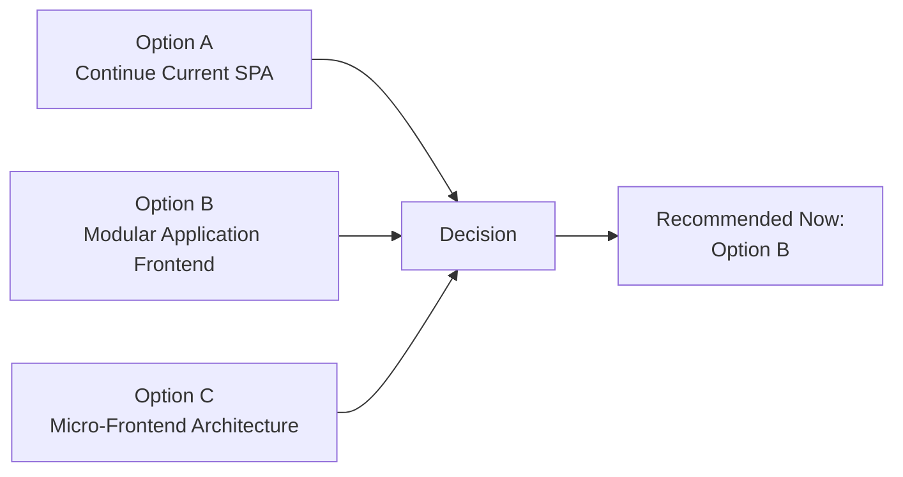
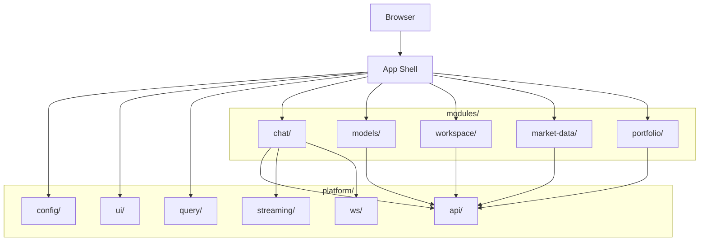
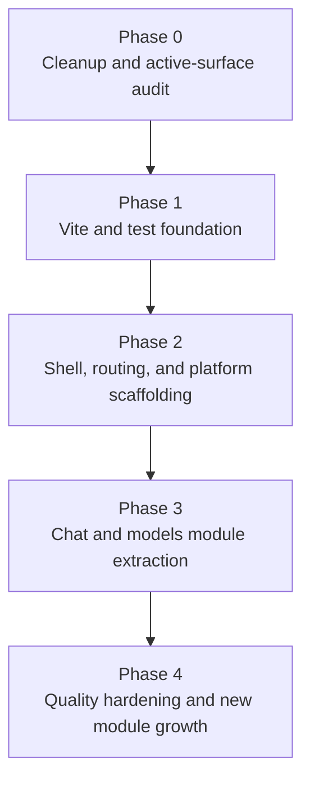

# Frontend Modernization and Modularization Strategy - Research Report

> **Document Purpose:** Evaluate applicable frontend modernization and modularization approaches for the DP Stock Investment Assistant, and define a decision-ready strategy that aligns with the modular application direction established in ADR-Frontend-001.
>
> **Date:** 2026-03-31  
> **Scope:** Frontend build tooling, application structure, routing, state management, server-state orchestration, TypeScript migration, styling foundation, testing strategy, and phased delivery approach.

## Document Control

| Field | Value |
|-------|-------|
| Project | DP Stock Investment Assistant |
| Domain | Frontend modernization, build tooling, state management, and modularization strategy |
| Focus | Pre-development technical analysis for evolving the current React SPA into a bounded-context modular application |
| Date | 2026-03-31 |
| Status | Research for architecture and implementation planning |
| Audience | Engineering, architecture, frontend maintainers |

---

## Table of Contents

1. [Executive Summary](#1-executive-summary)
2. [Problem Statement and Decision Context](#2-problem-statement-and-decision-context)
3. [Research Scope and Inputs](#3-research-scope-and-inputs)
4. [Evaluation Criteria](#4-evaluation-criteria)
5. [Current-State Assessment](#5-current-state-assessment)
6. [Strategic Architecture Options](#6-strategic-architecture-options)
7. [Modernization Approach Analysis by Dimension](#7-modernization-approach-analysis-by-dimension)
8. [Decision Matrix and Recommended Stack](#8-decision-matrix-and-recommended-stack)
9. [Recommended Target Architecture](#9-recommended-target-architecture)
10. [Delivery Strategy and Sequencing](#10-delivery-strategy-and-sequencing)
11. [Risks, Governance, and Quality Gates](#11-risks-governance-and-quality-gates)
12. [Conclusion](#12-conclusion)
13. [Related Documents](#13-related-documents)
14. [References](#14-references)

---

## 1. Executive Summary

This report evaluates how the current frontend should modernize and modularize without introducing premature micro-frontend complexity. The current frontend is still a comparatively small React 18 single-page application with a monolithic root component, mixed TypeScript and JavaScript usage, duplicated service responsibilities, no routing, and no frontend test coverage. At the same time, it already contains working streaming, model selection, and real-time integration patterns that should be preserved.

The research conclusion is consistent with [ADR-Frontend-001](./adr-frontend-001-modular-application.md): the correct near-term direction is **not** a micro-frontend architecture. The correct direction is a **modular application frontend** with one deployable shell, one React runtime, a controlled platform layer, and bounded internal feature modules.

### 1.1 Decision Summary

| Dimension | Recommendation | Why |
|-----------|----------------|-----|
| Strategic architecture | Modular application frontend | Best fit for current scale, UX consistency, and shared streaming/session behavior |
| Build tooling | Vite | CRA is deprecated; Vite provides the best modernization path with the lowest migration cost |
| Routing | React Router v7 | Route composition is the cleanest integration mechanism for bounded feature modules |
| Client state | React Context + `useReducer` | Aligns with React guidance and keeps state scoped to feature boundaries |
| Server state | TanStack Query | Separates remote-data orchestration from local UI state and reduces custom fetch boilerplate |
| API contracts | `openapi-typescript`-backed typed contracts | The repo already maintains an OpenAPI document and needs stronger frontend-backend contract discipline |
| Streaming and real-time | Custom hooks + typed platform clients | SSE and WebSocket flows are specialized and should remain explicit |
| Styling | CSS Modules + design tokens | Lean runtime, scoped styles, and a solid foundation for a finance-grade UI system |
| UI workflow | Storybook + MSW as supporting accelerators | Improves isolated module development, documentation, and reusable network mocking |
| Accessibility primitives | Radix UI (incremental) | Accessible unstyled primitives fit a controlled platform UI layer |
| Testing | Vitest + React Testing Library | Best fit if Vite is adopted; preserves familiar Jest-like testing ergonomics |
| Delivery model | Foundation-first phased migration | Minimizes architectural rework and reduces risk during extraction |

### 1.2 Executive Recommendation

The frontend should move to a **bounded-context modular SPA** with the following characteristics:

- One application shell in `app/`
- One controlled platform layer in `platform/`
- Bounded feature modules in `modules/`
- Route composition as the primary integration mechanism
- Shared platform services for configuration, API access, streaming contracts, and UI primitives
- Future extraction seams preserved, but no independent frontend deployment now

This approach captures most of the benefits sought by micro-frontend advocates, while avoiding the coordination, runtime, governance, and UX fragmentation costs of distributed frontend composition.

## 2. Problem Statement and Decision Context

The project needs a decision-ready frontend modernization strategy that solves current implementation problems without over-correcting into unnecessary architecture complexity.

The current frontend is functional, but it has several structural issues:

- Root-heavy application composition in `App.tsx`
- Mixed JavaScript and TypeScript implementation
- No route-based product-area decomposition
- Duplicated HTTP service patterns
- No formal design-token system
- No frontend test coverage
- Deprecated build tooling through Create React App

At the same time, the product domain has characteristics that increase the cost of poor architectural decisions:

- UX consistency matters for a finance-oriented assistant
- Streaming interaction is part of the primary user journey
- Session continuity and state clarity matter
- Feature areas are connected through shared workflows rather than isolated, independently operated verticals

The architectural question is therefore not whether the frontend should become "more modular" in the abstract. The real question is:

> Should the project modernize by strengthening internal modularity within one frontend application, or should it move now toward independently delivered micro-frontends?

Based on the current codebase, team topology, and product constraints, the evidence supports a modular application strategy first.

## 3. Research Scope and Inputs

### 3.1 Reviewed Architecture and Design Documents

- [ADR-Frontend-001: Adopt a Modular Application Frontend](./adr-frontend-001-modular-application.md)
- [ADR-Frontend-002: Modernize the Frontend Foundation with a Contract-First Modular Stack](./adr-frontend-002-modernize-frontend-foundation.md)
- [Frontend Architecture Evolution Report](./frontend-architecture-evolution-report.md)
- [Frontend ARCHITECTURE.md](../../frontend/ARCHITECTURE.md)
- [Architecture Review](../architecture-review.md)
- [Agentic Application With STM Integration Roadmap](../High-level%20Design/AGENTIC_APP_WITH_STM_INTEGRATION_ROADMAP.md)

### 3.2 Reviewed Frontend Source Artifacts

- `frontend/src/App.tsx` - active root application component and current state hub
- `frontend/src/config.ts` - API and UI configuration constants
- `frontend/src/components/models/ModelSelector.tsx` - active model selection component
- `frontend/src/components/MessageFormatter.js` - helper component, currently not referenced by `App.tsx`
- `frontend/src/components/OptimizedApp.js` - alternative app implementation, not referenced by the active entry point
- `frontend/src/components/PerformanceProfiler.js` - profiler helper, not referenced by the active entry point
- `frontend/src/components/WebSocketTest.tsx` - debug/testing component
- `frontend/src/services/restApiClient.js` - active REST client with SSE streaming support
- `frontend/src/services/apiService.ts` - overlapping TypeScript REST client, currently not referenced from the active app flow
- `frontend/src/services/modelsApi.ts` - active model management API client
- `frontend/src/services/webSocketService.ts` - Socket.IO wrapper with reconnection behavior
- `frontend/src/types/models.ts` - model-related TypeScript contracts
- `frontend/src/utils/uuid.ts` - UUID utility
- `frontend/src/utils/performance.js` - utility file, currently not referenced from the active app flow
- `frontend/package.json` - dependency and script configuration

### 3.3 Out of Scope

This report does not define:

- A detailed implementation task list
- Backend API redesign
- Full design-system visual language decisions
- Immediate micro-frontend extraction planning
- Authentication or authorization architecture

Those concerns may be addressed in subsequent implementation planning or dedicated design documents.

## 4. Evaluation Criteria

The approaches in this report are evaluated against the following criteria.

| Criterion | Why It Matters in This Project |
|-----------|--------------------------------|
| Architectural fit | The solution must align with the current product scale and frontend maturity |
| UX consistency | Trust, clarity, and predictable interaction matter in a finance-oriented assistant |
| Migration cost | The current frontend is small enough that low-friction migration should be preferred |
| Operational simplicity | One shell and one deployment unit are still an advantage at current scale |
| Streaming and real-time suitability | The chat workflow depends on SSE and WebSocket-style interaction |
| Boundary clarity | The chosen approach must make internal feature boundaries explicit and durable |
| Long-term optionality | The architecture should preserve future extraction capability without forcing it now |
| Tooling viability | Selected tools should be current, well-supported, and compatible with the repo's direction |
| Testability | The resulting structure should be easier to test at component, hook, and module boundaries |

These criteria reflect both the architectural reasoning in [ADR-Frontend-001](./adr-frontend-001-modular-application.md) and the product/domain analysis in the [Frontend Architecture Evolution Report](./frontend-architecture-evolution-report.md).

## 5. Current-State Assessment

### 5.1 Structural Snapshot

| Dimension | Current State | Assessment |
|-----------|--------------|------------|
| Build tooling | Create React App 5.0.1 | Deprecated and now a strategic modernization blocker |
| Root component | `App.tsx` holds most active UI and interaction state | Too centralized for growth |
| Routing | No router; one active view | Prevents route-based module composition |
| State model | Local `useState` concentrated in the root | Sufficient for MVP, insufficient for feature growth |
| Service layer | `restApiClient.js`, `modelsApi.ts`, `apiService.ts` overlap | Inconsistent API access pattern |
| Type safety | Mixed TS and JS files | Transitional and uneven |
| Styling | Inline styles plus global CSS | Weak foundation for scalable UI governance |
| Testing | No frontend tests | High delivery and regression risk |

### 5.2 Codebase Reality Check

The current frontend is small enough that a phased architectural shift is realistic without a rewrite. That is important. A large legacy frontend often needs a long-lived strangler strategy by necessity. This one does not. The project can modernize deliberately because the current surface area is still manageable.

At the same time, the application already contains a few patterns worth preserving:

- Working SSE streaming in `restApiClient.js`
- Working model-management APIs in `modelsApi.ts`
- Safe async update pattern in `ModelSelector.tsx` via `isMounted`
- Socket.IO reconnect logic in `webSocketService.ts`
- A small dependency footprint that should not be discarded casually

### 5.3 Key Gaps

The main architecture and modernization gaps are:

1. No bounded feature modules
2. No route-composed shell
3. No server-state orchestration layer
4. No unified typed API access layer
5. No contract-driven frontend-backend type synchronization
6. No design-token foundation
7. No frontend test pyramid
8. No explicit governance for future module boundaries

### 5.4 Why These Gaps Matter

These are not just code cleanliness concerns. They directly affect architectural outcomes:

- Without routing, feature ownership cannot move into route-level composition.
- Without a platform layer, shared concerns drift into random helpers or root components.
- Without typed contracts and server-state orchestration, modules will re-implement fetch logic inconsistently.
- Without tests, modernization work becomes riskier than it needs to be.

## 6. Strategic Architecture Options

This section addresses the top-level architectural choice before tool-by-tool decisions are made.



Caption: The strategic architecture decision should be made before selecting enabling tools. The current repository and ADR-Frontend-001 support Option B as the best-fit near-term direction.

### 6.1 Option A: Continue the Current SPA with Minimal Structural Change

This option keeps the application as a single SPA and applies only incremental code cleanup.

Advantages:

- Lowest immediate disruption
- No architectural migration cost

Disadvantages:

- Preserves root-heavy composition
- Preserves weak boundaries
- Defers the same structural problems to a later date
- Makes each future feature incrementally more expensive

Assessment: Not recommended.

### 6.2 Option B: Modular Application Frontend

This option keeps one deployable frontend shell and decomposes the application internally into bounded feature modules backed by a controlled platform layer.

Advantages:

- Best fit for current scale and team model
- Preserves UX and interaction consistency
- Supports shared session and streaming behavior cleanly
- Creates real extraction seams without distributed runtime overhead

Disadvantages:

- Requires discipline and governance to maintain boundaries
- Independent release cadence is still deferred

Assessment: Recommended.

### 6.3 Option C: Micro-Frontend Architecture

This option splits the frontend into independently delivered applications composed at runtime or build time.

Advantages:

- Strong team autonomy when boundaries and ownership are mature
- Independent release trains for genuinely decoupled domains

Disadvantages:

- Premature for current scale and topology
- Increased runtime and platform complexity
- Higher risk of UX inconsistency and duplicated concerns
- Harder debugging, observability, and integration testing

Assessment: Not recommended now. Preserve it as a future option only.

### 6.4 Option B Deep Dive: Technical Approaches and Supported Stack Shapes

Option B is the recommended strategy, but it is not a single implementation recipe. There are several ways to realize a modular application frontend while still keeping one deployable shell.

#### 6.4.1 Route-Composed Modular SPA

This is the most direct implementation of the recommended architecture:

- one browser application shell
- route-based feature composition
- shared root providers
- lazy-loaded feature modules
- centralized navigation, error boundaries, and app bootstrapping

Current official React Router guidance for declarative mode remains simple and compatible with a Vite-first React application: install the router, wrap the application in `BrowserRouter`, and build nested layout routes from there. This makes route-composed modularization a low-friction fit for the current project, which has no router today and needs one before real module extraction can happen.

Best use case:

- one deployable frontend
- a few high-value feature areas
- gradual route ownership over time

Fit to current project: **High**.

#### 6.4.2 Feature-Boundary Discipline Using FSD Principles

The project does not need to adopt full Feature-Sliced Design terminology to benefit from its strongest ideas. The official FSD guidance emphasizes three concepts that are directly useful here:

- **Public API**: each module exposes a top-level public surface
- **Isolation**: a module should not depend directly on peers in the same layer
- **Needs-driven structure**: organization follows business and user needs rather than only technical categories

For this repository, the best use of FSD is as a **governance model**, not as a mandatory top-level taxonomy. In practice, that means the project can keep the `app/`, `platform/`, and `modules/` structure from ADR-Frontend-001 while still adopting FSD-inspired rules for public APIs and isolation.

Best use case:

- teams that want strong boundary rules without changing the project into a full FSD vocabulary model

Fit to current project: **High as a rule set, medium as a full folder taxonomy**.

#### 6.4.3 Contract-First Modular SPA

This is the most important addition from the new research.

The repository already maintains an OpenAPI document, which means the modular frontend can use **contract-generated TypeScript types** instead of growing more handwritten request and response types over time. Current `openapi-typescript` guidance is especially relevant here:

- it supports OpenAPI 3.0 and 3.1
- it can generate runtime-free types from local YAML or JSON files
- it can generate types from local schemas in milliseconds
- it can feed typed fetch layers or React Query integrations

That matters because the current frontend already shows duplicated API access concerns between `restApiClient.js`, `apiService.ts`, and `modelsApi.ts`. A contract-first typed client strategy is one of the cleanest ways to stop that duplication from recurring in the modular architecture.

Best use case:

- backend APIs are already described in OpenAPI
- frontend types should evolve with backend contracts
- the team wants stronger correctness without adding runtime overhead

Fit to current project: **Very high**.

#### 6.4.4 Component-Driven Modular Workflow

A modular application frontend benefits from UI workflows that let teams build modules in isolation without depending on the full running application.

The official documentation supports a strong supporting-tool combination here:

- **Storybook** for isolated component and page development, documentation, interaction testing, accessibility testing, and visual review
- **MSW** for a standalone API mocking layer reused across development, tests, and Storybook
- **Radix UI** for accessible, unstyled, incrementally adoptable primitives that can sit below the project's own design tokens and shared UI components

This is not the runtime architecture itself, but it is an increasingly standard delivery workflow for modular frontends.

Best use case:

- module teams want isolated development and documentation
- component states and API scenarios need repeatable testing
- the application needs a shared accessibility baseline without adopting a full opinionated component framework

Fit to current project: **High as a phase-2 or phase-3 accelerator, not mandatory for phase 0**.

#### 6.4.5 Progressive Web Application Capability Within a SPA

Progressive Web Application support should be evaluated here because it is often confused with a separate frontend architecture choice. It is not. Current MDN and web.dev guidance frames a PWA as a web application enhanced with a **web app manifest** and a **service worker** so that the application can become installable, more resilient under intermittent connectivity, and better integrated with the operating system while still remaining a web app built from one codebase.

For this repository, that means PWA should be treated as a **capability layer on top of the chosen SPA architecture**, not as a replacement for the modular SPA decision and not as a competing alternative to Option B.

What PWA can add to a modular SPA in this project:

- installability for users who want the assistant to behave more like a desktop or mobile application
- resilient caching of static assets and the application shell
- controlled offline support for non-real-time surfaces
- future hooks for notifications, badges, and background-related capabilities if product needs justify them

What PWA does **not** solve in this project:

- it does not create module boundaries
- it does not replace route composition or platform-layer governance
- it does not eliminate the need for typed API contracts
- it does not make live SSE, WebSocket, or market-data workflows safely offline by default

This distinction matters because the product domain is finance-oriented and freshness-sensitive. A stock and investment assistant can benefit from installability and shell resilience, but it should not imply that live model responses, streaming chat, or market-sensitive data are safe to cache aggressively or present offline without explicit freshness controls.

Best use case:

- installable assistant experience
- cached app shell and static assets
- selected read-only reference views or recent non-critical data with explicit freshness labeling

Recommended guardrail:

- use network-first or freshness-aware strategies for live and market-sensitive data
- reserve offline-first behavior for shell assets, UI resources, and carefully selected low-risk content

Fit to current project: **Medium-high as a later-phase enhancement, low as a phase-0 driver**.

Recommended position:

PWA should be treated as an **optional enhancement to Option B** after the modular SPA foundation is stable. It becomes materially easier and safer once Vite, routing, platform APIs, and caching ownership are already established.

The current Vite ecosystem also makes this path practical. `vite-plugin-pwa` can add manifest generation, service-worker registration, and Workbox-backed service-worker strategies with relatively low setup cost once the app has already migrated to Vite.

#### 6.4.6 Supported Option B Stack Profiles

| Profile | Composition | Best When | Fit to Current Project |
|---------|-------------|-----------|------------------------|
| Lean modular SPA | Vite + React Router + Context/`useReducer` + TanStack Query + CSS Modules + Vitest | The main goal is a straightforward modernization with minimal platform overhead | Good |
| Contract-first modular SPA | Lean modular SPA + `openapi-typescript` + MSW + optional Storybook | The backend already has OpenAPI and the frontend needs safer API evolution | **Best fit** |
| Installable modular SPA | Contract-first modular SPA + manifest + service worker + optional `vite-plugin-pwa` | Installability, shell resilience, and selective offline support become product priorities | Conditional later-phase option |
| Type-safe routing workbench | Vite + TanStack Router + TanStack Query + `openapi-typescript` + Radix + Vitest | URL and search-param state become first-class product concerns | Future candidate |
| Platform-scale modular workspace | Vite or Rsbuild + monorepo tooling + Storybook + Query + stronger routing/type tooling | Multiple frontend teams or package boundaries emerge | Too early now |

Recommendation inside Option B:

The **contract-first modular SPA** profile is the best fit to the current project. It preserves the low-complexity benefits of the lean modular SPA while taking advantage of an existing asset the repo already has: the OpenAPI contract.

If later product requirements emphasize installability, resilient shell behavior, or controlled offline access to low-risk content, the project can evolve that recommended profile into an **installable modular SPA** without changing the core architecture decision.

## 7. Modernization Approach Analysis by Dimension

### 7.1 Build Tooling

#### Current Constraint

The frontend currently depends on Create React App. CRA is deprecated and the repository is still tied to `react-scripts` for start, build, and test behavior.

#### Options Considered

| Option | Assessment | Notes |
|--------|------------|-------|
| Vite | Recommended | Best current fit for a small-to-medium React SPA modernization |
| Next.js | Not recommended now | Adds SSR and framework weight without clear near-term benefit |
| Remix | Not recommended now | Less aligned with streaming-first interaction patterns |
| Ejected CRA | Rejected | Inherits maintenance cost with no strategic upside |

#### Recommendation

Adopt **Vite**.

Why:

- Lowest practical migration cost
- Best development experience
- Strong ecosystem and current community direction
- Natural pairing with Vitest
- Fits the modular SPA direction without imposing broader application conventions

### 7.2 Application Structure and Modularization

#### Options Considered

| Option | Assessment | Notes |
|--------|------------|-------|
| Feature-Sliced Design | Partial reference model | Strong ideas, but heavier terminology than needed |
| Domain Module Pattern | Recommended | Best match for the repo's ADR and current scale |
| Nx libraries | Premature | Too much tooling overhead for current size |
| Flat feature folders | Transitional only | Too weak for long-term governance |

#### Recommendation

Adopt the **Domain Module Pattern**:

- `app/` for shell, routes, and provider composition
- `platform/` for controlled shared services and UI primitives
- `modules/` for bounded business capabilities
- `legacy/` only as a temporary transition area if needed during migration

This is the most direct realization of [ADR-Frontend-001](./adr-frontend-001-modular-application.md).

The additional research suggests using FSD more as a **discipline source** than as a mandatory structure. The most valuable borrowed concepts are public module APIs, isolation rules, and needs-driven organization.

### 7.3 Routing and Navigation

#### Current Constraint

The current application has no router, which blocks route-driven composition and keeps all product growth inside a single root view.

#### Options Considered

| Option | Assessment | Notes |
|--------|------------|-------|
| React Router v7 | Recommended | Widest adoption, nested layouts, flexible route composition |
| TanStack Router | Strong alternative | Better type-safety, smaller ecosystem |
| Defer routing | Not recommended | Conflicts with the intended modular shell pattern |

#### Recommendation

Adopt **React Router v7** in declarative SPA mode with nested layouts and route-level lazy loading.

The deeper routing research also clarifies the main alternative. **TanStack Router** is a strong future candidate if route search parameters become a first-class state container for workspace, research, or portfolio views. Its type-safe navigation, search-param validation, and loader integration are compelling, but React Router remains the lower-friction fit for the current migration.

### 7.4 State Management

#### Client State Options Considered

| Option | Assessment | Notes |
|--------|------------|-------|
| Context + `useReducer` | Recommended | Aligns with React guidance and feature-scoped ownership |
| Zustand | Acceptable fallback | Useful if context boilerplate becomes excessive |
| Redux Toolkit | Not recommended now | Too heavy for the current feature surface |
| Jotai/Recoil | Viable but not preferred | Less aligned with the intended module boundary model |

#### Server-State Options Considered

| Option | Assessment | Notes |
|--------|------------|-------|
| TanStack Query | Recommended | Best overall fit for server-state orchestration |
| SWR | Viable but secondary | Simpler, but weaker mutation/invalidation model |
| Custom hooks only | Not recommended | Reinvents solved problems for REST data handling |

#### Recommendation

Use a dual model:

- **Context + `useReducer`** for module-local client state
- **TanStack Query** for REST-backed server state
- **Custom streaming hooks** for SSE and WebSocket interaction paths

This is the cleanest separation of concerns for the current and projected frontend behavior.

The official React guidance strengthens the client-state choice: React explicitly presents reducer-plus-context pairs, provider extraction, and custom hooks as a scaling path for complex screens. The official TanStack Query guidance strengthens the server-state choice: server state is distinct from client state and needs dedicated handling for caching, deduping, refetching, invalidation, and lifecycle concerns.

### 7.5 TypeScript Migration

#### Findings

The current draft overstated active use of some JavaScript files. Based on direct repo search:

- `restApiClient.js` is active and critical
- `MessageFormatter.js` is present but not referenced from the active app flow
- `apiService.ts` is present but not referenced from the active app flow
- `OptimizedApp.js` and `PerformanceProfiler.js` are present but not referenced from the active entry path
- `performance.js` is present but not referenced from the active app flow

#### Recommendation

Use a focused cleanup-and-convert strategy:

1. Verify unused files are safe to remove or archive
2. Remove or quarantine dead code first
3. Convert the active JavaScript surface to TypeScript
4. Do not carry inactive JS utilities into the modular architecture unchanged

The deeper research also points to a better long-term state than simple file conversion: use `openapi-typescript` to reduce handwritten API type duplication going forward.

### 7.6 Styling Foundation

#### Options Considered

| Option | Assessment | Notes |
|--------|------------|-------|
| CSS Modules + design tokens | Recommended | Leanest scalable foundation |
| Tailwind CSS | Viable alternative | Faster utility-based styling, but different authoring model |
| CSS-in-JS | Not recommended | Runtime overhead without a compelling project-specific benefit |
| Full component library | Conditional | Use selectively for primitives, not as a total design decision shortcut |

#### Recommendation

Adopt **CSS Modules + design tokens** as the baseline styling system, and use **Radix UI** selectively for accessible unstyled primitives when needed.

The Radix documentation strengthens this recommendation because the primitives are explicitly designed for accessibility, are unstyled by default, provide typed APIs, and support incremental adoption. That matches the project's desire for a controlled platform UI layer rather than a fully opinionated visual framework.

### 7.7 Testing Strategy

#### Current Constraint

The frontend has no test coverage today. That increases the risk of every modernization step.

#### Options Considered

| Option | Assessment | Notes |
|--------|------------|-------|
| Vitest + React Testing Library | Recommended if Vite is adopted | Strongest alignment with the proposed toolchain |
| Jest + React Testing Library | Acceptable secondary option | Familiar, but less aligned with Vite |

#### Recommendation

Adopt **Vitest + React Testing Library** alongside the Vite migration.

Testing priority should be:

1. Platform services and streaming utilities
2. Feature hooks
3. Feature components
4. Route and provider integration

This testing stack becomes stronger when paired with **MSW** for network mocking and **Storybook** for isolated UI states, interaction tests, and documentation. MSW's reusable request interception layer is especially valuable for a modular frontend because the same mocks can be reused across development, tests, and Storybook.

## 8. Decision Matrix and Recommended Stack

### 8.1 Decision Matrix Summary

The following summary reflects the evaluation criteria in Section 4.

| Area | Recommended Choice | Architectural Fit | Migration Cost | UX Consistency | Long-Term Optionality | Overall |
|------|--------------------|-------------------|----------------|----------------|-----------------------|---------|
| Strategic architecture | Modular application frontend | High | Medium | High | High | Best fit |
| Build tooling | Vite | High | Medium | Neutral | High | Best fit |
| Routing | React Router v7 | High | Low | High | High | Best fit |
| Client state | Context + `useReducer` | High | Low | High | High | Best fit |
| Server state | TanStack Query | High | Medium | High | High | Best fit |
| Styling | CSS Modules + tokens | High | Medium | High | High | Best fit |
| Testing | Vitest + RTL | High | Medium | Neutral | High | Best fit |

### 8.2 Recommended Modernization Stack

| Concern | Primary Recommendation | Supporting Alternatives or Extensions | Why It Fits This Project | Adoption Guidance |
|---------|------------------------|---------------------------------------|--------------------------|-------------------|
| Build | Vite | Rsbuild or framework-based solutions only if constraints change materially | Current official Vite guidance strongly favors fast ESM development, optimized builds, and plugin flexibility; CRA is deprecated | Phase 1 |
| Routing | React Router v7 | TanStack Router for future URL-heavy workbench-style flows | React Router is the lowest-friction route-composition solution for the current migration | Phase 2 |
| Client state | Context + `useReducer` | Zustand as a fallback for specific modules | Official React guidance explicitly supports many reducer-context pairs and provider extraction for scaling complex screens | Phase 2-3 |
| Server state | TanStack Query | SWR or router loaders only for smaller use cases | Official TanStack Query guidance directly addresses caching, deduping, invalidation, background refetching, and async lifecycle management | Phase 2-3 |
| API contracts | `openapi-typescript` | `openapi-fetch` or `openapi-react-query` as optional ecosystem integrations | The repo already has an OpenAPI document, so contract-generated types are a practical accuracy and maintenance win | Phase 1-2 |
| Streaming | Typed fetch/SSE and WebSocket clients | Keep specialized hooks explicit rather than hiding them behind generic data libraries | Chat streaming is a specialized interaction path and should remain explicit and testable | Phase 2-3 |
| Styling | CSS Modules + token layer | Tailwind only if the team prefers utility-first authoring | Best balance of scalability, low runtime cost, and visual governance | Phase 2 |
| PWA capability | Optional manifest + service worker, likely via `vite-plugin-pwa` | Custom Workbox setup if the cache model becomes more specialized | Installability and resilient shell behavior are useful, but PWA should remain a later-phase capability layered on top of the modular SPA | Phase 4+ |
| UI primitives | Radix UI | Other headless primitives if future needs differ | Accessible, unstyled, typed, and incrementally adoptable primitives suit a controlled platform UI layer | Phase 3+ |
| Component workshop | Storybook | Optional until module extraction starts | Supports component/page development in isolation, docs, interaction tests, and accessibility testing, with React + Vite support | Phase 3+ |
| Network mocking | MSW | Ad hoc mocks only for very limited scope | Reusable mocking across development, tests, and Storybook is particularly valuable in a modular frontend | Phase 2-3 |
| Testing | Vitest + React Testing Library | Jest only if Vite is not adopted | Shares Vite config, supports projects, and keeps the toolchain cohesive | Phase 1 |

Current official tooling notes that matter for this recommendation:

- Vite current docs require modern Node versions and move env access to `import.meta.env`
- Vitest current docs recommend using the same Vite config file and require Vite 6+ with Node 20+
- Vite client env exposure only includes variables prefixed for client use; secrets must not be moved into client-exposed env vars
- PWA enablement in a Vite SPA is straightforward once the app is on Vite because the plugin ecosystem can generate the manifest, service worker, and registration code with low ceremony

### 8.3 Deep Stack Notes and Technical Fit

#### 8.3.1 Vite and Vitest as the Build-Test Foundation

The official Vite documentation reinforces three points that matter directly in this repo:

- Vite treats `index.html` as part of the source graph, which affects how the CRA migration should be planned
- env access moves from `process.env.REACT_APP_*` to `import.meta.env.VITE_*`
- Vite's plugin model and current build pipeline make it a better long-term fit than maintaining CRA-era conventions

Vitest complements that well because it reads Vite configuration directly, supports project-based test separation, and now provides browser-focused testing and visual-regression-related capabilities that can grow with the frontend.

Why this matters here:

- the repo already needs a build-tool migration
- the frontend currently lacks tests
- one unified build/test foundation reduces migration complexity

#### 8.3.2 React Router v7 vs TanStack Router

The research shows a clear current-vs-future distinction.

React Router v7 is the better **current** fit because:

- the installation and BrowserRouter bootstrap are straightforward
- it supports nested route composition well
- it keeps the migration path from the existing SPA simpler

TanStack Router is the stronger **future** candidate if the frontend evolves into a workbench-style product where URL and search parameters become first-class shared state. Its official docs emphasize:

- fully inferred TypeScript support
- typesafe navigation
- first-class search-parameter state management
- route context and cache-friendly data loading

That is powerful, but it is not yet required to modernize the current chat-centered SPA.

#### 8.3.3 React Context plus `useReducer`

The current React guidance is still directly relevant to a modular SPA. React's official scaling example emphasizes:

- separate contexts for state and dispatch when helpful
- provider extraction to keep root components cleaner
- custom hooks for reading and updating feature state
- the ability to have many reducer-context pairs across the application as it grows

This is a good match for the project because it encourages feature-scoped providers rather than one global all-knowing store.

#### 8.3.4 TanStack Query and Contract-Generated Types

TanStack Query's official guidance is explicit that server state is different from client state. The relevant benefits for this repo are:

- request deduplication
- background refetching
- invalidation after mutations
- pagination and lazy loading support
- better maintenance of async data lifecycles

The deeper research suggests pairing this with **contract-generated types** from `openapi-typescript`. That pairing is especially strong here because the repo already carries `docs/openapi.yaml`. In practical terms, this means the frontend can:

- generate `paths` and `components` types from the OpenAPI contract
- use those generated types in platform clients and module services
- reduce duplication between handwritten frontend types and backend response shapes
- optionally adopt `openapi-fetch` or `openapi-react-query` later if the team wants tighter contract-based wrappers

#### 8.3.5 UI System, Isolation, and Mocking Workflow

The supporting stack around the modular application matters almost as much as the runtime stack.

- **Radix UI** provides accessible, unstyled, typed primitives with incremental adoption. That is ideal when the project wants its own token-driven visual language.
- **Storybook** provides a component and page workshop that supports stories, documentation, interaction tests, accessibility tests, and visual review. It also supports React with Vite directly.
- **MSW** provides a reusable API mocking layer that works across development, test runs, and Storybook without patching application code.

Taken together, these tools enable a strong module-development workflow without forcing a runtime architecture change.

#### 8.3.6 PWA Fit, Benefits, and Constraints

The PWA research adds one more important conclusion: PWA should be evaluated as a product capability, not as the primary architectural driver.

The strongest fit in this repository is:

- installable app-shell behavior for repeat users
- better resilience for static assets and shell navigation
- optional future notifications or badge-style operating-system integration

The main constraints are equally important:

- live SSE and WebSocket interactions are not automatically good offline candidates
- market-sensitive or time-sensitive data should not be cached in ways that obscure freshness
- the product needs explicit cache ownership and freshness rules before enabling aggressive offline behavior

For those reasons, PWA is best introduced only after the modular SPA foundation, typed platform APIs, and route structure are already stable.

### 8.4 Supported Option B Stack Profiles

| Profile | Primary Composition | When to Prefer It | Recommendation Status |
|---------|---------------------|-------------------|-----------------------|
| Lean modular SPA | Vite + React Router + Context/`useReducer` + TanStack Query + CSS Modules + Vitest | The main priority is pragmatic modernization with minimal tool overhead | Valid |
| Contract-first modular SPA | Lean stack + `openapi-typescript` + MSW + optional Storybook + Radix | Backend contract already exists and the frontend needs stronger correctness and maintainability | **Recommended** |
| Installable modular SPA | Contract-first stack + manifest + service worker + optional `vite-plugin-pwa` | Installability and selective offline shell support become real product requirements | Later-phase option |
| Type-safe routing workbench | Vite + TanStack Router + TanStack Query + contract-generated types + Radix + Vitest | Search params, URL state, and workbench navigation become product-critical | Future option |
| Platform-scale modular workspace | Vite or alternative bundler + monorepo tooling + Storybook + stricter platform governance | Multiple teams or package boundaries emerge and the frontend becomes substantially larger | Too early now |

## 9. Recommended Target Architecture



Caption: Recommended target-state architecture for the frontend. The shell owns bootstrapping and route composition; the platform layer owns shared technical services; business capabilities live in bounded modules.

### 9.1 Target Structure

```
frontend/src/
  app/
    App.tsx
    routes.tsx
    providers.tsx
  platform/
    api/
    config/
    query/
    streaming/
    ui/
    ws/
  modules/
    chat/
    models/
    workspace/
    market-data/
    portfolio/
```

### 9.2 Structural Rules

- Modules export through public entry points only
- Modules do not import sibling internals
- `platform/` is controlled and deliberately small
- Cross-cutting concerns belong in the shell or platform layer, not in business modules
- Streaming contracts are centralized rather than re-implemented per feature

## 10. Delivery Strategy and Sequencing

### 10.1 Recommended Migration Strategy

Adopt a **foundation-first phased migration**.



Caption: The recommended sequence prioritizes stable foundations before feature-module extraction. This reduces rework and makes the migration measurable.

### 10.2 Recommended Phases

| Phase | Objective | Key Outputs |
|-------|-----------|-------------|
| Phase 0 | Clean current active surface | Usage audit, dead-code confirmation, service overlap assessment |
| Phase 1 | Modernize build and test foundation | Vite, Vitest, updated env handling, Node baseline check, OpenAPI type-generation spike, updated Docker build |
| Phase 2 | Introduce shell and platform layer | Router, providers, path aliases, platform clients, token foundation, initial MSW setup |
| Phase 3 | Extract first bounded modules | Chat and models moved behind module APIs, typed API contracts wired into platform services |
| Phase 4 | Harden quality and expand | Tests, boundary rules, Storybook, additional modules, accessibility improvements |

### 10.3 Why This Sequence Is Preferred

This sequence is better than a feature-first or mixed migration because:

- The codebase is still small enough that infrastructure-first work is feasible
- Vite and routing should be stable before modules are extracted into the new shape
- Shared platform concerns should be designed before multiple modules depend on them
- Early testing support reduces regression risk during structural refactoring

## 11. Risks, Governance, and Quality Gates

### 11.1 Technical Risks

| Risk | Likelihood | Impact | Mitigation |
|------|-----------|--------|------------|
| Vite migration breaks container build | Medium | Medium | Update Docker and Nginx paths early and verify `dist/` serving |
| Local Node version is below current Vite/Vitest minimums | Medium | Medium | Confirm Node baseline before migration and document it explicitly |
| Env migration from `REACT_APP_*` to `VITE_*` breaks deployment | Medium | High | Audit all current env usage and update it atomically |
| Sensitive configuration is accidentally exposed via `VITE_*` env vars | Medium | High | Keep secrets on the backend and expose only client-safe config |
| Streaming behavior regresses during client refactor | Low | High | Preserve SSE logic behind typed platform wrappers and test before extraction |
| Platform layer becomes a dumping ground | Medium | Medium | Define ownership and review rules early |
| Module boundaries degrade over time | Medium | Medium | Enforce import rules and public API usage |

### 11.2 Governance Rules

To keep the modular application healthy:

1. Enforce public module entry points
2. Add ESLint restrictions for cross-module imports
3. Introduce TypeScript path aliases that reflect the intended architecture
4. Keep shared UI primitives generic and keep domain logic inside modules
5. Require module-boundary review for each significant new feature

### 11.3 Quality Gates for the Modernization Program

The modernization effort should be considered healthy only if the following become true:

- CRA is fully removed
- The app boots through a shell and router rather than a root-only screen
- Chat and models are extracted behind explicit module APIs
- The active app surface is fully TypeScript
- The frontend has executable tests for services, hooks, and key components
- Module-boundary rules exist and are enforced

## 12. Conclusion

The refined research conclusion is clear:

- The project should **not** move to micro-frontends now
- The project **should** modernize into a modular application frontend
- The best-fit Option B profile is a **contract-first modular SPA**
- The correct enabling stack is Vite, React Router v7, Context plus `useReducer`, TanStack Query, `openapi-typescript`, CSS Modules plus tokens, selective Radix UI adoption, and Vitest plus React Testing Library
- PWA should be treated as an optional later-phase capability layered on the modular SPA, not as a competing architecture choice
- The best supporting accelerators are MSW for reusable API mocking and Storybook for isolated UI development and documentation
- The correct delivery strategy is a foundation-first phased migration

This recommendation is both technically conservative and strategically strong. It addresses the real weaknesses of the current frontend without importing architecture complexity that the product and team do not yet need.

Most importantly, it follows the project's own architectural direction rather than competing with it. The result is a clearer, more governable path from the current SPA to a bounded-context frontend architecture that can scale with the product.

## 13. Related Documents

- [ADR-Frontend-001: Adopt a Modular Application Frontend](./adr-frontend-001-modular-application.md)
- [ADR-Frontend-002: Modernize the Frontend Foundation with a Contract-First Modular Stack](./adr-frontend-002-modernize-frontend-foundation.md)
- [Frontend Architecture Evolution Report](./frontend-architecture-evolution-report.md)
- [Frontend ARCHITECTURE.md](../../frontend/ARCHITECTURE.md)
- [Architecture Review](../architecture-review.md)
- [Agentic Application With STM Integration Roadmap](../High-level%20Design/AGENTIC_APP_WITH_STM_INTEGRATION_ROADMAP.md)

## 14. References

- [Vite Guide](https://vite.dev/guide/)
- [React Router v7](https://reactrouter.com/start/declarative/installation)
- [TanStack Query](https://tanstack.com/query/latest/docs/framework/react/overview)
- [React: Scaling Up with Reducer and Context](https://react.dev/learn/scaling-up-with-reducer-and-context)
- [Feature-Sliced Design](https://feature-sliced.design/)
- [Zustand](https://github.com/pmndrs/zustand)
- [Radix UI](https://www.radix-ui.com/)
- [TanStack Router Overview](https://tanstack.com/router/latest/docs/framework/react/overview)
- [Vitest](https://vitest.dev/)
- [Storybook Documentation](https://storybook.js.org/docs)
- [MSW Documentation](https://mswjs.io/docs/)
- [openapi-typescript Introduction](https://openapi-ts.dev/introduction)
- [MDN: Progressive web apps](https://developer.mozilla.org/en-US/docs/Web/Progressive_web_apps)
- [Learn PWA](https://web.dev/learn/pwa/)
- [Vite PWA Guide](https://vite-pwa-org.netlify.app/guide/)
- [Martin Fowler: Monolith First](https://martinfowler.com/bliki/MonolithFirst.html)
- [Martin Fowler: Micro Frontends](https://martinfowler.com/articles/micro-frontends.html)
- [Create React App](https://create-react-app.dev/)
