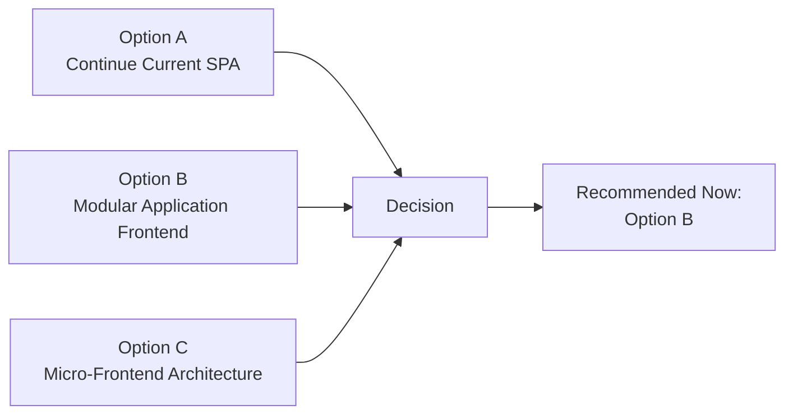

# Frontend Modernization and Modularization Strategy - Research Report

> **Document Purpose:** Evaluate applicable frontend modernization and modularization approaches for the DP Stock Investment Assistant, and define a decision-ready strategy that aligns with the modular application direction established in ADR-Frontend-001.
>
> **Date:** 2026-03-31  
> **Scope:** Frontend build tooling, application structure, routing, state management, server-state orchestration, TypeScript migration, styling foundation, testing strategy, and phased delivery approach.

## Document Control

| Field | Value |
|-------|-------|
| Project | DP Stock Investment Assistant |
| Domain | Frontend modernization, build tooling, state management, and modularization strategy |
| Focus | Pre-development technical analysis for evolving the current React SPA into a bounded-context modular application |
| Date | 2026-09-03 |
| Status | Research for architecture and implementation planning |
| Audience | Engineering, architecture, frontend maintainers |

---

## Table of Contents

1. [Executive Summary](#1-executive-summary)
2. [Problem Statement and Decision Context](#2-problem-statement-and-decision-context)
3. [Research Scope and Inputs](#3-research-scope-and-inputs)
4. [Evaluation Criteria](#4-evaluation-criteria)
5. [Current-State Assessment](#5-current-state-assessment)
6. [Strategic Architecture Options](#6-strategic-architecture-options)
7. [Modernization Approach Analysis by Dimension](#7-modernization-approach-analysis-by-dimension)
8. [Decision Matrix and Recommended Stack](#8-decision-matrix-and-recommended-stack)
9. [Recommended Target Architecture](#9-recommended-target-architecture)
10. [Delivery Strategy and Sequencing](#10-delivery-strategy-and-sequencing)
11. [Risks, Governance, and Quality Gates](#11-risks-governance-and-quality-gates)
12. [Conclusion](#12-conclusion)
13. [Related Documents](#13-related-documents)
14. [References](#14-references)

---

## 1. Executive Summary

This report evaluates how the current frontend should modernize and modularize without introducing premature micro-frontend complexity. The current frontend is still a comparatively small React 18 single-page application with a monolithic root component, mixed TypeScript and JavaScript usage, duplicated service responsibilities, no routing, and no frontend test coverage. At the same time, it already contains working streaming, model selection, and real-time integration patterns that should be preserved.

The research conclusion is consistent with [ADR-Frontend-001](../domains/frontend/DECISIONS/ADR-FRONTEND-001-MODULAR-APPLICATION.md) and [ADR-Frontend-002](../domains/frontend/DECISIONS/ADR-FRONTEND-002-MODERNIZE-FRONTEND-FOUNDATION.md): the correct near-term direction is **not** a micro-frontend architecture. The correct direction is a **modular application frontend** hosting an **adaptive, resizable multi-pane financial workspace** with one deployable shell, one React runtime, a dual-speed state architecture, a controlled platform layer, and bounded internal feature modules.

### 1.1 Decision Summary

| Dimension | Recommendation | Why |
|-----------|----------------|-----|
| Strategic architecture | Modular application frontend | Best fit for current scale, UX consistency, and shared streaming/session behavior |
| Layout & workspace | Resizable multi-pane canvas (`react-resizable-panels`) | 65% charting canvas + 35% AI copilot drawer + collapsible analytical dock; persistent layout in localStorage |
| Build tooling | Vite | CRA is deprecated; Vite provides the best modernization path with the lowest migration cost |
| Routing | React Router v7 | Route composition is the cleanest integration mechanism for bounded feature modules |
| State architecture | Dual-speed state model (Zustand + TanStack Query) | Zustand handles high-frequency market ticks and symbol sync without React tree re-renders; TanStack Query handles server cache |
| Financial charting | TradingView Lightweight Charts (`lightweight-charts`) + Chart.js | 60 FPS canvas candlesticks, volume, and indicators (RSI/MACD); Chart.js for macro distributions and solvency bars |
| API contracts | `openapi-typescript`-backed typed contracts | The repo already maintains an OpenAPI document and needs stronger frontend-backend contract discipline |
| Streaming & GenUI | Structured SSE Artifact Protocol + Dynamic Dispatcher | Emits typed events (`event: artifact_payload`) that mount interactive financial cards directly in the copilot stream |
| Styling foundation | Tailwind CSS + Radix UI primitives | Fast component velocity, pre-built accessible primitives, zero runtime CSS overhead, financial dark-mode tokens |
| UI workflow | Storybook + MSW as supporting accelerators | Improves isolated module development, documentation, and reusable network mocking |
| Testing | Vitest + React Testing Library | Best fit if Vite is adopted; preserves familiar Jest-like testing ergonomics |
| Delivery model | Value-Driven Vertical-Slice migration | Delivers the multi-pane canvas and TradingView chart early in Phase 2 alongside foundation upgrades |

### 1.2 Executive Recommendation

The frontend should move to a **bounded-context modular SPA hosting a resizable financial canvas** with the following characteristics:

- One application shell in `app/` orchestrating multi-pane layout state and global navigation
- One controlled platform layer in `platform/` housing API contracts, dual-speed state stores, and streaming adapters
- Bounded feature modules in `modules/` (`market-data` for visual charting, `chat` for copilot dialog and generative UI)
- Route composition and workspace state as the primary integration mechanisms
- Shared platform services for configuration, API access, streaming contracts, and UI primitives
- Future extraction seams preserved, but no independent frontend deployment now

This approach captures most of the benefits sought by micro-frontend advocates, while avoiding the coordination, runtime, governance, and UX fragmentation costs of distributed frontend composition.

## 2. Problem Statement and Decision Context

The project needs a decision-ready frontend modernization strategy that solves current implementation problems without over-correcting into unnecessary architecture complexity.

The current frontend is functional, but it has several structural issues:

- Root-heavy application composition in `App.tsx`
- Mixed JavaScript and TypeScript implementation
- No route-based product-area decomposition
- Duplicated HTTP service patterns
- No formal design-token system
- No frontend test coverage
- Deprecated build tooling through Create React App

At the same time, the product domain has characteristics that increase the cost of poor architectural decisions:

- UX consistency matters for a finance-oriented assistant
- Streaming interaction is part of the primary user journey
- Session continuity and state clarity matter
- Feature areas are connected through shared workflows rather than isolated, independently operated verticals

The architectural question is therefore not whether the frontend should become "more modular" in the abstract. The real question is:

> Should the project modernize by strengthening internal modularity within one frontend application, or should it move now toward independently delivered micro-frontends?

Based on the current codebase, team topology, and product constraints, the evidence supports a modular application strategy first.

## 3. Research Scope and Inputs

### 3.1 Reviewed Architecture and Design Documents

- [ADR-Frontend-001: Adopt a Modular Application Frontend](./adr-frontend-001-modular-application.md)
- [ADR-Frontend-002: Modernize the Frontend Foundation with a Contract-First Modular Stack](./adr-frontend-002-modernize-frontend-foundation.md)
- [Frontend Architecture Evolution Report](./frontend-architecture-evolution-report.md)
- [Frontend ARCHITECTURE.md](../domains/frontend/ARCHITECTURE.md)
- [Architecture Review](../architecture-review.md)
- [Agentic Application With STM Integration Roadmap](../High-level%20Design/AGENTIC_APP_WITH_STM_INTEGRATION_ROADMAP.md)

### 3.2 Reviewed Frontend Source Artifacts

- `frontend/src/App.tsx` - active root application component and current state hub
- `frontend/src/config.ts` - API and UI configuration constants
- `frontend/src/components/models/ModelSelector.tsx` - active model selection component
- `frontend/src/components/MessageFormatter.js` - helper component, currently not referenced by `App.tsx`
- `frontend/src/components/OptimizedApp.js` - alternative app implementation, not referenced by the active entry point
- `frontend/src/components/PerformanceProfiler.js` - profiler helper, not referenced by the active entry point
- `frontend/src/components/WebSocketTest.tsx` - debug/testing component
- `frontend/src/services/restApiClient.js` - active REST client with SSE streaming support
- `frontend/src/services/apiService.ts` - overlapping TypeScript REST client, currently not referenced from the active app flow
- `frontend/src/services/modelsApi.ts` - active model management API client
- `frontend/src/services/webSocketService.ts` - Socket.IO wrapper with reconnection behavior
- `frontend/src/types/models.ts` - model-related TypeScript contracts
- `frontend/src/utils/uuid.ts` - UUID utility
- `frontend/src/utils/performance.js` - utility file, currently not referenced from the active app flow
- `frontend/package.json` - dependency and script configuration

### 3.3 Out of Scope

This report does not define:

- A detailed implementation task list
- Backend API redesign
- Full design-system visual language decisions
- Immediate micro-frontend extraction planning
- Authentication or authorization architecture

Those concerns may be addressed in subsequent implementation planning or dedicated design documents.

## 4. Evaluation Criteria

The approaches in this report are evaluated against the following criteria.

| Criterion | Why It Matters in This Project |
|-----------|--------------------------------|
| Architectural fit | The solution must align with the current product scale and frontend maturity |
| UX consistency | Trust, clarity, and predictable interaction matter in a finance-oriented assistant |
| Migration cost | The current frontend is small enough that low-friction migration should be preferred |
| Operational simplicity | One shell and one deployment unit are still an advantage at current scale |
| Streaming and real-time suitability | The chat workflow depends on SSE and WebSocket-style interaction |
| Boundary clarity | The chosen approach must make internal feature boundaries explicit and durable |
| Long-term optionality | The architecture should preserve future extraction capability without forcing it now |
| Tooling viability | Selected tools should be current, well-supported, and compatible with the repo's direction |
| Testability | The resulting structure should be easier to test at component, hook, and module boundaries |

These criteria reflect both the architectural reasoning in [ADR-Frontend-001](./adr-frontend-001-modular-application.md) and the product/domain analysis in the [Frontend Architecture Evolution Report](./frontend-architecture-evolution-report.md).

## 5. Current-State Assessment

### 5.1 Structural Snapshot

| Dimension | Current State | Assessment |
|-----------|--------------|------------|
| Build tooling | Create React App 5.0.1 | Deprecated and now a strategic modernization blocker |
| Root component | `App.tsx` holds most active UI and interaction state | Too centralized for growth |
| Routing | No router; one active view | Prevents route-based module composition |
| State model | Local `useState` concentrated in the root | Sufficient for MVP, insufficient for feature growth |
| Service layer | `restApiClient.js`, `modelsApi.ts`, `apiService.ts` overlap | Inconsistent API access pattern |
| Type safety | Mixed TS and JS files | Transitional and uneven |
| Styling | Inline styles plus global CSS | Weak foundation for scalable UI governance |
| Testing | No frontend tests | High delivery and regression risk |

### 5.2 Codebase Reality Check

The current frontend is small enough that a phased architectural shift is realistic without a rewrite. That is important. A large legacy frontend often needs a long-lived strangler strategy by necessity. This one does not. The project can modernize deliberately because the current surface area is still manageable.

At the same time, the application already contains a few patterns worth preserving:

- Working SSE streaming in `restApiClient.js`
- Working model-management APIs in `modelsApi.ts`
- Safe async update pattern in `ModelSelector.tsx` via `isMounted`
- Socket.IO reconnect logic in `webSocketService.ts`
- A small dependency footprint that should not be discarded casually

### 5.3 Key Gaps

The main architecture and modernization gaps are:

1. No bounded feature modules
2. No route-composed shell
3. No server-state orchestration layer
4. No unified typed API access layer
5. No contract-driven frontend-backend type synchronization
6. No design-token foundation
7. No frontend test pyramid
8. No explicit governance for future module boundaries

### 5.4 Why These Gaps Matter

These are not just code cleanliness concerns. They directly affect architectural outcomes:

- Without routing, feature ownership cannot move into route-level composition.
- Without a platform layer, shared concerns drift into random helpers or root components.
- Without typed contracts and server-state orchestration, modules will re-implement fetch logic inconsistently.
- Without tests, modernization work becomes riskier than it needs to be.

## 6. Strategic Architecture Options

This section addresses the top-level architectural choice before tool-by-tool decisions are made.


```mermaid
flowchart LR
  A["Option A\nContinue Current SPA"] --> D["Decision"]
  B["Option B\nModular Application Frontend"] --> D
  C["Option C\nMicro-Frontend Architecture"] --> D
  D --> E["Recommended Now:\nOption B"]
```

Caption: The strategic architecture decision should be made before selecting enabling tools. The current repository and ADR-Frontend-001 support Option B as the best-fit near-term direction.

### 6.1 Option A: Continue the Current SPA with Minimal Structural Change

This option keeps the application as a single SPA and applies only incremental code cleanup.

Advantages:

- Lowest immediate disruption
- No architectural migration cost

Disadvantages:

- Preserves root-heavy composition
- Preserves weak boundaries
- Defers the same structural problems to a later date
- Makes each future feature incrementally more expensive

Assessment: Not recommended.

### 6.2 Option B: Modular Application Frontend

This option keeps one deployable frontend shell and decomposes the application internally into bounded feature modules backed by a controlled platform layer.

Advantages:

- Best fit for current scale and team model
- Preserves UX and interaction consistency
- Supports shared session and streaming behavior cleanly
- Creates real extraction seams without distributed runtime overhead

Disadvantages:

- Requires discipline and governance to maintain boundaries
- Independent release cadence is still deferred

Assessment: Recommended.

### 6.3 Option C: Micro-Frontend Architecture

This option splits the frontend into independently delivered applications composed at runtime or build time.

Advantages:

- Strong team autonomy when boundaries and ownership are mature
- Independent release trains for genuinely decoupled domains

Disadvantages:

- Premature for current scale and topology
- Increased runtime and platform complexity
- Higher risk of UX inconsistency and duplicated concerns
- Harder debugging, observability, and integration testing

Assessment: Not recommended now. Preserve it as a future option only.

### 6.4 Option B Deep Dive: Technical Approaches and Supported Stack Shapes

Option B is the recommended strategy, but it is not a single implementation recipe. There are several ways to realize a modular application frontend while still keeping one deployable shell.

#### 6.4.1 Route-Composed Modular SPA

This is the most direct implementation of the recommended architecture:

- one browser application shell
- route-based feature composition
- shared root providers
- lazy-loaded feature modules
- centralized navigation, error boundaries, and app bootstrapping

Current official React Router guidance for declarative mode remains simple and compatible with a Vite-first React application: install the router, wrap the application in `BrowserRouter`, and build nested layout routes from there. This makes route-composed modularization a low-friction fit for the current project, which has no router today and needs one before real module extraction can happen.

Best use case:

- one deployable frontend
- a few high-value feature areas
- gradual route ownership over time

Fit to current project: **High**.

#### 6.4.2 Feature-Boundary Discipline Using FSD Principles

The project does not need to adopt full Feature-Sliced Design terminology to benefit from its strongest ideas. The official FSD guidance emphasizes three concepts that are directly useful here:

- **Public API**: each module exposes a top-level public surface
- **Isolation**: a module should not depend directly on peers in the same layer
- **Needs-driven structure**: organization follows business and user needs rather than only technical categories

For this repository, the best use of FSD is as a **governance model**, not as a mandatory top-level taxonomy. In practice, that means the project can keep the `app/`, `platform/`, and `modules/` structure from ADR-Frontend-001 while still adopting FSD-inspired rules for public APIs and isolation.

Best use case:

- teams that want strong boundary rules without changing the project into a full FSD vocabulary model

Fit to current project: **High as a rule set, medium as a full folder taxonomy**.

#### 6.4.3 Contract-First Modular SPA

This is the most important addition from the new research.

The repository already maintains an OpenAPI document, which means the modular frontend can use **contract-generated TypeScript types** instead of growing more handwritten request and response types over time. Current `openapi-typescript` guidance is especially relevant here:

- it supports OpenAPI 3.0 and 3.1
- it can generate runtime-free types from local YAML or JSON files
- it can generate types from local schemas in milliseconds
- it can feed typed fetch layers or React Query integrations

That matters because the current frontend already shows duplicated API access concerns between `restApiClient.js`, `apiService.ts`, and `modelsApi.ts`. A contract-first typed client strategy is one of the cleanest ways to stop that duplication from recurring in the modular architecture.

Best use case:

- backend APIs are already described in OpenAPI
- frontend types should evolve with backend contracts
- the team wants stronger correctness without adding runtime overhead

Fit to current project: **Very high**.

#### 6.4.4 Component-Driven Modular Workflow

A modular application frontend benefits from UI workflows that let teams build modules in isolation without depending on the full running application.

The official documentation supports a strong supporting-tool combination here:

- **Storybook** for isolated component and page development, documentation, interaction testing, accessibility testing, and visual review
- **MSW** for a standalone API mocking layer reused across development, tests, and Storybook
- **Radix UI** for accessible, unstyled, incrementally adoptable primitives that can sit below the project's own design tokens and shared UI components

This is not the runtime architecture itself, but it is an increasingly standard delivery workflow for modular frontends.

Best use case:

- module teams want isolated development and documentation
- component states and API scenarios need repeatable testing
- the application needs a shared accessibility baseline without adopting a full opinionated component framework

Fit to current project: **High as a phase-2 or phase-3 accelerator, not mandatory for phase 0**.

#### 6.4.5 Progressive Web Application Capability Within a SPA

Progressive Web Application support should be evaluated here because it is often confused with a separate frontend architecture choice. It is not. Current MDN and web.dev guidance frames a PWA as a web application enhanced with a **web app manifest** and a **service worker** so that the application can become installable, more resilient under intermittent connectivity, and better integrated with the operating system while still remaining a web app built from one codebase.

For this repository, that means PWA should be treated as a **capability layer on top of the chosen SPA architecture**, not as a replacement for the modular SPA decision and not as a competing alternative to Option B.

What PWA can add to a modular SPA in this project:

- installability for users who want the assistant to behave more like a desktop or mobile application
- resilient caching of static assets and the application shell
- controlled offline support for non-real-time surfaces
- future hooks for notifications, badges, and background-related capabilities if product needs justify them

What PWA does **not** solve in this project:

- it does not create module boundaries
- it does not replace route composition or platform-layer governance
- it does not eliminate the need for typed API contracts
- it does not make live SSE, WebSocket, or market-data workflows safely offline by default

This distinction matters because the product domain is finance-oriented and freshness-sensitive. A stock and investment assistant can benefit from installability and shell resilience, but it should not imply that live model responses, streaming chat, or market-sensitive data are safe to cache aggressively or present offline without explicit freshness controls.

Best use case:

- installable assistant experience
- cached app shell and static assets
- selected read-only reference views or recent non-critical data with explicit freshness labeling

Recommended guardrail:

- use network-first or freshness-aware strategies for live and market-sensitive data
- reserve offline-first behavior for shell assets, UI resources, and carefully selected low-risk content

Fit to current project: **Medium-high as a later-phase enhancement, low as a phase-0 driver**.

Recommended position:

PWA should be treated as an **optional enhancement to Option B** after the modular SPA foundation is stable. It becomes materially easier and safer once Vite, routing, platform APIs, and caching ownership are already established.

The current Vite ecosystem also makes this path practical. `vite-plugin-pwa` can add manifest generation, service-worker registration, and Workbox-backed service-worker strategies with relatively low setup cost once the app has already migrated to Vite.

#### 6.4.6 Supported Option B Stack Profiles

| Profile | Composition | Best When | Fit to Current Project |
|---------|-------------|-----------|------------------------|
| Lean modular SPA | Vite + React Router + Context/`useReducer` + TanStack Query + CSS Modules + Vitest | The main goal is a straightforward modernization with minimal platform overhead | Good |
| Contract-first modular SPA | Lean modular SPA + `openapi-typescript` + MSW + optional Storybook | The backend already has OpenAPI and the frontend needs safer API evolution | **Best fit** |
| Installable modular SPA | Contract-first modular SPA + manifest + service worker + optional `vite-plugin-pwa` | Installability, shell resilience, and selective offline support become product priorities | Conditional later-phase option |
| Type-safe routing workbench | Vite + TanStack Router + TanStack Query + `openapi-typescript` + Radix + Vitest | URL and search-param state become first-class product concerns | Future candidate |
| Platform-scale modular workspace | Vite or Rsbuild + monorepo tooling + Storybook + Query + stronger routing/type tooling | Multiple frontend teams or package boundaries emerge | Too early now |

Recommendation inside Option B:

The **contract-first modular SPA** profile is the best fit to the current project. It preserves the low-complexity benefits of the lean modular SPA while taking advantage of an existing asset the repo already has: the OpenAPI contract.

If later product requirements emphasize installability, resilient shell behavior, or controlled offline access to low-risk content, the project can evolve that recommended profile into an **installable modular SPA** without changing the core architecture decision.

## 7. Modernization Approach Analysis by Dimension

### 7.1 Build Tooling

#### Current Constraint

The frontend currently depends on Create React App. CRA is deprecated and the repository is still tied to `react-scripts` for start, build, and test behavior.

#### Options Considered

| Option | Assessment | Notes |
|--------|------------|-------|
| Vite | Recommended | Best current fit for a small-to-medium React SPA modernization |
| Next.js | Not recommended now | Adds SSR and framework weight without clear near-term benefit |
| Remix | Not recommended now | Less aligned with streaming-first interaction patterns |
| Ejected CRA | Rejected | Inherits maintenance cost with no strategic upside |

#### Recommendation

Adopt **Vite**.

Why:

- Lowest practical migration cost
- Best development experience
- Strong ecosystem and current community direction
- Natural pairing with Vitest
- Fits the modular SPA direction without imposing broader application conventions

### 7.2 Application Structure and Modularization

#### Options Considered

| Option | Assessment | Notes |
|--------|------------|-------|
| Feature-Sliced Design | Partial reference model | Strong ideas, but heavier terminology than needed |
| Domain Module Pattern | Recommended | Best match for the repo's ADR and current scale |
| Nx libraries | Premature | Too much tooling overhead for current size |
| Flat feature folders | Transitional only | Too weak for long-term governance |

#### Recommendation

Adopt the **Domain Module Pattern**:

- `app/` for shell, routes, and provider composition
- `platform/` for controlled shared services and UI primitives
- `modules/` for bounded business capabilities
- `legacy/` only as a temporary transition area if needed during migration

This is the most direct realization of [ADR-Frontend-001](./adr-frontend-001-modular-application.md).

The additional research suggests using FSD more as a **discipline source** than as a mandatory structure. The most valuable borrowed concepts are public module APIs, isolation rules, and needs-driven organization.

### 7.3 Routing and Navigation

#### Current Constraint

The current application has no router, which blocks route-driven composition and keeps all product growth inside a single root view.

#### Options Considered

| Option | Assessment | Notes |
|--------|------------|-------|
| React Router v7 | Recommended | Widest adoption, nested layouts, flexible route composition |
| TanStack Router | Strong alternative | Better type-safety, smaller ecosystem |
| Defer routing | Not recommended | Conflicts with the intended modular shell pattern |

#### Recommendation

Adopt **React Router v7** in declarative SPA mode with nested layouts and route-level lazy loading.

The deeper routing research also clarifies the main alternative. **TanStack Router** is a strong future candidate if route search parameters become a first-class state container for workspace, research, or portfolio views. Its type-safe navigation, search-param validation, and loader integration are compelling, but React Router remains the lower-friction fit for the current migration.

### 7.4 State Management

#### Client State Options Considered

| Option | Assessment | Notes |
|--------|------------|-------|
| Zustand | Recommended for Fast Reactive Lane | Minimal boilerplate, fine-grained selector subscriptions, updates canvas without React tree re-renders |
| Context + `useReducer` | Secondary / Module-Scoped | Viable for low-frequency module UI toggles, but causes re-render storms on high-frequency market tick feeds |
| Redux Toolkit | Not recommended now | Too heavy and verbose for the current feature surface |
| Jotai/Recoil | Viable but not preferred | Atomic state less aligned with structured module and workspace boundaries |

#### Server-State Options Considered

| Option | Assessment | Notes |
|--------|------------|-------|
| TanStack Query | Recommended for Slow Server Lane | Best overall fit for server-state orchestration, caching, deduplication, and background refetching |
| SWR | Viable but secondary | Simpler, but weaker mutation/invalidation and cache query model |
| Custom hooks only | Not recommended | Reinvents solved problems for REST data handling |

#### Recommendation: Dual-Speed State Architecture

Financial workspaces operate across two vastly different data temporalities that must be separated:

```
┌────────────────────────────────────────────────────────────────────────────────────────┐
│                               DUAL-SPEED STATE PIPELINE                                │
├───────────────────────────────────────────┬────────────────────────────────────────────┤
│ FAST REACTIVE LANE (10ms - 200ms)         │ SLOW SERVER LANE (Async / On-Demand)       │
├───────────────────────────────────────────┼────────────────────────────────────────────┤
│ • Ingestion: WebSocket / SSE live ticks   │ • Ingestion: REST API endpoints            │
│ • State Engine: Zustand (workspaceStore)  │ • State Engine: TanStack Query cache       │
│ • Payload: OHLCV quote ticks, activeSymbol│ • Payload: Historical daily bars, models,  │
│   timeframe, panel layout sizes           │   quarterly balance sheets, user profiles  │
│ • Target: Direct TradingView canvas update│ • Target: Standard React component tree    │
│   bypassing React re-render cascade       │   with 5-minute staleTime buffer           │
└───────────────────────────────────────────┴────────────────────────────────────────────┘
```

1. **Fast Reactive Lane (`Zustand`)**: Real-time market ticks update at 100ms–500ms intervals. Routing these through standard React Context triggers cascading re-renders across the entire component tree, degrading chart performance. Zustand provides transient selector subscriptions that feed the charting canvas directly at 60 FPS without re-rendering parent UI trees.
2. **Slow Server-State Lane (`TanStack Query`)**: Manages cacheable, asynchronous domain entities (historical candlestick bars, financial statement breakdowns, model catalog) with automatic deduplication, stale-while-revalidate policies, and mutation-driven cache invalidation.

### 7.5 TypeScript Migration

#### Findings

Direct repository search confirms the active versus inactive surfaces:

- `restApiClient.js` is active and critical
- `MessageFormatter.js` is present but not referenced from the active app flow
- `apiService.ts` is present but duplicates functionality from `restApiClient.js`
- `OptimizedApp.js` and `PerformanceProfiler.js` are present but not referenced from the active entry path
- `performance.js` is present but not referenced from the active app flow

#### Recommendation

Use a focused cleanup-and-convert strategy:

1. Quarantine dead and unreferenced prototypes first (`OptimizedApp.js`, `PerformanceProfiler.js`, `MessageFormatter.js`, `apiService.ts`)
2. Convert active JavaScript surfaces (`restApiClient.js`) to typed TypeScript platform adapters
3. Use `openapi-typescript` to generate compile-time types from `docs/openapi.yaml`, completely eliminating manual API type duplication

### 7.6 Styling Foundation

#### Options Considered

| Option | Assessment | Notes |
|--------|------------|-------|
| Tailwind CSS + Radix UI | Recommended | Fast component velocity, accessible unstyled primitives, zero-runtime CSS overhead, financial dark tokens |
| CSS Modules + design tokens | Secondary baseline | Clean isolation, but high development cost when building resizable financial splitters and data grids from scratch |
| CSS-in-JS (Styled-Components) | Not recommended | Runtime CSS calculation overhead degrades 60 FPS chart rendering performance |
| Full UI Suite (Mantine/AntD) | Conditional | Heavy opinionated visual styling that conflicts with custom financial canvas aesthetics |

#### Recommendation

Adopt **Tailwind CSS combined with unstyled Radix UI primitives** and financial dark-mode design tokens:

- **Radix UI Primitives**: Provide accessible (WCAG 2.2 AA), unstyled foundations for dialogs, dropdowns, tooltips, tabs, and popovers.
- **Tailwind CSS**: Enables rapid layout composition without CSS-in-JS runtime overhead.
- **Financial Design Tokens**: Standardized color palette for financial state (`emerald-500` for gains/bullish, `rose-500` for losses/bearish, `cyan-400` for AI copilot highlights, and `slate-950` dark backgrounds).

### 7.7 Testing Strategy

#### Current Constraint

The frontend currently has no automated test coverage, creating regression risk during modernization.

#### Recommendation

Adopt **Vitest + React Testing Library** alongside Vite:

- **Vitest**: Replaces Jest; shares Vite configuration, native ESM support, and instant execution.
- **React Testing Library**: Tests user-visible behavior at module boundaries.
- **MSW (Mock Service Worker)**: Provides a standalone network mocking layer for deterministic testing of REST and streaming APIs across Vitest and Storybook.

Testing priority:
1. Platform services and streaming utilities (SSE parser, WebSocket reconnect)
2. Fast-lane state store (Zustand workspace store)
3. Feature components and Generative UI artifact cards
4. Multi-pane shell integration and responsive layout persistence

### 7.8 Financial Charting Engine Architecture

A dedicated evaluation of financial visualization engines establishes a two-tiered charting model:

| Charting Engine | Role in Platform | Key Technical Justification |
|---|---|---|
| **TradingView Lightweight Charts** (`lightweight-charts`) | **Primary Canvas Engine** | Open-source canvas-based library by TradingView (~45 KB). Natively engineered for 60 FPS OHLCV candlesticks, volume bars, crosshairs, time scales, and indicator sub-panes (RSI, MACD). Zero React re-render overhead when updating series directly via `series.update(bar)`. |
| **Chart.js** (or Recharts) | **Auxiliary Financial Charts** | General-purpose visualization for non-time-series data: solvency debt/equity distribution bars, macro economic sector comparisons, and portfolio asset allocation donuts embedded in generative copilot cards. |

### 7.9 Generative UI & Structured Artifact Streaming Protocol

To elevate the AI Copilot from a plain-text chat to an actionable trading workspace, the Server-Sent Events (SSE) streaming protocol is extended with typed artifact envelopes:

```json
// SSE Event Stream Protocol
data: {"event": "meta", "model": "gpt-4o", "provider": "openai"}
data: {"event": "chunk", "text": "Vinamilk (VNM) demonstrates resilient solvency metrics..."}
data: {
  "event": "artifact_start",
  "artifact_id": "art-vnm-solvency-01",
  "artifact_type": "solvency_card"
}
data: {
  "event": "artifact_payload",
  "artifact_id": "art-vnm-solvency-01",
  "payload": {
    "symbol": "VNM",
    "current_ratio": 2.1,
    "debt_to_equity": 0.38,
    "quick_ratio": 1.7,
    "verdict": "Low Risk / Strong Solvency",
    "indicators": {"rsi": 58.2, "macd": "bullish_cross"}
  }
}
data: {"event": "chunk", "text": "In summary, the balance sheet comfortably supports continuation..."}
data: {"event": "done", "fallback": false}
```

The frontend Copilot module implements an **Artifact Dispatcher** that dynamically mounts native React interactive cards (e.g., `SolvencyCard.tsx`, `TechnicalSetupCard.tsx`) directly into the message feed alongside streamed commentary.

---

## 8. Decision Matrix and Recommended Stack

### 8.1 Decision Matrix Summary

| Area | Recommended Choice | Architectural Fit | Dev Velocity | UX / Performance | Long-Term Optionality | Overall |
|------|--------------------|-------------------|--------------|------------------|-----------------------|---------|
| Strategic architecture | Modular application frontend | High | High | High | High | **Best fit** |
| Multi-pane layout | `react-resizable-panels` | High | High | High | High | **Best fit** |
| Build tooling | Vite | High | High | High | High | **Best fit** |
| Routing | React Router v7 | High | High | High | High | **Best fit** |
| Real-time state | Zustand (fast) + TanStack Query (server) | High | High | High (60 FPS) | High | **Best fit** |
| Financial charting | `lightweight-charts` + `Chart.js` | High | High | High (Canvas) | High | **Best fit** |
| API contracts | `openapi-typescript` | High | High | High | High | **Best fit** |
| Styling foundation | Tailwind CSS + Radix UI primitives | High | High | High | High | **Best fit** |
| Testing | Vitest + RTL + MSW | High | High | High | High | **Best fit** |

### 8.2 Recommended Modernization Stack

| Concern | Primary Recommendation | Supporting Alternatives | Why It Fits This Project | Adoption Phase |
|---------|------------------------|-------------------------|--------------------------|----------------|
| **Build** | **Vite** | Rsbuild | Fast native ESM development, optimized Rollup bundling, instant HMR; CRA is deprecated | Phase 1 |
| **Multi-Pane Engine** | **`react-resizable-panels`** | FlexLayout | Modern, accessible, draggable split panes with auto-save layout in localStorage | Phase 2 |
| **Routing** | **React Router v7** | TanStack Router | Lowest-friction route-composition solution for shell and nested domain modules | Phase 2 |
| **Reactive State** | **Zustand** | Custom EventBus | High-performance state lane for market ticks and cross-pane symbol synchronization | Phase 2 |
| **Server State** | **TanStack Query** | SWR | Robust caching, deduplication, background invalidation, and async query lifecycle | Phase 2 |
| **Primary Charting** | **`lightweight-charts`** | TV Advanced Chart | 60 FPS canvas OHLCV candlestick charting with indicators; ultra-lightweight footprint (~45 KB) | Phase 2 |
| **Auxiliary Charting**| **Chart.js** | Recharts | Solvency distributions, portfolio allocation donuts, and macro metric bars | Phase 3 |
| **API Contracts** | **`openapi-typescript`** | openapi-fetch | Zero-runtime contract-generated TypeScript interfaces synchronized with `docs/openapi.yaml` | Phase 1 |
| **Streaming UI** | **Structured SSE Artifact Protocol** | Plain SSE text | Intercepts typed artifact events to mount interactive Generative UI cards in the Copilot stream | Phase 3 |
| **Styling** | **Tailwind CSS + Radix UI** | CSS Modules | Fast UI component velocity, pre-built accessible primitives, zero runtime overhead | Phase 1 |
| **Testing** | **Vitest + RTL + MSW** | Jest | Unified Vite test runner with Mock Service Worker for deterministic network simulation | Phase 1 |
| **PWA Capability** | `vite-plugin-pwa` (Optional) | Custom Workbox | Shell caching and installability; deferred until data freshness policies are hardened | Phase 4+ |

Current official tooling notes that matter for this recommendation:

- Vite current docs require modern Node versions and move env access to `import.meta.env`
- Vitest current docs recommend using the same Vite config file and require Vite 6+ with Node 20+
- Vite client env exposure only includes variables prefixed for client use; secrets must not be moved into client-exposed env vars
- PWA enablement in a Vite SPA is straightforward once the app is on Vite because the plugin ecosystem can generate the manifest, service worker, and registration code with low ceremony

### 8.3 Deep Stack Notes and Technical Fit

#### 8.3.1 Vite and Vitest as the Build-Test Foundation

The official Vite documentation reinforces three points that matter directly in this repo:

- Vite treats `index.html` as part of the source graph, which affects how the CRA migration should be planned
- env access moves from `process.env.REACT_APP_*` to `import.meta.env.VITE_*`
- Vite's plugin model and current build pipeline make it a better long-term fit than maintaining CRA-era conventions

Vitest complements that well because it reads Vite configuration directly, supports project-based test separation, and now provides browser-focused testing and visual-regression-related capabilities that can grow with the frontend.

Why this matters here:

- the repo already needs a build-tool migration
- the frontend currently lacks tests
- one unified build/test foundation reduces migration complexity

#### 8.3.2 React Router v7 vs TanStack Router

The research shows a clear current-vs-future distinction.

React Router v7 is the better **current** fit because:

- the installation and BrowserRouter bootstrap are straightforward
- it supports nested route composition well
- it keeps the migration path from the existing SPA simpler

TanStack Router is the stronger **future** candidate if the frontend evolves into a workbench-style product where URL and search parameters become first-class shared state. Its official docs emphasize:

- fully inferred TypeScript support
- typesafe navigation
- first-class search-parameter state management
- route context and cache-friendly data loading

That is powerful, but it is not yet required to modernize the current chat-centered SPA.

#### 8.3.3 React Context plus `useReducer`

The current React guidance is still directly relevant to a modular SPA. React's official scaling example emphasizes:

- separate contexts for state and dispatch when helpful
- provider extraction to keep root components cleaner
- custom hooks for reading and updating feature state
- the ability to have many reducer-context pairs across the application as it grows

This is a good match for the project because it encourages feature-scoped providers rather than one global all-knowing store.

#### 8.3.4 TanStack Query and Contract-Generated Types

TanStack Query's official guidance is explicit that server state is different from client state. The relevant benefits for this repo are:

- request deduplication
- background refetching
- invalidation after mutations
- pagination and lazy loading support
- better maintenance of async data lifecycles

The deeper research suggests pairing this with **contract-generated types** from `openapi-typescript`. That pairing is especially strong here because the repo already carries `docs/openapi.yaml`. In practical terms, this means the frontend can:

- generate `paths` and `components` types from the OpenAPI contract
- use those generated types in platform clients and module services
- reduce duplication between handwritten frontend types and backend response shapes
- optionally adopt `openapi-fetch` or `openapi-react-query` later if the team wants tighter contract-based wrappers

#### 8.3.5 UI System, Isolation, and Mocking Workflow

The supporting stack around the modular application matters almost as much as the runtime stack.

- **Radix UI** provides accessible, unstyled, typed primitives with incremental adoption. That is ideal when the project wants its own token-driven visual language.
- **Storybook** provides a component and page workshop that supports stories, documentation, interaction tests, accessibility tests, and visual review. It also supports React with Vite directly.
- **MSW** provides a reusable API mocking layer that works across development, test runs, and Storybook without patching application code.

Taken together, these tools enable a strong module-development workflow without forcing a runtime architecture change.

#### 8.3.6 PWA Fit, Benefits, and Constraints

The PWA research adds one more important conclusion: PWA should be evaluated as a product capability, not as the primary architectural driver.

The strongest fit in this repository is:

- installable app-shell behavior for repeat users
- better resilience for static assets and shell navigation
- optional future notifications or badge-style operating-system integration

The main constraints are equally important:

- live SSE and WebSocket interactions are not automatically good offline candidates
- market-sensitive or time-sensitive data should not be cached in ways that obscure freshness
- the product needs explicit cache ownership and freshness rules before enabling aggressive offline behavior

For those reasons, PWA is best introduced only after the modular SPA foundation, typed platform APIs, and route structure are already stable.

### 8.4 Supported Option B Stack Profiles

| Profile | Primary Composition | When to Prefer It | Recommendation Status |
|---------|---------------------|-------------------|-----------------------|
| Lean modular SPA | Vite + React Router + Context/`useReducer` + TanStack Query + CSS Modules + Vitest | The main priority is pragmatic modernization with minimal tool overhead | Valid |
| Contract-first modular SPA | Lean stack + `openapi-typescript` + MSW + optional Storybook + Radix | Backend contract already exists and the frontend needs stronger correctness and maintainability | **Recommended** |
| Installable modular SPA | Contract-first stack + manifest + service worker + optional `vite-plugin-pwa` | Installability and selective offline shell support become real product requirements | Later-phase option |
| Type-safe routing workbench | Vite + TanStack Router + TanStack Query + contract-generated types + Radix + Vitest | Search params, URL state, and workbench navigation become product-critical | Future option |
| Platform-scale modular workspace | Vite or alternative bundler + monorepo tooling + Storybook + stricter platform governance | Multiple teams or package boundaries emerge and the frontend becomes substantially larger | Too early now |

## 9. Recommended Target Architecture

### 9.1 Multi-Pane Workspace & Generative UI Architecture

```
┌────────────────────────────────────────────────────────────────────────────────────────┐
│                              APP SHELL (src/app/App.tsx)                               │
│  • Global Navigation Bar (Symbol Search, Timeframe Picker, Model Selector, Latency)   │
├────────────────────────────────────────────────────────────────────────────────────────┤
│                       MULTI-PANE WORKSPACE (react-resizable-panels)                    │
│                                                                                        │
│  ┌──────────────────────────────────────────────┬───────────────────────────────────┐  │
│  │ PRIMARY FINANCIAL CANVAS (Panel 1: ~65%)    │ AI COPILOT DRAWER (Panel 2: ~35%) │  │
│  │                                              │                                   │  │
│  │ • 60 FPS Candlestick Chart                   │ • Streaming Message Stream        │  │
│  │   (TradingView lightweight-charts)           │ • Generative UI Artifact Mount:   │  │
│  │ • Indicator Sub-panes (RSI 14, MACD)         │   - Solvency Metric Badges        │  │
│  │ • Crosshair Tooltip & Volume Profile         │   - Technical Setup Checklist     │  │
│  │ • Fast Ticks: Direct canvas update via       │   - Macro Trend Bar (Chart.js)    │  │
│  │   Zustand transient subscriptions            │ • Copilot Input & Prompt Library  │  │
│  └──────────────────────────────────────────────┴───────────────────────────────────┘  │
│  ═════════════════════════════ Drag Handle (Persistent Width) ══════════════════════   │
│  ┌──────────────────────────────────────────────────────────────────────────────────┐  │
│  │ COLLAPSIBLE ANALYTICAL DOCK (Bottom Drawer: Optional 20%)                        │  │
│  │ • Valuation Multiple Tables • Quarterly Financial Breakdown • Trade Execution Log│  │
│  └──────────────────────────────────────────────────────────────────────────────────┘  │
└────────────────────────────────────────────────────────────────────────────────────────┘
```

### 9.2 Layered Directory Structure

```
frontend/src/
  app/
    App.tsx                       # Root shell and provider composition
    WorkspaceLayout.tsx           # react-resizable-panels split-pane host
    routes.tsx                    # Route definitions and code-splitting
    providers.tsx                 # TanStack Query, Theme, and ErrorBoundary providers
  platform/
    api/
      generated/                  # openapi-typescript generated schemas
      client.ts                   # Typed API client wrapper
    config/                       # Client configuration and environment parsing
    query/                        # QueryClient setup and default query policies
    store/
      workspaceStore.ts           # Zustand fast-lane store (activeSymbol, ticks, layout)
    streaming/
      sseClient.ts                # Typed SSE stream reader and event dispatcher
      artifactParser.ts           # Structured artifact envelope extractor
    ui/
      tokens.ts                   # Dark-mode financial design tokens
      primitives/                 # Radix UI unstyled wrappers (Dialog, Tooltip, Tabs)
    ws/
      socketClient.ts             # Socket.IO client with exponential backoff
  modules/
    market-data/                  # Primary Financial Canvas Bounded Context
      components/
        TradingViewCanvas.tsx     # 60 FPS lightweight-charts canvas host
        TimeframeToolbar.tsx      # Interval selector (1m, 5m, 1D, 1W)
        IndicatorDock.tsx         # RSI / MACD sub-chart toggles
      hooks/
        useMarketTicks.ts         # Fast-lane tick subscriber
        useHistoricalBars.ts      # TanStack Query historical data hook
      index.ts                    # Public module API entry point
    chat/                         # AI Copilot Bounded Context
      components/
        CopilotDrawer.tsx         # Chat host pane and message history
        MessageStream.tsx         # Incremental text token renderer
        artifacts/                # Generative UI dynamic cards
          SolvencyCard.tsx        # Financial ratio card
          ValuationCard.tsx       # Fair-value and target price badge
          SetupCard.tsx           # Technical breakout checklist
        ArtifactDispatcher.tsx    # Maps SSE artifact_type to React card
      hooks/
        useCopilotStream.ts       # SSE streaming hook with artifact event parsing
      index.ts                    # Public module API entry point
    models/                       # Model Catalog Bounded Context
      components/
        ModelSelector.tsx         # OpenAI model picker
      index.ts                    # Public module API entry point
    workspace/                    # Analyst Memory & Scratchpad
      components/
        AnalystNotes.tsx          # Persistent markdown notes
      index.ts                    # Public module API entry point
```

### 9.3 Structural Rules

- Modules export through `index.ts` public entry points only
- Sibling modules never import internal files from each other; interactions route via `workspaceStore` (fast lane) or route params
- `platform/` is controlled and domain-agnostic; no business logic or stock calculations exist in platform
- Real-time market data ticks update the chart canvas directly via Zustand transient selectors to avoid React re-renders

---

## 10. Delivery Strategy and Sequencing

### 10.1 Recommended Strategy: Value-Driven Vertical-Slice Migration

Rather than a purely horizontal infrastructure overhaul that delays user-visible trading value for weeks, this program adopts a **Value-Driven Vertical-Slice Strategy**. Infrastructure modernization (Vite, Vitest, Tailwind) is executed first, followed immediately by shipping the Dual-Pane Resizable Shell and maiden TradingView chart in Phase 2.

```
┌────────────────────────────────────────────────────────────────────────────────────────┐
│                        VALUE-DRIVEN VERTICAL-SLICE ROADMAP                             │
├────────────────────────────────────────────────────────────────────────────────────────┤
│ PHASE 0: AUDIT & CLEANUP                                                               │
│ • Quarantine dead prototypes (OptimizedApp.js, PerformanceProfiler.js)                 │
│ • Remove duplicate services (consolidate restApiClient.js & apiService.ts)             │
│                                                                                        │
│ PHASE 1: FOUNDATION MODERNIZATION                                                      │
│ • Migrate build from CRA (react-scripts) to Vite                                       │
│ • Configure Vitest + React Testing Library                                             │
│ • Install Tailwind CSS with financial dark tokens + Radix UI primitives                │
│ • Integrate openapi-typescript code generation from docs/openapi.yaml                  │
│                                                                                        │
│ PHASE 2: DUAL-PANE RESIZABLE SHELL & MAIDEN CHART (Visible User Value)                 │
│ • Scaffold react-resizable-panels in src/app/WorkspaceLayout.tsx                       │
│ • Implement Zustand workspaceStore for layout persistence and symbol sync             │
│ • Mount TradingView lightweight-charts in src/modules/market-data/                     │
│ • Wire live Vietnam stock market OHLCV bars alongside current chat                     │
│                                                                                        │
│ PHASE 3: COPILOT EXTRACTION & GENERATIVE UI ARTIFACTS                                  │
│ • Extract chat logic into src/modules/chat/                                            │
│ • Implement Structured SSE Artifact Protocol (event: artifact_payload)                │
│ • Build ArtifactDispatcher to render SolvencyCard & ValuationCard inline               │
│                                                                                        │
│ PHASE 4: QUALITY HARDENING & DOMAIN EXPANSION                                          │
│ • Add MSW mock server for offline and edge-case testing                                │
│ • Set up Storybook for financial UI components                                         │
│ • Expand Workspace notes and Portfolio screener modules                                │
└────────────────────────────────────────────────────────────────────────────────────────┘
```

### 10.2 Phase Milestones and Outputs

| Phase | Milestone Name | Key Technical Outputs | Business / UX Deliverable |
|---|---|---|---|
| **Phase 0** | Surface Audit & Cleanup | Quarantine dead JS files; audit environment variables | Cleaned workspace; verified baseline |
| **Phase 1** | Build & Test Foundation | Vite build setup, Vitest config, Tailwind CSS, `openapi-typescript` script, Docker update | 10x faster HMR build; zero-runtime types |
| **Phase 2** | Dual-Pane Canvas & Chart | `react-resizable-panels`, Zustand fast lane, `lightweight-charts` OHLCV candlestick engine | **Dual-pane trading workspace** with 60 FPS charts |
| **Phase 3** | Copilot & Generative UI | Modular `chat/`, typed SSE artifact stream parser, interactive financial cards | **Generative UI** with interactive solvency cards |
| **Phase 4** | Hardening & Expansion | MSW mock handlers, Storybook catalog, ESLint boundary rules, Workspace & Portfolio | Finance-grade reliability; enterprise testing |

---

## 11. Risks, Governance, and Quality Gates

### 11.1 Technical Risks and Mitigations

| Risk | Likelihood | Impact | Mitigation Strategy |
|---|---|---|---|
| High-frequency market ticks cause UI stutter / re-render lag | High | High | Adopt Zustand with transient selectors (`subscribeWithSelector`) to update `lightweight-charts` series directly without triggering React component tree re-renders. |
| Vite migration breaks Docker / Nginx build | Medium | Medium | Update Dockerfile to multi-stage Vite build serving `/dist` via Nginx early in Phase 1. |
| Env variable migration (`REACT_APP_*` to `VITE_*`) causes missing config | Medium | High | Atomic update of `.env` files with a runtime validator (`zod` or schema assertion) in `src/platform/config/`. |
| SSE artifact streaming payload schema mismatch | Medium | High | Strictly type SSE artifact envelopes via shared TypeScript interfaces generated from backend OpenAPI contracts. |
| Platform layer becomes a sprawling utility junk drawer | Medium | Medium | Strict architecture review: platform owns only domain-agnostic technical mechanisms; business calculations stay in modules. |
| Module boundaries degrade over time | Medium | Medium | Configure ESLint boundary rules (`eslint-plugin-import` or `@nrwl/nx/enforce-module-boundaries`) preventing cross-module internal imports. |

### 11.2 Quality Gates

The modernization effort must pass the following verifiable gates:

1. **Gate 1 (Build)**: CRA dependencies (`react-scripts`) removed; `npm run build` generates production bundle in `<10s` via Vite.
2. **Gate 2 (Types)**: `npm run type-check` passes with zero errors; no handwritten API request/response types.
3. **Gate 3 (Canvas Performance)**: TradingView canvas maintains 60 FPS under simulated 100ms market tick stream; zero dropped frames on pane resize.
4. **Gate 4 (Test Coverage)**: Vitest suite runs in CI with 100% pass rate across platform clients, fast-lane store, and streaming parser.
5. **Gate 5 (Generative UI)**: SSE artifact stream correctly parses and dynamically mounts interactive metric cards inline with chat.

---

## 12. Conclusion

The refined research establishes an actionable modernization roadmap for the DP Stock Investment Assistant:

- The application will **not** adopt micro-frontends now; internal modularity is achieved through a bounded-context modular SPA.
- The user interface is elevated from a simple chat box to a professional **adaptive, resizable multi-pane financial workspace** powered by `react-resizable-panels`.
- High-frequency market performance is protected through a **Dual-Speed State Architecture**: Zustand for fast reactive market ticks and symbol sync, paired with TanStack Query for cacheable server state.
- Financial visualization is anchored by **TradingView Lightweight Charts** (`lightweight-charts`) for 60 FPS candlestick charts, complemented by **Chart.js** for auxiliary macro distributions.
- The AI Copilot is transformed into an actionable assistant via a **Structured SSE Artifact Protocol** and Generative UI component dispatcher.
- The UI foundation is standardized on **Tailwind CSS + Radix UI primitives** with financial dark-mode design tokens.
- Delivery is sequenced as a **Value-Driven Vertical Slice**, shipping visible visual trading value in Phase 2 alongside platform refactoring.

This strategy establishes a durable, high-performance foundation that supports rapid product evolution while maintaining strict architectural governance.

---

## 13. Related Documents

- [ADR-Frontend-001: Adopt a Modular Application Frontend](../domains/frontend/DECISIONS/ADR-FRONTEND-001-MODULAR-APPLICATION.md)
- [ADR-Frontend-002: Modernize the Frontend Foundation with a Contract-First Modular Stack](../domains/frontend/DECISIONS/ADR-FRONTEND-002-MODERNIZE-FRONTEND-FOUNDATION.md)
- [Frontend Architecture Evolution Report](./frontend-architecture-evolution-report.md)
- [Project Documentation and Specification Methodology](./project-documentation-and-specification-methodology.md)
- [Frontend Domain Technical Design](../domains/frontend/TECHNICAL_DESIGN.md)
- [Master System SRS](../system/SYSTEM_REQUIREMENTS_SPECIFICATION.md)

---

## 14. References

- [Vite Guide](https://vite.dev/guide/)
- [react-resizable-panels](https://github.com/bvaughn/react-resizable-panels)
- [TradingView Lightweight Charts](https://tradingview.github.io/lightweight-charts/)
- [Chart.js Documentation](https://www.chartjs.org/)
- [Zustand Documentation](https://github.com/pmndrs/zustand)
- [TanStack Query](https://tanstack.com/query/latest/docs/framework/react/overview)
- [Tailwind CSS Documentation](https://tailwindcss.com/docs)
- [Radix UI Primitives](https://www.radix-ui.com/)
- [React Router v7](https://reactrouter.com/start/declarative/installation)
- [Vitest](https://vitest.dev/)
- [Storybook Documentation](https://storybook.js.org/docs)
- [MSW Documentation](https://mswjs.io/docs/)
- [openapi-typescript Introduction](https://openapi-ts.dev/introduction)
- [Martin Fowler: Monolith First](https://martinfowler.com/bliki/MonolithFirst.html)
- [Martin Fowler: Micro Frontends](https://martinfowler.com/articles/micro-frontends.html)
