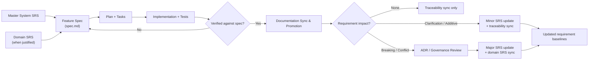

# Project Documentation and Specification with Spec-Driven Development Strategy

## Document Control

| Field | Value |
|-------|-------|
| Project | DP Stock Investment Assistant |
| Domain | Documentation architecture, requirements engineering, and specification governance |
| Focus | Harmonized documentation architecture synthesizing **arc42 (12-section structural blueprint)**, **C4 Model (visual zoom hierarchy)**, **ISO/IEC/IEEE 42010 (architecture meta-standard)**, and **Spec-Driven Development (SDD)** for a multi-layer, multi-domain financial agent system |
| Date | 2026-08-20 |
| Status | Target-state architecture & methodology baseline |
| Audience | Engineering, architecture, product, quant/trader, platform, and technical documentation maintainers |

## 1. Executive Summary

This document proposes a target-state documentation architecture for the DP Stock Investment Assistant repository, integrating a **tripartite architecture framework (ISO/IEC/IEEE 42010 + arc42 + C4 Model)** with the project's **Spec-Driven Development (SDD)** methodology as the primary delivery and documentation governance engine.

The project is a multi-layer, multi-domain system with distinct frontend, API gateway, agent reasoning (LangGraph), service orchestration, data persistence, and cloud infrastructure concerns. The current repository contains strong documentation assets and an established SDD practice with constitution governance, automated traceability, and a quality gate chain through spec-kit extensions.

The core architecture documentation strategy is:

- adopt **Spec-Driven Development as the central methodology** for how requirements flow from stable system-level definitions through feature delivery to verified implementation
- adopt an **arc42-structured hybrid documentation model** distributed across 4 directors (`docs/system/`, `docs/architecture/`, `docs/domains/`, and `specs/`), providing a complete 12-section architectural canvas without document bloat
- anchor static and dynamic visual modeling in the **C4 Model zoom hierarchy (Levels 1–4)** and **UML/DSL/BPMN notations** applied in their correspondingly relevant documents
- apply **ISO/IEC/IEEE 42010** as the meta-standard governing Stakeholders, Concerns, Viewpoints, Views, and Decision Rationale (ADRs)
- retain the **Constitution** (`.specify/memory/constitution.md`) as the non-negotiable governance layer that all feature specs, plans, and implementations must satisfy
- keep **ADRs** (`docs/architecture/DECISIONS/` and `docs/domains/*/DECISIONS/`) as decision records rather than requirement documents
- keep **OpenAPI** and other contract artifacts as executable interface sources of truth rather than duplicating them in prose
- keep **feature specs** under `specs/` as delivery-scoped realization artifacts linked back to approved requirement IDs, following the 18-step SDD lifecycle, and acting as local arc42 deltas during development
- maintain **automated traceability** through `spec-traceability.yaml`, `sync_spec_status.py`, and governed doc promotion gates to prevent documentation drift

This proposal defines the target structure, the SDD lifecycle integration, the arc42/C4 mapping, the governance model, and the document boundaries needed to guide long-term engineering execution.

## 2. Problem Statement

The current project has meaningful documentation depth and a proven SDD practice, but both are unevenly distributed:

- the agent domain already has a detailed SRS (v2.2, 302 items), architectural decision record set, and technical design documents
- the frontend domain already has ADRs and research reports for modernization and modularization
- the repository already maintains a machine-readable traceability model (`spec-traceability.yaml`) and automated sync (`sync_spec_status.py`) for feature-level specs
- the API surface already has a maintained OpenAPI specification (v1.4, 26+ endpoints)
- the operational domain already has practical artifacts such as reconciliation and migration tooling
- the SDD practice has been validated through three delivered features with full lifecycle completion (specify → plan → tasks → implement → verify)

However, the project still lacks a fully defined **system-level documentation architecture integrated with the SDD lifecycle** that answers these questions consistently:

- what document types exist in this repository and what each one is responsible for
- which document is authoritative for requirements, architecture decisions, contracts, technical realization, UX/UI intent, test evidence, and operations
- how the SRS, constitution, and SDD phases interact to govern how requirements are authored, delivered, verified, and maintained
- how requirements for frontend, API, agent, services, data, and maintenance should be distributed across documents
- how the project should evolve documentation over time without creating duplication, drift, or ambiguity
- how the existing automated traceability and quality gate chain extend to cover system-level and cross-domain documentation

Without an explicit documentation architecture that integrates with the proven SDD methodology, the next phase of project documentation generation risks producing overlapping artifacts that blur the boundary between requirements, decisions, design, and delivery, and that lack the automated governance mechanisms the project already relies on for feature-level work.

## 3. Objectives

This proposal has six objectives:

1. define a practical, repo-native target documentation structure for a multi-layer system
2. define the purpose and standards stance for each major document type
3. define how the SDD lifecycle governs the flow from stable requirements through feature delivery to verified documentation
4. define the constitution and quality gate integration model for system-level documentation
5. define the outline of the future master system SRS as the upstream requirement pool for SDD
6. define the subordinate document boundaries so future documentation generation stays coherent

## 4. Related Documents

This proposal is based on and aligned with the current project documents below.

| Document | Purpose in Current Repository | Role in This Proposal |
|----------|-------------------------------|-----------------------|
| [Architecture Review](../architecture-review.md) | Cross-domain and cross-layer architecture assessment of frontend, backend, agent, data, and infrastructure | Provides the system-wide framing and writing style for cross-domain and cross-layer documentation |
| [Stock Investment Assistant Agent — Software Requirements Specification](../domains/agent/SOFTWARE_REQUIREMENTS_SPECIFICATION.md) | Detailed domain SRS for the agent system | Reference model for requirement structure, numbering, and wording |
| [SRS Spec Traceability](../domains/agent/SRS_SPEC_TRACEABILITY.md) | Reverse trace from SRS items to feature specs | Reference model for requirement-to-delivery traceability |
| [Frontend Architecture Evolution Report](../frontend/frontend-architecture-evolution-report.md) | Research report for frontend architectural evolution | Reference model for analysis-oriented study documents |
| [ADR-Frontend-001](../frontend/adr-frontend-001-modular-application.md) | Frontend architectural direction | Reference model for ADR boundary and decision phrasing |
| [ADR-Frontend-002](../frontend/adr-frontend-002-modernize-frontend-foundation.md) | Frontend modernization stack and delivery direction | Reference model for implementation-oriented architecture decisions |
| [Spec-Kit HOW-TO](../spec-driven%20development%20(SDD)/spec-kit%20HOW-TO.md) | Repository-specific SDD workflow guidance with the 18-step SDD lifecycle | Defines the canonical SDD phase chain that this proposal integrates with system-level documentation |
| [Documentation Spec Maintainer Agent](../../.github/agents/documentation.spec-maintainer.agent.md) | Documentation-focused Copilot custom agent for long-lived docs, delivery-scoped specs, traceability, and customization files | Provides a fast entry point for contributors who need to apply the same SDD promotion, reconciliation, and traceability rules described in this methodology |
| [Project Constitution](../../.specify/memory/constitution.md) | Non-negotiable governance layer: 7 core principles, 9 golden rules, memory boundaries, SOLID constraints, quality gates | Defines the governance authority that all system-level and feature-level documentation must satisfy |
| [Spec Traceability Registry](../../specs/spec-traceability.yaml) | Machine-readable traceability manifest linking SRS items to feature specs with status gates | Defines the automated traceability model that system-level documentation must integrate with |
| [OpenAPI Specification](../openapi.yaml) | Executable API contract for the backend | Canonical contract artifact in the proposed documentation model |

## 5. Proposed Documentation Model

### 5.1 Recommended Model

The recommended target state is a **hybrid, domain-oriented documentation model governed by Spec-Driven Development**.

This means:

- one master system SRS as the **upstream requirement pool** that feature specs draw from
- domain-owned documentation grouped under `docs/domains/` for frontend, backend, agent, and data realization
- subordinate requirement specifications only where a domain (bounded context) is sufficiently specialized or already mature
- the **Constitution** as the non-negotiable governance layer that all specs, plans, and implementations must satisfy
- the **SDD lifecycle** (specify → clarify → plan → tasks → implement → verify) as the primary mechanism through which requirements become delivered, tested, and documented code
- domain technical design documents that explain realization, not requirements
- ADRs that explain architecturally significant decisions, not functional scope
- contract artifacts owned by the relevant domain that define interfaces directly, without unnecessary prose duplication
- feature specs that remain delivery-scoped and traceable to stable requirement IDs
- **automated traceability** (`spec-traceability.yaml`, `sync_spec_status.py`, and verified doc promotion) as the current mechanism that keeps documentation and code aligned

Throughout this proposal, the units grouped under `docs/domains/` are better understood as **bounded contexts or delivery domains**, not technology stacks. The repository path is retained for brevity, but terms such as frontend, backend, agent, and data should be read as ownership domains or layers rather than as references to React, Flask, LangGraph, or similar implementation stacks.

This model is the best fit for the current repository because it preserves existing documentation strengths and the proven SDD practice while avoiding two failure modes:

- a single oversized SRS that mixes business intent, API schema, architecture decisions, and technical design
- a fragmented document set where every subdomain invents its own structure and terminology without a system-level anchor

### 5.2 The SDD Role in System Documentation

In this model, Spec-Driven Development is not merely a delivery process — it is the **documentation governance engine**:

- **SRS documents** define WHAT the system must do (the stable requirement pool)
- **Constitution** defines the non-negotiable constraints that all work must satisfy
- **SDD feature specs** translate approved requirements into delivery-scoped specifications with acceptance scenarios
- **SDD plans and tasks** produce the detailed realization artifacts
- **SDD verify and sync** keep documentation aligned with implementation

The consequence is that system-level documentation is not generated once and maintained by hand. Instead, it is *authored as stable reference material and then kept current through the SDD lifecycle*: when a feature spec touches a requirement, the traceability registry records the mapping; when implementation diverges from the spec, the sync extension detects drift; when new behavior is added without a spec, backfill analysis surfaces the gap.

### 5.3 Long-Lived vs. Delivery-Scoped Artifacts

The documentation model distinguishes two artifact lifecycles:

| Lifecycle | Location | Characteristics | Examples |
|-----------|----------|-----------------|----------|
| **Long-lived** | `docs/` | Evolve slowly; own stable contracts and cross-domain obligations; updated through SDD traceability when feature delivery touches their domain | System SRS, architecture docs, domain technical design, ADRs, owned contracts, runbooks |
| **Delivery-scoped** | `specs/` | SDD spec-kit artifacts created when a feature is specified; complete when verified; may trigger updates to long-lived docs during sync phase | spec.md, plan.md, tasks.md, review.md, data-model.md, contracts/, quickstart.md |

Long-lived documents are **upstream** reference material. Delivery-scoped artifacts are **downstream** working documents. The SDD lifecycle connects them through requirement mapping, traceability registry entries, and post-delivery sync checks.

### 5.4 Documentation Design Principles

The target documentation architecture should follow these principles:

1. **One primary responsibility per document type**
2. **Authoritative source over duplicated prose**
3. **Cross-domain consistency for terminology and IDs**
4. **Traceability from requirement to design, implementation, verification, and maintenance evidence**
5. **Separation of WHAT, WHY, HOW, and HOW TO OPERATE**
6. **Incremental evolution rather than wholesale document replacement**
7. **Spec-first delivery**: every non-trivial change flows through the SDD lifecycle before modifying long-lived documentation
8. **Constitution compliance**: all documentation artifacts must satisfy the constraints defined in the project constitution
9. **Automated drift detection**: documentation currency is maintained through tooling, not manual discipline alone

### 5.5 Tripartite Architecture Framework: ISO 42010, arc42, and C4 Model

To achieve systematic architecture documentation without monolithic bloat, the repository synthesizes three standards:

```
                      ┌────────────────────────────────────────┐
                      │          ISO/IEC/IEEE 42010            │
                      │  (Meta-Model, Stakeholders & Concerns) │
                      └───────────────────┬────────────────────┘
                                          │  governs & justifies
                                          ▼
                      ┌────────────────────────────────────────┐
                      │              arc42 Canvas              │
                      │  (12-Section Structural Blueprint)     │
                      └───────────────────┬────────────────────┘
                                          │  visually expressed by
                                          ▼
                      ┌────────────────────────────────────────┐
                      │               C4 Model (+ UML/PlantUML)                 │
                      │  (Visual Zoom Hierarchy: L1 ➔ L4)      │
                      └────────────────────────────────────────┘
```

1. **ISO/IEC/IEEE 42010 (The Meta-Standard):** Establishes the ontology of software architecture. It dictates that every architecture description must address identified **Stakeholders** (Investors, Quant Analysts, Developers, Security, DevOps) and their specific **Concerns** through dedicated **Architecture Viewpoints** and **Architecture Views**, underpinned by recorded **Architecture Rationale (ADRs)**.
2. **arc42 (The Structural Canvas):** Provides the pragmatic 12-section blueprint. Instead of creating a single massive arc42 document, we distribute its 12 sections cleanly across the 4 repository layers:

| arc42 Section | Section Purpose | Target Repository Location | Visual / Content Role in Project |
|---|---|---|---|
| **§1 Introduction & Goals** | Business context, key quality goals, primary stakeholders | `docs/system/SYSTEM_REQUIREMENTS_SPECIFICATION.md` | Primary financial assistant use cases, user roles, top business goals |
| **§2 Architecture Constraints** | Non-negotiable technical, regulatory, organizational limits | `docs/architecture/SYSTEM_OVERVIEW_AND_BOUNDARIES.md` + `.specify/memory/constitution.md` | Golden Rules, LLM tool boundaries, market manipulation safeguards |
| **§3 Context & Scope** | Business and technical system boundaries, external interfaces | `docs/architecture/SYSTEM_OVERVIEW_AND_BOUNDARIES.md` | **C4 Level 1 (System Context):** External financial APIs, news feeds, LLM endpoints |
| **§4 Solution Strategy** | Fundamental architectural decisions and patterns | `docs/architecture/SYSTEM_OVERVIEW_AND_BOUNDARIES.md` (Strategy section) | Modular monolith, event-driven streaming, LangGraph multi-agent orchestration |
| **§5 Building Block View** | Static hierarchical decomposition | **System (L1):** `docs/architecture/SYSTEM_OVERVIEW_AND_BOUNDARIES.md`<br>**Domain (L2):** `docs/domains/*/ARCHITECTURE_DESIGN.md` + `docs/domains/*/TECHNICAL_DESIGN.md` | **C4 Level 2 (Container):** Frontend, Backend, Agent Engine, Redis, MongoDB, Vector DB.<br>**C4 Level 3 (Component):** LangGraph nodes, Flask blueprints, React modules. |
| **§6 Runtime View** | Dynamic interaction, sequence flows, workflows | `docs/architecture/RUNTIME_AND_INTEGRATION_FLOWS.md` | UML Sequence / Activity diagrams for chat streaming, agent tool loops, cache sync |
| **§7 Deployment View** | Physical/Cloud infrastructure, environments, network | `docs/architecture/DEPLOYMENT_AND_INFRASTRUCTURE.md` | **C4 Deployment Diagram:** Container mapping, cloud VPC, Redis/Mongo clusters, CI/CD |
| **§8 Cross-cutting Concepts** | Reusable patterns across the entire system | `docs/architecture/CROSS_CUTTING_CONCEPTS.md` | Auth/RBAC, LangGraph Memory (LTM/STM), LLM caching, structured logging, rate limits |
| **§9 Architecture Decisions** | Architectural Decision Records (ADRs) | `docs/architecture/DECISIONS/` & `docs/domains/*/DECISIONS/` | Nygard-style ADRs capturing context, options, decision, trade-offs, consequences |
| **§10 Quality Requirements** | Quality tree and measurable quality scenarios | `docs/system/SYSTEM_REQUIREMENTS_SPECIFICATION.md` (§6 System NFRs - ISO 25010) | Latency (<500ms TTFT for streaming), 99.9% uptime, strict precision, safety checks |
| **§11 Risks & Technical Debt** | Known vulnerabilities, architectural trade-offs | `docs/architecture/RISKS_AND_TECHNICAL_DEBT.md` | LLM rate limits, third-party data reliability, memory drift, sync latency |
| **§12 Glossary** | Standard domain dictionary & technical terminology | `docs/study-hub/project-documentation-and-specification-methodology.md` (§6.2 Canonical Glossary) | Precise definitions of Domain, Bounded Context, Layer, Agent State, Contracts |

3. **C4 Model (The Visual Hierarchy):** Standardizes static and dynamic visuals at 4 levels of detail:
   - **Level 1 (System Context):** High-level view showing users, external systems, and boundaries (in `SYSTEM_OVERVIEW_AND_BOUNDARIES.md`).
   - **Level 2 (Container Diagram):** High-level deployable units, services, and datastores (in `SYSTEM_OVERVIEW_AND_BOUNDARIES.md` + `docs/domains/*/ARCHITECTURE_DESIGN.md`).
   - **Level 3 (Component Diagram):** Internal modules, routers, agents, and stores within a domain (in `docs/domains/*/TECHNICAL_DESIGN.md`).
   - **Level 4 (Code / Data Seams):** code in src/, interfaces, OpenAPI contracts in `docs/openapi.yaml`, and data models (in `specs/<feature-id>/data-model.md` and executable schemas), IaC/, and deployment scripts.

## 6. Standards Stance

This proposal uses three standards stances so the project can be disciplined without pretending formal compliance where it does not need to.

| Stance | Meaning | Typical Use in This Repository |
|--------|---------|--------------------------------|
| **Conformant** | The document should comply directly with an external standard or machine-readable schema | OpenAPI, JSON schema-based contract artifacts |
| **Aligned** | The document should follow the structure, intent, and terminology of a standard without claiming certification | SRS, architecture descriptions, UX process framing |
| **Practice-Based** | The document should follow an explicit internal template derived from good engineering practice | ADRs, runbooks, feature specs, study documents |

### 6.1 Recommended External Standards and Practices

| Standard / Practice | Recommended Use |
|---------------------|-----------------|
| **ISO/IEC/IEEE 29148** | Use as the primary organizing model for requirements engineering, requirement quality, and document layering |
| **ISO/IEC/IEEE 42010** | Use as the framing meta-standard for architecture descriptions, stakeholder concerns, viewpoints, and views |
| **arc42 (v8+)** | Use as the 12-section structural canvas distributed across system, architecture, and domain documents |
| **C4 Model** | Use as the primary hierarchical visual abstraction standard (Context, Container, Component, Code/Deployment) |
| **ISO/IEC 25010** | Use as the quality characteristics classification model for arc42 §10 / SNR requirements |
| **OpenAPI 3.1** | Use as the authoritative HTTP API contract standard |
| **WCAG 2.2 AA** | Use as the baseline accessibility standard for UI and UX design specifications |
| **Multi-Modeling Notation Strategy** | Use **UML, C4, DSL/PlantUML, and BPMN** in their correspondingly relevant places, with Mermaid as the primary Markdown-diffable authoring format (Section 9.3) |
| **ADR / Nygard-style decision records** | Use as the practice model for architecture-significant decision capture |
| **Spec-Kit / Spec-Driven Development** | Use as the **primary delivery and governance methodology** for feature planning, implementation, verification, and documentation maintenance |

### 6.2 Canonical Glossary (Normative Taxonomy)

The terms in this glossary are the canonical vocabulary for this repository. Contributors should use these terms consistently in SRS documents, technical design documents, ADRs, contracts, and feature specs.

| Term | Canonical Meaning | Use This For | Avoid Using For |
|------|-------------------|--------------|-----------------|
| **Architecture Viewpoint** | A specification of the conventions for constructing and using an architecture view to address specific stakeholder concerns (ISO 42010) | Framing system overview, runtime flows, deployment views, cross-cutting concepts | Generic synonym for personal opinion |
| **Architecture View** | A work product expressing the architecture of a system from the perspective of a specific viewpoint (ISO 42010) | Static structure, runtime sequence, deployment topology | Loose collections of unorganized notes |
| **arc42 Canvas** | The 12-section structural blueprint distributed across system, architecture, and domain documents | Structuring complete architectural coverage across the repository | Forcing a single monolithic 12-section doc |
| **C4 Hierarchy** | 4-level zoom model (Context L1, Container L2, Component L3, Code L4) for visual architecture communication | Structuring visual diagrams at appropriate levels of abstraction | Mixing container and code details in one diagram |
| **Cross-Cutting Concept** | An architectural pattern, policy, or mechanism spanning multiple domains (arc42 §8) | Memory LTM/STM, Auth, LLM caching, observability, error handling | Domain-isolated internal helpers |
| **Domain** | A delivery ownership unit that groups related responsibilities and artifacts | Requirement allocation, document ownership, technical design scope | Naming implementation tool choices |
| **Bounded Context** | A domain boundary with explicit semantics and responsibilities | Clarifying scope boundaries when terms overlap across domains | Generic synonym for every folder |
| **Layer** | A technical or architectural level within a domain or service | Route/service/repository separation, presentation/business/data layering | Cross-domain ownership mapping |
| **Technology Stack** | The concrete implementation technologies used to build a domain or service | React/TypeScript, Flask/Python, LangGraph/LangChain, MongoDB/Redis | Requirement ownership taxonomy |
| **API Boundary / API Contract** | The externally exposed interface of the backend domain, expressed normatively through executable contracts such as OpenAPI | Backend interface ownership, request/response obligations, compatibility and schema governance | A separate ownership domain independent from the backend domain |
| **Frontend Domain** | User interaction, UX flow, client-side state, and rendering responsibilities | UI requirements, frontend technical design, frontend ADR impacts | Backend API contract ownership |
| **Backend Domain** | API surface, orchestration, business workflows, and integration mediation | System API obligations, service-layer realization, contract publication | Agent reasoning policy |
| **Agent Domain** | AI reasoning workflow, tool orchestration, memory behavior, and response composition | Agent-specific subordinate SRS and behavior constraints | Full-system requirement ownership |
| **Data Domain** | Persistence, schema/index policy, retention, migration, and cache behavior | Data constraints, storage semantics, recoverability concerns | UI or API interaction behavior |
| **Operations Domain** | Release readiness, observability operations, reconciliation, migration safety, and runbooks | Operations policy and runbook responsibilities | Functional feature behavior definitions |
| **Master System SRS** | The authoritative cross-domain requirement baseline | SR/SNR requirements, system-level lifecycle obligations | Domain-local implementation detail |
| **Domain SRS** | A subordinate SRS for one domain when justified by complexity | Domain-local specialization that does not contradict master SRS | Replacing master SRS authority |
| **Executable Contract** | Machine-readable interface source of truth (e.g., OpenAPI schema) | Payload/schema definitions and compatibility checks | Narrative rationale and decision tradeoffs |

**Repository path note**: The folder name `docs/domains/` is retained for backward compatibility and continuity, but its contents are interpreted normatively as domains/bounded contexts in this documentation model.

## 7. SDD Lifecycle Integration

### 7.1 Overview and Authority Reference

**Spec-Driven Development (SDD)** with **Spec Kit** is the central delivery and documentation governance engine in this repository. It translates business intent and system requirements into verified implementation through a governed chain of structured Markdown artifacts (`specs/<feature-id>/`), eliminating ambiguity before code is written and preserving verifiable evidence after delivery.

> [!IMPORTANT]
> **Detailed Operational Guide**:
> For the comprehensive 18-step SDD lifecycle, step-by-step CLI commands, flag references, extension integrations, troubleshooting, and persistence policies, refer to the authoritative guide:
> ➔ **[`docs/spec-driven development (SDD)/spec-kit HOW-TO.md`](../spec-driven%20development%20%28SDD%29/spec-kit%20HOW-TO.md)**.

### 7.2 High-Level SDLC Delivery Stages

The SDD workflow organizes feature delivery into five governed stages:

| Stage | Purpose | Primary Spec Kit Commands / Tools | Key Documentation & Artifact Impact |
|---|---|---|---|
| **1. Requirements & Governance** | Align with system requirements baseline and verify non-negotiable constitution constraints | `speckit.constitution`, SRS baselines | Sourced from `docs/system/SYSTEM_REQUIREMENTS_SPECIFICATION.md`, <br> `docs/domains/*/SOFTWARE_REQUIREMENTs_SPECIFICATION.md`, `.specify/memory/constitution.md` |
| **2. Specification & Refinement** | Translate approved requirements into delivery-scoped feature specifications with acceptance scenarios | `speckit.specify`, `speckit.clarify`, `speckit.checklist` | Generates `specs/<feature-id>/spec.md` with explicit SRS requirement IDs and quality checklists |
| **3. Planning & Review** | Produce technical design, constitution-checked plan, user-story tasks, and cross-model risk review | `speckit.plan`, `speckit.tasks`, `speckit.analyze`, `speckit.fleet.review` | Generates `plan.md`, `tasks.md`, `data-model.md` (C4 L4 seams), and records mappings in `specs/spec-traceability.yaml`. Governed and referenced documents like <br> `docs/architecture/`, <br> `docs/domains/*/TECHNICAL_DESIGN.md`, <br> `docs/domains/*/ARCHITECTURE_DECISIONS.md`,<br> `docs/domains/*/RISKS_AND_TECHNICAL_DEBTS.md`, <br> `docs/domains/*/ARCHITECTURE_DESIGN.md` , <br> `docs/openapi.yaml`,... |
| **4. Implementation & Verification** | Execute code changes aligned to plan, detect phantom task completions, and verify against constitution | `speckit.implement`, `speckit.verify-tasks.run`, `speckit.verify.run` | Implements changes under `src/`; produces verification evidence and passes quality gates |
| **5. Traceability, Promotion & Sync** | Reconcile RTM gates, detect drift, and promote stable architectural deltas into long-lived docs | `scripts/sync_spec_status.py --gate`, manual/agent-assisted doc sync | Updates `spec-traceability.yaml`, <br> `spec-sync-status.md`,<br> `openapi.yaml`,<br> `docs\domains\agent\SRS_SPEC_TRACEABILITY.md`,<br> and promotes arc42 views |
| **6. Maintenance & Evolution** | Monitor for requirement drift, update SRS baselines, and maintain traceability | `scripts/sync_spec_status.py --gate`, manual/agent-assisted doc sync | Maintains long-lived docs and SRS baselines; ensures traceability integrity |

### 7.3 arc42 Upward Promotion Engine

In this documentation architecture, delivery-scoped feature directories (`specs/<feature-id>/`) serve as **local arc42 deltas** during active development. Once a feature passes post-implementation verification, stable architectural knowledge is promoted into permanent long-lived documentation:

- **System Context & Container Topology** ➔ `docs/architecture/SYSTEM_OVERVIEW_AND_BOUNDARIES.md` (arc42 §3, §4, §5 L1)
- **Runtime Sequence & Dynamic Workflows** ➔ `docs/architecture/RUNTIME_AND_INTEGRATION_FLOWS.md` (arc42 §6)
- **Deployment & Cloud Infrastructure** ➔ `docs/architecture/DEPLOYMENT_AND_INFRASTRUCTURE.md` (arc42 §7)
- **Cross-Cutting Mechanisms (Auth, Memory, Caching)** ➔ `docs/architecture/CROSS_CUTTING_CONCEPTS.md` (arc42 §8)
- **Architectural Trade-offs & Decisions** ➔ `docs/architecture/DECISIONS/` or `docs/domains/*/DECISIONS/` (arc42 §9 / ADRs)
- **Domain Component Internals** ➔ `docs/domains/*/TECHNICAL_DESIGN.md` (arc42 §5 L2 / C4 L3)
- **Identified Risks & Technical Debt** ➔ `docs/architecture/RISKS_AND_TECHNICAL_DEBT.md` (arc42 §11)
- **API Surface Changes** ➔ `docs/openapi.yaml` (Golden Rule 9)

### 7.4 SRS as Upstream Requirement Pool & Baseline Lifecycle

The master system SRS (`docs/system/SYSTEM_REQUIREMENTS_SPECIFICATION.md`) functions as the **stable upstream requirement pool**:
- Requirements originate in the SRS with stable IDs (e.g., `SR-3.1.1`, `SNR-2.1.1`), priority, and owning domain allocations.
- Feature specs in `specs/` draw from these IDs and provide rich delivery detail (acceptance scenarios, task sequencing, verification evidence).
- Feature delivery proves SRS requirements through automated traceability rather than rewriting the SRS.


```mermaid
flowchart LR
  A["Master System SRS"] --> C["Feature Spec\n(spec.md)"]
  B["Domain SRS\n(when justified)"] --> C
  C --> D["Plan + Tasks"]
  D --> E["Implementation + Tests"]
  E --> F{"Verified against spec?"}
  F -- "No" --> C
  F -- "Yes" --> G["Documentation Sync & Promotion"]
  G --> H{"Requirement impact?"}
  H -- "None" --> I["Traceability sync only"]
  H -- "Clarification / Additive" --> J["Minor SRS update\n+ traceability sync"]
  H -- "Breaking / Conflict" --> K["ADR / Governance Review"]
  K --> L["Major SRS update\n+ domain SRS sync"]
  J --> M["Updated requirement baselines"]
  L --> M
```

In practice, feature delivery should consume the current approved baseline, and requirement updates should be synchronized back only after the impact has been classified and the necessary approval path has been followed.

## 8. Constitution and Quality Gate Model

### 8.1 Constitution Governance

The project constitution (`.specify/memory/constitution.md`, currently v1.3) is the non-negotiable governance layer. It includes:

- **7 Core Principles** (from ADR-001): Memory boundaries, RAG integrity, tool-vs-LLM separation, market manipulation safeguards
- **9 Golden Development Rules**: Security first, test before merge, logging over print, document intent, backward compatibility, fail fast, keep it simple, follow domain standards, public API contract sync
- **Memory Architecture Boundaries**: Explicit lists of allowed and prohibited content in LTM and STM
- **Architecture and Quality constraints**: Factory, Repository, Blueprint, and Protocol patterns; SOLID principles; layered architecture enforcement

Every feature spec should pass a constitution check before planning begins (Step 2) and after design is complete (Step 5). The constitution check is enforced through the SDD workflow convention and spec-kit tooling, not through a programmatic CI gate — its effectiveness depends on consistent use of the `speckit.constitution` and `speckit.plan` commands during the SDD lifecycle. It is a strong governance convention, not an automated pipeline blocker.

### 8.2 Quality Gate Chain

The SDD practice uses a chain of quality gates enforced through spec-kit extensions:

| Gate | Extension | When Applied | What It Catches |
|------|-----------|--------------|-----------------|
| Spec quality | `speckit.understanding.validate` | After specify | Ambiguity, untestability, structural weakness (31 metrics, ISO 29148 gates) |
| Project health | `speckit.doctor` / `speckit.speckit-utils.doctor` | Before plan | Missing templates, broken config, stale artifacts |
| Constitution compliance | `speckit.plan` (constitution check) | Before and after planning | Violations of core principles or golden rules |
| Traceability completeness | `speckit.validate` / `speckit.speckit-utils.validate` | After tasks | Unmapped requirements, orphaned tasks, missing files |
| Cross-artifact consistency | `speckit.analyze` | After tasks | Contradictions between spec, plan, and tasks |
| Cross-model review | `speckit.fleet.review` | Before implement | Blind spots, feasibility gaps, risk assessment |
| Phantom completion detection | `speckit.verify-tasks.run` | After implement | Tasks marked done but code missing or dead |
| Post-implementation verification | `speckit.verify.run` | After implement | Gaps between implemented code and spec/plan/tasks/constitution |
| Traceability and sync gate | `scripts/sync_spec_status.py --gate` | During maintenance | SRS baseline mismatch, feature status drift, stale forward/reverse reports |
| Code-to-document drift review | Manual or skill-assisted review, typically `$technical-design-manager` for technical design promotion | During maintenance | Code-to-spec divergence, unspecced behavior, long-lived doc promotion gaps |

These gates apply to feature-level work today. As system-level documentation is generated, the same governance model should extend to long-lived documents through periodic sync analysis and constitution-aware authoring.

### 8.3 Traceability Automation

The project maintains automated traceability through three interconnected artifacts:

1. **`specs/spec-traceability.yaml`** — Machine-readable manifest linking SRS items to feature specs with status gates (analyzed → planned → implemented → verified). Currently tracks 302 SRS items with 123 mapped and 179 unmapped.

2. **`specs/spec-sync-status.md`** — Human-readable summary report showing feature mapping status, coverage, linked SRS items, and evidence links.

3. **`scripts/sync_spec_status.py`** — CLI automation that generates forward and reverse traceability reports from the YAML manifest.

Sync extension posture: `speckit.sync.*` is not installed or enabled in the current repository command surface. The supported operating path is the local script plus manual or skill-assisted promotion into long-lived docs. If a future upgrade adopts the sync extension, it should be documented as a governed change with command availability confirmed by `specify extension list`, not inferred from upstream examples.

When the system-level SRS is created, the traceability registry should be extended to track:

- system-level requirement IDs (SR-x for functional, SNR-x for non-functional) in addition to the current domain-level IDs (FR-x, NFR-x)
- cross-document references (e.g., a feature spec that delivers both agent requirements and API requirements)
- long-lived document freshness (last sync date, last delivery that touched the document)

### 8.4 Common Pitfalls, Tradeoffs, and Backward Pressure

An SDD-centered documentation strategy is strong, but it has real failure modes. The most important ones for this repository are below.

| Risk | How It Shows Up | Practical Countermeasure |
|------|------------------|--------------------------|
| **Document proliferation** | Every concern gets its own long-lived `.md` file, and maintainers stop keeping them current | Treat new long-lived docs as exceptions; require promotion criteria before creating them |
| **SRS overload** | The master SRS becomes a feature backlog, design spec, and test plan all at once | Keep the SRS lightweight; push detail into feature specs and contracts |
| **Spec bureaucracy** | Small changes are slowed down by over-heavy process expectations | Use SDD fully for non-trivial changes; allow lightweight handling for small, low-risk fixes while still updating traceability where needed |
| **Duplicate authority** | A requirement appears in SRS, a design doc, and an ADR with conflicting wording | Assign one owner per concern: SRS for requirements, ADR for decisions, contract for interface, feature spec for delivery detail |
| **Unverified promotion** | Planned behavior is copied into long-lived docs before code is verified | Update long-lived docs late in the lifecycle, after implementation and verification |
| **Tooling drift** | The process depends on traceability and sync tooling, but the registry is not maintained | Make sync and traceability updates part of the definition of done for any requirement-linked feature |
| **Backward pressure from existing docs** | Older documents continue to act as de facto sources of truth even after the new structure is defined | Reclassify existing docs explicitly as keep, merge, repurpose, or retire, and avoid creating parallel replacements without migration intent |

The main tradeoff is straightforward: SDD improves traceability and governance, but it adds process overhead. For this project, that overhead is justified for architecture changes, cross-domain and cross-layer features, agent behavior changes, API surface changes, and operational workflows. It is not justified if every small refactor must spawn a new long-lived document.

## 9. Target Documentation Structure

### 9.1 Target File Tree

The target structure organizes documents first by ownership scope, then by arc42 viewpoint and artifact type. In this model, the repository uses four documentation layers:

1. **System (`docs/system/`)** — canonical cross-domain requirements, quality tree (arc42 §1, §2, §10), and requirements governance
2. **Architecture (`docs/architecture/`)** — whole-system structure, context, strategy, building blocks L1, runtime flows, deployment view, cross-cutting concepts, risks/debt, and ADRs (arc42 §3, §4, §5 L1, §6, §7, §8, §9, §11)
3. **Domains (`docs/domains/`)** — domain-owned realization (C4 L3 Components / arc42 §5 L2), domain-specific constraints, and owned contracts
4. **Specs (`specs/`)** — delivery-scoped feature artifacts created and maintained through the SDD lifecycle (acting as local arc42 deltas and C4 L4 code/data models)

```text
docs/
  system/
    REQUIREMENTS_METHOD_AND_GOVERNANCE.md   # Requirements governance, lifecycle, change control (arc42 §2)
    SYSTEM_REQUIREMENTS_SPECIFICATION.md    # Upstream master requirement pool + ISO 25010 Quality Scenarios (arc42 §1, §10)

  architecture/
    SYSTEM_OVERVIEW_AND_BOUNDARIES.md       # Context, scope, strategy, building block L1 (arc42 §3, §4, §5 L1 / C4 L1-L2)
    RUNTIME_AND_INTEGRATION_FLOWS.md        # Dynamic workflows, execution loops, sequence views (arc42 §6)
    DEPLOYMENT_AND_INFRASTRUCTURE.md        # Physical/cloud infrastructure, network, environment mapping (arc42 §7 / C4 Deployment)
    CROSS_CUTTING_CONCEPTS.md               # Auth, Memory LTM/STM, LLM Caching, Telemetry/Logging, Rate Limits (arc42 §8)
    RISKS_AND_TECHNICAL_DEBT.md             # Known risks, technical debt backlog, architectural trade-offs (arc42 §11)
    DECISIONS/                              # Architectural Decision Records (ADRs) (arc42 §9 / ISO 42010 Rationale)
      ADR-0001-...
      ADR-0002-...

  domains/
    frontend/
      TECHNICAL_DESIGN.md                   # Frontend component realization (arc42 §5 L2 / C4 L3)
      DECISIONS/
        ADR-FRONTEND-0001-MODULAR-APPLICATION.md
        ADR-FRONTEND-0002-MODERNIZE-FRONTEND-FOUNDATION.md

    backend/
      TECHNICAL_DESIGN.md                   # Backend service/router realization (arc42 §5 L2 / C4 L3)
      api/
        openapi.yaml

    agent/
      SOFTWARE_REQUIREMENTS_SPECIFICATION.md # Subordinate domain SRS (specialized AI reasoning)
      ARCHITECTURE_DESIGN.md                 # LangGraph agent architecture, agent orchestration, tool integration (arc42 §5 L2 / C4 L3)
      TECHNICAL_DESIGN.md                   # LangGraph graph nodes, state machine, tools (arc42 §5 L2 / C4 L3)
      DECISIONS/                            # ADRs for agent architecture and tool orchestration (arc42 §9 / ISO 42010 Rationale)
        ADR-AGENT-0001-...

    data/
      TECHNICAL_DESIGN.md                   # Persistence, indexing, cache topology (arc42 §5 L2 / C4 L3)
      POLICY_AND_CONSTRAINTS.md

  operations/
    OPERATIONS_AND_RELEASE_POLICY.md        # Release readiness, runbook policy, operational SLAs
    RUNBOOKS/                               # Step-by-step incident, migration, and reconciliation runbooks

  testing/
    VERIFICATION_AND_TRACEABILITY_STRATEGY.md # Verification levels, evidence gates, test architecture

  study-hub/
    <analysis, proposals, research>
  research/
    <research, comparison studies, planning proposals>

specs/
  <feature-id>/
    spec.md                                 # Delivery-scoped requirement delta
    plan.md                                 # Technical design delta & constitution check
    tasks.md                                # User-story implementation tasks
    review.md                               # Pre-implementation review evidence
    data-model.md                           # Local data entities / C4 Level 4 Code & Seams
    contracts/                              # Local payload & schema contracts
  spec-traceability.yaml                    # Automated RTM mapping SRS items to specs
  spec-sync-status.md                       # Bidirectional traceability report
```

### 9.2 Purpose and Standards Stance by Document Type

| Document Type | Target Files | Purpose | Standards Stance |
|---------------|--------------|---------|------------------|
| **Master System SRS** | `docs/system/SYSTEM_REQUIREMENTS_SPECIFICATION.md` | Authoritative source for cross-domain functional, non-functional, interface, lifecycle, and ISO 25010 quality scenarios (arc42 §1, §10) | **Aligned** to ISO/IEC/IEEE 29148 & ISO/IEC 25010 |
| **Requirements Governance Guide** | `docs/system/REQUIREMENTS_METHOD_AND_GOVERNANCE.md` | Defines how requirements are authored, approved, changed, traced, and retired (arc42 §2 constraints) | **Aligned** to 29148 & ISO 42010 governance |
| **System Architecture Overview** | `docs/architecture/SYSTEM_OVERVIEW_AND_BOUNDARIES.md` | Describes system context, solution strategy, and Level 1 building blocks / containers (arc42 §3, §4, §5 L1) | **Aligned** to ISO 42010 & C4 Model (L1, L2) |
| **Runtime Flows** | `docs/architecture/RUNTIME_AND_INTEGRATION_FLOWS.md` | Dynamic interactions, sequence flows, workflows, and streaming loops (arc42 §6) | **Aligned** to arc42 §6 / UML Sequence & Activity |
| **Deployment & Infrastructure** | `docs/architecture/DEPLOYMENT_AND_INFRASTRUCTURE.md` | Physical/cloud infrastructure, environments, container network topology, and deployment mapping (arc42 §7) | **Aligned** to arc42 §7 & C4 Deployment View |
| **Cross-Cutting Concepts** | `docs/architecture/CROSS_CUTTING_CONCEPTS.md` | System-wide reusable mechanisms: Auth/RBAC, LangGraph Memory LTM/STM, LLM Caching, Telemetry (arc42 §8) | **Aligned** to arc42 §8 |
| **Risks & Technical Debt** | `docs/architecture/RISKS_AND_TECHNICAL_DEBT.md` | Explicit register of known risks, trade-offs, limitations, and technical debt backlog (arc42 §11) | **Aligned** to arc42 §11 |
| **ADRs** | `docs/architecture/DECISIONS/` & `docs/domains/*/DECISIONS/` | Capture architecturally significant decisions and trade-offs at system or domain scope (arc42 §9) | **Practice-Based** Nygard ADR discipline |
| **Domain Technical Design** | `docs/domains/*/TECHNICAL_DESIGN.md` | Explains how each domain realizes allocated requirements (C4 L3 Components / arc42 §5 L2) | **Aligned** design practice (C4 Level 3) |
| **Domain-Specific Requirement Documents** | only where justified, e.g. `docs/domains/agent/SOFTWARE_REQUIREMENTS_SPECIFICATION.md` | Specialized subordinate requirement sets for independently complex domains | **Aligned** subordinate SRS practice |
| **Executable Contracts** | current: `docs/openapi.yaml`; target: `docs/domains/backend/api/openapi.yaml` | Defines request/response schemas, event contracts, and integration payloads without prose duplication | **Conformant** to OpenAPI 3.1 schema standard |
| **Operations Policy and Runbooks** | `docs/operations/OPERATIONS_AND_RELEASE_POLICY.md`, `docs/operations/RUNBOOKS/` | Operational policies, release readiness, migration procedures, and incident handling | **Aligned** for policy; **Practice-Based** for runbooks |
| **Verification and Traceability Strategy** | `docs/testing/VERIFICATION_AND_TRACEABILITY_STRATEGY.md` | Test levels, quality gates, evidence standards, and requirement-to-test traceability | **Aligned** internal verification standard |
| **Feature Specs** | `specs/<feature-id>/...` | Delivery-scoped realization documents acting as local arc42 deltas during active development | **Practice-Based** Spec-Kit workflow |
| **Traceability Registry and Reports** | `specs/spec-traceability.yaml`, `specs/spec-sync-status.md` | Maintains bidirectional requirement-to-delivery traceability | **Practice-Based** RTM-style governance |

| **Study, Research, and Analysis Documents** | `docs/study-hub/` + `docs/research` | Holds research, comparison studies, and planning proposals that inform decisions but are not themselves long-lived authority documents | **Practice-Based** study format |

### 9.3 Diagram and Multi-Modeling Notation Standards by Document Type

The repository adopts a **multi-modeling notation strategy**, applying UML, C4, PlantUML/DSL, BPMN, and Mermaid in their correspondingly relevant places. Mermaid remains the primary text-based, Git-diffable authoring format in Markdown:

| Document Type | Primary Modeling Style | Preferred Authoring Format | Visual Level & Scope | Constraints / Guidance |
|---------------|------------------------|----------------------------|----------------------|------------------------|
| **System Overview & Boundaries** | **C4 Model** (Context L1 & Container L2) | Mermaid (`C4Context`, `C4Container` or stylized flowcharts) / Structurizr DSL | System boundaries, external actors, high-level containers, and major communication protocols | Zoom out; do not expose internal classes or private modules at container level |
| **Runtime & Integration Flows** | **UML Behavioral** (Sequence, Activity, State) | Mermaid (`sequenceDiagram`, `stateDiagram-v2`) | Request/response streaming, agent tool loops, cache sync, distributed transactions | Focus on critical paths; include timeouts, error branches, and asynchronous messaging |
| **Deployment & Infrastructure** | **C4 Deployment** / Infrastructure Topology | Mermaid (`C4Deployment` or boxed flowcharts) / PlantUML | Container mapping, cloud VPCs, database clusters, load balancers, CI/CD runners | Clearly distinguish environments (Development, Staging, Production) |
| **Cross-Cutting Concepts** | **UML Class / Conceptual Flows** | Mermaid / Markdown tables | Memory hierarchy (LTM vs STM), Auth token lifecycle, Caching tier diagrams | Pair architectural patterns with explicit implementation rules |
| **Domain Technical Design** | **C4 Component (L3)** + **UML Structural/Behavioral** | Mermaid (`C4Component`, `classDiagram`, `erDiagram`) / PlantUML | Domain internals, LangGraph graph nodes, Flask blueprint routing, React component tree | Detail internal interfaces, persistence schemas, and domain-local state machines |
| **Feature Specs (`specs/`)** | **C4 Code (L4)** + Local Flowcharts | Mermaid (`flowchart`, `sequenceDiagram`, `erDiagram`) | Delivery-scoped scenarios, data model deltas (`data-model.md`), local execution flow | When promoted into `docs/`, normalize diagrams into the permanent arc42/C4 documents |
| **Operations & Runbooks** | **BPMN 2.0 / Swimlane Flows** | Mermaid flowchart with subgraphs / BPMN | Human handoffs, multi-stage release approvals, disaster recovery, data reconciliation | Highlight decision gateways, rollback triggers, and escalation points |
| **ADRs** | **Context Sketches & Impact Flows** | Markdown tables first; Mermaid flowcharts selectively | Decision context, option comparison trade-offs, boundary impact | Keep visuals lightweight; avoid duplicating full architecture diagrams |
| **Executable Contracts & RTM** | **Schema-First Artifacts** | OpenAPI 3.1 YAML, JSON Schema | Machine-readable interface definitions and status matrices | Contract files are normative; supporting diagrams are purely informative |

#### Diagram Visualization Quality Rules

Regardless of document type, diagram visualization must follow these quality rules:

1. Precede each non-trivial diagram with a short sentence that states its scope and why the visual is needed.
2. Label diagrams explicitly as `current-state`, `target-state`, `planned-state`, or `transition-state` when implementation status is not obvious.
3. Use consistent naming for actors, systems, boundaries, and data stores matching the **Canonical Glossary (§6.2)**.
4. Keep reading direction predictable (Top-to-Bottom or Left-to-Right) and split dense visuals into multiple diagrams when crossings or node counts reduce readability.
5. Do not rely on color alone to carry meaning; essential distinctions must remain visible in text labels, groupings, or line styles for accessibility and raw Markdown rendering.
6. When a single diagram cannot stay simple, pair it with a compact table or interpretation notes instead of forcing all meaning into the visual.

### 9.4 Functional and Non-Functional Requirements in the Domain Model

Under the domain model, **functional requirements and non-functional requirements remain canonical at the system level first**, then are allocated to domains as ownership metadata.

The recommended rules are:

1. **System functional requirements live in the master system SRS.** These describe end-to-end capabilities such as conversation lifecycle, AI-assisted response generation, streaming, workspace management, and model fallback.
2. **System non-functional requirements also live in the master system SRS.** Performance, resilience, security, observability, maintainability, accessibility, and compatibility are cross-domain by default and should not be split into separate domain-owned source documents unless there is a strong reason.
3. **Each requirement should carry domain allocation metadata.** At minimum, each requirement should identify a primary owning domain and any contributing domains.
4. **Domain documents explain realization, not duplicate the SRS.** Domain technical design documents should show how allocated SRs and SNRs are satisfied inside that bounded context.
5. **A domain gets its own requirement document only when needed.** This should be exceptional, not the default. In this repository, the agent domain is the clearest justified example.

In short: the master SRS remains the source of truth for SR and SNR requirements, domain documents explain realization and specialization, and feature specs provide delivery detail and verification evidence.

### 9.5 Promotion Rules for New Long-Lived Documents

Before creating a new long-lived document under `docs/`, the project should answer yes to at least one of these questions:

1. Does this information apply across multiple features or releases?
2. Does it define a stable requirement, policy, or architectural decision that future work must follow?
3. Does more than one engineering area need to reference it?
4. Would keeping it only inside one feature spec make future maintenance harder?
5. Can the content be absorbed into an existing system, architecture, or domain document instead of creating a new sibling?

If the answer is no, the content should usually remain inside the feature spec or implementation artifact rather than being promoted into the long-lived documentation set.

## 10. Master System SRS Proposal

### 10.1 Purpose of the Master System SRS

The **master system SRS** should become the authoritative upstream requirement pool for the workload as a whole.

In the SDD-integrated model, it should define:

- the cross-domain behavior the system must provide, expressed as stable requirement IDs that feature specs can reference
- the non-functional qualities the overall system must satisfy
- the domain allocation for each requirement, identifying the primary owning domain and any contributing domains
- the lifecycle obligations that span development, release, support, maintenance, and evolution
- the boundaries between system-level requirements, domain-owned realization documents, and any justified subordinate requirement sets

It should not try to become a contract file, a domain technical design specification, a feature backlog, or a delivery artifact. Feature delivery detail belongs in `specs/` under the SDD lifecycle, while domain realization belongs in `docs/domains/*/TECHNICAL_DESIGN.md`.

### 10.2 Recommended Outline

The recommended outline for `docs/system/SYSTEM_REQUIREMENTS_SPECIFICATION.md` is below. It is intentionally tighter than a traditional monolithic SRS so that domain-owned realization can live in the domain documents rather than bloating the master SRS.

1. **Document Control**
2. **Purpose, Scope, and Intended Use**
3. **Related Documents and Governance**
4. **System Context and Domain Model**
5. **System Functional Requirements**
6. **System Non-Functional Requirements**
7. **Requirement Allocation by Domain**
8. **Owned Contracts and Subordinate Requirement Sets**
9. **Verification, Traceability, and Change Control**
10. **Open Issues and Deferred Decisions**
11. **Revision History**

### 10.3 SRS Versioning and Change Control Mechanism

The master system SRS should use a simple three-level versioning scheme so requirement evolution is visible and downstream impact can be managed.

- **Major version** — breaking semantic changes to approved system requirements, retired or replaced requirement families, changed precedence rules between the master and domain SRS baselines, or major restructuring of the document baseline
- **Minor version** — additive requirements, approved clarifications that change expected behavior or verification, new domain allocations, or new subordinate SRS references
- **Patch version** — editorial corrections, wording cleanup, formatting, or traceability/reference updates that do not change requirement meaning

A lightweight change-control flow should govern SRS evolution:

1. **Trigger identification** — feature delivery, incident analysis, audit work, or roadmap planning identifies a needed requirement change.
2. **Change classification** — classify the update as clarification, additive change, breaking change, retirement, or editorial correction.
3. **Impact assessment** — identify affected requirement IDs, domain SRS documents, contracts, active feature specs, tests, and operational documents.
4. **Decision and approval** — approve routine clarifications and additions through normal SDD governance; escalate breaking changes, retirements, and precedence changes through an ADR or explicit governance decision.
5. **Baseline update** — update the master SRS, related domain SRS documents, revision history, and traceability manifest in one logical change set.
6. **Downstream synchronization** — sync affected feature specs, contracts, and verification assets so no stale requirement baseline remains in active delivery work.
7. **Verification closeout** — confirm the updated baseline is reflected in traceability reports and in any impacted in-flight feature specs.

The future `docs/system/REQUIREMENTS_METHOD_AND_GOVERNANCE.md` should define the approver roles and change classes in more operational detail, but the process above should be treated as the minimum baseline.

### 10.4 Recommended Functional Requirement Families

The master system SRS should organize functional requirements at the system level using requirement families such as:

- **SR-1: User Interaction and Experience Continuity**
- **SR-2: Workspace, Session, and Conversation Lifecycle**
- **SR-3: AI-Assisted Response Generation and Analysis**
- **SR-4: Market, Portfolio, and Supporting Data Acquisition**
- **SR-5: Real-Time Delivery and Streaming Behavior**
- **SR-6: Model and Provider Selection with Fallback**
- **SR-7: Administration, Support, and Operational Tooling**
- **SR-8: Contract Exposure and Integration Compatibility**

### 10.5 Recommended Non-Functional Requirement Families (arc42 §10 & ISO 25010)

The master system SRS should organize non-functional requirements and quality scenarios matching **arc42 §10 (Quality Requirements)** classified using **ISO/IEC 25010** quality categories:

- **SNR-1: Performance and Latency** (ISO 25010 Performance Efficiency — sub-500ms TTFT streaming latency, async background throughput)
- **SNR-2: Availability, Resilience, and Graceful Degradation** (ISO 25010 Reliability — 99.9% uptime, provider fallback, circuit breakers)
- **SNR-3: Security, Privacy, and Tenant Isolation** (ISO 25010 Security — RBAC, zero key leakage in prompt context, audit logging)
- **SNR-4: Data Integrity, Consistency, and Recoverability** (ISO 25010 Functional Suitability & Reliability — financial precision, idempotent updates)
- **SNR-5: Observability and Diagnosability** (ISO 25010 Maintainability — structured JSON logging, distributed trace propagation)
- **SNR-6: Maintainability and Testability** (ISO 25010 Maintainability — modular architecture, unit/integration test coverage >80%)
- **SNR-7: Usability, Accessibility, and Responsive Behavior** (ISO 25010 Usability — WCAG 2.2 AA compliance, responsive viewport support)
- **SNR-8: Compatibility, Versioning, and Change Safety** (ISO 25010 Compatibility — backward-compatible OpenAPI schemas, migration safety)

> **Namespace note**: `SNR-` distinguishes system-level non-functional requirements from subordinate domain SRS documents that may already use `NFR-` numbering. This mirrors the `SR-` vs `FR-` separation used for functional requirements. Quality scenarios and trees in `SNR-x` form the authoritative quality baseline, cross-referenced from `docs/architecture/SYSTEM_OVERVIEW_AND_BOUNDARIES.md`.

### 10.6 Requirement Entry Template (Domain-Allocated and SDD-Compatible)

To work effectively as a requirement pool for the SDD lifecycle, each requirement entry in the master SRS should be **lightweight, allocatable, and traceable**. The rich detail (rationale, acceptance scenarios, implementation sequencing, and verification evidence) lives in the feature spec that delivers the requirement.

Each requirement should include:

- **Requirement ID** — stable, never reused (e.g., SR-1.1.1 for functional, SNR-3.2.1 for non-functional)
- **Type** — Functional or Non-Functional
- **Title** — concise label
- **Requirement Statement** — what the system must do, expressed in SHALL/MUST language
- **Priority** — P0 (critical), P1 (important), P2 (desirable)
- **Primary Owning Domain** — the domain accountable for delivery coordination (frontend, backend, agent, data, operations)
- **Contributing Domains** — other domains that must participate in delivery or verification
- **Linked Domain Documents / Contracts** — which domain technical design or owned contract artifacts are relevant
- **Spec Coverage Status** — whether a feature spec has been created that delivers this requirement (populated by traceability automation)

This is intentionally lighter than a traditional heavy SRS template. The master SRS remains the canonical requirement source; domain documents explain realization; feature specs carry the detailed delivery and evidence model.

### 10.7 Example FR and NFR Allocation to Domains

The examples below show how domain allocation should work in practice.

**Example Functional Requirement**

| Field | Example |
|------|---------|
| Requirement ID | SR-5.1.1 |
| Type | Functional |
| Title | Streaming response delivery |
| Requirement Statement | The system SHALL deliver assistant responses incrementally to the user interface for streaming-capable chat requests. |
| Priority | P0 |
| Primary Owning Domain | backend |
| Contributing Domains | frontend, agent |
| Linked Domain Documents / Contracts | `docs/domains/backend/TECHNICAL_DESIGN.md`, `docs/domains/frontend/TECHNICAL_DESIGN.md`, current `docs/openapi.yaml` contract; future `docs/domains/backend/api/openapi.yaml` after governed migration |
| Spec Coverage Status | mapped via feature spec(s) in `specs/` |

**Example Non-Functional Requirement**

| Field | Example |
|------|---------|
| Requirement ID | SNR-5.2.1 |
| Type | Non-Functional |
| Title | Observability of conversation processing |
| Requirement Statement | The system SHALL emit sufficient logs, metrics, and traces to diagnose failures across conversation handling, agent invocation, and persistence boundaries. |
| Priority | P1 |
| Primary Owning Domain | backend |
| Contributing Domains | agent, data, operations |
| Linked Domain Documents / Contracts | `docs/domains/backend/TECHNICAL_DESIGN.md`, `docs/domains/data/POLICY_AND_CONSTRAINTS.md`, `docs/operations/OPERATIONS_AND_RELEASE_POLICY.md` |
| Spec Coverage Status | mapped via feature spec(s) in `specs/` |

## 11. Subordinate Document Boundaries

### 11.1 Boundary Rules

The future documentation set should follow the boundary rules below.

1. **Requirements live in SRS documents, not in ADRs.**
2. **Decisions live in ADRs, not in SRS documents.**
3. **Schemas live in contracts, not in prose-heavy requirements documents.**
4. **Realization lives in technical design, not in the master SRS.**
5. **Operational steps live in runbooks, not in policy or architecture documents.**
6. **Delivery scope lives in `specs/`, not in long-lived system documents.**

### 11.2 Boundary Matrix

| Document | arc42 & C4 Alignment | Owns | Must Not Own |
|----------|----------------------|------|--------------|
| **Master System SRS** (`docs/system/SYSTEM_REQUIREMENTS_SPECIFICATION.md`) | arc42 §1, §10 (ISO 29148 / ISO 25010) | Cross-domain behavior, quality scenarios (SNR-x), lifecycle obligations, domain allocation | Detailed API schemas, internal component code, domain-specific algorithms |
| **System Architecture Overview** (`docs/architecture/SYSTEM_OVERVIEW_AND_BOUNDARIES.md`) | arc42 §3, §4, §5 L1 (C4 Level 1 & Level 2) | System context, solution strategy, Level 1 building blocks (containers), external boundaries | Low-level class designs, feature backlog detail, operational runbook steps |
| **Runtime & Integration Flows** (`docs/architecture/RUNTIME_AND_INTEGRATION_FLOWS.md`) | arc42 §6 (UML Sequence / Activity) | Dynamic workflows, streaming loops, multi-agent communication sequences | Static class models, deployment manifests, requirements prose |
| **Deployment & Infrastructure** (`docs/architecture/DEPLOYMENT_AND_INFRASTRUCTURE.md`) | arc42 §7 (C4 Deployment) | Cloud/Physical infrastructure, environments, container network topology, node mapping | Functional domain logic, API payload schemas, requirement statements |
| **Cross-Cutting Concepts** (`docs/architecture/CROSS_CUTTING_CONCEPTS.md`) | arc42 §8 | System-wide reusable mechanisms (Auth/RBAC, LangGraph Memory LTM/STM, Caching, Telemetry) | Domain-local internal helpers, business logic algorithms |
| **Risks & Technical Debt** (`docs/architecture/RISKS_AND_TECHNICAL_DEBT.md`) | arc42 §11 | Known technical debt backlog, architectural trade-offs, external risk registry | Routine bug tickets, speculative features without architectural impact |
| **ADRs** (`docs/architecture/DECISIONS/` & `docs/domains/*/DECISIONS/`) | arc42 §9 (ISO 42010 Rationale) | Architecturally significant decisions, evaluated options, decision consequences | System requirements statements, executable interface contracts |
| **Domain Architecture & Technical Design** (`docs/domains/*/TECHNICAL_DESIGN.md` + `docs/domains/*/ARCHITECTURE_DESIGN.md`) | arc42 §5 L2 (C4 Level 3 Component) | How one domain realizes allocated requirements, internal component interfaces, state models | New system-wide requirements, organization-wide policies, delivery task lists |
| **Executable Contracts** (`docs/openapi.yaml`) | Formal Interface Contracts | Request/response schemas, event payloads, parameter validations, and examples | Business rationale, architectural trade-off prose, delivery scheduling |
| **Operations Policy & Runbooks** (`docs/operations/`) | Operational Viewpoint | Release readiness, runbooks, rollback steps, data reconciliation, incident handling | Architecture decision rationale, per-feature component design |
| **Verification Strategy** (`docs/testing/`) | Quality Assurance Viewpoint | Requirement-to-test policy, evidence expectations, release quality gates | Feature behavior requirements, domain design internals |
| **Feature Specs** (`specs/<feature-id>/`) | Local arc42 Deltas / C4 Level 4 Code | Delivery-scoped scenarios, plan deltas, tasks, local data models (`data-model.md`), verification evidence | Long-lived system authority, stable domain design baselines |

### 11.3 Conflict Resolution Between Master and Domain SRS Documents

The documentation set should use explicit precedence rules so the master system SRS and subordinate domain SRS documents do not become competing sources of truth.

1. **The master system SRS prevails for system outcomes and cross-domain qualities.** End-to-end behavior, lifecycle obligations, shared interfaces, and system-level SNRs are owned by the master baseline.
2. **A domain SRS prevails for domain-local specialization.** Internal behavior, domain-local constraints, error semantics, or specialized workflows inside a single domain may be elaborated in the subordinate SRS, provided they do not weaken or contradict the master SRS.
3. **Executable contracts prevail for schema shape.** When prose and machine-readable contracts disagree on payload or schema details, the contract artifact should be treated as the immediate source of truth for structure, and the prose documents must be reconciled.
4. **Conflicts trigger reconciliation, not silent override.** If a domain SRS reveals a gap or contradiction in the master SRS, the fix should be to update the master SRS, add a cross-reference, or record the resolution in an ADR or governance decision.
5. **Feature work must not proceed against unresolved competing baselines.** Active specs should reference the approved baseline after reconciliation so traceability and verification remain coherent.

### 11.4 Domain-Specific Boundary Recommendations for the Current Repository

#### 11.4.1 Agent Domain

The current [Stock Investment Assistant Agent — Software Requirements Specification](../domains/agent/SOFTWARE_REQUIREMENTS_SPECIFICATION.md) should remain the primary specialized requirement document for the agent domain, but it should be repositioned conceptually as the future `docs/domains/agent/SOFTWARE_REQUIREMENTS_SPECIFICATION.md` under the domain-oriented model.

It should stop carrying implied full-system responsibility and instead function as a subordinate domain SRS under the master system SRS.

#### 11.4.2 Frontend Domain

The current frontend ADRs should remain authoritative decision records for frontend architectural evolution and modernization and should map into the future `docs/domains/frontend/DECISIONS/` folder.

The frontend domain should gain a `TECHNICAL_DESIGN.md` before it gains a subordinate requirements specification. A separate frontend requirements document is justified only when user-visible obligations become large and persistent enough that the master system SRS plus the frontend technical design are no longer sufficient.

#### 11.4.3 Backend Domain

The backend domain should own both its internal realization and its external API contracts. The current canonical REST contract remains [OpenAPI Specification](../openapi.yaml). The target model may move that contract to `docs/domains/backend/api/openapi.yaml`, but only through a governed migration that updates references, traceability, CI checks, and contributor guidance in one change set.

The backend domain technical design should explain route, service, and integration layering. It should not duplicate API contract schemas that already live in OpenAPI.

#### 11.4.4 Data Domain

The data domain should own persistence-focused realization and policy constraints such as consistency, retention, lineage, migration, and checkpoint-related boundaries. It should gain a dedicated subordinate requirements or policy document only if those obligations become large enough that they can no longer be cleanly managed through the master SRS plus domain technical design.

#### 11.4.5 Operations and Maintenance

The repository already contains strong operational evidence artifacts such as reconciliation and migration tooling. What is missing is a stable, explicit policy layer above them.

That future layer should define expectations for release readiness, rollback and recovery, data reconciliation, migration safety, observability obligations, deprecation policy, and documentation freshness.

## 12. Recommended Generation Strategy

This document is intended to support the next phase of project documentation generation. The generation strategy below is structured around the SDD lifecycle, but it is intentionally optimized for **practical adoption**, not document completeness.

### 12.1 Principle: Start Small and Promote by Need

The practical goal is not to generate a complete documentation universe up front. The practical goal is to establish a **small authoritative core**, then promote more documents only when repeated delivery pressure proves they are needed.

### 12.2 Phase 1 — Establish the Minimum Viable Core

Generate or stabilize the essential arc42 architectural documents and governance baseline that the rest of the SDD workflow depends on:

1. `docs/system/REQUIREMENTS_METHOD_AND_GOVERNANCE.md` — Defines how requirements are authored, approved, changed, traced, and retired (arc42 §2).
2. `docs/system/SYSTEM_REQUIREMENTS_SPECIFICATION.md` — The upstream requirement pool for cross-domain requirements and ISO 25010 quality scenarios (arc42 §1, §10).
3. `docs/architecture/SYSTEM_OVERVIEW_AND_BOUNDARIES.md` — Whole-system static view, context, strategy, and Level 1 building blocks / containers (arc42 §3, §4, §5 L1 / C4 L1, L2).
4. `docs/architecture/RUNTIME_AND_INTEGRATION_FLOWS.md` — Whole-system runtime flows across frontend, backend, agent, data, and operations concerns (arc42 §6).
5. `docs/architecture/DEPLOYMENT_AND_INFRASTRUCTURE.md` — Cloud/physical deployment view, network topologies, and container mapping (arc42 §7 / C4 Deployment).
6. `docs/architecture/CROSS_CUTTING_CONCEPTS.md` — System-wide reusable mechanisms: Auth/RBAC, Memory LTM/STM, LLM Caching, Telemetry (arc42 §8).
7. `docs/architecture/RISKS_AND_TECHNICAL_DEBT.md` — Technical debt register and risk management (arc42 §11).
8. `docs/openapi.yaml` — The current executable backend API contract; `docs/domains/backend/api/openapi.yaml` is the target location only after a governed migration.

**SDD integration**: Extend `spec-traceability.yaml` to support system-level requirement IDs (SR-x, SNR-x) alongside the existing domain-level IDs (FR-x, NFR-x).

### 12.3 Phase 2 — Reclassify and Reuse Existing Strong Documents

Do not generate parallel replacements for documents the repository already maintains well. Instead:

1. Reclassify the current `docs/langchain-agent/` material into the future `docs/domains/agent/` ownership model.
2. Reclassify the current frontend ADRs into the future `docs/domains/frontend/DECISIONS/` ownership model.
3. Reclassify the current `docs/openapi.yaml` into the future `docs/domains/backend/api/openapi.yaml` ownership model only after a governed migration plan exists.

This phase is mostly classification, not content generation.

### 12.4 Phase 3 — Add Subordinate Documents Only Where Pressure Persists

Only after the core exists and reuse pressure is visible should the project add more long-lived documents. The likely order for this repository is:

1. `docs/domains/backend/TECHNICAL_DESIGN.md` — to explain route, service, repository, and integration layering.
2. `docs/domains/frontend/TECHNICAL_DESIGN.md` — to explain platform, modules, routing, and UI-state realization.
3. `docs/domains/data/TECHNICAL_DESIGN.md` — to explain persistence, schema, and cache realization.
4. `docs/operations/OPERATIONS_AND_RELEASE_POLICY.md` and `docs/testing/VERIFICATION_AND_TRACEABILITY_STRATEGY.md` — when operational and evidence expectations need stable long-lived homes.
5. Domain-specific subordinate requirement documents only if the master SRS plus domain technical design no longer provide enough clarity on their own.

Each new long-lived document should be introduced through SDD-backed feature work, so it is justified by an actual delivery need rather than speculative completeness.

### 12.5 Phase 4 — Promote Stable Knowledge Out of Feature Work

As features are delivered, promote only stable, repeated knowledge from `specs/` into long-lived docs:

1. stable requirements into the master or subordinate SRS
2. stable decisions into ADRs
3. stable contracts into the current executable contract at `docs/openapi.yaml`, or into future domain-owned executable artifacts such as `docs/domains/backend/api/openapi.yaml` after migration
4. stable operating procedures into runbooks
5. stable diagrams into the target long-lived document only after they have been normalized to the notation policy for that document type

This keeps `docs/` lean and keeps `specs/` as the place where most delivery complexity lives.

### 12.6 Ongoing Maintenance Rule

On an ongoing basis, every documentation change should answer two questions:

1. Does this belong in a stable source under `docs/`, or is it really delivery detail that should remain in `specs/`?
2. If it belongs in `docs/`, which existing document should absorb it so the structure stays small?
3. If it includes diagrams, do those diagrams follow the notation policy for the target document type in Section 9.3?

## 13. Summary Recommendation

The recommended target state for the DP Stock Investment Assistant repository is a **lean domain-oriented documentation architecture** where SDD governs how documentation is authored, delivered, and maintained, while a small long-lived document core serves as the stable reference set.

This strategy preserves what the current repository already does well:

- detailed domain documentation in the agent area
- strong architecture-decision capture in the frontend area
- executable contract ownership via OpenAPI
- traceable delivery artifacts under `specs/`
- constitution-governed quality gates across the full lifecycle
- automated traceability between requirements, specs, and implementation

At the same time, it resolves the current structural gaps by introducing:

- a clear top-level documentation architecture with defined purposes and boundaries
- a simplified domain-oriented file tree anchored by SDD governance
- a standards stance for each document category
- the SDD 18-step lifecycle as the primary delivery mechanism for new documentation
- a constitution and quality gate model that prevents documentation drift
- a lightweight SRS template designed to complement rather than compete with feature specs
- explicit promotion rules so new long-lived documents are created only when they are truly needed

The practical recommendation is to keep `docs/` small, keep `specs/` rich, and promote stable knowledge upward only after feature work proves it belongs there. That is the best fit for this repository's current size, maturity, and maintenance capacity.

## 14. Revision History

| Version | Date | Author | Notes |
|---------|------|--------|-------|
| 0.1 | 2026-04-01 | GitHub Copilot | Initial draft proposal for target documentation architecture and master SRS boundaries |
| 0.2 | 2026-04-01 | GitHub Copilot | Refined to center SDD as core methodology: added SDD lifecycle integration (Section 7), constitution and quality gate model (Section 8), reframed SRS as upstream requirement pool, lighter requirement entry template, SDD-aligned generation strategy |
| 0.3 | 2026-04-02 | GitHub Copilot | Simplified the target documentation structure to a minimum viable long-lived set; added practical SDD operating rules, promotion criteria, and explicit pitfalls/tradeoffs for repo-scale adoption |
| 0.4 | 2026-04-03 | GitHub Copilot | Disambiguated system-level NFR namespace (SNR-x) from agent-level (NFR-x); softened SRS immutability to allow controlled iterative refinements during delivery; corrected constitution governance wording to reflect convention-based enforcement via spec-kit tooling; scoped promote-after-verification rule to SRS and requirement baselines only, relaxing for technical design docs and ADRs which serve as coordination tools for concurrent work |
| 0.5 | 2026-04-03 | GitHub Copilot | Added an explicit SRS versioning and change-control mechanism; defined precedence and conflict-resolution rules between the master system SRS and subordinate domain SRS documents; reduced conceptual overuse of “stack” in prose by reframing the model around domains and layers while retaining `docs/domains/` as the repository path; added a Mermaid visualization of the SRS lifecycle during delivery and documentation sync |
| 0.6 | 2026-04-03 | GitHub Copilot | Added a normative canonical glossary section to lock taxonomy usage across contributors, including explicit definitions for domain, bounded context, layer, technology stack, domain ownership terms, SRS hierarchy terms, and executable contracts |
| 0.7 | 2026-04-03 | GitHub Copilot | Resolved remaining glossary drift by aligning the target file tree back to `docs/domains/`, correcting lifecycle wording to the 18-step SDD lifecycle consistently, and adding an explicit API Boundary / API Contract glossary entry to clarify that API is a backend domain boundary rather than a separate ownership domain |
| 0.8 | 2026-05-27 | GitHub Copilot | Added a document-type notation policy and explicit diagram visualization quality rules covering diagram scope statements, state labeling, readable flow direction, legend discipline, accessibility of meaning without color, and when to split visuals or pair them with tables |
| 0.9 | 2026-05-28 | GitHub Copilot | Added a discoverability pointer to the documentation-focused custom agent and aligned related-document guidance with the repository's Spec Kit HOW-TO and documentation maintenance workflow |
| 1.0 | 2026-07-01 | Codex | Aligned methodology with current local Spec Kit command surfaces, documented spec persistence policy, clarified sync-extension posture, and preserved `docs/openapi.yaml` as the current canonical contract until governed migration |
| 1.1 | 2026-08-20 | Antigravity | Harmonized documentation architecture with **arc42 (12-section structural blueprint)**, **C4 Model (visual zoom hierarchy L1–L4)**, **ISO/IEC/IEEE 42010 (architecture meta-standard)**, and **ISO/IEC 25010** quality categories; established multi-modeling notation standards (UML, C4, PlantUML/DSL, BPMN, Mermaid); updated target file tree with dedicated `DEPLOYMENT_AND_INFRASTRUCTURE.md`, `CROSS_CUTTING_CONCEPTS.md`, and `RISKS_AND_TECHNICAL_DEBT.md`; formalized the arc42 Upward Promotion Engine from SDD feature specs. |
| 1.2 | 2026-08-20 | Antigravity | Streamlined Section 7 (SDD Lifecycle Integration) by introducing SDD with Spec Kit as the governance engine, organizing lifecycle into 5 high-level stages, and delegating detailed 18-step execution, CLI commands, and troubleshooting to the dedicated `docs/spec-driven development (SDD)/spec-kit HOW-TO.md`. |
