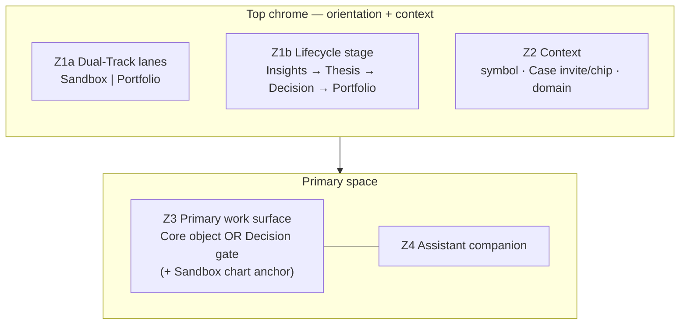
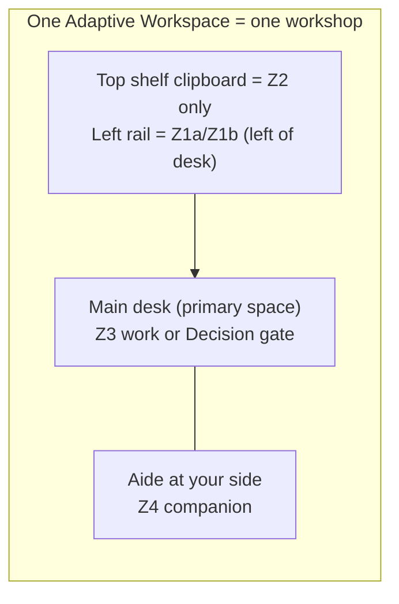
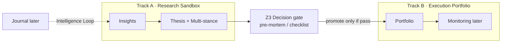
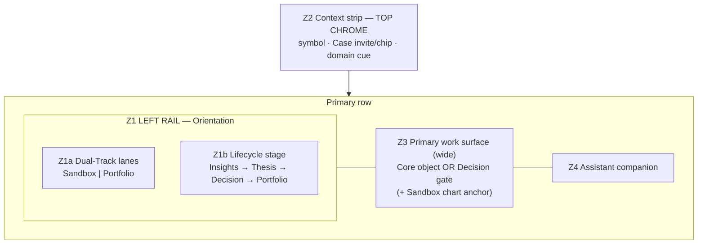
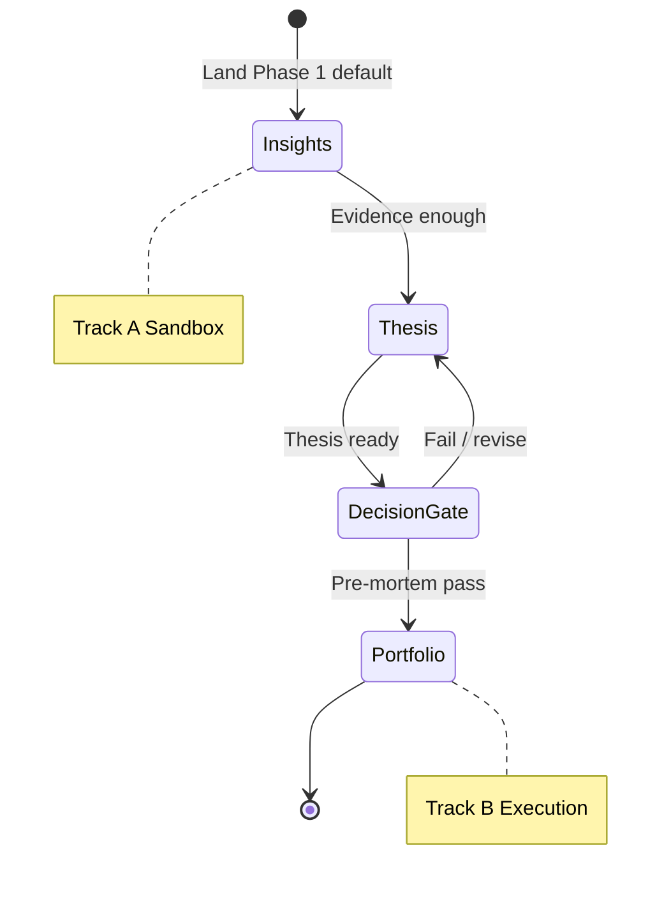
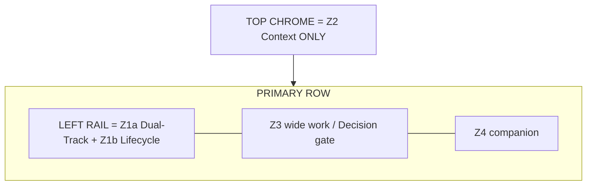

# Conceptual Information Architecture Map
## DP Stock-Investment Assistant

| Field | Value |
|-------|-------|
| Parent | [`PRODUCT_SPECIFICATION.md`](./PRODUCT_SPECIFICATION.md) (SSOT) |
| Version | v0.6.0|
P26-09-23|
| Status | Draft · Layout FINAL lock 2026-09-23: Z2 top chrome; Z1 left of Z3; Z3+Z4 primary; Sandbox chart #5 FINALIZED|
| Phase focus | Phase 1 skeleton path per Spec §0.4 |

> **Purpose.** Show what the product *looks like* as information architecture: surfaces, domains, Dual-Track, Case-off/on, and journeys — derived only from the Product Specification.  
> **Not this doc:** FE stack, routes, components, APIs, or pixel UI.

**How to read this doc:** Zones (§2) = rooms in one workshop. Domain matrix (§3) = which work lives in which room. §7 = the same rooms drawn once so wireframes share one target.

---

## 1. Purpose and scope

### In scope
- Adaptive Workspace anatomy (conceptual zones)
- Investment Core domains → surfaces
- Dual-Track Workspace (Research Sandbox vs Execution Portfolio)
- Multi-stance Thesis (Bull/Bear) as Thesis capability, not Dual-Track
- Investment Case as optional linking thread
- Phase 1 journeys for Hybrid Techno-Fundamental Investor (primary), with Active Retail / Learning as variants

### Out of scope (Phase 1 IA)
- Behavioral Mentor / deep risk coaching
- Full Generative UI artifact zoo
- Proactive LTM / autonomy
- Full 360° knowledge graph / community
- Implementation choices (bundler, libraries, layout engines)

**Gate (from Spec §0.4):** Does this surface make Insights → Thesis → Decision → Portfolio more completable and understandable for a Vietnamese retail user in this phase?

---

## 2. Workspace anatomy (conceptual zones)

Zones are **conceptual regions of the Adaptive Workspace** — places where a kind of work or orientation lives. They are **not** screens, routes, or UI components. Think **rooms in one workshop**, not pages in an app.

Same Z1–Z4 for Case-off and Case-on. Case only binds a narrative thread; it does not invent a second layout.

### 2.1 Zone map (overview)



```text
Adaptive Workspace
├── TOP CHROME
│       Z2  Context ONLY (symbol · Case invite/chip · domain cue)
│       — prior top-chrome Z1+Z2 SUPERSEDED 2026-09-23
└── PRIMARY ROW
        Z1  LEFT RAIL (left of Z3) — Orientation region
        │     Z1a Dual-Track lanes: Sandbox | Portfolio (both visible)
        │     Z1b Lifecycle stage: Insights → Thesis → Decision → Portfolio
        Z3  Primary work surface (wide) — Core object OR Decision gate
        │     Sandbox: docked price-chart market anchor (FINALIZED)
        Z4  Assistant companion (helps; never replaces Core)
```

### 2.2 What each zone is for

#### Z1 — Orientation (split into two cues on purpose)

| Sub-zone | Spec concept | Role |
|----------|--------------|------|
| **Z1a Dual-Track lanes** | Dual-Track Workspace | Always show **Research Sandbox \| Execution Portfolio**. One lane active (emphasized); the other stays visible so users do not forget which risk world they are in. Exploration must not silently change official portfolio risk. |
| **Z1b Lifecycle stage** | Investment Lifecycle | Separate cue for **where you are on the path** Insights → Thesis → Decision → Portfolio. Same *region* as Z1a, different *meaning* — **track ≠ stage**. |

**Why split Z1a and Z1b:** Bundling them into one control makes people confuse “I’m in Sandbox” with “I’m on Thesis.” Dual-Track answers *where risk may live / when promotion is allowed*. Lifecycle answers *which Core step you are on*.

**Locked lean:** Two lanes **visible at once** (not modes that hide the other track). Dual-Track is a continuous workload paradigm.

#### Z2 — Context strip

Answers “**what am I working on right now?**”: symbol/instrument, Case invite or Case chip, which Core domain is active. Thin strip; does not hold the main work.

**Locked lean:** Subtle **always-available** Case invite when Case-off (“Bind to Case…”) — optional but recommended, not Case-discouraged.

#### Z3 — Primary work surface

Where Core **meaning** is created and edited: Insight, Living Thesis (Multi-stance lives *inside* Thesis), Portfolio view — or **Decision as an explicit gate surface** when promoting Sandbox → Portfolio. This is the “desk,” not the chat.

**Locked lean:** Decision is an **explicit promotion gate** between Track A and Track B (not merely a state of Thesis).

**Sandbox Z3 price-chart — FINALIZED (2026-09-23):** On Track A Research Sandbox, Z3 includes a **docked price-chart market anchor** sharing the desk with the active Core object (Insights / Thesis + Multi-stance).

- **Why:** Ground the **whole Investment Case picture on the price chart** — one desk, market reality visible while evidence and thesis are edited.
- **What it is:** Platform / Data exploratory charting (Spec Dual-Track Track A) — a **docked strip/panel**, not a Core domain and not a lifecycle stage.
- **Case-off / Case-on:** Same chart composition; Case only binds the thread (invite vs chip in Z2).
- **Decision gate:** Chart **yields** (collapse or thin reference) so the checklist owns Z3 attention.
- **Track B Portfolio:** This chart-anchor rule does **not** auto-apply (execution context may differ; optional later).
- **Not this lock:** Chart library, FE stack, or pixels.


#### Z4 — Assistant companion

Helps explain, draft, or retrieve — **never replaces** Core objects. If Z4 becomes the whole product, the IA has slid back to chat-as-product.


### 2.2a Layout lock (**FINAL** · Phan 2026-09-23)

**Top chrome:** **Z2 Context ONLY** (symbol / Case invite or chip / domain cue). Top chrome does **not** include Z1.

**Left sidebar (left of Z3):** **Z1 Dual-Track + Lifecycle** — Z1a Dual-Track lanes + Z1b Lifecycle stage as two readable cues in one left rail.

**Primary space:** **Z3 (wide)** + **Z4 (companion)** unchanged — Z3 is the work desk (or Decision gate); Z4 is the assistant companion.

Zone *meanings* are unchanged; only spatial stacking changes. Prior lock “top chrome Z1a+Z1b+Z2” is **superseded** (2026-09-23).


### 2.3 Rooms metaphor (one glance)



---

## 3. Domain → surface matrix

Section 2 defines the **rooms**. Section 3 assigns **which Investment Core work lives in which room** (and which Dual-Track home), for Phase 1.

### 3.1 Placement matrix

| Investment Core domain | Default Dual-Track home | Primary zone | Case-off | Case-on | Phase |
|------------------------|-------------------------|--------------|----------|---------|-------|
| **Insights** | Track A Research Sandbox | Z3 | Free-standing insights with provenance | Insights linked into Case thread | **Phase 1** |
| **Thesis + Principles** (Living Thesis, **Multi-stance**) | Track A (draft) → promote with Decision | Z3 | Thesis without Case | Thesis bound to Case narrative | **Phase 1** |
| **Decision** (+ checklist / pre-mortem) | **Explicit gate** between Track A and Track B | Z3 (gate surface) | Decision without Case | Decision advances Case lifecycle | **Phase 1** |
| **Portfolio** (Execution) | Track B Execution Portfolio | Z3 | Portfolio positions without Case | Positions / actions linked to Case | **Phase 1** |
| **Monitoring** | Track B (live risk) | Z3 stub | Later | Later | **Later** |
| **Journal** | Closes Intelligence Loop | Z3 stub | Later | Later | **Later** |

| Platform capability | Zone | Phase |
|---------------------|------|-------|
| Workspace orientation & context preservation | Z1–Z2 | **Phase 1** |
| Data / Information (evidence, provenance) | Feeds Z3 Insights | **Phase 1** (foundation) |
| AI Assistant companion | Z4 | **Phase 1** (companion only) |
| Memory / proactive mentor | — | **Later** |

### 3.2 Domain flow across tracks (visualization)



**Reading tip:** Multi-stance (Bull/Bear) sits **inside Thesis**, not as a Dual-Track lane. Dual-Track is Sandbox vs Portfolio only.

### 3.3 Why this placement

| Domain | Home track | Main zone | Why |
|--------|------------|-----------|-----|
| Insights | Sandbox (A) | Z3 | Evidence work; provenance first-class |
| Thesis (+ Multi-stance) | Sandbox (A), then promote | Z3 | Reasoning lives here; Bull/Bear ≠ Dual-Track |
| Decision | Gate A→B | Z3 as gate | Pre-mortem / checklist before Portfolio risk |
| Portfolio | Execution (B) | Z3 | Official holdings / sizing |
| Monitoring / Journal | Later | Z3 stub | Not Phase 1 center |

Platform bits: orientation/context → Z1–Z2; Data Hub feeds Insights in Z3; AI → Z4 only.

---

## 4. Case-off vs Case-on (one product)



| | Case-off | Case-on |
|--|----------|---------|
| **Same zones?** | Yes (Z1–Z4) | Yes |
| **Case in Z2** | Subtle always-available invite | Present; names the narrative thread |
| **Lifecycle** | Still Insights → … → Portfolio | Same path; objects optionally grouped |
| **Dual-Track** | Still enforced | Still enforced |
| **Must create Case to decide?** | **No** | Case links; never blocks Decision |

---

## 5. Canonical journeys (Phase 1)

### J1 — Hybrid Techno-Fundamental (primary)



1. Enter **Track A** with a Vietnam symbol / idea (Insight + evidence).  
2. Build **Living Thesis** with **Multi-stance** (Bull/Bear).  
3. Run **Decision / pre-mortem** checklist (**Z3 gate**).  
4. On pass, **promote** into **Track B** Portfolio (entry / size / stop intent).  
5. Optional: bind steps into an **Investment Case** thread at any time (Z2 invite → chip).

**Locked lean:** Default landing = **Insights**.

### J2 — Process-first Active Retail Investor (variant)
Same path; thicker Thesis/Decision writing; Case more often used as the narrative binder.

### J3 — Learning Investor (later bias)
Same skeleton; later add guidance / bias flags — not Phase 1 IA center.

---

## 6. Conceptual object inventory

| Object | Domain | Notes |
|--------|--------|-------|
| Insight | Insights | Evidence-bearing; provenance first-class |
| Living Thesis | Thesis + Principles | Versioned; holds Multi-stance views |
| Stance (Bull/Bear/…) | Thesis | Not Dual-Track |
| Principle | Thesis + Principles | Standing rules |
| Decision | Decision + Journal | Includes pre-mortem / checklist gate |
| Position / holding | Portfolio | Track B only for official risk |
| Investment Case | Linking | Optional thread across Core objects |
| Workspace context | Platform | Active track, symbol, domain, Case on/off |

---

## 7. What “the product looks like” (one picture)

Section 7 is **not a new design**. It is the **same zones from §2–§3 drawn once** so Step 3 wireframes share one target.

### 7.1 How §2 / §3 map onto the picture

| Picture region | Zone | Role in the drawing |
|----------------|------|---------------------|
| Top chrome | **Z2 only** | Context strip (symbol / Case invite or chip / domain cue) — not Z1 |
| Left sidebar (left of Z3) | **Z1a + Z1b** | Dual-Track lanes + Lifecycle in one left rail |
| Primary (wide) | **Z3** | Work surface or Decision gate (+ Sandbox chart anchor when applicable) |
| Primary (companion) | **Z4** | Assistant companion |
| Footer rule | Dual-Track honesty | Promote only via Decision gate |

If §2/§3 change (e.g. move Z1/Z2 stacking, merge Z1a/Z1b, or put Decision only inside Thesis), **this picture must change**. Wireframes should **prove this picture**, not invent a different zone map.

### 7.2 Composite ASCII (canonical)

```text
+==========================================================================+
| TOP CHROME — Z2 CONTEXT ONLY                                       Z2   |
| [symbol] [Case invite/chip] [domain cue]                                 |
+------------------+-----------------------------------+------------------+
| Z1 LEFT RAIL     | Z3 PRIMARY (wide)                 | Z4 COMPANION     |
| Z1a Dual-Track   | Core object OR Decision gate      | helps; never     |
| [Sandbox|Portf.] | Sandbox: + docked PRICE CHART     | replaces Core    |
| Z1b Lifecycle    | (whole Case picture on chart)     |                  |
| I → T → D → P    | Decision: chart YIELDS            |                  |
+------------------+-----------------------------------+------------------+
Promotion Sandbox → Portfolio only via Decision / pre-mortem gate
Sandbox Z3 price-chart lock FINALIZED (Phan 2026-09-23) — unchanged by this layout flip
```

### 7.3 Annotated mapping diagram



**One-liner:** Zones = stable product shape; §3 = domain placement on that shape; §7 = the shape drawn once so everyone draws the same product.

---

## 8. Open questions — locked for Step 3 *(Designer review 2026-09-22; layout FINAL 2026-09-23)*

| # | Question | Decision |
|---|----------|----------|
| 1 | Dual-Track as two modes vs two lanes visible at once? | **Two lanes visible at once** (Sandbox | Portfolio), active lane emphasized. Dual-Track is continuous workload, not a mode that hides the other track. |
| 2 | Default Phase 1 landing Insights vs Thesis? | **Insights** for Hybrid primary journey (lifecycle starts at research/evidence). |
| 3 | Case invite when Case-off? | **Subtle always-available invite** ("Bind to Case...") — optional but recommended; not Case-discouraged. |
| 4 | Decision as gate surface vs Thesis state? | **Explicit promotion gate surface** between Track A and Track B (keeps Spec pre-mortem hurdle sharp). |
| 5 | Price chart in Sandbox Z3? | **FINALIZED** — Docked market anchor on Track A Z3 beside active Core (Insights/Thesis + Multi-stance). **Rationale:** whole Investment Case picture grounded on the price chart (one desk). Same composition Case-off/on. Yields at Decision gate. Track B does not auto-apply. Not a Core domain/stage; not FE/pixels. |
| 6 | Where do Z1 / Z2 sit? | **FINAL lock (2026-09-23):** **Top chrome = Z2 Context ONLY.** **Left sidebar (left of Z3) = Z1a Dual-Track + Z1b Lifecycle** in one left rail. **Primary = Z3 (wide) + Z4 (companion).** Prior "top chrome Z1a+Z1b+Z2" is **superseded**. |

Step 3 raw wireframes must prove section 7 picture **plus** these locks: Z1 left rail (lanes + lifecycle as separate Z1 cues), Z2 top chrome only, Decision gate, Case invite, Insights landing on Hybrid journey, Sandbox Z3 chart-anchor composition (W2b/W3b).

**Step 3 frames:** [`CONCEPTUAL_WIREFRAMES.md`](./CONCEPTUAL_WIREFRAMES.md) — W1–W6 + W2b/W3b; Z2-top / Z1-left shell (v0.4.0).

---

## 9. Traceability

| IA element | Spec anchor |
|------------|-------------|
| SSOT / cut line / gate | section 0 |
| Personas | section 2.1 |
| Dual-Track / Multi-stance | section 2.2, 2.5 |
| Lifecycle | section 2.4, 4.5 |
| Domains & Case | section 4 |
| Phase 1 intent | section 0.4, 1.3, 5.3 |
| Shell layout (Z2 top / Z1 left / Z3+Z4) | section 0.5 Adaptive Workspace shape (spatial) |

---

*End of Conceptual IA Map · v0.6.0 · Layout FINAL Z2-top / Z1-left · Sandbox chart FINALIZED · 2026-09-23*
