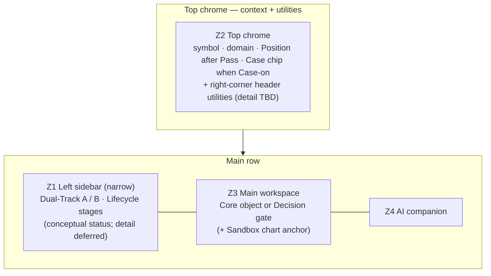
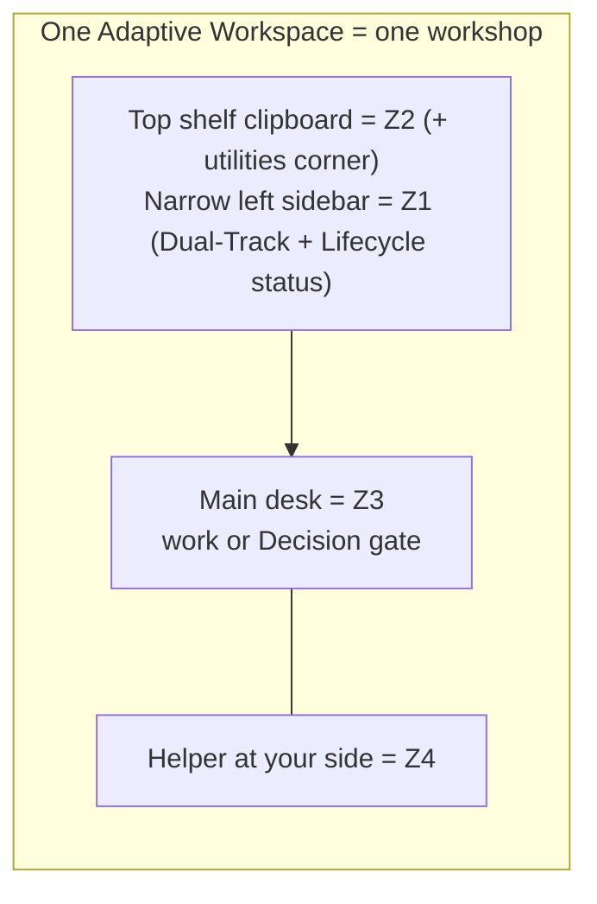
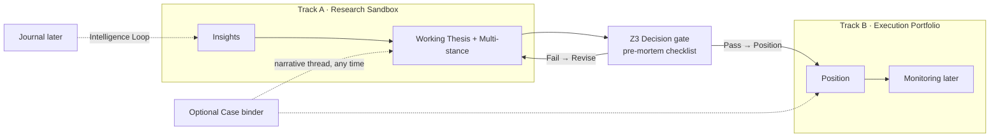
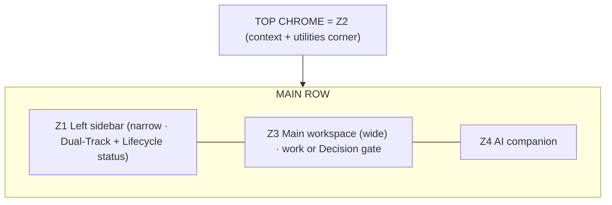

# Conceptual Information Architecture Map

| Field | Value |
|---|---|
| Document | Conceptual IA Map · DP Stock-Investment Assistant |
| Version | v1.0.0 |
| Date | 2026-09-25 |
| Status | Review · layout lock and ontology frozen |
| Owner | Phan Duy |
| Related | [Spec v1.7.0](./PRODUCT_SPECIFICATION.md) · [Journeys v1.0.0](./USER_JOURNEYS_WITH_WIREFRAMES.md) · `frames.json` → Figma (Journeys v1.0.0) |

> **Purpose.** Show what the product looks like as information architecture: zones, domain placement, Dual-Track, and where the Working Thesis, the Position and the optional Investment Case appear. Derived only from the Spec.  
> **Not this doc:** FE stack, routes, components, APIs, or pixel UI.

Terms follow Spec §0.2 (glossary); the object ontology is Spec §4.6. This doc owns the zones (§2), the layout lock (§2.6) and domain placement (§3).

**How to read this doc.** Zones (§2) are the rooms of one workshop. Placement (§3) says which work lives in which room. §7 draws the rooms once so every frame shares one target.

---

## 1. Purpose and scope

### 1.1 In scope

- Adaptive Workspace anatomy (conceptual zones Z1–Z4)
- Investment Core domains → zones
- Dual-Track: Track A · Research Sandbox and Track B · Execution Portfolio
- Multi-stance (Bull/Bear) as a Thesis capability, not a Dual-Track lane
- Where Decision gate outcomes show up (Pass → Position; Fail → Revise, no Position; Spec §4.6)
- The optional Investment Case as a binder overlay (Case-on / Case-off)
- Persona coverage for Phase 1 (§5; journeys live in Journeys v1.0.0)

### 1.2 Out of scope (Phase 1 IA)

- Behavioral Mentor and deep risk coaching
- Full Generative UI artifact set
- Proactive long-term memory and autonomy
- Full 360° knowledge graph and community
- Implementation choices (bundler, libraries, layout engines)

**Gate** (Spec §0.4): does this surface make Insights → Thesis → Decision → Portfolio more completable and understandable for a Vietnamese retail user in this phase?

---

## 2. Workspace zones

Zones are conceptual regions of the Adaptive Workspace, places where a kind of work or orientation lives. They are not screens, routes or UI components: think rooms in one workshop, not pages in an app. The same Z1–Z4 serve Working Thesis research and post-Pass Position work; the Investment Case is an overlay and never adds a second layout.

**Canonical zone names:** Z1 Left sidebar · Z2 Top chrome · Z3 Main workspace · Z4 AI companion.

### 2.1 Zone map



```text
Adaptive Workspace
├── TOP CHROME
│       Z2  Top chrome: symbol · domain cue · Position after Pass · Case chip when Case-on
│           + right-corner header utilities slot (search · notifications · account; detail TBD)
└── MAIN ROW
        Z1  Left sidebar (left of Z3): one narrow zone; conceptual status groups
        │     Dual-Track (Track A / Track B) · Lifecycle (Insights · Thesis · Decision · Portfolio)
        Z3  Main workspace (wide): Core object or Decision gate
        │     Sandbox: docked price-chart market anchor (§2.4)
        Z4  AI companion: helps; never replaces Core objects
```

### 2.2 Z1 · Left sidebar

One zone left of Z3, with no sub-zones, at 2/3 of its earlier width (the freed width goes to Z3 + Z4). It shows two conceptual status groups:
- **Dual-Track:** Track A · Research Sandbox and Track B · Execution Portfolio, active track marked. Both tracks always exist (continuous workload, not a mode); exploration never silently changes official Portfolio risk.
- **Lifecycle:** the 4 workspace stages Insights · Thesis · Decision · Portfolio, current stage marked (Spec §4.5 maps these to the 6-stage product lifecycle; Monitoring and Journal come later).

Track ≠ stage. These are status cues, not clickable chips; stage moves use Z3 CTA buttons (for example **Continue to Working Thesis**, **Go to Decision gate**). Detailed sidebar design is deferred.

### 2.3 Z2 · Top chrome

Answers "what am I working on right now?": symbol or instrument, active Core domain, the Position cue after Pass, and the Case chip only when Case-on. It is a thin strip and never holds the main work. The right corner is reserved for header utilities (search, notifications, account; detail TBD). Research never requires a Case; the Case chip reflects binder state, not a Pass result.

### 2.4 Z3 · Main workspace

Where Core meaning is created and edited: the Insight, the Working Thesis (with Multi-stance inside it), the Position on Portfolio, or the Decision gate as an explicit promotion surface between Track A and Track B (not a state of the Thesis).

**Sandbox chart lock** (finalized 2026-09-23): on Track A · Research Sandbox, Z3 includes a docked price-chart market anchor that shares the workspace with the active Core object (Insights, or the Working Thesis with Multi-stance).
- **Why:** ground the whole research and thesis picture on the price chart, so market reality stays visible while evidence and the Thesis are edited.
- **What it is:** exploratory charting (Spec §2.5, Track A), a docked strip or panel; not a Core domain and not a Lifecycle stage.
- **Decision gate:** the chart yields (collapses or thins) so the checklist owns Z3; named levels travel on Pass into the Position.
- **Track B:** the rule does not auto-apply (execution context may differ; optional later).
- **Not this lock:** chart library, FE stack or pixels.

### 2.5 Z4 · AI companion

Helps explain, draft or retrieve; never replaces Core objects. If Z4 becomes the whole product, the IA has slid back to chat-as-product.

### 2.6 Layout lock (normative)

Locked by Phan 2026-09-23; simplified in v0.9.0 and v0.9.1 (2026-09-25). This is the only normative statement of the shell; other sections and docs point here.

1. **Top chrome = Z2** (context + right-corner header utilities slot). Top chrome never includes Z1.
2. **Z1 Left sidebar** sits left of Z3: one zone, no sub-zones, 2/3 of its earlier width, showing conceptual Dual-Track and Lifecycle status (§2.2). Detailed design deferred.
3. **Z3 Main workspace (wide) + Z4 AI companion** take the width freed from Z1.
4. Stage moves use Z3 CTAs; Z1 has no hotspots.

History: the 2026-09-23 lock changed stacking only (the prior "top chrome Z1+Z2" is superseded); v0.9.0 and v0.9.1 changed Z1's width and content (single sidebar, then the conceptual groups). See §10.

### 2.7 Workshop metaphor (one glance)



---

## 3. Domain → zone placement

§2 defines the rooms; §3 assigns which Investment Core work lives in which room, and its Dual-Track home, for Phase 1.

### 3.1 Placement matrix

| Investment Core domain | Default Dual-Track home | Main zone | Pre-Pass (Working Thesis research) | After Pass (Position) | Phase |
|---|---|---|---|---|---|
| **Insights** | Track A · Research Sandbox | Z3 | Free-standing Insights with provenance | Insights may be linked into a Case | **Phase 1** |
| **Thesis + Principles** (Working Thesis, Multi-stance) | Track A (draft), promoted via the Decision gate | Z3 | Working Thesis, no Position | Thesis attaches as "why we hold"; optional Case link | **Phase 1** |
| **Decision** (+ pre-mortem checklist) | Explicit gate between Track A and Track B | Z3 (gate surface) | Gate, no Position yet | Pass creates the Position; Fail → Revise the Working Thesis | **Phase 1** |
| **Portfolio** (Position) | Track B · Execution Portfolio | Z3 | None (no Position before Pass) | Position (size, stop, official book) | **Phase 1** |
| **Monitoring** | Track B (live risk) | Z3 stub | Later | Later | **Later** |
| **Journal** | Closes the Intelligence Loop | Z3 stub | Later | Later | **Later** |
| **Investment Case** (optional binder) | Cross-core narrative | Z2 chip when Case-on | Can start any time (often at Thesis) | The Position may join an existing Case; optional | **Phase 1** (thin) |

| Platform capability | Zone | Phase |
|---|---|---|
| Workspace orientation and context preservation | Z1–Z2 | **Phase 1** |
| Data / Information (evidence, provenance) | Feeds Insights in Z3 | **Phase 1** (foundation) |
| AI companion | Z4 | **Phase 1** (companion only) |
| Memory / proactive mentor | — | **Later** |

### 3.2 Domain flow across tracks



**Reading tip.** Multi-stance (Bull/Bear) sits inside the Thesis, not as a Dual-Track lane; Dual-Track is Sandbox vs Portfolio only. The Case is an optional binder, not a track and not the Position.

### 3.3 Why this placement

| Domain | Home track | Main zone | Why |
|---|---|---|---|
| Insights | Sandbox (A) | Z3 | Evidence work; provenance first-class |
| Working Thesis (+ Multi-stance) | Sandbox (A), then promoted | Z3 | Reasoning lives here; Bull/Bear ≠ Dual-Track; Thesis ≠ Position |
| Decision | Gate A → B | Z3 as gate | Pre-mortem checklist; Pass creates the Position |
| Portfolio / Position | Execution (B) | Z3 | Official holdings, sizing, stop |
| Investment Case | Optional binder | Z2 chip when Case-on | Narrative dossier across Core objects, not execution |
| Monitoring / Journal | Later | Z3 stub | Not the Phase 1 center |

Platform: orientation and context → Z1–Z2; Data Hub feeds Insights in Z3; AI → Z4 only.

---

## 4. Zone cues: Working Thesis · Position · Case

Rules for what each object is and when it exists are in Spec §4.6. This table only shows how the zones reflect them.

| | Working Thesis (Sandbox research) | After Pass (Position) | Optional Case binder |
|---|---|---|---|
| **Same zones?** | Yes (Z1–Z4) | Yes | Overlay (chip / thread) |
| **Z2 cue** | Symbol + domain; no Position | Position cue | Case chip only when Case-on |
| **What exists?** | Insights and/or the Working Thesis | Position (size, stop, book) + Thesis as why we hold | Narrative binder across objects |
| **Dual-Track** | Still enforced | Still enforced | Does not collapse Dual-Track |
| **When?** | Pre-Pass research | Only after a Decision gate Pass | Any time (often at Thesis); never required |

---

## 5. Persona coverage

Journeys and their IDs live in [Journeys v1.0.0](./USER_JOURNEYS_WITH_WIREFRAMES.md); this section only records which personas they cover (personas per Spec §0.3).

| Persona | Coverage in Phase 1 |
|---|---|
| Techno-Fundamental Investor (TFI, primary) | Journeys J-TFI-1 (Pass → Position) and J-TFI-2 (Fail → Revise), default landing Insights |
| Active Retail Investor (process variant) | Same path, no separate journey; heavier Thesis and Decision writing and more Case use |
| Learning Investor (later) | Same skeleton, no journey yet; guidance and bias flags come later |

---

## 6. Conceptual object inventory

| Object | Domain | Notes |
|---|---|---|
| Insight | Insights | Evidence-bearing; provenance first-class |
| Working Thesis / Thesis | Thesis + Principles | Versioned reasoned argument with Multi-stance; Working Thesis before Pass, Thesis (why we hold) after |
| Stance (Bull / Bear / …) | Thesis | Not Dual-Track |
| Principle | Thesis + Principles | Standing rules |
| Decision | Decision + Journal | Includes the pre-mortem checklist gate |
| **Position** / holding | Portfolio | Born at a Decision gate Pass; Track B official risk (size, stop, book) |
| **Investment Case** | Optional narrative binder | Dossier thread across Core objects; any time; not born at Pass; not the Position |
| Workspace context | Platform | Active track, symbol, domain, Position on/off, Case-on / Case-off |

---

## 7. What the product looks like (one picture)

§7 is not a new design; it draws the zones of §2–§3 once so every frame shares one target. Frame layout and on-frame text are owned by `frames.json` / Figma (precedence: Journeys §1.2).

### 7.1 How §2 and §3 map onto the picture

| Picture region | Zone | Role in the drawing |
|---|---|---|
| Top chrome | Z2 | Context + utilities slot (§2.3) |
| Left sidebar | Z1 | Conceptual Dual-Track + Lifecycle status (§2.2) |
| Main workspace (wide) | Z3 | Core object or Decision gate, with the Sandbox chart anchor when applicable (§2.4) |
| AI companion | Z4 | Helper (§2.5) |
| Footer rule | Dual-Track honesty | Promotion only via the Decision gate → Position |

Layout per §2.6. If §2 or §3 change, this picture must change; frames prove this picture and never invent a different zone map.

### 7.2 Canonical picture (W1 shell)


Snapshot release journey-v1.0.0 (2026-09-25); the [Live Figma page](https://www.figma.com/design/Jy1qyQeJJT1gaQVar8KJLd/?node-id=0-1) may be ahead. Rules carried by the picture: promotion Sandbox → Portfolio only via the Decision gate (Pass → Position); the Sandbox chart lock (§2.4); the Case is an optional binder, not born at Pass.

### 7.3 Annotated mapping



**One-liner.** Zones = stable product shape; §3 = domain placement on that shape; §7 = the shape drawn once so everyone draws the same product.

---

## 8. Decision log (resolved)

All IA questions are decided. New questions go in an "Open questions" list here when they arise.

| # | Question | Decision | Date |
|---|---|---|---|
| 1 | Dual-Track as two modes, or two lanes visible at once? | Two lanes at once (Sandbox / Portfolio), active lane emphasized; continuous workload, not a mode. Shown as the Dual-Track group in Z1 (§2.2). | 2026-09-22 (Z1 group 2026-09-25) |
| 2 | Default Phase 1 landing: Insights or Thesis? | Insights, for the TFI primary journey (the Lifecycle starts at evidence). | 2026-09-22 |
| 3 | What does Pass create? What is a Case? | Pass creates a Position; Fail → Revise, no Position; the Case is an optional binder. Normative text: Spec §4.6. | 2026-09-24 |
| 4 | Decision as a gate surface, or a Thesis state? | Explicit promotion gate surface between Track A and Track B. | 2026-09-22 |
| 5 | Price chart in Sandbox Z3? | Yes: the Sandbox chart lock (§2.4). | 2026-09-23 |
| 6 | Where do Z1 and Z2 sit? | Layout lock (§2.6). | 2026-09-23 (simplified 2026-09-25) |

Frames and journeys that prove §7 and these decisions: [Journeys v1.0.0](./USER_JOURNEYS_WITH_WIREFRAMES.md) (J-TFI-1 / J-TFI-2; W1–W6, W2b, W3b).

---

## 9. Traceability

| IA element | Spec anchor |
|---|---|
| Source of truth, cut line, gate | Spec §0, §0.4 |
| Glossary (zones, tracks, Thesis terms, Case-on / Case-off) | Spec §0.2 |
| Personas | Spec §0.3, §2.1 |
| Dual-Track / Multi-stance | Spec §2.2, §2.5 |
| Lifecycle (6 product stages ↔ 4 workspace stages) | Spec §2.4, §4.5 |
| Decision gate and object ontology | Spec §4.6 |
| Domains, Position, Case binder | Spec §4 |
| Phase 1 intent | Spec §0.4, §1.3, §5.3 |
| Shell layout (pointer back to §2.6) | Spec §0.5 |

---

## 10. Change log

| Version | Date | Change |
|---|---|---|
| v1.0.0 | 2026-09-25 | Cleanup release. Canonical zone names (Z1 Left sidebar, Z2 Top chrome, Z3 Main workspace, Z4 AI companion) and track names. Zones renumbered §2.2–§2.7 with one normative layout lock (§2.6); Z2 described as context + utilities. Lifecycle shown as the 4 workspace stages (Spec §4.5 maps them). Ontology replaced by a pointer to Spec §4.6. §5 persona journeys replaced by a persona-coverage table (no J1–J3 IDs). §7.2 ASCII composite replaced by the W1 snapshot. §8 retitled "Decision log (resolved)" with dates. Traceability updated to Spec v1.7.0. Uniform header. |
| v0.9.1 | 2026-09-25 | Z1 stays one narrow sidebar but conceptually groups Dual-Track and Lifecycle as status; stage moves via Z3 buttons. |
| v0.9.0 | 2026-09-25 | Layout simplification: Z1a (Dual-Track) and Z1b (Lifecycle) merged into one Z1 Left sidebar at 2/3 width; freed space to Z3 + Z4; Z2 utilities slot. |
| v0.8.2 | 2026-09-24 | Freeze: Pass → Position; Case = optional binder; Working Thesis; layout final (Z2 top, Z1 left). |

---

*End of Conceptual IA Map · v1.0.0 · 2026-09-25*
