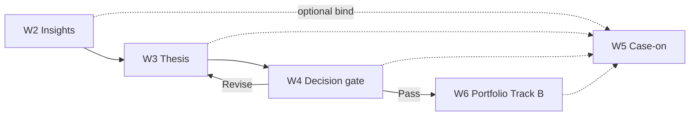

# Conceptual Wireframes (Phase 1)
## DP Stock-Investment Assistant

| Field | Value |
|-------|-------|
| Parent | [`CONCEPTUAL_IA_MAP.md`](./CONCEPTUAL_IA_MAP.md) v0.6.0 · [`PRODUCT_SPECIFICATION.md`](./PRODUCT_SPECIFICATION.md) |
| Version | v0.4.0 |
| Date | 2026-09-23 |
| Status | Draft v0.4.0 — **Layout FINAL:** Z2 top chrome; Z1 left of Z3; primary Z3+Z4; W1–W6 + W2b/W3b; Sandbox chart FINALIZED |
| Journey | Hybrid Techno-Fundamental (default) |

> **Purpose.** Prove Adaptive Workspace IA with boxes and labels only.  
> **Not this doc:** Pixel UI, components, routes, FE stack, Gen-UI widgets, Mentor.

### Locked cues (every frame)
1. **Top chrome = Z2 Context ONLY** (not Z1)  
2. **Left sidebar (left of Z3) = Z1a Dual-Track + Z1b Lifecycle** — two cues, one rail  
3. **Primary = Z3 (wide) + Z4 (companion)**  
4. Land **Insights** (W2) · **Decision** = explicit gate (W4)  
5. Case invite → chip (W2/W5) · Case never required for Decision  
6. **Z4** companion only · Multi-stance inside Thesis only (W3/W3b)  
7. **Sandbox Z3 FINALIZED:** docked price-chart anchor + active Core (W2b/W3b) so the Investment Case is viewed on the price chart; same Case-off/on; yields at Decision (W4); Track B does not auto-apply  

*Prior locked cue “top chrome Z1a+Z1b+Z2” is **superseded** (2026-09-23).*

### Frame index
| ID | Frame | Proves |
|----|--------|--------|
| W1 | Empty shell | Z2 top · Z1 left rail · Z3+Z4 primary anatomy |
| W2 | Case-off · Insights landing | Hybrid default landing · Track A |
| W2b | Insights + chart strip | Sandbox Z3 chart-anchor composition (FINALIZED) |
| W3 | Thesis + Multi-stance | Bull/Bear ≠ Dual-Track |
| W3b | Thesis + chart strip | Chart anchor with Multi-stance Core (FINALIZED) |
| W4 | Decision gate | Promotion A→B · chart yields |
| W5 | Case-on · same shell | One product; chip + links |
| W6 | Portfolio after promote | Track B active; Sandbox still visible |

---
## W1 — Empty Adaptive Workspace shell
**Proves:** Z2 top chrome; Z1 left rail left of Z3; primary Z3+Z4; Dual-Track both visible; Case invite; Z4 companion not product

Empty shell only — no Core object yet.

```text
+==========================================================================+
| TOP CHROME — Z2 CONTEXT ONLY                                       Z2   |
| [sym] [Bind to Case...] [dom:—]                                          |
+------------------+-----------------------------------+------------------+
| Z1 LEFT RAIL     | Z3 PRIMARY (wide)                 | Z4 COMPANION     |
| Z1a Dual-Track   | ( empty desk )                    | (empty aide)     |
| [Sandbox | Portf | Place Core work here              | Helps; does not  |
| both visible     |                                   | replace Core     |
|                  |                                   | objects          |
| Z1b Lifecycle    |                                   |                  |
| Z1b I→T→D→P      |                                   |                  |
+------------------+-----------------------------------+------------------+
```

---
## W2 — Case-off · Insights landing (Hybrid default)
**Proves:** Phase 1 lands on Insights; Track A Sandbox active; Case invite; evidence in Z3; Z2 top / Z1 left layout

```text
+==========================================================================+
| TOP CHROME — Z2 CONTEXT ONLY                                       Z2   |
| [VNM] [Bind to Case...] [Insights]                                       |
+------------------+-----------------------------------+------------------+
| Z1 LEFT RAIL     | Z3 PRIMARY (wide)                 | Z4 COMPANION     |
| Z1a Dual-Track   | * INSIGHT (active)                | "Summarize FOL & |
| [SANDBOX*| Portf | +-------------------------------+ |  foreign flow fo |
| both visible     | | Evidence / cards              | |  VNM..."         |
|                  | | Provenance strip              | |                  |
| Z1b Lifecycle    | +-------------------------------+ | (draft / explain |
| Z1b [I] T D P    | Next: build Thesis when ready     |                  |
+------------------+-----------------------------------+------------------+
```

---
## W2b — Insights + price chart anchor (Sandbox)
**Proves:** Sandbox Z3 = docked price chart + Insight Core; Z2 top chrome; Z1 left rail; chart not Core domain

*Rationale (locked): whole Investment Case in view of the price chart. Case-off/on = same chart; Case only binds thread.*

```text
+==========================================================================+
| TOP CHROME — Z2 CONTEXT ONLY                                       Z2   |
| [VNM] [Bind to Case...] [Insights]                                       |
+------------------+-----------------------------------+------------------+
| Z1 LEFT RAIL     | Z3 PRIMARY (wide)                 | Z4 COMPANION     |
| Z1a Dual-Track   | +-- market anchor (docked) -----+ | "Mark levels tha |
| [SANDBOX*| Portf | | PRICE CHART  VNM              | |  matter for this |
| both visible     | +-------------------------------+ |  evidence..."    |
|                  | * INSIGHT (active Core)           |                  |
| Z1b Lifecycle    | | Evidence / cards + provenance | | (helps; chart is |
| Z1b [I] T D P    | Chart docks; Insight stays primar |  not the product |
+------------------+-----------------------------------+------------------+
```

---
## W3 — Thesis + Multi-stance (still Sandbox)
**Proves:** Living Thesis in Z3; Bull/Bear inside Thesis; still Track A; Z2 top / Z1 left layout

```text
+==========================================================================+
| TOP CHROME — Z2 CONTEXT ONLY                                       Z2   |
| [VNM] [Bind to Case...] [Thesis]                                         |
+------------------+-----------------------------------+------------------+
| Z1 LEFT RAIL     | Z3 PRIMARY (wide)                 | Z4 COMPANION     |
| Z1a Dual-Track   | * LIVING THESIS                   | "Contrast Bull v |
| [SANDBOX*| Portf | +---------------+---------------+ |  Bear catalysts. |
| both visible     | | BULL stance   | BEAR stance   | |                  |
|                  | | claims / evid | claims / evid | |                  |
| Z1b Lifecycle    | +---------------+---------------+ |                  |
| Z1b I [T] D P    | Multi-stance != Dual-Track lanes  |                  |
+------------------+-----------------------------------+------------------+
```

---
## W3b — Thesis + Multi-stance + price chart anchor (Sandbox)
**Proves:** Chart market anchor + Thesis Core; Multi-stance inside Thesis; Z2 top / Z1 left layout

*Same lock as W2b: one desk grounded on price; Multi-stance stays inside Thesis. Chart yields at Decision.*

```text
+==========================================================================+
| TOP CHROME — Z2 CONTEXT ONLY                                       Z2   |
| [VNM] [Bind to Case...] [Thesis]                                         |
+------------------+-----------------------------------+------------------+
| Z1 LEFT RAIL     | Z3 PRIMARY (wide)                 | Z4 COMPANION     |
| Z1a Dual-Track   | +-- market anchor (docked) -----+ | "Contrast Bull v |
| [SANDBOX*| Portf | | PRICE CHART  VNM              | |  Bear at these   |
| both visible     | +-------------------------------+ |  prices..."      |
|                  | * LIVING THESIS (active Core)     |                  |
| Z1b Lifecycle    | | BULL stance  | BEAR stance    | |                  |
| Z1b I [T] D P    | Chart docks; Thesis stays primary |                  |
+------------------+-----------------------------------+------------------+
```

---
## W4 — Decision gate (promotion A→B)
**Proves:** Explicit Z3 Decision gate; chart yields; Sandbox until Pass; Z2 top / Z1 left layout

Sandbox chart-anchor **yields** here: checklist owns Z3; chart at most a thin reference strip.

```text
+==========================================================================+
| TOP CHROME — Z2 CONTEXT ONLY                                       Z2   |
| [VNM] [Bind to Case...] [Decision·GATE]                                  |
+------------------+-----------------------------------+------------------+
| Z1 LEFT RAIL     | Z3 PRIMARY (wide)                 | Z4 COMPANION     |
| Z1a Dual-Track   | * DECISION / PRE-MORTEM GATE      | "Walk checklist  |
| [SANDBOX*| Portf | [ ] Invalidation named            |  against Thesis… |
| both visible     | [ ] Size / stop intent            |                  |
|                  | [ ] Evidence sufficient           |                  |
| Z1b Lifecycle    | [ Pass → promote ]  [ Revise ]    |                  |
| Z1b I T [D] P    | Portfolio risk unchanged until Pa |                  |
+------------------+-----------------------------------+------------------+
```

*Case-on Decision = same gate as W4 with Case chip in Z2; Case never blocks or replaces the gate.*

---
## W5 — Case-on · same shell
**Proves:** Same Z1–Z4; Case chip replaces invite; objects linked by thread; Dual-Track + lifecycle unchanged; Case never blocks Decision

```text
+==========================================================================+
| TOP CHROME — Z2 CONTEXT ONLY                                       Z2   |
| [VNM] [Case: VNM-2026-Q3…] [Thesis]                                      |
+------------------+-----------------------------------+------------------+
| Z1 LEFT RAIL     | Z3 PRIMARY (wide)                 | Z4 COMPANION     |
| Z1a Dual-Track   | * LIVING THESIS (linked)          | "Restate linked  |
| [SANDBOX*| Portf | same Thesis / Multi-stance UI     |  claims vs new   |
| both visible     | Case thread binds:                |  evidence..."    |
|                  |   Insight · Thesis · (later D/P)  |                  |
| Z1b Lifecycle    | Only Z2 chip + links differ vs Ca | (helps; does not |
| Z1b I [T] D P    |                                   |  replace Core)   |
+------------------+-----------------------------------+------------------+
```

---
## W6 — Portfolio after promote (Track B)
**Proves:** Track B emphasized; Sandbox lane still visible; lifecycle on Portfolio; Z2 top / Z1 left layout

W6 is drawn Case-on for journey continuity. Case stays optional after promote: Case-off Portfolio is the same Z3 with **Bind to Case...** in Z2 instead of the chip. Promotion != Case.

```text
+==========================================================================+
| TOP CHROME — Z2 CONTEXT ONLY                                       Z2   |
| [VNM] [Case: VNM-2026-Q3…] [Portfolio]                                   |
+------------------+-----------------------------------+------------------+
| Z1 LEFT RAIL     | Z3 PRIMARY (wide)                 | Z4 COMPANION     |
| Z1a Dual-Track   | * PORTFOLIO / POSITION INTENT     | "Restate stop &  |
| [Sandbox | PORTF | Holding / size / stop             |  pyramid rules.. |
| both visible     | Entry thesis link                 |                  |
|                  | Risk notes (official track)       |                  |
| Z1b Lifecycle    | Sandbox work preserved;           |                  |
| Z1b I T D [P]    | did not silently mutate risk befo |                  |
+------------------+-----------------------------------+------------------+
```

---

## Journey strip (W2→W6)



## Success check
A new reader can answer from these frames alone:
- That **top chrome is Z2 only** (Z1 is the left rail, left of Z3)
- Where Dual-Track lives vs lifecycle  
- That assistant is not the product  
- How Case-off vs Case-on differs  
- How Sandbox promotes to Portfolio  
- That Sandbox Z3 chart-anchor stays FINALIZED and yields at Decision  

---

*End of Conceptual Wireframes · v0.4.0 · W1–W6 + W2b/W3b · Layout FINAL Z2-top / Z1-left · chart FINALIZED · 2026-09-23*
