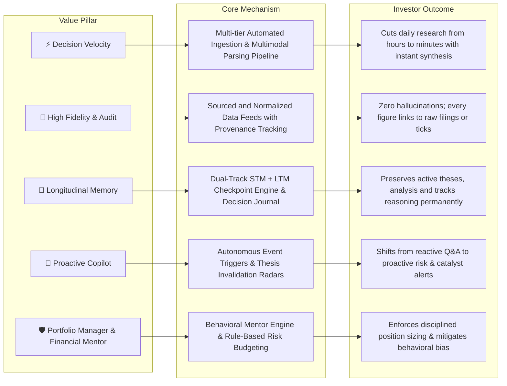
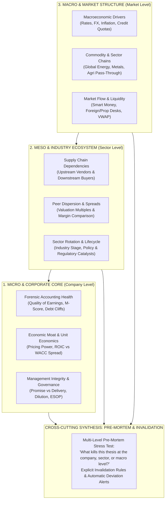
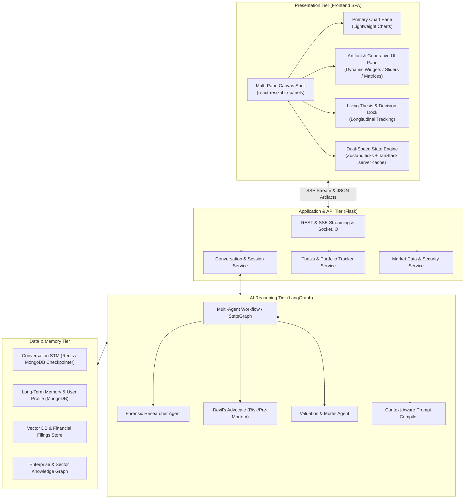

# DP Stock Investment Assistant — Product Vision and Core Capabilities

## Document Control

| Field | Value |
|---|---|
| Project | DP Stock Investment Assistant |
| Document Type | Master Product Vision & Core Capabilities Charter |
| Standards Stance | Aligned to ISO/IEC/IEEE 29148, ISO/IEC/IEEE 42010, arc42 §1, and C4 Model |
| Governance | Governed by the repository SDD methodology and [Documentation Methodology](../study-hub/project-documentation-and-specification-methodology.md) |
| Date | 2026-09-03 |
| Status | Approved Strategic Baseline |
| Audience | Engineering, Architecture, Product, Quantitative/Trading, and Documentation Stakeholders |

---

## 1. Executive Summary & Mission Statement

The **DP Stock-Investment Assistant** is an intelligent, visual financial workspace engineered as a **Cognitive Operating System** for **retail investors and active stock traders**.

Traditional retail stock tools force users into an exhausting cycle of data fragmentation, context switching across dozens of browser tabs, and emotional, undisciplined execution. The platform bridges this gap by combining automated multi-source data ingestion, multi-model AI reasoning, longitudinal decision memory, an interactive multi-pane visual canvas, and disciplined portfolio management and financial mentorship into a unified environment.

```
                                  PRODUCT VISION TOPOLOGY
   ┌───────────────────────────────────────────────────────────────────────────────────────┐
   │                          DP STOCK-INVESTMENT ASSISTANT                                │
   │                "Cognitive Operating System & Visual Workspace for Traders"            │
   └───────────────────────────────────┬───────────────────────────────────────────────────┘
                                       │
      ┌──────────────────┬─────────────┴───────────────┬──────────────────┐
      ▼                  ▼                             ▼                  ▼
┌──────────────┐  ┌──────────────┐             ┌──────────────┐   ┌──────────────┐
│  Multi-Tier  │  │ 360° Company │             │  Intelligent │   │  Long-Lived  │
│  Knowledge   │  │   Lenses     │             │Visual Canvas │   │Investment Hub│
│ Enrichment   │  │(Beyond FA/TA)│             │(Gen-UI & UX) │   │ & Thesis Log │
└──────────────┘  └──────────────┘             └──────────────┘   └──────────────┘
```

The platform's overarching mission is to transform retail investors from **reactive, fragmented data gatherers** into **systematic, well-informed, and psychologically disciplined decision-makers**.

---

## 2. Core Obstacles of Retail Investors & Strategic Value Pillars

### 2.1 The 5 Critical Obstacles of Retail Investing

1. **Severe Information Asymmetry**: Institutional funds access primary raw filings, direct corporate access, and terminal infrastructures ($25k+/year). Retail investors rely on secondary, delayed, and sensationally filtered press or social media noise.
2. **Context & Tab Fragmentation**: Investors navigate 15–20 disconnected applications and tabs (charting engines, financial statement disclosures, sell-side reports, news portals, community forums, personal spreadsheets, and brokerage execution screens), leading to severe cognitive fatigue.
3. **Single-Lens Myopia**: Most retail platforms force an artificial divide: purely technical analysis (price and indicators without business solvency checks) or purely fundamental analysis (accounting ratios without liquidity, timing, or flow context).
4. **Thesis Drift & Lack of Longitudinal Continuity**: Investments entered on a short-term catalyst frequently degrade into involuntary "bag-holding" when prices drop, because traditional tools maintain no persistent record of why a position was initiated or what conditions invalidate it.
5. **Emotional Biases & Undisciplined Execution**: Retail participants routinely fall victim to well-documented behavioral finance traps—the **Disposition Effect** (selling winners prematurely while riding losers indefinitely), **Hindsight Bias**, and **Loss Aversion**.

### 2.2 Strategic Value Pillars



---

## 3. Target Market Scope & Regulatory Microstructure

### 3.1 Primary Focus: Vietnam Equities (HOSE, HNX, UPCoM)
The platform is engineered **Vietnam-First** to resolve acute information and tooling voids in the Vietnamese stock market:
- **Regulatory & Accounting Standard**: Deep support for Vietnamese Accounting Standards (VAS / Circular 200) and the ongoing transition to Vietnamese Financial Reporting Standards (VFRS).
- **Exchange Microstructures**: Full modeling of local trading mechanisms:
  - T+2.5 settlement cycle.
  - Daily price fluctuation limits (+/- 7% HOSE, +/- 10% HNX, +/- 15% UPCoM).
  - Odd-lot and round-lot trading mechanics.
  - Foreign ownership limits (FOL / "hở room ngoại"), real-time foreign net flow, and proprietary trading desk (*tự doanh*) flow.
- **Regulatory Disclosures**: Ingestion of mandatory filings overseen by the State Securities Commission of Vietnam (UBCK / SSC), Hanoi Stock Exchange (HNX), and Ho Chi Minh City Stock Exchange (HOSE).

### 3.2 Extensible Architecture: Global / US Equities
The platform maintains an abstracted data and exchange adapter layer, enabling seamless future expansion into **US Markets (NYSE, NASDAQ)** and international equities with:
- SEC EDGAR integration (10-K, 10-Q, 8-K filings).
- Multi-currency (VND / USD) portfolio valuation.
- Fractional shares and continuous trading session rules.

---

## 4. Target Persona & Core Roles

### 4.1 Primary Persona: The Hybrid Techno-Fundamental Investor
The system is tailored for the **Hybrid Techno-Fundamental Investor** (often described as "Techno-Fundamental Compounder" or "Swing-to-Invest"):
- **Long-Term Business Conviction**: Grounded in durable competitive moats, pricing power, balance sheet solvency, and capital allocation discipline.
- **Tactical Technical Execution**: Utilizing market structure, Volume Spread Analysis (VSA), Wyckoff accumulation/distribution phases, Volume Profile / VWAP, and Stage Analysis (Minervini / O'Neil) to optimize entry pricing, pyramid winners, and enforce strict stop levels.

### 4.2 Integrated AI Roles: Portfolio Manager & Financial Mentor
Beyond standard research analysis, the assistant actively operates in two essential governance roles:

```
┌───────────────────────────────────────────────────────────────────────────────────────────────────┐
│                              INTEGRATED DUAL GOVERNANCE ROLES                                     │
├─────────────────────────────────────────┬─────────────────────────────────────────────────────────┤
│ 💼 AI PORTFOLIO MANAGER ROLE            │ 🧭 AI FINANCIAL MENTOR & BEHAVIORAL COACH               │
├─────────────────────────────────────────┼─────────────────────────────────────────────────────────┤
│ • Risk-budgeted position sizing (Kelly, │ • Pre-trade cognitive bias check (FOMO, Revenge Trading)│
│   fixed fractional, volatility parity). │ • Auditing "Process vs. Outcome"                        │
│ • Maximum portfolio drawdown guardrails.│ • Enforcing personal Investment Policy Statement (IPS)  │
│ • Sector and correlation exposure caps. │ • Automated post-mortem reviews on closed positions     │
│ • Cash reserve policy and liquidity.    │ • Habit tracking and emotional state logging            │
└─────────────────────────────────────────┴─────────────────────────────────────────────────────────┘
```

---

## 5. Continuous Workload Architecture: Dual-Track & Closed-Loop Lifecycle

The platform recognizes that investing is not an isolated transaction, but a continuous, long-lived operational discipline.

```
                    CONTINUOUS INVESTMENT LIFECYCLE ENGINE
┌─────────────────────────────────────────────────────────────────────────────────────────┐
│                                                                                         │
│       [1. IDEA GENERATION] ──► [2. DUE DILIGENCE 360°] ──► [3. LIVING THESIS BUILDER]   │
│        (Screening / Radar)        (Multi-Lens Audit)          (Core Case & Invalidation)│
│                 ▲                                                        │              │
│                 │                                                        ▼              │
│       [6. POST-MORTEM LOG] ◄── [5. THESIS DRIFT ALERT] ◄── [4. ACTIVE MONITORING]       │
│        (Biases & Lessons)         (Devil's Advocate)          (Quarterly Delta Checks)  │
│                                                                                         │
└─────────────────────────────────────────────────────────────────────────────────────────┘
```

### 5.1 Dual-Track Workspace Paradigm
1. **Track A: Active Research Sandbox**:
   - Idea screening, exploratory charting, financial modeling, and thesis drafting.
   - Operates freely without altering official portfolio risk metrics.
2. **Track B: Execution Portfolio & Management Suite**:
   - Official holdings, realized/unrealized P&L, risk budgeting, and position sizing.
   - Enforces risk rules; research ideas are only promoted into the portfolio once they pass the pre-mortem hurdle.

### 5.2 The 4-Stage Closed-Loop Lifecycle
1. **Stage 1: Living Thesis & Pre-Mortem Formulation**:
   - Defines the structural buying thesis (3 core drivers), valuation targets, and time horizon.
   - AI acts as **Devil’s Advocate**: forces the user to identify what breaks the thesis and defines explicit **Invalidation Thresholds** (e.g., *Gross margin < 15% or project delayed past Q4 -> Thesis invalid -> Exit*).
2. **Stage 2: Portfolio Sizing & Staging**:
   - The Portfolio Manager calculates risk-adjusted position size based on portfolio equity and volatility.
   - Establishes staged accumulation tranches (e.g., 40% initial, 30% on confirmed breakout, 30% on earnings confirmation).
3. **Stage 3: Autonomous Quarterly Delta & Thesis Drift Radar**:
   - Upon release of new quarterly filings (BCTC) or major disclosures, the agent performs an automated delta review:
     - Compares newly reported figures against original thesis projections.
     - Flags **Thesis Drift**: alerts the user when operational realities diverge from the entry rationale.
4. **Stage 4: Behavioral Mentor Journal & Post-Mortem**:
   - Logs emotional state, confidence score, and rationale at every trade action (entry, trim, add, exit).
   - Generates objective post-mortems after position liquidation to evaluate whether the outcome was driven by process execution or market randomness.

---

## 6. All-Inclusive Knowledge Ingestion & Enrichment Architecture

```
                     4-TIER KNOWLEDGE HARVESTING & REFINEMENT
┌───────────────────────────────────────────────────────────────────────────────────────┐
│ TIER 1: MARKET TICKS & ORDER FLOW (Market Feeds)                                      │
│ • Real-time / OHLCV Bars (HOSE, HNX, UPCoM & Global / US Markets)                     │
│ • Flow Dynamics: Foreign Net Flow, Proprietary Desk Flow, Active Buy/Sell Imbalance   │
├───────────────────────────────────────────────────────────────────────────────────────┤
│ TIER 2: OFFICIAL FILINGS & CORPORATE DISCLOSURES (Official Artifacts)                 │
│ • Quarterly/Annual Statements (BS, IS, CF) + Footnotes (Thuyết minh BCTC)             │
│ • AGM Resolutions, Annual Reports, Prospectuses, Insider & Major Shareholder Filings   │
├───────────────────────────────────────────────────────────────────────────────────────┤
│ TIER 3: MACROECONOMIC & SECTOR VALUE CHAINS (Macro & Sector Data)                     │
│ • Central Bank Policies (SBV / Fed Rates), USD/VND FX, Inflation (CPI), Credit Growth │
│ • Global Commodity Chains (HRC Steel, Crude Oil, Urea, Rubber, Freight Rates, etc.)   │
├───────────────────────────────────────────────────────────────────────────────────────┤
│ TIER 4: UNSTRUCTURED INSIGHTS & SENTIMENT SIGNALS (Alternative Intelligence)          │
│ • Sell-side Equity Research Reports (SSI, VNDirect, Mirae Asset, Vietcap, etc.)       │
│ • Financial Press & Regulatory Bulletins (Bloomberg, Reuters, VnEconomy, Cafef)       │
│ • Filtered Community Sentiment (F247, Reddit, X) via noise-rejection NLP models       │
└───────────────────────────────────────────────────────────────────────────────────────┘
                                      │
                                      ▼
             ┌──────────────────────────────────────────────────┐
             │ KNOWLEDGE GRAPH & VECTOR STORE (GRAPH-RAG)       │
             │ • Corporate Lineage: Parent ↔ Subsidiary ↔ Execs │
             │ • Sector Ecosystem: Supplier ↔ Peer ↔ Customer   │
             │ • Sourced Traceability (Auditable Provenance)    │
             └──────────────────────────────────────────────────┘
```

### 6.1 Multimodal Ingestion Pipeline
- **Document AI for Financial Footnotes**: Parses unstructured PDFs of Vietnamese audited statements, extracting critical hidden schedules: *doubtful receivables, inventory aging, debt maturity profiles, capital commitments, and related-party balances*.
- **Sell-Side Broker Report Ingestion**: Automates the ingestion of equity research reports from leading Vietnamese securities firms (SSI, VNDirect, Vietcap, HSC, Mirae Asset), indexing earnings consensus estimates and target valuations.
- **Alternative & Sentiment Hub**: Scrapes financial community hubs (e.g., F247, Vietstock forums, trading groups) and business portals, applying financial sentiment NLP and volume spikes to track retail positioning while actively filtering out spam and manipulation.
- **Enterprise Knowledge Graph**: Maps corporate ecosystems—interlocking ownership, subsidiaries, suppliers, competitors, and key executive networks.

---

## 7. Comprehensive Micro-to-Macro 360° Evaluation Framework (From Company to Market)

The platform transcends elementary, isolated FA/TA ratios by architecting a **seamless Micro-to-Macro continuum**. Rather than analyzing a stock in a vacuum, the system evaluates the target investment across three interconnected strata—from internal company accounting up to global macro and market flow structures:



### 7.1 Stratum 1: Micro-Level (Company Core & Forensic Health)
1. **Forensic Financial Health & Quality of Earnings**:
   - Cash conversion fidelity (CFO / Net Income ratio), working capital anomalies, inventory aging schedules, Beneish M-Score (earnings manipulation detection), Altman Z-score (solvency risk), and short-term debt refinancing cliffs.
2. **Economic Moat & Unit Economics**:
   - Assessment of structural competitive advantages (network effects, high switching costs, cost leadership, regulatory barriers), pricing power resilience, and multi-year $ROIC > WACC$ value creation spreads.
3. **Management Integrity & Capital Allocation Track Record**:
   - Multi-year "Promise vs. Delivery" audit (systematically matching past AGM guidance against verified audited numbers), historical shareholder dilution (ESOP frequency, discounted private placements), and executive "skin in the game".

### 7.2 Stratum 2: Meso-Level (Industry Ecosystem & Value Chain)
1. **Value Chain & Supply Chain Transmission**:
   - Real-time tracking of cost transmission: how upstream price shocks (e.g., input commodity spikes) impact operating margins, and whether the business possesses the downstream pricing power to pass costs to customers.
2. **Peer Group Dispersion & Competitive Dynamics**:
   - Comparative valuation matrices (P/E, P/B, EV/EBITDA, ROE) benchmarked against relevant domestic and regional industry peers, identifying valuation disconnects and market share shifts.
3. **Sector Rotation & Regulatory Catalysts**:
   - Industry lifecycle positioning (expansion, peak, contraction, recovery) and specific regulatory catalysts (tariff protections, sector credit packages, licensing approvals).

### 7.3 Stratum 3: Macro & Market Structure (Broad Market Level)
1. **Macroeconomic Sensitivity & Policy Transmission**:
   - Quantifies company and sector sensitivity to State Bank of Vietnam (SBV) and global central bank rate cycles, USD/VND exchange rate volatility, inflation rates, and systemic credit growth quotas.
2. **Market Dynamics & Smart Money Positioning**:
   - Tracks institutional accumulation footprints: foreign net buy/sell streaks, proprietary trading desk (*tự doanh*) positioning, volume profile distributions, and Volume Weighted Average Price (VWAP) institutional anchor zones.

### 7.4 Cross-Cutting Synthesis: Multi-Level Pre-Mortem & Invalidation Matrix
Before capital is deployed, the assistant subjects the investment thesis to an adversarial **Pre-Mortem Stress Test** across all three strata:
- *Micro Invalidation*: E.g., Gross margin drops below 15% or receivables expand > 30% faster than sales.
- *Meso Invalidation*: E.g., Major domestic peer commissions competing capacity, sparking a price war.
- *Macro Invalidation*: E.g., Lending rates increase by > 150 bps, eroding project debt service coverage.
- *Actionable Output*: Automated triggers actively monitor incoming data feeds; if any threshold is violated, the assistant issues an immediate **Thesis Drift Alert**.

---

## 8. Visual Workspace & 3-Dimensional Personalization Engine

```
┌─────────────────────────────────────────────────────────────────────────────────────────────────┐
│  DP STOCK ASSISTANT — INTERACTIVE INVESTOR WORKSPACE                                            │
├───────────────────┬───────────────────────────────────────────────┬─────────────────────────────┤
│ 1. DOCK / NAV     │ 2. CENTRAL VISUAL CANVAS                      │ 3. PERSISTENT COPILOT &     │
│ • Watchlists      │ ┌───────────────────────────────────────────┐ │    THESIS DOCK              │
│   - Core Compound │ │ PRIMARY CHART PANE (TradingView Light-wt) │ │ ┌─────────────────────────┐ │
│   - Deep Value    │ │ [Candlestick + Volume Profile + Annotate] │ │ │ CONVERSATIONAL AGENT    │ │
│   - Swing Setup   │ └───────────────────────────────────────────┘ │ │ User: "Analyze HPG flow"  │ │
│ • Active Theses   │ ┌───────────────────────────────────────────┐ │ │ Agent: Streaming output...│ │
│ • Sector Heatmap  │ │ DYNAMIC ARTIFACT PANE (Generative UI)     │ │ └─────────────────────────┘ │
│ • Decision Journal│ │ • Solvency & Debt Cliff Gauge             │ │ ┌─────────────────────────┐ │
│                   │ │ • DuPont Decomposition Tree               │ │ │ LIVING THESIS CARD      │ │
│                   │ │ • Peer Multiples Comparison Matrix        │ │ │ • Status: ON TRACK (85%)│ │
│                   │ │ • Interactive DCF / Sensitivity Slider    │ │ │ • Catalyst: Blast Furn.2│ │
│                   │ └───────────────────────────────────────────┘ │ │ • Next Review: Oct 15    │ │
│                   │                                               │ └─────────────────────────┘ │
└───────────────────┴───────────────────────────────────────────────┴─────────────────────────────┘
```

### 8.1 Visual Workspace Flexibility
- **Multi-Pane Spatial Canvas**: A fluid, responsive canvas architecture allowing users to intuitively dock, resize, collapse, and arrange analytical surfaces to match their immediate cognitive focus and physical setup (from a single travel laptop to multi-monitor trading stations).
- **Task-Specific Workspace Presets**: One-click switching between curated layouts:
  - *Earnings Release Deep-Dive* (Statement table + Footnotes + DuPont artifact + Copilot).
  - *Intraday Flow Radar* (Lightweight Candlesticks + Foreign/Proprietary flow breakdown + Level 2 tape).
  - *Weekend Portfolio & Thesis Review* (Portfolio holdings + Living Theses + Decision Journal).

### 8.2 Analytical Personalization & Custom Scoring
- **User-Defined Factor Weighting**: Traders configure custom scoring formulas matching their unique edge:
  $$\text{Score} = w_1 \cdot \text{Valuation} + w_2 \cdot \text{Moat} + w_3 \cdot \text{Market Structure} + w_4 \cdot \text{Catalysts}$$
- The AI adopts this weighted scoring profile as its baseline analytical lens for all screening and synthesis.

### 8.3 Dynamic Generative UI Artifacts
- **Interactive Parameter Sliders**: Real-time DCF and multiple sensitivity models where dragging an input slider (e.g., target revenue growth 10% $\to$ 14%) immediately recalibrates implied fair value.
- **DuPont Decomposition Trees**: Visual branch breakdowns identifying whether ROE growth originates from operational efficiency, asset turnover, or leverage.
- **Bi-Directional Contextual Linking**: Clicking a claim in the AI's synthesis highlights the corresponding candlestick on the chart and opens the specific row in the financial statement table.

### 8.4 AI Mental Model & Long-Term Memory (LTM) Alignment
- The assistant's persistent memory retains the investor’s documented risk rules, historical behavioral weaknesses, and preferred indicators, ensuring tailored reasoning without repetitive prompting.

---

## 9. Architectural Alignment with Repository Topology



| Layer | Implementation Mapping in Codebase |
|---|---|
| **Frontend Workspace** | React 18 / TypeScript SPA; `react-resizable-panels` canvas; Lightweight Charts; Generative UI JSON artifact rendering; Zustand + TanStack Query dual-speed state. |
| **Backend API Services** | Flask app factory in `src/web/api_server.py`; route blueprints; SSE streaming for real-time artifact delivery; domain services (`ThesisService`, `PortfolioService`, `ConversationService`). |
| **Agent Reasoning Engine** | LangGraph StateGraph in `src/core/`; Prompt Compiler; specialized sub-agents (*Forensic Analyst*, *Devil's Advocate*, *Valuation Specialist*); Tool Gateway with rate-limiting and caching. |
| **Memory & Persistence** | MongoDB collections (`theses`, `decisions`, `portfolios`, `workspaces`, `users`); Redis cache backend; Short-Term Memory (STM) checkpointer; Long-Term Memory (LTM) persona store. |
| **Knowledge Base & Ingestion** | Ingestion workers; PDF financial statement extractors; Vector database for semantic document search; Graph store for corporate and sector lineage. |

---

## 10. Traceability & Upward Governance References

This document serves as the **authoritative product vision and capability baseline** governing all subordinate technical designs, architecture decisions, and requirement specifications:

- 🏛️ **[Developer Portal Overview](../../README.md)**: Public developer overview and quickstart portal.
- 📋 **[Master System SRS](SYSTEM_REQUIREMENTS_SPECIFICATION.md)**: Upstream functional and non-functional requirement pool (`SR-*`, `SNR-*`).
- 🧠 **[Agent Domain Architecture](../domains/agent/ARCHITECTURE_DESIGN.md)**: Specialized LangGraph multi-agent reasoning design.
- 💾 **[Agent Memory Technical Design](../domains/agent/AGENT_MEMORY_TECHNICAL_DESIGN.md)**: Short-Term Memory (STM) and Long-Term Memory (LTM) specification.
- 🖥️ **[Frontend Architecture Evolution Report](../study-hub/frontend-architecture-evolution-report.md)**: Multi-pane canvas, state management, and charting evolution baseline.
- 📐 **[Requirements Method & Governance](REQUIREMENTS_METHOD_AND_GOVERNANCE.md)**: Specification change control and SDD authoring standards.
