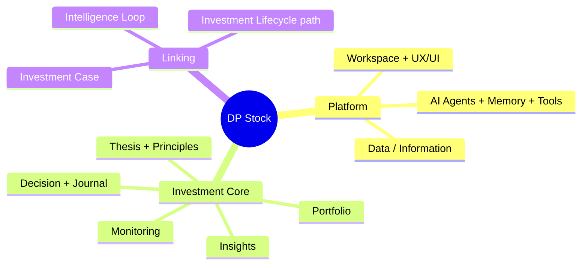
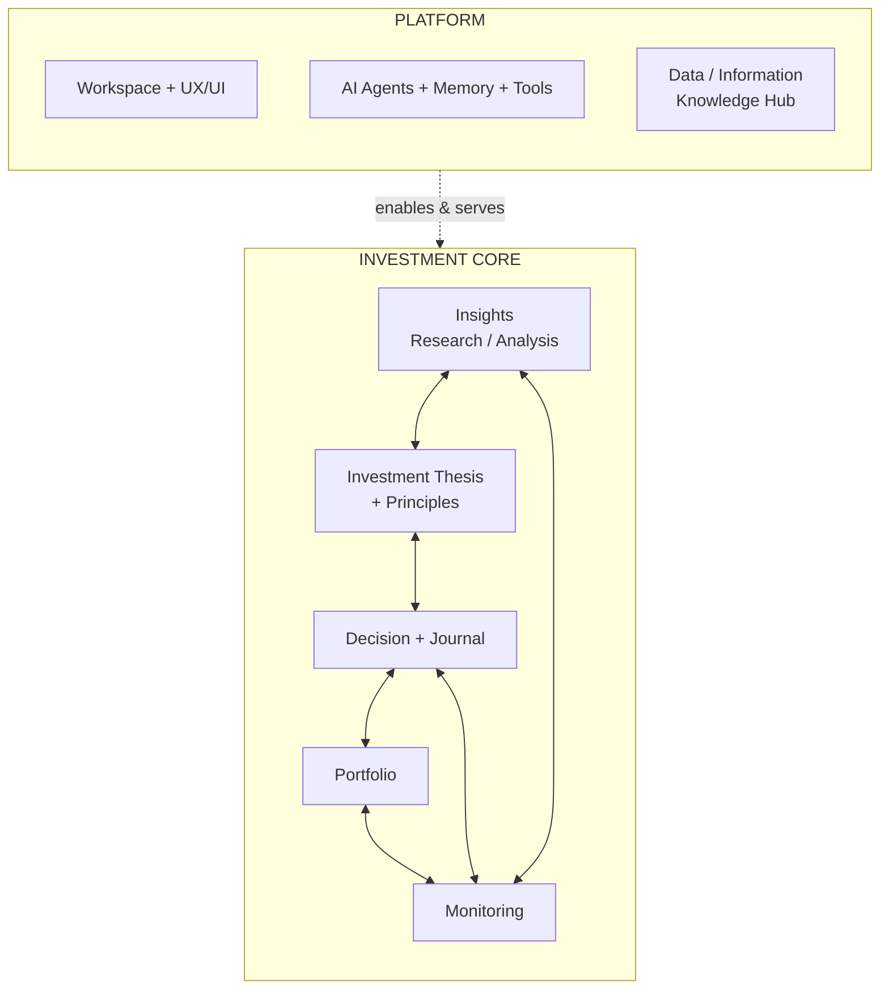
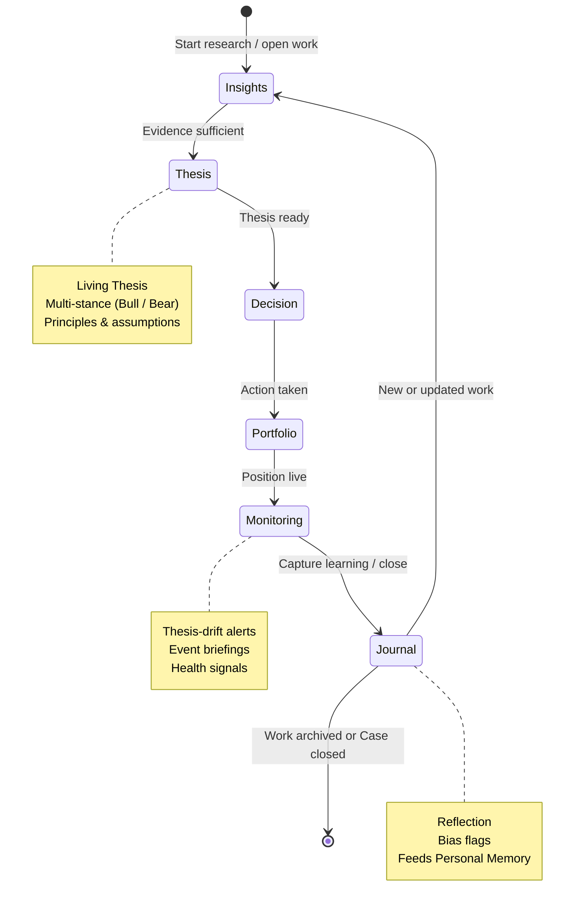
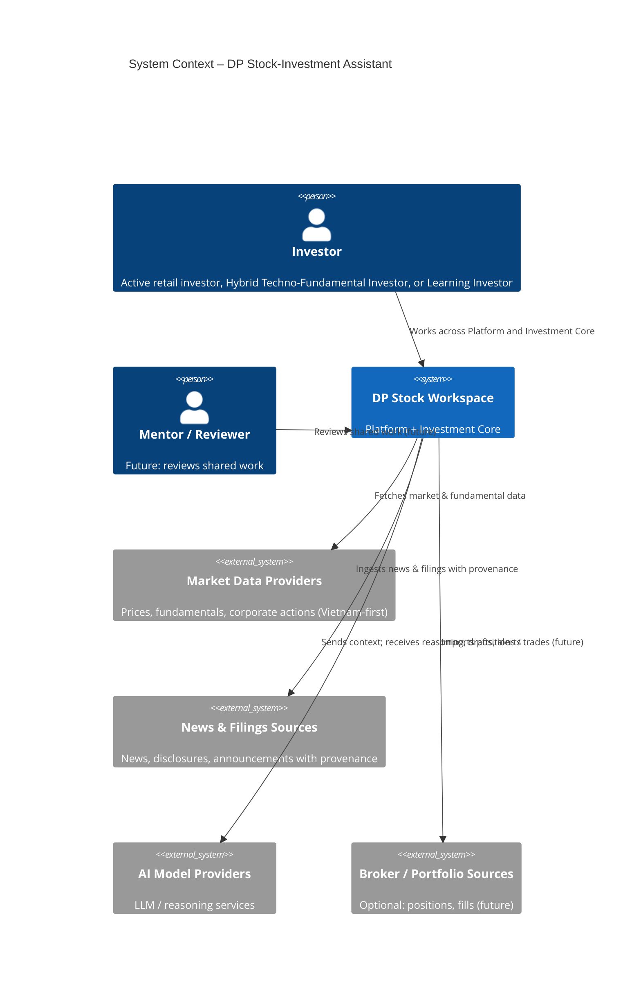
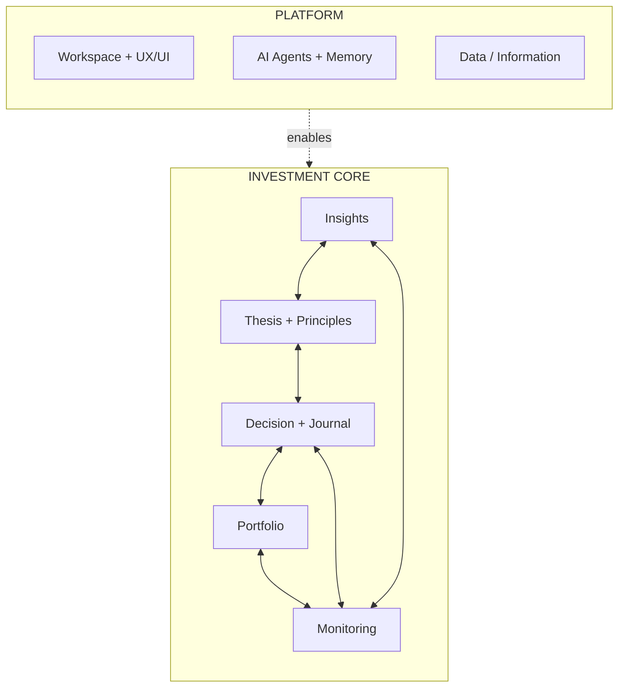
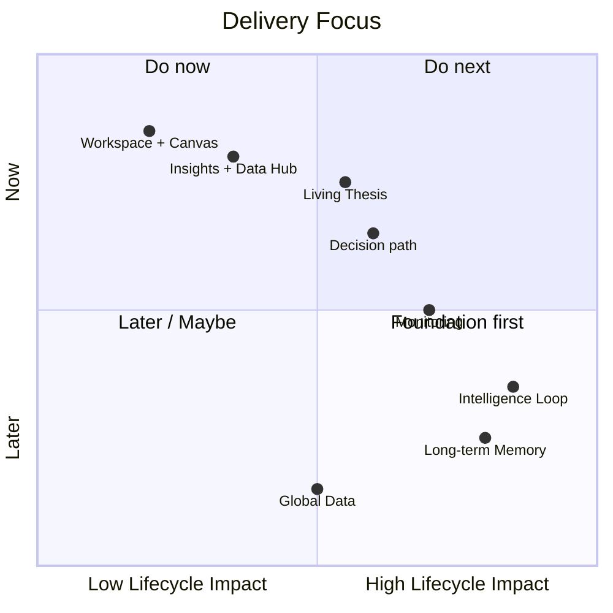
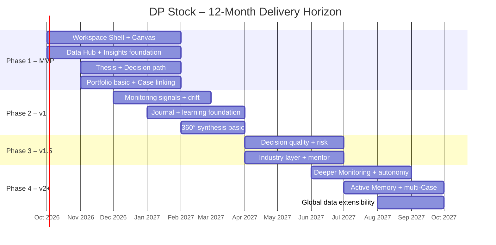
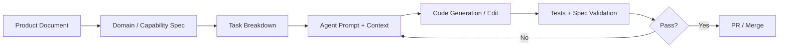

# DP Stock-Investment Assistant
## Product Document  
**Version:** 1.4 · **Date:** 2026-09-22  
**Status:** Working source of truth for product vision, model, and conceptual IA/UX (SDD-ready); Dual-Track aligned to Vision §5.1; primary persona = Hybrid Techno-Fundamental Investor

---

> **Core Thesis**  
> DP Stock is a **Cognitive AI-powered Investment Workspace** built from two cooperating layers: a **Platform** (Workspace, AI Agents + Memory, Data/Information) that enables work, and an **Investment Core** of complementary domains (Insights, Thesis + Principles, Decision + Journal, Portfolio, Monitoring).  
> An **Investment Case** is the optional but recommended **linking thread** that binds core objects into a coherent lifecycle narrative. The product’s job is to make the investment path — Insights → Thesis → Decision → Portfolio → Monitoring → Journal — visible, disciplined, and continuously improved through an Intelligence Loop.


---

## 0. Vision Alignment One-Pager *(working freeze)*

> **Purpose.** Freeze how this Product Specification relates to PRODUCT_VISION_AND_CAPABILITIES.md, so vision → IA → UX work has a single trusted working document.  
> **Rule.** Prefer **this file** for product vision, model, and abstracted concepts. The Vision & Capabilities charter remains complementary material to **merge into this Spec later** — not a parallel backlog or second source of truth.

### 0.1 Document roles

| Document | Role now | Later |
|----------|----------|-------|
| **This Product Specification** | Trusted working doc for vision statement, product model, personas, lifecycle, Phase intent, and conceptual IA/UX | Continues as product SSOT |
| **PRODUCT_VISION_AND_CAPABILITIES.md** | North-star capability charter (obstacles, pillars, VN microstructure depth, 360° lenses, workspace metaphors) | Fold useful content into this Spec as appendices / capability notes; retire dual-truth usage |
| **README / SRS / FE engineering docs** | Portal, requirements pool, implementation | Out of scope for this conceptual lane |

### 0.2 Vocabulary freeze *(use Spec meanings)*

| Term | Meaning in this Spec | Do not confuse with |
|------|----------------------|---------------------|
| **Platform** | Workspace + AI/Memory + Data — enables work; does not own investment meaning | The whole product |
| **Investment Core** | Insights, Thesis + Principles, Decision + Journal, Portfolio, Monitoring | Chat UI alone |
| **Investment Case** | Optional linking thread for a lifecycle narrative | Mandatory container / “god aggregate” |
| **Investment Lifecycle** | Insights → Thesis → Decision → Portfolio → Monitoring → Journal | A single screen or one feature |
| **Adaptive Workspace** | Conceptual multi-surface environment that preserves context across Core domains | A specific FE stack or component library |
| **Dual-Track workspace** | Research Sandbox vs Execution Portfolio (Vision §5.1) | Keep thesis Multi-stance (Bull/Bear) as a separate Thesis capability |
| **Intelligence Loop** | Outcomes and Journal feed learning back into Thesis / Memory | Autonomous mentor/agent product in Phase 1 |

### 0.3 Primary persona for Phase intent

- **Primary journey owner:** Hybrid Techno-Fundamental Investor (Techno-Fundamental Compounder / Swing-to-Invest) — conviction + tactical execution; Sandbox → Portfolio only after Decision / pre-mortem.  
- **Process variant:** Active Retail Investor (same path; thicker writing / Case use).  
- **Learning variant:** Learning Investor (more guidance later; not Phase 1 center).

### 0.4 Phase 1 conceptual cut line *(what we prove next)*

**In (skeleton path):** One Adaptive Workspace with Dual-Track separation (Research Sandbox vs Execution Portfolio); user can move Insights → Thesis → Decision → Portfolio; optional Case as thin link; evidence/provenance first-class; Multi-stance (Bull/Bear) thesis thinking available.

**Out of Phase 1 conceptual scope (Vision backlog until Spec pulls them in):** Full Gen-UI artifact zoo, Behavioral Mentor / deep risk coaching, proactive LTM/autonomy, full 360° knowledge graph, community/social surfaces, global/US depth beyond Vietnam-first foundation.

**Gate for any Vision capability ask:** Does this make Insights → Thesis → Decision → Portfolio more *completable and understandable* for a Vietnamese retail user in this phase? If no → keep on Vision backlog; do not treat as Spec Phase 1.

### 0.5 Conceptual product shape *(IA seed — not implementation)*

```text
Adaptive Workspace (Platform · Workspace)
├── Lifecycle orientation across Investment Core
│     Insights → Thesis → Decision → Portfolio  (+ Monitoring / Journal later)
├── Optional Investment Case chip / thread (on or off)
├── Primary work surface for the active domain object
└── Assistant as supporting companion (not the whole product)

Case-off: free work across domains, still on the lifecycle path
Case-on: same surfaces, bound by a thin narrative thread
```


> **Spatial shell cross-link (2026-09-23):** Conceptual Adaptive Workspace stacking is locked in IA — **Z2 = top chrome only**; **Z1 Dual-Track + Lifecycle = left rail left of Z3**; **Z3 (wide) + Z4 (companion) = primary**. Prior top-chrome Z1+Z2 is superseded. Spec remains SSOT for vision; see [`CONCEPTUAL_IA_MAP.md`](./CONCEPTUAL_IA_MAP.md) §2.2a / §8. Sandbox Z3 price-chart FINALIZED lock unchanged.

### 0.6 Next conceptual outcomes *(after this freeze)*

1. Conceptual IA map — see [`CONCEPTUAL_IA_MAP.md`](./CONCEPTUAL_IA_MAP.md) *(Step 2 draft)*.  
2. Raw conceptual wireframes - see [CONCEPTUAL_WIREFRAMES.md](./CONCEPTUAL_WIREFRAMES.md) *(Step 3 draft · W1–W6)*.
3. Later merge pass: select Vision charter content into this Spec; keep one working truth.

---

## 1. Product Vision

### 1.1 Problems We Solve

Vietnamese retail investors and active traders face four structural problems:

| Problem | Description | Consequence |
|---------|-------------|-------------|
| **Information Asymmetry** | Fragmented, low-signal data; hard to separate noise from evidence | Poor research quality, reactive decisions |
| **Cognitive Overload** | Too many tabs, tools, and mental models; no single workspace | Abandoned theses, inconsistent process |
| **Single-Lens Myopia** | Analysis trapped in one perspective (technical, fundamental, or sentiment) | Blind spots and confirmation bias |
| **Emotional & Process Drift** | No persistent record of reasoning; outcomes rarely feed back into process | Repeated mistakes, no compounding skill |

### 1.2 Vision Statement

> Build the **Cognitive AI Workspace** for Vietnamese retail investors and active traders — a system where Platform capabilities (Workspace, AI + Memory, Data) enable a multi-domain Investment Core (Insights, Thesis, Decision + Journal, Portfolio, Monitoring). Users can work flexibly across domains, and optionally bind work into persistent Investment Cases that travel a clear lifecycle and improve through an Intelligence Loop.

### 1.3 Goals

| Horizon | Goal |
|---------|------|
| **Near-term (MVP)** | A user can work across Insights → Thesis → Decision → Portfolio inside one Adaptive Workspace, with optional Investment Case as linking thread. |
| **Medium-term (v1–v1.5)** | Monitoring, Journal, and learning signals close the loop; domains complement each other with clear contracts. |
| **Long-term (v2+)** | The system becomes a proactive partner across many Cases and domains, compounding user skill via Memory. |

### 1.4 Strategy

1. **Vietnam-first, globally extensible** — Start with high-quality local data, provenance, and market microstructure; design data layer for later expansion.
2. **Complementary domains over single-root rigidity** — Investment Core domains support one another; Investment Case links them when a full narrative is needed.
3. **Lifecycle as a path across domains** — Prefer finishing the closed path (Insights → … → Journal) over isolated tools.
4. **Progressive intelligence** — Ship skeleton first, then layer AI assistance, memory, and autonomy.
5. **Process over prediction** — Optimize for better decision process and reduced bias, not for “beating the market” claims.

### 1.5 Product Principles

```text
1. Complement over containment  → Domains reference each other; avoid forcing every object under one parent.
2. Platform enables, Core means → UX, AI, and Data serve Investment Core; they do not define investment logic.
3. Case is a thread, not a god  → Use Investment Case when a persistent lifecycle narrative is wanted; allow lighter flows without one.
4. Lifecycle integrity           → The path Insights → Thesis → Decision → Portfolio → Monitoring → Journal must remain coherent.
5. Evidence over opinion         → Provenance and confidence are first-class.
6. Dual-Track workspace          → Separate Active Research Sandbox from Execution Portfolio; promote ideas only after pre-mortem.
7. Multi-stance thesis            → Bull and bear (or alternative) views remain available on a Living Thesis.
8. Closed-loop learning          → Outcomes and Journal feed Thesis quality and personal Memory.
9. Cognitive respect             → Reduce load; preserve context; make the next action obvious.
10. Lean delivery                → Ship the skeleton, then deepen. Avoid premature sophistication.
```

---

## 2. Product Abstraction

### 2.1 Primary Personas

| Persona | Description | Primary Jobs-to-be-Done |
|---------|-------------|-------------------------|
| **Active Retail Investor** | Holds 5–30 positions, researches independently, values process | Build coherent investment work across domains; reduce emotional decisions |
| **Hybrid Techno-Fundamental Investor** | Also called Techno-Fundamental Compounder or Swing-to-Invest: long-term business conviction (durable moats, pricing power, balance-sheet solvency, capital-allocation discipline) paired with tactical technical execution (market structure, VSA, Wyckoff accumulation/distribution, Volume Profile / VWAP, Stage Analysis — Minervini / O'Neil) to optimize entries, pyramid winners, and enforce strict stops | Build Living Theses with Multi-stance evidence; time entries/exits and pyramids with structure/volume; promote Research Sandbox work into Execution Portfolio only after Decision / pre-mortem; journal process quality |
| **Learning Investor** | Newer to structured investing; wants to improve over time | Guided process, bias flags, ability to revisit past work for lessons |

*Secondary:* Mentors / community leaders who may review shared work (future).

### 2.2 Foundational Concepts



#### Concept Definitions

| Concept | Definition |
|---------|------------|
| **Platform** | Enabling layer: Workspace + UX/UI (Multi-pane Visual Canvas, Context preserved, Generative UI, etc.), AI Agents + Memory + Tools (Personalization), Data/Information (Knowledge Hub). Always available; does not own investment meaning. |
| **Investment Core** | Set of complementary business domains: Insights, Thesis + Principles, Decision + Journal, Portfolio, Monitoring. |
| **Investment Case** | Optional linking thread that groups related core objects into a persistent lifecycle narrative. |
| **Investment Lifecycle** | The coherent path across domains: Insights → Thesis → Decision → Portfolio → Monitoring → (Outcome) → Journal. |
| **Intelligence Loop** | Continuous improvement: evidence/analysis → thesis → decision → monitoring → learning → memory. |
| **Adaptive Workspace** | Visual, multi-pane environment that preserves context and surfaces Core domains without forcing tool-switching. |
| **Dual-Track Workspace** | Continuous workload paradigm with two cooperating tracks: **Track A – Active Research Sandbox** (screening, exploratory charting/modeling, thesis drafting; does not alter official portfolio risk metrics) and **Track B – Execution Portfolio & Management** (official holdings, P&L, risk budgeting, position sizing; research promotes into portfolio only after a pre-mortem / decision hurdle). Aligns Vision §5.1. |
| **Multi-stance Thesis** | Parallel reasoned views on a Living Thesis (at least Bull / Bear, or alternatives). Distinct from Dual-Track Workspace. |

### 2.3 Product Model (Conceptual)



### 2.4 Core User Flow (Lifecycle Path)



### 2.5 Dual-Track Workspace Paradigm (from Vision §5.1)

The platform treats investing as a **continuous, long-lived workload**. Dual-Track is the workspace/IA contract that keeps exploration safe and execution honest:

1. **Track A — Active Research Sandbox**
   - Idea screening, exploratory charting, financial modeling, and thesis drafting.
   - Operates freely **without** altering official portfolio risk metrics.
2. **Track B — Execution Portfolio & Management Suite**
   - Official holdings, realized/unrealized P&L, risk budgeting, and position sizing.
   - Enforces risk rules; research ideas promote into the portfolio only after they pass a **pre-mortem / Decision** hurdle.

**Relationship to other concepts**

| Concept | Role relative to Dual-Track |
|---------|-----------------------------|
| **Investment Lifecycle** | Path Insights → Thesis → Decision → Portfolio → Monitoring → Journal still runs; Dual-Track constrains *where* work lives (Sandbox vs Portfolio) and *when* promotion is allowed. |
| **Investment Case** | Optional linking thread across domains; may span both tracks but does not collapse them. |
| **Multi-stance Thesis** | Bull/Bear (or alternatives) inside Thesis — **not** a synonym for Dual-Track. |
| **Closed-loop / Intelligence Loop** | Outcomes and Journal feed learning; Dual-Track ensures portfolio mutation stays intentional. |

### 2.6 Key Features & Capabilities (by Domain)


| Domain / Pillar | Capabilities |
|-----------------|--------------|
| **Knowledge Hub - Data & Infomation** | Vietnam-first data, news, filings, provenance, source confidence, later macro & industry layers |
| **AI-powered Assistant** | Research acceleration, thesis drafting, event briefings, generative UI, multi-factor scoring, autonomous thesis invalidation, etc. |
| **360° Synthesis** | Multi-lens analysis (company → industry → macro), progressive depth across phases |
| **Visual Canvas - Adaptive Unified AI-Assisted Visual Workspace** | An adaptive, unified, AI-assisted visual workspace as the primary user interface for managing and preserving the investor’s continuous, long-lived investment workload, data, reasoning, decisions, and augmented memory. Adaptive multi-pane workspace, generative UI, saved layouts, context preservation across Case switches |
| **Dual-Track Workspace** | Separate **Active Research Sandbox** (explore, model, draft theses without touching official risk) from **Execution Portfolio & Management** (holdings, P&L, risk budgeting, sizing). Promotion Research → Portfolio only after pre-mortem / Decision checklist. |
| **Living Thesis + Multi-stance** | An investment thesis becomes a persistent, evolving decision record, rather than a static research document. Explicit Bull/Bear (or alternative) stances, versioned thesis, assumption tracking, drift detection |
| **Risk-Aware Portfolio & Mentor** | Connect investment decisions with the investor's broader portfolio and capital allocation.Position sizing, pre-trade checklist, scorecard, risk overlay, behavioral mentor (later) |
| **AI Agent-Cognitive with Memory, Tools & Personalization** | gradually constructs a persistent understanding of the investor's investment process, preferences, reasoning patterns, and decision history from longitudinal investment work. Outcome capture, journal, bias flags, personal long-term memory, process improvement suggestions |
| **Evidence-Driven Monitoring** | keep track on Thesis, Decision & Portfolio. The system continuously monitors the market, conducts evidence-grounded research, and connects new information to the investor’s theses, decisions, and portfolio.|
| **Insights** | Evidence collection, 360° synthesis (progressive), structured analysis notes |
| **Thesis + Principles** | Living thesis, Multi-stance (Bull/Bear), versioning, assumptions, catalysts, standing principles |
| **Decision + Journal** | Scorecard, checklist, decision record, journal, bias flags, lessons |
| **Portfolio** | Positions, allocation views, basic risk overlay, position sizing helpers |
| **Monitoring** | Market watch + Dashboard, Case/position health, event briefings, thesis-drift alerts |

---

## 3. System Context and Boundaries

### 3.1 System Context

DP Stock-Investment Assistant is a Cognitive AI Workspace. Platform capabilities sit between the user and external information sources; Investment Core domains hold investment meaning.



### 3.2 Actors

| Actor | Type | Description | Primary Interaction |
|-------|------|-------------|---------------------|
| Investor | Primary User | Active Retail Investor, Hybrid Techno-Fundamental Investor, or Learning Investor | Works in Workspace; advances Insights → Thesis → Decision → Portfolio → Monitoring → Journal |
| Mentor / Reviewer | Secondary (future) | Experienced investor or community lead | Views / comments on shared work or Cases |
| System (DP Stock) | Internal | Platform + Investment Core | Enforces domain contracts, provenance, and learning path |
| Market Data Providers | External | Price, fundamental, corporate-action feeds | Supply Data / Information |
| News & Filings Sources | External | News, disclosures, announcements | Supply evidence with provenance |
| AI Model Providers | External | LLM / reasoning services | Power Agents, synthesis, drift detection, memory |
| Broker / Portfolio Sources | External (future) | Trading / custody systems | Optional position and fill import |

### 3.3 In-Scope vs Out-of-Scope

#### In-Scope (Core Product)

- Platform: Adaptive Workspace, AI Agents + Memory, Data/Information with provenance
- Investment Core domains: Insights, Thesis + Principles, Decision + Journal, Portfolio, Monitoring
- Investment Case as linking thread for full lifecycle narratives
- Lifecycle path across domains and Intelligence Loop foundation
- Vietnam-first Knowledge Hub with progressive 360° synthesis (company → industry → macro over phases)
- Dual-Track Workspace paradigm (Research Sandbox vs Execution Portfolio) as IA contract
- Living Thesis with Multi-stance (Bull/Bear) support and versioning
- Decision support (scorecard, checklist, basic position sizing)
- Monitoring linked to Cases (events, thesis-drift)
- Outcome capture, Journal, and foundation of Intelligence Loop / Personal Memory

#### Explicitly Out-of-Scope (at least through v1.5)

- Automated order execution or direct brokerage trading
- Guaranteed investment performance or “alpha” claims
- Social trading / copy-trading network
- Full multi-broker portfolio aggregation (beyond optional import)
- Tax reporting or formal financial advice
- Non-equity asset classes as first-class citizens in early phases
- Real-time ultra-low-latency trading infrastructure

### 3.4 Phase Boundaries

| Phase | Primary Boundary Focus | Still Deferred |
|-------|------------------------|----------------|
| **Phase 1 – MVP** | Workspace + Insights → Thesis → Decision → Portfolio path; optional Case linking | Full Monitoring depth, Outcome attribution, rich Memory |
| **Phase 2 – v1** | Monitoring signals, event briefings, thesis-drift, Journal foundation | Full Behavioral Mentor, industry/macro depth |
| **Phase 3 – v1.5** | Decision quality, risk overlay, industry 360°, mentor support | Autonomous invalidation, cross-Case learning at scale |
| **Phase 4 – v2+** | Proactive multi-Case intelligence, long-term memory, global data | Full external ecosystem / marketplace |

### 3.5 Integration & Trust Boundaries

- **Data ingress**: External data entering Insights or Monitoring must carry provenance (source, timestamp, confidence).
- **AI boundary**: AI suggestions are advisory. Final Thesis stances, Decisions, and Journal entries remain user-owned. Accepted AI outputs are tagged as AI-assisted.
- **Isolation**: One user’s work and Personal Memory are not visible to others unless explicitly shared.
- **Governance gate**: New capabilities should strengthen Platform enablement or Investment Core complementarity (and the lifecycle path), not add isolated tools.

---

## 4. Domain Model and Contracts

### 4.1 Domain Map (High-Level)



**Positioning one-liner:**  
Platform (Workspace, AI+Memory, Data) enables a multi-domain Investment Core (Insights, Thesis, Decision+Journal, Portfolio, Monitoring), with Investment Case as an optional linking thread for full lifecycle work.

### 4.2 Platform Domains

| Domain | Responsibility | Key Concepts (abstract) | Complements |
|--------|----------------|-------------------------|-------------|
| **Workspace + UX/UI** | Working environment, layout, navigation, multi-pane canvas, context preservation | Workspace, Layout, Canvas context, View | All Investment Core domains |
| **AI Agents + Memory** | Reasoning, assistance, personalization, longitudinal learning | Agent, Tool use, Suggestion, User Memory Profile | Insights, Thesis, Decision, Monitoring, Journal |
| **Data / Information** | Market data, news, filings, provenance, knowledge access | Instrument, Quote, News, Filing, Provenance | Insights, Monitoring, Portfolio, Thesis |

**Platform rule:** Platform domains may be used independently (e.g. free-form exploration). When used in an investment workflow, they attach context to Investment Core objects rather than replacing them.

### 4.3 Investment Core Domains

| Domain | Responsibility | Key Concepts (abstract) | Main relationships |
|--------|----------------|-------------------------|--------------------|
| **Insights (Research / Analysis)** | Gather, structure, and interpret evidence | Evidence, Analysis note, Insight, Source confidence | Feeds Thesis; uses Data; observed by Monitoring |
| **Investment Thesis + Principles** | Living investment reasoning and standing principles | Thesis, Version, Assumption, Catalyst, Principle / stance | Consumes Insights; guides Decision; checked by Monitoring |
| **Decision + Journal** | Commit to actions and capture learning | Decision, Rationale, Journal entry, Lesson, Bias flag | Uses Thesis; affects Portfolio; feeds Memory |
| **Portfolio** | Capital allocation and exposure | Position, Allocation, Portfolio view, Risk snapshot | Realizes Decisions; observed by Monitoring |
| **Monitoring** | Keep theses, decisions, and positions honest over time | Alert, Drift signal, Event briefing, Health state | Observes Thesis, Portfolio, Insights; can trigger new Insights or Decisions |

**Linking concept:**  
**Investment Case** — optional composition that binds Insights + Thesis + Decisions + Positions + Journal entries into one persistent lifecycle thread when the user wants it.

### 4.4 Entity Summary (High-Level)

#### Platform

| Entity / Concept | Domain | Responsibility |
|------------------|--------|----------------|
| Workspace | Workspace + UX/UI | Container for user work and layouts |
| Canvas / Layout context | Workspace + UX/UI | Preserves multi-pane working context |
| Agent | AI Agents + Memory | Reasoning and tool-using assistant |
| User Memory Profile | AI Agents + Memory | Longitudinal process & preference model |
| Instrument / Symbol | Data / Information | Tradable or researchable identity |
| Market data / News / Filing | Data / Information | External facts with provenance |

#### Investment Core

| Entity / Concept | Domain | Responsibility |
|------------------|--------|----------------|
| Evidence / Insight | Insights | Structured research input or conclusion |
| Thesis | Thesis + Principles | Living investment argument |
| Principle / Stance | Thesis + Principles | Standing rules or Multi-stance (Bull/Bear) views |
| Decision | Decision + Journal | Explicit investment action record |
| Journal entry | Decision + Journal | Reflection and lessons |
| Position / Allocation | Portfolio | Capital exposure |
| Monitoring signal / Alert | Monitoring | Drift, event, or health indication |
| Investment Case *(linking)* | Cross-core | Optional thread binding related core objects |

### 4.5 Lifecycle Path (Contract Across Domains)

```text
Insights → Thesis → Decision → Portfolio → Monitoring → Journal
     ↑                                                      |
     └──────────── (new insights / re-open) ────────────────┘
```

**Rules:**

1. The lifecycle is a **path across domains**, not solely internal state of one entity.
2. Investment Case, when used, should reflect a coherent position on this path.
3. Backward moves are allowed with recorded reason.
4. Journal and Memory are the primary learning sinks; Monitoring is the primary ongoing honesty mechanism.

### 4.6 Core Invariants

1. **Complement over containment** — Core domains reference each other; do not require every object to live under a single parent.
2. **Platform does not own investment meaning** — Final Thesis stances, Decisions, and Journal entries are user-owned.
3. **Provenance** — Evidence and accepted AI contributions carry source / attribution metadata.
4. **Dual-Track Workspace** — Research Sandbox work must not silently mutate Execution Portfolio risk; promotion requires an explicit Decision / pre-mortem gate.
5. **Multi-stance readiness** — Thesis supports at least two parallel stances (e.g. Bull / Bear).
6. **Memory isolation** — User Memory Profile is private to the user.
7. **Case is optional but consistent** — When a Case exists, linked objects should not contradict its lifecycle narrative.

### 4.7 Key Domain Events (Cross-Domain Contracts)

| Event | Typical source domain | Typical consumers |
|-------|----------------------|-------------------|
| Evidence / Insight added | Insights | Thesis, Agents |
| Thesis updated | Thesis + Principles | Monitoring, Decision, Journal |
| Decision taken | Decision + Journal | Portfolio, Journal, Memory |
| Position changed | Portfolio | Monitoring, Decision |
| Drift / alert raised | Monitoring | Thesis, Insights, user |
| Journal entry created | Decision + Journal | Memory, learning metrics |
| Memory profile updated | AI Agents + Memory | Future assistance across domains |

### 4.8 Bounded Contexts (Logical)

| Bounded Context | Layer | Owns / focuses on |
|-----------------|-------|-------------------|
| Workspace / Canvas | Platform | Layout, context, navigation |
| AI Agents + Memory | Platform | Agent runtime, suggestions, User Memory Profile |
| Data / Information | Platform | Instruments, market data, news, provenance |
| Insights | Core | Evidence, analysis, synthesis |
| Thesis + Principles | Core | Thesis, versions, assumptions, stances |
| Decision + Journal | Core | Decisions, rationales, journal, lessons |
| Portfolio | Core | Positions, allocations, risk snapshots |
| Monitoring | Core | Alerts, drift, event briefings, health |
| Case Linking *(thin)* | Cross | Optional composition and lifecycle narrative |

---

## 5. Product Roadmap

### 5.1 Strategic Priorities



### 5.2 High-Level Timeline (12 Months)



### 5.3 Phase Goals & Prioritized Deliverables

#### Phase 1 – MVP
**Goal:** User can move Insights → Thesis → Decision → Portfolio inside one Workspace; optional Case linking available.

| Priority | Deliverable | Why |
|----------|-------------|-----|
| **P0** | Adaptive Visual Canvas (multi-pane, context preserved) | Platform: keeps work in one place |
| **P0** | Vietnam-first Data Hub + provenance | Platform: enables quality Insights |
| **P0** | Insights foundation (evidence capture) | Core: start of lifecycle path |
| **P0** | Dual-Track Workspace IA (Research vs Execution) | Platform/Core: prevent research from mutating portfolio risk |
| **P0** | Living Thesis Builder v1 + Multi-stance (Bull/Bear) | Core: heart of reasoning |
| **P0** | Basic Decision path + checklist | Core: commit actions |
| **P0** | Basic Portfolio view + Case linking | Core + linking thread |
| **P1** | Basic AI Reasoning Assistant | Platform: acceleration |
| **P1** | Saved layout presets | Platform: speed across work |

#### Phase 2 – v1
**Goal:** Monitoring and Journal begin closing the loop; domains complement each other in production use.

| Priority | Deliverable | Why |
|----------|-------------|-----|
| **P0** | Monitoring signals + thesis-drift alerts | Core: honesty over time |
| **P0** | Automated event briefings | Core: keep Thesis relevant |
| **P0** | Journal foundation | Core: learning sink |
| **P1** | AI Memory (user-style + work-linked) | Platform: start Intelligence Loop |
| **P1** | Enhanced company-level 360° | Core: deeper Insights |

#### Phase 3 – v1.5
**Goal:** Raise quality and discipline across Decision, Portfolio, and Insights.

| Priority | Deliverable | Why |
|----------|-------------|-----|
| **P0** | Industry-level 360° layer | Deeper Insights |
| **P0** | Behavioral Mentor support | Stronger Decision quality |
| **P1** | Richer Thesis management & versioning | Better Thesis evolution |
| **P1** | Position sizing + risk overlay | Stronger Portfolio |
| **P1** | Selected macro drivers | Broader Insights context |

#### Phase 4 – v2+
**Goal:** Proactive multi-work / multi-Case partnership and compounding Memory.

| Priority | Deliverable | Why |
|----------|-------------|-----|
| **P0** | Stronger autonomous drift / invalidation signals | Tighter Monitoring → Thesis loop |
| **P0** | Micro-to-macro continuum + stress views | Highest-quality Insights |
| **P1** | Custom multi-factor scoring | Personalized Decision support |
| **P1** | Active Long-Term Memory | Intelligence compounds |
| **P1** | Global data extensibility | Broader universe of work |

### 5.4 Lifecycle Path × Phase (Simplified)

| Path stage | Phase 1 | Phase 2 | Phase 3 | Phase 4 |
|------------|---------|---------|---------|---------|
| Insights | Foundation + Hub | Stronger evidence tools | Industry / macro depth | Full continuum |
| Thesis | Living Thesis + Multi-stance | Drift awareness | Richer versioning | Autonomous signals |
| Decision + Journal | Basic decision path | Journal foundation | Mentor + quality | Smarter support |
| Portfolio | Basic view + linking | — | Risk overlay | — |
| Monitoring | Light / status | Signals + briefings | — | Deeper autonomy |
| Memory / Loop | — | Foundation | — | Active compounding |

### 5.5 Success Metrics

| Category | Metrics |
|----------|---------|
| **Product Adoption** | Active work threads or Cases / user / month · % reaching Journal or explicit close · Time in Insights vs Decision · Retention after ≥3 completed threads |
| **Process Quality** | Thesis update frequency before Decision · % Decisions with explicit rationale/scorecard · Journal completion rate · Bias flags acknowledged |
| **Learning Signal** | Revisits of past work for lessons · Self-reported process improvement · Reduction in repeated error patterns · Memory utilization rate |

### 5.6 Delivery Governance Rule

> Prefer capabilities that strengthen **Platform enablement** or **Investment Core complementarity** and the lifecycle path Insights → … → Journal.  
> Sprint review question: *“Does this make the path more complete, the domains more coherent, or the Intelligence Loop tighter?”*  
> Isolated tools that neither enable Platform nor advance Core domains are deferred.

---

## 6. Spec-Driven & Agentic Development Guidance

This document supports **Spec-Driven Development (SDD)** and agentic AI coding workflows (GitHub Copilot, Codex, Cursor, Aider, etc.).

### 6.1 Recommended Spec Hierarchy

```text
Product Document (this file)
    └── Domain / Capability Specs (per Platform or Core domain)
            └── Task Specs / User Stories
                    └── Implementation Prompts (for agents)
```

### 6.2 How to Derive Specs from This Document

| Source in this doc | Becomes |
|--------------------|---------|
| Platform vs Investment Core split | Bounded contexts / module boundaries |
| Domain definitions + Entity Summary | Domain model & aggregate choices |
| Lifecycle path + events | Cross-domain contracts & integration tests |
| Phase deliverables | Epic → Feature → Spec |
| Governance Rule | Acceptance gate on PRs / agent tasks |
| Success Metrics | Instrumentation requirements |

### 6.3 Suggested Agentic Workflow



**Practical rules for agents:**

1. Inject Platform vs Investment Core boundaries and the lifecycle path into system prompts / rules files.
2. Prefer vertical slices that advance the path (e.g. Insights → Thesis) over purely technical horizontal layers.
3. Every new capability should declare whether it is Platform, Core, or Case-linking, and which domain(s) it strengthens.
4. Treat the Governance Rule as a hard review gate.
5. Keep User Memory and Agent interfaces stable so Core domains can evolve independently.

### 6.4 Example Spec Skeleton (for agents)

```markdown
# Spec: Living Thesis Builder v1

## Context
Phase 1 – MVP. Investment Core → Thesis + Principles domain.
May link to an Investment Case but must not require one for basic use.

## Invariants
- Thesis is versioned
- Dual-Track Workspace: Research Sandbox changes do not alter Execution Portfolio metrics
- Multi-stance (at least Bull / Bear) supported
- Assumptions / catalysts first-class
- Changes emit events usable by Monitoring later

## Acceptance
- [ ] User can create / update Thesis in Workspace without leaving context
- [ ] Previous versions recoverable
- [ ] Dual-Track separation visible in Workspace IA (Research vs Portfolio)
- [ ] Multi-stance (Bull/Bear) views available
- [ ] Works with or without an Investment Case link
- [ ] Spec tests pass; provenance of AI-assisted content preserved
```

---

## 7. Document Control & Next Actions


**Recommended immediate next steps (conceptual lane first):**

1. Vision ↔ Spec alignment one-pager — captured in §0 *(this version)*.
2. Produce a **conceptual IA map** from this Spec (domains → surfaces → Case-off/on).
3. Produce **raw conceptual wireframes** that prove Adaptive Workspace + lifecycle path + optional Case.
4. Later: merge selected content from `PRODUCT_VISION_AND_CAPABILITIES.md` into this Spec; then resume SDD domain specs (Workspace, Insights, Thesis, Decision) and module mapping.


---

*End of Product Document · DP Stock-Investment Assistant · v1.4 · 2026-09-22*
