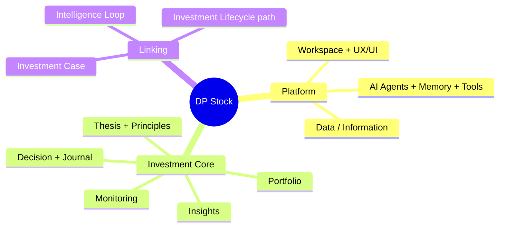
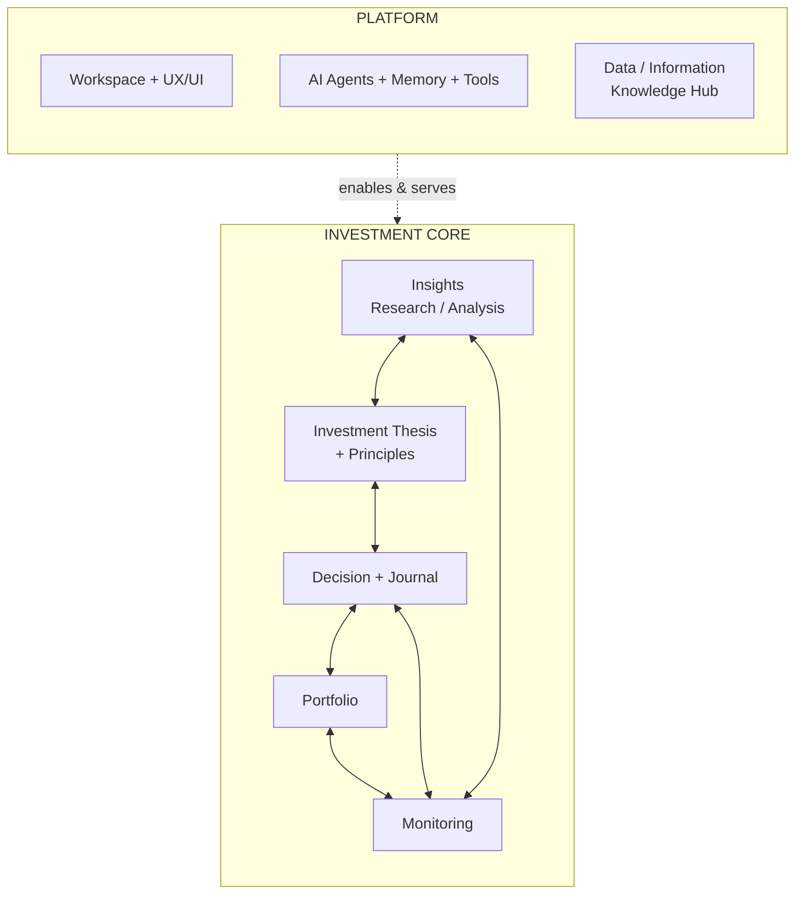
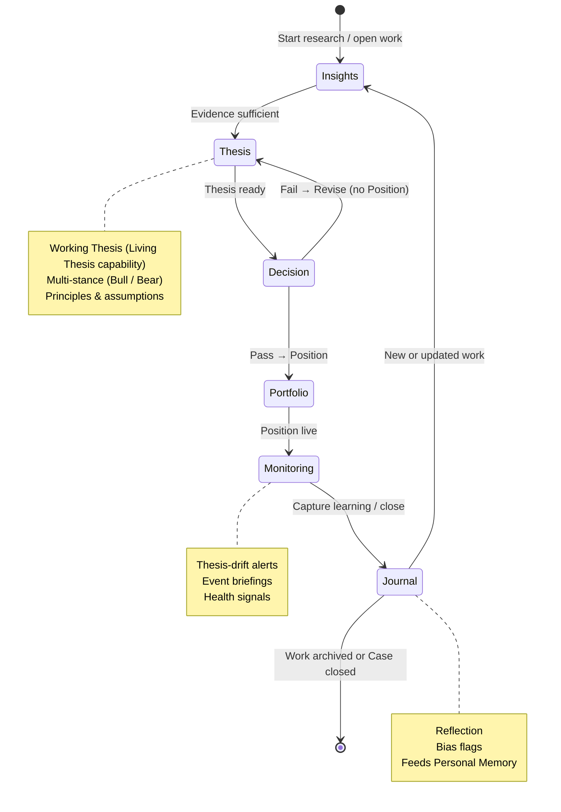
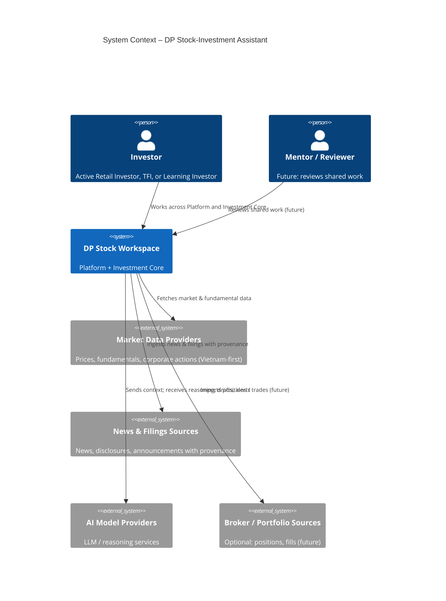
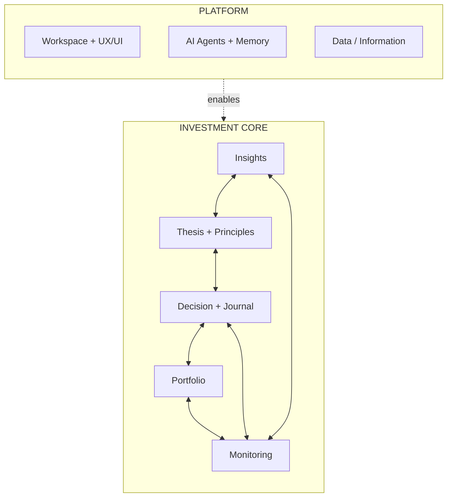
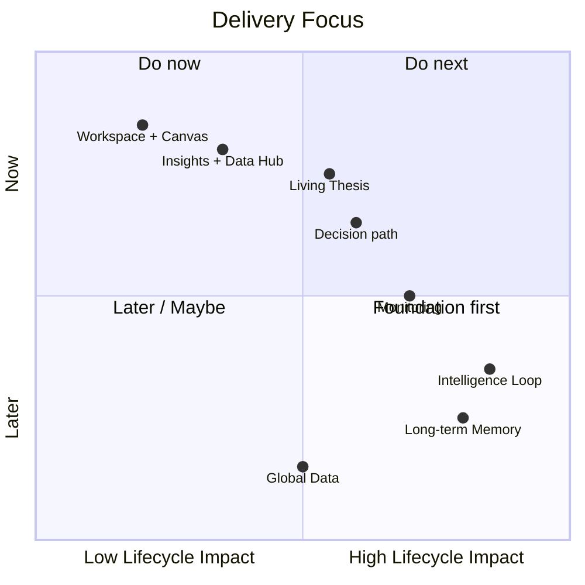
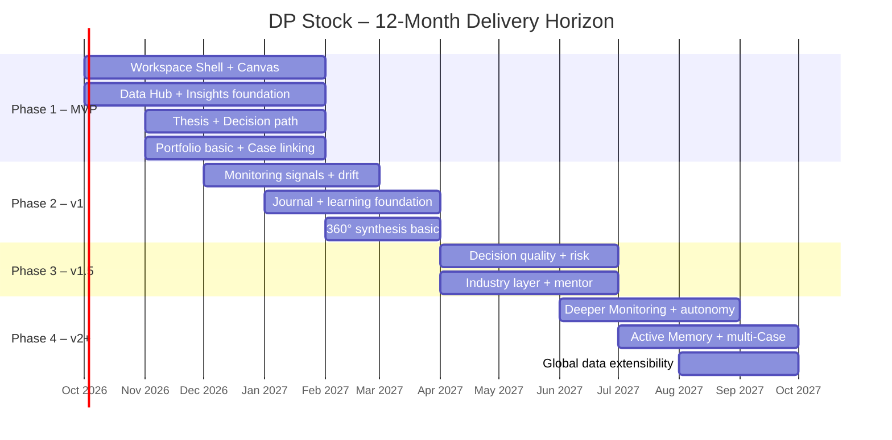
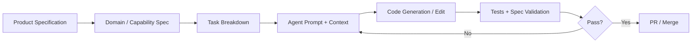

# Product Specification

| Field | Value |
|---|---|
| Document | Product Specification · DP Stock-Investment Assistant |
| Version | v1.7.0 |
| Date | 2026-09-25 |
| Status | Working source of truth · ontology frozen 2026-09-24 |
| Owner | Phan Duy |
| Related | [IA map v1.0.0](./CONCEPTUAL_IA_MAP.md) · [Journeys v1.0.0](./USER_JOURNEYS_WITH_WIREFRAMES.md) · [Capabilities charter](./PRODUCT_CAPABILITIES%5BReserved%5D.md) (2026-09-03) |

---

> **Core Thesis**  
> DP Stock is a **Cognitive AI-powered Investment Workspace** built from two cooperating layers:
> - a **Platform** (Workspace, AI Agents + Memory, Data/Information) that enables work, and
> - an **Investment Core** of complementary domains (Insights, Thesis + Principles, Decision + Journal, Portfolio, Monitoring) that holds investment meaning.
>
> Work moves from a **Working Thesis** in the Research Sandbox through an explicit **Decision gate**. **Pass** creates a **Position** on the Execution Portfolio; **Fail** creates nothing and the user revises. An **Investment Case** is an optional narrative binder, never required (rules: §4.6).
>
> The product's job is to make the investment path (Insights → Thesis → Decision → Portfolio → Monitoring → Journal) visible, disciplined, and continuously improved through an Intelligence Loop.

---

## 0. Vision alignment *(working freeze)*

> **Purpose.** Fix how this Spec relates to the [Capabilities charter](./PRODUCT_CAPABILITIES%5BReserved%5D.md) ("Product Vision and Core Capabilities", `docs/system/PRODUCT_CAPABILITIES[Reserved].md`), so vision → IA → UX work has one trusted working document.  
> **Rule.** Prefer this Spec for product vision, model and concepts. The charter is complementary material to merge into this Spec later, not a parallel backlog or a second source of truth.

### 0.1 Document roles

| Document | Role now | Later |
|---|---|---|
| **This Product Specification** | Trusted working doc for the vision statement, product model, personas, lifecycle, Phase intent and conceptual IA/UX; owns the glossary (§0.2) and the ontology (§4.6) | Continues as the product source of truth |
| **[Capabilities charter](./PRODUCT_CAPABILITIES%5BReserved%5D.md)** | North-star capability charter (obstacles, pillars, VN microstructure depth, 360° lenses, workspace metaphors) | Fold useful content into this Spec as appendices or capability notes; retire dual-truth usage |
| **[IA map](./CONCEPTUAL_IA_MAP.md) / [Journeys](./USER_JOURNEYS_WITH_WIREFRAMES.md)** | Own zones and the layout lock (IA) and journeys, steps and frames (Journeys) | Follow this Spec |
| **README / SRS / FE engineering docs** | Portal, requirements pool, implementation | Out of scope for this conceptual lane |

### 0.2 Glossary *(the only glossary; other docs point here)*

| Term | Meaning in this Spec | Do not confuse with |
|---|---|---|
| **Platform** | Workspace + AI/Memory + Data; enables work, does not own investment meaning | The whole product |
| **Investment Core** | Insights, Thesis + Principles, Decision + Journal, Portfolio, Monitoring | Chat UI alone |
| **Thesis** | The reasoned investment argument, and the name of the workspace stage where it is built | Position; Case |
| **Working Thesis** | The Thesis before Pass: the Sandbox research state (also after Fail → Revise) | A Position; an early Case |
| **Thesis (why we hold)** | The Thesis after Pass, attached to the Position as the reason it is held | A new object; the Position itself |
| **Living Thesis** | Capability name only: a versioned, evolving Thesis with parallel Bull/Bear stances (Multi-stance). Not a stage and not a state | A stage in the flow |
| **Multi-stance** | Parallel reasoned views inside one Thesis (at least Bull / Bear) | Dual-Track |
| **Decision gate** | Explicit promotion gate (pre-mortem checklist) between Track A and Track B | A state of the Thesis |
| **Pass / Fail / Revise** | Pass and Fail are the Decision gate outcomes; Revise is the action taken after Fail (no separate Fail button; §4.6) | Buttons for every outcome |
| **Position** | Track B execution-risk object created by Pass (size, stop, official book) | The Thesis argument; the Case |
| **Investment Case** (Case) | Optional narrative binder / dossier thread grouping related Core objects when the user wants one story; can start any time (often at Thesis); not born at Pass; not the Position; never required | A Pass object; a mandatory container |
| **Case-on / Case-off** | Whether the current work is linked to a Case; the Case chip shows only when Case-on | Pass / Fail |
| **Investment Lifecycle** | Product lifecycle of 6 stages: Insights → Thesis → Decision → Portfolio → Monitoring → Journal; the workspace shows 4 of them in Phase 1 (mapping in §4.5) | A single screen or feature |
| **Dual-Track** | Two cooperating tracks, both always present: **Track A · Research Sandbox** (short: Sandbox) and **Track B · Execution Portfolio** (short: Portfolio); charter §5.1 | Multi-stance |
| **Adaptive Workspace** | Conceptual multi-surface environment that preserves context across Core domains | A specific FE stack or component library |
| **Zones Z1–Z4** | Z1 Left sidebar · Z2 Top chrome · Z3 Main workspace · Z4 AI companion; defined and locked in IA §2 | Screens, routes, components |
| **Intelligence Loop** | Outcomes and the Journal feed learning back into the Thesis and Memory | An autonomous mentor product in Phase 1 |
| **TFI** | Techno-Fundamental Investor, the primary persona (§0.3) | — |

### 0.3 Primary persona for Phase intent

- **Primary journey owner: Techno-Fundamental Investor (TFI)** (secondary aliases: Compounder / Swing-to-Invest). Picks businesses on fundamentals, times entries, adds and stops with technical analysis, and works AI-native.
- **"Techno" has two meanings on purpose:**
  1. **Technical analysis** (chart, volume, structure) for entries, adds and stops, while fundamentals decide *what* to own.
  2. A **technology-adopting investor** who deliberately uses AI abilities (agents, evidence gathering, memory, pre-mortem support) across their investment life.

  The AI meaning does not change the Decision gate, whose check stays fundamental ↔ technical alignment. Later sections use TFI.
- **Process variant:** Active Retail Investor (same path; heavier writing and Case use).
- **Learning variant:** Learning Investor (more guidance later; not the Phase 1 center).

### 0.4 Phase 1 conceptual cut line *(what we prove next)*

**In (skeleton path):** one Adaptive Workspace with Dual-Track separation; the user moves Insights → Working Thesis → Decision gate → Portfolio; Pass creates a Position, Fail creates nothing (§4.6); the Case stays optional; evidence and provenance are first-class; Multi-stance lives inside the Thesis.

**Out of Phase 1 conceptual scope** (charter backlog until this Spec pulls them in): the full Gen-UI artifact set, Behavioral Mentor and deep risk coaching, proactive long-term memory and autonomy, the full 360° knowledge graph, community and social surfaces, global/US depth beyond the Vietnam-first foundation.

**Gate for any charter capability ask:** does it make Insights → Thesis → Decision → Portfolio more *completable and understandable* for a Vietnamese retail user in this phase? If not, keep it on the charter backlog; it is not Spec Phase 1.

### 0.5 Conceptual product shape *(IA seed, not implementation)*

```text
Adaptive Workspace (Platform · Workspace)
├── Lifecycle orientation across the Investment Core
│     Insights → Thesis → Decision → Portfolio  (+ Monitoring / Journal later)
├── Dual-Track: Track A · Research Sandbox | Track B · Execution Portfolio (both visible)
├── Optional Investment Case chip / thread (Case-on / Case-off), binder only
├── Main workspace for the active domain object
└── AI companion (supports; not the whole product)

Pre-Pass (Sandbox): Insights and/or Working Thesis, no Position yet
Pass: creates a Position on Portfolio; the Thesis attaches as why we hold
Fail: nothing created; Revise the Working Thesis in the Sandbox
Case: optional narrative binder at any time, not born at Pass
```

> **Spatial shell.** Zones and the layout lock are owned by the IA map: see [IA map §2.6](./CONCEPTUAL_IA_MAP.md) (Z2 Top chrome with context + utilities slot; Z1 Left sidebar left of Z3; Z3 Main workspace + Z4 AI companion) and IA §2.4 for the Sandbox chart lock.

### 0.6 Related docs and status

1. **IA map v1.0.0** (done): [`CONCEPTUAL_IA_MAP.md`](./CONCEPTUAL_IA_MAP.md): zones, layout lock, domain placement.
2. **Journeys v1.0.0** (done): [`USER_JOURNEYS_WITH_WIREFRAMES.md`](./USER_JOURNEYS_WITH_WIREFRAMES.md): J-TFI-1 (Pass → Position) and J-TFI-2 (Fail → Revise), 8 frames as snapshot release journey-v1.0.0.
3. **Charter merge** (open): select content from the [Capabilities charter](./PRODUCT_CAPABILITIES%5BReserved%5D.md) into this Spec; keep one working truth (§7).

---

## 1. Product Vision

### 1.1 Problems We Solve

Vietnamese retail investors and active traders face four structural problems:

| Problem | Description | Consequence |
|---------|-------------|-------------|
| **Information Asymmetry** | Fragmented, low-signal data; hard to separate noise from evidence | Poor research quality, reactive decisions |
| **Cognitive Overload** | Too many tabs, tools, and mental models; no single workspace | Abandoned theses, inconsistent process |
| **Single-Lens Myopia** | Analysis trapped in one perspective (technical, fundamental, or sentiment) | Blind spots and confirmation bias |
| **Emotional & Process Drift** | No persistent record of reasoning; outcomes rarely feed back into process | Repeated mistakes, no compounding skill |

### 1.2 Vision Statement

> Build the **Cognitive AI Workspace** for Vietnamese retail investors and active traders — a system where Platform capabilities (Workspace, AI + Memory, Data) enable a multi-domain Investment Core (Insights, Thesis, Decision + Journal, Portfolio, Monitoring). Users work along a clear **lifecycle** (Insights → Working Thesis → Decision gate → Position on Portfolio, then Monitoring and Journal). The optional Investment Case can bind those objects into one story but does not own the lifecycle (§4.6). The system improves through an Intelligence Loop.

### 1.3 Goals

| Horizon | Goal |
|---------|------|
| **Near-term (MVP)** | A user can work Insights → Working Thesis → Decision gate → Portfolio, with Decision gate outcomes per §4.6. |
| **Medium-term (v1–v1.5)** | Monitoring, Journal, and learning signals close the loop; domains complement each other with clear contracts. |
| **Long-term (v2+)** | The system becomes a proactive partner across many Cases and domains, compounding user skill via Memory. |

### 1.4 Strategy

1. **Vietnam-first, globally extensible** — Start with high-quality local data, provenance, and market microstructure; design data layer for later expansion.
2. **Complementary domains over single-root rigidity** — Investment Core domains support one another; the Position is the post-Pass execution object and the Investment Case an optional binder across domains (§4.6).
3. **Lifecycle as a path across domains** — Prefer finishing the closed path (Insights → … → Journal) over isolated tools.
4. **Progressive intelligence** — Ship skeleton first, then layer AI assistance, memory, and autonomy.
5. **Process over prediction** — Optimize for better decision process and reduced bias, not for “beating the market” claims.

### 1.5 Product Principles

```text
1. Complement over containment  → Domains reference each other; avoid forcing every object under one parent.
2. Platform enables, Core means → UX, AI, and Data serve Investment Core; they do not define investment logic.
3. Case is a thread, not a god  → The Case is an optional binder; Pass creates the Position, Fail creates nothing (§4.6); never require a Case.
4. Lifecycle integrity           → The path Insights → Thesis → Decision → Portfolio → Monitoring → Journal must remain coherent.
5. Evidence over opinion         → Provenance and confidence are first-class.
6. Dual-Track workspace          → Separate Track A · Research Sandbox from Track B · Execution Portfolio; promote only via the Decision gate.
7. Multi-stance Thesis           → Bull and Bear (or alternative) views stay available on the Thesis (Living Thesis capability).
8. Closed-loop learning          → Outcomes and Journal feed Thesis quality and personal Memory.
9. Cognitive respect             → Reduce load; preserve context; make the next action obvious.
10. Lean delivery                → Ship the skeleton, then deepen. Avoid premature sophistication.
```

---

## 2. Product Abstraction

### 2.1 Primary Personas

| Persona | Description | Primary Jobs-to-be-Done |
|---------|-------------|-------------------------|
| **Active Retail Investor** | Holds 5–30 positions, researches independently, values process | Build coherent investment work across domains; reduce emotional decisions |
| **TFI** (primary; see §0.3) | Long-term business conviction (moats, pricing power, balance-sheet solvency, capital-allocation discipline) paired with tactical technical execution (market structure, VSA, Wyckoff, Volume Profile / VWAP, Stage Analysis per Minervini / O'Neil) for entries, pyramids and strict stops | Build a Thesis with Multi-stance evidence; time entries, exits and pyramids with structure and volume; promote Sandbox work to the Portfolio only via the Decision gate; journal process quality |
| **Learning Investor** | Newer to structured investing; wants to improve over time | Guided process, bias flags, ability to revisit past work for lessons |

*Secondary:* Mentors / community leaders who may review shared work (future).

### 2.2 Foundational Concepts



#### Concept Definitions

| Concept | Definition |
|---------|------------|
| **Platform** | Enabling layer: Workspace + UX/UI (Multi-pane Visual Canvas, Context preserved, Generative UI, etc.), AI Agents + Memory + Tools (Personalization), Data/Information (Knowledge Hub). Always available; does not own investment meaning. |
| **Investment Core** | Set of complementary business domains: Insights, Thesis + Principles, Decision + Journal, Portfolio, Monitoring. |
| **Investment Case** | Optional narrative binder across Core objects (Insights ↔ Thesis ↔ Decision ↔ Position ↔ Monitoring / Journal). Glossary §0.2; rules §4.6. |
| **Position** | Track B execution-risk object created by Pass. Glossary §0.2; rules §4.6. |
| **Thesis / Working Thesis** | The reasoned argument with Multi-stance; Working Thesis before Pass, Thesis (why we hold) after. Glossary §0.2. |
| **Investment Lifecycle** | The coherent path across domains: Insights → Thesis → Decision → Portfolio → Monitoring → (Outcome) → Journal (workspace mapping in §4.5). |
| **Intelligence Loop** | Continuous improvement: evidence/analysis → thesis → decision → monitoring → learning → memory. |
| **Adaptive Workspace** | Visual, multi-pane environment that preserves context and surfaces Core domains without forcing tool-switching. |
| **Dual-Track Workspace** | Continuous workload paradigm with two cooperating tracks, Track A · Research Sandbox and Track B · Execution Portfolio (§2.5; charter §5.1). |
| **Multi-stance Thesis** | Parallel reasoned views inside one Thesis (at least Bull / Bear, or alternatives). Distinct from Dual-Track. |

### 2.3 Product Model (Conceptual)



### 2.4 Core User Flow (Lifecycle Path)



### 2.5 Dual-Track Workspace Paradigm

Origin: [Capabilities charter §5.1](./PRODUCT_CAPABILITIES%5BReserved%5D.md). The platform treats investing as a continuous, long-lived workload. Dual-Track is the workspace and IA contract that keeps exploration safe and execution honest:

1. **Track A · Research Sandbox**
   - Idea screening, exploratory charting, financial modeling and Thesis drafting.
   - Operates freely **without** altering official Portfolio risk metrics.
2. **Track B · Execution Portfolio**
   - Official holdings, realized/unrealized P&L, risk budgeting and position sizing.
   - Enforces risk rules; research promotes into the Portfolio only after it passes the Decision gate (pre-mortem checklist).

**Relationship to other concepts**

| Concept | Role relative to Dual-Track |
|---------|-----------------------------|
| **Investment Lifecycle** | The path Insights → … → Journal still runs; Dual-Track constrains *where* work lives (Sandbox vs Portfolio) and *when* promotion is allowed. |
| **Position** | Born at Pass on Track B; does not collapse Dual-Track (§4.6). |
| **Investment Case** | Optional binder; may link the Position after Pass; does not collapse Dual-Track (§4.6). |
| **Multi-stance Thesis** | Bull/Bear (or alternatives) inside the Thesis, **not** a synonym for Dual-Track. |
| **Closed-loop / Intelligence Loop** | Outcomes and Journal feed learning; Dual-Track ensures portfolio mutation stays intentional. |

### 2.6 Key Features & Capabilities (by Domain)

| Domain / Pillar | Capabilities |
|-----------------|--------------|
| **Knowledge Hub · Data & Information** | Vietnam-first data, news, filings, provenance, source confidence; later macro and industry layers. |
| **AI-powered Assistant** | Research acceleration, Thesis drafting, event briefings, generative UI, multi-factor scoring, autonomous Thesis invalidation. |
| **360° Synthesis** | Multi-lens analysis (company → industry → macro), progressive depth across phases. |
| **Visual Canvas · Adaptive AI-Assisted Workspace** | The primary interface for the investor's continuous, long-lived workload: data, reasoning, decisions and augmented memory. Adaptive multi-pane workspace, generative UI, saved layouts, context preserved across symbol and work switches. |
| **Dual-Track Workspace** | Separate Track A · Research Sandbox (explore, model, draft a Thesis without touching official risk) from Track B · Execution Portfolio (holdings, P&L, risk budgeting, sizing). Promotion only via the Decision gate. |
| **Living Thesis + Multi-stance** | The Thesis becomes a persistent, evolving decision record rather than a static research document. Explicit Bull/Bear (or alternative) stances, versioning, assumption tracking, drift detection. |
| **Risk-Aware Portfolio & Mentor** | Connects investment decisions with the investor's broader Portfolio and capital allocation. Position sizing, pre-trade checklist, scorecard, risk overlay, Behavioral Mentor (later). |
| **Cognitive AI Agents with Memory, Tools & Personalization** | Gradually builds a persistent understanding of the investor's process, preferences, reasoning patterns and decision history from longitudinal work. Outcome capture, Journal, bias flags, personal long-term memory, process-improvement suggestions. |
| **Evidence-Driven Monitoring** | Keeps track of the Thesis, Decisions and Portfolio: continuously monitors the market, runs evidence-grounded research and connects new information to the investor's Theses, Decisions and Positions. |
| **Insights** | Evidence collection, 360° synthesis (progressive), structured analysis notes. |
| **Thesis + Principles** | Living Thesis, Multi-stance (Bull/Bear), versioning, assumptions, catalysts, standing principles. |
| **Decision + Journal** | Scorecard, pre-mortem checklist, Decision record, Journal, bias flags, lessons. |
| **Portfolio** | Positions, allocation views, basic risk overlay, position-sizing helpers. |
| **Monitoring** | Market watch and dashboard, Position and Case health, event briefings, Thesis-drift alerts. |

---

## 3. System Context and Boundaries

### 3.1 System Context

DP Stock-Investment Assistant is a Cognitive AI Workspace. Platform capabilities sit between the user and external information sources; Investment Core domains hold investment meaning.



### 3.2 Actors

| Actor | Type | Description | Primary Interaction |
|-------|------|-------------|---------------------|
| Investor | Primary User | Active Retail Investor, TFI, or Learning Investor | Works in Workspace; advances Insights → Thesis → Decision → Portfolio → Monitoring → Journal |
| Mentor / Reviewer | Secondary (future) | Experienced investor or community lead | Views / comments on shared work or Cases |
| System (DP Stock) | Internal | Platform + Investment Core | Enforces domain contracts, provenance, and learning path |
| Market Data Providers | External | Price, fundamental, corporate-action feeds | Supply Data / Information |
| News & Filings Sources | External | News, disclosures, announcements | Supply evidence with provenance |
| AI Model Providers | External | LLM / reasoning services | Power Agents, synthesis, drift detection, memory |
| Broker / Portfolio Sources | External (future) | Trading / custody systems | Optional position and fill import |

### 3.3 In-Scope vs Out-of-Scope

#### In-Scope (Core Product)

- Platform: Adaptive Workspace, AI Agents + Memory, Data/Information with provenance
- Investment Core domains: Insights, Thesis + Principles, Decision + Journal, Portfolio, Monitoring
- Decision gate with Pass / Fail / Revise and the Position / Case rules of §4.6
- Lifecycle path across domains and Intelligence Loop foundation
- Vietnam-first Knowledge Hub with progressive 360° synthesis (company → industry → macro over phases)
- Dual-Track Workspace paradigm (Track A · Research Sandbox vs Track B · Execution Portfolio) as IA contract
- Living Thesis capability: Multi-stance (Bull/Bear) and versioning
- Decision support (scorecard, checklist, basic position sizing)
- Monitoring linked to Positions / optional Cases (events, thesis-drift)
- Outcome capture, Journal, and foundation of Intelligence Loop / Personal Memory

#### Explicitly Out-of-Scope (at least through v1.5)

- Automated order execution or direct brokerage trading
- Guaranteed investment performance or “alpha” claims
- Social trading / copy-trading network
- Full multi-broker portfolio aggregation (beyond optional import)
- Tax reporting or formal financial advice
- Non-equity asset classes as first-class citizens in early phases
- Real-time ultra-low-latency trading infrastructure

### 3.4 Phase Boundaries

| Phase | Primary Boundary Focus | Still Deferred |
|-------|------------------------|----------------|
| **Phase 1 – MVP** | Workspace + Insights → Working Thesis → Decision gate → Portfolio (§4.6 outcomes) | Full Monitoring depth, Outcome attribution, rich Memory |
| **Phase 2 – v1** | Monitoring signals, event briefings, thesis-drift, Journal foundation | Full Behavioral Mentor, industry/macro depth |
| **Phase 3 – v1.5** | Decision quality, risk overlay, industry 360°, mentor support | Autonomous invalidation, cross-Case learning at scale |
| **Phase 4 – v2+** | Proactive multi-Case intelligence, long-term memory, global data | Full external ecosystem / marketplace |

### 3.5 Integration & Trust Boundaries

- **Data ingress**: External data entering Insights or Monitoring must carry provenance (source, timestamp, confidence).
- **AI boundary**: AI suggestions are advisory. Final Thesis stances, Decisions, and Journal entries remain user-owned. Accepted AI outputs are tagged as AI-assisted.
- **Isolation**: One user’s work and Personal Memory are not visible to others unless explicitly shared.
- **Governance gate**: New capabilities should strengthen Platform enablement or Investment Core complementarity (and the lifecycle path), not add isolated tools.

---

## 4. Domain Model and Contracts

### 4.1 Domain Map (High-Level)



**Positioning one-liner:**  
Platform (Workspace, AI+Memory, Data) enables a multi-domain Investment Core (Insights, Thesis, Decision+Journal, Portfolio, Monitoring), with the Investment Case as an optional binder across the lifecycle.

### 4.2 Platform Domains

| Domain | Responsibility | Key Concepts (abstract) | Complements |
|--------|----------------|-------------------------|-------------|
| **Workspace + UX/UI** | Working environment, layout, navigation, multi-pane canvas, context preservation | Workspace, Layout, Canvas context, View | All Investment Core domains |
| **AI Agents + Memory** | Reasoning, assistance, personalization, longitudinal learning | Agent, Tool use, Suggestion, User Memory Profile | Insights, Thesis, Decision, Monitoring, Journal |
| **Data / Information** | Market data, news, filings, provenance, knowledge access | Instrument, Quote, News, Filing, Provenance | Insights, Monitoring, Portfolio, Thesis |

**Platform rule:** Platform domains may be used independently (e.g. free-form exploration). When used in an investment workflow, they attach context to Investment Core objects rather than replacing them.

### 4.3 Investment Core Domains

| Domain | Responsibility | Key Concepts (abstract) | Main relationships |
|--------|----------------|-------------------------|--------------------|
| **Insights (Research / Analysis)** | Gather, structure, and interpret evidence | Evidence, Analysis note, Insight, Source confidence | Feeds Thesis; uses Data; observed by Monitoring |
| **Investment Thesis + Principles** | Living investment reasoning and standing principles | Thesis, Version, Assumption, Catalyst, Principle / stance | Consumes Insights; guides Decision; checked by Monitoring |
| **Decision + Journal** | Commit to actions and capture learning | Decision, Rationale, Journal entry, Lesson, Bias flag | Uses Thesis; affects Portfolio; feeds Memory |
| **Portfolio** | Capital allocation and exposure | Position, Allocation, Portfolio view, Risk snapshot | Realizes Decisions; observed by Monitoring |
| **Monitoring** | Keep theses, decisions, and positions honest over time | Alert, Drift signal, Event briefing, Health state | Observes Thesis, Portfolio, Insights; can trigger new Insights or Decisions |

**Linking and execution concepts:** the Position (created by Pass) and the optional Investment Case are defined in §0.2; their rules are in §4.6.

### 4.4 Entity Summary (High-Level)

#### Platform

| Entity / Concept | Domain | Responsibility |
|------------------|--------|----------------|
| Workspace | Workspace + UX/UI | Container for user work and layouts |
| Canvas / Layout context | Workspace + UX/UI | Preserves multi-pane working context |
| Agent | AI Agents + Memory | Reasoning and tool-using assistant |
| User Memory Profile | AI Agents + Memory | Longitudinal process & preference model |
| Instrument / Symbol | Data / Information | Tradable or researchable identity |
| Market data / News / Filing | Data / Information | External facts with provenance |

#### Investment Core

| Entity / Concept | Domain | Responsibility |
|------------------|--------|----------------|
| Evidence / Insight | Insights | Structured research input or conclusion |
| Thesis | Thesis + Principles | Investment argument (Working Thesis before Pass; why we hold after) |
| Principle / Stance | Thesis + Principles | Standing rules or Multi-stance (Bull/Bear) views |
| Decision | Decision + Journal | Explicit investment action record |
| Journal entry | Decision + Journal | Reflection and lessons |
| Position / Allocation | Portfolio | Capital exposure; the Position is born at Pass (§4.6) |
| Monitoring signal / Alert | Monitoring | Drift, event, or health indication |
| Investment Case *(optional binder)* | Cross-core narrative | Optional dossier thread (§4.6) |

### 4.5 Lifecycle Path (Contract Across Domains)

```text
Insights → Thesis → Decision → Portfolio → Monitoring → Journal
     ↑                                                      |
     └──────────── (new insights / re-open) ────────────────┘
```

The 6-stage product lifecycle is the definition. The workspace (IA map, Journeys, Z1 Lifecycle group) shows the 4 workspace stages of Phase 1. This is a mapping, not a contradiction:

| Product lifecycle stage (6) | Workspace stage (4) | Phase |
|---|---|---|
| Insights | Insights | Phase 1 |
| Thesis | Thesis (Working Thesis) | Phase 1 |
| Decision | Decision (Decision gate) | Phase 1 |
| Portfolio | Portfolio (Position) | Phase 1 |
| Monitoring | Portfolio (later a Monitoring view on the Position) | Phase 2 |
| Journal | Decision + Journal (later; closes the Intelligence Loop) | Phase 2 |

**Rules:**

1. The lifecycle is a **path across domains**, not the internal state of one entity.
2. After Pass, the Position holds execution risk on this path (§4.6).
3. Backward moves are allowed with a recorded reason.
4. The Journal and Memory are the primary learning sinks; Monitoring is the primary ongoing honesty mechanism.

### 4.6 Decision Gate and Object Ontology (normative)

This is the only normative statement of the ontology (frozen 2026-09-24). Other sections and docs point here.

1. **Decision gate.** An explicit promotion gate (pre-mortem checklist) between Track A · Research Sandbox and Track B · Execution Portfolio; not a state of the Thesis.
2. **Outcomes and action.** Pass and Fail are the gate outcomes. **Pass** creates a Position. **Fail** means the checklist is not met; the user's action is **Revise**, which returns the work to the Working Thesis. There is no separate Fail button: the gate offers **Pass → Position** and **Revise**. Parking or archiving a Working Thesis is a later, optional step (Journeys J-TFI-B4).
3. **Position.** Track B execution-risk object (size, stop, official book), created only by Pass. Fail never creates a Position and never mutates Portfolio risk.
4. **Thesis states.** Before Pass the Thesis is the Working Thesis (Sandbox). After Pass the Thesis attaches to the Position as "why we hold". Living Thesis names the capability (versioned, parallel Bull/Bear), not a state.
5. **Investment Case.** Optional narrative binder / dossier thread; can start any time (often at Thesis); not born at Pass; not the Position; never required to research or promote. Pass may attach the Position to an existing Case, or the UI may offer "Start a Case for this Position". Case-on / Case-off is independent of Pass / Fail.
6. **Distinctness.** Thesis ≠ Position ≠ Case.

### 4.7 Core Invariants

1. **Complement over containment**: Core domains reference each other; do not require every object to live under a single parent.
2. **Platform does not own investment meaning**: final Thesis stances, Decisions and Journal entries are user-owned.
3. **Provenance**: evidence and accepted AI contributions carry source and attribution metadata.
4. **Dual-Track Workspace**: Research Sandbox work must not silently mutate Execution Portfolio risk; promotion requires the Decision gate.
5. **Multi-stance readiness**: the Thesis supports at least two parallel stances (e.g. Bull / Bear).
6. **Memory isolation**: the User Memory Profile is private to the user.
7. **Case is a thread, not a god**: when Case-on, related objects should not contradict the Case narrative; the rest of the Case rules are §4.6.

### 4.8 Key Domain Events (Cross-Domain Contracts)

| Event | Typical source domain | Typical consumers |
|-------|----------------------|-------------------|
| Evidence / Insight added | Insights | Thesis, Agents |
| Thesis updated | Thesis + Principles | Monitoring, Decision, Journal |
| Decision taken | Decision + Journal | Portfolio, Journal, Memory |
| Position changed | Portfolio | Monitoring, Decision |
| Drift / alert raised | Monitoring | Thesis, Insights, user |
| Journal entry created | Decision + Journal | Memory, learning metrics |
| Memory profile updated | AI Agents + Memory | Future assistance across domains |

### 4.9 Bounded Contexts (Logical)

| Bounded Context | Layer | Owns / focuses on |
|-----------------|-------|-------------------|
| Workspace / Canvas | Platform | Layout, context, navigation |
| AI Agents + Memory | Platform | Agent runtime, suggestions, User Memory Profile |
| Data / Information | Platform | Instruments, market data, news, provenance |
| Insights | Core | Evidence, analysis, synthesis |
| Thesis + Principles | Core | Thesis, versions, assumptions, stances |
| Decision + Journal | Core | Decisions, rationales, journal, lessons |
| Portfolio | Core | Positions, allocations, risk snapshots |
| Monitoring | Core | Alerts, drift, event briefings, health |
| Position | Core (Portfolio) | Born at Pass (§4.6) |
| Investment Case *(optional binder)* | Cross | Narrative dossier; not execution (§4.6) |

---

## 5. Product Roadmap

### 5.1 Strategic Priorities



### 5.2 High-Level Timeline (12 Months)



### 5.3 Phase Goals & Prioritized Deliverables

#### Phase 1 – MVP
**Goal:** the user can move Insights → Working Thesis → Decision gate → Portfolio, with the outcomes of §4.6.

| Priority | Deliverable | Why |
|----------|-------------|-----|
| **P0** | Adaptive Visual Canvas (multi-pane, context preserved) | Platform: keeps work in one place |
| **P0** | Vietnam-first Data Hub + provenance | Platform: enables quality Insights |
| **P0** | Insights foundation (evidence capture) | Core: start of lifecycle path |
| **P0** | Dual-Track Workspace IA (Sandbox vs Portfolio) | Platform/Core: prevent research from mutating portfolio risk |
| **P0** | Living Thesis Builder v1 + Multi-stance (Bull/Bear) | Core: heart of reasoning |
| **P0** | Basic Decision gate + checklist | Core: commit actions |
| **P0** | Basic Portfolio view + Position after Pass (+ optional Case link) | Core: the Position; Case optional |
| **P1** | Basic AI Reasoning Assistant | Platform: acceleration |
| **P1** | Saved layout presets | Platform: speed across work |

#### Phase 2 – v1
**Goal:** Monitoring and Journal begin closing the loop; domains complement each other in production use.

| Priority | Deliverable | Why |
|----------|-------------|-----|
| **P0** | Monitoring signals + thesis-drift alerts | Core: honesty over time |
| **P0** | Automated event briefings | Core: keep Thesis relevant |
| **P0** | Journal foundation | Core: learning sink |
| **P1** | AI Memory (user-style + work-linked) | Platform: start Intelligence Loop |
| **P1** | Enhanced company-level 360° | Core: deeper Insights |

#### Phase 3 – v1.5
**Goal:** Raise quality and discipline across Decision, Portfolio, and Insights.

| Priority | Deliverable | Why |
|----------|-------------|-----|
| **P0** | Industry-level 360° layer | Deeper Insights |
| **P0** | Behavioral Mentor support | Stronger Decision quality |
| **P1** | Richer Thesis management & versioning | Better Thesis evolution |
| **P1** | Position sizing + risk overlay | Stronger Portfolio |
| **P1** | Selected macro drivers | Broader Insights context |

#### Phase 4 – v2+
**Goal:** Proactive multi-work / multi-Case partnership and compounding Memory.

| Priority | Deliverable | Why |
|----------|-------------|-----|
| **P0** | Stronger autonomous drift / invalidation signals | Tighter Monitoring → Thesis loop |
| **P0** | Micro-to-macro continuum + stress views | Highest-quality Insights |
| **P1** | Custom multi-factor scoring | Personalized Decision support |
| **P1** | Active Long-Term Memory | Intelligence compounds |
| **P1** | Global data extensibility | Broader universe of work |

### 5.4 Lifecycle Path × Phase (Simplified)

| Path stage | Phase 1 | Phase 2 | Phase 3 | Phase 4 |
|------------|---------|---------|---------|---------|
| Insights | Foundation + Hub | Stronger evidence tools | Industry / macro depth | Full continuum |
| Thesis | Living Thesis + Multi-stance | Drift awareness | Richer versioning | Autonomous signals |
| Decision + Journal | Basic decision path | Journal foundation | Mentor + quality | Smarter support |
| Portfolio | Basic view + linking | — | Risk overlay | — |
| Monitoring | Light / status | Signals + briefings | — | Deeper autonomy |
| Memory / Loop | — | Foundation | — | Active compounding |

### 5.5 Success Metrics

| Category | Metrics |
|----------|---------|
| **Product Adoption** | Active work threads or Cases / user / month · % reaching Journal or explicit close · Time in Insights vs Decision · Retention after ≥3 completed threads |
| **Process Quality** | Thesis update frequency before Decision · % Decisions with explicit rationale/scorecard · Journal completion rate · Bias flags acknowledged |
| **Learning Signal** | Revisits of past work for lessons · Self-reported process improvement · Reduction in repeated error patterns · Memory utilization rate |

### 5.6 Delivery Governance Rule

> Prefer capabilities that strengthen **Platform enablement** or **Investment Core complementarity** and the lifecycle path Insights → … → Journal.  
> Sprint review question: *“Does this make the path more complete, the domains more coherent, or the Intelligence Loop tighter?”*  
> Isolated tools that neither enable Platform nor advance Core domains are deferred.

---

## 6. Spec-Driven & Agentic Development Guidance

This Spec feeds Spec-Driven Development (SDD) and agentic coding workflows (GitHub Copilot, Codex, Cursor, Aider and similar). Process governance lives in `REQUIREMENTS_METHOD_AND_GOVERNANCE.md`; this section only says how to derive work from this Spec.

### 6.1 Spec Hierarchy

```text
Product Specification (this file)
    └── Domain / Capability Specs (per Platform or Core domain)
            └── Task Specs / User Stories
                    └── Implementation Prompts (for agents)
```

### 6.2 Deriving Specs from This Document

| Source in this doc | Becomes |
|---|---|
| Platform vs Investment Core split (§2.2, §4.1) | Bounded contexts / module boundaries |
| Domain definitions + Entity Summary (§4.2–§4.4) | Domain model and aggregate choices |
| Lifecycle path, ontology and events (§4.5–§4.8) | Cross-domain contracts and integration tests |
| Phase deliverables (§5.3) | Epic → Feature → Spec |
| Governance Rule (§5.6) | Acceptance gate on PRs and agent tasks |
| Success Metrics (§5.5) | Instrumentation requirements |

### 6.3 Agentic Workflow



**Rules for agents:**

1. Inject the Platform vs Investment Core boundaries, the lifecycle path and the §4.6 ontology into system prompts or rules files.
2. Prefer vertical slices that advance the path (e.g. Insights → Thesis) over purely technical layers.
3. Every new capability declares whether it is Platform, Core or Case-linking, and which domains it strengthens.
4. Treat the Governance Rule (§5.6) as a hard review gate.
5. Keep User Memory and Agent interfaces stable so Core domains can evolve independently.

### 6.4 Example Spec Skeleton

```markdown
# Spec: Living Thesis Builder v1

## Context
Phase 1 – MVP. Investment Core → Thesis + Principles domain.
Pre-Pass work is the Working Thesis; ontology per Product Specification §4.6.

## Invariants
- Thesis is versioned
- Dual-Track: Research Sandbox changes do not alter Execution Portfolio metrics
- Multi-stance (at least Bull / Bear) supported
- Assumptions and catalysts first-class
- Changes emit events usable by Monitoring later

## Acceptance
- [ ] User can create / update the Working Thesis in the Workspace without leaving context
- [ ] Previous versions recoverable
- [ ] Dual-Track separation visible in the Workspace (Sandbox vs Portfolio)
- [ ] Multi-stance (Bull/Bear) views available
- [ ] Works without a Case; Decision gate outcomes follow §4.6
- [ ] Spec tests pass; provenance of AI-assisted content preserved
```

---

## 7. Document Control & Next Actions

**Done:**
1. Vision alignment (§0).
2. Conceptual IA map: [IA map v1.0.0](./CONCEPTUAL_IA_MAP.md).
3. Journeys and frames: [Journeys v1.0.0](./USER_JOURNEYS_WITH_WIREFRAMES.md), snapshot release journey-v1.0.0.

**Next (conceptual lane first):**
1. Keep Figma (`frames.json`) and the Journeys snapshots in step; re-export after text changes.
2. Merge selected content from the [Capabilities charter](./PRODUCT_CAPABILITIES%5BReserved%5D.md) into this Spec (note: the charter's §4.1 persona name predates the TFI rename).
3. Resume SDD domain specs (Workspace, Insights, Thesis, Decision) and module mapping.

---

## 8. Change log

| Version | Date | Change |
|---|---|---|
| v1.7.0 | 2026-09-25 | Cleanup release. Uniform header; H1 "Product Specification". Vision references retargeted to the Capabilities charter (`PRODUCT_CAPABILITIES[Reserved].md`). §0.2 is the single glossary (Thesis / Working Thesis / Living Thesis, Pass / Fail / Revise, Case-on / Case-off, canonical track and zone names). New §4.6 holds the normative Decision gate and ontology (no Fail button: Fail = outcome, Revise = action); later §4 sections renumbered; repeated ontology text elsewhere replaced by pointers. §4.5 maps the 6 product lifecycle stages to the 4 workspace stages. §2.3 Mermaid direction fixed (LR); §2.4 adds Pass / Fail edges. §2.6 typos and capitalization. §6 tightened. §0.6 and §7 mark IA map and Journeys as done. Change log added. |
| v1.6.0 | 2026-09-25 | Primary persona renamed Techno-Fundamental Investor (TFI) with the two "Techno" meanings; IA v0.9.1 shell cross-link. |
| v1.5.0 | 2026-09-24 | Freeze: Pass → Position; Case = optional binder; Working Thesis. |

---

*End of Product Specification · v1.7.0 · 2026-09-25*
