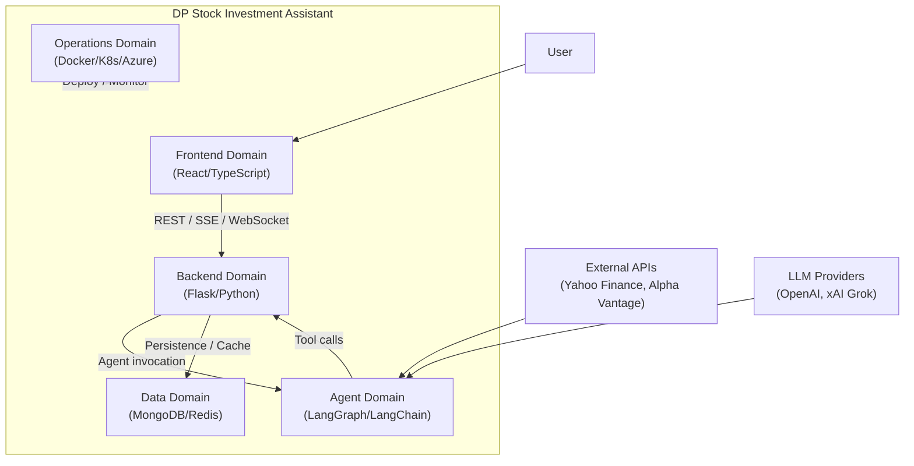

# DP Stock Investment Assistant — System Requirements Specification

## 1. Document Control

| Field | Value |
|-------|-------|
| Project | DP Stock Investment Assistant |
| Document Type | Master System SRS |
| Standards Stance | Aligned to ISO/IEC/IEEE 29148 |
| Governance | Subject to the SRS versioning and change-control mechanism defined in [documentation methodology](../study-hub/project-documentation-and-specification-methodology.md) Section 10.3 |
| Date | 2026-04-03 |
| Status | Initial draft — requirement families seeded; individual requirement entries to be populated incrementally through SDD delivery |
| Audience | Engineering, architecture, product, and technical documentation maintainers |

## 2. Purpose, Scope, and Intended Use

### 2.1 Purpose

This document is the **authoritative upstream requirement pool** for the DP Stock Investment Assistant system. It defines the cross-domain behavior the system must provide, the non-functional qualities it must satisfy, and the domain allocation metadata that connects each requirement to the delivery and verification model.

### 2.2 Scope

The SRS covers the full system boundary:

- **Frontend domain**: user interaction, UX flow, client-side state, and rendering
- **Backend domain**: API surface, orchestration, business workflows, integration mediation, and owned contracts (OpenAPI)
- **Agent domain**: AI reasoning workflow, tool orchestration, memory behavior, and response composition
- **Data domain**: persistence, schema and index policy, retention, migration, and caching
- **Operations domain**: release readiness, observability, reconciliation, migration safety, and runbooks

### 2.3 Intended Use

- Feature specs under `specs/` reference requirement IDs from this document (SR-x.y.z, SNR-x.y.z)
- The traceability registry (`specs/spec-traceability.yaml`) tracks which requirements have been delivered and verified
- Domain technical design documents under `docs/domains/` explain how allocated requirements are realized
- Subordinate domain SRS documents (e.g., agent domain) may extend this baseline with domain-local specialization, but must not contradict it

### 2.4 What This Document Does Not Own

- **Detailed API schemas** — owned by the executable contract (`docs/domains/backend/api/openapi.yaml`)
- **Implementation algorithms** — owned by domain technical design documents
- **Feature delivery detail** — owned by SDD feature specs under `specs/`
- **Architecture decisions** — owned by ADRs under `docs/architecture/DECISIONS/` and `docs/domains/*/DECISIONS/`

## 3. Related Documents and Governance

| Document | Relationship |
|----------|-------------|
| [Documentation Methodology](../study-hub/project-documentation-and-specification-methodology.md) | Defines the documentation architecture, SDD lifecycle integration, and governance model that this SRS operates within |
| [Requirements Method and Governance](REQUIREMENTS_METHOD_AND_GOVERNANCE.md) | Defines authoring standards, change-control processes, and approval paths for this SRS |
| [Project Constitution](../../.specify/memory/constitution.md) | Non-negotiable governance layer; all requirements must be consistent with constitution principles and golden rules |
| [Agent Domain SRS](../domains/agent/SOFTWARE_REQUIREMENTS_SPECIFICATION.md) | Subordinate domain SRS for agent-specific requirements |
| [OpenAPI Specification](../domains/backend/api/openapi.yaml) | Executable API contract; prevails for schema shape when prose and contract disagree |
| [Spec Traceability Registry](../../specs/spec-traceability.yaml) | Machine-readable traceability from requirement IDs to feature specs and delivery status |
| [Architecture Review](../architecture-review.md) | Cross-domain architecture assessment providing system-wide technical context |

### 3.1 Precedence Rules

1. This master system SRS prevails for system outcomes and cross-domain qualities.
2. A subordinate domain SRS prevails for domain-local specialization, provided it does not weaken or contradict this document.
3. Executable contracts prevail for schema shape; prose must be reconciled when they disagree.
4. Conflicts trigger reconciliation, not silent override — see [documentation methodology](../study-hub/project-documentation-and-specification-methodology.md) Section 11.3.

## 4. System Context and Domain Model

### 4.1 System Purpose

The DP Stock Investment Assistant is an AI-powered investment analysis platform. Users interact with an LLM-driven chat interface to ask questions about stocks, receive real-time streaming responses, manage investment workspaces, and access market data and analysis.

### 4.2 Domain Model

### 4.3 External Interfaces

| Interface | Type | Owner |
|-----------|------|-------|
| User browser | HTTP / WebSocket | Frontend domain |
| REST API | HTTP (JSON) | Backend domain |
| SSE streaming | HTTP (text/event-stream) | Backend domain |
| WebSocket (Socket.IO) | WebSocket | Backend domain |
| LLM provider APIs | HTTP | Agent domain (via model factory) |
| Financial data APIs | HTTP | Agent domain (via tools) |
| MongoDB | TCP | Data domain |
| Redis | TCP | Data domain |

## 5. System Functional Requirements

> **Namespace**: `SR-` prefix for system-level functional requirements. Subordinate domain SRS documents use `FR-` prefix.
>
> **Entry format**: Each requirement follows the lightweight template defined in [documentation methodology](../study-hub/project-documentation-and-specification-methodology.md) Section 10.6. Rich detail (rationale, acceptance scenarios, verification evidence) lives in the feature spec that delivers the requirement.

### SR-1: User Interaction and Experience Continuity

| ID | Title | Statement | Pri | Primary | Contributing | Spec Coverage |
|----|-------|-----------|-----|---------|-------------|---------------|
| SR-1.1.1 | Multi-turn chat interaction | The system SHALL support multi-turn conversations where users submit natural-language queries and receive contextually aware responses. | P0 | Frontend | Backend, Agent | — |
| SR-1.1.2 | Conversation history display | The system SHALL display conversation history so users can review prior exchanges within a session. | P0 | Frontend | Backend | — |
| SR-1.2.1 | Model selection | The system SHALL allow users to select the AI model used for response generation from a list of available models. | P1 | Frontend | Backend | — |
| SR-1.2.2 | User preference persistence | The system SHALL persist user preferences (selected model, workspace settings) across sessions. | P1 | Backend | Frontend, Data | — |

### SR-2: Workspace, Session, and Conversation Lifecycle

| ID | Title | Statement | Pri | Primary | Contributing | Spec Coverage |
|----|-------|-----------|-----|---------|-------------|---------------|
| SR-2.1.1 | Workspace creation and management | The system SHALL allow users to create, list, and manage workspaces as top-level containers for investment analysis activities. | P0 | Backend | Frontend, Data | — |
| SR-2.2.1 | Session lifecycle | The system SHALL support session creation, listing, archival, and closure within a workspace context. | P0 | Backend | Frontend, Data | — |
| SR-2.2.2 | Session context | The system SHALL maintain session-level context including assumptions, pinned intent, and focused symbols. | P1 | Backend | Agent, Data | — |
| SR-2.3.1 | Conversation lifecycle | The system SHALL support conversation creation, listing, archival, and summary retrieval within a session. | P0 | Backend | Frontend, Data | — |
| SR-2.3.2 | Conversation archival behavior | The system SHALL reject new messages to archived conversations with an appropriate error response and SHALL NOT allow reactivation of archived conversations. | P1 | Backend | Frontend | — |
| SR-2.3.3 | Conversation message limits | The system SHALL enforce a configurable maximum message count per conversation, after which the conversation is automatically archived. | P1 | Backend | Agent, Data | — |

### SR-3: AI-Assisted Response Generation and Analysis

| ID | Title | Statement | Pri | Primary | Contributing | Spec Coverage |
|----|-------|-----------|-----|---------|-------------|---------------|
| SR-3.1.1 | Natural-language query processing | The system SHALL accept natural-language investment queries and generate contextually relevant analysis responses using LLM-based reasoning. | P0 | Agent | Backend | — |
| SR-3.1.2 | Tool-augmented analysis | The system SHALL augment LLM reasoning with tool-based data retrieval (market data, financial fundamentals, news) to ground responses in factual information. | P0 | Agent | Backend | — |
| SR-3.2.1 | Conversation-scoped memory | The system SHALL maintain conversation-scoped short-term memory so the agent can refer to earlier turns within the same conversation. | P0 | Agent | Backend, Data | — |
| SR-3.3.1 | Market manipulation safeguards | The system SHALL NOT generate responses that constitute or encourage market manipulation, insider trading, or other prohibited financial activities. | P0 | Agent | — | — |

### SR-4: Market, Portfolio, and Supporting Data Acquisition

| ID | Title | Statement | Pri | Primary | Contributing | Spec Coverage |
|----|-------|-----------|-----|---------|-------------|---------------|
| SR-4.1.1 | Real-time market data retrieval | The system SHALL retrieve current market data (price, volume, change) for user-specified symbols from external financial data providers. | P0 | Agent | Data | — |
| SR-4.1.2 | Fundamental data retrieval | The system SHALL retrieve fundamental financial data (financials, ratios, company info) for user-specified symbols. | P1 | Agent | Data | — |
| SR-4.2.1 | Symbol search and resolution | The system SHALL support searching for and resolving stock symbols by company name or ticker. | P1 | Backend | Data | — |
| SR-4.3.1 | Watchlist management | The system SHALL allow users to create and manage watchlists of tracked symbols within a workspace. | P2 | Backend | Frontend, Data | — |
| SR-4.3.2 | Portfolio tracking | The system SHALL allow users to create portfolios and track positions within a workspace. | P2 | Backend | Frontend, Data | — |

### SR-5: Real-Time Delivery and Streaming Behavior

| ID | Title | Statement | Pri | Primary | Contributing | Spec Coverage |
|----|-------|-----------|-----|---------|-------------|---------------|
| SR-5.1.1 | Streaming response delivery | The system SHALL deliver assistant responses incrementally to the user interface for streaming-capable chat requests. | P0 | Backend | Frontend, Agent | — |
| SR-5.1.2 | SSE streaming protocol | The system SHALL use Server-Sent Events (SSE) with `text/event-stream` content type for HTTP-based streaming delivery. | P0 | Backend | Frontend | — |
| SR-5.2.1 | WebSocket real-time events | The system SHALL support real-time bidirectional communication via Socket.IO for chat interactions that require server-initiated updates. | P1 | Backend | Frontend | — |
| SR-5.2.2 | WebSocket reconnection | The system SHALL handle client reconnection gracefully when WebSocket connections are interrupted. | P1 | Frontend | Backend | — |

### SR-6: Model and Provider Selection with Fallback

| ID | Title | Statement | Pri | Primary | Contributing | Spec Coverage |
|----|-------|-----------|-----|---------|-------------|---------------|
| SR-6.1.1 | Multi-provider model support | The system SHALL support multiple LLM providers (OpenAI, xAI Grok) and allow selection of provider and model at runtime. | P0 | Backend | Agent | — |
| SR-6.1.2 | Model fallback | The system SHALL automatically retry with a fallback model when the primary model fails, according to a configured fallback order. | P1 | Agent | Backend | — |
| SR-6.2.1 | Model catalog discovery | The system SHALL expose the list of available models per provider so consumers can enumerate and select models. | P1 | Backend | Frontend | — |
| SR-6.2.2 | Default model configuration | The system SHALL support setting a default model per provider that is used when no explicit model is specified in a request. | P1 | Backend | — | — |

### SR-7: Administration, Support, and Operational Tooling

| ID | Title | Statement | Pri | Primary | Contributing | Spec Coverage |
|----|-------|-----------|-----|---------|-------------|---------------|
| SR-7.1.1 | System health check | The system SHALL expose a health check endpoint that reports the operational status of all critical components (API, database, cache, agent). | P0 | Backend | Data, Agent | — |
| SR-7.2.1 | User profile management | The system SHALL support creating and retrieving user profiles with configurable preferences. | P1 | Backend | Frontend, Data | — |
| SR-7.3.1 | Runtime reconciliation tooling | The system SHALL provide operator tooling to detect and report drift between runtime state (database, cache) and the expected state defined by specifications and configuration. | P2 | Operations | Backend, Data | — |
| SR-7.3.2 | Legacy data migration tooling | The system SHALL provide operator tooling to migrate legacy data structures (e.g., thread-based to conversation-based) with dry-run capability and audit output. | P2 | Operations | Data | — |

### SR-8: Contract Exposure and Integration Compatibility

| ID | Title | Statement | Pri | Primary | Contributing | Spec Coverage |
|----|-------|-----------|-----|---------|-------------|---------------|
| SR-8.1.1 | OpenAPI contract publication | The system SHALL maintain an OpenAPI specification that accurately describes all registered API endpoints, including request/response schemas, error codes, and authentication requirements. | P0 | Backend | — | — |
| SR-8.1.2 | Contract-code alignment | The system SHALL keep the OpenAPI contract synchronized with the implemented API surface; any divergence is treated as a defect. | P0 | Backend | Operations | — |
| SR-8.2.1 | CORS support | The system SHALL support configurable CORS origins so the frontend can communicate with the API from permitted origins. | P1 | Backend | Frontend | — |

## 6. System Non-Functional Requirements

> **Namespace**: `SNR-` prefix for system-level non-functional requirements. Subordinate domain SRS documents use `NFR-` prefix.

### SNR-1: Performance and Latency

| ID | Title | Statement | Pri | Primary | Contributing |
|----|-------|-----------|-----|---------|-------------|
| SNR-1.1.1 | API response time | The system SHALL return non-streaming API responses within 2 seconds under normal load for health, model catalog, and configuration endpoints. | P1 | Backend | — |
| SNR-1.1.2 | Streaming first-token latency | The system SHALL deliver the first token of a streaming chat response within 5 seconds of request receipt under normal load. | P1 | Backend | Agent |
| SNR-1.2.1 | Cache effectiveness | The system SHALL use caching (Redis) with data-type-appropriate TTLs to reduce redundant external API calls and database queries. | P1 | Data | Backend |

### SNR-2: Availability, Resilience, and Graceful Degradation

| ID | Title | Statement | Pri | Primary | Contributing |
|----|-------|-----------|-----|---------|-------------|
| SNR-2.1.1 | Service health monitoring | The system SHALL expose health check endpoints for all independently deployable components (API, agent, frontend). | P0 | Backend | Agent, Frontend |
| SNR-2.2.1 | Cache failure resilience | The system SHALL continue to operate with degraded performance when Redis is unavailable, falling back to in-memory caching. | P1 | Data | Backend |
| SNR-2.2.2 | LLM provider failure resilience | The system SHALL degrade gracefully when the primary LLM provider is unavailable, using configureed fallback providers. | P1 | Agent | Backend |

### SNR-3: Security, Privacy, and Tenant Isolation

| ID | Title | Statement | Pri | Primary | Contributing |
|----|-------|-----------|-----|---------|-------------|
| SNR-3.1.1 | Secret management | The system SHALL NOT store API keys, passwords, or credentials in source code, logs, or version control. | P0 | Operations | Backend, Agent |
| SNR-3.1.2 | Environment-based secrets | The system SHALL load secrets from environment variables (local/staging) or Azure Key Vault (production). | P0 | Backend | Operations |
| SNR-3.2.1 | User data isolation | The system SHALL scope workspace, session, and conversation data to the owning user identifier so that users cannot access other users' data. | P0 | Backend | Data |
| SNR-3.3.1 | Input validation | The system SHALL validate and sanitize all user inputs at the API boundary before processing. | P0 | Backend | — |

### SNR-4: Data Integrity, Consistency, and Recoverability

| ID | Title | Statement | Pri | Primary | Contributing |
|----|-------|-----------|-----|---------|-------------|
| SNR-4.1.1 | Schema validation | The system SHALL apply JSON schema validation on MongoDB collections to enforce data integrity at the persistence layer. | P1 | Data | Backend |
| SNR-4.1.2 | Index coverage | The system SHALL maintain database indexes on frequently queried fields to ensure query performance within SLA targets. | P1 | Data | — |
| SNR-4.2.1 | Migration safety | The system SHALL provide migrations that are additive and non-destructive; data removal or schema-breaking changes require explicit operator action with dry-run capability. | P1 | Data | Operations |

### SNR-5: Observability and Diagnosability

| ID | Title | Statement | Pri | Primary | Contributing |
|----|-------|-----------|-----|---------|-------------|
| SNR-5.1.1 | Structured logging | The system SHALL use structured logging with appropriate levels (DEBUG, INFO, WARNING, ERROR) and contextual fields (user ID, request ID, conversation ID). | P0 | Backend | Agent, Data |
| SNR-5.2.1 | Conversation processing observability | The system SHALL emit sufficient logs, metrics, and traces to diagnose failures across conversation handling, agent invocation, and persistence boundaries. | P1 | Backend | Agent, Data, Operations |

### SNR-6: Maintainability and Testability

| ID | Title | Statement | Pri | Primary | Contributing |
|----|-------|-----------|-----|---------|-------------|
| SNR-6.1.1 | Layered architecture | The system SHALL maintain separation between route, service, and repository layers so that each can be tested and evolved independently. | P0 | Backend | — |
| SNR-6.1.2 | Dependency injection | The system SHALL use factory-based dependency injection for services and repositories to enable isolated unit testing without live infrastructure. | P0 | Backend | Agent |
| SNR-6.1.3 | Test coverage baseline | The system SHALL maintain a minimum meaningful test coverage of 56% as measured by pytest with coverage reporting. | P1 | Backend | Agent |
| SNR-6.2.1 | Configuration layering | The system SHALL support hierarchical configuration loading (base YAML → environment overlay → environment variables → cloud secrets) to accommodate local, staging, and production environments without code changes. | P1 | Backend | Operations |

### SNR-7: Usability, Accessibility, and Responsive Behavior

| ID | Title | Statement | Pri | Primary | Contributing |
|----|-------|-----------|-----|---------|-------------|
| SNR-7.1.1 | Responsive layout | The system SHALL render correctly on viewport widths from 320px (mobile) to 1920px (desktop). | P2 | Frontend | — |
| SNR-7.2.1 | Accessibility baseline | The system SHALL target WCAG 2.2 AA compliance for all user-facing UI components. | P2 | Frontend | — |

### SNR-8: Compatibility, Versioning, and Change Safety

| ID | Title | Statement | Pri | Primary | Contributing |
|----|-------|-----------|-----|---------|-------------|
| SNR-8.1.1 | API backward compatibility | The system SHALL not introduce breaking changes to published API endpoints without a versioned migration path (e.g., `/api/v1/` → `/api/v2/`). | P1 | Backend | Frontend |
| SNR-8.1.2 | WebSocket event compatibility | The system SHALL centralize WebSocket event names in shared configuration so frontend and backend remain aligned. | P1 | Backend | Frontend |
| SNR-8.2.1 | Container platform support | The system SHALL run on Docker (local) and Kubernetes/AKS (production) with Helm-managed deployments. | P1 | Operations | Backend |

## 7. Requirement Allocation by Domain

The table below summarizes requirement family ownership. Each requirement entry in Sections 5–6 carries its own primary and contributing domain assignment.

| Domain | Primary Ownership (Families) | Key Contributing Roles |
|--------|------------------------------|----------------------|
| **Frontend** | SR-1 (User Interaction), SNR-7 (Usability/Accessibility) | SR-2 (Workspace UI), SR-5 (Streaming display), SNR-8 (Compatibility) |
| **Backend** | SR-2 (Lifecycle), SR-5 (Streaming delivery), SR-6 (Model selection), SR-7 (Admin), SR-8 (Contracts), SNR-1 (Performance), SNR-3 (Security), SNR-5 (Observability), SNR-6 (Maintainability) | Most requirement families — backend mediates cross-domain coordination |
| **Agent** | SR-3 (AI Response), SR-4 (Data Acquisition), SR-6.1.2 (Fallback) | SR-5 (Streaming composition), SNR-2 (LLM resilience) |
| **Data** | SNR-4 (Data Integrity), SNR-1.2.1 (Caching) | SR-2 (Lifecycle persistence), SNR-2.2.1 (Cache resilience) |
| **Operations** | SR-7.3 (Operational Tooling), SNR-3.1 (Secret Management), SNR-8.2 (Container Platform) | SNR-5 (Observability), SNR-4.2.1 (Migration Safety) |

## 8. Owned Contracts and Subordinate Requirement Sets

### 8.1 Executable Contracts

| Contract | Location | Owner | Standard |
|----------|----------|-------|----------|
| OpenAPI Specification | `docs/domains/backend/api/openapi.yaml` | Backend domain | Conformant to OpenAPI 3.1 |
| WebSocket Event Names | `frontend/src/config.ts` (API_CONFIG.WEBSOCKET.EVENTS) | Backend domain (definition), Frontend domain (consumption) | Practice-Based |

### 8.2 Subordinate Requirement Sets

| Subordinate SRS | Location | Domain | Status |
|-----------------|----------|--------|--------|
| Agent Domain SRS | `docs/domains/agent/SOFTWARE_REQUIREMENTS_SPECIFICATION.md` | Agent | Existing (v2.2, 302 items); pending migration from `docs/langchain-agent/` |

> Additional subordinate SRS documents should only be created when a domain has sustained change pressure that the master SRS plus domain technical design cannot cleanly manage. See [documentation methodology](../study-hub/project-documentation-and-specification-methodology.md) Section 7.4, Rule 6.

## 9. Verification, Traceability, and Change Control

### 9.1 Traceability Model

- Each requirement ID (SR-x.y.z, SNR-x.y.z) is registered in `specs/spec-traceability.yaml`.
- Feature specs reference requirement IDs to establish delivery coverage.
- The traceability registry tracks status gates: `analyzed → planned → implemented → verified`.
- `scripts/sync_spec_status.py` generates forward and reverse traceability reports.

### 9.2 Verification Approach

- Requirements are verified through SDD feature specs, not through isolated SRS-level tests.
- Each feature spec carries its own acceptance scenarios and verification evidence.
- The traceability registry records which requirements have been proven through delivered feature work.

### 9.3 Change Control

This document follows the SRS versioning and change-control mechanism defined in [documentation methodology](../study-hub/project-documentation-and-specification-methodology.md) Section 10.3:

- **Major** — breaking changes, retired requirements, or structural baseline changes
- **Minor** — additive requirements, behavioral clarifications, new domain allocations
- **Patch** — editorial, formatting, or reference-only updates

Changes to approved requirements follow the seven-step change-control flow: trigger → classification → impact assessment → decision → baseline update → downstream sync → verification closeout.

## 10. Open Issues and Deferred Decisions

| ID | Topic | Status | Notes |
|----|-------|--------|-------|
| OI-1 | Authentication and authorization | Deferred | No auth mechanism is currently implemented; SR-x entries for auth will be added when the auth strategy is decided |
| OI-2 | Rate limiting | Deferred | No rate limiting on API or external provider calls; SNR entry to be added when approach is defined |
| OI-3 | Frontend testing coverage | Deferred | Frontend currently has zero automated tests; SNR entry for frontend test coverage to be added when the frontend modernization delivers a testable architecture |
| OI-4 | Multi-tenant isolation enforcement | Deferred | User isolation is scoped by `X-User-ID` header without authentication; full tenant isolation depends on OI-1 |
| OI-5 | Metrics and distributed tracing | Deferred | Logging exists; structured metrics and tracing infrastructure requirements to be defined when observability strategy matures |

## 11. Revision History

| Version | Date | Author | Notes |
|---------|------|--------|-------|
| 0.1.0 | 2026-04-03 | GitHub Copilot | Initial draft: seeded all 8 functional and 8 non-functional requirement families with representative requirements based on current system capabilities; established domain allocation model; documented open issues |
