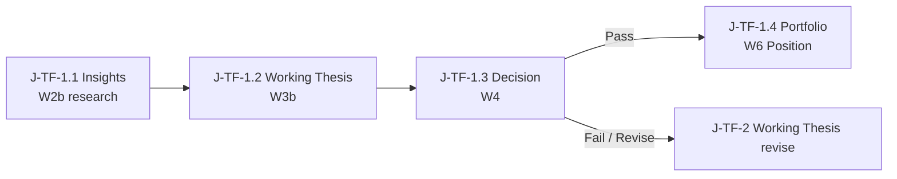

# User Journeys with Wireframes (Phase 1)
## DP Stock-Investment Assistant

| Field | Value |
|-------|-------|
| Parents | [`PRODUCT_SPECIFICATION.md`](./PRODUCT_SPECIFICATION.md) (SSOT) · [`CONCEPTUAL_IA_MAP.md`](./CONCEPTUAL_IA_MAP.md) v0.8.1 |
| Version | v0.7.1 |
| Date | 2026-09-24 |
| Status | Draft v0.7.1 — Pass→Position; Case=optional binder; Working Thesis; persona/journey J-TF (Techno-Fundamental Investor) |
| Persona | Techno-Fundamental Investor (default) |
| Supersedes | `CONCEPTUAL_WIREFRAMES.md` (renamed / merged 2026-09-24); journeys v0.6.0 (Pass-as-Case model retired) |

> **Purpose.** One PO-facing doc: **conceptual user journeys** (flow) plus the **ASCII proof frames** that make each step evaluable. Ready later for a thin Figma click-through (hotspots on these frames — not a new visual language).  
> **Not this doc:** Pixel UI, components, routes, FE stack, Gen-UI widgets, Mentor, chart libraries.

### How to read (efficient path)
1. Skim **Locked cues** (shell + chart + **what Pass creates**).  
2. Walk **J-TF-1** (Pass path → Portfolio **Position**; optional Case link).  
3. Walk **J-TF-2** (Fail/Revise → **no Position**; stay **Working Thesis** in Sandbox).  
4. Open proof frames (Wn) when you need the desk picture.  
5. Use **Figma handoff** when you want a clickable prototype.

### Locked cues (every step / frame)
1. **Top chrome = Z2 Context ONLY** (not Z1)  
2. **Left sidebar (left of Z3) = Z1a Dual-Track + Z1b Lifecycle** — two cues, one rail  
3. **Primary = Z3 (wide) + Z4 (companion)**  
4. Default land **Insights** · **Decision** = explicit promotion gate  
5. **Decision Pass creates a Position** (Track B / Portfolio execution-risk object: size, stop, official book). **Fail/Revise never creates a Position.** **Investment Case** is an **optional narrative binder / dossier thread** — can start anytime (often at Thesis); **not** born at Pass; **not** the Position. Pre-Pass Sandbox state = **Working Thesis** (or Insights without Thesis). After Pass, Thesis may attach as "why we hold" to the Position.  
6. **Z4** companion only · **Multi-stance** lives **inside Thesis only** (≠ Dual-Track)  
7. **Sandbox Z3 FINALIZED:** docked price-chart market anchor + active Core (Insights / Working Thesis) so the **whole research/thesis picture** is viewed on the price chart. On **Pass**, a **Position** is created on Portfolio (Thesis may attach as why we hold). **Case is not born at Pass.** Chart **yields at Decision** to a **thin strip and/or carried levels** (levels travel on Pass). Track B does not auto-apply the Sandbox chart-anchor rule  

*Prior cue “top chrome Z1a+Z1b+Z2” is **superseded** (2026-09-23).*  
*Prior cue that treated Pass as Case creation / early Case research naming is **superseded** (FREEZE 2026-09-24).*

### Index
| ID | Kind | What |
|----|------|------|
| **J-TF-1** | Journey | Techno-Fundamental **Pass**: Insights → Working Thesis → Decision **Pass** → Portfolio **Position** (+ optional Case link) |
| **J-TF-2** | Journey | Techno-Fundamental **Fail/Revise**: same path to Decision → **no Position**; stay Working Thesis in Sandbox |
| W1 | Frame | Empty Adaptive Workspace shell |
| W2 / **W2b** | Frame | Insights landing (+ chart) — Working Thesis / Insights research |
| W3 / **W3b** | Frame | Working Thesis + Multi-stance (+ chart) |
| W4 | Frame | Decision gate (chart yields); Pass→Position / Fail→Working Thesis revise |
| W5 | Frame | Fail/Revise Working Thesis desk — **no Position** |
| W6 | Frame | Portfolio after **Pass** — **Position** (+ optional Case chip if linked; Thesis link) |

---

## Part A — Journey spines

### J-TF-1 — Techno-Fundamental Pass → Portfolio Position (primary)

**Intent.** A Techno-Fundamental user researches on Track A (Sandbox), builds a **Working Thesis** (Living Thesis) with Bull/Bear inside Thesis, passes Decision, and a **Position** is created on Track B (Portfolio). Thesis may attach as "why we hold." An **Investment Case** may optionally link as narrative binder — anytime, not required.

**Ontology (locked):**
- **Pass → Position** (execution-risk object). Fail/Revise → no Position.
- **Working Thesis / Living Thesis** = reasoned argument (Multi-stance). Thesis ≠ Position ≠ Case.
- **Investment Case** = optional narrative binder / dossier thread. Groups related Core objects when the user wants one coherent story. NOT born at Pass, NOT the Position, NOT required to research or promote.

**Spec anchors (SSOT):** Dual-Track · Multi-stance · Position (post-Pass) · optional Case binder · Decision gate · Phase 1 Insights landing.  
**IA anchors:** Z2 top · Z1 left of Z3 · Z3+Z4 · LOCK-5 chart · LOCK-6 shell · Position born at Pass.



#### Step table

| Step | User intent | Spec focus | IA placement | Proof frame | Entry | Exit / done | Branches | Out of scope |
|------|-------------|------------|--------------|-------------|-------|-------------|----------|--------------|
| **J-TF-1.1** | Gather evidence on a symbol at Insights | Insights first; provenance; Dual-Track both visible; **no Position yet**; Case optional/not required | Z2: symbol + Insights cue · Z1a Sandbox* · Z1b **I** · Z3 Insight + docked chart · Z4 aide | **W2b** | Open Workspace / pick symbol | Enough evidence to start Working Thesis | Stay on Insights; screener branch J-TF-B1; optional Case bind anytime (soft UX) | FE pixels; treating Case as required |
| **J-TF-1.2** | Form Working / Living Thesis with Bull/Bear | Multi-stance ≠ Dual-Track; still Track A; Thesis = argument; **still no Position** | Z2: Thesis cue · Z1b **T** · Z3 Working Thesis + Multi-stance + docked chart · Z4 aide | **W3b** | From Insights when ready | Thesis ready to challenge at Decision | Back to Insights; optional Case bind at Thesis (soft UX lean) | Separate Bull/Bear “tracks”; Case = Thesis |
| **J-TF-1.3** | Explicit promote-or-revise gate | Decision / pre-mortem; **Pass creates Position**; Fail does not; Case not born here | Z2: Decision·GATE · Z1b **D** · Z3 checklist owns desk; chart yields (thin strip / carried levels) · Z4 aide | **W4** | From Thesis when ready | **Pass** → J-TF-1.4 Position · **Fail/Revise** → J-TF-2 | Payload: fund↔tech alignment; levels; size vs book peek | Silent risk mutation; treating Case as Pass result |
| **J-TF-1.4** | Work the **Position** on Track B | Portfolio = Position home after Pass; Thesis may attach; optional Case chip if linked; Sandbox preserved | Z2: Portfolio · **Position** cue · optional Case chip if linked · Z1a PORTF* · Z1b **P** · Z3 size/stop/levels · Z4 aide | **W6** | Decision **Pass** | Position active (size / stop / levels / thesis link); Case link optional | Return to Sandbox lane visible; Monitoring later; UI may offer "Start a Case for this Position" | Chart-anchor auto-apply on Track B; Case as execution object |

**Success for J-TF-1.** Reader sees: pre-Pass = Working Thesis / Insights research; **Pass = Position born**; Portfolio hosts **Position** (execution risk); Thesis may attach; Case remains optional binder; chart-at-research / yield-at-Decision.

**Soft UX lean (not ontology):** UI may offer Case bind at Thesis or after Pass ("Start a Case for this Position" / attach Position into existing Case) — optional only.

---

### J-TF-2 — Techno-Fundamental Fail / Revise → Working Thesis (no Position)

**Intent.** Same path to Decision, but outcome is **Fail or Revise**. **No Position** is created. Work stays as a **Working Thesis** in Sandbox (revise Thesis, park research, or exit).

| Step | Delta vs Pass path | Proof frame |
|------|--------------------|-------------|
| **J-TF-2.1–2.2** | Same as J-TF-1.1–1.2 (Working Thesis / Insights research) | W2b / W3b |
| **J-TF-2.3** | At W4 choose **Revise** or fail checklist | **W4** |
| **J-TF-2.4** | Return to Working Thesis (or park) — **no Position**; still Sandbox | **W5** |

**Rule.** **Fail ≠ Position.** No Portfolio risk mutation. Optional later: archive / Journal stub (J-TF-B4) without promoting. Case binder state unchanged (linked or Case-off) — Fail neither creates nor requires a Case.

---

### Optional journey branches (Phase 1 — named, no new frames)

Deferred from competitor / Techno-Fundamental desk practice. **Branches only** — do not invent Wn artboards in Phase 1.

| Branch ID | From | Idea | Defer note |
|-----------|------|------|------------|
| **J-TF-B1** | before J-TF-1.1 | Screener / watchlist → Insights | TradingView / Fireant-style entry |
| **J-TF-B2** | J-TF-1.1 | Peer / sector compare while on Insights | Before Thesis; depth tools later |
| **J-TF-B3** | after promote / later | Event / news interrupt → reopen Thesis (or Position monitoring) | Monitoring domain — later phase |
| **J-TF-B4** | J-TF-1.3 / 1.4 | Post-Pass journal stub on Position | One checklist line “note process”; not full Journal domain |

Do **not** add case-library-first or chart-tab-as-product branches in Phase 1.

---
## Part B — Proof frames (ASCII)

Frames prove IA. Journeys cite them; do not invent a second zone map.

### Frame index
| ID | Frame | Proves | Used by |
|----|--------|--------|---------|
| W1 | Empty shell | Z2 top · Z1 left · Z3+Z4 anatomy | Orientation / Figma start |
| W2 | Insights research | Techno-Fundamental default landing · Track A | J-TF-1.1 (no-chart variant) |
| W2b | Insights + chart | Sandbox chart-anchor FINALIZED | **J-TF-1.1** default |
| W3 | Working Thesis + Multi-stance | Bull/Bear ≠ Dual-Track | J-TF-1.2 (no-chart variant) |
| W3b | Working Thesis + chart | Chart + Thesis Core FINALIZED | **J-TF-1.2** default |
| W4 | Decision gate | Promotion A→B · chart yields · Pass→Position | **J-TF-1.3** / **J-TF-2.3** |
| W5 | Fail/Revise · Working Thesis | **No Position**; revise/park | **J-TF-2.4** |
| W6 | Portfolio after **Pass** | **Position** (+ optional Case chip; Thesis link) | **J-TF-1.4** |

---

### W1 — Empty Adaptive Workspace shell
**Proves:** Z2 top chrome; Z1 left rail left of Z3; primary Z3+Z4; Dual-Track both visible; **no Position yet**; Case not required; Z4 companion not product

Empty shell only — no Core object yet.

```text
+==========================================================================+
| TOP CHROME — Z2 CONTEXT ONLY                                       Z2   |
| [sym] [dom:—]                                                         |
+------------------+-----------------------------------+------------------+
| Z1 LEFT RAIL     | Z3 PRIMARY (wide)                 | Z4 COMPANION     |
| Z1a Dual-Track   | ( empty desk )                    | (empty aide)     |
| [Sandbox | Portf | Place Core work here              | Helps; does not  |
| both visible     |                                   | replace Core     |
|                  |                                   | objects          |
| Z1b Lifecycle    |                                   |                  |
| Z1b I→T→D→P      |                                   |                  |
+------------------+-----------------------------------+------------------+
```

---

### W2 — Insights landing (Working Thesis / Insights research)
**Proves:** Phase 1 lands on Insights; Track A Sandbox; **no Position**; evidence in Z3; Case not required  
**Journey:** J-TF-1.1 (no-chart variant)

```text
+==========================================================================+
| TOP CHROME — Z2 CONTEXT ONLY                                       Z2   |
| [VNM] [Insights]                                                          |
+------------------+-----------------------------------+------------------+
| Z1 LEFT RAIL     | Z3 PRIMARY (wide)                 | Z4 COMPANION     |
| Z1a Dual-Track   | * INSIGHT (active)                | "Summarize FOL & |
| [SANDBOX*| Portf | +-------------------------------+ |  foreign flow fo |
| both visible     | | Evidence / cards              | |  VNM..."         |
|                  | | Provenance strip              | |                  |
| Z1b Lifecycle    | +-------------------------------+ | (draft / explain |
| Z1b [I] T D P    | Next: build Working Thesis        |                  |
+------------------+-----------------------------------+------------------+
```

---

### W2b — Insights + price chart anchor (Sandbox)
**Proves:** Sandbox Z3 = docked price chart + Insight Core; chart not a Core domain  
**Journey:** **J-TF-1.1** default proof  

*Rationale (locked): whole **research/thesis** picture in view of the price chart. Pass later creates a **Position** (not a Case).*

```text
+==========================================================================+
| TOP CHROME — Z2 CONTEXT ONLY                                       Z2   |
| [VNM] [Insights]                                                          |
+------------------+-----------------------------------+------------------+
| Z1 LEFT RAIL     | Z3 PRIMARY (wide)                 | Z4 COMPANION     |
| Z1a Dual-Track   | +-- market anchor (docked) -----+ | "Mark levels tha |
| [SANDBOX*| Portf | | PRICE CHART  VNM              | |  matter for this |
| both visible     | +-------------------------------+ |  evidence..."    |
|                  | * INSIGHT (active Core)           |                  |
| Z1b Lifecycle    | | Evidence / cards + provenance | | (helps; chart is |
| Z1b [I] T D P    | Chart docks; Insight stays primar |  not the product |
+------------------+-----------------------------------+------------------+
```

---

### W3 — Working Thesis + Multi-stance (still Sandbox)
**Proves:** Working / Living Thesis in Z3; Bull/Bear inside Thesis; still Track A; Thesis ≠ Position  
**Journey:** J-TF-1.2 (no-chart variant)

```text
+==========================================================================+
| TOP CHROME — Z2 CONTEXT ONLY                                       Z2   |
| [VNM] [Working Thesis]                                                    |
+------------------+-----------------------------------+------------------+
| Z1 LEFT RAIL     | Z3 PRIMARY (wide)                 | Z4 COMPANION     |
| Z1a Dual-Track   | * WORKING / LIVING THESIS         | "Contrast Bull v |
| [SANDBOX*| Portf | +---------------+---------------+ |  Bear catalysts. |
| both visible     | | BULL stance   | BEAR stance   | |                  |
|                  | | claims / evid | claims / evid | |                  |
| Z1b Lifecycle    | +---------------+---------------+ |                  |
| Z1b I [T] D P    | Multi-stance != Dual-Track lanes  |                  |
+------------------+-----------------------------------+------------------+
```

---

### W3b — Working Thesis + Multi-stance + price chart anchor (Sandbox)
**Proves:** Chart market anchor + Thesis Core; Multi-stance inside Thesis  
**Journey:** **J-TF-1.2** default proof  

*Same lock as W2b: one desk grounded on price; Multi-stance stays inside Thesis. Chart yields at Decision.*

```text
+==========================================================================+
| TOP CHROME — Z2 CONTEXT ONLY                                       Z2   |
| [VNM] [Working Thesis]                                                    |
+------------------+-----------------------------------+------------------+
| Z1 LEFT RAIL     | Z3 PRIMARY (wide)                 | Z4 COMPANION     |
| Z1a Dual-Track   | +-- market anchor (docked) -----+ | "Contrast Bull v |
| [SANDBOX*| Portf | | PRICE CHART  VNM              | |  Bear at these   |
| both visible     | +-------------------------------+ |  prices..."      |
|                  | * WORKING THESIS (active Core)    |                  |
| Z1b Lifecycle    | | BULL stance  | BEAR stance    | |                  |
| Z1b I [T] D P    | Chart docks; Thesis stays primary |                  |
+------------------+-----------------------------------+------------------+
```

---

### W4 — Decision gate (promotion A→B)
**Proves:** Explicit Z3 Decision gate; chart **yields**; Sandbox until Pass; **Pass → Position**  
**Journey:** **J-TF-1.3** (Pass) / **J-TF-2.3** (Fail/Revise)

Sandbox chart-anchor **yields** here: **checklist owns Z3**; a **thin chart / levels strip** stays so price context is not orphaned; named levels travel into checklist / Pass payload.

```text
+==========================================================================+
| TOP CHROME — Z2 CONTEXT ONLY                                       Z2   |
| [VNM] [Decision·GATE]                                                     |
+------------------+-----------------------------------+------------------+
| Z1 LEFT RAIL     | Z3 PRIMARY (wide)                 | Z4 COMPANION     |
| Z1a Dual-Track   | +-- chart YIELDED (thin strip) -+ | "Walk checklist  |
| [SANDBOX*| Portf | | levels: inv / entry / stop    | |  against Thesis… |
| both visible     | +-------------------------------+ |                  |
|                  | * DECISION / PRE-MORTEM GATE      |                  |
| Z1b Lifecycle    | [ ] Fund ↔ tech alignment named   |                  |
| Z1b I T [D] P    | [ ] Levels as payload (travel)    |                  |
|                  | [ ] Size vs book heat (peek only) |                  |
|                  | [ ] Evidence / invalidation OK    |                  |
|                  | [ Pass → Position ]  [ Revise ]   |                  |
|                  | Portfolio risk unchanged until Pa |                  |
+------------------+-----------------------------------+------------------+
```

*Pass → **Position** created on Portfolio (go to W6). Thesis may attach as why we hold. Case is **not** born here (optional binder anytime). Fail/Revise → Working Thesis revise (go to W5). Yield ≠ delete chart without carrying levels.*

---

### W5 — Fail / Revise · Working Thesis desk (no Position)
**Proves:** After Decision Fail/Revise, work returns to Working Thesis (or parks) **without** a Position; Dual-Track still Sandbox-emphasized  
**Journey:** **J-TF-2.4**

```text
+==========================================================================+
| TOP CHROME — Z2 CONTEXT ONLY                                       Z2   |
| [VNM] [Working Thesis] · no Position                                      |
+------------------+-----------------------------------+------------------+
| Z1 LEFT RAIL     | Z3 PRIMARY (wide)                 | Z4 COMPANION     |
| Z1a Dual-Track   | * WORKING THESIS (revise)         | "What failed the |
| [SANDBOX*| Portf | Multi-stance still available      |  gate? Tighten   |
| both visible     | Fail ≠ Position                   |  invalidation…"  |
|                  | Optional: park / archive later    |                  |
| Z1b Lifecycle    | Portfolio risk unchanged          |                  |
| Z1b I [T] D P    |                                   |                  |
+------------------+-----------------------------------+------------------+
```

---

### W6 — Portfolio after Pass · Position (+ optional Case)
**Proves:** Track B emphasized; **Position** present because Pass created it; Thesis link ("why we hold"); optional Case chip **only if linked**; Sandbox lane still visible; carried levels from Decision  
**Journey:** **J-TF-1.4**

**Pass = Position birth.** Case remains optional narrative binder (may already be linked, or UI may offer "Start a Case for this Position").

```text
+==========================================================================+
| TOP CHROME — Z2 CONTEXT ONLY                                       Z2   |
| [VNM] [Position] [Portfolio] · optional [Case chip if linked]            |
+------------------+-----------------------------------+------------------+
| Z1 LEFT RAIL     | Z3 PRIMARY (wide)                 | Z4 COMPANION     |
| Z1a Dual-Track   | * POSITION (execution risk)       | "Restate stop &  |
| [Sandbox | PORTF | Holding / size / stop             |  pyramid rules.. |
| both visible     | Carried levels from Decision Pass |                  |
|                  | Thesis link (why we hold)         |                  |
| Z1b Lifecycle    | Optional Case binder if linked    |                  |
| Z1b I T D [P]    | Sandbox research preserved        |                  |
+------------------+-----------------------------------+------------------+
```

---

## Part C — Figma handoff (Phase B, later)

| Prototype | Start | Hotspots only |
|-----------|-------|---------------|
| J-TF-1 Pass | W2b | → W3b → W4 → **Pass** → W6 (**Position**; optional Case chip) |
| J-TF-2 Fail | W2b | → W3b → W4 → **Revise/Fail** → W5 (Working Thesis; no Position) |

Rules: reuse these ASCII frames as artboards; no new visual system; if Figma disagrees with this doc + Spec, **markdown + Spec win** until you change them.

---

## Part D — Success check
A PO can answer from this file alone:
- **Pass → Position** on Portfolio (size / stop / official book); Thesis may attach  
- **Fail/Revise → no Position**; stay **Working Thesis** in Sandbox  
- **Case** = optional narrative binder anytime — **not** born at Pass; **not** the Position  
- That top chrome is Z2 only (Z1 = left rail)  
- Where Dual-Track lives vs Multi-stance vs lifecycle  
- That assistant (Z4) is not the product  
- That Sandbox chart-anchor stays FINALIZED and yields at Decision  
- That research does **not** require a Case  

---

*End · User Journeys with Wireframes · v0.7.1 · Pass→Position · Case=optional binder · Working Thesis · Techno-Fundamental Investor · J-TF-1/2 · W1–W6 · 2026-09-24*
