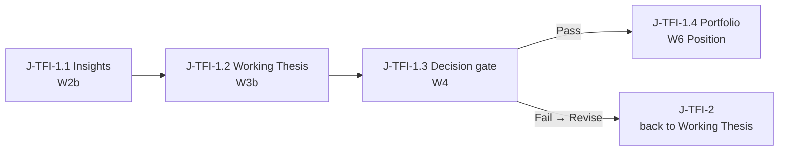

# User Journeys with Wireframes (Phase 1)

| Field | Value |
|---|---|
| Document | User Journeys with Wireframes · DP Stock-Investment Assistant |
| Version | v1.0.0 |
| Date | 2026-09-25 |
| Status | Review · frames = snapshot release journey-v1.0.0 |
| Owner | Phan Duy |
| Related | [Spec v1.7.0](./PRODUCT_SPECIFICATION.md) · [IA map v1.0.0](./CONCEPTUAL_IA_MAP.md) · `frames.json` → Figma (Journeys v1.0.0) |

> **Purpose.** One PO-facing doc: the Phase 1 conceptual journeys for the Techno-Fundamental Investor (TFI) and the frames that make each step evaluable.  
> **Not this doc:** pixel UI, components, routes, FE stack, Gen-UI widgets, Mentor, chart libraries.

> **Frames.** The images below are snapshot release **journey-v1.0.0** (2026-09-25), exported from Figma. The [Live Figma page](https://www.figma.com/design/Jy1qyQeJJT1gaQVar8KJLd/?node-id=0-1) may be ahead of them (for example, v1.0.0 text fixes to zone and track labels land in the live frames first).

Terms follow Spec §0.2 (glossary). This doc defines no terms of its own.

---

## 1. How to use this doc

### 1.1 Reading path

1. Skim §1.3 for the shell and the locks every frame obeys.
2. Walk J-TFI-1 (§2.1): Decision gate Pass → Position on Portfolio.
3. Walk J-TFI-2 (§2.2): Decision gate Fail → Revise → no Position; back to the Working Thesis.
4. Open a frame (§3) when you need the picture.
5. Use §4 for the clickable Figma prototype.

### 1.2 Sources of truth (precedence)

| Content | Owner (normative) |
|---|---|
| IDs (journeys, steps, branches, frames), ontology, flow logic | Markdown: Spec > IA map > Journeys |
| Frame layout, on-frame text, CTA labels, prototype links | `frames.json` → Figma |

When the two disagree, fix the owner rather than the copy. ASCII frames are retired as of v1.0.0; the v0.8.2 ASCII frames remain in Appendix A for one version.

### 1.3 Shell and locks (pointers)

Every frame follows these rules; they are defined elsewhere and not restated here.

- **Layout lock** (IA §2.6): Z2 Top chrome holds context plus the right-corner utilities slot; Z1 Left sidebar sits left of Z3 and shows conceptual Dual-Track and Lifecycle status only (no chips, no hotspots); Z3 Main workspace and Z4 AI companion take the remaining width.
- **Stage moves:** Z3 CTA buttons (**Continue to Working Thesis**, **Go to Decision gate**). The Z1 Lifecycle list is status, not navigation.
- **Sandbox chart lock** (IA §2.4): docked price chart in Sandbox Z3; it yields at the Decision gate and named levels travel on Pass; Track B does not auto-apply it.
- **Ontology and gate outcomes** (Spec §4.6): Pass → Position; Fail → Revise, no Position; Investment Case optional (Case-on / Case-off).
- **Default landing:** Insights (IA §8 #2).

### 1.4 Index

| ID | Kind | What |
|---|---|---|
| **J-TFI-1** | Journey | Pass: Insights → Working Thesis → Decision gate Pass → Position on Portfolio |
| **J-TFI-2** | Journey | Fail/Revise: same path to the Decision gate → Revise, no Position → Working Thesis |
| **J-TFI-B1–B4** | Branch | Named branches without frames (§2.3) |
| **W1–W6, W2b, W3b** | Frame | 8 frames (§3) |

---

## 2. Journeys

### 2.1 J-TFI-1 · Pass → Position on Portfolio (primary)

**Intent.** The TFI researches on Track A · Research Sandbox, builds a Working Thesis with parallel Bull/Bear stances, passes the Decision gate, and a Position is created on Track B · Execution Portfolio. The Thesis then attaches as "why we hold". An Investment Case may be linked at any time; it is never required.

**Anchors.** Spec §0.4 (Phase 1 cut line), §2.5 (Dual-Track), §4.6 (ontology). IA §2.6 (layout lock), §2.4 (chart lock), §3 (placement).



#### 2.1.1 Steps

| Step | User intent | Spec focus | Placement (zones) | Frame | Entry → Exit |
|---|---|---|---|---|---|
| **J-TFI-1.1** | Gather evidence on a symbol | Insights first; provenance; both tracks visible; no Position | Z2 symbol + Insights · Z1 A, > Insights · Z3 Insight + docked chart · Z4 | W2b | Open Workspace / pick symbol → Z3 CTA **Continue to Working Thesis** |
| **J-TFI-1.2** | Form the Working Thesis with Bull/Bear | Multi-stance ≠ Dual-Track; still Track A; no Position | Z2 Working Thesis · Z1 A, > Thesis · Z3 Working Thesis + Multi-stance + docked chart · Z4 | W3b | From Insights → Z3 CTA **Go to Decision gate** |
| **J-TFI-1.3** | Promote or revise | Pre-mortem checklist; Pass creates a Position, Fail does not; no Case is created | Z2 Decision gate · Z1 A, > Decision · Z3 checklist, chart yielded · Z4 | W4 | From Working Thesis → **Pass → Position** (J-TFI-1.4) or **Revise** (J-TFI-2) |
| **J-TFI-1.4** | Work the Position on Track B | Portfolio hosts the Position; Thesis attached; Case chip only when Case-on | Z2 Position + Portfolio (+ Case chip) · Z1 B, > Portfolio · Z3 size / stop / levels · Z4 | W6 | Decision gate Pass → Position active (size, stop, carried levels) |

**Step notes** (branches and out of scope):
- **1.1:** may stay on Insights; screener entry is J-TFI-B1. A Case may be linked at any time (soft UX). Out of scope: FE pixels; treating the Case as required.
- **1.2:** may go back to Insights (prototype link, §2.4); optional Case link at Thesis (soft UX). Out of scope: Bull/Bear as separate tracks; Case = Thesis.
- **1.3:** checklist payload = fundamental ↔ technical alignment, named levels, size vs book (peek only). Out of scope: silent risk mutation; a Case as the Pass result.
- **1.4:** the Sandbox stays visible; Monitoring comes later; UI may offer "Start a Case for this Position". Out of scope: the chart-anchor rule on Track B; the Case as an execution object.

**Soft UX lean (not ontology).** The UI may offer a Case link at Thesis or after Pass ("Start a Case for this Position", or attach the Position to an existing Case). Optional only.

### 2.2 J-TFI-2 · Fail → Revise → Working Thesis (no Position)

**Intent.** Same path to the Decision gate, but the checklist is not met: the outcome is Fail and the action is **Revise** (Spec §4.6). No Position is created; the work returns to the Working Thesis in the Sandbox, where it can be revised, parked or dropped.

| Step | Delta vs J-TFI-1 | Frame |
|---|---|---|
| **J-TFI-2.1–2.2** | Same as J-TFI-1.1–1.2 | W2b / W3b |
| **J-TFI-2.3** | Checklist not met (Fail); choose **Revise** at the Decision gate | W4 |
| **J-TFI-2.4** | Back to the Working Thesis (or park); no Position; still Sandbox | W5 |

**Rule.** Fail never creates a Position and never mutates Portfolio risk. The Case state is unchanged (Case-on or Case-off); Fail neither creates nor requires a Case. An archive or Journal stub is optional later (J-TFI-B4).

### 2.3 Branches (Phase 1: named, no frames)

Deferred from competitor and TFI desk practice. Do not create Wn frames for them in Phase 1.

| Branch ID | From | Idea | Defer note |
|---|---|---|---|
| **J-TFI-B1** | Before J-TFI-1.1 | Screener / watchlist → Insights | TradingView / Fireant-style entry |
| **J-TFI-B2** | J-TFI-1.1 | Peer / sector compare while on Insights | Before Thesis; depth tools later |
| **J-TFI-B3** | After Pass / later | Event or news interrupt → reopen Thesis (or Position monitoring) | Monitoring domain, later phase |
| **J-TFI-B4** | J-TFI-1.3 / 1.4 | Post-Pass Journal stub on the Position | One checklist line "note process"; not the full Journal domain |

Do not add Case-library-first or chart-tab-as-product branches in Phase 1.

### 2.4 Prototype-only links (no flow)

`frames.json` also carries links that belong to no journey. They help a reviewer move around the prototype and carry no flow logic.

| From → To | Hotspot | Where |
|---|---|---|
| W3b → W2b | Back to Insights | Z3 CTA |
| W1 → W2b | `[sym]` | Z2 symbol |
| W2 → W3 | Next: build Working Thesis | Z3 line (no-chart variant) |
| W3 → W4 | Go to Decision gate | Z3 CTA (no-chart variant) |

---

## 3. Frames

Frames prove the IA map; they do not define a second zone map. Each frame shows its intent and the steps it serves; layout and on-frame text belong to `frames.json` (§1.2).

### 3.1 Frame index
| ID | Frame | Proves | Used by |
|---|---|---|---|
| W1 | Empty Adaptive Workspace shell | Zone anatomy: Z2, Z1 (nothing active), Z3 + Z4 | Orientation / Figma start |
| W2 | Insights landing (no-chart variant) | Insights default landing on Track A | J-TFI-1.1 (variant) |
| W2b | Insights + chart | Sandbox chart lock with the Insight Core | **J-TFI-1.1**, **J-TFI-2.1** |
| W3 | Working Thesis + Multi-stance (no-chart variant) | Bull/Bear ≠ Dual-Track | J-TFI-1.2 (variant) |
| W3b | Working Thesis + chart | Sandbox chart lock with the Working Thesis Core | **J-TFI-1.2**, **J-TFI-2.2** |
| W4 | Decision gate | Promotion A → B; chart yields; Pass → Position, Revise | **J-TFI-1.3**, **J-TFI-2.3** |
| W5 | Fail/Revise · Working Thesis | No Position; revise or park | **J-TFI-2.4** |
| W6 | Portfolio after Pass · Position | Position born at Pass; Thesis = why we hold; Case chip only when Case-on | **J-TFI-1.4** |

### 3.2 W1 · Empty Adaptive Workspace shell


- **Intent:** the empty shell proves the zone anatomy before any Core object exists; Z4 AI companion is not the product.
- **Serves:** orientation and the Figma start (no journey step).

### 3.3 W2 · Insights landing (no-chart variant)


- **Intent:** Phase 1 lands on Insights on Track A; evidence lives in Z3; no Position; no Case required.
- **Serves:** J-TFI-1.1 (no-chart variant).

### 3.4 W2b · Insights + chart


- **Intent:** Sandbox Z3 = docked price chart plus the active Insight Core; the chart is a market anchor, not a Core domain.
- **Serves:** J-TFI-1.1 and J-TFI-2.1 (default frame; flow start).

### 3.5 W3 · Working Thesis + Multi-stance (no-chart variant)


- **Intent:** the Working Thesis holds parallel Bull/Bear stances (Living Thesis capability); still Track A; Thesis ≠ Position.
- **Serves:** J-TFI-1.2 (no-chart variant).

### 3.6 W3b · Working Thesis + chart


- **Intent:** same chart lock as W2b with the Working Thesis as the active Core; still Sandbox, still no Position.
- **Serves:** J-TFI-1.2 and J-TFI-2.2 (default frame).

### 3.7 W4 · Decision gate


- **Intent:** explicit promote-or-revise gate; the checklist owns Z3 and the chart yields to a thin levels strip; Pass → Position, Revise creates nothing (Spec §4.6).
- **Serves:** J-TFI-1.3 (Pass → W6) and J-TFI-2.3 (Revise → W5).

### 3.8 W5 · Fail/Revise · Working Thesis


- **Intent:** after Fail, the work returns to the Working Thesis (or parks) in the Sandbox with no Position.
- **Serves:** J-TFI-2.4.

### 3.9 W6 · Portfolio after Pass · Position


- **Intent:** Track B emphasized; the Position exists because Pass created it, with carried levels and the Thesis attached as why we hold; the Case chip shows only when Case-on.
- **Serves:** J-TFI-1.4.
- **Note:** the snapshot still shows a dashed "Thesis link" hotspot; that link was dropped in v1.0.0 (a post-Pass Thesis view is a future frame, §6).

---

## 4. Figma prototype

Source: `frames.json` (Journeys v1.0.0) rendered into the [Live Figma page](https://www.figma.com/design/Jy1qyQeJJT1gaQVar8KJLd/?node-id=0-1).

| Prototype | Start | Flow hotspots |
|---|---|---|
| J-TFI-1 Pass | W2b | → W3b → W4 → **Pass → Position** → W6 |
| J-TFI-2 Fail | W2b | → W3b → W4 → **Revise** → W5 |

W2b → W3b is the Z3 CTA **Continue to Working Thesis**; W3b → W4 is the Z3 CTA **Go to Decision gate**. Z1 lines are never hotspots. Prototype-only links are listed in §2.4. Frames are edited in place in `frames.json`, never duplicated.

---

## 5. Success check

A PO can answer from this doc alone:
- What Pass does: creates a Position on Portfolio (size, stop, official book); the Thesis attaches as why we hold.
- What Fail does: nothing is created; Revise returns the work to the Working Thesis in the Sandbox.
- What a Case is: an optional binder at any time, not born at Pass and not the Position; research never requires one.
- Where things sit: Z2 Top chrome (+ utilities slot), Z1 Left sidebar with Dual-Track and Lifecycle status, Z3 Main workspace, Z4 AI companion (not the product).
- How Dual-Track, Multi-stance and the Lifecycle differ, and that stage moves use Z3 CTAs.
- That the Sandbox chart lock holds in research and yields at the Decision gate.

---

## 6. Backlog and open items

| # | Item | Note |
|---|---|---|
| 1 | Post-Pass "why we hold" Thesis view | Future frame. Would restore a W6 → Thesis link, targeting a post-Pass view rather than the pre-Pass W3b. |
| 2 | Per-frame Figma links | Add "Live frame (working)" links per frame once node ids are on record from a Validate run. |
| 3 | Next snapshot release | Re-export the 8 PNGs after the v1.0.0 text fixes (zone and track labels, W6 link removal, Z1 title overlap fix in the plugin). |
| 4 | Remove Appendix A | Drop the legacy ASCII frames in the next version. |
| 5 | Detailed Z1 sidebar and Z2 utilities design | Deferred per IA §2.6. |

---

## 7. Change log

| Version | Date | Change |
|---|---|---|
| v1.0.0 | 2026-09-25 | Cleanup release. ASCII frames replaced by snapshot images (release journey-v1.0.0), old ASCII moved to Appendix A. Precedence rule added (§1.2). Shell, chart and ontology rules replaced by pointers to IA §2.6 / §2.4 and Spec §4.6. Canonical zone, track and Thesis names. Fail = outcome, Revise = action. W6 → W3b "Thesis link" dropped (future frame, §6). Prototype-only links listed (§2.4). Step table split into steps + notes. Numbered sections; uniform header. |
| v0.8.2 | 2026-09-25 | Follow IA v0.9.1: Z1 column in all 8 frames shows the conceptual Dual-Track and Lifecycle groups with the active track and stage marked. |
| v0.8.1 | 2026-09-25 | Follow IA v0.9.0: single narrower Z1 sidebar; Z2 utilities slot; stage moves via Z3 CTAs. |
| v0.8.0 | 2026-09-25 | Pass → Position; Case = optional binder; Working Thesis; J-TFI journeys and W1–W6 frames. Supersedes `CONCEPTUAL_WIREFRAMES.md` (merged 2026-09-24) and journeys v0.6.0 (Pass-as-Case model retired). |

---

## Appendix A. Legacy ASCII frames (v0.8.2)

Kept for one version for reference only; superseded by §3 and removed in the next version. Text is as of v0.8.2 except the W6 line "Thesis (why we hold)" (the link was dropped in v1.0.0).

### A.1 W1 · Empty Adaptive Workspace shell

```text
+=========================================================================+
| TOP CHROME — Z2 CONTEXT                         [search · notif · acct] |
| [sym] [dom:—]                                                           |
+------------+--------------------------------------+---------------------+
|Z1 SIDEBAR  | Z3 PRIMARY (wide)                    | Z4 COMPANION        |
|DUAL-TRACK  | ( empty desk )                       | (empty aide)        |
|○ A Research| Place Core work here                 | Helps; does not     |
|○ B Portf.  |                                      | replace Core        |
|LIFECYCLE   |                                      | objects             |
|  Insights  |                                      |                     |
|  Thesis    |                                      |                     |
|  Decision  |                                      |                     |
|  Portfolio |                                      |                     |
+------------+--------------------------------------+---------------------+
```

### A.2 W2 · Insights landing (Working Thesis / Insights research)

```text
+=========================================================================+
| TOP CHROME — Z2 CONTEXT                         [search · notif · acct] |
| [VNM] [Insights]                                                        |
+------------+--------------------------------------+---------------------+
|Z1 SIDEBAR  | Z3 PRIMARY (wide)                    | Z4 COMPANION        |
|DUAL-TRACK  | * INSIGHT (active)                   | "Summarize FOL &    |
|● A Research| +-------------------------------+    |  foreign flow fo    |
|○ B Portf.  | | Evidence / cards              |    |  VNM..."            |
|LIFECYCLE   | | Provenance strip              |    |                     |
|> Insights  | +-------------------------------+    | (draft / explain    |
|  Thesis    | Next: build Working Thesis           |                     |
|  Decision  |                                      |                     |
|  Portfolio |                                      |                     |
+------------+--------------------------------------+---------------------+
```

### A.3 W2b · Insights + price chart anchor (Sandbox)

```text
+=========================================================================+
| TOP CHROME — Z2 CONTEXT                         [search · notif · acct] |
| [VNM] [Insights]                                                        |
+------------+--------------------------------------+---------------------+
|Z1 SIDEBAR  | Z3 PRIMARY (wide)                    | Z4 COMPANION        |
|DUAL-TRACK  | +-- market anchor (docked) -----+    | "Mark levels tha    |
|● A Research| | PRICE CHART  VNM              |    |  matter for this    |
|○ B Portf.  | +-------------------------------+    |  evidence..."       |
|LIFECYCLE   | * INSIGHT (active Core)              |                     |
|> Insights  | | Evidence / cards + provenance |    | (helps; chart is    |
|  Thesis    | Chart docks; Insight stays primar    |  not the product    |
|  Decision  | [ Continue to Working Thesis ]       |                     |
|  Portfolio |                                      |                     |
+------------+--------------------------------------+---------------------+
```

### A.4 W3 · Working Thesis + Multi-stance (still Sandbox)

```text
+=========================================================================+
| TOP CHROME — Z2 CONTEXT                         [search · notif · acct] |
| [VNM] [Working Thesis]                                                  |
+------------+--------------------------------------+---------------------+
|Z1 SIDEBAR  | Z3 PRIMARY (wide)                    | Z4 COMPANION        |
|DUAL-TRACK  | * WORKING / LIVING THESIS            | "Contrast Bull v    |
|● A Research| +---------------+---------------+    |  Bear catalysts.    |
|○ B Portf.  | | BULL stance   | BEAR stance   |    |                     |
|LIFECYCLE   | | claims / evid | claims / evid |    |                     |
|  Insights  | +---------------+---------------+    |                     |
|> Thesis    | Multi-stance != Dual-Track lanes     |                     |
|  Decision  | [ Go to Decision gate ]              |                     |
|  Portfolio |                                      |                     |
+------------+--------------------------------------+---------------------+
```

### A.5 W3b · Working Thesis + Multi-stance + price chart anchor (Sandbox)

```text
+=========================================================================+
| TOP CHROME — Z2 CONTEXT                         [search · notif · acct] |
| [VNM] [Working Thesis]                                                  |
+------------+--------------------------------------+---------------------+
|Z1 SIDEBAR  | Z3 PRIMARY (wide)                    | Z4 COMPANION        |
|DUAL-TRACK  | +-- market anchor (docked) -----+    | "Contrast Bull v    |
|● A Research| | PRICE CHART  VNM              |    |  Bear at these      |
|○ B Portf.  | +-------------------------------+    |  prices..."         |
|LIFECYCLE   | * WORKING THESIS (active Core)       |                     |
|  Insights  | | BULL stance  | BEAR stance    |    |                     |
|> Thesis    | Chart docks; Thesis stays primary    |                     |
|  Decision  | [ Go to Decision gate ]              |                     |
|  Portfolio |                                      |                     |
+------------+--------------------------------------+---------------------+
```

### A.6 W4 · Decision gate (promotion A→B)

```text
+=========================================================================+
| TOP CHROME — Z2 CONTEXT                         [search · notif · acct] |
| [VNM] [Decision·GATE]                                                   |
+------------+--------------------------------------+---------------------+
|Z1 SIDEBAR  | Z3 PRIMARY (wide)                    | Z4 COMPANION        |
|DUAL-TRACK  | +-- chart YIELDED (thin strip) -+    | "Walk checklist     |
|● A Research| | levels: inv / entry / stop    |    |  against Thesis…    |
|○ B Portf.  | +-------------------------------+    |                     |
|LIFECYCLE   | * DECISION / PRE-MORTEM GATE         |                     |
|  Insights  | [ ] Fund ↔ tech alignment named      |                     |
|  Thesis    | [ ] Levels as payload (travel)       |                     |
|> Decision  | [ ] Size vs book heat (peek only)    |                     |
|  Portfolio | [ ] Evidence / invalidation OK       |                     |
|            | [ Pass → Position ]  [ Revise ]      |                     |
|            | Portfolio risk unchanged until Pa    |                     |
+------------+--------------------------------------+---------------------+
```

### A.7 W5 · Fail / Revise · Working Thesis desk (no Position)

```text
+=========================================================================+
| TOP CHROME — Z2 CONTEXT                         [search · notif · acct] |
| [VNM] [Working Thesis] · no Position                                    |
+------------+--------------------------------------+---------------------+
|Z1 SIDEBAR  | Z3 PRIMARY (wide)                    | Z4 COMPANION        |
|DUAL-TRACK  | * WORKING THESIS (revise)            | "What failed the    |
|● A Research| Multi-stance still available         |  gate? Tighten      |
|○ B Portf.  | Fail ≠ Position                      |  invalidation…"     |
|LIFECYCLE   | Optional: park / archive later       |                     |
|  Insights  | Portfolio risk unchanged             |                     |
|> Thesis    |                                      |                     |
|  Decision  |                                      |                     |
|  Portfolio |                                      |                     |
+------------+--------------------------------------+---------------------+
```

### A.8 W6 · Portfolio after Pass · Position (+ optional Case)

```text
+=========================================================================+
| TOP CHROME — Z2 CONTEXT                         [search · notif · acct] |
| [VNM] [Position] [Portfolio] · optional [Case chip if linked]           |
+------------+--------------------------------------+---------------------+
|Z1 SIDEBAR  | Z3 PRIMARY (wide)                    | Z4 COMPANION        |
|DUAL-TRACK  | * POSITION (execution risk)          | "Restate stop &     |
|○ A Research| Holding / size / stop                |  pyramid rules..    |
|● B Portf.  | Carried levels from Decision Pass    |                     |
|LIFECYCLE   | Thesis (why we hold)                 |                     |
|  Insights  | Optional Case binder if linked       |                     |
|  Thesis    | Sandbox research preserved           |                     |
|  Decision  |                                      |                     |
|> Portfolio |                                      |                     |
+------------+--------------------------------------+---------------------+
```

---

*End of User Journeys with Wireframes · v1.0.0 · 2026-09-25*
