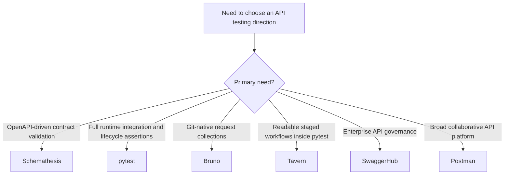
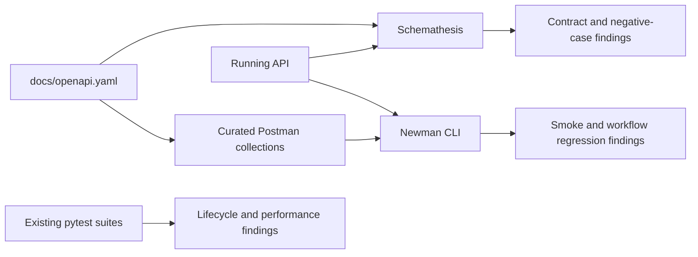
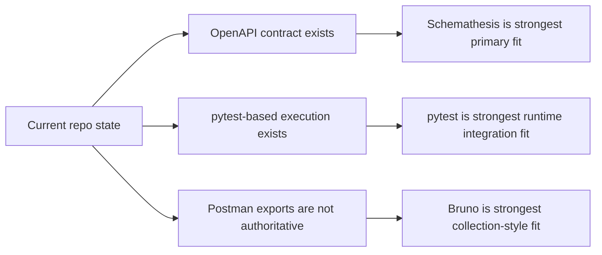

# API Test Tool Comparison Report

Date: 2026-03-25

## 1. Executive Summary

> [!IMPORTANT]
> For this repository, the strongest primary fit is [Schemathesis](https://schemathesis.readthedocs.io/en/stable/), because it treats the API schema as the single source of truth, integrates with `pytest`, and is designed for CI-friendly contract and negative testing.[7][8]
>
> The strongest framework for full runtime API integration in this repository is [pytest](https://docs.pytest.org/en/stable/), because it already underpins the repo's test conventions and provides fixtures, markers, and direct Python-level assertions for live infrastructure, seeded state, persistence checks, and performance enforcement.[13][14][15][P2][P4][P7]
>
> The strongest Postman-style alternative is [Bruno](https://www.usebruno.com/), because it stores collections as plain text in Git and provides a dedicated CLI for headless local and CI execution.[5][6]

This report compares six candidates for API design, testing, and automation in the context of the current repository:

1. SwaggerHub
2. Bruno
3. Schemathesis
4. Tavern
5. Postman
6. pytest

The tools do not all solve the same problem class.

1. SwaggerHub and Postman are full API lifecycle platforms centered on collaboration, governance, design, and cross-team workflows.[1][4][11]
2. Bruno is a Git-native API client with a CLI runner and local-first collaboration model.[5][6]
3. Schemathesis is an OpenAPI and GraphQL-driven automated API testing tool focused on schema-aware, property-based testing and CI integration.[7][8]
4. Tavern is a pytest-based YAML API testing framework for readable, scenario-driven automation inside Python test suites.[9]
5. pytest is a Python-native testing framework that scales from unit tests to full runtime API integration through fixtures, markers, CLI selection, and code-first behavioral assertions.[13][14][15]

For this repository, the strongest fit for automated REST API validation is Schemathesis, the strongest fit for full runtime API integration is pytest, and Bruno remains the strongest Postman-style alternative for human-authored request collections stored in Git. The main reason is that the current project is already Python-first, pytest-based, and OpenAPI-documented, while the existing exported Postman artifacts are stale and explicitly gitignored.[P1][P2][P3][P4][P7]

### 1.1 Selection Snapshot

### 1.2 Weighted Outcome Snapshot

## 2. Scope And Method

This comparison evaluates each candidate across:

1. Primary purpose
2. OpenAPI or spec-first alignment
3. CLI and CI suitability
4. Git and repo friendliness
5. Collaboration and governance strength
6. Automated negative testing depth
7. Multi-step scenario authoring
8. Fit with the current repository architecture and testing stack

The analysis uses:

1. Official vendor or project documentation for each tool.[1][2][3][4][5][6][7][8][9][13][14][15]
2. Project-local evidence from the repository's testing, OpenAPI, and Git workflow files.[P1][P2][P3][P4][P7]

## 3. Current Project Context

> [!NOTE]
> The project already has a strong contract and testing foundation: a Python-first dependency stack in [requirements.txt](requirements.txt#L1-L41), a `pytest` execution model in [pytest.ini](pytest.ini#L1-L6), and an OpenAPI 3.1 contract in [docs/openapi.yaml](docs/openapi.yaml#L1-L25).[P1][P2][P3]

The current repository already has five structural characteristics that materially affect tool fit:

1. The backend and testing ecosystem are Python-first, with existing Python dependencies and a pytest-based workflow in [requirements.txt](requirements.txt#L1-L41) and [pytest.ini](pytest.ini#L1-L6).[P1][P2]
2. The API surface is already documented in an OpenAPI 3.1 document in [docs/openapi.yaml](docs/openapi.yaml#L1-L25).[P3]
3. The repository already contains API contract and performance suites in pytest, including [tests/integration/test_management_api_contracts.py](tests/integration/test_management_api_contracts.py#L1-L15) and [tests/performance/test_management_api_latency.py](tests/performance/test_management_api_latency.py#L1-L29).[P4]
4. The current exported Postman assets are gitignored in [.gitignore](.gitignore#L141-L147), which indicates they are not currently treated as authoritative, reviewable source files.[P5]
5. The repository already centralizes reusable pytest fixtures in [tests/conftest.py](tests/conftest.py#L1-L30), including management header handling for strict API routes.[P7]

These four facts create a strong bias toward tools that are:

1. OpenAPI-aware
2. CI-friendly
3. Python-compatible
4. Git-native or at least repository-first

## 4. Side-By-Side Comparison

| Criterion | SwaggerHub | Bruno | Schemathesis | Tavern | Postman | pytest |
|---|---|---|---|---|---|---|
| Primary category | API lifecycle and governance platform | Git-native API client | Schema-driven automated API testing tool | pytest-based YAML API test framework | API lifecycle and collaboration platform | Python testing framework |
| Core strength | Centralized design, governance, catalog, collaboration, integrations[1][2][3] | Local-first request collections in Git plus CLI execution[5][6] | Automatic schema-aware bug finding from OpenAPI or GraphQL[7][8] | Readable workflow tests inside pytest and YAML[9] | Broad platform for authoring, sharing, and running collections across teams[4][10][11] | Fixture-driven, code-native runtime integration and behavioral testing with direct control over setup, assertions, and infrastructure orchestration[13][14][15] |
| OpenAPI alignment | Strong; platform is spec-centric and integrates design, validation, and testing[1][2][3] | Indirect; useful for API requests, but not primarily spec-driven in the same way | Very strong; schema is the single source of truth[7][8] | Moderate; can test APIs well, but is not spec-first by default[9] | Strong; Spec Hub supports OpenAPI and AsyncAPI with spec-to-collection sync[10] | Indirect; excellent for asserting live behavior, but not spec-first without additional tooling |
| CLI and CI support | Strong platform integrations, but heavier than a repo-local runner[1][2][3] | Strong; Bruno CLI runs requests and collections, emits JSON, JUnit, and HTML reports, and supports CI/CD[6] | Strong; CLI, CI/CD guides, JUnit export, pytest integration[7][8] | Strong; use with pytest or `tavern-ci`[9] | Strong; Newman runs collections from CLI, supports reporters, Docker, and CI usage[4] | Strong; native CLI, node IDs, markers, plugins, and reporting fit local and CI execution well[13][15] |
| Git friendliness | Good integration with GitHub, GitLab, Bitbucket, but platform remains centralized[2][3] | Excellent; collections are plain text files in the repo[5] | Good; tests live in code and follow normal Python workflow[7][8] | Good; tests live as `.tavern.yaml` files in the repo[9] | Moderate; platform supports Git sync, but the primary operating model is workspace-centric and collection-centric[11][12] | Excellent; fixtures and tests are regular code and review cleanly in Git |
| Collaboration and governance | Excellent; one API catalog, one source of truth, inline comments, validation, governance, integrations[1][2][3] | Moderate; collaboration comes from Git, not an API platform layer[5] | Moderate; oriented to engineering automation more than business collaboration[7][8] | Moderate; oriented to developers and pytest workflows more than broad stakeholder collaboration[9] | Excellent; workspaces, role-based access, shared specs, shared collections, comments, sync, governance[10][11][12] | Moderate; strong for engineering collaboration in code review, but not an API governance platform |
| Negative testing depth | Moderate to strong, depending on surrounding Swagger products and contract-testing setup[1][3] | Low to moderate; mostly authored tests rather than generative negative coverage[5][6] | Excellent; schema-aware fuzzing and property-based generation target edge cases automatically[7][8] | Moderate; good if authors write the scenarios, not generative by default[9] | Moderate; strong for manual and scripted cases, but not optimized for automatic negative-case discovery[4][10] | Moderate to strong; explicit negative cases are easy to author, but they are not generative by default[13][14] |
| Multi-step business scenarios | Moderate | Strong | Moderate to strong, especially with stateful and hook-based approaches[8] | Strong | Strong | Excellent |
| Best operating model | Platform-managed API lifecycle | Developer-owned collections in Git | Spec-driven automated validation in CI | Authored scenario tests integrated into pytest | Platform-managed collaborative collections and specs | Authored runtime integration, persistence, and performance suites in Python |
| Best-fit profile | Enterprises optimizing API governance and lifecycle management | Teams wanting a local, Git-first replacement for Postman collections | Teams wanting automated contract and robustness testing from OpenAPI | Teams wanting readable, authored API workflows inside pytest | Teams wanting a broad API platform with collaboration, specs, collections, and CLI runs | Teams wanting full control over seeded state, live infrastructure setup, lifecycle assertions, persistence checks, and performance enforcement in code |

## 5. Tool-By-Tool Analysis

### 5.1 SwaggerHub

> [!TIP]
> Swagger positions itself as a centralized API lifecycle solution with governance, catalog, contract testing, functional testing, and source-control integration across GitHub, GitLab, Bitbucket, and Azure DevOps.[1][2][3]

Swagger positions its platform as a centralized API design, testing, documentation, and governance hub. The official product pages emphasize a centralized API catalog, inline collaboration, validation, contract testing, functional testing, and integration with source control and CI/CD-oriented workflows.[1][2][3]

### Strengths

1. Strongest governance and lifecycle-management option in this comparison.[1][3]
2. Native focus on API descriptions, reuse, consistency, validation, and cataloging.[1]
3. Official source-control integrations include GitHub, GitHub Enterprise Server, GitLab, Bitbucket, and Azure DevOps variants.[2]
4. Suitable when API design review, discoverability, and policy enforcement matter as much as runtime testing.[1][2][3]

### Limitations For This Repository

1. It is a larger platform investment than this repository currently needs.
2. Its center of gravity is API lifecycle governance, not lightweight repo-native test execution.
3. It does not naturally align as tightly with the current Python-plus-pytest automation flow as Schemathesis or Tavern.

### Verdict

SwaggerHub is the strongest choice if the organization's main need is enterprise API governance and spec management. It is not the best fit if the immediate goal is efficient, repo-local, developer-driven REST test automation for this project.

### 5.2 Bruno

> [!TIP]
> Bruno explicitly describes itself as a [Git-native API client](https://www.usebruno.com/) where collections are plain text files stored in the repo, and its [CLI](https://docs.usebruno.com/bru-cli/overview) supports collection execution plus JSON, JUnit, and HTML reports.[5][6]

Bruno describes itself as a Git-native, local-only, developer-first API client where collections are plain text files stored in the repository.[5] Its CLI can execute individual requests or whole collections and generate JSON, JUnit, and HTML reports for CI/CD use.[6]

### Strengths

1. Strongest Git-native request-collection model in this comparison.[5]
2. Local-first security posture with no cloud sync requirement.[5]
3. Very strong fit for teams that want API assets reviewed like code.[5]
4. Bruno CLI gives the essential headless execution path needed for local and CI suites.[6]

### Limitations For This Repository

1. Bruno is not as OpenAPI-driven as Schemathesis.
2. It is better for authored suites than automatic contract-bug discovery.
3. It will not give the same negative-case breadth as schema-aware fuzzing.

### Verdict

Bruno is the best replacement for Postman if the team wants request collections and smoke or regression suites in Git without introducing a cloud-centric collaboration model. For this repository, it is the strongest collection-style tool.

### 5.3 Schemathesis

> [!TIP]
> Schemathesis states that it uses your [OpenAPI or GraphQL schema as the single source of truth](https://schemathesis.readthedocs.io/en/stable/) and provides CLI, `pytest`, and CI/CD integration for automated edge-case discovery.[7][8]

Schemathesis uses the OpenAPI or GraphQL schema as the single source of truth and automatically generates property-based tests, integrates with CI/CD and pytest, and exports artifacts such as JUnit and HAR.[7][8] Its core value proposition is to find edge cases and validation bugs with minimal per-endpoint maintenance.[7][8]

### Strengths

1. Strongest OpenAPI-first fit for this repository.[7][8]
2. Strongest negative-testing and robustness-testing capability in this comparison.[7][8]
3. Excellent fit with Python, pytest, and existing CI patterns.[7][8][P1][P2]
4. Automatically keeps pace with spec changes, which matters in a repository where API shape is actively evolving.[7][8][P3]

### Limitations For This Repository

1. It is less approachable for manual exploratory testing than Bruno or Postman.
2. It is not meant to replace all human-authored workflow tests.
3. Teams unfamiliar with property-based testing may need a short onboarding period.

### Verdict

Schemathesis is the best overall technical fit for this repository's automated REST API validation. It matches the repository's OpenAPI-first documentation and Python-plus-pytest testing stack better than the other candidates.[P1][P2][P3][P4]

### 5.4 Tavern

> [!TIP]
> Tavern is documented as a [`pytest` plugin, command-line tool, and Python library](https://tavern.readthedocs.io/en/latest/) for YAML-based API testing, and it explicitly recommends use with `pytest`.[9]

Tavern is a pytest plugin, command-line tool, and Python library for automated API testing using concise YAML syntax.[9] The project explicitly recommends using Tavern with pytest and also offers a `tavern-ci` command-line path when pytest is not desired.[9]

### Strengths

1. Good fit for readable, multi-step API workflows authored as YAML.[9]
2. Strong compatibility with the existing pytest-centric test organization.[9][P2]
3. Easier than raw Python for some scenario-driven suites while still allowing pytest extensibility.[9]
4. Useful when the desired result is stable, authored regression flows rather than generative fuzzing.[9]

### Limitations For This Repository

1. Not inherently OpenAPI-first.
2. Weaker than Schemathesis for automatic negative testing and schema conformance discovery.
3. Weaker than Bruno or Postman for manual API exploration and collaborative request collection work.

### Verdict

Tavern is a strong option if the goal is to keep everything inside pytest while expressing multi-stage REST flows declaratively. It is a better fit than Postman for repo-native automated scenario tests, but a weaker fit than Schemathesis for spec-driven coverage.

### 5.5 Postman

> [!TIP]
> Postman combines [Spec Hub](https://www.postman.com/product/spec-hub/) for spec-to-collection workflows, [Workspaces](https://www.postman.com/product/workspaces/) for collaboration, and [Newman CLI](https://learning.postman.com/docs/collections/using-newman-cli/) for headless execution in local and CI environments.[4][10][11][12]

Postman offers a broad API platform with collaborative workspaces, specs, collections, governance, and CLI execution through Newman. Postman's Spec Hub supports OpenAPI and AsyncAPI, enables collection generation from specs, and keeps specs and collections in sync.[10] Workspaces provide shared collections, specs, environments, notifications, access control, and Git synchronization.[11][12] Newman runs Postman collections from the command line and integrates with CI/CD pipelines.[4]

### Strengths

1. Strongest general-purpose API platform together with SwaggerHub.[10][11][12]
2. Familiar collection-based workflow for many teams.[4]
3. Strong collaboration, access control, shared assets, and spec-to-collection sync.[10][11][12]
4. Newman provides a valid headless execution path in local and CI.[4]

### Limitations For This Repository

1. The repository's current Postman artifacts are already gitignored, which weakens Postman as a code-reviewed source of truth here.[P5]
2. The currently exported Postman spec copy is behind the current API contract, which demonstrates real drift risk in the current workflow.[P6][P3]
3. Postman is broader than the project's immediate need for reliable automated REST API validation.
4. For this codebase, it creates a stronger split between platform assets and repo-owned test assets than Bruno, Schemathesis, or Tavern.

### Verdict

Postman remains viable if the team wants a full collaborative API platform and is willing to operate in a workspace-centric model. For this repository's present structure, it is not the most natural source of truth for automated regression.

### 5.6 pytest

> [!TIP]
> pytest describes itself as a framework that scales from small readable tests to complex functional testing, with modular fixtures, rich CLI selection, and a large plugin ecosystem.[13][14][15]

pytest is already the repository's testing foundation. The official docs emphasize modular fixtures, test discovery, markers, and scalable test organization.[13][14][15] In this repository, that translates into a strong fit for full runtime API integration against live infrastructure, where tests must orchestrate MongoDB, Redis, API startup, seeded state, persistence checks, and performance assertions in code.[P2][P4][P7]

### Strengths

1. Strongest fit for authored runtime integration and lifecycle assertions in this repository.[13][14][15][P2][P4]
2. Fixtures are a natural fit for real dependency setup, seeded state, and cleanup.[14][P7]
3. Markers and node IDs make it easy to separate smoke, runtime, and performance suites in CI.[15][P2]
4. Direct Python access makes persistence checks, cache validation, and multi-step assertions straightforward.

### Limitations For This Repository

1. pytest is not OpenAPI-first by default.
2. It requires more authored code than Schemathesis or collection runners.
3. It is an engineering-native tool, not a cross-functional API collaboration platform.

### Verdict

pytest is the strongest choice when the goal is full runtime API integration against real infrastructure with seeded state, multi-step flows, ownership rules, persistence validation, and performance checks. It is best treated as the repository's foundational authored test framework, complemented by Schemathesis for schema-driven automation.[13][14][15][P2][P4][P7]

## 6. Comparative Findings

### Best Tool For OpenAPI-Driven Automation

Schemathesis is the strongest choice because it directly consumes the OpenAPI schema, minimizes per-endpoint maintenance, integrates with `pytest` and CI, and specializes in finding negative and boundary-case defects automatically. See the [Schemathesis docs](https://schemathesis.readthedocs.io/en/stable/) and product summary for the underlying evidence.[7][8]

### Best Tool For Git-Native Authored Collections

Bruno is the strongest choice because it keeps collections as plain text in the repository, runs them headlessly via CLI, and avoids the export or sync overhead that often accumulates around Postman JSON assets. This is directly aligned with Bruno's [Git-native](https://www.usebruno.com/) and [CLI](https://docs.usebruno.com/bru-cli/overview) positioning.[5][6]

### Best Tool For Enterprise API Governance

SwaggerHub is the strongest choice because its value proposition is centered on centralized API cataloging, governance, integrations, source-control synchronization, contract validation, and lifecycle management, as documented in the official [Swagger product overview](https://swagger.io/product/) and [integration documentation](https://support.smartbear.com/swaggerhub/docs/en/integrations.html).[1][2][3]

### Best Tool For pytest-Native Authored Workflows

Tavern is the strongest choice because it stays inside `pytest` while offering concise YAML test authoring for staged API scenarios, which is exactly how the [official Tavern documentation](https://tavern.readthedocs.io/en/latest/) positions it.[9]

### Best Tool For Full Runtime Integration And Behavioral Assertions

pytest is the strongest choice because it gives the team full control over real dependency setup, seeded state, multi-step flows, direct persistence validation, and performance assertions while staying inside the repository's existing test runner and fixture model.[13][14][15][P2][P4][P7]

### Best Tool For Broad Team Collaboration Across The API Lifecycle

Postman is the strongest choice because its workspaces, Spec Hub, collection sync, and collaboration model are broader than the automation-only tools in this comparison, as documented in [Spec Hub](https://www.postman.com/product/spec-hub/), [Workspaces](https://www.postman.com/product/workspaces/), and [Newman CLI](https://learning.postman.com/docs/collections/using-newman-cli/).[4][10][11][12]

## 7. Repository-Specific Assessment

The current repository is not starting from a blank slate. It already has:

1. A live OpenAPI contract in [docs/openapi.yaml](docs/openapi.yaml#L1-L25).[P3]
2. A pytest test harness in [pytest.ini](pytest.ini#L1-L6).[P2]
3. Integration contract coverage in [tests/integration/test_management_api_contracts.py](tests/integration/test_management_api_contracts.py#L1-L15).[P4]
4. Performance API coverage in [tests/performance/test_management_api_latency.py](tests/performance/test_management_api_latency.py#L1-L29).[P4]
5. Gitignored Postman exports in [.gitignore](.gitignore#L141-L147).[P5]

That means the best-fitting tools are the ones that reinforce the current direction instead of creating a second, competing center of truth.

### Strongest Fit

1. Schemathesis
2. pytest
3. Bruno

### Conditional Fit

1. Tavern, if the team wants more declarative, workflow-style tests under pytest
2. Postman, if broader non-developer collaboration becomes more important than repository-first automation
3. SwaggerHub, if enterprise governance, catalog, and organization-wide design control become a formal requirement

## 8. Recommendation

> [!IMPORTANT]
> The recommendation is evidence-based, not preference-based:
>
> 1. [pytest](https://docs.pytest.org/en/stable/) should remain the foundational framework for authored runtime integration because the repository already uses it for test discovery, fixtures, contract suites, and performance enforcement.[13][14][15][P2][P4][P7]
> 2. [Schemathesis](https://schemathesis.readthedocs.io/en/stable/) is the best technical addition for OpenAPI-driven contract and negative testing because the repository already has an OpenAPI contract and a `pytest`-centric workflow.[7][8][P2][P3]
> 3. [Bruno](https://www.usebruno.com/) is the best collection-style alternative because it matches a repository-owned, Git-reviewed asset model better than exported Postman JSON files.[5][6][P5]

### Recommended Foundation

Continue using and extend pytest as the authoritative framework for:

1. Full runtime API integration with live MongoDB, Redis, API process, and agent wiring
2. Multi-step lifecycle assertions across workspaces, sessions, and conversations
3. Ownership and authorization rules
4. Persistence checks and performance assertions

Why:

1. The repository already uses pytest for contract and performance suites.[P2][P4]
2. Reusable fixtures already exist in [tests/conftest.py](tests/conftest.py#L1-L30).[P7]
3. Real-infrastructure behavioral tests are more naturally expressed in Python than in collection tools or spec fuzzers.[13][14][15]

### Recommended Primary Direction

Adopt Schemathesis as the primary new API testing addition for automated REST validation.

Why:

1. It aligns directly with the repository's OpenAPI contract and pytest workflow.[7][8][P2][P3]
2. It reduces maintenance overhead when endpoints evolve because coverage follows the schema.[7][8]
3. It complements existing authored contract and performance suites rather than replacing them.[P4]
4. It is materially stronger than Postman, Bruno, or Tavern for automated negative-case discovery.[7][8]

### Recommended Secondary Direction

If the team still wants collection-style API assets for smoke tests and repeatable developer workflows, use Bruno instead of investing further in exported Postman JSON files.

Why:

1. Bruno is local-first and Git-native.[5]
2. Bruno CLI covers the headless local and CI execution need.[6]
3. Bruno better matches a repository-owned workflow than the currently ignored Postman exports.[P5]

### Recommended Non-Primary Choices

1. Use SwaggerHub only if the initiative expands from test execution into enterprise API governance and centralized lifecycle management.[1][2][3]
2. Use Tavern when the goal is readable staged workflows inside pytest, not spec-driven coverage.[9]
3. Use Postman only if team collaboration, shared workspaces, and broader platform features outweigh the downsides of workspace-centric asset management for this repository.[4][10][11][12]

## 9. Decision Matrix

This section converts the comparison into a practical selection model for this repository.

### Evaluation Criteria

The candidates are assessed against the criteria that matter most to the current codebase:

1. OpenAPI-first compatibility
2. Headless local and CI execution
3. Git and repository ownership model
4. Python and pytest fit
5. Negative-testing depth
6. Workflow authoring strength for smoke and regression suites
7. Collaboration and governance strength

Scoring scale:

1. `5` = excellent fit
2. `4` = strong fit
3. `3` = acceptable fit
4. `2` = weak fit
5. `1` = poor fit

### Weighted Candidate Matrix

| Criterion | Weight | SwaggerHub | Bruno | Schemathesis | Tavern | Postman |
| Criterion | Weight | SwaggerHub | Bruno | Schemathesis | Tavern | Postman | pytest |
|---|---:|---:|---:|---:|---:|---:|---:|
| OpenAPI-first compatibility | 5 | 5 | 2 | 5 | 3 | 4 | 3 |
| Headless local and CI execution | 5 | 3 | 5 | 5 | 5 | 5 | 5 |
| Git and repo ownership model | 5 | 3 | 5 | 4 | 4 | 3 | 5 |
| Python and pytest fit | 5 | 2 | 2 | 5 | 5 | 2 | 5 |
| Negative-testing depth | 4 | 3 | 2 | 5 | 3 | 3 | 3 |
| Workflow authoring for smoke and regression | 4 | 3 | 5 | 3 | 5 | 5 | 5 |
| Collaboration and governance | 3 | 5 | 3 | 3 | 3 | 5 | 2 |
| Weighted total |  | 92 | 108 | 132 | 117 | 109 | 128 |

### 9.1 Matrix Reading

1. Schemathesis ranks highest because it aligns directly with the repository's OpenAPI source of truth, pytest workflow, and CI-first automation needs.[7][8][P2][P3][P4]
2. pytest ranks second because it is the strongest authored runtime integration framework for this repository's live dependency orchestration, persistence validation, and performance enforcement.[13][14][15][P2][P4][P7]
3. Tavern scores well because it fits naturally into pytest and is strong for staged workflow authoring, but it is weaker than Schemathesis for schema-driven defect discovery.[9]
4. Bruno scores well because it is the strongest Git-native collection tool and provides a clean CLI path for local and CI execution.[5][6]
5. Postman remains strong for platform breadth and collaboration, but is less favored here because current Postman export artifacts are already outside the repository's authoritative workflow.[P5][P6]
6. SwaggerHub is strong for enterprise governance, but its strengths exceed the immediate scope of this repository's current API automation needs.[1][2][3]

## 10. Candidate Arguments And Pros/Cons

### 10.1 SwaggerHub

### Best Argument For Adoption

Choose SwaggerHub if the main objective is organization-wide API governance, centralized cataloging, reusable specifications, source-control synchronization, and lifecycle oversight rather than lightweight repository-local automation.[1][2][3]

### Pros

1. Strongest governance and catalog model in this comparison.[1][3]
2. Strong official integration coverage across Git providers, IDEs, gateways, and related tools.[2][3]
3. Strong fit for regulated or platform-heavy API programs.[1][2][3]

### Cons

1. Heavier than this repository currently needs.
2. Less natural fit with the existing Python-plus-pytest automation model.
3. Best value appears when there is a broader organizational API lifecycle initiative.

### 10.2 Bruno

### Best Argument For Adoption

Choose Bruno if the team wants Postman-style collections, but wants them stored as plain text in Git, reviewed like code, and executed headlessly without a cloud-centric collaboration model.[5][6]

### Pros

1. Git-native and local-first operating model.[5]
2. Strong CLI support for collection execution and report generation.[6]
3. Strong developer ergonomics for smoke and regression suites.
4. Strong replacement for exported Postman JSON collections in repository-centric teams.

### Cons

1. Not as OpenAPI-first as Schemathesis.
2. Does not inherently generate broad negative coverage from the schema.
3. Requires manual suite authoring and maintenance.

### 10.3 Schemathesis

### Best Argument For Adoption

Choose Schemathesis if the main objective is to validate the implementation directly against the OpenAPI schema and automatically explore invalid, boundary, and edge-case inputs at CI scale.[7][8]

### Pros

1. Strongest OpenAPI-first fit.[7][8]
2. Strongest automated negative and boundary testing.[7][8]
3. Excellent fit with pytest and CI workflows.[7][8]
4. Lower per-endpoint maintenance burden than manually scripted suites.[7][8]

### Cons

1. Less intuitive for manual exploratory testing than collection tools.
2. Not a replacement for all authored business workflow tests.
3. Requires intentional configuration to keep CI runs focused and stable.

### 10.4 Tavern

### Best Argument For Adoption

Choose Tavern if the team wants readable, multi-step API workflows expressed in YAML while staying entirely inside pytest and the Python testing ecosystem.[9]

### Pros

1. Natural pytest integration.[9]
2. Strong for multi-step workflow testing.
3. Readable staged format for regression scenarios.
4. Flexible because Python hooks and fixtures remain available.[9]

### Cons

1. Not inherently schema-first.
2. Weaker than Schemathesis for automated conformance and fuzz-style defect discovery.
3. Adds another authored test format to maintain.

### 10.5 Postman

### Best Argument For Adoption

Choose Postman if the team wants a broad collaborative API platform with workspaces, shared collections, shared specs, access control, spec sync, and CLI execution via Newman.[4][10][11][12]

### Pros

1. Strong collaboration and team workflow model.[10][11][12]
2. Mature collection authoring and sharing experience.[4][11]
3. Strong CLI execution path through Newman.[4]
4. Strong spec-to-collection story through Spec Hub.[10]

### Cons

1. The current repository already shows drift in exported Postman assets.[P5][P6]
2. Workspace-centric assets are a weaker fit for a repo-first source-of-truth model.
3. Broader platform scope than the repository's immediate automation need.

### 10.6 pytest

### Best Argument For Adoption

Choose pytest if the main objective is full runtime API integration against real infrastructure, with seeded state, multi-step lifecycle flows, ownership rules, persistence validation, and performance assertions expressed directly in code.[13][14][15][P2][P4][P7]

### Pros

1. Strongest native fit for this repository's existing testing workflow.[P2][P4][P7]
2. Fixtures scale naturally from lightweight helpers to full infrastructure orchestration.[14]
3. Direct Python assertions make persistence and lifecycle checks far easier than collection tools.
4. Markers and node IDs support clean CI partitioning for runtime and performance suites.[15]

### Cons

1. Not spec-first by default.
2. Requires more authored test code than Schemathesis or collection tools.
3. Less approachable for non-Python consumers or cross-functional API review.

## 11. Implementation Plan A: Adopt Schemathesis

> [!IMPORTANT]
> This plan is the recommended first adoption path because [Schemathesis](https://schemathesis.readthedocs.io/en/stable/) directly leverages the repository's existing OpenAPI contract and `pytest` workflow, reducing long-term maintenance cost while increasing automated defect discovery.[7][8][P2][P3][P4]

This plan treats Schemathesis as the primary new REST API validation layer while preserving existing pytest integration and performance suites.

### 11.1 Objectives

1. Use [docs/openapi.yaml](docs/openapi.yaml#L1-L25) as the canonical contract source.[P3]
2. Add automated negative and boundary testing to complement existing authored suites.[7][8]
3. Keep existing integration and performance tests for lifecycle semantics and latency budgets.[P4]

### 11.2 Recommended Role In This Repository

Use Schemathesis for:

1. OpenAPI conformance validation
2. Negative input exploration
3. Edge-case discovery
4. CI contract verification against a running API

Do not use Schemathesis as the only API test layer. Keep authored pytest suites for:

1. Business workflow semantics
2. Ownership and lifecycle rules
3. Performance budgets
4. Streaming and conversation-runtime specifics

### 11.3 Proposed Repository Layout

Recommended additions:

1. `tests/api_contract/`
2. `tests/api_contract/test_openapi_schemathesis.py`
3. Optional Schemathesis config if the team wants reusable defaults

This keeps the contract layer close to the existing test taxonomy under [tests](tests).

### 11.4 Step-By-Step Adoption Plan

1. Add Schemathesis as a development dependency.
2. Start with a focused allowlist of stable endpoints such as `/api/health`, `/api/config`, and stable management `GET` endpoints.
3. Centralize required headers, especially `X-User-ID`, where management routes require ownership scoping in [docs/openapi.yaml](docs/openapi.yaml#L49-L63).[P3]
4. Exclude or tightly control endpoints that are not good day-one targets for generic schema fuzzing, especially streaming or provider-sensitive routes.
5. Run Schemathesis locally against a started backend first.
6. Add a CI job that boots the app, waits for health, and runs the focused contract profile.
7. Expand endpoint coverage gradually as failures are triaged and the OpenAPI contract is hardened.

### 11.5 Best Practices

1. Treat [docs/openapi.yaml](docs/openapi.yaml) as canonical and avoid duplicating schema truth.
2. Use a narrow CI profile and a broader local profile.
3. Keep mutation coverage intentional to avoid brittle state pollution.
4. Use machine-readable reports in CI because Schemathesis supports CI integration and test-report export workflows.[8]
5. Preserve existing performance assertions in [tests/performance/test_management_api_latency.py](tests/performance/test_management_api_latency.py#L1-L29) rather than mixing latency checks into Schemathesis.[P4]
6. Avoid real upstream dependency coupling in CI where provider-specific endpoints exist.
7. Treat schema defects found during execution as first-class issues, not just test noise.

### 11.6 Local Workflow

Recommended sequence:

1. Start MongoDB and Redis.
2. Run migrations.
3. Start the web API.
4. Run targeted pytest suites.
5. Run Schemathesis contract validation.

This keeps contract automation aligned with the repository's existing local verification style.[P2][P4]

### 11.7 CI Workflow Shape

Recommended CI stages:

1. Install Python dependencies
2. Start required backing services
3. Run migrations
4. Start the API server
5. Wait for `/api/health`
6. Run Schemathesis contract validation
7. Run selected pytest integration suites

### 11.8 Risks And Mitigations

| Risk | Why It Matters | Mitigation |
|---|---|---|
| Noisy failures from unstable or highly stateful endpoints | Can erode trust in contract automation and slow CI triage | Begin with a safe operation allowlist and expand deliberately. |
| False failures caused by incomplete OpenAPI definitions | Can hide real defects behind schema drift and inaccurate expectations | Keep the OpenAPI file current and treat contract drift as a real defect. |
| CI runtime inflation | Can make pull request feedback too slow | Separate fast PR checks from broader nightly coverage. |

### 11.9 Adoption Decision

Adopt Schemathesis first if the repository wants the highest-value improvement in automated REST API validation with the lowest long-term maintenance overhead per endpoint.[7][8][P2][P3][P4]

## 12. Implementation Plan B: Adopt Bruno

> [!IMPORTANT]
> This plan is the recommended second adoption path because [Bruno](https://www.usebruno.com/) offers a Git-native replacement for collection-driven request suites, while its [CLI](https://docs.usebruno.com/bru-cli/overview) provides the headless local and CI execution path the project needs.[5][6]

This plan treats Bruno as the Git-native collection runner for local smoke and CI regression checks.

### 12.1 Objectives

1. Replace non-authoritative exported Postman assets with Git-native, reviewable collections.[P5]
2. Provide clear smoke and regression suites that developers can run locally and in CI.[5][6]
3. Keep request workflows readable and source-controlled.

### 12.2 Recommended Role In This Repository

Use Bruno for:

1. Smoke suites
2. Curated regression flows
3. Management API lifecycle checks
4. Developer-facing exploratory runs backed by committed request assets

Do not use Bruno as the primary contract-fuzzing layer. Keep pytest for deeper behavioral assertions and use Bruno for black-box workflow validation.

### 12.3 Proposed Repository Layout

Recommended additions:

1. `docs/testing/bruno/` or a top-level `api-tests/bruno/`
2. Domain folders such as:
	1. `00-smoke`
	2. `10-workspaces`
	3. `20-sessions`
	4. `30-conversations`
	5. `40-chat-json`
3. Local and CI environment files

The design principle is to keep Bruno assets repository-owned and plain-text, consistent with Bruno's Git-native model.[5]

### 12.4 Step-By-Step Adoption Plan

1. Create new Bruno collections in the repository instead of reviving ignored Postman exports.
2. Define shared variables for `baseUrl`, `userId`, `workspace_id`, `session_id`, and `conversation_id`.
3. Build a smoke suite first.
4. Add management lifecycle flows next, following the repository's STM validation path in [specs/stm-phase-cde/quickstart.md](specs/stm-phase-cde/quickstart.md#L7-L76).
5. Add negative and archive flows after the happy path is stable.
6. Wire Bruno CLI into local scripts and CI once the first stable suite exists.

### 12.5 Best Practices

1. Keep collections focused and grouped by domain.
2. Make each folder independently runnable.
3. Prefer deterministic workflows over large, data-randomized suites.
4. Keep Bruno focused on smoke and regression rather than latency budgets.
5. Treat [docs/openapi.yaml](docs/openapi.yaml) as canonical and Bruno as a workflow-validation layer, not a schema source.
6. Use JUnit output in CI because Bruno CLI supports report generation, including JUnit.[6]
7. Keep secrets out of committed files and inject environment-specific values at runtime.
8. Minimize hidden state to keep multi-step suites understandable and debuggable.

### 12.6 Suggested Initial Bruno Suite

Phase 1:

1. `GET /api/health`
2. `GET /api/config`
3. `GET /api/models/openai/selected`

Phase 2:

1. Create workspace
2. List workspaces
3. Get workspace detail
4. Update workspace

Phase 3:

1. Create session
2. Get session detail
3. Create conversation
4. List conversations
5. Get conversation summary

Phase 4:

1. Archive conversation
2. Verify archived conversation rejects further chat
3. Archive session or workspace

This mirrors the repository's current management API smoke and lifecycle verification goals.[P4]

### 12.7 Local Workflow

Recommended sequence:

1. Start the local stack.
2. Run Bruno smoke suite.
3. Run Bruno lifecycle suite.
4. Run targeted pytest integration tests when working on route or service changes.

### 12.8 CI Workflow Shape

Recommended CI stages:

1. Install dependencies
2. Start backing services
3. Run migrations
4. Start the API server
5. Wait for health endpoint
6. Run Bruno smoke suite
7. Run Bruno lifecycle suite
8. Publish Bruno reports

### 12.9 Risks And Mitigations

| Risk | Why It Matters | Mitigation |
|---|---|---|
| Workflow suites drift from the OpenAPI contract | Request collections can diverge from the documented API surface over time | Review Bruno changes together with OpenAPI changes and keep Bruno scoped to workflow checks. |
| Duplication with pytest integration tests | Adds maintenance cost and overlapping failures without adding much value | Keep Bruno at the black-box smoke and scenario level. |
| Brittle chained workflows | Long, stateful suites are harder to debug and more fragile in CI | Keep suites short, domain-focused, and independently runnable. |

### 12.10 Adoption Decision

Adopt Bruno if the team wants a Git-native replacement for Postman-style request suites and values repository-owned collections more than broader platform collaboration features.[5][6][P5][P6]

## 13. Combined Adoption Option: Schemathesis + Newman CLI

> [!IMPORTANT]
> A combined [Schemathesis](https://schemathesis.readthedocs.io/en/stable/) plus [Newman CLI](https://learning.postman.com/docs/collections/using-newman-cli/) model is viable for this repository, but only if the team keeps `docs/openapi.yaml` as the primary source of truth and treats Newman collections as a secondary workflow-validation layer.[4][7][8][P3][P5][P6]

This is not a single-tool choice. It is a layered testing model.

Recommended split:

1. Use Schemathesis for OpenAPI-driven contract validation, negative testing, and edge-case discovery.[7][8]
2. Use Newman for curated smoke and regression collections that validate stable black-box workflows in a headless CLI path.[4]
3. Keep existing authored `pytest` tests for lifecycle semantics, ownership rules, and performance assertions.[P4]

### 13.1 Why The Combination Is Plausible

The combination is technically plausible because the two tools solve different parts of the problem:

1. Schemathesis is strongest at schema-driven breadth and automated negative-case discovery.[7][8]
2. Newman is strongest at running human-authored request flows in local and CI environments.[4]
3. The repository already has both an OpenAPI contract and an authored pytest suite base, so adding two clearly separated layers is operationally possible.[P2][P3][P4]

### 13.2 Layered Coverage View

### 13.3 Advantages

1. Broader coverage shape. Schemathesis covers contract conformance and automatic edge cases, while Newman covers authored black-box workflows.[4][7][8]
2. Better separation of concerns. The team can keep schema validation and curated scenario validation in different tools instead of forcing one tool to do both poorly.
3. Useful for mixed audiences. Engineers can rely on Schemathesis in CI, while collection-oriented consumers can still use Newman-compatible assets for smoke validation.[4][10][11][12]
4. Stronger pull-request safety when used narrowly. A small Newman smoke layer plus focused Schemathesis checks can catch different regressions before merge.[4][7][8][P4]

### 13.4 Disadvantages

1. Two maintenance surfaces. The team must maintain both the OpenAPI contract and the Postman collection layer.
2. Drift risk remains real on the Newman side. The repository already shows stale and ignored Postman exports, which is evidence that collection assets can diverge if they are not treated as reviewable code.[P5][P6]
3. Slower CI if the scope expands carelessly. Running Schemathesis plus multiple Newman lifecycle suites plus existing pytest checks can materially increase feedback time.
4. More governance decisions are required. The team must define which asset is canonical, which collections are authoritative, and which failures block merge.
5. Lower return than Schemathesis plus Bruno for a repo-first workflow. If the team does not specifically need Postman ecosystem compatibility, Bruno remains the lower-friction collection layer for this repository.[5][6][P5]

### 13.5 Guardrails If You Adopt Both

1. Keep `docs/openapi.yaml` as the only canonical contract source.[P3]
2. Scope Newman to smoke and curated regression flows, not broad conformance testing.[4]
3. Keep committed Newman assets in a reviewable path and avoid ignored export files.[P5]
4. Run a fast subset on pull requests and broader suites on main or scheduled builds.
5. Keep existing pytest suites responsible for lifecycle semantics and latency budgets.[P4]

### 13.6 Verdict

Adopting both Schemathesis and Newman CLI is viable if the team explicitly wants both schema-driven automation and Postman-compatible workflow collections.

For this repository, it is a workable hybrid, but it is not the simplest option. The simpler and better-aligned pair remains:

1. Schemathesis as the primary automation layer
2. Bruno as the collection-style secondary layer

Choose Schemathesis plus Newman only when Postman interoperability or existing Postman-centered collaboration is a real requirement.[4][5][6][7][8][P5][P6]

## 14. Decision Summary

If the goal is to choose a single best-fit tool for the current repository, the ranking is:

1. Schemathesis
2. pytest
3. Bruno
4. Tavern
5. Postman
6. SwaggerHub

That ranking is specific to this repository's current needs.

If the goal changed from repo-native automated validation to enterprise API governance, SwaggerHub would move to the top. If the goal changed to broad cross-functional API collaboration on a single SaaS platform, Postman would move ahead of Bruno and Tavern. For the present project, however, OpenAPI-first automation and repository-native execution are more important than platform breadth.[P1][P2][P3][P4][P5]

### 14.1 Final Recommendation Snapshot

## 15. References

### 15.1 External Sources

[1] Swagger product overview. https://swagger.io/product/

[2] SwaggerHub integrations documentation. https://support.smartbear.com/swaggerhub/docs/en/integrations.html

[3] Swagger integrations overview. https://swagger.io/product/integrations/

[4] Postman Newman CLI documentation. https://learning.postman.com/docs/collections/using-newman-cli/

[5] Bruno homepage. https://www.usebruno.com/

[6] Bruno CLI overview. https://docs.usebruno.com/bru-cli/overview

[7] Schemathesis homepage. https://schemathesis.io/

[8] Schemathesis documentation. https://schemathesis.readthedocs.io/en/stable/

[9] Tavern documentation. https://tavern.readthedocs.io/en/latest/

[10] Postman Spec Hub. https://www.postman.com/product/spec-hub/

[11] Postman Workspaces product page. https://www.postman.com/product/workspaces/

[12] Postman workspaces overview documentation. https://learning.postman.com/docs/collaborating-in-postman/using-workspaces/overview/

[13] pytest documentation. https://docs.pytest.org/en/stable/

[14] pytest fixtures explanation. https://docs.pytest.org/en/stable/explanation/fixtures.html

[15] pytest markers and selection examples. https://docs.pytest.org/en/stable/example/markers.html

### 15.2 Project Evidence

[P1] Python-first dependency stack in [requirements.txt](requirements.txt#L1-L41)

[P2] pytest-based test execution conventions in [pytest.ini](pytest.ini#L1-L6)

[P3] OpenAPI 3.1 contract in [docs/openapi.yaml](docs/openapi.yaml#L1-L25)

[P4] Existing API contract and performance suites in [tests/integration/test_management_api_contracts.py](tests/integration/test_management_api_contracts.py#L1-L15) and [tests/performance/test_management_api_latency.py](tests/performance/test_management_api_latency.py#L1-L29)

[P5] Gitignored Postman export assets in [.gitignore](.gitignore#L141-L147)

[P6] Stale Postman-specific OpenAPI export in [docs/postman/specs/Stock Investment Assistant API/openapi.yaml](docs/postman/specs/Stock%20Investment%20Assistant%20API/openapi.yaml#L1-L20)

[P7] Shared pytest fixtures and management header helpers in [tests/conftest.py](tests/conftest.py#L1-L30)