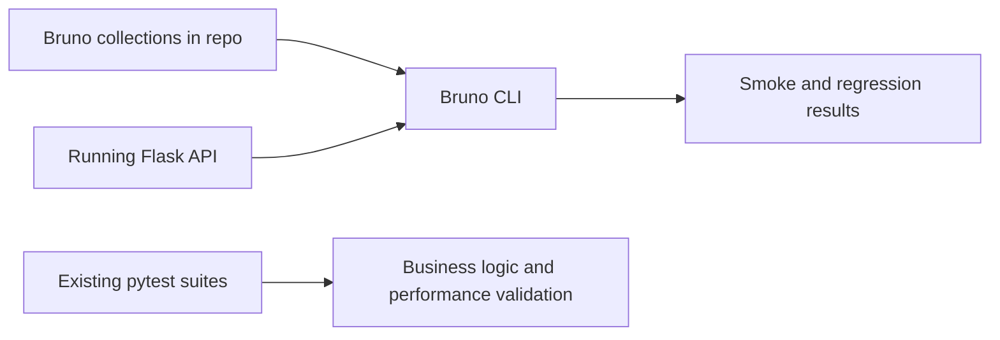
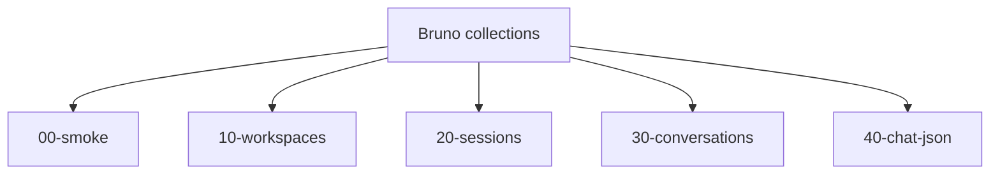

# How To Adopt Bruno In This Repository

Date: 2026-03-27

## 1. Purpose

This guide explains how to adopt [Bruno](https://www.usebruno.com/) in this repository as a Git-native, collection-oriented API testing layer for smoke and regression workflows.

The goal is to replace ad hoc or stale exported collection assets with repository-owned request suites that developers can review, run locally, and execute headlessly in CI.[1][2]

## 2. Why Bruno Fits This Repository

Bruno is a strong fit here because:

1. It stores collections as plain text files in the repository.[1]
2. Its CLI supports headless collection execution and report generation for CI/CD.[2]
3. The current repository already treats exported Postman artifacts as non-authoritative by ignoring them in [.gitignore](.gitignore#L141-L147).[3]
4. The repository already has a documented local API startup workflow and management API validation path in [specs/stm-phase-cde/quickstart.md](specs/stm-phase-cde/quickstart.md#L7-L23).[4]

> [!IMPORTANT]
> Use Bruno for curated smoke and regression flows. Keep authored `pytest` suites as the deeper layer for business logic, ownership rules, and performance assertions.

## 3. Recommended Adoption Model

Use Bruno for:

1. Smoke tests
2. Request-level regression checks
3. Management API lifecycle flows
4. Developer-facing exploratory runs backed by committed assets

Do not use Bruno as the main schema-fuzzing or OpenAPI conformance tool. Use it as a repository-owned request suite layer.

### 3.1 Architecture View



## 4. Recommended Repository Layout

Recommended structure:

1. `docs/testing/bruno/`
2. `docs/testing/bruno/collections/`
3. `docs/testing/bruno/environments/`

Recommended collection folders:

1. `00-smoke`
2. `10-workspaces`
3. `20-sessions`
4. `30-conversations`
5. `40-chat-json`

Recommended environment files:

1. `local`
2. `ci`

This keeps Bruno assets clearly separated from Python tests while remaining repository-owned and reviewable.

## 5. Local Setup

### 5.1 Install Bruno CLI

Use the Bruno app and CLI according to the official docs:

1. [Bruno homepage](https://www.usebruno.com/)
2. [Bruno CLI overview](https://docs.usebruno.com/bru-cli/overview)

If using Node-based execution in CI or locally, the Bruno CLI docs should remain the source of truth for the exact installation method.

### 5.2 Start Local Dependencies

The repository already documents the local startup path in [specs/stm-phase-cde/quickstart.md](specs/stm-phase-cde/quickstart.md#L7-L12):

```powershell
docker-compose up -d mongodb redis
python src\data\migration\db_setup.py
python src\main.py --mode web
```

### 5.3 Set Required Headers And Variables

The management API requires `X-User-ID` and the quickstart shows the expected local header format in [specs/stm-phase-cde/quickstart.md](specs/stm-phase-cde/quickstart.md#L13-L23).[4]

Recommended shared collection variables:

1. `baseUrl`
2. `userId`
3. `workspace_id`
4. `session_id`
5. `conversation_id`

## 6. Suggested Collection Design

### 6.1 Smoke Collection

Start with:

1. `GET /api/health`
2. `GET /api/config`
3. `GET /api/models/openai/selected`

### 6.2 Workspace Collection

Add:

1. Create workspace
2. List workspaces
3. Get workspace detail
4. Update workspace
5. Archive workspace

### 6.3 Session Collection

Add:

1. Create session
2. Get session detail
3. Update session
4. Close session
5. Archive session

### 6.4 Conversation Collection

Add:

1. Create conversation
2. List conversations
3. Get conversation detail
4. Get conversation summary
5. Archive conversation

### 6.5 Chat JSON Collection

Add:

1. Non-streaming chat success
2. Conversation reuse with `conversation_id`
3. Archived conversation rejection

## 7. Example Local Workflow

Recommended sequence:

1. Start the local stack
2. Run Bruno smoke suite
3. Run Bruno management lifecycle suites
4. Run targeted `pytest` integration tests when changing route or service logic

## 8. Example Collection Strategy

Use a domain-oriented structure instead of a single large collection.



This makes suites easier to run independently in CI and easier to review in pull requests.

## 9. CLI Usage Pattern

The Bruno CLI documentation should remain authoritative for exact commands and options.[2]

Practical local pattern:

1. Run a smoke collection first
2. Run a single domain collection while developing
3. Run all collections in CI

Because Bruno CLI supports reports in JSON, JUnit, and HTML, prefer JUnit in CI for result publishing.[2]

## 10. CI Integration Pattern

Recommended CI sequence:

1. Install application dependencies
2. Start MongoDB and Redis
3. Run migrations
4. Start API server
5. Wait for `/api/health`
6. Run Bruno smoke suite
7. Run Bruno management lifecycle suites
8. Publish Bruno reports

### 10.1 Example GitHub Actions Shape

```yaml
name: Bruno API Smoke Tests

on:
  pull_request:
  push:
    branches: [main, stm-phase-cde]

jobs:
  bruno-tests:
    runs-on: ubuntu-latest

    services:
      mongodb:
        image: mongo:5
        ports:
          - 27017:27017
      redis:
        image: redis:6.2
        ports:
          - 6379:6379

    steps:
      - uses: actions/checkout@v4

      - uses: actions/setup-python@v5
        with:
          python-version: "3.11"

      - name: Install backend dependencies
        run: |
          python -m pip install --upgrade pip
          pip install -r requirements.txt

      - name: Run migrations
        run: python src/data/migration/db_setup.py

      - name: Start API
        run: |
          nohup python src/main.py --mode web > api.log 2>&1 &
          sleep 10

      - name: Wait for health
        run: |
          for i in {1..30}; do
            curl -fsS http://localhost:5000/api/health && exit 0
            sleep 2
          done
          cat api.log
          exit 1

      - name: Run Bruno collections
        run: |
          echo "Run Bruno CLI here against docs/testing/bruno/collections"
```

The exact Bruno CLI command should follow the current Bruno CLI documentation for your chosen installation model.[2]

## 11. Best Practices

| Practice | Why It Matters |
|---|---|
| Keep collections small and domain-focused | Makes failures easier to triage |
| Make folders independently runnable | Improves local debugging and CI composability |
| Treat OpenAPI as canonical | Prevents Bruno from becoming a second schema source |
| Keep secrets outside committed files | Protects local and CI credentials |
| Use Bruno for smoke and regression, not latency budgets | Avoids overlapping with existing performance suites |
| Pair Bruno with existing pytest suites | Preserves deeper behavioral coverage already in the repository |

## 12. Risks And Mitigations

| Risk | Why It Matters | Mitigation |
|---|---|---|
| Collections drift from the OpenAPI contract | A workflow suite can become outdated even when it still passes | Review Bruno collection changes together with OpenAPI changes |
| Overlap with existing pytest integration suites | Adds maintenance cost without enough added value | Keep Bruno focused on black-box smoke and regression flows |
| Chained suites become brittle | Long sequences are harder to debug and more sensitive to state drift | Keep suites short and independently runnable |

## 13. Recommended Adoption Sequence

1. Create the Bruno folder structure in the repository
2. Build the smoke collection first
3. Build workspace, session, and conversation lifecycle collections
4. Add CI execution for smoke collections
5. Expand to broader regression coverage only after the suite is stable

## 14. References

### External

[1] Bruno homepage. https://www.usebruno.com/

[2] Bruno CLI overview. https://docs.usebruno.com/bru-cli/overview

### Project Evidence

[3] Gitignored Postman export assets in [.gitignore](.gitignore#L141-L147)

[4] Local validation path in [specs/stm-phase-cde/quickstart.md](specs/stm-phase-cde/quickstart.md#L7-L23)