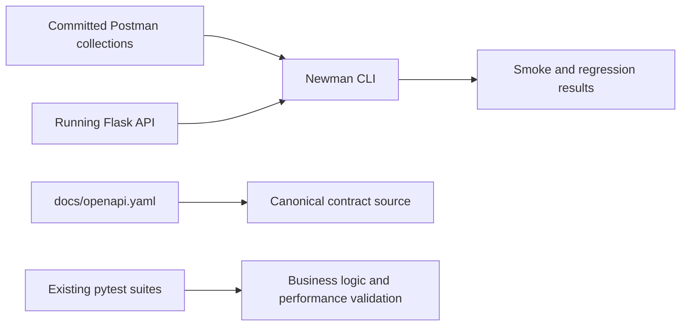

# How To Adopt Newman CLI In This Repository

Date: 2026-03-27

## 1. Purpose

This guide explains how to adopt [Newman CLI](https://learning.postman.com/docs/collections/using-newman-cli/) in this repository as a headless runner for Postman collections in local development and CI.

The goal is not to replace the repository's existing `pytest` integration tests or the recommended Schemathesis contract layer. The goal is to add a collection-driven smoke and regression layer that can run predictably from the command line.[1][4][5]

## 2. Why Newman Can Fit This Repository

Newman can fit here because:

1. It provides a dedicated CLI for running Postman collections in local and CI environments.[1]
2. Postman supports OpenAPI-centered spec workflows through Spec Hub, which makes collection-driven testing feasible in teams that already exchange Postman assets.[2]
3. The repository already has a documented local backend startup workflow and management API validation path in [specs/stm-phase-cde/quickstart.md](specs/stm-phase-cde/quickstart.md#L1-L76).[6]
4. The repository already has API contract and lifecycle tests, so Newman can be added as a focused black-box smoke layer instead of carrying all API assurance alone.[4][5]

There is one important constraint:

1. The current exported Postman assets are ignored in [.gitignore](.gitignore#L141-L147) and the existing Postman-specific spec export is stale, so a Newman adoption must deliberately correct that source-of-truth problem instead of extending it.[7][8]

> [!IMPORTANT]
> Use Newman for curated smoke and regression flows. Keep [docs/openapi.yaml](docs/openapi.yaml#L1-L25) as the canonical contract, and do not treat generated or exported Postman assets as the primary source of truth.[3][7][8]

## 3. Recommended Adoption Model

Use Newman for:

1. Fast smoke suites
2. Curated regression flows
3. Management API lifecycle checks
4. CI-friendly black-box validation of committed request collections

Do not use Newman as the main schema-conformance or negative-fuzzing layer.

Keep other layers for:

1. OpenAPI-driven contract and negative testing with Schemathesis
2. Lifecycle semantics and service behavior with authored `pytest` suites
3. Performance and latency budgets with the existing performance tests

### 3.1 Architecture View



## 4. Recommended Repository Layout

Recommended structure:

1. `docs/testing/postman/`
2. `docs/testing/postman/collections/`
3. `docs/testing/postman/environments/`
4. `reports/newman/`

Recommended collection folders:

1. `00-smoke`
2. `10-workspaces`
3. `20-sessions`
4. `30-conversations`
5. `40-chat-json`

Recommended environment files:

1. `local.postman_environment.json`
2. `ci.postman_environment.json`

Do not revive the currently ignored `docs/postman/` export path as-is. Either remove the ignore rules for the new authoritative assets or place the maintained Newman assets in `docs/testing/postman/` so they are clearly reviewable in Git.[7]

## 5. Local Setup

### 5.1 Install Newman CLI

Common installation paths:

```powershell
npm install --global newman
```

or, if you want project-local execution:

```powershell
npm install --save-dev newman
```

Use the official Newman docs as the authoritative source for install and execution options.[1]

### 5.2 Start Local Dependencies

The repository already documents the local startup path in [specs/stm-phase-cde/quickstart.md](specs/stm-phase-cde/quickstart.md#L7-L12):

```powershell
docker-compose up -d mongodb redis
python src\data\migration\db_setup.py
python src\main.py --mode web
```

### 5.3 Set Required Headers And Variables

The management API requires `X-User-ID`, and the quickstart shows the expected local value shape in [specs/stm-phase-cde/quickstart.md](specs/stm-phase-cde/quickstart.md#L13-L23).[6]

Recommended environment variables:

1. `baseUrl`
2. `userId`
3. `workspace_id`
4. `session_id`
5. `conversation_id`

Keep secrets and environment-specific values out of committed collection files.

## 6. Suggested Collection Design

### 6.1 Smoke Collection

Start with:

1. `GET /api/health`
2. `GET /api/config`
3. `GET /api/models/openai/selected`

### 6.2 Workspace Collection

Add:

1. Create workspace
2. List workspaces
3. Get workspace detail
4. Update workspace
5. Archive workspace

### 6.3 Session Collection

Add:

1. Create session
2. Get session detail
3. Update session
4. Close session
5. Archive session

### 6.4 Conversation Collection

Add:

1. Create conversation
2. List conversations
3. Get conversation detail
4. Get conversation summary
5. Archive conversation

### 6.5 Chat JSON Collection

Add:

1. Non-streaming chat success
2. Conversation reuse with `conversation_id`
3. Archived conversation rejection

## 7. Minimal First Pass

Start with a single smoke collection and a local environment file.

Example shape:

```powershell
newman run .\docs\testing\postman\collections\00-smoke\smoke.postman_collection.json `
  -e .\docs\testing\postman\environments\local.postman_environment.json
```

If Newman is installed locally in the project instead of globally, use `npx newman`.

## 8. Example Local Workflow

Recommended sequence:

1. Start the local stack
2. Run Newman smoke suite
3. Run Newman lifecycle suite for the area you are changing
4. Run targeted `pytest` integration tests when working on route or service changes

Recommended commands:

```powershell
docker-compose up -d mongodb redis
python src\data\migration\db_setup.py
python src\main.py --mode web
newman run .\docs\testing\postman\collections\00-smoke\smoke.postman_collection.json -e .\docs\testing\postman\environments\local.postman_environment.json
python -m pytest tests/integration/test_management_api_contracts.py -q
```

## 9. CLI Usage Pattern

Practical pattern:

1. Run a smoke collection first
2. Run one domain collection while developing
3. Run all committed collections in CI

Useful CI-shaped command:

```powershell
newman run .\docs\testing\postman\collections\00-smoke\smoke.postman_collection.json `
  -e .\docs\testing\postman\environments\ci.postman_environment.json `
  --reporters cli,junit `
  --reporter-junit-export .\reports\newman\smoke.xml
```

Because Newman supports reporters and CI execution, prefer machine-readable output such as JUnit in automated pipelines.[1]

## 10. CI Integration Pattern

Recommended CI sequence:

1. Install application dependencies
2. Install Newman
3. Start MongoDB and Redis
4. Run migrations
5. Start API server
6. Wait for `/api/health`
7. Run Newman smoke suite
8. Run Newman lifecycle suites
9. Publish Newman reports

### 10.1 Example GitHub Actions Shape

```yaml
name: Newman API Smoke Tests

on:
  pull_request:
  push:
    branches: [main, stm-phase-cde]

jobs:
  newman-tests:
    runs-on: ubuntu-latest

    services:
      mongodb:
        image: mongo:5
        ports:
          - 27017:27017
      redis:
        image: redis:6.2
        ports:
          - 6379:6379

    steps:
      - uses: actions/checkout@v4

      - uses: actions/setup-python@v5
        with:
          python-version: "3.11"

      - uses: actions/setup-node@v4
        with:
          node-version: "20"

      - name: Install backend dependencies
        run: |
          python -m pip install --upgrade pip
          pip install -r requirements.txt

      - name: Install Newman
        run: npm install --global newman

      - name: Run migrations
        run: python src/data/migration/db_setup.py

      - name: Start API
        run: |
          nohup python src/main.py --mode web > api.log 2>&1 &
          sleep 10

      - name: Wait for health
        run: |
          for i in {1..30}; do
            curl -fsS http://localhost:5000/api/health && exit 0
            sleep 2
          done
          cat api.log
          exit 1

      - name: Run Newman smoke suite
        run: |
          newman run docs/testing/postman/collections/00-smoke/smoke.postman_collection.json \
            -e docs/testing/postman/environments/ci.postman_environment.json \
            --reporters cli,junit \
            --reporter-junit-export reports/newman/smoke.xml
```

## 11. Best Practices

| Practice | Why It Matters |
|---|---|
| Keep `docs/openapi.yaml` canonical | Newman collections should validate workflow behavior, not replace the API contract source.[3] |
| Commit maintained collections in a reviewable path | The repo already shows the drift risk of ignored export artifacts.[7][8] |
| Keep suites short and domain-focused | Smaller suites are easier to debug and less brittle in CI. |
| Use Newman for black-box flows, not full contract assurance | Schemathesis and authored `pytest` suites cover different failure classes better.[4][5] |
| Publish JUnit from CI | Machine-readable results integrate more cleanly into CI reporting.[1] |
| Inject secrets and environment values at runtime | Prevents credential leakage and reduces environment drift. |

## 12. Risks And Mitigations

| Risk | Why It Matters | Mitigation |
|---|---|---|
| Collection drift from the OpenAPI contract | Collections can silently become inaccurate when endpoints evolve | Keep `docs/openapi.yaml` canonical and review collection updates together with API changes.[3][8] |
| Workspace-centric asset sprawl | Unreviewed Postman exports become a second source of truth | Keep only committed Newman assets authoritative and avoid ad hoc export files.[7] |
| Duplication with `pytest` integration tests | Overlap increases maintenance without increasing coverage much | Keep Newman focused on black-box smoke and lifecycle flows.[4][5] |
| CI runtime growth | Too many long collections reduce fast feedback | Split smoke checks for pull requests and broader suites for scheduled or main-branch runs. |

## 13. Adoption Decision

Adopt Newman if the team wants a Postman-compatible, collection-driven smoke and regression layer that runs headlessly in local and CI workflows.[1]

Do not adopt Newman as the only new API testing layer for this repository. It is most effective here as a secondary workflow-validation layer below the canonical OpenAPI contract and alongside existing `pytest` suites.[3][4][5][7][8]

## 14. References

### 14.1 External Sources

[1] Postman Newman CLI documentation. https://learning.postman.com/docs/collections/using-newman-cli/

[2] Postman Spec Hub. https://www.postman.com/product/spec-hub/

[3] Postman Workspaces product page. https://www.postman.com/product/workspaces/

### 14.2 Project Evidence

[4] Existing API contract suites in [tests/integration/test_management_api_contracts.py](tests/integration/test_management_api_contracts.py#L1-L15)

[5] Existing API latency suites in [tests/performance/test_management_api_latency.py](tests/performance/test_management_api_latency.py#L1-L29)

[6] Local startup and management API validation flow in [specs/stm-phase-cde/quickstart.md](specs/stm-phase-cde/quickstart.md#L1-L76)

[7] Gitignored Postman export assets in [.gitignore](.gitignore#L141-L147)

[8] Stale Postman-specific OpenAPI export in [docs/postman/specs/Stock Investment Assistant API/openapi.yaml](docs/postman/specs/Stock%20Investment%20Assistant%20API/openapi.yaml#L1-L20)