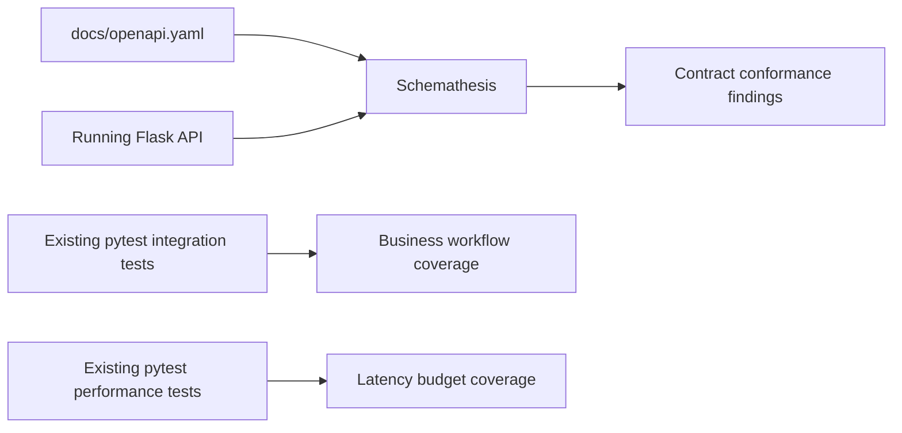

# How To Adopt Schemathesis In This Repository

Date: 2026-03-27

## 1. Purpose

This guide explains how to adopt [Schemathesis](https://schemathesis.readthedocs.io/en/stable/) in this repository as a schema-driven REST API validation layer.

The goal is not to replace existing `pytest` integration or performance tests. The goal is to add automated OpenAPI conformance and negative-case coverage on top of the existing test base.[1][2][3]

## 2. Why Schemathesis Fits This Repository

Schemathesis is a strong fit here because:

1. It uses the API schema as the single source of truth.[4][5]
2. It integrates with `pytest` and CI/CD workflows.[4][5]
3. This repository already has an OpenAPI 3.1 contract in [docs/openapi.yaml](docs/openapi.yaml#L1-L25).[1]
4. This repository already uses `pytest` as the main test runner in [pytest.ini](pytest.ini#L1-L6).[2]
5. The repository already has authored API contract and performance tests that Schemathesis can complement rather than replace in [tests/integration/test_management_api_contracts.py](tests/integration/test_management_api_contracts.py#L1-L15) and [tests/performance/test_management_api_latency.py](tests/performance/test_management_api_latency.py#L1-L29).[3]

> [!IMPORTANT]
> Use Schemathesis for schema-driven contract validation and negative testing. Keep existing authored `pytest` suites for lifecycle semantics, performance budgets, and complex multi-step behaviors.

## 3. Recommended Adoption Model

Use Schemathesis for:

1. OpenAPI response conformance
2. Request validation edge cases
3. Boundary-condition discovery
4. CI regression checks against a running API

Keep authored tests for:

1. Workspace, session, and conversation lifecycle semantics
2. Ownership and authorization logic
3. Performance and latency budgets
4. Streaming and provider-specific runtime behavior

### 3.1 Architecture View



## 4. Repository Layout

Recommended additions:

1. `tests/api_contract/`
2. `tests/api_contract/test_openapi_schemathesis.py`
3. Optional configuration file if the team wants a dedicated Schemathesis profile

Recommended role of the new folder:

1. Keep it narrow and OpenAPI-focused
2. Do not copy existing workflow assertions from integration tests
3. Prefer focused operation-level validation over large scenario scripts

## 5. Local Setup

### 5.1 Install Dependencies

If you use the project virtual environment:

```powershell
.\.venv\Scripts\Activate.ps1
python -m pip install schemathesis
```

If you manage dependencies in project requirements or a dev-specific file, add Schemathesis there instead of ad hoc local installation.

References:

1. [Schemathesis documentation](https://schemathesis.readthedocs.io/en/stable/)
2. [Schemathesis quick start](https://schemathesis.readthedocs.io/en/stable/quick-start/)

### 5.2 Start Local Dependencies

The repository already documents the local backend path in [specs/stm-phase-cde/quickstart.md](specs/stm-phase-cde/quickstart.md#L7-L12):

```powershell
docker-compose up -d mongodb redis
python src\data\migration\db_setup.py
python src\main.py --mode web
```

### 5.3 Verify Health First

Before running contract validation, verify that the API is up:

```powershell
Invoke-RestMethod -Method Get -Uri http://localhost:5000/api/health
```

## 6. Minimal First Pass

Start with a safe, focused command against the local OpenAPI file and running server.

```powershell
schemathesis run .\docs\openapi.yaml --url http://localhost:5000
```

This broad command is useful for discovery, but it is not the best long-term CI profile for this repository.

## 7. Recommended First Test Scope

Begin with stable endpoints:

1. `GET /api/health`
2. `GET /api/config`
3. Stable `GET` management endpoints

Delay or constrain:

1. Streaming endpoints such as `/api/chat` with SSE behavior
2. Provider-sensitive routes that may touch upstream services
3. Highly stateful mutation flows until headers, auth, and test isolation are stable

## 8. Suggested First Test File

Create a small, focused `pytest`-integrated contract file under `tests/api_contract/`.

Example starter shape:

```python
import schemathesis

schema = schemathesis.openapi.from_path("docs/openapi.yaml")


@schema.parametrize()
def test_api_schema(case):
    response = case.call(base_url="http://localhost:5000")
    case.validate_response(response)
```

For this repository, you will likely want to add filtering and header injection quickly, especially for the management API.

## 9. Required Header Strategy

The management API requires `X-User-ID` ownership scoping in [docs/openapi.yaml](docs/openapi.yaml#L49-L63) and the STM quickstart already demonstrates the required header usage in [specs/stm-phase-cde/quickstart.md](specs/stm-phase-cde/quickstart.md#L13-L23).[1]

Recommended strategy:

1. Add a reusable test helper or hook to inject `X-User-ID`
2. Use a stable test user value that your local environment accepts
3. Keep that header logic centralized rather than scattering it across operations

## 10. Filtering Strategy

Use explicit allowlists in early adoption.

Good first filters:

1. Only `GET` methods
2. Only non-streaming endpoints
3. Only endpoints that do not require fragile state setup

Reason:

1. It keeps the first CI integration deterministic
2. It reduces false positives
3. It lets the team learn how the tool behaves before broadening coverage

## 11. Local Developer Workflow

Recommended local flow:

1. Activate virtual environment
2. Start MongoDB and Redis
3. Run migrations
4. Start Flask web server
5. Run targeted unit and integration tests
6. Run Schemathesis allowlisted contract checks

Recommended commands:

```powershell
.\.venv\Scripts\Activate.ps1
docker-compose up -d mongodb redis
python src\data\migration\db_setup.py
python src\main.py --mode web
python -m pytest tests/integration/test_management_api_contracts.py -q
schemathesis run .\docs\openapi.yaml --url http://localhost:5000
```

## 12. CI Integration Pattern

Recommended CI sequence:

1. Install Python dependencies
2. Start MongoDB and Redis or equivalent services
3. Run migrations
4. Start API server
5. Wait for `/api/health`
6. Run Schemathesis profile
7. Run selected authored `pytest` suites

### 12.1 Example GitHub Actions Shape

```yaml
name: Schemathesis Contract Tests

on:
  pull_request:
  push:
    branches: [main, stm-phase-cde]

jobs:
  contract-tests:
    runs-on: ubuntu-latest

    services:
      mongodb:
        image: mongo:5
        ports:
          - 27017:27017
      redis:
        image: redis:6.2
        ports:
          - 6379:6379

    steps:
      - uses: actions/checkout@v4

      - uses: actions/setup-python@v5
        with:
          python-version: "3.11"

      - name: Install dependencies
        run: |
          python -m pip install --upgrade pip
          pip install -r requirements.txt
          pip install schemathesis

      - name: Run migrations
        run: python src/data/migration/db_setup.py

      - name: Start API
        run: |
          nohup python src/main.py --mode web > api.log 2>&1 &
          sleep 10

      - name: Wait for health
        run: |
          for i in {1..30}; do
            curl -fsS http://localhost:5000/api/health && exit 0
            sleep 2
          done
          cat api.log
          exit 1

      - name: Run Schemathesis
        run: |
          schemathesis run docs/openapi.yaml --url http://localhost:5000
```

## 13. Best Practices

| Practice | Why It Matters |
|---|---|
| Keep [docs/openapi.yaml](docs/openapi.yaml) authoritative | Prevents test-specific schema drift |
| Start with an allowlist | Makes failures actionable and CI stable |
| Keep performance checks in existing pytest performance suites | Schemathesis is for contract and robustness testing, not latency budgets |
| Gate provider-sensitive endpoints carefully | Avoids noisy CI failures caused by upstream dependencies |
| Centralize auth and header injection | Keeps tests maintainable |
| Expand coverage gradually | Prevents early abandonment due to noisy adoption |

## 14. Risks And Mitigations

| Risk | Why It Matters | Mitigation |
|---|---|---|
| Broad first-run coverage is noisy | Can create low trust in the tool | Start with a safe allowlist of endpoints and methods |
| OpenAPI drift causes false positives | Test failures may reflect schema issues rather than runtime bugs | Treat schema maintenance as part of the implementation lifecycle |
| Stateful endpoints produce brittle failures | Mutation and sequencing can be hard to stabilize | Add stateful or mutation-heavy endpoints later |
| CI gets slower | Reduces pull-request feedback quality | Use a focused PR profile and a broader nightly profile |

## 15. Recommended Adoption Sequence

1. Install Schemathesis locally
2. Validate the local API against a small endpoint allowlist
3. Add one `pytest`-integrated contract test file under `tests/api_contract/`
4. Add CI execution for the focused profile
5. Expand to more management endpoints
6. Reassess coverage boundaries after the first few failures are triaged

## 16. References

### External

[4] Schemathesis homepage. https://schemathesis.io/

[5] Schemathesis documentation. https://schemathesis.readthedocs.io/en/stable/

### Project Evidence

[1] OpenAPI contract in [docs/openapi.yaml](docs/openapi.yaml#L1-L25)

[2] `pytest` conventions in [pytest.ini](pytest.ini#L1-L6)

[3] Existing integration and performance suites in [tests/integration/test_management_api_contracts.py](tests/integration/test_management_api_contracts.py#L1-L15) and [tests/performance/test_management_api_latency.py](tests/performance/test_management_api_latency.py#L1-L29)