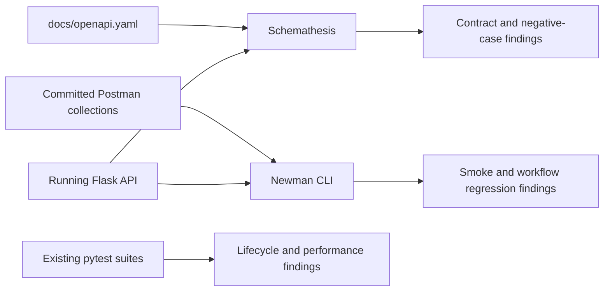

# How To Adopt Schemathesis And Newman CLI Together In This Repository

Date: 2026-03-27

## 1. Purpose

This guide explains how to adopt [Schemathesis](https://schemathesis.readthedocs.io/en/stable/) and [Newman CLI](https://learning.postman.com/docs/collections/using-newman-cli/) together in this repository as a layered API testing model.

The goal is not to replace the repository's existing `pytest` integration and performance tests. The goal is to combine:

1. OpenAPI-driven contract and negative testing with Schemathesis
2. Collection-driven smoke and workflow regression checks with Newman
3. Existing authored `pytest` suites for lifecycle semantics, ownership rules, and latency budgets[1][2][3][4]

> [!IMPORTANT]
> This hybrid model only works cleanly if [docs/openapi.yaml](docs/openapi.yaml#L1-L25) remains the single canonical API contract and Newman collections are treated as a secondary workflow-validation layer rather than a competing source of truth.[1][5][6]

## 2. When To Choose This Combined Option

Choose the combined model when all of the following are true:

1. The team wants Schemathesis-level contract and negative-case coverage from the OpenAPI schema.[7][8]
2. The team also wants Newman-compatible collections for smoke suites or Postman-oriented collaboration.[9]
3. The team is willing to maintain clear ownership boundaries between the schema, the collections, and the existing `pytest` suites.

Do not choose this combined model if the team only needs one of those layers.

For this repository, the combined model is viable, but it is more operationally expensive than the simpler recommendation of Schemathesis plus Bruno.[5][6]

## 3. Recommended Layering Model

Use each layer for a different class of problem.

Use Schemathesis for:

1. OpenAPI conformance validation
2. Negative input exploration
3. Boundary-condition discovery
4. CI contract verification against a running API

Use Newman for:

1. Fast smoke checks
2. Curated regression flows
3. Black-box request validation for stable management and chat JSON paths
4. Postman-compatible collection execution in local and CI environments

Keep authored `pytest` suites for:

1. Workspace, session, and conversation lifecycle semantics
2. Ownership and authorization rules
3. Performance and latency budgets
4. Streaming and provider-specific runtime behaviors

### 3.1 Architecture View



## 4. Why This Model Can Fit This Repository

This repository already has the three ingredients required for the combined approach:

1. An OpenAPI 3.1 contract in [docs/openapi.yaml](docs/openapi.yaml#L1-L25).[1]
2. A `pytest`-based testing workflow in [pytest.ini](pytest.ini#L1-L6).[2]
3. Existing contract and performance suites in [tests/integration/test_management_api_contracts.py](tests/integration/test_management_api_contracts.py#L1-L15) and [tests/performance/test_management_api_latency.py](tests/performance/test_management_api_latency.py#L1-L29).[3][4]

There is also a repo-specific constraint that matters:

1. The current exported Postman assets are ignored in [.gitignore](.gitignore#L141-L147), and the old Postman-specific spec export is stale, so Newman assets must be reintroduced as explicitly maintained, reviewable files instead of ad hoc exports.[5][6]

## 5. Recommended Repository Layout

Recommended structure:

1. `tests/api_contract/`
2. `tests/api_contract/test_openapi_schemathesis.py`
3. `docs/testing/postman/`
4. `docs/testing/postman/collections/`
5. `docs/testing/postman/environments/`
6. `reports/newman/`

Recommended Newman collection folders:

1. `00-smoke`
2. `10-workspaces`
3. `20-sessions`
4. `30-conversations`
5. `40-chat-json`

Recommended design rule:

1. Keep the contract layer in Python test space
2. Keep the collection layer in a clearly reviewable docs or api-tests path
3. Do not place authoritative Newman assets back into the currently ignored export path

## 6. Local Setup

### 6.1 Install Dependencies

If you use the project virtual environment:

```powershell
.\.venv\Scripts\Activate.ps1
python -m pip install schemathesis
npm install --global newman
```

If you prefer project-local Node execution for Newman, use `npm install --save-dev newman` and run it through `npx`.

References:

1. [Schemathesis documentation](https://schemathesis.readthedocs.io/en/stable/)
2. [Newman CLI documentation](https://learning.postman.com/docs/collections/using-newman-cli/)

### 6.2 Start Local Dependencies

The repository already documents the local backend path in [specs/stm-phase-cde/quickstart.md](specs/stm-phase-cde/quickstart.md#L7-L12):

```powershell
docker-compose up -d mongodb redis
python src\data\migration\db_setup.py
python src\main.py --mode web
```

### 6.3 Verify Health First

Before running either tool, verify that the API is up:

```powershell
Invoke-RestMethod -Method Get -Uri http://localhost:5000/api/health
```

## 7. Required Header And Variable Strategy

The management API requires `X-User-ID` ownership scoping, and the STM quickstart shows the expected local header shape in [specs/stm-phase-cde/quickstart.md](specs/stm-phase-cde/quickstart.md#L13-L23).[10]

Recommended shared values:

1. `baseUrl`
2. `userId`
3. `workspace_id`
4. `session_id`
5. `conversation_id`

Recommended ownership model:

1. Centralize `X-User-ID` injection in Schemathesis hooks or helpers
2. Centralize the same user value in Newman environment files
3. Do not hardcode secrets or environment-specific values in committed files

## 8. Minimal First Pass

Start with one narrow check from each layer.

Schemathesis first-pass command:

```powershell
schemathesis run .\docs\openapi.yaml --url http://localhost:5000
```

Newman first-pass command:

```powershell
newman run .\docs\testing\postman\collections\00-smoke\smoke.postman_collection.json `
  -e .\docs\testing\postman\environments\local.postman_environment.json
```

These commands are intentionally broad examples. In real CI, keep both layers narrowly scoped at first.

## 9. Recommended First Scope

Begin with stable endpoints only.

Good first targets for both layers:

1. `GET /api/health`
2. `GET /api/config`
3. `GET /api/models/openai/selected`
4. Stable `GET` management endpoints

Delay or constrain:

1. Streaming endpoints such as `/api/chat` with SSE behavior
2. Provider-sensitive endpoints that may touch upstream dependencies
3. Highly stateful mutation flows until header, auth, and isolation patterns are stable

## 10. Suggested Responsibility Split

Use Schemathesis to answer:

1. Does the running API conform to the OpenAPI schema?
2. Do invalid or boundary inputs expose unhandled defects?
3. Are response shapes and status codes aligned with the contract?

Use Newman to answer:

1. Can a developer or CI job run the key management and smoke workflows end to end?
2. Do the black-box request sequences still behave as expected?
3. Can the Postman-compatible request assets execute headlessly?

Use `pytest` to answer:

1. Are lifecycle transitions correct?
2. Are ownership and authorization rules enforced?
3. Are performance budgets still met?

## 11. Local Developer Workflow

Recommended local flow:

1. Activate the virtual environment
2. Start MongoDB and Redis
3. Run migrations
4. Start the Flask web server
5. Run Newman smoke checks first
6. Run focused Schemathesis contract checks
7. Run targeted authored `pytest` suites

Recommended commands:

```powershell
.\.venv\Scripts\Activate.ps1
docker-compose up -d mongodb redis
python src\data\migration\db_setup.py
python src\main.py --mode web
newman run .\docs\testing\postman\collections\00-smoke\smoke.postman_collection.json -e .\docs\testing\postman\environments\local.postman_environment.json
schemathesis run .\docs\openapi.yaml --url http://localhost:5000
python -m pytest tests/integration/test_management_api_contracts.py -q
```

Reason for this order:

1. Newman smoke checks give a fast sanity signal that the app is reachable
2. Schemathesis then exercises the contract layer more broadly
3. Authored `pytest` tests remain the final semantic validation layer

## 12. CI Integration Pattern

Recommended CI sequence:

1. Install Python dependencies
2. Install Newman
3. Start MongoDB and Redis or equivalent services
4. Run migrations
5. Start the API server
6. Wait for `/api/health`
7. Run Newman smoke suite
8. Run focused Schemathesis profile
9. Run selected authored `pytest` suites
10. Publish Newman and test reports

### 12.1 Example GitHub Actions Shape

```yaml
name: API Hybrid Validation

on:
  pull_request:
  push:
    branches: [main, stm-phase-cde]

jobs:
  hybrid-api-tests:
    runs-on: ubuntu-latest

    services:
      mongodb:
        image: mongo:5
        ports:
          - 27017:27017
      redis:
        image: redis:6.2
        ports:
          - 6379:6379

    steps:
      - uses: actions/checkout@v4

      - uses: actions/setup-python@v5
        with:
          python-version: "3.11"

      - uses: actions/setup-node@v4
        with:
          node-version: "20"

      - name: Install backend dependencies
        run: |
          python -m pip install --upgrade pip
          pip install -r requirements.txt
          pip install schemathesis

      - name: Install Newman
        run: npm install --global newman

      - name: Run migrations
        run: python src/data/migration/db_setup.py

      - name: Start API
        run: |
          nohup python src/main.py --mode web > api.log 2>&1 &
          sleep 10

      - name: Wait for health
        run: |
          for i in {1..30}; do
            curl -fsS http://localhost:5000/api/health && exit 0
            sleep 2
          done
          cat api.log
          exit 1

      - name: Run Newman smoke suite
        run: |
          newman run docs/testing/postman/collections/00-smoke/smoke.postman_collection.json \
            -e docs/testing/postman/environments/ci.postman_environment.json \
            --reporters cli,junit \
            --reporter-junit-export reports/newman/smoke.xml

      - name: Run Schemathesis
        run: |
          schemathesis run docs/openapi.yaml --url http://localhost:5000

      - name: Run authored pytest suites
        run: |
          python -m pytest tests/integration/test_management_api_contracts.py -q
```

## 13. Guardrails

Keep these rules explicit from day one:

1. `docs/openapi.yaml` is the only canonical contract source.[1]
2. Newman collections validate workflows, not schema truth.[9]
3. Newman assets must live in a reviewable Git path, not in ignored export files.[5]
4. Pull requests should run only a fast subset of Newman and Schemathesis checks.
5. Broader mutation-heavy or stateful suites should run on main or on a schedule.
6. Existing `pytest` performance tests remain responsible for latency budgets.[4]

## 14. Risks And Mitigations

| Risk | Why It Matters | Mitigation |
|---|---|---|
| Two maintenance surfaces | The team must maintain both schema-driven and collection-driven assets | Keep responsibilities narrow and non-overlapping between the layers. |
| Newman collection drift | The repo already shows the risk of stale Postman exports | Keep only explicitly maintained Newman assets authoritative and review them with API changes.[5][6] |
| CI runtime growth | Running all three layers can slow pull request feedback | Run smoke subsets on pull requests and broader suites on main or scheduled workflows. |
| Confused ownership of failures | Teams can waste time if it is unclear which layer should catch what | Document the responsibility split and keep each layer focused on a distinct failure class. |

## 15. Adoption Decision

Adopt Schemathesis and Newman together only if the team explicitly needs both:

1. OpenAPI-driven contract and negative testing
2. Postman-compatible workflow collections executed headlessly in local and CI environments

For this repository, the combined model is workable but not the default best-fit path. Use it when Postman ecosystem compatibility is a real requirement, not just a nice-to-have.[5][6][7][8][9]

If the team does not need Postman compatibility, the simpler and better-aligned secondary layer remains Bruno.[5][6]

## 16. References

### 16.1 External Sources

[7] Schemathesis homepage. https://schemathesis.io/

[8] Schemathesis documentation. https://schemathesis.readthedocs.io/en/stable/

[9] Postman Newman CLI documentation. https://learning.postman.com/docs/collections/using-newman-cli/

### 16.2 Project Evidence

[1] OpenAPI 3.1 contract in [docs/openapi.yaml](docs/openapi.yaml#L1-L25)

[2] pytest-based test execution conventions in [pytest.ini](pytest.ini#L1-L6)

[3] Existing API contract suites in [tests/integration/test_management_api_contracts.py](tests/integration/test_management_api_contracts.py#L1-L15)

[4] Existing API latency suites in [tests/performance/test_management_api_latency.py](tests/performance/test_management_api_latency.py#L1-L29)

[5] Gitignored Postman export assets in [.gitignore](.gitignore#L141-L147)

[6] Stale Postman-specific OpenAPI export in [docs/postman/specs/Stock Investment Assistant API/openapi.yaml](docs/postman/specs/Stock%20Investment%20Assistant%20API/openapi.yaml#L1-L20)

[10] Local startup and management API validation flow in [specs/stm-phase-cde/quickstart.md](specs/stm-phase-cde/quickstart.md#L1-L76)